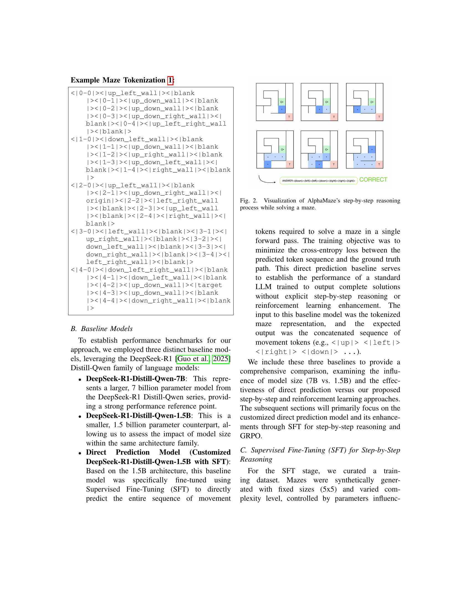

 


 2502.14669 
 Alan Dao et el. 
 
 🤗 2025-02-21 
 



↗ arXiv


↗ Hugging Face


↗ Papers with Code


### TL;DR



많은 연구들이 자연어 처리에서 뛰어난 성능을 보이는 대규모 언어 모델(LLM)을 개발해왔지만, **시각적 공간 추론**에는 여전히 어려움을 겪고 있습니다. 특히 **미로 탐색**과 같은 순차적 의사 결정이 필요한 작업에서는 더욱 그렇습니다.  기존의 시각-언어 모델(VLM)들은 패턴 인식 및 객체 식별에는 능숙하지만, 복잡한 공간 추론과 단계별 계획에는 취약합니다. 따라서 LLM에 시각적 공간 추론 능력을 부여하는 것은 인공지능의 발전에 중요한 과제입니다.

본 논문에서는 **지도 학습 미세 조정(SFT)**과 **그룹 상대 정책 최적화(GRPO)**라는 두 단계 학습 프레임워크를 통해 LLM의 미로 탐색 능력을 향상시키는 AlphaMaze를 제안합니다.  먼저, SFT를 사용하여 미로의 토큰화된 표현을 기반으로 단계별 이동 명령을 예측하는 능력을 학습시킵니다.  그 다음, GRPO를 통해 모델의 순차적 의사 결정 과정을 개선하고, **연쇄적 사고(Chain-of-Thought)** 행동을 유도하여 더욱 강력하고 자기 수정적인 추론 능력을 길러줍니다.  실험 결과, 기준 모델은 미로 탐색에 실패했지만, AlphaMaze는 93%의 정확도를 달성했습니다. 이는 제안된 방법이 LLM과 시각적 공간 작업 간의 간극을 메울 수 있음을 보여줍니다.



#### Key Takeaways


 GRPO 기반 강화 학습을 사용하여 LLM의 미로 탐색 정확도를 93%까지 향상시켰습니다. 



 새로운 미로 탐색 벤치마크인 MazeBench를 제시했습니다. 



 토큰화된 시각적 표현을 사용하여 LLM의 시각적 공간 추론 능력을 향상시키는 새로운 방법을 제시했습니다. 


#### Why does it matter?
본 논문은 **대규모 언어 모델(LLM)**의 공간 추론 능력 향상에 대한 중요한 연구이며, **로봇 공학, 자율 주행, 게임** 등 다양한 분야에 적용 가능한 혁신적인 방법을 제시합니다.  **GRPO 기법을 활용한 강화 학습**은 향후 LLM의 시각적 추론 능력 향상 연구에 중요한 이정표가 될 것이며, **새로운 벤치마크인 MazeBench**는 관련 연구의 발전에 기여할 것입니다.  또한, **토큰화된 시각적 표현**을 사용한 접근 방식은 다른 시각적 추론 작업에도 적용 가능성을 시사합니다.

------
#### Visual Insights

> 🔼 그림 1은 논문에서 사용된 예시 미로의 시각적 표현입니다. 간단한 격자형 미로로, 시작점과 목표점이 표시되어 있으며, 벽으로 막힌 부분과 이동 가능한 부분이 명확하게 구분되어 있습니다. 이 그림은 논문에서 제시하는 토큰화된 미로 표현 방식을 이해하는 데 도움을 줍니다.
> 

> 
read the caption

> Figure 1: Visual of the Example Maze
> 


| Model | SFT | GRPO | Score (%) |
|---|---|---|---|
| Baseline-1.5B | ✗ | ✗ | 0.0 |
| Baseline-7B | ✗ | ✗ | 0.0 |
| Baseline-1.5B (SFT) | ✓ | ✗ | 0.0 |
| AlphaMaze-SFT | ✓ | ✗ | 86.0 |
| AlphaMaze | ✓ | ✓ | **93.0** |

> 🔼 표 I은 MazeBench에서 다양한 모델의 미로 풀이 정확도를 비교 분석한 결과를 보여줍니다.  기준 모델(Baseline)과 지도학습 미세조정(SFT), 그리고 GRPO를 적용한 AlphaMaze 모델의 성능을 정량적으로 제시합니다.  각 모델의 미로 풀이 성공률(%)을 통해 SFT와 GRPO의 효과를 명확하게 보여줍니다.  Baseline 모델은 미로 풀이에 실패했지만, SFT를 통해 86%의 정확도를 달성했고,  GRPO를 추가 적용하여 93%까지 정확도를 향상시켰음을 알 수 있습니다.
> 

> 
read the caption

> TABLE I: Maze Solving Accuracy on MazeBench
> 

### Full paper



