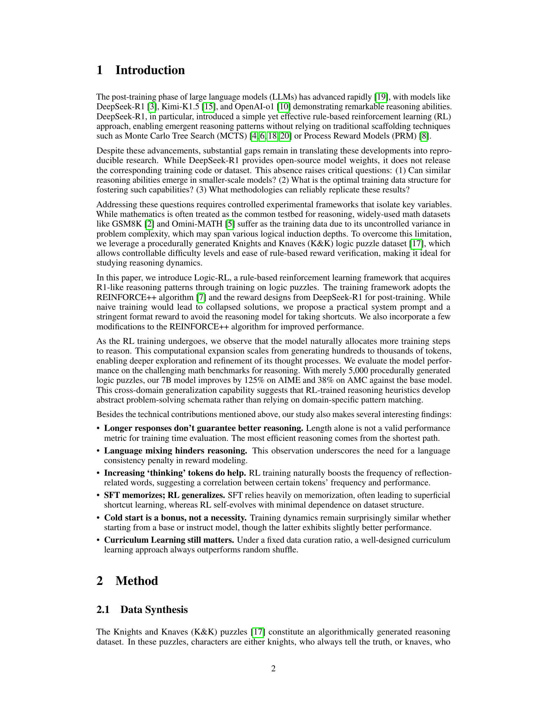

 


 2502.14768 
 Tian Xie et el. 
 
 🤗 2025-02-21 
 



↗ arXiv


↗ Hugging Face


↗ Papers with Code


### TL;DR



대규모 언어 모ë¸(LLM)ì˜ ì¶”ë¡  능력 í–¥ìƒì€ ì¸ê³µì§€ëŠ¥ ì—°êµ¬ì˜ ì£¼ìš” 과제ì…니다. 기존 ë°©ë²•ë“¤ì€ ë³µì¡í•˜ê±°ë‚˜ ì¬í˜„ì„±ì´ ë–¨ì–´ì§€ëŠ” 한계를 가지고 ìˆìŠµë‹ˆë‹¤. 본 논문ì—서는 **규칙 기반 ê°•í™” 학습(Logic-RL)**ì„ ì‚¬ìš©í•˜ì—¬ LLMì˜ ì¶”ë¡  ëŠ¥ë ¥ì„ í–¥ìƒì‹œí‚¤ëŠ” 새로운 ë°©ë²•ì„ ì œì‹œí•©ë‹ˆë‹¤. 특íˆ, **제어 가능한 ë³µì¡ì„±ì„ 가진 합성 논리 í¼ì¦ì„ 훈련 ë°ì´í„°**ë¡œ 사용하여 안정ì ì´ê³  효율ì ì¸ í•™ìŠµì„ ê°€ëŠ¥í•˜ê²Œ 하였습니다. 

Logic-RLì€ **ìƒê° ê³¼ì •ì„ ê°•ì¡°í•˜ëŠ” 시스템 프롬프트, ì§€ë¦„ê¸¸ì„ ë°©ì§€í•˜ëŠ” 엄격한 í˜•ì‹ ë³´ìƒ í•¨ìˆ˜, 그리고 안정ì ì¸ ìˆ˜ë ´ì„ ë‹¬ì„±í•˜ëŠ” 간단한 훈련 절차**를 ë„ì…했습니다. ê·¸ ê²°ê³¼, 7B 모ë¸ì€ 기존 논리 ë°ì´í„°ì…‹ì—서는 관찰ë˜ì§€ ì•Šì•˜ë˜ **반성, ê²€ì¦, 요약과 ê°™ì€ ê³ ê¸‰ 추론 능력**ì„ ê°œë°œí–ˆìŠµë‹ˆë‹¤.  ë”ìš± 놀ë¼ìš´ 것ì€, 단 5,000ê°œì˜ ë…¼ë¦¬ 문제로 학습시킨 후ì—ë„ **AIME ë° AMC와 ê°™ì€ ì–´ë ¤ìš´ 수학 문제 벤치마í¬ì—ì„œ ì¼ë°˜í™” 능력**ì„ ë³´ì˜€ë‹¤ëŠ” ì ì…니다. ì´ëŠ” Logic-RLì´ ë‹¨ìˆœ 패턴 ë§¤ì¹­ì´ ì•„ë‹Œ 추ìƒì  문제 í•´ê²° 체계를 í•™ìŠµí•¨ì„ ì‹œì‚¬í•©ë‹ˆë‹¤.



#### Key Takeaways


 규칙 기반 ê°•í™” í•™ìŠµì„ í†µí•´ 대규모 언어 모ë¸ì˜ 추론 능력 í–¥ìƒ 



 합성 논리 í¼ì¦ ë°ì´í„°ì…‹ì„ ì´ìš©í•œ 안정ì ì¸ 학습 ë° ì¼ë°˜í™” 성능 í™•ì¸ 



 수학 문제 벤치마í¬(AIME, AMC)ì—ì„œ 우수한 성능으로 실용성 ì…ì¦ 


#### Why does it matter?
본 ë…¼ë¬¸ì€ **규칙 기반 ê°•í™” í•™ìŠµì„ ì‚¬ìš©í•˜ì—¬ 대규모 언어 모ë¸ì˜ 추론 ëŠ¥ë ¥ì„ í–¥ìƒì‹œí‚¤ëŠ” 새로운 방법**ì„ ì œì‹œí•©ë‹ˆë‹¤.  ì´ëŠ” í˜„ì¬ ì—°êµ¬ ë™í–¥ê³¼ 밀접하게 ì—°ê´€ë˜ì–´ ìˆìœ¼ë©°, 추론 능력 í–¥ìƒì— 대한 새로운 ê°€ëŠ¥ì„±ì„ ì œì‹œí•©ë‹ˆë‹¤. ë˜í•œ, **다양한 ë¶„ì•¼ì˜ ì—°êµ¬ì들ì—게 ì˜í–¥**ì„ ë¯¸ì¹  수 ìˆëŠ” ì ì¬ë ¥ì„ 가지고 ìˆìŠµë‹ˆë‹¤. 특íˆ, **합성 논리 í¼ì¦ ë°ì´í„°ì…‹ì„ 사용하여 안정ì ì¸ í›ˆë ¨ì„ ë‹¬ì„±í•œ ì **ê³¼ **수학 문제 벤치마í¬ì—ì„œì˜ ì¼ë°˜í™” 성능**ì€ ì£¼ëª©í•  만합니다.  ì´ëŠ” 향후 연구를 위한 새로운 ë°©í–¥ì„ ì œì‹œí•  ë¿ ì•„ë‹ˆë¼, **실제 ì‘ìš© 분야ì—ì„œë„ ìœ ìš©ì„±**ì„ ê°€ì§ˆ 것으로 예ìƒë©ë‹ˆë‹¤.

------
#### Visual Insights

> 🔼 그림 1ì€ ê°•í™” 학습(RL) 훈련 중 모ë¸ì˜ ê²€ì¦ ì •í™•ë„와 í‰ê·  ì‘답 길ì´ë¥¼ ë³´ì—¬ì¤ë‹ˆë‹¤.  모ë¸ì´ 성능 í–¥ìƒì„ 위해 ë” ë§ì€ 'ìƒê°' ì—°ì‚°ì„ ìë™ìœ¼ë¡œ 할당하는 학습 ê³¼ì •ì„ ë³´ì—¬ì¤ë‹ˆë‹¤.  í¥ë¯¸ë¡­ê²Œë„, 모ë¸ì€ ì™„ì „íˆ ìƒˆë¡œìš´ ë°ì´í„°ì…‹(AIME, AMC)ì—ì„œë„ ë†€ë¼ìš´ ì¼ë°˜í™” ëŠ¥ë ¥ì„ ë³´ì—¬ì¤ë‹ˆë‹¤.  즉, 훈련 ë°ì´í„°ë¡œ 사용ë˜ì§€ ì•Šì€ ë¬¸ì œ 유형ì—ë„ ì˜ ì ìš©ë¨ì„ ì˜ë¯¸í•©ë‹ˆë‹¤.  ì‘답 길ì´ê°€ 길어ì§ì— ë”°ë¼ ê²€ì¦ ì •í™•ë„ê°€ í–¥ìƒë˜ëŠ” ê²½í–¥ì„ ë³´ì´ëŠ”ë°, ì´ëŠ” 모ë¸ì´ ë” ë³µì¡í•œ 추론 ê³¼ì •ì„ ê±°ì¹ ìˆ˜ë¡ ì •ë‹µë¥ ì´ ë†’ì•„ì§ì„ 시사합니다.
> 

> 
read the caption

> Figure 1: Validation accuracy and mean response length during RL training, illustrating how the model autonomously learns to allocate more thinking compute for improved performance. Remarkably, the model also demonstrates impressive generalization on completely unseen datasets (AIME, AMC).
> 


| Algorithm | Train Batch Size | Rollout N | KL Coef | Max Response Len |
|---|---|---|---|---|
| REINFORCE++ | 8 | 8 | 0.001 | 4096 |

> 🔼 í‘œ 1ì€ ë…¼ë¬¸ì˜ 2.4ì ˆ(훈련 ì¼ì •)ì—ì„œ Logic-RL ëª¨ë¸ í›ˆë ¨ì— ì‚¬ìš©ëœ ì£¼ìš” 하ì´í¼íŒŒë¼ë¯¸í„°ë“¤ì„ ë³´ì—¬ì¤ë‹ˆë‹¤.  ê° í•˜ì´í¼íŒŒë¼ë¯¸í„°ëŠ” 훈련 ê³¼ì •ì˜ ì•ˆì •ì„± ë° íš¨ìœ¨ì„±ì— ì˜í–¥ì„ 미치는 중요한 요소ì…니다. REINFORCE++ ì•Œê³ ë¦¬ì¦˜ì„ ì‚¬ìš©í•œ í›ˆë ¨ì— ëŒ€í•œ 세부 정보를 제공합니다.  여기ì—는 배치 í¬ê¸°(Batch Size), 롤아웃 수(Rollout N), KL 계수(KL Coef), 최대 ì‘답 길ì´(Max Response Len) ë“±ì´ í¬í•¨ë©ë‹ˆë‹¤.  ì´ í‘œëŠ” 논문ì—ì„œ ì œì‹œëœ í›ˆë ¨ ì„¤ì •ì„ ì´í•´í•˜ëŠ” ë° í•„ìˆ˜ì ì…니다.
> 

> 
read the caption

> Table 1: Important Training Parameters
> 

### In-depth insights

#### Logic-RL: Rule-Based RL
논문ì—ì„œ ì œì‹œëœ Logic-RL: Rule-Based RL ì ‘ê·¼ ë°©ì‹ì€ **규칙 기반 ê°•í™” 학습**ì„ ì‚¬ìš©í•˜ì—¬ 대규모 언어 모ë¸ì˜ 추론 ëŠ¥ë ¥ì„ í–¥ìƒì‹œí‚¤ëŠ” ë° ì´ˆì ì„ ë§ì¶”ê³  ìˆìŠµë‹ˆë‹¤.  합성 논리 í¼ì¦ ë°ì´í„°ì…‹ì„ 사용하여 **제어 가능한 ë³µì¡ì„±**ê³¼ **명확한 정답 ê²€ì¦**ì´ ê°€ëŠ¥í•˜ë‹¤ëŠ” ì ì´ 특징ì…니다.  **효율ì ì¸ í•™ìŠµì„ ìœ„í•´**, ìƒê° ê³¼ì •ì„ ê°•ì¡°í•˜ëŠ” 시스템 프롬프트, ì§€ë¦„ê¸¸ì„ ë°©ì§€í•˜ëŠ” 엄격한 í˜•ì‹ ë³´ìƒ í•¨ìˆ˜, 그리고 안정ì ì¸ ìˆ˜ë ´ì„ ë‹¬ì„±í•˜ëŠ” 간단한 학습 ë°©ë²•ì„ ì œì‹œí•©ë‹ˆë‹¤. Logic-RLì€ ë‹¨ìˆœí•œ 패턴 ë§¤ì¹­ì´ ì•„ë‹Œ **추ìƒì ì¸ 문제 í•´ê²° 체계**를 개발하여 AIME ë° AMC와 ê°™ì€ ì–´ë ¤ìš´ 수학 벤치마í¬ì—ì„œ ì¼ë°˜í™” ëŠ¥ë ¥ì„ ë³´ì—¬ì¤ë‹ˆë‹¤. **긴 ì‘ë‹µì´ í•­ìƒ ë” ë‚˜ì€ ì¶”ë¡ ì„ ë³´ì¥í•˜ëŠ” ê²ƒì€ ì•„ë‹ˆë©°**, 오íˆë ¤ 효율ì ì¸ ì¶”ë¡ ì€ ê°€ì¥ ì§§ì€ ê²½ë¡œì—ì„œ 나온다는 ì ì„ 발견했습니다. ë˜í•œ, **언어 í˜¼í•©ì€ ì¶”ë¡ ì„ ë°©í•´**하고, 'ìƒê°' 토í°ì˜ ì¦ê°€ëŠ” 성능 í–¥ìƒê³¼ ìƒê´€ê´€ê³„ê°€ ìˆë‹¤ëŠ” ì ë„ í¥ë¯¸ë¡œìš´ 발견ì…니다.  **SFT와 달리 RLì€ ì¼ë°˜í™” 능력**ì´ ë›°ì–´ë‚˜ë©°, 커리í˜ëŸ¼ í•™ìŠµì€ ì—¬ì „íˆ RLì—ì„œ 중요한 ì—­í• ì„ í•©ë‹ˆë‹¤.

#### Reward Design Refinement
ë³´ìƒ ì„¤ê³„ ê°œì„ ì€ ë…¼ë¬¸ì—ì„œ 강조하는 핵심 요소ì…니다. **초기 ë³´ìƒ ì„¤ê³„ëŠ” 모ë¸ì´ ì§€ë¦„ê¸¸ì„ ì°¾ê±°ë‚˜, 형ì‹ì„ ì¡°ì‘하는 ë“±ì˜ ë¬¸ì œë¥¼ 야기했습니다.** ë”°ë¼ì„œ 연구ìë“¤ì€ **엄격한 í˜•ì‹ ë³´ìƒ ë° ê°„ê²°í•œ 시스템 프롬프트**를 ë„ì…하여 ì´ëŸ¬í•œ 문제를 해결했습니다. 엄격한 í˜•ì‹ ë³´ìƒì€ 모ë¸ì´ 올바른 형ì‹ê³¼ 구조를 준수하ë„ë¡ ìœ ë„하고, ì§€ë¦„ê¸¸ì„ í†µí•œ ë³´ìƒ íšë“ì„ ë°©ì§€í•©ë‹ˆë‹¤. ê°„ê²°í•œ 시스템 프롬프트는 모ë¸ì˜ 사고 ê³¼ì •ì„ ëª…í™•íˆ ì œì‹œí•˜ê³ , 단순한 답변보다는 추론 ê³¼ì •ì— ì¤‘ì ì„ ë‘ë„ë¡ ìœ ë„합니다. **ë³´ìƒ ì„¤ê³„ì˜ ë°˜ë³µì ì¸ ê°œì„ ì„ í†µí•´ 모ë¸ì˜ ì„±ëŠ¥ì„ í–¥ìƒì‹œí‚¤ê³ , í›ˆë ¨ì˜ ì•ˆì •ì„±ì„ í™•ë³´í•  수 ìˆì—ˆìŠµë‹ˆë‹¤.** ë˜í•œ, ë³´ìƒ ì„¤ê³„ 과정ì—ì„œ 모ë¸ì˜ í–‰ë™ì„ 지ì†ì ìœ¼ë¡œ 모니터ë§í•˜ì—¬ ë°œìƒ ê°€ëŠ¥í•œ 문제ì ë“¤ì„ ì‚¬ì „ì— ì˜ˆë°©í•˜ê³ , ê°œì„ ì— ë°˜ì˜í•˜ëŠ” ê³¼ì •ì´ ì¤‘ìš”í•¨ì„ ê°•ì¡°í•©ë‹ˆë‹¤.  **ì´ëŸ¬í•œ ë³´ìƒ ì„¤ê³„ ê°œì„ ì€ ê¶ê·¹ì ìœ¼ë¡œ 모ë¸ì˜ ì¼ë°˜í™” ëŠ¥ë ¥ì„ í–¥ìƒì‹œì¼œ, 훈련 ë°ì´í„°ì— 없는 새로운 문제ì—ë„ íš¨ê³¼ì ìœ¼ë¡œ 대처할 수 ìˆë„ë¡ ë§Œë“¤ì—ˆìŠµë‹ˆë‹¤.**

#### Emergent Reasoning Skills
본 논문ì—ì„œ 다룬 'Emergent Reasoning Skills'는 **규칙 기반 ê°•í™” 학습(rule-based reinforcement learning)**ì„ í†µí•´ 대규모 언어 모ë¸(LLM)ì—ì„œ 나타나는 예ìƒì¹˜ 못한 추론 ëŠ¥ë ¥ì˜ ì¶œí˜„ì„ ì˜ë¯¸í•©ë‹ˆë‹¤.  ë‹¨ìˆœíˆ í›ˆë ¨ ë°ì´í„°ë¥¼ 암기하는 ê²ƒì„ ë„˜ì–´, 모ë¸ì´ **추ìƒì ì¸ 문제 í•´ê²° ì „ëµ(abstract problem-solving schemata)**ì„ ìŠ¤ìŠ¤ë¡œ 개발하고, **반성(reflection), ê²€ì¦(verification), 요약(summarization)**ê³¼ ê°™ì€ ê³ ì°¨ì›ì  사고 ê³¼ì •ì„ ìˆ˜í–‰í•˜ëŠ” ëŠ¥ë ¥ì´ ìë°œì ìœ¼ë¡œ ìƒê²¨ë‚˜ëŠ” 현ìƒì…니다. ì´ëŠ” íŠ¹íˆ **ì œí•œëœ í›ˆë ¨ ë°ì´í„°(5,000ê°œì˜ ë…¼ë¦¬ í¼ì¦)**ë§Œìœ¼ë¡œë„ ì–´ë ¤ìš´ 수학 문제(AIME, AMC)ì— ì¼ë°˜í™”하는 ëŠ¥ë ¥ì„ ë³´ì—¬ì£¼ëŠ” ì ì—ì„œ 매우 중요한 ì˜ë¯¸ë¥¼ 지닙니다.  **ë‹¨ìˆœíˆ ë‹µì„ ë§ì¶”는 ê²ƒì„ ë„˜ì–´ì„œ, 추론 ê³¼ì •ì„ ìƒì„¸íˆ 보여주고(chain-of-thought), 스스로 오류를 수정하고(back-tracking) 여러가지 ê°€ëŠ¥ì„±ì„ íƒìƒ‰í•˜ëŠ”(multi-path exploration)** ëª¨ìŠµì€ ì¸ê°„ì˜ ì¶”ë¡  과정과 유사하며, LLMì˜ ì ì¬ë ¥ì„ 보여주는 강력한 ì¦ê±°ì…니다.  하지만, ì‘답 길ì´ê°€ 길다고 í•´ì„œ 추론 ëŠ¥ë ¥ì´ í•­ìƒ í–¥ìƒë˜ëŠ” ê²ƒì€ ì•„ë‹ˆë©°, **효율ì ì¸ 추론(efficient reasoning)**ì´ ë” ì¤‘ìš”í•˜ë‹¤ëŠ” ì ì„ 시사합니다.  **추론 ê³¼ì •ì— íŠ¹ì • 단어(예: verify, re-evaluate)**ì˜ ì‚¬ìš©ì´ ì„±ëŠ¥ í–¥ìƒê³¼ ì—°ê´€ë˜ì–´ ìˆìŒì„ 발견하였지만, 모든 ë³µì¡í•œ 사고 단어가 성능 í–¥ìƒì— 기여하는 ê²ƒì€ ì•„ë‹˜ì„ í™•ì¸í–ˆìŠµë‹ˆë‹¤.  ì•ìœ¼ë¡œ ì´ëŸ¬í•œ **새로운 추론 ëŠ¥ë ¥ì˜ ì¼ë°˜í™” 가능성(generalization ability)**ì„ ë” í° ê·œëª¨ì˜ ì‹¤ì œ ë¬¸ì œì— ì ìš©í•˜ëŠ” 추가 연구가 필요합니다.

#### Generalization to OOD
본 논문ì—ì„œ 다룬 Logic-RL 모ë¸ì˜ 핵심 ê°•ì  ì¤‘ 하나는 **ë¶„í¬ ì™¸(Out-of-Distribution, OOD) ì¼ë°˜í™” 능력**ì…니다.  합성 ë°ì´í„°ë¡œ í›ˆë ¨ëœ ëª¨ë¸ì´ 실제 수학 문제 벤치마í¬ì¸ AIMEê³¼ AMCì—ì„œ 예ìƒì¹˜ 못한 ë†’ì€ ì„±ëŠ¥ì„ ë³´ì¸ ê²ƒì€ ì£¼ëª©í•  만합니다. ì´ëŠ” ë‹¨ìˆœíˆ ì•”ê¸°ê°€ ì•„ë‹Œ, **추론 능력 ìì²´ì˜ í–¥ìƒ**ì„ ì˜ë¯¸í•©ë‹ˆë‹¤.  **합성 ë°ì´í„°ì˜ 제어 가능성** ë•ë¶„ì—, ë³µì¡ë„를 조절하며 훈련 ë°ì´í„°ì˜ 범위를 ë„“í 수 ìˆì—ˆê³ , ì´ë¥¼ 통해 모ë¸ì€ 훈련 ë°ì´í„°ì˜ íŒ¨í„´ì„ ë„˜ì–´ì„œëŠ” 추론 ëŠ¥ë ¥ì„ ë°œíœ˜í•  수 ìˆì—ˆìŠµë‹ˆë‹¤.  **단순 패턴 ë§¤ì¹­ì´ ì•„ë‹Œ 추ìƒì ì¸ 문제 í•´ê²° 능력**ì„ íšë“í–ˆìŒì„ 시사합니다.  하지만, 합성 ë°ì´í„° ê¸°ë°˜ì˜ OOD ì¼ë°˜í™” ëŠ¥ë ¥ì´ ì‹¤ì œ ë³µì¡í•œ ë¬¸ì œì— ì–¼ë§ˆë‚˜ ì˜ ì ìš©ë ì§€ëŠ” 추가ì ì¸ 연구가 필요합니다.  **실제 세계 ë¬¸ì œì— ëŒ€í•œ ì ìš©ì„±**ì„ ê²€ì¦í•˜ê³ , ê·¸ 한계를 파악하는 í›„ì† ì—°êµ¬ê°€ 중요합니다.  Logic-RL 모ë¸ì˜ ì„±ê³µì€ ê·œì¹™ 기반 ê°•í™” í•™ìŠµì˜ ì ì¬ë ¥ì„ 보여주는 중요한 사례ì´ë©°,  ì•ìœ¼ë¡œ ë”ìš± ë°œì „ëœ  **ê°•í™” 학습 ê¸°ë°˜ì˜ ì¶”ë¡  ëª¨ë¸ ê°œë°œ**ì— ëŒ€í•œ 기대ê°ì„ 높ì…니다.

#### SFT vs. RL Generalization
본 ë…¼ë¬¸ì€ SFT(Supervised Fine-Tuning)와 RL(Reinforcement Learning)ì˜ ì¼ë°˜í™” ëŠ¥ë ¥ì„ ë¹„êµ ë¶„ì„합니다. **SFT는 기존 ë°ì´í„°ì— ê³¼ì í•©ë˜ëŠ” ê²½í–¥ì´ ê°•í•˜ì§€ë§Œ, RLì€ ìƒˆë¡œìš´ ë°ì´í„°ì—ë„ ì˜ ì ì‘하는 ì¼ë°˜í™” ì„±ëŠ¥ì„ ë³´ì…니다.**  ì´ëŠ” RLì´ ë‹¨ìˆœíˆ íŒ¨í„´ì„ ì•”ê¸°í•˜ëŠ” ê²ƒì´ ì•„ë‹ˆë¼, 추론 능력 ì체를 í–¥ìƒì‹œí‚¤ê¸° 때문ì…니다.  **SFT는 주어진 ë°ì´í„°ì˜ êµ¬ì¡°ì— ì˜ì¡´í•˜ì—¬ 학습하지만, RLì€ ë³´ìƒ í•¨ìˆ˜ë¥¼ 통해 목표 지향ì ì¸ í•™ìŠµì„ ìˆ˜í–‰í•˜ë¯€ë¡œ, ë°ì´í„° 분í¬ì˜ ë³€í™”ì— ê°•ê±´í•©ë‹ˆë‹¤.** ë”°ë¼ì„œ, 새로운 ìœ í˜•ì˜ ë¬¸ì œë‚˜ ë³µì¡í•œ ì¶”ë¡ ì´ í•„ìš”í•œ ìƒí™©ì—서는 RL 기반 모ë¸ì´ SFT 기반 모ë¸ë³´ë‹¤ 훨씬 우수한 ì„±ëŠ¥ì„ ë°œíœ˜í•  것으로 예ìƒë©ë‹ˆë‹¤.  **특íˆ, ì œí•œëœ ë°ì´í„°ë¡œ í•™ìŠµëœ ëª¨ë¸ì˜ 경우 RLì˜ ì¼ë°˜í™” ëŠ¥ë ¥ì€ ë§¤ìš° 중요한 ì¥ì **ì´ ë©ë‹ˆë‹¤.  하지만, RLì€ í•™ìŠµ ê³¼ì •ì´ ë³µì¡í•˜ê³  ì‹œê°„ì´ ì˜¤ë˜ ê±¸ë¦´ 수 ìˆë‹¤ëŠ” 단ì ì´ ì¡´ì¬í•©ë‹ˆë‹¤.  ë”°ë¼ì„œ, 실제 ì‘ìš©ì—서는 SFT와 RLì˜ ì¥ì ì„ 결합하는 하ì´ë¸Œë¦¬ë“œ ì ‘ê·¼ ë°©ì‹ì´ 효과ì ì¼ 수 ìˆìŠµë‹ˆë‹¤.

### More visual insights

More on figures

> 🔼 그림 2는 세 가지 ê°•í™” 학습 ì•Œê³ ë¦¬ì¦˜ì¸ GRPO, REINFORCE++, PPOì˜ ì„±ëŠ¥ì„ ë¹„êµ ë¶„ì„í•œ ê·¸ë˜í”„ì…니다. 50ê°œì˜ ë°ì´í„°ë¥¼ 묶어 í‰ê· ì„ 낸 ì´ë™ í‰ê· ì„ 사용하여 학습 ì†ë„, 정확ë„, ë³´ìƒ ì¦ê°€ 측면ì—ì„œ 알고리즘 ê°„ì˜ ì°¨ì´ë¥¼ ë³´ì—¬ì¤ë‹ˆë‹¤. GRPO는 파ë€ìƒ‰, REINFORCE++는 빨간색, PPO는 ì´ˆë¡ìƒ‰ìœ¼ë¡œ 표시ë©ë‹ˆë‹¤. ê° ê·¸ë˜í”„는 학습 ë‹¨ê³„ì— ë”°ë¥¸ 시간, 정확ë„, ë³´ìƒì˜ 변화를 나타내어 ì•Œê³ ë¦¬ì¦˜ì˜ íš¨ìœ¨ì„±ê³¼ ì„±ëŠ¥ì„ ë¹„êµí•˜ëŠ” ë° ìœ ìš©í•œ 정보를 제공합니다.
> 

> 
read the caption

> Figure 2: Comparison of GRPO (Blue), REINFORCE++ (Red), and PPO (Green) performance (averaged by sliding window = 50) in terms of training speed, accuracy, and reward gain.
> 

> 🔼 그림 3ì€ ë³µì¡í•œ 추론 행위와 언어 í˜¼ìš©ì´ ì¶”ë¡  ì„±ëŠ¥ì— ë¯¸ì¹˜ëŠ” ì˜í–¥ì„ ë³´ì—¬ì¤ë‹ˆë‹¤.  ì´ ê·¸ë¦¼ì€ íŠ¹ì • 단어를 í¬í•¨í•œ ì‘ë‹µì— ëŒ€í•œ 모ë¸ì˜ í‰ê·  ì ìˆ˜ë¥¼ 분ì„í•œ ê²°ê³¼ì…니다.  'verify'와 're-evaluate'와 ê°™ì€ ë‹¨ì–´ë¥¼ í¬í•¨í•œ ì‘ë‹µì€ í•´ë‹¹ 단어가 없는 ì‘답보다 ì ìˆ˜ê°€ 훨씬 높았습니다. 반대로 다른 ì–¸ì–´ì˜ ë‹¨ì–´ë¥¼ í¬í•¨í•œ ì‘ë‹µì€ ì ìˆ˜ê°€ 낮았습니다. ì´ëŠ” 모ë¸ì´ 'verify'나 're-evaluate'와 ê°™ì€ ë‹¨ì–´ë¥¼ 사용하며 ë”ìš± 심ë„ìˆëŠ” 추론 ê³¼ì •ì„ ê±°ì¹˜ê³  ìˆìŒì„ 시사합니다. 반면, 다른 ì–¸ì–´ì˜ ë‹¨ì–´ í˜¼ìš©ì€ ì˜¤íˆë ¤ 추론 ì„±ëŠ¥ì„ ì €í•´í•˜ëŠ” 요소로 ì‘용합니다.
> 

> 
read the caption

> Figure 3: Impact of complex reasoning behaviours and language mixing on reasoning performance. We analyzed the model’s answer rewards for responses containing the tokens shown in the figure. Responses with 'verify' and 're-evaluate' scored significantly higher than those without these words. Conversely, responses containing certain tokens from other languages generally received lower scores.
> 

> 🔼 그림 4는 ê°•í™” 학습 과정ì—ì„œ 특정 ë‹¨ì–´ì˜ ë¹ˆë„ ë³€í™”ë¥¼ 추ì í•œ ê·¸ë˜í”„ì…니다.  (a)는 'verify' ë‹¨ì–´ì˜ ë¹ˆë„ ë³€í™”ë¥¼ ë³´ì—¬ì¤ë‹ˆë‹¤. ì´ëŠ” 모ë¸ì´ 추론 과정ì—ì„œ ê²€ì¦ í–‰ìœ„ë¥¼ 수행하는 빈ë„를 나타내며, 학습 ì´ˆê¸°ì— ë‚®ì€ ë¹ˆë„를 ë³´ì´ë‹¤ê°€ ì ì°¨ ì¦ê°€í•˜ëŠ” ê²½í–¥ì„ ë³´ì…니다. ì´ëŠ” 모ë¸ì´ ì율ì ìœ¼ë¡œ 추론 ê³¼ì •ì„ ë”ìš± 철저하게 ê²€ì¦í•˜ëŠ” ëŠ¥ë ¥ì„ í•™ìŠµí•¨ì„ ì‹œì‚¬í•©ë‹ˆë‹¤.  즉, ë‹¨ìˆœíˆ ë‹µì„ ë§íˆëŠ” 것ë¿ë§Œ 아니ë¼, ê·¸ ë‹µì— ë„달하는 ê³¼ì •ì— ëŒ€í•œ 신뢰ë„를 높ì´ê¸° 위해 스스로 ê²€ì¦í•˜ëŠ” 행위를 학습한다는 ì˜ë¯¸ì…니다.  ë‹¨ìˆœíˆ ì •ë‹µë¥  í–¥ìƒë¿ 아니ë¼,  ì¶”ë¡ ì˜ ì •í™•ì„±ê³¼ ì‹ ë¢°ì„±ì„ ë†’ì´ëŠ” ë³µì¡í•œ 사고 ê³¼ì •ì˜ ë°œë‹¬ì„ ë³´ì—¬ì£¼ëŠ” 지표ì…니다.
> 

> 
read the caption

> (a) Verify
> 

> 🔼 그림 3ì€ íŠ¹ì • ë‹¨ì–´ì˜ í¬í•¨ ì—¬ë¶€ì— ë”°ë¥¸ 추론 ì„±ëŠ¥ì— ëŒ€í•œ ì˜í–¥ì„ ë³´ì—¬ì¤ë‹ˆë‹¤.  're-evaluate' 단어가 í¬í•¨ëœ ì‘ë‹µì€ í¬í•¨ë˜ì§€ ì•Šì€ ì‘답보다 ìƒë‹¹íˆ ë†’ì€ ì ìˆ˜ë¥¼ 받았습니다. ì´ëŠ” 모ë¸ì´ ìì‹ ì˜ ë‹µë³€ì„ ì¬ê²€í† í•˜ê³  ì¬í‰ê°€í•˜ëŠ” ë³µì¡í•œ 추론 í–‰ë™ì„ 수행할 ë•Œ ë” ë‚˜ì€ ì„±ëŠ¥ì„ ë³´ì„ì„ ì‹œì‚¬í•©ë‹ˆë‹¤.  반대로, 다른 ì–¸ì–´ì˜ íŠ¹ì • 토í°ì´ í¬í•¨ëœ ì‘ë‹µì€ ë‚®ì€ ì ìˆ˜ë¥¼ 받았습니다. ì´ëŠ” 언어 í˜¼ìš©ì´ ì¶”ë¡  ëŠ¥ë ¥ì„ ì €í•´í•œë‹¤ëŠ” ì ì„ 보여주는 것ì…니다.
> 

> 
read the caption

> (b) Re-evaluate
> 

> 🔼 그림 4는 훈련 과정ì—ì„œ 특정 ë‹¨ì–´ì˜ ë¹ˆë„ ë³€í™”ë¥¼ 추ì í•œ ê·¸ë˜í”„ì…니다.  (c) Check는 '확ì¸'ì´ë¼ëŠ” ì˜ë¯¸ì˜ ë‹¨ì–´ì˜ ë¹ˆë„ ë³€í™”ë¥¼ ë³´ì—¬ì¤ë‹ˆë‹¤.  ê·¸ë˜í”„를 통해 훈련 ì´ˆê¸°ì— '확ì¸'ê³¼ ê°™ì€ ë‹¨ì–´ê°€ 드물게 나타나다가 í›ˆë ¨ì´ ì§„í–‰ë ìˆ˜ë¡ 빈ë„ê°€ ì ì§„ì ìœ¼ë¡œ ì¦ê°€í•˜ëŠ” ê²ƒì„ í™•ì¸í•  수 ìˆìŠµë‹ˆë‹¤.  ì´ëŠ” 모ë¸ì´ 훈련 과정ì—ì„œ ìì²´ì ìœ¼ë¡œ 추론 ê³¼ì •ì„ ê²€ì¦í•˜ê³  확ì¸í•˜ëŠ” 행위를 ì ì  ë” ë§ì´ 수행하게 ë˜ì—ˆìŒì„ 시사합니다. 즉, ë‹¨ìˆœíˆ ë‹µì„ ë‚´ëŠ” ê²ƒì´ ì•„ë‹ˆë¼ ì¶”ë¡  ê³¼ì •ì˜ ì •í™•ì„±ì„ ìŠ¤ìŠ¤ë¡œ 확ì¸í•˜ê³  ê²€ì¦í•˜ëŠ” ëŠ¥ë ¥ì´ í–¥ìƒë˜ì—ˆë‹¤ëŠ” ê²ƒì„ ì˜ë¯¸í•©ë‹ˆë‹¤.
> 

> 
read the caption

> (c) Check
> 

> 🔼 그림 4는 ê°•í™” 학습 과정 ë™ì•ˆ 특정 ë‹¨ì–´ì˜ ë¹ˆë„ ë³€í™”ë¥¼ 추ì í•œ ê·¸ë˜í”„ì…니다.  'verify'와 ê°™ì€ ë°˜ì„±ì  ë‹¨ì–´ì™€ 'yet'ì´ë‚˜ 'let's'와 ê°™ì€ ì¡°ì‹¬ìŠ¤ëŸ¬ìš´ 단어, 그리고 중국어 ë‹¨ì–´ì˜ ì‚¬ìš© 빈ë„ê°€ ì‹œê°„ì´ ì§€ë‚¨ì— ë”°ë¼ ì ì§„ì ìœ¼ë¡œ ì¦ê°€í•˜ëŠ” ê²ƒì„ ë³´ì—¬ì¤ë‹ˆë‹¤. ì´ëŠ” 모ë¸ì´ ê°‘ì‘스러운 변화 ì—†ì´ ì ì§„ì ìœ¼ë¡œ ë³µì¡í•œ 추론 ëŠ¥ë ¥ì„ ê°œë°œí–ˆìŒì„ 시사합니다.  즉, 'aha moment' 와 ê°™ì€ ê°‘ì‘스러운 ë°œê²¬ì´ ì—†ì—ˆìŒì„ 나타냅니다.
> 

> 
read the caption

> (d) Yet
> 

> 🔼 그림 4는 ê°•í™” 학습 과정ì—ì„œ 특정 ë‹¨ì–´ì˜ ë¹ˆë„ ë³€í™”ë¥¼ 추ì í•œ 것ì…니다.  (a)부터 (c)까지는 'verify', 're-evaluate', 'check' 와 ê°™ì´ ì‚¬ê³  ê³¼ì •ì„ ë°˜ì˜í•˜ëŠ” ë‹¨ì–´ì˜ ë¹ˆë„ê°€ ì ì§„ì ìœ¼ë¡œ ì¦ê°€í•˜ëŠ” ê²ƒì„ ë³´ì—¬ì¤ë‹ˆë‹¤.  (d)와 (e)는 'yet', 'let's' 와 ê°™ì€ ë‹¨ì–´ ë˜ëŠ” 조심스러운 어조를 나타내는 ë‹¨ì–´ì˜ ë¹ˆë„ê°€ ì¦ê°€í•¨ì„ ë³´ì—¬ì¤ë‹ˆë‹¤.  (f)는 ì˜ì–´ ì‘ë‹µì— ì¤‘êµ­ì–´ 단어가 등ì¥í•˜ê¸° ì‹œì‘하는 ê²ƒì„ ë³´ì—¬ì¤ë‹ˆë‹¤. 모든 ë‹¨ì–´ì˜ ë¹ˆë„ ë³€í™”ëŠ” 급격한 변화 ì—†ì´ ê¾¸ì¤€íˆ ì¦ê°€í•˜ë©°, ì´ëŠ” 'aha moment' 와 ê°™ì€ ê°‘ì‘스러운 전환ì ì´ 없다는 ê²ƒì„ ì‹œì‚¬í•©ë‹ˆë‹¤.  즉, 모ë¸ì´ ë³µì¡í•œ 추론 ëŠ¥ë ¥ì„ ê°‘ì기 íšë“하는 ì‹œì ì€ 없으며, ì ì§„ì ìœ¼ë¡œ 발전한다는 ê²ƒì„ ë³´ì—¬ì¤ë‹ˆë‹¤.
> 

> 
read the caption

> (e) Let’s
> 

> 🔼 ê·¸ë¦¼ì€ ê°•í™” 학습 훈련 과정 ë™ì•ˆ ì˜ì–´ ì‘답ì—ì„œ 중국어 ë‹¨ì–´ì˜ ë¹ˆë„를 추ì í•©ë‹ˆë‹¤. 훈련 초기 단계ì—서는 중국어 단어가 ê±°ì˜ ë‚˜íƒ€ë‚˜ì§€ 않지만, í›ˆë ¨ì´ ì§„í–‰ë¨ì— ë”°ë¼ ì¤‘êµ­ì–´ ë‹¨ì–´ì˜ ë¹ˆë„ê°€ ì ì§„ì ìœ¼ë¡œ ì¦ê°€í•˜ëŠ” ê²ƒì„ ë³´ì—¬ì¤ë‹ˆë‹¤. ì´ëŠ” 모ë¸ì´ 추론 과정ì—ì„œ 다양한 ì–¸ì–´ì  í‘œí˜„ì„ í™œìš©í•¨ìœ¼ë¡œì¨ ë³´ë‹¤ ë³µì¡í•œ 추론 ì‘ì—…ì„ ìˆ˜í–‰í•  수 ìˆìŒì„ 시사합니다.
> 

> 
read the caption

> (f) Chinese word
> 

> 🔼 그림 4는 ê°•í™” 학습 과정ì—ì„œ ì²˜ìŒ 1800단계 ë™ì•ˆ 단어 ë¹ˆë„ ë³€í™”ë¥¼ 추ì í•œ ê·¸ë˜í”„ì…니다. (a)-(c)는 '확ì¸', 'ê²€ì¦'ê³¼ ê°™ì€ ë°˜ì„±ì  ë‹¨ì–´ë“¤ì˜ ë¹ˆë„ê°€ ì„œì„œíˆ ì¦ê°€í•¨ì„ ë³´ì—¬ì¤ë‹ˆë‹¤. (d)-(e)는 'Let’s', 'yet'ê³¼ ê°™ì€ ëŒ€í™”ì²´ 표현과 신중한 í‘œí˜„ì˜ ë¹ˆë„ê°€ ì¦ê°€í•¨ì„ ë³´ì—¬ì¤ë‹ˆë‹¤. (f)는 ì˜ì–´ ì‘ë‹µì— ì¤‘êµ­ì–´ 단어가 나타나기 ì‹œì‘í•¨ì„ ë³´ì—¬ì¤ë‹ˆë‹¤. ì´ëŸ¬í•œ 모든 ë‹¨ì–´ë“¤ì˜ ë¹ˆë„는 ê°‘ì‘스러운 변화 ì—†ì´ ì ì§„ì ìœ¼ë¡œ ì¦ê°€í•˜ì—¬, ê°‘ì‘스러운 'aha moment'ê°€ 없다는 ê²ƒì„ ì‹œì‚¬í•©ë‹ˆë‹¤.  즉, 모ë¸ì˜ 추론 능력 í–¥ìƒì´ ê°‘ì‘스럽게 나타나는 ê²ƒì´ ì•„ë‹ˆë¼ ì ì§„ì ìœ¼ë¡œ ë°œì „í•¨ì„ ë³´ì—¬ì¤ë‹ˆë‹¤.
> 

> 
read the caption

> Figure 4: Tracking the frequency of words in the first 1,800 training steps. 1. Reflective words like 'check' and 'verify' slowly increased (a)-(c). 2. Conversational phrases (e.g., 'Let’s') and cautious terms (e.g., 'yet') became more frequent (d)-(e), 3. Chinese words began appearing in English responses (f). The frequency of all these words developed steadily without sudden jumps, suggesting that there may not be a distinct 'aha moment.'
> 

> 🔼 그림 5는 Logic-RL 모ë¸ì´ AIME(2021-2024) ë° AMC(2022-2023) ë°ì´í„°ì…‹ì—ì„œì˜ ì •í™•ë„를 훈련 ë‹¨ê³„ì— ë”°ë¼ ë³´ì—¬ì¤ë‹ˆë‹¤.  ì´ ê·¸ë¦¼ì€ Logic-RL 모ë¸ì´ 해당 훈련 ë°ì´í„°ì…‹ì—ì„œ 학습한 추론 ëŠ¥ë ¥ì´ ì–¼ë§ˆë‚˜ ì˜ ì¼ë°˜í™”ë˜ëŠ”지 보여주는 지표ì…니다.  훈련 단계가 ì¦ê°€í•¨ì— ë”°ë¼ ëª¨ë¸ì˜ AIME ë° AMC ë°ì´í„°ì…‹ì— 대한 정확ë„ê°€ í–¥ìƒë˜ëŠ” ê²ƒì„ í™•ì¸í•  수 ìˆìŠµë‹ˆë‹¤. ì´ëŠ” Logic-RL 모ë¸ì´ 훈련 ë°ì´í„°ì…‹ì—ì„œ 학습한 추론 ì „ëµì´ 새로운 ë°ì´í„°ì…‹ì—ë„ íš¨ê³¼ì ìœ¼ë¡œ ì ìš©ë¨ì„ 시사합니다. 즉, 모ë¸ì´ ë‹¨ìˆœíˆ ì•”ê¸°í•˜ëŠ” ê²ƒì´ ì•„ë‹ˆë¼ ì‹¤ì œë¡œ 추론 ëŠ¥ë ¥ì„ í–¥ìƒì‹œì¼°ìŒì„ ì˜ë¯¸í•©ë‹ˆë‹¤.
> 

> 
read the caption

> Figure 5: Training Step vs. Accuracy on AIME (2021-2024) and AMC (2022-2023) Datasets.
> 

> 🔼 ê·¸ë¦¼ì€ ê°•í™” 학습(RL) 기반 모ë¸ì˜ ì„±ëŠ¥ì„ ë³´ì—¬ì¤ë‹ˆë‹¤.  RL 기반 모ë¸ì€ 논리 í¼ì¦ ë°ì´í„°ì…‹ì„ 사용하여 학습ë˜ì—ˆìœ¼ë©°,  ê·¸ë¦¼ì€ í›ˆë ¨ ë‹¨ê³„ì— ë”°ë¥¸ ê²€ì¦ ì •í™•ë„, í‰ê·  ì‘답 길ì´, 그리고 ë³´ìƒì„ 나타냅니다.  특íˆ, 모ë¸ì´ 훈련 ì¤‘ì— ì율ì ìœ¼ë¡œ ë” ë§ì€ 사고 ì—°ì‚°ì„ í• ë‹¹í•˜ì—¬ ì„±ëŠ¥ì„ í–¥ìƒì‹œí‚¤ëŠ” ë°©ë²•ì„ ë³´ì—¬ì¤ë‹ˆë‹¤.  í¥ë¯¸ë¡­ê²Œë„, ì´ ëª¨ë¸ì€ ì™„ì „íˆ ìƒˆë¡œìš´ ë°ì´í„°ì…‹(AIME, AMC)ì—ì„œë„ ìš°ìˆ˜í•œ ì¼ë°˜í™” ì„±ëŠ¥ì„ ë³´ì—¬ì¤ë‹ˆë‹¤.
> 

> 
read the caption

> (a) RL
> 

> 🔼 그림 6(b)는 Reject Sampling Fine-Tuning(RFT) ë°©ë²•ì„ ì‚¬ìš©í•˜ì—¬ í›ˆë ¨ëœ ëª¨ë¸ì˜ ì„±ëŠ¥ì„ ë³´ì—¬ì¤ë‹ˆë‹¤. RFT는 기존 모ë¸ì— Reject Sampling ê¸°ë²•ì„ ì ìš©í•˜ê³ , 규칙 기반 Best-of-N ë°©ë²•ì„ ì‚¬ìš©í•˜ì—¬ 정답ì´ë©´ì„œ ê°€ì¥ ì§§ì€ ì‘ë‹µì„ ìˆ˜ì§‘í•˜ì—¬ 추가 미세 ì¡°ì •ì„ ìˆ˜í–‰í•©ë‹ˆë‹¤. ì´ ê·¸ë¦¼ì€ í›ˆë ¨ ë°ì´í„°ì˜ ë³€í˜•ì— ë”°ë¥¸ 테스트 정확ë„와 훈련 ë°ì´í„° 암기 ì •ë„ì˜ ë³€í™”ë¥¼ ë³´ì—¬ì¤ë‹ˆë‹¤. RFT는 테스트 정확ë„ê°€ 약간 í–¥ìƒë˜ì§€ë§Œ, 훈련 ë°ì´í„°ë¥¼ ê³¼ë„하게 암기하는 경향(LiMem(f, Tr) 급격한 ì¦ê°€)ì„ ë³´ì—¬ì£¼ë©°, 진정한 추론 능력보다는 표면ì ì¸ 답변 형ì‹ì„ 학습하는 ê²½í–¥ì´ ìˆìŒì„ 시사합니다. 반면, RL 기반 ë°©ë²•ì€ LiMem(f, Tr) ì¦ê°€ê°€ 최소화ë˜ê±°ë‚˜ 심지어 ê°ì†Œí•˜ë©´ì„œ 테스트 정확ë„ê°€ 높아지는 ëª¨ìŠµì„ ë³´ì—¬ì£¼ì–´ ì¼ë°˜í™” ëŠ¥ë ¥ì´ ë” ìš°ìˆ˜í•¨ì„ ê°•ì¡°í•©ë‹ˆë‹¤.
> 

> 
read the caption

> (b) RFT
> 

> 🔼 그림 6ì€ RFT(Reject sampling Fine-Tuning)와 RL(ê°•í™” 학습)ì˜ ì¼ë°˜í™” ëŠ¥ë ¥ì„ ë¹„êµí•œ 것ì…니다. RFT는 테스트 정확ë„를 약간 í–¥ìƒì‹œí‚¤ì§€ë§Œ, LiMem(f;Tr) 지표가 ê¸‰ê²©íˆ ì¦ê°€í•˜ì—¬ 형ì‹ì ì¸ 답변만 í•™ìŠµí•¨ì„ ë³´ì—¬ì¤ë‹ˆë‹¤. 반면 RLì€ LiMem(f;Tr)ì˜ ì¦ê°€ê°€ 최소화ë˜ê±°ë‚˜ 심지어 ê°ì†Œí•˜ë©´ì„œ ë” ë†’ì€ í…ŒìŠ¤íŠ¸ 정확ë„를 달성합니다. ë™ì¼í•œ LiMem(f;Tr) 범위 ë‚´ì—ì„œ RLì´ RFT보다 훨씬 우수한 테스트 정확ë„를 ë³´ì´ëŠ” ê²ƒì€ ì¼ë°˜í™” ëŠ¥ë ¥ì´ ë” ë›°ì–´ë‚¨ì„ ì‹œì‚¬í•©ë‹ˆë‹¤.
> 

> 
read the caption

> Figure 6: RFT memorizes while RL generalizes. RFT (Reject sampling Fine-Tuning) slightly improves test accuracy at the expense of rapidly increasing Lâ¢iâ¢Mâ¢eâ¢mâ¢(f;Tâ¢r)ğ¿ğ‘–ğ‘€ğ‘’ğ‘šğ‘“ğ‘‡ğ‘ŸLiMem(f;Tr)italic_L italic_i italic_M italic_e italic_m ( italic_f ; italic_T italic_r ), indicating it mainly learns superficial answer format than geniue reasoning. In contrast, RL achieves higher test accuracy with minimal or even negative increase in Lâ¢iâ¢Mâ¢eâ¢mâ¢(f;Tâ¢r)ğ¿ğ‘–ğ‘€ğ‘’ğ‘šğ‘“ğ‘‡ğ‘ŸLiMem(f;Tr)italic_L italic_i italic_M italic_e italic_m ( italic_f ; italic_T italic_r ). Within the same Lâ¢iâ¢Mâ¢eâ¢mğ¿ğ‘–ğ‘€ğ‘’ğ‘šLiMemitalic_L italic_i italic_M italic_e italic_m interval, RL outperform RFT in test acc greatly, suggesting better generalization ability.
> 

More on tables


| Model | 2 | 3 | 4 | 5 | 6 | 7 | 8 | Avg. |
|---|---|---|---|---|---|---|---|---|
| **o3-mini-high** | 0.99 | 0.98 | 0.97 | 0.95 | 0.94 | 0.89 | 0.83 | 0.94 |
| **o1-2024-12-17** | 0.83 | 0.51 | 0.38 | 0.38 | 0.35 | 0.30 | 0.20 | 0.42 |
| **Deepseek-R1** | 0.91 | 0.73 | 0.77 | 0.78 | 0.75 | 0.88 | 0.83 | 0.81 |
| **GPT-4o** | 0.68 | 0.57 | 0.49 | 0.32 | 0.23 | 0.21 | 0.11 | 0.37 |
| **GPT-4o-mini** | 0.63 | 0.42 | 0.34 | 0.17 | 0.09 | 0.10 | 0.01 | 0.25 |
| **NuminaMath-7B-CoT** | 0.28 | 0.13 | 0.12 | 0.05 | 0.01 | 0.00 | 0.00 | 0.08 |
| **Deepseek-Math-7B** | 0.35 | 0.21 | 0.08 | 0.06 | 0.02 | 0.00 | 0.00 | 0.10 |
| **Qwen2.5-Base-7B** | 0.41 | 0.34 | 0.16 | 0.09 | 0.00 | 0.00 | 0.00 | 0.14 |
| **Qwen2.5-7B-Instruct-1M** | 0.49 | 0.40 | 0.25 | 0.11 | 0.06 | 0.02 | 0.01 | 0.19 |
| + **Logic-RL** | 0.99↑0.50 | 0.99↑0.59 | 0.94↑0.69 | 0.92↑0.81 | 0.91↑0.85 | 0.80↑0.78 | 0.67↑0.48 | 0.89↑0.70 |
> 🔼 í‘œ 2는 다양한 ë‚œì´ë„ì˜ K&K 논리 í¼ì¦ì— 대해 추론 ëª¨ë¸ ë° ì¼ë°˜ 모ë¸ì„ í¬í•¨í•œ 여러 모ë¸ì˜ ì„±ëŠ¥ì„ ë¹„êµí•œ í‘œì…니다.  다양한 ìˆ˜ì˜ ë“±ì¥ì¸ë¬¼(2명ì—ì„œ 8명)ì„ ê°€ì§„ í¼ì¦ì— 대한 ê° ëª¨ë¸ì˜ 정확ë„를 보여주어, 모ë¸ì˜ 추론 ëŠ¥ë ¥ì„ ë‹¤ì–‘í•œ ë³µì¡ë„ 수준ì—ì„œ í‰ê°€í•©ë‹ˆë‹¤.  ì´ í‘œëŠ” Logic-RL 모ë¸ì˜ ì„±ëŠ¥ì„ ë‹¤ë¥¸ 기존 모ë¸ë“¤ê³¼ 비êµí•˜ëŠ” ë° ì‚¬ìš©ë©ë‹ˆë‹¤.
> 

> 
read the caption

> Table 2: Comparison of different models including reasoning models and general models on K&K logic puzzle across various difficulty.
> 


| Question | Response |
|---|---| 
| A very special island is inhabited only by knights and knaves. Knights always tell the truth, and knaves always lie. Five residents (William, Chloe, Lily, Jack, and Logan) made the following statements: (1) William said: "William is a knight and Chloe is a knight." (2) Chloe said: "Lily is a knight." (3) Lily said: "William is a knave and Jack is a knight." (4) Jack said: "William is a knave." (5) Logan said: "Lily is a knave if and only if William is a knave." So who is a knight and who is a knave? | To solve this, let’s start analyzing the statements one by one, beginning with William’s statement since it’s a good starting point due to its self-referential nature. William’s statement: "William is a knight and Chloe is a knight." If William is telling the truth (i.e., he is a knight), then both parts of his statement must be true. However, if William is a knight, the statement "William is a knight" is true, but the statement "Chloe is a knight" cannot determine the truth about Chloe at this point since we haven’t analyzed Chloe’s statement yet. Therefore, William cannot be a knight because it would lead to a contradiction. Let’s test both possibilities. Testing Chloe as a knight: If Chloe is a knight, then her statement "Lily is a knight" is true, so Lily is a knight. Analyzing Lily’s statement: "William is a knave and Jack is a knight." Now, we have determined: - William is a knave. - Chloe is a knight. Let’s verify all statements: - "William is a knight and Chloe is a knight" (False, since William is a knave). - "Lily is a knight" (True).  |
> 🔼 본 표는 ê°•í™” í•™ìŠµì„ í†µí•´ í›ˆë ¨ëœ ëŒ€ê·œëª¨ 언어 모ë¸ì´ 훈련 ë°ì´í„°ì— ì¡´ì¬í•˜ì§€ ì•Šì•˜ë˜ ì£¼ì €, íƒìƒ‰, 요약, ê²€ì¦ê³¼ ê°™ì€ ì¶”ë¡  ë™ì‘ì„ ì연스럽게 ë³´ì´ëŠ” 예시를 ë³´ì—¬ì¤ë‹ˆë‹¤.  í‘œì—는 질문과 ì‘ë‹µì˜ í˜•íƒœë¡œ 문제 í’€ì´ ê³¼ì •ì´ ì œì‹œë˜ì–´ ìˆìœ¼ë©°, 모ë¸ì´ 문제 í•´ê²° 과정ì—ì„œ 여러 가지 ê°€ëŠ¥ì„±ì„ íƒìƒ‰í•˜ê³ , ê·¸ ê³¼ì •ì„ ìš”ì•½í•˜ê³ , 최종 ë‹µë³€ì„ ë‚´ë¦¬ê¸° ì „ì— ì¤‘ê°„ 결과를 ê²€ì¦í•˜ëŠ” ëª¨ìŠµì„ ë³´ì—¬ì¤ë‹ˆë‹¤. ì´ëŠ” ë‹¨ìˆœíˆ ì•”ê¸°ê°€ ì•„ë‹Œ 실제 추론 ëŠ¥ë ¥ì´ í–¥ìƒë˜ì—ˆìŒì„ 시사합니다.
> 

> 
read the caption

> Table 3: An example of a large language model trained through reinforcement learning naturally exhibiting reasoning behaviors such as hesitation, exploration, summarization, and verification, even though these behaviors were not present in the training data.
> 


| Question | Response |
|---|---| 
| A very special island is inhabited only by knights and knaves. Knights always tell the truth, and knaves always lie. Three residents (Jack, Samuel, Lily) made the following statements: (1) Jack said, "If Samuel is a knight, then Lily is a knave." (2) Samuel said, "If Jack is a knight, then Lily is a knave." (3) Lily said, "Jack is a knight." So who is a knight and who is a knave? | Let’s analyze the statements step by step.  1. Jack’s statement is: "If Samuel is a knight then Lily is a knave." ... Now that we know Samuel is a knave, let’s analyze Samuel’s statement again: - Samuel’s statement: "If Jack is a knight then Lily is a knave." - An implication "If P then Q" is false only when P is true and Q is false. (Formula Application) Here, "If Jack is a knight then Lily is a knave" is false when Jack is a knight and Lily is not a knave. This is consistent with our previous conclusion that Jack is a knight and Lily is a knight. ... |
> 🔼 í‘œ 4는 기사와 악당 í¼ì¦ì„ 푸는 ë° ë…¼ë¦¬ ê³µì‹ì„ 사용하는 예시를 ë³´ì—¬ì¤ë‹ˆë‹¤.  본 논문ì—서는 규칙 기반 ê°•í™” í•™ìŠµì„ í†µí•´ í•™ìŠµëœ ì–¸ì–´ 모ë¸ì´ 추론 과정ì—ì„œ ë…¼ë¦¬ì  ê³µì‹ì„ ì연스럽게 ì ìš©í•˜ëŠ” ëŠ¥ë ¥ì„ ë³´ì—¬ì£¼ëŠ” 사례를 제시하고 ìˆìŠµë‹ˆë‹¤.  ì´ í‘œëŠ” 모ë¸ì´ ë‹¨ìˆœíˆ íŒ¨í„´ ë§¤ì¹­ì„ í†µí•´ ë‹µì„ ì°¾ëŠ” ê²ƒì´ ì•„ë‹ˆë¼,  ë…¼ë¦¬ì  ì¶”ë¡  ê³¼ì •ì„ ê±°ì³ ë¬¸ì œë¥¼ í•´ê²°í•¨ì„ ë³´ì—¬ì£¼ëŠ” 중요한 근거 ì료로 활용ë©ë‹ˆë‹¤.
> 

> 
read the caption

> Table 4: An example of using logical formulas to solve a Knights and Knaves puzzle.
> 


| Question | Response |
|---|---| 
| A very special island is inhabited only by knights and knaves. Knights always tell the truth, and knaves always lie. Six residents (Benjamin, Michael, Evelyn, Sophia, James, and Jacob) made the following statements: (1) Benjamin said, "If Sophia is a knight, then Evelyn is also a knight." (2) Michael said, "Benjamin is a knave, or James is a knight." (3) Evelyn said, "Sophia is a knight, or James is a knave." (4) Sophia said, "If Michael is a knave, then James is a knight." (5) James said, "Sophia is a knight, or Evelyn is a knight." (6) Jacob said, "Benjamin is a knave, and Sophia is a knight." So who is a knight and who is a knave? | <think> Let’s analyze each statement step-by-step based on whether the speaker is a knight or a knave. 1. Benjamin: "If Sophia is a knight then Evelyn is a knight" - If Benjamin is a knight, then the statement must be true. Thus, if Sophia is a knight, Evelyn has to be a knight. 2. Michael: "Benjamin is a knave or James is a knight" … From Jacob’s statement, if Jacob is a knight then Sophia must be a knight and Benjamin must be a knave.  … - å‡è®¾ Jacob 是骑士，那么 Jacob çš„å£°æ˜ "Benjamin 是背å›è€…且 Sophia 是骑士" 就是真的。这æ„å‘³ç€ Benjamin 是背å›è€…而 Sophia 是骑士。 - 既然 Sophia æ˜¯éª‘å£«ï¼Œæ ¹æ® Benjamin çš„å£°æ˜ "å¦‚æœ Sophia 是骑士那么 Evelyn 也是骑士"，Evelyn 也是骑士。 … 综上所述，Sophia, Evelyn, å’Œ Jacob 是骑士，而 Benjamin, Michael, å’Œ James 是背å›è€…。  (Language Switching) … |
> 🔼 í‘œ 5는 논문ì—ì„œ ì œì‹œëœ ëª¨ë¸ì´ 기사와 악당 í¼ì¦ì„ 풀기 위해 언어 ì „í™˜ì„ ì‚¬ìš©í•œ 사례를 ë³´ì—¬ì¤ë‹ˆë‹¤.  ì´ í‘œëŠ” 모ë¸ì´ 추론 과정ì—ì„œ ì˜ì–´ì™€ 중국어를 혼용하여 사용하는 ê²ƒì„ ë³´ì—¬ì£¼ëŠ” í•˜ë‚˜ì˜ ì˜ˆì‹œë¥¼ 제공합니다. ì´ëŠ” 모ë¸ì´ 다양한 언어를 사용하는 ë°©ì‹ì„ 보여주며, 추론 ê³¼ì •ì˜ ë³µì¡ì„±ê³¼ ìœµí†µì„±ì„ ì‹œì‚¬í•©ë‹ˆë‹¤.  특íˆ, 모ë¸ì´ 중국어를 사용하는 ë¶€ë¶„ì€ ëª¨ë¸ì˜ 내부ì ì¸ 사고 ê³¼ì •ì´ ë³µì¡í•˜ê³  다층ì ì„ì„ ë³´ì—¬ì£¼ëŠ” 단서가 ë©ë‹ˆë‹¤.
> 

> 
read the caption

> Table 5: An example of our model used language switching to solve a Knights and Knaves puzzle.
> 

### Full paper



