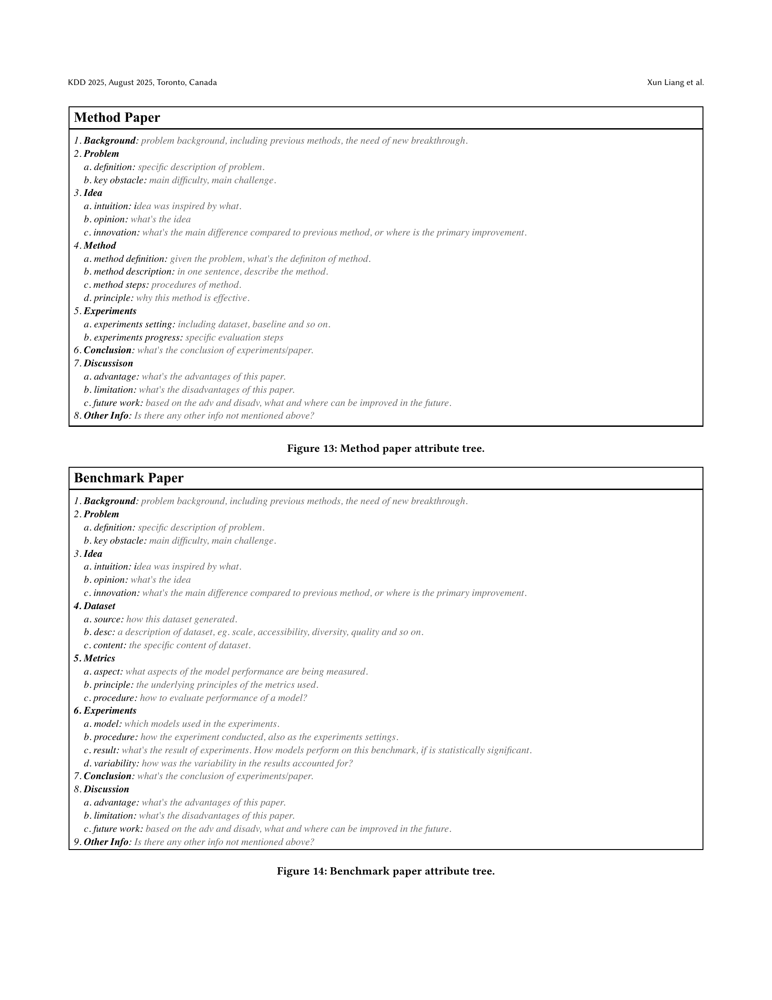

 


 2502.14776 
 Xun Liang et el. 
 
 🤗 2025-02-24 
 



↗ arXiv


↗ Hugging Face


↗ Papers with Code


### TL;DR



최근 급증하는 학술 문헌으로 인해 수작업으로 설문 조사를 작성하는 데 어려움이 있습니다. 기존의 자동 설문 조사 생성 연구는 제한된 컨텍스트 창, 심도 있는 내용 부족, 체계적인 평가 기준 부재 등의 문제점을 가지고 있었습니다. 

본 논문에서는 이러한 문제점을 해결하기 위해, **인간의 글쓰기 과정에서 영감을 얻은 효율적이고 체계적인 시스템인 SurveyX**를 제안합니다. SurveyX는 설문 조사 작성 과정을 준비 단계와 생성 단계로 나누고, 온라인 참고 자료 검색, AttributeTree 전처리 기법, 다듬는 과정 등을 도입하여 설문 조사 작성 효율성을 높였습니다. 실험 결과, SurveyX는 기존 시스템에 비해 내용 품질과 인용 품질이 향상되었고, 전문가 수준의 성과에 근접했습니다.



#### Key Takeaways


 LLM을 이용한 자동 설문 조사 생성 시스템 SurveyX 개발 



 기존 시스템 대비 설문 내용 품질 및 인용 품질 향상 



 다양한 평가 지표를 활용한 실험적 검증 


#### Why does it matter?
본 논문은 **자동 설문 조사 생성 시스템인 SurveyX**를 제시하여, **LLM의 한계를 극복**하고 설문 조사의 질적 수준을 향상시켰다는 점에서 중요합니다.  **기존 시스템의 단점을 해결**하고 **새로운 평가 지표**를 제시하여, 설문 조사 자동화 분야의 연구 발전에 크게 기여할 것으로 기대됩니다. 또한, 본 연구는 **LLM 기반 자동화 시스템의 실제 적용 가능성**을 보여주는 좋은 사례가 될 것입니다.

------
#### Visual Insights

> 🔼 그림 1은 2010년부터 2025년까지 arXiv 웹사이트에 제출된 논문 수를 보여줍니다. 데이터 출처는 연구팀이 보유한 arXiv 데이터베이스이며, 2025년 제출 예상 논문 수는 2010년 대비 5배 증가할 것으로 예상됩니다.  그래프는 연도별 논문 수의 추세를 보여주는 시계열 그래프이며, 2025년 논문 수는 예측치임을 명시하고 있습니다. 이는 급증하는 학술 문헌의 양을 시각적으로 보여주는 자료로, 논문에서 제기하는 문제 상황을 설명하는 데 사용됩니다.
> 

> 
read the caption

> Figure 1. The number of papers received annually by the arXiv website from 2010 to 2025, with data sourced from our arXiv database. The projected number of submissions for 2025 is anticipated to be five times greater than that of 2010.
> 


| Model |  | Coverage | Structure | Relevance | Synthesis | CriticalAnalysis | Avg | Recall | Precision | F1 |
|---|---|---|---|---|---|---|---|---|---|---|
| naive RAG |  | 4.40 | 3.66 | 4.66 | 3.82 | 2.82 | 3.872 | 68.79 | 61.97 | 65.20 |
| AutoSurvey |  | 4.73 | 4.33 | 4.86 | 4.00 | 3.73 | 4.331 | 82.25 | 77.41 | 79.76 |
| **SurveyX** |  | **4.95** | **4.91** | **4.94** | **4.10** | **4.05** | **4.590** | **85.23** | **78.12** | **81.52** |
| Human |  | 5.00 | 4.95 | 5.00 | 4.44 | 4.38 | 4.754 | 86.33 | 77.78 | 81.83 |

> 🔼 본 표는 naive RAG, AutoSurvey, SurveyX 및 인간이 작성한 서베이에 대한 내용 품질 평가 결과를 보여줍니다.  각 모델에 대해 적용 범위, 구조, 관련성, 종합, 비판적 분석 측면에서의 평가 점수가 제시됩니다.  모든 LLM 에이전트는 GPT-4o를 사용했습니다. 점수는 1~5점 척도로 평가되며, 높은 점수일수록 더 높은 품질을 나타냅니다.
> 

> 
read the caption

> Table 1. Content quality evaluation results of naive RAG, Autosurvey, SurveyX and Human writing. All LLM-Agent is GPT-4o.
> 

### In-depth insights

#### LLM Survey Auto
LLM 서베이 자동화는 **대규모 언어 모델(LLM)**을 활용하여 학술 논문 서베이를 자동으로 생성하는 혁신적인 기술입니다. **기존의 수작업 방식의 어려움과 시간 소모를 크게 줄여주는 효율적인 방법**을 제시합니다.  **자동화된 서베이 생성은 방대한 양의 논문 데이터를 효과적으로 분석하고 요약**하여 연구 동향을 파악하는 데 매우 유용합니다.  하지만, **LLM의 한계점(예: 컨텍스트 창의 제한, 정보의 정확성 문제)**과 **객관적인 평가 기준의 부재**는 아직 해결해야 할 과제입니다.  **SURVEYX와 같은 시스템은 이러한 문제를 해결하기 위한 노력**의 일환이며, 향후 LLM 기반 자동화 기술의 발전과 함께 더욱 정교하고 효율적인 서베이 생성이 가능해질 것입니다.  **핵심은 LLM의 강점을 최대한 활용하면서 동시에 그 한계를 보완하는 기술적 혁신**입니다.

#### RAG-based Rewrite
**RAG 기반 재작성**은 대규모 언어 모델(LLM)이 생성한 설문조사 초안의 품질을 향상시키기 위한 중요한 단계입니다. 이 단계에서는 LLM이 생성한 문단을 질의로 사용하여 참조 자료 데이터베이스에서 관련 정보를 검색합니다. 검색된 정보를 바탕으로 LLM은 문단을 다시 작성하는데, 이는 인용의 정확성을 높이고 문맥의 일관성을 유지하는 데 도움이 됩니다. **핵심은 부정확하거나 불필요한 인용을 제거하고, 관련성이 높은 인용을 추가하여 문단의 내용을 보강하는 것**입니다.  **단순히 문단을 다시 작성하는 것을 넘어, 문맥을 고려하여 문단의 흐름을 개선하고 표현의 정확성을 높이는 데 중점을 둡니다.**  이러한 과정을 통해 생성된 설문조사는 학문적 엄격성과 신뢰성을 확보할 수 있습니다.  **RAG 기반 재작성은 설문조사 생성 과정의 전반적인 품질 향상에 크게 기여**하며, 자동화된 설문조사 생성 시스템의 신뢰도를 높이는 데 중요한 역할을 합니다.  본 논문에서 제시된 RAG 기반 재작성 방법은 기존의 자동화된 설문조사 생성 시스템의 한계를 극복하고, **더욱 정확하고 신뢰할 수 있는 설문조사를 생성**하는 데 기여할 것으로 예상됩니다.

#### AttributeTree Method
AttributeTree 방식은 연구 논문에서 제시된 핵심 아이디어로, **LLM의 제한적인 컨텍스트 창 크기를 극복하기 위해** 설계되었습니다.  **각 참고문헌을 구조화된 트리 형태로 전처리**하여 핵심 정보만 추출함으로써, LLM이 방대한 양의 텍스트를 처리하는 대신, **요약된 정보에 집중**하도록 합니다. 이를 통해 LLM은 더욱 효율적으로 서베이 초안을 생성하고, **정확도 및 효율성을 높일 수** 있습니다.  AttributeTree는 단순한 정보 요약을 넘어,  **각 문헌의 특성에 맞는 다양한 템플릿을 활용**하여 유연성을 확보하며,  **전문가 수준의 서베이 작성 과정을 모방**하는 데 중점을 둡니다.  결과적으로, 이 방식은 LLM 기반 자동 서베이 생성 시스템의 성능 향상에 크게 기여할 것으로 기대됩니다.  **속도 향상 및 품질 개선**이라는 두 마리 토끼를 모두 잡는 효과적인 전처리 전략으로 평가할 수 있습니다.

#### SurveyX Evaluation
SurveyX 평가는 **정량적 및 정성적 측면** 모두를 포괄하는 다차원적 접근 방식을 사용합니다.  **자동 평가**는 문헌 검토의 포괄성, 구조, 관련성, 종합 및 비판적 분석과 같은 요소를 측정하는 계량화된 지표를 활용합니다.  **인간 평가자**는 자동 평가의 결과를 보완하고, 맥락적 이해와 암묵적 논리를 요구하는 복잡한 요소들을 평가하는 데 도움이 됩니다.  **다양한 기준**을 통해 SurveyX의 성능을 다각적으로 분석하여, 시스템의 강점과 약점을 명확히 파악하고, 향후 개선 방향을 제시합니다. 특히, 기존 자동 설문 생성 시스템과의 비교 분석을 통해 **SurveyX의 우수성**을 입증하고, **인간 전문가 수준의 성과**에 근접함을 보여줍니다.  **세부적인 평가 지표**와 **실험 결과**는 논문에서 자세히 다루어지며,  **신뢰성 있는 결과**를 제시하기 위한 엄격한 평가 절차를 거쳤음을 강조합니다.

#### Future Research
본 논문에서 제시된 설문 자동화 시스템인 SurveyX는 여러 측면에서 뛰어난 성능을 보여주었지만, **향후 연구를 통해 개선될 여지**가 있습니다.  **더욱 정교한 참조 검색 알고리즘** 개발은 인간 수준의 성능에 더욱 근접하게 할 수 있으며, **그림과 표 생성 모듈의 확장**은 설문의 표현력을 높일 수 있습니다.  또한, **설문 구성 방식의 세분화**를 통해 보다 체계적이고 일관성 있는 설문 생성이 가능할 것입니다.  **다양한 유형의 설문**에 대한 적용 가능성을 확대하고, **다국어 지원 기능 추가**를 통해 활용성을 높이는 연구도 필요합니다.  마지막으로, **신뢰성 및 객관성 평가 기준**의 개선은 자동 생성 설문의 신뢰도 향상에 크게 기여할 것입니다.

### More visual insights

More on figures

> 🔼 그림 2는 SurveyX 시스템의 전체 파이프라인을 보여줍니다.  논문에서는  'Paper Retrieval and Material Preprocessing' 단계와 'Paper Writing and Refinement' 단계의 두 가지 주요 단계로 나누어 설명하고 있습니다.  'Paper Retrieval and Material Preprocessing' 단계는  설문조사 주제에 대한 관련 참고 문헌을 수집하고 전처리하여 효율적인 검색을 위한 참고 자료 데이터베이스를 구축하는 과정입니다. 여기에는 키워드 확장 알고리즘, AttributeTree라는 전처리 방법, RAG 기법을 활용한 참고 문헌 재검색 등이 포함됩니다.  'Paper Writing and Refinement' 단계는  수집된 자료를 바탕으로 설문조사 개요 및 본문을 생성하고, 최종적으로 설문조사의 품질을 높이는 단계입니다.  개요 생성, 본문 생성, 최종 수정 단계를 거치며, 그림, 표 등을 추가하여 설문조사의 표현 방식을 다양화하고 가독성을 높입니다.  전체적으로 인간의 설문조사 작성 과정을 모방하여 설계된 시스템임을 보여줍니다.
> 

> 
read the caption

> Figure 2. Pipeline of SurveyX.
> 

> 🔼 그림 3은 보조 개요 생성 과정을 보여줍니다.  LLM은 먼저 속성 트리(Attribute Tree)를 기반으로 힌트를 생성하여 보조 개요 생성을 안내합니다. 그런 다음 모든 힌트를 종합하여 LLM은 세분화 전략을 결정하는 데 가장 적합한 진입점을 식별하고 보조 개요를 생성합니다.  즉, LLM이 속성 트리에서 추출한 정보를 바탕으로 힌트를 생성하고, 이 힌트들을 종합 분석하여 논리적이고 구조적인 보조 개요를 만드는 과정을 시각적으로 보여주는 것입니다.
> 

> 
read the caption

> Figure 3. An example of generating secondary outlines. LLMs first generate hints based on the attribute tree to guide the generating of the secondary outline. Then, by synthesizing all hints, LLMs identify the most suitable entry points to determine the segmentation strategy and generate the secondary outline.
> 

> 🔼 그림 4는 본 논문의 실험 결과 중 인간 평가 결과를 보여줍니다. 자동 평가와 달리 인간 평가자들이 주관적으로 내용의 포괄성, 구조, 관련성, 종합성, 비판적 분석 능력 등 다섯 가지 측면을 평가하여 점수를 매겼습니다. SURVEYX는 다른 시스템들에 비해 모든 측면에서 더 높은 점수를 받았으며, 특히 구조 측면에서 인간 전문가의 수준에 근접하는 성능을 보였습니다. 이는 SURVEYX가 생성한 설문조사의 질적 우수성을 보여주는 결과입니다.
> 

> 
read the caption

> Figure 4. Human evaluation results.
> 

> 🔼 그림 5는 설문 조사의 내용 범위를 평가하기 위한 프롬프트(지시문)를 보여줍니다.  설문 조사 내용의 범위를 1점에서 5점까지 5단계로 평가하도록 평가자에게 지시하는데, 각 점수에 대한 자세한 설명을 제공하여 객관적인 평가를 유도합니다. 점수 1은 매우 좁은 범위를, 점수 5는 매우 넓고 포괄적인 범위를 나타냅니다.
> 

> 
read the caption

> Figure 5. Content coverage prompt for evaluation.
> 

> 🔼 이 그림은 설문조사의 내용 구조 평가를 위한 프롬프트(지시문)를 보여줍니다.  설문조사의 논리적 구성과 일관성을 평가하기 위한 척도와 각 척도에 대한 설명(1점부터 5점까지)을 제시합니다.  구체적으로는 논리적 흐름, 섹션 간의 연결성, 내용의 명확성 등을 평가하는 기준이 포함되어 있습니다.  설문조사 작성자가 설문조사의 구조적 측면을 평가하는 데 사용할 수 있도록 자세한 지침을 제공합니다.
> 

> 
read the caption

> Figure 6. Content structure prompt for evaluation.
> 

> 🔼 이 그림은 설문조사 내용의 관련성을 평가하기 위한 평가 프롬프트를 보여줍니다.  설문조사의 주제와 내용이 얼마나 잘 일치하는지 다섯 단계로 평가하도록 지시하는 지침이 포함되어 있습니다. 각 점수는 관련성의 정도를 자세하게 설명합니다. 1점은 주제와 전혀 관련이 없음을 나타내고, 5점은 주제와 완벽하게 일치함을 나타냅니다. 이 프롬프트는 자동으로 생성된 설문조사의 질을 객관적으로 평가하는 데 사용됩니다.
> 

> 
read the caption

> Figure 7. Content relevance prompt for evaluation.
> 

> 🔼 그림 8은 설문조사 내용의 종합적인 평가를 위한 프롬프트(지시문)를 보여줍니다.  설문조사 내용이 서로 다른 연구들을 얼마나 잘 연결하고, 전체적인 패턴이나 모순을 파악하고, 개별 요약을 넘어 통합적인 지적 틀을 구축하는지 평가하기 위한 구체적인 기준과 설명을 제시합니다.  각 점수(1~5점)에 따른 세부적인 설명을 통해 평가자가 설문조사의 종합성을 정확하게 평가할 수 있도록 돕습니다.  다양한 연구들을 효과적으로 통합하고, 전체적인 흐름을 파악하여 종합적인 분석을 제시하는지 여부를 중점적으로 평가합니다.
> 

> 
read the caption

> Figure 8. Content synthesis prompt for evaluation.
> 

> 🔼 그림 9는 논문의 평가 지표 중 하나인 '내용 비판적 분석'에 대한 프롬프트(지시문)를 보여줍니다.  이 프롬프트는 평가자가 제출된 설문조사의 내용이 얼마나 심층적이고 비판적으로 기존 연구들을 분석하고 있는지를 평가할 수 있도록 돕습니다.  구체적으로는 연구 방법론의 한계, 이론적 모순, 연구 격차 등을 식별하는 능력을 평가하도록 설계되었습니다.  점수는 1점에서 5점까지이며, 1점은 단순히 기존 연구들을 나열만 하고 비판적 분석이 전혀 없는 경우, 5점은 연구 방법론과 이론들을 엄격하게 비판하고 연구의 한계를 명확히 제시하며 새로운 연구 방향을 제시하는 경우를 의미합니다.
> 

> 
read the caption

> Figure 9. Content critical analysis prompt for evaluation.
> 

> 🔼 그림 10은 인용문의 질을 평가하기 위한 프롬프트를 보여줍니다. 평가자는 주어진 주장(Claim)이 주어진 출처(Source)에 충실한지 여부를 '예' 또는 '아니오'로 답변해야 합니다. 주장이 출처에 충실하다는 것은 주장의 핵심 내용이 출처에서 뒷받침될 수 있음을 의미합니다. 이 프롬프트는 자동으로 생성된 설문조사의 인용 정확성을 평가하는 데 사용됩니다.
> 

> 
read the caption

> Figure 10. Citation prompt for evaluation.
> 

> 🔼 이 그림은 논문의 실험 과정에서 사용된 참고 문헌의 관련성을 평가하는 방법을 보여줍니다.  구체적으로, 주어진 논문 초록과 주제를 바탕으로 해당 논문이 주제와 얼마나 관련이 있는지 'yes' 또는 'no'로 판단하는 과정을 설명합니다.  이는 자동화된 설문 조사 생성 시스템의 정확성과 효율성을 평가하는 데 중요한 역할을 합니다.  시스템이 관련 없는 논문을 제외하고 실제로 필요한 논문만을 선별하는 능력을 평가하는 지표입니다.
> 

> 
read the caption

> Figure 11. Judge relevance for reference paper.
> 

> 🔼 그림 12는 Naive RAG 시스템을 위한 프롬프트를 보여줍니다.  Naive RAG는 자동 설문 생성 시스템의 일부로, 기존의 참고 문헌 요약 대신  LLM이 설문조사 초안을 생성하기 위한 지침으로서 사용되는 프롬프트를 제공합니다. 이 프롬프트는 연구 논문의 개요, 주제, 목표 및 형식에 대한 자세한 지침을 포함하여 LLM이 학문적으로 엄격하고 잘 구성된 설문조사를 생성하도록 안내합니다.  프롬프트는 LLM이 설문조사를 생성하는데 필요한 역할(학술적 검토 논문 저자 및 연구 종합자), 배경 정보, 기술, 목표, 제약 조건 및 출력 형식을 명확하게 정의합니다.
> 

> 
read the caption

> Figure 12. Prompts for Naive RAG.
> 

> 🔼 이 그림은 논문의 3.1절 'Preparation Phase'에서 설명하는 참고문헌 전처리 과정에서 사용되는 Attribute Tree의 예시 중 하나입니다.  Method Paper 유형의 논문에 대해, 배경, 문제, 아이디어, 방법, 실험, 결론, 논의, 추가 정보 등의 속성을 트리 구조로 나타내어,  자연어 처리 모델이 논문의 구조와 주요 내용을 효율적으로 이해하고 처리하는데 도움을 주는 것을 보여줍니다.  각 속성 안에는 해당 속성에 대한 더욱 세부적인 정보를 담을 수 있는 하위 속성들이 포함될 수 있습니다. 이러한 Attribute Tree는  자연어 처리 모델의 제한된 문맥 창 크기를 극복하고, 논문의 핵심 정보를 효과적으로 추출하는 데 사용됩니다.
> 

> 
read the caption

> Figure 13. Method paper attribute tree.
> 

> 🔼 그림 14는 벤치마크 논문의 속성 트리를 보여줍니다. 이 트리는 벤치마크 논문을 구성하는 주요 요소들을 계층적으로 나타내어, 논문의 구조와 내용을 효율적으로 파악하고 분석하는 데 도움을 줍니다.  트리의 각 노드는 논문의 특정 부분(예: 배경, 문제 정의, 제안 방법, 실험 결과 등)을 나타내고, 하위 노드는 해당 부분의 세부 내용을 나타냅니다. 이러한 계층적 구조를 통해 벤치마크 논문의 주요 구성 요소들을 체계적으로 이해하고, 서로 간의 관계를 명확히 파악할 수 있습니다.  본 그림은 SURVEYX 시스템의 준비 단계에서 참고 자료 전처리 방법인 AttributeTree를 설명하기 위해 사용됩니다.
> 

> 
read the caption

> Figure 14. Benchmark paper attribute tree.
> 

> 🔼 이 그림은 이론적 논문의 속성 트리를 보여줍니다. 이론적 논문을 구성하는 주요 요소들을 계층적으로 보여주는 트리 구조로, 배경, 문제 정의, 아이디어, 이론, 실험, 결론, 논의, 추가 정보 등의 세부 항목으로 구성됩니다. 각 항목은 이론적 논문 작성 시 고려해야 할 중요한 측면들을 제시하며, 논문의 구조와 내용을 체계적으로 이해하는 데 도움을 줍니다.
> 

> 
read the caption

> Figure 15. Theory paper attribute tree.
> 

> 🔼 그림 16은 설문조사 논문의 속성 트리를 보여줍니다. 이 트리는 설문조사 논문을 구성하는 데 필요한 주요 요소들을 계층적으로 보여줍니다. 배경, 문제 정의, 핵심 어려움, 아이디어, 방법론, 실험, 결론, 논의, 추가 정보 등의 항목이 포함되어 있습니다. 각 항목은 설문조사 논문 작성 과정에서 고려해야 할 세부적인 사항들을 포함합니다. 이 트리는 설문조사 논문을 체계적이고 효율적으로 작성하는 데 도움을 주는 가이드라인 역할을 합니다.  이를 통해, 연구자들은 설문조사 논문의 구조를 명확히 이해하고, 각 요소를 체계적으로 작성하여 논문의 완성도를 높일 수 있습니다.
> 

> 
read the caption

> Figure 16. Survey paper attribute tree.
> 

More on tables


| Critical | Analysis |
|---|---|
> 🔼 본 표는 SURVEYX 시스템의 성능에 각 구성 요소가 미치는 영향을 분석한 결과를 보여줍니다.  SURVEYX의 다양한 구성요소(검색 알고리즘, AttributeTree 방법, 개요 최적화 방법, RAG 기반 재작성 모듈)를 제거했을 때,  전반적인 성능(Coverage, Structure, Relevance, Synthesis, Critical Analysis, Recall, Precision, F1)이 어떻게 변화하는지를 정량적으로 제시합니다.  특히, 성능이 유의미하게 저하된 경우는 밑줄로 표시하여, 각 구성요소의 중요성을 강조합니다.
> 

> 
read the caption

> Table 2. Ablation study results for SurveyX with different components removed. Data with significant declines are indicated by underlines.
> 


| Ablation Object |  | Coverage | Structure | Relevance | Synthesis |  | Avg | Recall | Precision | F1 |
|---|---|---|---|---|---|---|---|---|---|---|
| Retrieval Algorithm |  | 4.74 | 4.88 | 4.79 | 3.98 | 4.02 | 4.48 | 78.88 | 73.34 | 76.01 |
| AttributeTree Method |  | 4.84 | 4.08 | 4.89 | 3.88 | 3.93 | 4.32 | 60.09 | 56.49 | 58.23 |
| Outline Optimization Method |  | 4.90 | 3.80 | 4.91 | 3.98 | 4.02 | 4.32 | 85.1 | 77.13 | 80.92 |
| RAG-based Rewriting Module |  | 4.92 | 4.89 | 4.93 | 4.00 | 4.00 | 4.55 | 55.37 | 54.95 | 55.16 |
| **No Ablation** |  | **4.95** | **4.91** | **4.94** | **4.10** | **4.05** | **4.590** | **85.23** | **78.12** | **81.52** |
> 🔼 표 3은 SURVEYX 시스템의 성능 평가 중 참조 자료 관련 평가 결과를 보여줍니다.  자세히는 세 가지 지표, IoU, Relevance semantic, RelevanceLLM의 결과 값을 제시하여 SURVEYX가 얼마나 관련성 높은 참고자료를 검색하고 활용하는지 보여줍니다. Human(인간 전문가)의 결과와 비교하여 SURVEYX의 성능을 정량적으로 평가합니다.
> 

> 
read the caption

> Table 3. Evaluation results of reference relevance.
> 


| Critical | Analysis |
|---|---|
> 🔼 이 표는 논문의 실험에 사용된 20개의 설문 조사 주제 목록과 각 주제에 대한 설문 조사 제목을 보여줍니다. 각 주제는 자연어 처리(NLP) 분야의 특정 주제를 나타내며, 이를 바탕으로 자동화된 설문 조사 생성 시스템의 성능을 평가하기 위한 실험이 수행되었습니다.
> 

> 
read the caption

> Table 4. Survey Topics
> 

### Full paper



