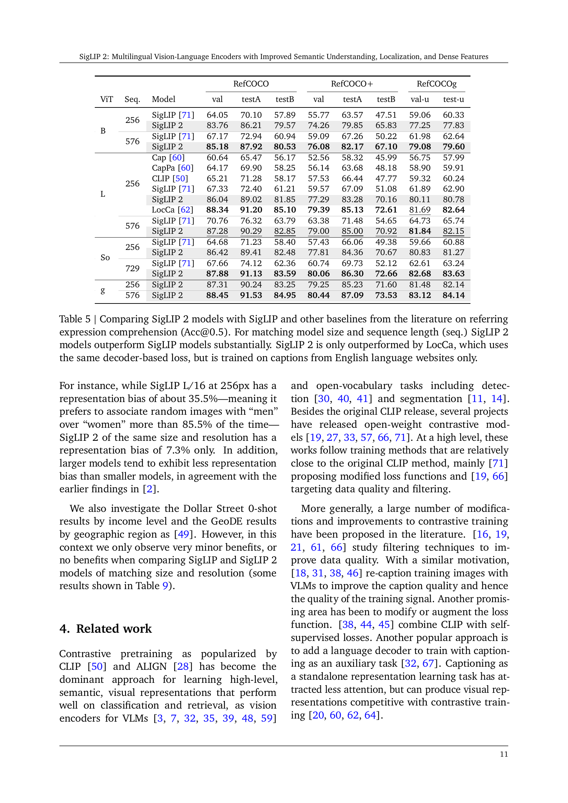

 


 2502.14786 
 Michael Tschannen et el. 
 
 🤗 2025-02-21 
 



↗ arXiv


↗ Hugging Face


↗ Papers with Code


### TL;DR



기존의 비전-언어 모델들은 영어 중심의 데이터에 치우쳐져 다국어 지원 및 다양한 문화적 맥락에 대한 이해가 부족하고,  세분화된 작업(localization, dense prediction 등)에서 성능이 제한적이었습니다. 또한, 모델 크기의 제약으로 인해 추론 비용과 성능 간의 균형을 맞추기 어려웠습니다.

본 논문에서는 이러한 문제점들을 해결하기 위해 SigLIP 2를 제시합니다. SigLIP 2는 기존 SigLIP 모델을 개선하여 다국어 지원 능력을 강화하고, 다양한 하위 작업에서 성능을 향상시켰습니다. 특히, **자체 감독 학습**, **마스크 예측** 등의 기법을 활용하여 의미 이해 및 위치 파악 능력을 높였으며,  **다양한 모델 크기(ViT-B, L, So400M, g)**를 제공하여 사용자의 요구사항에 맞는 모델 선택을 가능하게 했습니다.  실험 결과, SigLIP 2는 다양한 벤치마크에서 기존 모델보다 우수한 성능을 보였습니다.



#### Key Takeaways


 SigLIP 2는 다양한 언어와 문화적 배경에 걸쳐 우수한 성능을 보이는 다국어 비전-언어 인코더입니다. 



 SigLIP 2는 제로샷 분류, 이미지-텍스트 검색 및 하위 작업(localization, dense prediction 등)에서 기존 모델을 능가하는 성능을 보입니다. 



 SigLIP 2는 다양한 모델 크기를 제공하여 연구자들이 추론 비용과 성능 간의 균형을 맞출 수 있도록 지원합니다. 


#### Why does it matter?
본 논문은 **다국어 비전-언어 모델링** 분야의 획기적인 발전을 제시하며, **다양한 언어와 문화적 맥락을 포괄하는 강력한 모델**을 제공합니다. 제로샷 분류 및 검색 성능 향상, 다양한 하위 작업(localization, dense prediction 등)에 대한 성능 개선, 그리고 **다양한 모델 크기 제공**을 통해 연구자들에게 실질적인 도움을 줍니다.  향후 연구 방향을 제시하고, 관련 분야 연구에 큰 영향을 미칠 것으로 예상됩니다.

------
#### Visual Insights

> 🔼 그림 1은 SigLIP 2의 훈련 과정을 보여줍니다. SigLIP 2는 SigLIP [71]의 sigmoid 손실 함수에 LocCa [62]의 캡션 기반 사전 훈련, SILC [45]와 TIPS [38]의 자기 증류 및 마스크 예측 기법을 추가합니다. 특히 마스크 예측과 자기 증류는 훈련 후반 20%에서 적용됩니다.  일부 변형 모델의 경우 데이터 정제 [61] 또는 고유 종횡비 및 가변 시퀀스 길이 [6, 12]에 대한 미세 조정이 추가적으로 포함됩니다.  즉, SigLIP 2는 기존 SigLIP의 강점을 유지하면서 캡션 생성, 자기지도 학습, 그리고 데이터 개선 등 다양한 기술을 통합하여 성능을 향상시킨 모델임을 시각적으로 보여줍니다.
> 

> 
read the caption

> Figure 1: SigLIP 2 adds the captioning-based pretraining from LocCa [62] as well as self-distillation and masked prediction from SILC [45] and TIPS [38] (during the last 20% of training) to the sigmoid loss from SigLIP [71]. For some variants, the recipe additionally involves fine-tuning with data curation [61] or adaptation to native aspect ratio and variable sequence length [6, 12].
> 


|       |       |       | Model     | ImageNet-1k |       |       |       |       | COCO   |       | Flickr |       | XM3600 |       | 
| :---- | :---- | :---- | :-------- | :---------- | :---- | :---- | :---- | :---- | :----- | :---- | :----- | :---- | :------ | :---- | 
| ViT   | Res.  | Seq.  |           | val         | v2    | ReaL  | ObjNet | 10s.  | T→I    | I→T   | T→I    | I→T   | T→I      | I→T   | 
| B/32  | 224   | 49    | MetaCLIP [66] | 67.7       | 59.6  | –     | 52.8  | –     | 46.6   | –     | 72.9   | –     | –        | –     | 
|       | 256   | 64    | OpenCLIP [27] | 72.8       | 64.8  | –     | 59.6  | –     | 39.9   | 57.9  | 64.9   | 84.8  | –        | –     | 
|       |       |       | SigLIP 2   | 74.0       | 66.9  | 81.4  | 66.1  | 66.6  | 47.2   | 63.7  | 75.5   | 89.3  | 38.3     | 49.0  | 
| B/16  | 224   | 196   | CLIP [50]    | 68.3       | 61.9  | –     | 55.3  | –     | 33.1   | 52.4  | 62.1   | 81.9  | –        | –     | 
|       |       |       | OpenCLIP [27] | 70.2       | 62.3  | –     | 56.0  | –     | 42.3   | 59.4  | 69.8   | 86.3  | –        | –     | 
|       |       |       | MetaCLIP [66] | 72.4       | 65.1  | –     | 60.0  | –     | 48.9   | –     | –     | –     | –        | –     | 
|       |       |       | EVA-CLIP [57] | 74.7       | 67.0  | –     | 62.3  | –     | 42.2   | 58.7  | 71.2   | 85.7  | –        | –     | 
|       |       |       | SigLIP [71]   | 76.2       | 69.5  | 82.8  | 70.7  | 69.9  | 47.2   | 64.5  | 77.9   | 89.6  | 22.4     | 29.3  | 
|       |       |       | DFN [19]     | 76.2       | 68.2  | –     | 63.2  | –     | 51.9   | –     | 77.3   | –     | –        | –     | 
|       |       |       | SigLIP 2   | 78.2       | 71.4  | 84.8  | 73.6  | 72.1  | 52.1   | 68.9  | 80.7   | 93.0  | 40.3     | 50.7  | 
|       | 256   | 256   | SigLIP [71]   | 76.7       | 70.1  | 83.1  | 71.3  | 70.3  | 47.4   | 65.1  | 78.3   | 91.1  | 22.5     | 29.9  | 
|       |       |       | SigLIP 2   | 79.1       | 72.5  | 85.4  | 74.5  | 73.1  | 53.2   | 69.7  | 81.7   | 94.4  | 40.7     | 51.0  | 
|       | 384   | 576   | SigLIP [71]   | 78.6       | 72.0  | 84.6  | 73.8  | 72.7  | 49.7   | 67.5  | 80.7   | 92.2  | 23.3     | 30.3  | 
|       |       |       | SigLIP 2   | 80.6       | 73.8  | 86.2  | 77.1  | 74.7  | 54.6   | 71.4  | 83.8   | 94.9  | 41.2     | 51.6  | 
| L/14  | 224   | 256   | SigLIP [71]   | 79.2       | 72.9  | 84.9  | 74.8  | 73.3  | 50.4   | 67.6  | 81.6   | 92.5  | 23.5     | 30.5  | 
|       |       |       | SigLIP 2   | 81.2       | 74.5  | 86.7  | 77.8  | 75.2  | 55.2   | 71.2  | 84.5   | 95.5  | 41.4     | 52.0  | 
|       |       |       | OpenCLIP [27] | 74.0       | 61.1  | –     | 66.4  | –     | 46.1   | 62.1  | 75.0   | 88.7  | –        | –     | 
|       |       |       | CLIP [50]    | 75.5       | 69.0  | –     | 69.9  | –     | 36.5   | 56.3  | 65.2   | 85.2  | –        | –     | 
|       |       |       | MetaCLIP [66] | 79.2       | 72.6  | –     | 74.6  | –     | 55.7   | –     | 83.3   | –     | –        | –     | 
|       |       |       | CLIPA-v2 [33] | 79.7       | 72.8  | –     | 71.1  | –     | 46.3   | 64.1  | 73.0   | 89.1  | –        | –     | 
|       |       |       | EVA-CLIP [57] | 79.8       | 72.9  | –     | 75.3  | –     | 47.5   | 63.7  | 77.3   | 89.7  | –        | –     | 
|       |       |       | DFN [19]     | 82.2       | 75.7  | –     | 74.8  | –     | 59.6   | –     | 84.7   | –     | –        | –     | 
| L/16  | 256   | 256   | SigLIP [71]   | 80.5       | 74.2  | 85.9  | 77.9  | 76.8  | 51.2   | 69.6  | 81.3   | 92.0  | 30.9     | 40.1  | 
|       |       |       | SigLIP 2   | 82.5       | 76.8  | 87.3  | 83.0  | 78.8  | 54.7   | 71.5  | 84.1   | 94.5  | 46.5     | 56.5  | 
|       | 384   | 576   | SigLIP [71]   | 82.1       | 75.9  | 87.1  | 80.9  | 78.7  | 52.8   | 70.5  | 82.6   | 92.9  | 31.4     | 39.7  | 
|       |       |       | SigLIP 2   | 83.1       | 77.4  | 87.6  | 84.4  | 79.5  | 55.3   | 71.4  | 85.0   | 95.2  | 47.1     | 56.3  | 
| So/14 | 224   | 256   | SigLIP [71]   | 83.5       | 77.8  | 87.7  | 84.6  | 79.6  | 55.2   | 72.1  | 85.3   | 95.8  | 47.4     | 56.7  | 
|       |       |       | SigLIP 2   | 84.5       | 79.2  | 88.3  | 87.1  | 82.1  | 55.7   | 72.5  | 85.3   | 95.3  | 48.2     | 58.2  | 
|       |       |       | SigLIP 2   | 85.0       | 79.8  | 88.5  | 88.0  | 82.5  | 56.1   | 72.8  | 86.0   | 95.4  | 48.6     | 57.9  | 
| So/16 | 256   | 256   | mSigLIP [71]  | 83.4       | 77.8  | 87.7  | 84.8  | 79.7  | 55.4   | 71.5  | 84.4   | 94.2  | 48.1     | 57.5  | 
|       |       |       | SigLIP 2   | 84.1       | 78.4  | 88.1  | 85.8  | 80.4  | 56.0   | 71.2  | 85.3   | 95.9  | 48.3     | 57.5  | 
|       | 384   | 576   | SigLIP 2   | 84.3       | 79.1  | 88.1  | 86.2  | 80.5  | 56.0   | 71.3  | 85.5   | 95.4  | 48.3     | 57.6  | 
| g/16  | 256   | 256   | SigLIP 2   | 84.5       | 79.2  | 88.3  | 87.1  | 82.1  | 55.7   | 72.5  | 85.3   | 95.3  | 48.2     | 58.2  | 
|       | 384   | 576   | SigLIP 2   | 85.0       | 79.8  | 88.5  | 88.0  | 82.5  | 56.1   | 72.8  | 86.0   | 95.4  | 48.6     | 57.9  | 

> 🔼 표 1은 SigLIP 2 모델과 여러 기준 모델의 제로샷 분류, 10샷 분류(검증 세트 기준), 검색 성능(재현율@1)을 보여줍니다. SigLIP 2는 다국어를 지원함에도 불구하고 기준 모델들보다 훨씬 우수한 성능을 보여줍니다. DFN[19]은 ImageNet, COCO, Flickr에서 미세 조정된 데이터 필터링 네트워크를 사용한다는 점에 유의하십시오.
> 

> 
read the caption

> Table 1:  Zero-shot classification, 10-shot (10s) classification (on the validation set), and retrieval performance (recall@1) of SigLIP 2 along with several baselines. SigLIP 2 outperforms the baselines—often by a large margin—despite being multilingual. Note that DFN [19] relies on a data filtering network fine-tuned on ImageNet, COCO, and Flickr.
> 

### In-depth insights

#### Multilingual VL Encoders
다국어 VL 엔코더는 **단일 모델로 여러 언어를 지원**하여 다양한 언어의 이미지와 텍스트 데이터를 처리할 수 있다는 점에서 매우 중요합니다. 이는 기존의 영어 중심 모델의 한계를 넘어 **글로벌한 응용**을 가능하게 합니다.  **다국어 데이터에 대한 학습**을 통해 다양한 문화적 맥락을 이해하고, 다양한 언어의 특성을 고려한 표현 학습이 가능해집니다.  하지만 다국어 데이터의 불균형, 특정 언어에 대한 편향 등의 문제를 해결하기 위한 **데이터 전처리 및 모델 설계**가 중요하며, 이러한 과제 해결을 위한 연구가 지속적으로 필요합니다.  **다국어 VL 엔코더의 성능 평가**는 다양한 언어와 작업에 대한 포괄적인 평가 지표를 사용해야 하며, 특히 공정성 및 형평성에 대한 고려가 중요합니다.  **향후 연구**는 다국어 VL 엔코더의 효율성 향상,  편향 완화 기술 개선, 다양한 다운스트림 작업에 대한 적용 등에 집중되어야 합니다.  특히 **소규모 모델의 성능 향상**과 같은 효율성 측면에서의 연구도 중요합니다.

#### Improved Training Recipe
본 논문에서 제시된 향상된 학습 방식은 기존 SigLIP 모델의 성공을 기반으로 하여 **여러 가지 독립적인 기술들을 통합**하는 데 중점을 둡니다.  이는 단순히 기존 방법들의 조합이 아닌, **상호 시너지 효과를 고려한 통합적 설계**를 의미합니다. 특히, 캡셔닝 기반 사전 학습, 자가 지도 학습 손실 함수 (셀프-디스틸레이션, 마스크 예측), 그리고 온라인 데이터 관리 등의 기법들이 효율적으로 결합되어 있습니다. 이러한 통합은 다양한 모델 크기에서 기존 SigLIP 모델을 능가하는 성능 향상으로 이어지며, 특히 **영상-텍스트 검색 및 제로샷 분류**와 같은 핵심 기능에서 두드러집니다.  더 나아가, **새로운 학습 방식은 영상의 국소적 특징과 의미를 더욱 정확하게 포착**하여 영상 지역화 및 밀집 특징 추출과 같은 과제에서도 상당한 개선을 보여줍니다. 이는 다양한 언어 지원 및 공정성 개선에도 기여하며, 사용자에게 유연성을 제공하기 위해 다양한 크기의 모델을 제공하는 점도 주목할 만합니다. **다양한 해상도와 비율의 이미지에 대한 처리를 향상**시킨 점 역시 빼놓을 수 없는 중요한 개선 사항입니다.

#### Dense Feature Extraction
본 논문에서 "고밀도 특징 추출"은 단순히 이미지의 시맨틱 정보를 넘어, **공간적 세부 정보까지 담는 고해상도 특징 맵**을 생성하는 기술을 의미합니다. 기존의 vision-language 모델들은 주로 이미지 전체에 대한 전반적인 이해에 초점을 맞추었지만,  고밀도 특징 추출은 **픽셀 단위 또는 영역 단위의 상세한 정보**를 추출하여 객체 검출, 분할, 심도 추정 등 다양한 downstream task에 활용될 수 있습니다. 이는 **self-supervised learning 기법과 decoder-based loss function**을 통해 달성됩니다. 특히, **self-distillation과 masked prediction**과 같은 기법들은 모델이 이미지의 지역적 특징을 더욱 잘 학습하도록 유도하며, 이를 통해 고밀도 특징의 질을 향상시킵니다.  **다양한 해상도와 종횡비를 지원하는 NaFlex 변형 모델**은 고밀도 특징 추출의 실용성을 더욱 높여줍니다.  결과적으로, 고밀도 특징 추출은 vision-language 모델의 활용 범위를 넓히고, 보다 정교한 시각적 이해를 가능하게 하는 핵심 기술입니다.

#### Multilingual Perf
**다국어 성능(Multilingual Perf)** 부분은 논문에서 다국어 이해 및 처리 능력을 평가하는 데 중점을 둡니다.  이는 단순히 영어가 아닌 여러 언어로 된 데이터셋을 사용하여 모델의 일반화 능력을 측정함으로써 이루어집니다. **다양한 언어에 대한 모델의 성능을 비교 분석**하여 특정 언어에 대한 편향성이나 강점을 파악하고, **모델의 로버스트니스(Robustness)와 일반화 성능**을 평가합니다.  이를 통해 **실제 세계 적용 가능성**을 높이기 위한 모델 개선 방향을 제시할 수 있습니다.  단순한 성능 수치뿐 아니라, 각 언어별 성능 차이, 특정 언어에 대한 편향성 여부, 그리고 다국어 데이터셋의 구성 및 품질에 따른 성능 변화 등을 분석하여 **모델의 한계점과 개선 방향**을 제시하는 것이 중요합니다.  **다국어 데이터셋의 균형**을 맞추는 것이 중요한데, 흔히 특정 언어 데이터가 과도하게 많아 전체 성능을 왜곡할 수 있습니다. 또한, **다국어 환경에서의 공정성(Fairness)** 문제도 고려되어야 합니다. 특정 문화권이나 언어권에 대한 편향을 줄이고, 모든 언어권 사용자에게 공정한 서비스를 제공하는 것이 중요하며, 이 부분이 연구의 사회적 영향력을 높일 수 있습니다.  결론적으로, 다국어 성능 평가는 모델의 실제 활용 가능성과 사회적 책임을 고려한 심도있는 분석을 필요로 합니다.

#### Fairness & Bias
본 논문에서 다룬 공정성 및 편향성 부분은 **다양한 언어와 문화적 배경을 가진 데이터를 사용하여 훈련된 다국어 비전-언어 모델**임을 강조합니다.  단순히 영어 데이터에만 의존하지 않고, **데이터 편향을 완화하는 기법을 적용하여 공정성을 개선**하려는 시도가 눈에 띕니다.  **다양한 언어의 데이터 혼합 비율 조정**을 통해 영어 중심의 편향을 줄이고, **민감한 속성에 대한 데이터 편향을 완화**하는 기법을 적용한 점도 주목할 만합니다.  하지만,  **모델의 공정성 평가에 대한 구체적인 지표나 분석 결과는 제한적**으로 제시되어 있어, 실제 공정성 수준을 정확히 판단하기 어렵습니다.  **다양한 평가 지표를 사용한  보다 면밀한 공정성 분석**이 추가적으로 필요하며, 특히 다양한 문화적 배경에 따른 편향성에 대한 심층적인 검토가 향후 연구의 중요한 과제가 될 것입니다.  또한,  **데이터의 다양성 확보와 편향 완화 기법의 효과성에 대한 정량적인 분석**을 통해 모델의 신뢰성과 공정성을 더욱 강화하는 후속 연구가 필요해 보입니다.  **모델 크기와 성능 간의 상관관계를 고려하여 작은 모델의 성능을 개선하는 기법**이 제시되었지만, 이러한 기법이 공정성에 미치는 영향에 대한 분석은 부족합니다. 따라서, **모델 크기별 공정성 차이에 대한 추가 분석**과 함께, **공정성과 관련된 추가적인 윤리적 고려**가 향후 연구에 반영되어야 할 것입니다.

### More visual insights

More on figures

> 🔼 그림 2는 SigLIP, SigLIP 2, 그리고 다국어 데이터로 학습된 mSigLIP 모델의 Crossmodal-3600 데이터셋 기반 언어별 이미지-텍스트 검색 성능을 보여줍니다. SigLIP 2는 영어 기반 시각-언어 작업에서 SigLIP보다 훨씬 더 나은 성능을 보이지만(표 1 참조), 다국어 데이터로 학습된 mSigLIP 모델과 거의 유사한 성능을 나타냅니다. 이는 SigLIP 2가 다국어 이해 능력을 향상시켰음을 시사합니다.
> 

> 
read the caption

> Figure 2:  Per-language image-text retrieval performance for SigLIP, SigLIP 2 and mSigLIP on Crossmodal-3600 [58]. SigLIP 2 almost matches the performance of mSigLIP (SigLIP trained on multilingual data) despite performing substantially better on English vision-language tasks (Table 1).
> 

> 🔼 그림 3은 다양한 시퀀스 길이와 해상도를 지원하는 단일 체크포인트를 가진 NaFlex 모델과 각 시퀀스 길이와 해상도에 대해 별도의 체크포인트를 사용하는 표준 정사각형 입력 SigLIP 2 변형 모델을 비교한 것입니다. x축에 표시된 시퀀스 길이는 NaFlex의 학습 시퀀스 길이에 해당하며, NaFlex는 학습 해상도 간에 상당히 잘 보간하지만 외삽은 잘 되지 않습니다(표시되지 않음).
> 

> 
read the caption

> Figure 3: Comparing the NaFlex (a single checkpoint per model size supporting native aspect ratio and variable sequence length/resolution) and the standard square-input SigLIP 2 variants which use a separate checkpoint for each sequence length/resolution. The sequence lengths annotated on the x-axis correspond to training sequence lengths for NaFlex. NaFlex interpolates fairly well between training resolutions, but does not extrapolate well (not shown).
> 

> 🔼 그림 4는 얼어붙은 비전 인코더(PaliGemma [7] 1단계)를 사용하여 Gemma 2 LLM을 50M 단계 동안 훈련한 후 개별 데이터셋에서 VLM을 미세 조정한 후 다양한 비전 인코더의 비교를 보여줍니다(PaliGemma 3단계). SigLIP 2는 다양한 모델 크기와 해상도에서 SigLIP 및 AIMv2 [20]보다 성능이 우수합니다. 표 6과 동일한 데이터를 사용합니다.
> 

> 
read the caption

> Figure 4: Comparison of different vision encoders after training a Gemma 2 LLM for 50M steps with a frozen vision encoder (PaliGemma [7] stage 1), followed by fine-tuning the VLM on individual datasets (PaliGemma stage 3). SigLIP 2 performs better than SigLIP and AIMv2 [20] for different model sizes and resolutions. Same data as in Table 6.
> 

> 🔼 그림 5는 지리적으로 다양한 개체 분류 작업(Dollar Street, GeoDE)과 지리적 위치 확인(GeoDE 국가/지역) 및 랜드마크 위치 확인(GLDv2) 작업에 대한 10샷 및 0샷 정확도를 보여줍니다. SigLIP 2는 SigLIP보다 일관되게 더 나은 성능을 보입니다(추가 결과는 표 8 참조).  이 그림은 다양한 지역과 문화적 배경을 가진 이미지 데이터셋에 대한 모델의 성능을 비교하여, SigLIP 2 모델이 다양한 데이터에 대해 더 강건하고 일반화된 성능을 가짐을 시각적으로 보여줍니다.
> 

> 
read the caption

> Figure 5: 10-shot and 0-shot accuracy for geographically diverse object classification tasks (Dollar Street, GeoDE), as well as geolocalization (GeoDE country/region) and landmark localization (GLDv2) tasks. SigLIP 2 consistently performs better than SigLIP (see Table 8 for additional results).
> 

> 🔼 그림 6은 다양한 모델들에 대한 표현 편향(무작위 개체와 성별의 연관성)을 보여줍니다. 낮은 값이 더 좋습니다. 이 그림은 SigLIP 2 모델이 이전 모델인 SigLIP에 비해 무작위 개체를 특정 성별과 연관시키는 경향이 훨씬 적다는 것을 보여줍니다. 또한, 더 큰 모델일수록 편향이 더 적은 경향이 있습니다. 이는 이전 연구 결과와 일치합니다.
> 

> 
read the caption

> Figure 6: Representation bias (association of random objects with gender; lower is better) for different models.
> 

More on tables


| Model | ViT | Res. | PASCAL | ADE20k | NYUv2 | NAVI | NYUv2 | NAVI |
|---|---|---|---|---|---|---|---|---|
| CLIP [50] | L/14 | 224 | 74.5 | 39.0 | 0.553 | 0.073 | **24.3** | 25.5 |
| OpenCLIP [27] | G/14 | 224 | 71.4 | 39.3 | 0.541 | – | – | – |
| SigLIP [71] | So/14 | 224 | 72.0 | 37.6 | 0.576 | 0.083 | 25.9 | 26.0 |
| SigLIP 2 | So/14 | 224 | **77.1** | **41.8** | **0.493** | **0.067** | 24.9 | **25.4** |
| SigLIP [71] | So/14 | 384 | 73.8 | 40.8 | 0.563 | 0.069 | 24.1 | 25.4 |
| SigLIP 2 | So/14 | 384 | **78.1** | **45.4** | **0.466** | **0.064** | **23.0** | **25.0** |
> 🔼 표 2는 SigLIP 2의 고정된 표현을 다양한 밀집 예측 작업(세분화: mIoU, 깊이: RMSE, 노말: 각도 RMSE)에 적용한 결과를 보여줍니다. SigLIP 2는 여러 다른 인기 있는 오픈 가중치 모델보다 훨씬 더 나은 성능을 보여줍니다.
> 

> 
read the caption

> Table 2: Probing the frozen SigLIP 2 representation for a range of dense prediction tasks (metrics: segmentation: mIoU; depth: RMSE; normals; angular RMSE). SigLIP 2 outperforms several other popular open-weight models, often by a significant margin.
> 


| Model | ViT | A-847 | PC-459 | A-150 | PC-59 | VOC-20 | VOC-21 |
|---|---|---|---|---|---|---|---| 
| CLIP [50] | L/16 | 10.8 | 20.4 | 31.5 | 62.0 | 96.6 | 81.8 |
| OpenCLIP [27] | G/14 | 13.3 | 21.4 | 36.2 | 61.5 | **97.1** | 81.4 |
| SigLIP [71] | L/16 | 14.0 | 23.9 | 37.5 | 61.6 | 96.1 | 81.1 |
| SigLIP 2 | L/16 | **14.3** | **24.1** | **38.8** | **62.4** | 97.0 | **82.3** |
> 🔼 표 3은 여러 모델의 개방형 어휘 분할 성능(mIoU)을 비교하기 위해 Cat-Seg [11]을 사용한 결과를 보여줍니다. SigLIP 2는 [45]와 유사한 방식으로 훈련된 다른 모델들보다 개선된 성능을 보여주며, 심지어 더 큰 모델들보다도 우수한 성능을 보여줍니다.
> 

> 
read the caption

> Table 3: We use Cat-Seg [11] to compare open-vocabulary segmentation performance (mIoU) of several models similar to [45]. We observe that SigLIP 2 offers respectable improvements over comparable and even bigger models.
> 


| ViT | Model | COCO (AP) | LVIS (AP) | LVIS (APr) |
|---|---|---|---|---|
| B/16 | SigLIP | 42.2 | 33.0 | 31.0 |
|  | SigLIP 2 | **42.8** | **34.4** | **32.7** |
| So/14 | SigLIP | 44.3 | 39.5 | 40.9 |
|  | SigLIP 2 | **45.2** | **40.5** | **42.3** |
> 🔼 표 4는 OWL-ViT [40]을 사용하여 개방형 어휘 객체 탐지를 위해 미세 조정된 SigLIP과 SigLIP 2의 결과를 보여줍니다.  SigLIP 2가 SigLIP보다 성능이 향상되었음을 보여주는 여러 모델 크기에 대한 평가 결과가 포함되어 있습니다. 이 표는 다양한 모델 크기에 대한 성능을 비교하여 개방형 어휘 객체 탐지 작업에서 SigLIP 2의 효율성과 우수성을 강조합니다.
> 

> 
read the caption

> Table 4: Fine-tuned SigLIP and SigLIP 2 for open-vocabulary detection via OWL-ViT [40].
> 


|       |       | Model                                      | RefCOCO val | RefCOCO testA | RefCOCO testB | RefCOCO+ val | RefCOCO+ testA | RefCOCO+ testB | RefCOCOg val-u | RefCOCOg test-u |
| :---- | :---- | :----------------------------------------- | :----------: | :-----------: | :-----------: | :----------: | :-----------: | :-----------: | :------------: | :------------: |
| ViT   | Seq.  |                                             |               |                |                |               |                |                |                |                |
| B     | 256   | SigLIP [71]                               |   64.05      |    70.10       |    57.89       |    55.77      |    63.57       |    47.51       |     59.06      |     60.33      |
|       |       | SigLIP 2                                   |   83.76      |    86.21       |    79.57       |    74.26      |    79.85       |    65.83       |     77.25      |     77.83      |
|       | 576   | SigLIP [71]                               |   67.17      |    72.94       |    60.94       |    59.09      |    67.26       |    50.22       |     61.98      |     62.64      |
|       |       | SigLIP 2                                   |   85.18      |    87.92       |    80.53       |    76.08      |    82.17       |    67.10       |     79.08      |     79.60      |
| L     | 256   | Cap [60]                                  |   60.64      |    65.47       |    56.17       |    52.56      |    58.32       |    45.99       |     56.75      |     57.99      |
|       |       | CapPa [60]                               |   64.17      |    69.90       |    58.25       |    56.14      |    63.68       |    48.18       |     58.90      |     59.91      |
|       |       | CLIP [50]                                 |   65.21      |    71.28       |    58.17       |    57.53      |    66.44       |    47.77       |     59.32      |     60.24      |
|       |       | SigLIP [71]                               |   67.33      |    72.40       |    61.21       |    59.57      |    67.09       |    51.08       |     61.89      |     62.90      |
|       |       | SigLIP 2                                   |   86.04      |    89.02       |    81.85       |    77.29      |    83.28       |    70.16       |     80.11      |     80.78      |
|       |       | LocCa [62]                               |   88.34      |    91.20       |    85.10       |    79.39      |    85.13       |    72.61       |     81.69      |     82.64      |
|       | 576   | SigLIP [71]                               |   70.76      |    76.32       |    63.79       |    63.38      |    71.48       |    54.65       |     64.73      |     65.74      |
|       |       | SigLIP 2                                   |   87.28      |    90.29       |    82.85       |    79.00      |    85.00       |    70.92       |     81.84      |     82.15      |
| So    | 256   | SigLIP [71]                               |   64.68      |    71.23       |    58.40       |    57.43      |    66.06       |    49.38       |     59.66      |     60.88      |
|       |       | SigLIP 2                                   |   86.42      |    89.41       |    82.48       |    77.81      |    84.36       |    70.67       |     80.83      |     81.27      |
|       | 729   | SigLIP [71]                               |   67.66      |    74.12       |    62.36       |    60.74      |    69.73       |    52.12       |     62.61      |     63.24      |
|       |       | SigLIP 2                                   |   87.88      |    91.13       |    83.59       |    80.06      |    86.30       |    72.66       |     82.68      |     83.63      |
| g     | 256   | SigLIP 2                                   |   87.31      |    90.24       |    83.25       |    79.25      |    85.23       |    71.60       |     81.48      |     82.14      |
|       | 576   | SigLIP 2                                   |   88.45      |    91.53       |    84.95       |    80.44      |    87.09       |    73.53       |     83.12      |     84.14      |
> 🔼 표 5는 참조 표현 이해 작업(Acc@0.5)에서 SigLIP 2 모델과 SigLIP 및 기타 기존 모델들의 성능을 비교한 것입니다. 모델 크기와 시퀀스 길이가 동일한 경우 SigLIP 2 모델이 SigLIP 모델보다 훨씬 우수한 성능을 보여줍니다. SigLIP 2는 동일한 디코더 기반 손실을 사용하지만 영어 웹사이트의 캡션으로만 학습된 LocCa에 의해서만 성능이 능가됩니다.
> 

> 
read the caption

> Table 5:  Comparing SigLIP 2 models with SigLIP and other baselines from the literature on referring expression comprehension (Acc@0.5). For matching model size and sequence length (seq.) SigLIP 2 models outperform SigLIP models substantially. SigLIP 2 is only outperformed by LocCa, which uses the same decoder-based loss, but is trained on captions from English language websites only.
> 


Large 224/256px|SigLIP|AIMv2|SigLIP2|So400m/14 224px|SigLIP|SigLIP2|So400m 384px|SigLIP|SigLIP2
---|---|---|---|---|---|---|---|---
AI2D|75.2|73.2|75.9|75.3|74.8|76.7|78.3
AOKVQA-DA (val)|60.3|62.3|61.7|62.0|62.8|64.9|64.7
AOKVQA-MC (val)|78.3|78.4|77.6|79.0|80.5|82.5|83.1
COCO-35L (avg34)|109.9|111.4|112.2|111.9|113.2|113.6|114.8
COCO-35L (en)|136.7|138.3|139.4|139.0|139.4|140.3|141.1
COCOcap|138.6|139.9|141.3|141.4|142.7|142.2|143.8
CountBenchQA|75.3|83.1|82.2|78.2|84.7|80.8|83.9
DocVQA (val)|33.0|32.3|35.4|34.3|35.9|62.7|65.9
GQA|65.2|65.6|66.1|65.5|65.7|67.0|67.8
InfoVQA (val)|25.3|25.1|26.3|25.1|26.0|34.7|37.1
NLVR2|90.7|91.3|91.1|91.0|91.4|91.7|91.8
NoCaps|117.7|121.7|120.3|120.1|120.9|120.8|121.9
OCR-VQA|70.6|71.8|72.5|71.3|72.7|74.4|75.2
OKVQA|62.4|62.7|63.3|63.1|63.4|63.7|64.5
RefCOCO (testA)|71.0|71.9|74.3|72.4|74.5|76.6|78.2
RefCOCO (testB)|66.0|67.8|70.3|67.5|70.5|71.4|74.5
RefCOCO (val)|68.7|69.5|72.4|69.9|72.5|74.3|76.1
RefCOCO+ (testA)|67.5|69.0|70.8|69.0|71.4|74.1|75.9
RefCOCO+ (testB)|59.6|61.5|63.3|60.8|63.3|65.4|67.6
RefCOCO+ (val)|63.6|65.1|67.6|64.9|67.8|70.0|72.0
RefCOCOg (test)|63.9|65.4|67.5|64.7|67.9|69.9|72.1
RefCOCOg (val)|63.3|64.3|66.8|64.5|67.3|69.5|71.7
ST-VQA (val)|54.0|53.9|59.8|56.7|60.1|75.0|77.3
SciCap|161.1|156.4|165.5|162.3|161.8|177.2|179.3
ScienceQA|96.1|96.1|96.2|95.4|96.3|96.2|96.1
Screen2Words|108.7|106.9|114.3|111.3|110.6|115.3|116.1
TallyQA (complex)|67.6|69.4|69.3|68.4|70.0|71.0|72.5
TallyQA (simple)|79.9|81.0|82.0|80.4|82.2|83.5|85.4
TextCaps|116.5|116.8|126.1|121.7|123.8|145.0|150.9
TextVQA (val)|51.9|53.9|57.3|54.5|59.4|69.7|74.0
VQAv2 (minival)|81.5|82.1|82.1|81.9|82.8|84.3|85.2
VizWizVQA (val)|74.4|74.4|76.0|75.5|76.0|76.8|77.6
WidgetCap|132.8|133.0|139.1|134.4|142.0|147.0|151.1
XM3600 (avg35)|39.0|39.6|39.7|39.8|40.1|40.8|41.1
XM3600 (en)|77.7|78.0|79.1|77.8|79.2|80.0|81.0
> 🔼 표 6은 다양한 크기의 비전 인코더를 사용하여 훈련된 Gemma 2 LLM의 성능을 비교한 것입니다. 앞의 세 열은 패치 크기가 14인 AIMv2 모델의 경우 224픽셀, 패치 크기가 16인 SigLIP 모델의 경우 256픽셀인 토큰 256개를 가진 대형 모델을 비교합니다. 뒤의 네 열은 두 가지 다른 해상도(따라서 토큰 수도 다름)에서 패치 크기가 14인 So400M 크기의 SigLIP 모델을 비교합니다. 그림 4와 동일한 데이터를 사용합니다.
> 

> 
read the caption

> Table 6: The first three columns compare Large-sized models with 256 tokens each (that’s 224px for the AIMv2 model with patch size 14, and 256px for the SigLIP models with patch size 16). The last four columns compare So400M-sized SigLIP models with patch size 14 at two different resolutions (and hence tokens). Same data as in Figure 4.
> 


The following markdown table is a reformat of the provided HTML table. Note that the mathematical symbols are not reproduced accurately in markdown.

|             | Seq. | Model                      | ImageNet-1k val | ImageNet-1k v2 | ImageNet-1k ReaL | ImageNet-1k ObjNet | COCO R@1 T→I | COCO R@1 I→T | COCO R@1 T→I | COCO R@1 I→T | TC R@1 T→I | TC R@1 I→T | HT R@1 T→I | HT R@1 I→T | SC R@1 T→I | SC R@1 I→T | S2W R@1 T→I | S2W R@1 I→T |
| :---------- | :---- | :------------------------- | :--------------- | :------------- | :---------------- | :--------------- | :------------ | :------------ | :------------ | :------------ | :---------- | :---------- | :---------- | :---------- | :---------- | :---------- | :---------- | :---------- |
| ViT B/16    | 64   | SigLIP 2 (NaF.)           | 71.2             | 63.2           | 78.3              | 62.1             | 43.6          | 60.4          | 30.4          | 57.5          | 3.4         | 6.4         | 5.2         | 4.0         | 6.4         | 11.0        |
|             | 144  | SigLIP 2 (NaF.)           | 76.2             | 69.4           | 82.9              | 70.2             | 49.0          | 65.7          | 36.5          | 65.8          | 5.7         | 10.3        | 13.5        | 11.8        | 13.9        | 25.4        |
|             | 196  | SigLIP 2                    | 78.2             | 71.4           | 84.8              | 73.6             | 52.1          | 68.9          | 38.9          | 68.0          | 5.5         | 9.5         | 13.3        | 10.9        | 10.8        | 18.7        |
|             | 256  | SigLIP 2                    | 79.1             | 72.5           | 85.4              | 74.5             | 53.2          | 69.7          | 40.5          | 69.4          | 6.1         | 9.8         | 17.1        | 14.2        | 12.9        | 22.9        |
|             |      | SigLIP 2 (NaF.)           | 78.5             | 71.9           | 84.6              | 74.6             | 51.1          | 67.3          | 39.5          | 69.0          | 7.4         | 12.9        | 19.7        | 17.1        | 14.8        | 26.6        |
|             | 576  | SigLIP 2                    | 80.6             | 73.8           | 86.2              | 77.1             | 54.6          | 71.4          | 43.6          | 73.0          | 7.5         | 12.0        | 23.3        | 19.4        | 14.1        | 24.8        |
|             |      | SigLIP 2 (NaF.)           | 80.0             | 73.1           | 85.6              | 76.4             | 52.5          | 69.1          | 41.6          | 71.8          | 8.7         | 14.1        | 24.3        | 21.0        | 15.3        | 26.7        |
|             | 676  | SigLIP 2 (NaF.)           | 80.1             | 73.5           | 85.7              | 76.5             | 52.9          | 68.6          | 41.8          | 73.0          | 8.8         | 13.9        | 24.3        | 21.4        | 15.2        | 26.2        |
|             | 784  | SigLIP 2 (NaF.)           | 80.2             | 73.5           | 85.9              | 76.9             | 53.1          | 68.8          | 42.5          | 72.9          | 8.7         | 14.0        | 24.8        | 21.5        | 15.2        | 26.4        |
|             | 900  | SigLIP 2 (NaF.)           | 80.3             | 73.6           | 85.9              | 76.6             | 52.9          | 69.2          | 42.3          | 72.6          | 8.6         | 15.0        | 24.8        | 21.6        | 15.0        | 25.8        |
| ViT So/16   | 64   | SigLIP 2 (NaF.)           | 78.5             | 71.0           | 84.2              | 73.8             | 49.6          | 67.4          | 37.0          | 65.5          | 5.6         | 10.3        | 11.8        | 10.9        | 12.1        | 21.4        |
|             | 144  | SigLIP 2 (NaF.)           | 81.8             | 75.2           | 86.7              | 79.8             | 53.4          | 70.4          | 42.8          | 71.0          | 8.0         | 14.6        | 22.2        | 23.1        | 17.1        | 29.0        |
|             | 256  | SigLIP 2                    | 83.4             | 77.8           | 87.7              | 84.8             | 55.4          | 71.5          | 44.8          | 72.9          | 7.9         | 13.9        | 29.7        | 28.8        | 17.4        | 28.7        |
|             |      | SigLIP 2 (NaF.)           | 83.5             | 77.5           | 87.7              | 83.8             | 55.1          | 71.2          | 44.9          | 73.6          | 9.2         | 15.7        | 29.8        | 29.2        | 17.5        | 29.2        |
|             | 576  | SigLIP 2                    | 84.1             | 78.4           | 88.1              | 85.8             | 56.0          | 71.2          | 47.0          | 74.9          | 9.7         | 16.3        | 34.5        | 32.4        | 17.8        | 28.0        |
|             |      | SigLIP 2 (NaF.)           | 84.1             | 78.6           | 88.0              | 85.7             | 55.9          | 71.4          | 46.5          | 75.1          | 11.3        | 18.4        | 32.9        | 32.0        | 17.7        | 28.8        |
|             | 676  | SigLIP 2 (NaF.)           | 84.2             | 78.5           | 88.0              | 85.7             | 55.8          | 71.7          | 46.9          | 74.9          | 11.3        | 18.5        | 33.3        | 32.2        | 17.7        | 29.8        |
|             | 784  | SigLIP 2 (NaF.)           | 84.3             | 78.6           | 88.0              | 85.9             | 55.9          | 71.3          | 46.7          | 74.9          | 11.5        | 18.5        | 33.0        | 32.3        | 17.6        | 29.5        |
|             | 900  | SigLIP 2 (NaF.)           | 84.3             | 78.6           | 88.1              | 85.8             | 55.8          | 71.2          | 46.8          | 75.4          | 11.7        | 18.5        | 32.9        | 32.5        | 17.7        | 29.4        |
|             |      | SigLIP 2                    | 84.4             | 78.8           | 88.1              | 85.8             | 55.8          | 71.0          | 46.9          | 74.9          | 11.7        | 18.4        | 32.6        | 32.4        | 17.8        | 29.4        |
> 🔼 표 7은 다양한 시퀀스 길이(Seq.)를 지원하고, 원본 종횡비를 유지하는 NaFlex 모델과 시퀀스 길이별로 별도의 체크포인트를 사용하는 표준 정사각형 입력 SigLIP 변형 모델을 비교한 표입니다. 그림 3의 플롯에 해당하는 수치 데이터를 보여줍니다. TC는 TextCaps, HT는 HierText, SC는 SciCap, S2W는 Screen2Words를 나타냅니다.
> 

> 
read the caption

> Table 7: Comparing the NaFlex (supporting native aspect ratio and variable sequence length (Seq.)) and the standard square-input SigLIP variants which use a separate checkpoint per sequence length. Numerical data corresponding to the plots in Fig. 3. TC: TextCaps, HT: HierText, SC: SciCap, S2W: Screen2Words.
> 


|       |       | Model       | 10-shot Dollar Street | 10-shot GeoDE (country) | 10-shot GeoDE (region) | 0-shot Dollar Street | 0-shot GLDv2 | 0-shot GeoDE |
| :---- | :---- | :---------- | :--------------------: | :-----------------------: | :-----------------------: | :--------------------: | :-------------: | :-------------: |
| ViT   | Res.  |             |                        |                           |                           |                        |                |                |
| B/32  | 256   | SigLIP 2     |          13.1           |           13.9            |           29.3            |          50.5           |      44.7       |      90.6       |
| B/16  | 224   | SigLIP       |          13.8           |           12.7            |           27.3            |          50.1           |      48.5       |      92.4       |
|       |       | SigLIP 2     |          16.2           |           20.0            |           34.9            |          53.4           |      50.8       |      92.9       |
|       | 256   | SigLIP       |          15.0           |           13.3            |           29.3            |          50.3           |      47.7       |      92.8       |
|       |       | SigLIP 2     |          17.7           |           22.7            |           36.3            |          54.2           |      52.5       |      93.3       |
|       | 384   | SigLIP       |          16.1           |           16.4            |           31.5            |          51.5           |      51.9       |      93.6       |
|       |       | SigLIP 2     |          19.8           |           25.6            |           41.4            |          54.8           |      55.2       |      93.9       |
|       | 512   | SigLIP       |          16.6           |           17.7            |           32.3            |          51.3           |      53.1       |      94.1       |
|       |       | SigLIP 2     |          21.7           |           28.2            |           43.1            |          54.9           |      57.6       |      94.2       |
| L/16  | 256   | SigLIP       |          18.8           |           22.1            |           36.2            |          52.1           |      56.7       |      93.6       |
|       |       | SigLIP 2     |          26.8           |           34.5            |           44.4            |          55.2           |      64.5       |      94.9       |
|       | 384   | SigLIP       |          22.8           |           26.0            |           41.7            |          52.9           |      60.5       |      94.3       |
|       |       | SigLIP 2     |          30.4           |           39.3            |           48.0            |          55.4           |      66.1       |      95.1       |
|       | 512   | SigLIP 2     |          32.5           |           42.5            |           50.6            |          55.2           |      67.6       |      95.3       |
| So400m/14 | 224   | SigLIP       |          26.6           |           31.9            |           45.8            |          55.1           |      74.1       |      94.7       |
|       |       | SigLIP 2     |          31.9           |           38.1            |           49.1            |          55.4           |      65.6       |      94.8       |
|       | 384   | SigLIP       |          32.1           |           36.5            |           51.6            |          56.3           |      71.7       |      94.9       |
|       |       | SigLIP 2     |          38.3           |           45.2            |           56.1            |          56.6           |      68.6       |      95.2       |
| So400m/16 | 256   | SigLIP 2     |          33.2           |           39.8            |           50.9            |          55.8           |      66.7       |      95.0       |
|       |       | mSigLIP      |          27.1           |           33.3            |           48.5            |          54.2           |      57.5       |      94.3       |
|       | 384   | SigLIP 2     |          38.2           |           44.1            |           54.4            |          56.5           |      67.8       |      95.3       |
|       | 512   | SigLIP 2     |          40.8           |           47.6            |           58.6            |          56.6           |      69.2       |      95.3       |
| g-opt/16  | 256   | SigLIP 2     |          37.6           |           46.6            |           54.0            |          56.9           |      71.2       |      95.4       |
|       | 384   | SigLIP 2     |          44.5           |           52.0            |           58.7            |          57.2           |      72.2       |      95.7       |
> 🔼 표 8은 지리적으로 다양한 개체 분류 작업(Dollar Street, GeoDE), 지리적 위치 확인(GeoDE 국가/지역) 및 랜드마크 위치 확인(GLDv2) 작업에 대한 10샷 및 0샷 정확도를 보여줍니다. SigLIP 2는 대부분의 벤치마크에서 SigLIP을 일관되게 능가합니다. 이 표는 SigLIP 2 모델이 다양한 언어와 문화적 배경을 가진 데이터 세트에서 더 나은 성능을 보여줌으로써 개선된 다국어 이해 능력을 보여줍니다.
> 

> 
read the caption

> Table 8: 10-shot and 0-shot accuracy for geographically diverse object classification tasks (Dollar Street, GeoDE), as well as geolocalization (GeoDE country/region) and landmark localization (GLDv2) tasks. SigLIP 2 consistently outperforms SigLIP on most benchmarks.
> 


| ViT | Res. | Model | Disparity | Rep. bias |
|---|---|---|---|---|
| B/32 | 256 | SigLIP 2 | 33.3 | 16.6 |
| B/16 | 224 | SigLIP | 31.2 | 36.6 |
|  |  | SigLIP 2 | 31.0 | 17.2 |
|  | 256 | SigLIP | 30.2 | 35.6 |
|  |  | SigLIP 2 | 29.7 | 19.4 |
|  | 384 | SigLIP | 30.9 | 35.8 |
|  |  | SigLIP 2 | 30.6 | 18.0 |
|  | 512 | SigLIP | 31.5 | 35.4 |
|  |  | SigLIP 2 | 30.8 | 20.0 |
| L/16 | 256 | SigLIP | 32.0 | 35.5 |
|  |  | SigLIP 2 | 31.1 | 7.3 |
|  | 384 | SigLIP | 32.0 | 34.8 |
|  |  | SigLIP 2 | 30.4 | 6.6 |
|  | 512 | SigLIP 2 | 29.2 | 6.8 |
| So400m/14 | 224 | SigLIP | 30.5 | 33.3 |
|  |  | SigLIP 2 | 29.7 | 7.4 |
|  | 384 | SigLIP | 29.2 | 33.9 |
|  |  | SigLIP 2 | 28.1 | 7.5 |
| So400m/16 | 256 | SigLIP 2 | 28.4 | 7.2 |
|  |  | mSigLIP | 31.6 | 37.3 |
|  | 384 | SigLIP 2 | 29.0 | 11.0 |
|  | 512 | SigLIP 2 | 28.2 | 10.8 |
| g-opt/16 | 256 | SigLIP 2 | 28.1 | 7.9 |
|  | 384 | SigLIP 2 | 28.3 | 4.9 |
> 🔼 표 9는 Dollar Street 데이터셋에서 소득 수준별로 정확도를 분류했을 때 발생하는 최대 정확도 차이(Disparity)와 표현 편향(Representation bias)을 보여줍니다. SigLIP 2는 이전 모델보다 표현 편향이 상당히 감소했으며, 편향되지 않은 데이터로 학습되었음을 보여줍니다. 또한, 더 큰 모델이 더 작은 모델보다 성능이 우수하며, 이는 기존 연구 [2]의 결과와 일치합니다. SigLIP 2는 소득 수준에 따른 성능 차이를 약간 줄였습니다.
> 

> 
read the caption

> Table 9: Disparity: Corresponds to the maximum difference in 0-shot accuracy on Dollar Street when disaggregating the accuracy by income level: We observe that SigLIP 2 slightly reduces the performance disparity. Rep. bias: Representation bias; lower values are better. SigLIP2, which is trained on de-biased data, exhibits significantly reduced representation bias than its predecessor. In addition, larger models are better than smaller models, in agreement with the earlier findings in [2].
> 

### Full paper



