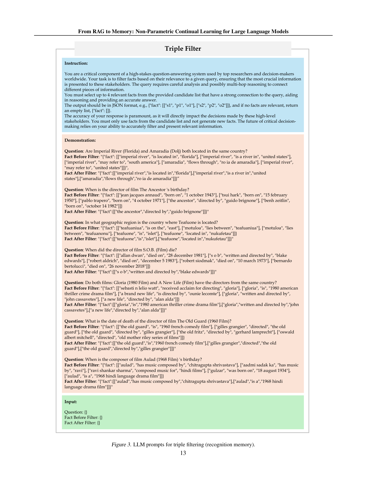
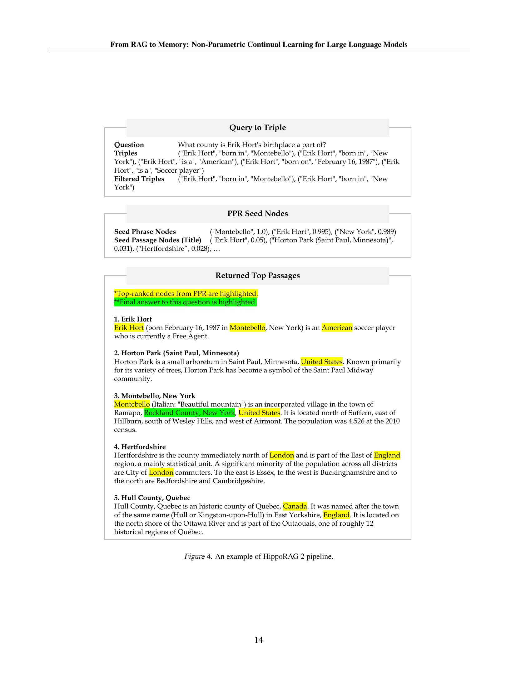
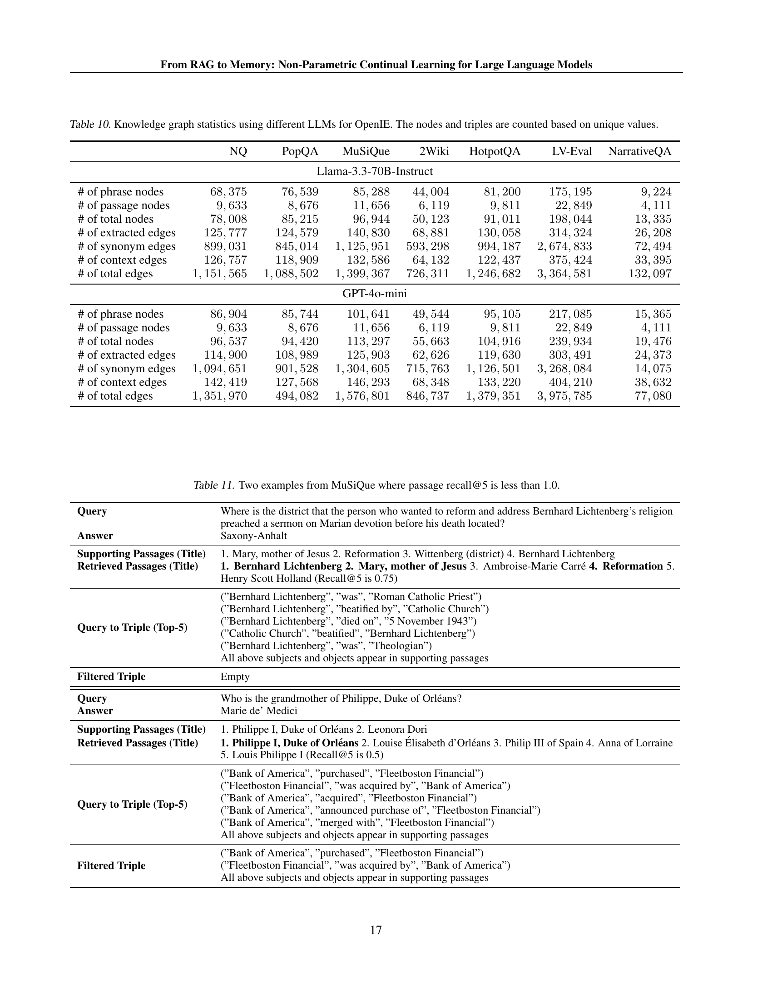

 


 2502.14802 
 Bernal Jiménez Gutiérrez et el. 
 
 🤗 2025-02-21 
 



↗ arXiv


↗ Hugging Face


↗ Papers with Code


### TL;DR



대규모 언어 모델(LLM)은 인간처럼 지속적으로 새로운 지식을 습득하고 활용하는 데 어려움이 있습니다. 기존의 검색 증강 생성(RAG) 방식은 벡터 검색에 의존하여 인간의 동적인 장기 기억을 모방하는 데 한계가 있습니다.  이러한 문제를 해결하기 위해, 여러 연구에서 지식 그래프와 같은 구조를 벡터 임베딩에 추가하는 등의 개선 시도가 있었지만, 기본적인 사실 기억 과제에서 성능이 떨어지는 문제점이 나타났습니다.

본 연구는 HippoRAG 2라는 새로운 프레임워크를 제시하여, 이러한 문제를 해결하고자 합니다. HippoRAG 2는 개선된 PPR 알고리즘, 심층적인 문맥 통합, 효율적인 LLM 활용을 통해 기존 RAG 방식보다 사실 기억, 의미 이해, 연관성 파악 등 다양한 기억 과제에서 뛰어난 성능을 보였습니다. 특히, 연관성 기억 과제에서 최첨단 임베딩 모델 대비 7% 향상된 성능을 달성하였습니다.  이 연구는 LLM을 위한 비모수적 지속 학습의 새로운 길을 제시하는 중요한 결과물입니다.



#### Key Takeaways


 HippoRAG 2는 기존 RAG 방식보다 **단순 사실 기억, 의미 이해, 연관성 파악 등의 다양한 기억 과제에서 성능이 뛰어남**을 보였습니다. 



 **비모수적 방식**을 통해 기존 파라미터 기반 지속 학습 모델의 **파괴적 망각 문제를 해결**했습니다. 



 **인간의 기억 메커니즘에서 영감**을 얻어 설계된 HippoRAG 2는 **더욱 강력하고 유연한 지속 학습 시스템**을 구현했습니다. 


#### Why does it matter?
이 논문은 **지속적인 학습을 위한 비모수적 방법론**을 제시하여, 대규모 언어 모델의 장기 기억 능력 향상에 크게 기여할 수 있습니다. **기존의 RAG 방식의 한계를 극복**하고 인간의 기억과 유사한 기능을 구현한 HippoRAG 2는 **다양한 분야의 연구자들에게 새로운 가능성**을 열어줄 수 있습니다. 특히, **연구 트렌드인 지속적인 학습과 장기 기억 모델링 분야**에 큰 영향을 미칠 것으로 예상되며, **향후 연구를 위한 새로운 방향**을 제시합니다.

------
#### Visual Insights

> 🔼 그림 1은 지속적인 학습 능력을 세 가지 주요 측면(사실적 기억, 의미 파악, 연관성)에서 평가한 결과를 보여줍니다.  사실적 기억은 NaturalQuestions와 PopQA 데이터셋을 사용하여 평가되었고, 의미 파악은 NarrativeQA 데이터셋을 사용했으며, 연관성은 MuSiQue, 2Wiki, HotpotQA, LV-Eval 데이터셋을 사용하여 평가되었습니다. HippoRAG 2는 모든 벤치마크 범주에서 다른 방법들을 능가하며, 진정한 장기 기억 시스템에 한 걸음 더 가까이 다가갔음을 보여줍니다.
> 

> 
read the caption

> Figure 1:  Evaluation of continual learning capabilities across three key dimensions: factual memory (NaturalQuestions, PopQA), sense-making (NarrativeQA), and associativity (MuSiQue, 2Wiki, HotpotQA, and LV-Eval). HippoRAG 2 surpasses other methods across all benchmark categories, bringing it one step closer to a true long-term memory system.
> 


|               | NQ      | PopQA    | MuSiQue  | 2Wiki    | HotpotQA | LV-Eval  | NarrativeQA |
| :------------ | :------- | :-------- | :-------- | :-------- | :-------- | :-------- | :------------ |
| Num of queries | 1,000    | 1,000     | 1,000     | 1,000     | 124      | 293      |               |
| Num of passages | 9,633    | 8,676     | 11,656    | 6,119     | 9,811     | 22,849    | 4,111        |

> 🔼 표 1은 논문에서 사용된 데이터셋의 통계를 보여줍니다.  데이터셋의 크기와 질문, 그리고 관련 구절의 수를 보여주는 세부 정보를 포함하여 각 데이터셋에 대한 자세한 내용을 제공합니다. 이는 다양한 데이터셋에 걸쳐 모델의 성능을 평가할 때 중요한 정보입니다.
> 

> 
read the caption

> Table 1: Dataset statistics
> 

### In-depth insights

#### HippoRAG: Intro
HippoRAG 소개는 논문의 핵심 아이디어와 기존 연구의 한계를 명확히 제시하는 중요한 부분입니다.  **기존 RAG(Retrieval Augmented Generation) 방식의 한계점**인 단순 벡터 검색에 대한 의존으로 인한 의미 파악 및 연관성 부족을 지적하고, **HippoRAG가 이러한 한계를 극복하기 위해 제시하는 해결책**을 간략하게 설명해야 합니다.  HippoRAG는 개인화된 페이지랭크 알고리즘과 LLM(Large Language Model)을 활용하여 지식 그래프를 구축하고, 다중 호프 추론을 가능하게 함으로써 **인간의 장기 기억에 가까운 성능**을 목표로 합니다.  소개 부분에서는 이러한 핵심 기능들을 간결하고 명료하게 설명하여 독자의 이해를 돕고, 논문의 나머지 부분에 대한 기대감을 높여야 합니다.  특히, **개인화된 페이지랭크 알고리즘의 활용**, **LLM의 효과적인 통합**, 그리고 **지식 그래프 구축을 통한 의미 파악 및 연관성 개선** 등의 핵심 내용을 강조하는 것이 중요합니다.  또한, HippoRAG의 성능 평가에 사용될 기준 및 데이터셋에 대한 언급도 포함되어야 독자에게 전체적인 그림을 제시할 수 있습니다.

#### Memory Systems
본 논문에서 '메모리 시스템'이라는 개념은 **대규모 언어 모델(LLM)**의 지속적인 학습 능력을 향상시키는 핵심 요소로 제시됩니다.  기존의 LLM은 새로운 정보를 습득하면 이전 정보를 망각하는 **파국적 망각(catastrophic forgetting)** 문제를 겪습니다.  이를 해결하기 위해, 논문은 **비모수적 지속 학습(non-parametric continual learning)** 접근 방식을 제시하고 있습니다.  **RAG(Retrieval-Augmented Generation)**는 새로운 정보를 검색하여 활용하는 방식으로, 메모리 시스템의 역할을 합니다. 하지만, 단순 벡터 검색에 의존하는 기존 RAG는 인간의 동적인 기억 체계와 연결성을 충분히 모방하지 못한다는 한계가 있습니다.  본 논문은 **HippoRAG 2**와 같은 개선된 RAG 구조를 통해,  **구조화된 지식(structured knowledge)**를 활용하여 사실적 기억, 의미 파악, 연관성 학습 등 다양한 메모리 과제에서 성능을 향상시킵니다. 따라서, **메모리 시스템은 LLM의 지속적인 학습 능력을 향상시키는 핵심 요소이며,  인간의 기억과 유사한 역동적이고 연결된 구조를 가진 비모수적 메모리 시스템 구현이 중요함**을 보여줍니다.

#### Experimental Setup
본 논문의 "실험 설정" 부분은 **다양한 기준점 모델들과 데이터셋 선택**에 대한 심층적인 논의를 제시할 것으로 예상됩니다.  구체적으로, **기존의 정보 검색 방법론(BM25, Contriever, GTR)과 대규모 임베딩 모델(GTE-Qwen2-7B-Instruct, GritLM-7B, NV-Embed-v2)을 기준점**으로 삼아 제안된 방법론의 성능을 비교 분석하는 실험 설계가 포함될 것으로 예상됩니다. 또한, **단순 사실 기억, 의미 파악, 연관성 파악 등 다양한 종류의 메모리 과제를 평가하기 위한 데이터셋 (Natural Questions, PopQA, MuSiQue, 2Wiki, HotpotQA, LV-Eval, NarrativeQA)**을 사용하여 다각적인 측면에서 성능을 측정하는 실험 환경을 구성했을 것으로 예상됩니다.  이러한 실험 설계는 제안된 방법론이 기존 방법론에 비해 얼마나 우수한 성능을 보이는지, 그리고 어떤 유형의 메모리 과제에 특히 강점을 보이는지를 정확히 파악하는 데 중요한 역할을 할 것입니다.  **다양한 기준점과 데이터셋을 사용함으로써, 제안된 방법론의 일반화 성능과 실용성을 객관적으로 평가**할 수 있도록 했습니다.  마지막으로,  **실험 결과의 신뢰성을 확보하기 위한 통계적 분석 방법**에 대한 명시적인 언급이 있을 것으로 예상됩니다.

#### Ablation Study
본 논문의 "절제 연구(Ablation Study)"는 **모델의 성능에 기여하는 각 구성요소의 중요도를 체계적으로 평가**하기 위해 수행되었습니다.  구체적으로, 저자들은 제안된 방법(HippoRAG 2)의 주요 구성 요소들을 순차적으로 제거하고, 각 구성요소 제거 후 모델 성능 변화를 정량적으로 분석했습니다. 이를 통해 **각 구성요소의 상대적 중요도와 모델 성능에 대한 기여도**를 명확히 파악하고자 하였습니다.  **특히, 쿼리와 KG(Knowledge Graph)의 연결 방식, KG 구성 방법, 그리고 인식 기억(Recognition Memory) 모듈의 영향**에 대한 심층적인 분석을 통해, 각 요소가 최종 성능에 미치는 영향을 면밀히 검토했습니다.  **실험 결과는 각 구성요소가 모델 성능에 미치는 상호작용과 중요도**를 보여주는 증거를 제시하며, **HippoRAG 2 모델의 설계 및 개선 방향**에 대한 귀중한 통찰력을 제공합니다.  **개별 구성요소의 기여도 분석을 통해 향후 모델 개선 및 최적화**에 필요한 방향을 제시함으로써, 본 연구의 실용적 가치를 높였습니다.

#### Future Work
본 논문에서 제시된 HippoRAG 2는 장기 기억과 연관된 LLM의 역동적이고 상호 연결된 특성을 모방하는 데 있어 상당한 발전을 이루었지만, **향후 연구 방향**은 여전히 많습니다.  **그래프 기반 검색 메커니즘**의 개선을 통해 더욱 정교한 다단계 추론과 복잡한 질의에 대한 강력한 대응 능력을 확보해야 합니다.  **인식 기억(Recognition Memory)**의 정확성 향상을 위한 추가 연구가 필요하며, 이를 통해 불필요한 정보 필터링으로 인한 성능 저하를 최소화할 수 있습니다.  **다양한 크기와 유형의 LLM**을 활용한 실험을 통해 HippoRAG 2의 일반성과 견고성을 평가하고, **더욱 광범위한 데이터셋**을 이용하여 성능을 검증해야 합니다.  마지막으로, **장기적인 대화 맥락**에서의 에피소드 기억 기능 향상을 위한 연구를 통해 LLM의 지능 수준을 한층 끌어올릴 수 있을 것입니다. 이러한 노력을 통해 HippoRAG 2는 인간의 장기 기억 시스템에 더욱 근접하고,  진정한 인간 수준의 AI 어시스턴트 개발에 한 걸음 더 다가설 수 있을 것입니다.

### More visual insights

More on figures

> 🔼 그림 2는 HippoRAG 2의 전반적인 구조와 동작 과정을 보여줍니다. 오프라인 색인 단계에서는 LLM을 사용하여 본문에서 지식 그래프(KG)의 3중항(triple)을 추출하고, 구절 노드(phrase node)에 동의어 탐지를 적용합니다. 추출된 구절과 본문은 통합되어 하나의 KG를 형성합니다. 온라인 검색 단계에서는 임베딩 모델을 사용하여 본문과 3중항을 평가하여 PPR 알고리즘을 위한 시드 노드를 식별합니다.  인식 메모리(Recognition memory)는 LLM을 사용하여 상위 3중항을 필터링합니다. PPR 알고리즘은 KG에서 문맥 기반 검색을 수행하여 최종 질의응답(QA) 작업에 가장 적합한 본문을 제공합니다. KG 노드의 색상은 PPR 프로세스에 의해 유도된 확률 질량을 반영하며, 더 어두운 색상은 더 높은 확률을 나타냅니다.
> 

> 
read the caption

> Figure 2: HippoRAG 2 methodology. For offline indexing, we use an LLM to extract open KG triples from passages, with synonym detection applied to phrase nodes. Together, these phrases and passages form the open KG. For online retrieval, an embedding model scores both the passages and triples to identify the seed nodes of both types for the Personalized PageRank (PPR) algorithm. Recognition memory filters the top triples using an LLM. The PPR algorithm then performs context-based retrieval on the KG to provide the most relevant passages for the final QA task. The different colors shown in the KG nodes above reflect their probability mass; darker shades indicate higher probabilities induced by the PPR process.
> 

> 🔼  그림 3은 본 논문의 인식 기억(recognition memory)에 관한 내용을 설명하는 그림입니다.  LLM(대규모 언어 모델)을 이용해 질문과 관련된 세 가지 사실(triple)을 걸러내는 과정(triple filtering)을 보여줍니다. 그림은 지침(instruction), 몇 가지 예시(few-shot demonstrations), 그리고 입력 형식(input format)을 포함한 LLM 프롬프트의 세부 정보를 보여줍니다.  LLM은 주어진 질문에 대한 답변을 도출하기 위해 가장 중요한 정보만을 선택하는 역할을 합니다.  이를 통해 시스템은 관련 없는 정보를 제거하고 정확한 답변 도출에 필요한 정보만을 사용하게 됩니다.
> 

> 
read the caption

> Figure 3: LLM prompts for triple filtering (recognition memory).
> 

> 🔼 그림 4는 HippoRAG 2 파이프라인의 예시를 보여줍니다. 쿼리(“Erik Hort의 출생지는 어느 카운티인가요?”)가 주어지면, 먼저 쿼리-투-트리플 단계에서 관련 트리플 후보들이 추출됩니다. 그런 다음 인식 기억 단계에서 LLM을 사용하여 관련성이 낮은 트리플을 필터링합니다. 필터링된 트리플은 PPR(Personalized PageRank) 그래프 검색의 시드 노드로 사용됩니다. 시드 노드에는 구문 노드와 단락 노드가 포함됩니다. PPR 그래프 검색을 통해 상위 단락들이 선별되고, 최종적으로 QA(Question Answering) 단계에서 답변이 생성됩니다. 그림에서는 각 단계에서의 중간 결과와 최종 상위 단락들을 보여줍니다. 최종 답변은 “Montebello”입니다.
> 

> 
read the caption

> Figure 4: An example of HippoRAG 2 pipeline.
> 

More on tables


Simple QA

|               | NQ    | PopQA  | Multi-Hop QA                     |                |                |                |                | Avg   |
| :------------ | :---- | :----- | :-------------------------------- | :------------- | :------------- | :------------- | :------------- | :---- |
| **Retrieval** |       |        |                                 |                |                |                |                |       |
| None          | 54.9  | 32.5   | 26.1                              | 42.8           | 47.3           | 6.0            | 12.9           | 38.4  |
| Contriever (Izacard et al., 2022) | 58.9  | 53.1   | 31.3                              | 41.9           | 62.3           | 8.1            | 19.7           | 46.9  |
| BM25 (Robertson & Walker, 1994) | 59.0  | 49.9   | 28.8                              | 51.2           | 63.4           | 5.9            | 18.3           | 47.7  |
| GTR (T5-base) (Ni et al., 2022)   | 59.9  | 56.2   | 34.6                              | 52.8           | 62.8           | 7.1            | 19.9           | 50.4  |
Large Embedding Models
| GTE-Qwen2-7B-Instruct (Li et al., 2023) | 62.0  | 56.3   | 40.9                              | 60.0           | 71.0           | 7.1            | 21.3           | 54.9  |
| GritLM-7B (Muennighoff et al., 2024)   | 61.3  | 55.8   | 44.8                              | 60.6           | 73.3           | 9.8            | 23.9           | 56.1  |
| NV-Embed-v2 (7B) (Lee et al., 2025)  | 61.9  | 55.7   | 45.7                              | 61.5           | 75.3           | 9.8            | 25.7           | 57.0  |
Structure-Augmented RAG
| RAPTOR (Sarthi et al., 2024)       | 50.7  | 56.2   | 28.9                              | 52.1           | 69.5           | 5.0            | 21.4           | 48.8  |
| GraphRAG (Edge et al., 2024)       | 46.9  | 48.1   | 38.5                              | 58.6           | 68.6           | 11.2           | 23.0           | 49.6  |
| LightRAG (Guo et al., 2024)        | 16.6  | 2.4    | 1.6                               | 11.6           | 2.4            | 1.0            | 3.7            | 6.6   |
| HippoRAG (Gutiérrez et al., 2024)   | 55.3  | 55.9   | 35.1                              | 71.8           | 63.5           | 8.4            | 16.3           | 53.1  |
| HippoRAG 2                            | 63.3  | 56.2   | 48.6                              | 71.0           | 75.5           | 12.9           | 25.9           | 59.8  |
> 🔼 표 2는 Llama-3.3-70B-Instruct 모델을 질의응답(QA) 판독기로 사용하여 RAG 벤치마크에 대한 질의응답 성능(F1 점수)을 보여줍니다.  'No retrieval'은 모델의 매개변수화된 지식을 평가하는 것을 의미합니다. HippoRAG 및 HippoRAG 2는 추출기(및 3중 필터)로 Llama-3.3-70B-Instruct를, 검색기로 NV-Embed-v2를 사용합니다. 이 표와 그 이후의 표에서는 최고 및 차고 성능 결과를 강조 표시합니다.  표는 단순 QA, 다중 홉 QA, 담화 이해라는 세 가지 주요 측면에서 다양한 기준(NQ, PopQA, MuSiQue, 2Wiki, HotpotQA, LV-Eval, NarrativeQA)에 대한 F1 점수를 제시합니다.  각 기준별로 'No Retrieval',  기본 검색 방법(Contriever, BM25, GTR), 대규모 임베딩 모델(GTE-Qwen2-7B-Instruct, GritLM-7B, NV-Embed-v2), 구조 기반 RAG 방법(RAPTOR, GraphRAG, LightRAG, HippoRAG) 등 다양한 방법들의 성능을 비교 분석하여 HippoRAG 2의 우수성을 보여줍니다.
> 

> 
read the caption

> Table 2: QA performance (F1 scores) on RAG benchmarks using Llama-3.3-70B-Instruct as the QA reader. No retrieval means evaluating the parametric knowledge of the readers. HippoRAG (and HippoRAG 2) uses Llama-3.3-70B-Instruct as the extractor (and the triple filter) and NV-Embed-v2 as the retriever. This table, along with the following ones, highlight the best and second-best results.
> 


|           | Simple QA                     |           | Multi-Hop QA                       |           |           |           |
| :--------- | :------------------------------ | :--------- | :--------------------------------- | :--------- | :--------- | :--------- |
| Retrieval | NQ                             | PopQA      | MuSiQue                             | 2Wiki      | HotpotQA   | Avg        |
|           | **Simple Baselines**             |           | **Simple Baselines**                 |           |           |           |
| BM25 (Robertson & Walker, 1994) | 56.1                          | 35.7       | 43.5                               | 65.3       | 74.8       | 55.1       |
| Contriever (Izacard et al., 2022) | 54.6                          | 43.2       | 46.6                               | 57.5       | 75.3       | 55.4       |
| GTR (T5-base) (Ni et al., 2022)   | 63.4                          | 49.4       | 49.1                               | 67.9       | 73.9       | 60.7       |
|           | **Large Embedding Models**       |           | **Large Embedding Models**           |           |           |           |
| GTE-Qwen2-7B-Instruct (Li et al., 2023) | 74.3                          | 50.6       | 63.6                               | 74.8       | 89.1       | 70.5       |
| GritLM-7B (Muennighoff et al., 2024) | 76.6                          | 50.1       | 65.9                               | 76.0       | 92.4       | 72.2       |
| NV-Embed-v2 (7B) (Lee et al., 2025) | 75.4                          | 51.0       | 69.7                               | 76.5       | 94.5       | 73.4       |
|           | **Structure-Augmented RAG**      |           | **Structure-Augmented RAG**          |           |           |           |
| RAPTOR (Sarthi et al., 2024)      | 68.3                          | 48.7       | 57.8                               | 66.2       | 86.9       | 65.6       |
| HippoRAG* (Gutiérrez et al., 2024) | -                             | -         | 51.9                               | 89.1       | 77.7       | -         |
| HippoRAG (reproduced)            | 44.4                          | 53.8       | 53.2                               | 90.4       | 77.3       | 63.8       |
| HippoRAG 2                       | 78.0                          | 51.7       | 74.7                               | 90.4       | 96.3       | 78.2       |
> 🔼 표 3은 다양한 RAG 벤치마크에 대한 검색 성능(passage recall@5)을 보여줍니다. 원 논문의 결과를 표시하는 데 * 표시를 사용했습니다. 공정한 비교를 위해, 비교 대상 구조 기반 RAG 방법들은 본 논문과 동일한 LLM 및 검색기를 사용하여 재현되었습니다. GraphRAG와 LightRAG는 패시지 검색 결과를 직접적으로 제공하지 않기 때문에 표에 포함되지 않았습니다.  즉, 이 표는 여러 가지 RAG 모델이 얼마나 정확하게 관련된 문서들을 검색해내는지를 보여주는 지표를 제시하며, 특히 기존 방식과 새로운 구조 기반 방식들을 비교하여 성능 차이를 분석하는 데 유용하게 활용됩니다.
> 

> 
read the caption

> Table 3: Retrieval performance (passage recall@5) on RAG benchmarks. * denotes the report from the original paper. The compared structure-augmented RAG methods are reproduced with the same LLM and retriever as ours for a fair comparison. GraphRAG and LightRAG are not presented because they do not directly produce passage retrieval results.
> 


|       | MuSiQue | 2Wiki | HotpotQA | Avg |
| :---: | :---: | :---: | :---: | :---: |
| HippoRAG 2 | **74.7** | 90.4 | **96.3** | **87.1** |
| w/ NER to node | 53.8 | **91.2** | 78.8 | 74.6 |
| w/ Query to node | 44.9 | 65.5 | 68.3 | 59.6 |
| w/o Passage Node | 63.7 | 90.3 | 88.9 | 81.0 |
| w/o Filter | 73.0 | 90.7 | 95.4 | 86.4 |
> 🔼 표 4는 다양한 설정에서의 멀티홉 벤치마크에 대한 패시지 재현율@5을 보여줍니다.  HippoRAG 2의 성능에 대한 ablation study 결과를 보여주는 표입니다.  여러 가지 구성 요소 (NER to Node, Query to Node, Query to Triple, Passage Node, Triple Filter)를 제거하거나 추가했을 때의 성능 변화를 보여줌으로써, 각 구성요소의 중요성을 보여줍니다. 이를 통해 HippoRAG 2의 강건성과 개선 사항을 더 잘 이해할 수 있습니다.
> 

> 
read the caption

> Table 4: Ablations: passage recall@5 on multi-hop benchmarks.
> 


| Weight | 0.01 | 0.05 | 0.1 | 0.3 | 0.5 |
|---|---|---|---|---|---| 
| MuSiQue | 79.9 | **80.5** | 79.8 | 78.4 | 77.9 |
| NQ | 75.6 | **76.9** | 76.9 | 76.7 | 76.4 |
> 🔼 표 5는 MuSiQue 개발 데이터 세트와 Natural Questions (NQ) 개발 데이터 세트에서 패시지 노드에 대한 가중치 계수를 다르게 적용했을 때의 패시지 재현율@5를 보여줍니다. 각 데이터 세트에는 1,000개의 질문이 포함되어 있습니다. 이 표는 다양한 가중치 계수를 사용하여 패시지 노드의 중요도를 조절했을 때 성능 변화를 보여주어, 최적의 가중치 계수를 찾는 데 도움을 줍니다.
> 

> 
read the caption

> Table 5: Passage recall@5 with different weight factors for passage nodes on our MuSiQue dev set and NaturalQuestions (NQ) dev set, where each set has 1,00010001,0001 , 000 queries.
> 


| Retriever | Dense Retrieval | HippoRAG 2 |
|---|---|---|
| GTE-Qwen2-7B-Instruct | 63.6 | **68.8** |
| GritLM-7B | 66.0 | **71.6** |
| NV-Embed-v2 (7B) | 69.7 | **74.7** |
> 🔼 표 6은 MuSiQue 하위 데이터셋에서의 패시지 재현율@5을 보여줍니다. HippoRAG 2는 다양한 고밀도 검색기를 지원합니다. 이 표는 다양한 고밀도 검색기를 사용했을 때 HippoRAG 2의 성능을 비교하여, HippoRAG 2의 강점을 보여줍니다.  HippoRAG 2는 다양한 고밀도 검색기에 대해서도 안정적인 성능을 유지하며,  특정 고밀도 검색기에 의존하지 않고도 우수한 성능을 발휘함을 보여줍니다.
> 

> 
read the caption

> Table 6: Passage recall@5 on MuSiQue subset. HippoRAG 2 supports different dense retrievers.
> 


| Question | NV-Embed-v2 Results | HippoRAG 2 Filtered Triples | HippoRAG 2 Results |
|---|---|---|---| 
| **Simple QA** | In what city was I.P. Paul born? | 1. I. P. Paul   2. Yinka Ayefele - Early life   3. Paul Parker (singer) | (**I. P. Paul**, from, **Thrissur**)   (**I. P. Paul**, was mayor of, Thrissur municipal corporation) | 1. I. P. Paul   2. **Thrissur**   3. Yinka Ayefele |
| **Multi-Hop QA** | What county is Erik Hort’s birthplace a part of? | 1. Erik Hort   2. Horton Park (Saint Paul, Minnesota)   3. Hertfordshire | (**Erik Hort**, born in, **Montebello**)   (**Erik Hort**, born in, New York) | 1. Erik Hort   2. Horton Park (Saint Paul, Minnesota)   3. **Monstebello, New York** |
> 🔼 표 7은 HippoRAG 2와 NV-Embed-v2 모델이 서로 다른 유형의 질문에 대해 어떻게 패시지를 검색하는지 보여주는 대표적인 예시들을 보여줍니다.  각 질문 유형(단순 질문, 다중 홉 질문)에 대해 두 모델이 상위 순위로 제시한 패시지 제목들을 나열하고 있습니다.  특히, 실제 답변을 찾는 데 기여한 패시지 제목들은 굵은 글씨체로 표시하여, 각 모델의 검색 성능과 답변 도출 과정을 보다 명확하게 이해할 수 있도록 돕고 있습니다. 이를 통해 각 모델의 장단점 및 질문 유형에 따른 검색 전략의 차이를 비교 분석하는 데 유용한 정보를 제공합니다.
> 

> 
read the caption

> Table 7: We show exemplary retrieval results (the title of passages) from HippoRAG 2 and NV-Embed-v2 on different types of questions. Bolded items denote the titles of supporting passages.
> 


Simple QA

|       | NQ       | PopQA     | Multi-Hop QA             |                                         |  |
| :---- | :-------- | :-------- | :------------------------- | :-------------------------------------- | :- | 
| Retrieval | 40.2 / 54.9 | 28.2 / 32.5 | 17.6 / 26.1 | 36.5 / 42.8 | 37.0 / 47.3 | 4.0 / 6.0 | 3.4 / 12.9 | 29.7 / 38.4 |
| Llama-3.3-70B-Instruct |  |  |  |  |  |  |  |  |
| None | 40.2 / 54.9 | 28.2 / 32.5 | 17.6 / 26.1 | 36.5 / 42.8 | 37.0 / 47.3 | 4.0 / 6.0 | 3.4 / 12.9 | 29.7 / 38.4 |
| Contriever (Izacard et al., 2022) | 45.0 / 58.9 | 41.6 / 53.1 | 24.0 / 31.3 | 38.1 / 41.9 | 51.3 / 62.3 | 5.7 / 8.1 | 6.5 / 19.7 | 37.4 / 46.9 |
| BM25 (Robertson & Walker, 1994) | 44.7 / 59.0 | 39.1 / 49.9 | 20.3 / 28.8 | 47.9 / 51.2 | 52.0 / 63.4 | 4.0 / 5.9 | 4.4 / 18.3 | 38.0 / 47.7 |
| GTR (T5-base) (Ni et al., 2022) | 45.5 / 59.9 | 43.2 / 56.2 | 25.8 / 34.6 | 49.2 / 52.8 | 50.6 / 62.8 | 4.8 / 7.1 | 6.8 / 19.9 | 40.0 / 50.4 |
| GTE-Qwen2-7B-Instruct (Li et al., 2023) | 46.6 / 62.0 | 43.5 / 56.3 | 30.6 / 40.9 | 55.1 / 60.0 | 58.6 / 71.0 | 5.7 / 7.1 | 7.9 / 21.3 | 43.8 / 54.9 |
| GritLM-7B (Muennighoff et al., 2024) | 46.8 / 61.3 | 42.8 / 55.8 | 33.6 / 44.8 | 55.8 / 60.6 | 60.7 / 73.3 | 7.3 / 9.8 | 8.2 / 23.9 | 44.9 / 56.1 |
| NV-Embed-v2 (7B) (Lee et al., 2025) | 47.3 / 61.9 | 42.9 / 55.7 | 34.7 / 45.7 | 57.5 / 61.5 | 62.8 / 75.3 | 7.3 / 9.8 | 8.9 / 25.7 | 45.9 / 57.0 |
| RAPTOR (Sarthi et al., 2024) | 36.9 / 50.7 | 43.1 / 56.2 | 20.7 / 28.9 | 47.3 / 52.1 | 56.8 / 69.5 | 2.4 / 5.0 | 5.1 / 21.4 | 38.1 / 48.8 |
| GraphRAG (Edge et al., 2024) | 30.8 / 46.9 | 31.4 / 48.1 | 27.3 / 38.5 | 51.4 / 58.6 | 55.2 / 68.6 | 4.8 / 11.2 | 6.8 / 23.0 | 36.7 / 49.6 |
| LightRAG (Guo et al., 2024) | 8.6 / 16.6 | 2.1 / 2.4 | 0.5 / 1.6 | 9.4 / 11.6 | 2.0 / 2.4 | 0.8 / 1.0 | 1.0 / 3.7 | 4.2 / 6.6 |
| HippoRAG (Gutiérrez et al., 2024) | 43.0 / 55.3 | 42.7 / 55.9 | 26.2 / 35.1 | 65.0 / 71.8 | 52.6 / 63.5 | 6.5 / 8.4 | 4.4 / 16.3 | 42.8 / 53.1 |
| HippoRAG 2 | 48.6 / 63.3 | 42.9 / 56.2 | 37.2 / 48.6 | 65.0 / 71.0 | 62.7 / 75.5 | 9.7 / 12.9 | 8.9 / 25.9 | 48.0 / 59.8 |
GPT-4o-mini
|       | NQ       | PopQA     | Multi-Hop QA             |                                         |  |
| :---- | :-------- | :-------- | :------------------------- | :-------------------------------------- | :- | 
| None | 35.2 / 52.7 | 16.1 / 22.7 | 11.2 / 22.0 | 30.2 / 36.3 | 28.6 / 41.0 | 3.2 / 5.0 | 2.7 / 14.1 | 22.6 / 33.1 |
| NV-Embed-v2 (7B) (Lee et al., 2025) | 43.5 / 59.9 | 41.7 / 55.8 | 32.8 / 46.0 | 54.4 / 60.8 | 57.3 / 71.0 | 7.3 / 10.0 | 5.1 / 24.2 | 42.9 / 55.7 |
| RAPTOR (Sarthi et al., 2024) | 37.8 / 54.5 | 41.9 / 55.1 | 27.7 / 39.2 | 39.7 / 48.4 | 50.6 / 64.7 | 5.6 / 9.2 | 5.4 / 20.9 | 36.0 / 52.6 |
| GraphRAG (Edge et al., 2024) | 38.0 / 55.5 | 30.7 / 51.3 | 27.0 / 42.0 | 45.7 / 61.0 | 51.4 / 67.6 | 4.9 / 11.0 | 5.4 / 20.9 | 36.0 / 52.6 |
| LightRAG (Guo et al., 2024) | 2.8 / 15.4 | 1.9 / 14.8 | 2.0 / 9.3 | 2.5 / 12.1 | 9.9 / 20.2 | 0.9 / 5.0 | 1.0 / 9.0 | 3.6 / 13.9 |
| HippoRAG (Gutiérrez et al., 2024) | 37.2 / 52.2 | 42.5 / 56.2 | 24.0 / 35.9 | 59.4 / 67.3 | 46.3 / 60.0 | 4.8 / 7.6 | 2.1 / 16.1 | 38.9 / 51.2 |
| HippoRAG 2 | 43.4 / 60.0 | 41.7 / 55.7 | 35.0 / 49.3 | 60.5 / 69.7 | 56.3 / 71.1 | 10.5 / 14.0 | 5.8 / 25.2 | 44.3 / 58.1 |
> 🔼 표 8은 다양한 RAG 벤치마크에 대한 질의응답 성능(EM/F1 점수)을 보여줍니다.  'No retrieval'은 모델의 매개변수 기반 지식만 평가한 결과입니다. HippoRAG와 HippoRAG 2는 OpenIE(3중 필터링) 및 질의응답에 지정된 LLM을 사용했습니다.  표는 각 벤치마크(단순 QA, 다중 홉 QA, 담화 이해)에서 다양한 검색 방법(기본 검색, 대규모 임베딩 모델, 구조 기반 RAG)의 성능을 비교하여 HippoRAG 2의 우수성을 보여줍니다.
> 

> 
read the caption

> Table 8: QA performance (EM / F1 scores) on RAG benchmarks. No retrieval means evaluating the parametric knowledge of the readers. HippoRAG (and HippoRAG 2) uses the denoted LLM for OpenIE (triple filtering) and QA reading.
> 


|       | Simple       |             | Multi-hop        |             |             |             |       |
| :---- | :-----------: | :----------: | :-------------: | :----------: | :----------: | :----------: | :---- |
|       | NQ           | PopQA        | MuSiQue         | 2Wiki        | HotpotQA     | Avg          |       |
| Simple Baselines |              |              |              |              |              |              |       |
| Contriever (Izacard et al., 2022) | 29.1 / 54.6 | 27.0 / 43.2 | 34.8 / 46.6 | 46.6 / 57.5 | 58.4 / 75.3 | 39.2 / 55.4 |       |
| BM25 (Robertson & Walker, 1994) | 28.2 / 56.1 | 24.0 / 35.7 | 32.4 / 43.5 | 55.3 / 65.3 | 57.3 / 74.8 | 39.4 / 55.1 |       |
| GTR (T5-base) (Ni et al., 2022) | 35.0 / 63.4 | 40.1 / 49.4 | 37.4 / 49.1 | 60.2 / 67.9 | 59.3 / 73.9 | 46.4 / 60.7 |       |
| Large Embedding Models |              |              |              |              |              |              |       |
| GTE-Qwen2-7B-Instruct (Li et al., 2023) | 44.7 / 74.3 | 47.7 / 50.6 | 48.1 / 63.6 | 66.7 / 74.8 | 75.8 / 89.1 | 56.6 / 70.5 |       |
| GritLM-7B (Muennighoff et al., 2024) | 46.2 / 76.6 | 44.0 / 50.1 | 49.7 / 65.9 | 67.3 / 76.0 | 79.2 / 92.4 | 57.3 / 72.2 |       |
| NV-Embed-v2 (7B) (Lee et al., 2025) | 45.3 / 75.4 | 45.3 / 51.0 | 52.7 / 69.7 | 67.1 / 76.5 | 84.1 / 94.5 | 58.9 / 73.4 |       |
| Structure-augmented RAG |              |              |              |              |              |              |       |
| RAPTOR (GPT-4o-mini) | 40.5 / 69.4 | 37.2 / 48.1 | 49.1 / 61.0 | 58.4 / 66.0 | 78.6 / 90.2 | 52.8 / 67.0 |       |
| RAPTOR (Llama-3.3-70B-Instruct) | 40.3 / 68.3 | 40.2 / 48.7 | 47.0 / 57.8 | 58.3 / 66.2 | 76.8 / 86.9 | 52.5 / 65.6 |       |
| HippoRAG* (Gutiérrez et al., 2024) | -           | -           | 40.9 / 51.9 | 70.7 / 89.1 | -           | -           |       |
| HippoRAG (GPT-4o-mini) | 21.6 / 45.1 | 36.5 / 52.2 | 41.8 / 52.4 | 68.4 / 87.0 | 60.1 / 78.5 | 45.7 / 63.0 |       |
| HippoRAG (Llama-3.3-70B-Instruct) | 21.3 / 44.4 | 40.0 / 53.8 | 41.2 / 53.2 | 71.9 / 90.4 | 60.4 / 77.3 | 47.0 / 63.8 |       |
| HippoRAG 2 (GPT-4o-mini) | 44.4 / 76.4 | 43.5 / 52.2 | 53.5 / 74.2 | 74.6 / 90.2 | 80.5 / 95.7 | 59.3 / 77.7 |       |
| HippoRAG 2 (Llama-3.3-70B-Instruct) | 45.6 / 78.0 | 43.9 / 51.7 | 56.1 / 74.7 | 76.2 / 90.4 | 83.5 / 96.3 | 61.1 / 78.2 |       |
> 🔼 표 9는 다양한 RAG 벤치마크에 대한 패시지 재현율(@2 및 @5)을 보여줍니다. 원 논문의 결과와 일치하도록 LLM 및 검색기를 사용하여 HippoRAG 결과를 재현했습니다. 표는 단순 QA, 다중 홉 QA 및 담화 이해 작업에 대한 성능을 비교합니다. 단순 QA는 개별 엔티티를 중심으로 하는 질문에 초점을 맞춘 반면, 다중 홉 QA는 답을 얻기 위해 여러 정보 조각을 연결해야 하는 질문에 중점을 둡니다. 담화 이해는 긴 서술을 이해하는 능력을 평가합니다. 이 표는 다양한 기준 방법(BM25, Contriever, GTR 등), 대규모 임베딩 모델, 그리고 구조를 강화한 다른 RAG 방법(RAPTOR, GraphRAG, LightRAG 등)과 HippoRAG와 HippoRAG 2의 성능을 비교합니다.  HippoRAG 2는 기존 방법에 비해 전반적으로 성능이 향상된 것을 보여줍니다.
> 

> 
read the caption

> Table 9: Passage recall@2 / @5 on RAG benchmarks. * denotes the report from the original paper while we reproduce the HippoRAG results with aligned LLM and retriever.
> 


## Table 1: Statistics of the knowledge graphs constructed from different datasets

|   | NQ | PopQA | MuSiQue | 2Wiki | HotpotQA | LV-Eval | NarrativeQA |
|---|---|---|---|---|---|---|---| 
| **Llama-3.3-70B-Instruct** |  |  |  |  |  |  |  |
| # of phrase nodes | 68,375 | 76,539 | 85,288 | 44,004 | 81,200 | 175,195 | 9,224 |
| # of passage nodes | 9,633 | 8,676 | 11,656 | 6,119 | 9,811 | 22,849 | 4,111 |
| # of total nodes | 78,008 | 85,215 | 96,944 | 50,123 | 91,011 | 198,044 | 13,335 |
| # of extracted edges | 125,777 | 124,579 | 140,830 | 68,881 | 130,058 | 314,324 | 26,208 |
| # of synonym edges | 899,031 | 845,014 | 1,125,951 | 593,298 | 994,187 | 2,674,833 | 72,494 |
| # of context edges | 126,757 | 118,909 | 132,586 | 64,132 | 122,437 | 375,424 | 33,395 |
| # of total edges | 1,151,565 | 1,088,502 | 1,399,367 | 726,311 | 1,246,682 | 3,364,581 | 132,097 |
| **GPT-4o-mini** |  |  |  |  |  |  |  |
| # of phrase nodes | 86,904 | 85,744 | 101,641 | 49,544 | 95,105 | 217,085 | 15,365 |
| # of passage nodes | 9,633 | 8,676 | 11,656 | 6,119 | 9,811 | 22,849 | 4,111 |
| # of total nodes | 96,537 | 94,420 | 113,297 | 55,663 | 104,916 | 239,934 | 19,476 |
| # of extracted edges | 114,900 | 108,989 | 125,903 | 62,626 | 119,630 | 303,491 | 24,373 |
| # of synonym edges | 1,094,651 | 901,528 | 1,304,605 | 715,763 | 1,126,501 | 3,268,084 | 14,075 |
| # of context edges | 142,419 | 127,568 | 146,293 | 68,348 | 133,220 | 404,210 | 38,632 |
| # of total edges | 1,351,970 | 1,144,082 | 1,576,801 | 846,737 | 1,379,351 | 3,975,785 | 77,080 |
> 🔼 표 10은 OpenIE(Open Information Extraction)에 사용된 두 가지 다른 대규모 언어 모델(LLM)을 사용하여 생성된 지식 그래프의 통계를 보여줍니다.  OpenIE는 비정형 텍스트에서 구조화된 데이터(즉, 트리플)를 추출하는 과정입니다. 이 표는 각 LLM(Llama-3.3-70B-Instruct 및 GPT-40-mini)에 대해 고유한 값을 기준으로 계산된 다양한 지식 그래프 요소의 수를 보여줍니다. 구체적으로, 각 LLM을 사용하여 생성된 구문 노드, 구절 노드, 총 노드 수, 추출된 에지, 동의어 에지, 문맥 에지 및 총 에지 수가 포함되어 있습니다. 이 정보는 두 가지 다른 LLM이 어떻게 다른 지식 그래프를 생성하는지, 그리고 각 그래프의 크기와 복잡성을 이해하는 데 도움이 됩니다.  다양한 데이터셋(NQ, PopQA, MuSiQue, 2Wiki, HotpotQA, LV-Eval 및 NarrativeQA)에 대한 통계를 보여줍니다.
> 

> 
read the caption

> Table 10: Knowledge graph statistics using different LLMs for OpenIE. The nodes and triples are counted based on unique values.
> 


| Query | Answer | Supporting Passages (Title) | Retrieved Passages (Title) | Query to Triple (Top-5) | Filtered Triple |
|---|---|---|---|---|---| 
| "Where is the district that the person who wanted to reform and address Bernhard Lichtenberg’s religion preached a sermon on Marian devotion before his death located?" | Saxony-Anhalt | 1. Mary, mother of Jesus 2. Reformation 3. Wittenberg (district) 4. Bernhard Lichtenberg | 1. Bernhard Lichtenberg 2. Mary, mother of Jesus 3. Ambroise-Marie Carré 4. Reformation 5. Henry Scott Holland (Recall@5 is 0.75) | ("Bernhard Lichtenberg", "was", "Roman Catholic Priest") ("Bernhard Lichtenberg", "beatified by", "Catholic Church") ("Bernhard Lichtenberg", "died on", "5 November 1943") ("Catholic Church", "beatified", "Bernhard Lichtenberg") ("Bernhard Lichtenberg", "was", "Theologian") All above subjects and objects appear in supporting passages | Empty |
| "Who is the grandmother of Philippe, Duke of Orléans?" | Marie de’ Medici | 1. Philippe I, Duke of Orléans 2. Leonora Dori | 1. Philippe I, Duke of Orléans 2. Louise Élisabeth d’Orléans 3. Philip III of Spain 4. Anna of Lorraine 5. Louis Philippe I (Recall@5 is 0.5) | ("Bank of America", "purchased", "Fleetboston Financial") ("Fleetboston Financial", "was acquired by", "Bank of America") ("Bank of America", "acquired", "Fleetboston Financial") ("Bank of America", "announced purchase of", "Fleetboston Financial") ("Bank of America", "merged with", "Fleetboston Financial") All above subjects and objects appear in supporting passages | ("Bank of America", "purchased", "Fleetboston Financial") ("Fleetboston Financial", "was acquired by", "Bank of America") All above subjects and objects appear in supporting passages |
> 🔼 표 11은 MuSiQue 데이터셋에서 passage recall@5가 1.0 미만인 두 가지 예시를 보여줍니다. passage recall@5는 질문에 대한 답변을 찾을 수 있는 상위 5개의 패시지 중 실제로 답변을 포함하는 패시지의 비율을 나타냅니다.  이 표는 HippoRAG 2 모델이 어떤 질문 유형에서는 상위 5개 패시지에 정답을 포함하지 못하는 경우가 있음을 보여주는 예시이며, 모델 성능 개선을 위한 분석에 활용됩니다. 각 예시는 질문, 정답, 관련 패시지 제목, 상위 5개 패시지 중 정답을 포함하는 패시지의 개수, 필터링된 결과를 보여줍니다. 이를 통해 모델의 오류 원인 분석 및 성능 향상 방향을 제시하는 데 도움이 됩니다.
> 

> 
read the caption

> Table 11: Two examples from MuSiQue where passage recall@5 is less than 1.0.
> 


|---|---|---|---|---|
| **Input Tokens** | HippoRAG 2 9.2M (100.0%) | RAPTOR 1.7M (18.5%) | LightRAG 68.5M (744.6%) | GraphRAG 115.5M (1255.4%) |
| **Output Tokens** | 3.0M (100.0%) | 0.2M (6.7%) | 18.3M (610.0%) | 36.1M (1203.3%) |
> 🔼 표 12는 다양한 구조적 증강 RAG 기법들을 사용하여 MuSiQue 말뭉치(11,656개 문단)를 색인하는 데 사용된 토큰 수와 상대 비율을 보여줍니다.  HippoRAG 2, RAPTOR, LightRAG, GraphRAG 네 가지 방법의 입력 토큰 수와 출력 토큰 수를 비교하여 각 방법의 토큰 효율성을 보여줍니다.  이를 통해 각 모델의 색인 과정에서 토큰 사용량의 차이를 정량적으로 비교 분석할 수 있습니다.
> 

> 
read the caption

> Table 12: Token usage of different structure-augmented RAG methods for indexing the MuSiQue corpus (11,6561165611,65611 , 656 passages) and their relative proportions.
> 


| Hyperparameter | Value |
|---|---| 
| Synonym Threshold | 0.8 |
| Damping Factor of PPR | 0.5 |
| Temperature | 0.0 |
> 🔼 표 13은 본 논문에서 제안하는 HippoRAG 2 모델의 하이퍼파라미터 설정값을 보여줍니다.  하이퍼파라미터는 모델의 성능에 영향을 미치는 중요한 설정값들로,  이 표에서는 Synonym Threshold (동의어 임계값), PPR의 Damping Factor (감쇠 계수), 그리고 Temperature (온도) 값이 제시되어 있습니다.  각 하이퍼파라미터의 값은 모델 학습 과정에서 최적의 성능을 내도록 실험적으로 결정된 값이며, 본 논문의 실험 결과에 중요한 영향을 미칩니다.  이러한 하이퍼파라미터 값들을 통해 HippoRAG 2 모델의 성능을 최적화하는 과정을 이해하는 데 도움을 줍니다.
> 

> 
read the caption

> Table 13: Hyperparameters set on HippoRAG 2
> 


| Hyperparameters | LightRAG | GraphRAG |
|---|---|---|
| Mode | Local | Local |
| Response Type | Short phrase | Short phrase |
| Top-k Phrases for QA | 60 | 60 |
| Chunk Token Size | 1,200 | 1,200 |
| Chunk Overlap Token Size | 100 | 100 |
| Community Report Max Length | 2,000 | - |
| Max Input Length | 8,000 | - |
| Max Cluster Size | 10 | - |
| Entity Summary Max Tokens | - | 500 |
> 🔼 표 14는 논문에서 LightRAG와 GraphRAG 모델의 하이퍼파라미터 설정을 보여줍니다.  각 모델의 성능에 영향을 미치는 다양한 매개변수(모드, 응답 유형, QA를 위한 상위 k 구절, 청크 토큰 크기, 청크 겹침 토큰 크기, 커뮤니티 보고서 최대 길이, 최대 입력 길이, 최대 클러스터 크기, 엔티티 요약 최대 토큰 수)를 포함합니다.  이 표는 LightRAG와 GraphRAG의 하이퍼파라미터를 비교하여 두 모델의 차이점과 유사점을 보여주는 데 도움이 됩니다. 이러한 하이퍼파라미터는 각 모델의 성능을 최적화하기 위해 조정되었으며, 해당 모델을 사용하는 연구자나 개발자에게 유용한 정보를 제공합니다.
> 

> 
read the caption

> Table 14: Hyperparameters set on LightRAG and GraphRAG
> 

### Full paper



