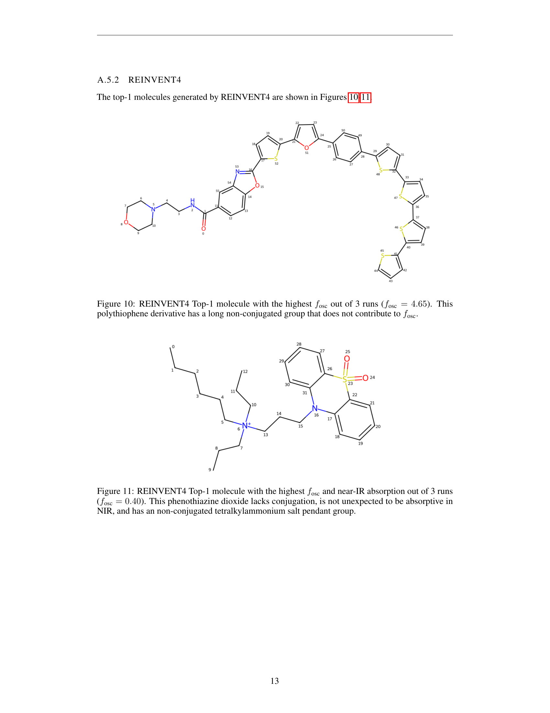

 


 2502.14842 
 Alexia Jolicoeur-Martineau et el. 
 
 🤗 2025-02-21 
 



↗ arXiv


↗ Hugging Face


↗ Papers with Code


### TL;DR



기존의 지도 학습 모델은 새로운 분자를 생성하는 데 어려움을 겪고, 강화 학습은 보상 조작 문제와 비합성 가능성 문제를 야기합니다. 이 논문에서는 이러한 문제를 해결하기 위해 **첨단 지도 학습 모델인 STGG+를 활성 학습 루프에 통합**하는 접근 방식을 제시합니다. 이 접근 방식은 **새로운 분자를 생성하고 평가하며 STGG+를 미세 조정하는 반복적인 프로세스**를 통해 지식을 지속적으로 확장합니다.

본 연구는 **유기 π-작용기 소재 설계**에 STGG+AL을 적용하여, **높은 발진자 세기를 가진 분자와 근적외선 영역에서 우수한 흡수율을 가진 분자**를 생성하는 두 가지 과제에 성공적으로 대처합니다.  **시간 의존 밀도범함수이론**을 사용하여 생성된 분자를 검증하고 합리화하였으며, 그 결과 **STGG+AL이 기존 강화 학습 방식보다 훨씬 효과적**임을 보여줍니다. 또한 **290만 개의 π-공액 분자 데이터셋과 발진자 세기 및 흡수 파장 근사 함수**를 공개하여 향후 연구를 위한 기반을 마련했습니다.



#### Key Takeaways


 활성 학습을 통합한 STGG+ 모델(STGG+AL)을 사용하여 π-공액 유기 분자를 효과적으로 설계하는 새로운 방법 제시 



 STGG+AL은 기존 강화 학습 방식보다 우수한 성능을 보이며, 높은 발진자 세기와 특정 파장 흡수율을 갖는 새로운 분자를 생성 



 290만 개의 π-공액 분자 데이터셋과 발진자 세기 및 흡수 파장 근사 함수를 공개하여 향후 연구에 기여 


#### Why does it matter?
이 논문은 **활성 학습을 통합한 첨단 지도 학습 모델 STGG+**를 사용하여 **π-공액 유기 분자의 설계** 문제를 해결하는 방법을 제시합니다.  **새로운 분자를 생성하고 평가하며 STGG+를 미세 조정**함으로써 지속적으로 지식을 확장하는 반복적 접근 방식을 사용하여 **기존의 강화 학습 방법보다 훨씬 효과적으로 고유한 특성을 지닌 분자를 생성**할 수 있음을 보여줍니다. 이 연구는 **신소재 개발 및 약물 발견 분야에 상당한 영향을 미칠** 수 있으며, 향후 연구를 위한 새로운 가능성을 제시합니다.

------
#### Visual Insights

> 🔼 이 그림은 활성 학습을 사용한 STGG+ 모델이 분포 외(OOD) 분자를 생성하는 능력을 보여줍니다.  특히, 발진기 강도(fosc)를 최대화하는 작업에 초점을 맞추고 있습니다. 그림은 STGG+ 모델이 기존의 데이터셋에 없는 높은 fosc 값을 가진 새로운 분자들을 생성할 수 있음을 시각적으로 보여주는 그래프나 분자 구조를 포함하고 있을 것입니다.  이를 통해 기존의 지도 학습 방식으로는 달성하기 어려운 새로운 특성을 가진 분자를 설계하는 데 있어 STGG+와 활성 학습의 효과를 강조합니다.
> 

> 
read the caption

> Task 1: Maximizing foscsubscript𝑓oscf_{\text{osc}}italic_f start_POSTSUBSCRIPT osc end_POSTSUBSCRIPT. STGG+ with active learning generates strong out-of-distribution (OOD) molecules.
> 


| Method | Max $f_{osc}$ mean (standard-deviation) | Oracle calls mean (standard-deviation) |
|---|---|---|
| Maximizing $f_{osc}$ |  |  |
| Dataset (no atoms limit) | 9.30 | 0 |
| STGG+ | 13.01 | 0 |
| STGG+ with active learning | **27.69** | 30.0K |
| REINVENT4 | 4.53 (0.17) | 30.0K |
| GraphGA | 14.56 (1.84) | 29.6K (4.0K) |
| Maximizing $f_{osc}$ in short-wave infrared range |  |  |
| Dataset (no atoms limit) | 0.84 | 0 |
| STGG+ | 0.85 | 0 |
| STGG+ with active learning | **2.44** | 30.0K |
| REINVENT4 | 0.36 (0.03) | 30.0K |
| GraphGA | 1.70 (0.28) | 30.9K (1.9K) |

> 🔼 이 표는 본 논문에서 제안된 활성 학습 기반의 STGG+ (STGG+AL) 방법과 기존의 분자 설계 기준 방법들을 비교 분석한 결과를 보여줍니다.  구체적으로 최대 발진자 세기(fosc)를 최대화하는 두 가지 과제(원자 개수 제한 없음, 원자 개수 제한 있음)에 대해 각 방법의 성능을 평가하고, 평균 최대 fosc 값, 표준 편차, 오라클 호출 횟수를 비교하여 STGG+AL의 우수성을 보여줍니다.  원자 개수 제한이 있는 경우는 근적외선(NIR) 흡수 영역에서의 fosc 최대화를 목표로 합니다.
> 

> 
read the caption

> Table 1: Comparing STGG+AL to current molecular design baselines
> 

### In-depth insights

#### π-functional Design
본 논문은 **π-공액 기능성 분자 설계**에 초점을 맞추고 있으며, 특히 **활성 학습(active learning)**을 활용하여 기존의 지도 학습 및 강화 학습 방법의 한계를 극복하고자 합니다.  기존 방법들은 데이터셋과 유사한 분자를 생성하는 데는 능숙하지만, **분포 외(out-of-distribution)** 특성을 가진 새로운 분자를 생성하는 데는 어려움을 겪습니다.  이 연구는 STGG+라는 최첨단 지도 학습 모델을 활성 학습 루프에 통합하여 이 문제를 해결합니다.  **반복적인 생성-평가-미세 조정** 과정을 통해 STGG+의 지식을 확장하고, **높은 진동자 세기(oscillator strength)**와 **근적외선(NIR) 흡수** 특성을 가진 새로운 분자를 효율적으로 설계하는 데 성공합니다.  **오픈소스 코드 및 데이터셋 공개**를 통해 재현성을 확보하고, 다른 연구자들의 추가 연구를 지원합니다.  **계산적 데이터셋의 구축 및 활용**, **최첨단 모델의 적용**, **활성 학습 전략** 등이 이 연구의 주요 특징입니다.  향후 연구는 더욱 복잡한 광전자 특성을 모델링하고, 실험적 검증을 통해 모델의 정확성을 높이는 데 집중될 것으로 예상됩니다.

#### STGG+AL Workflow
STGG+AL 워크플로는 **지도 학습 기반의 STGG+ 모델과 적극적 학습(Active Learning)**을 결합하여 새로운 분자를 생성하고 평가하며 모델을 지속적으로 개선하는 반복적인 과정입니다.  **초기 단계**에서는 기존의 π-공액 분자 데이터셋으로 STGG+ 모델을 사전 훈련시키고, **목표 특성 범위를 설정**합니다. 이후, **반복 과정**을 통해 STGG+ 모델이 목표 특성을 만족하는 새로운 분자를 생성하고, 이들의 특성을 계산하여 모델을 재훈련시킵니다.  **핵심은 생성된 분자에 대한 실험적 또는 계산적 평가를 통해 모델이 학습 데이터셋의 분포를 벗어난 영역까지 일반화**하도록 유도하는 것입니다. 이러한 **피드백 루프**를 통해 STGG+AL은 기존의 방법들보다 효율적으로 새로운 π-공액 분자를 발견하는 데 기여합니다.  **특히, 흡광도나 발광 효율과 같은 특정한 광전자적 특성을 최적화하는 데 효과적**이며, 단순히 기존 분자와 유사한 분자를 생성하는 것에 그치지 않고 **새로운 화학적 구조를 탐색**할 수 있는 장점을 갖고 있습니다.

#### Active Learning Loop
본 논문에서 제시된 활성 학습 루프는 **STGG+ 모델의 한계를 극복하기 위한 핵심 전략**입니다.  기존의 지도 학습 방식은 데이터 분포 밖의 특성을 가진 새로운 분자를 생성하는 데 어려움을 겪는 반면, 강화 학습은 보상 설계의 어려움으로 비현실적인 분자를 생성할 위험이 있습니다.  **활성 학습 루프는 이러한 문제점을 해결하기 위해 지도 학습과 비지도 학습의 장점을 결합**합니다.  STGG+ 모델은 우수한 초기 성능을 바탕으로 새로운 분자 후보를 생성하고, 이들의 특성을 평가하여 모델을 지속적으로 개선합니다.  이러한 반복적인 과정을 통해 **모델은 데이터 분포 밖의 영역까지 탐색**할 수 있으며, **화학적으로 타당하고 원하는 특성을 가진 새로운 분자를 효율적으로 생성**할 수 있습니다.  **핵심은 생성된 분자에 대한 실험적 또는 계산적 평가를 통해 모델 학습에 피드백을 제공**,  지속적인 성능 향상을 이끌어낸다는 점입니다.  **결과적으로, 활성 학습 루프는 기존 방법보다 효율적이고 효과적으로 혁신적인 분자를 발견**하는 데 기여합니다.

#### OOD Generalization
본 논문은 **분포 외(Out-of-Distribution, OOD) 일반화** 문제를 해결하기 위해 능동 학습(Active Learning) 기법을 활용한 새로운 분자 생성 모델을 제시합니다. 기존 지도 학습 모델들은 훈련 데이터와 유사한 분자를 잘 생성하지만, OOD 특성을 가진 새로운 분자를 생성하는 데 어려움을 겪습니다. 반면 강화 학습은 새로운 화학 공간을 탐색할 수 있지만, 보상 해킹(reward hacking) 문제로 인해 비합성 가능한 분자를 생성할 위험이 있습니다. 따라서 본 연구는 STGG+와 같은 최첨단 지도 학습 모델에 능동 학습을 통합하여 이러한 문제를 해결하고자 합니다.  **능동 학습을 통해 모델은 반복적으로 분자를 생성하고 평가하여 STGG+ 모델을 지속적으로 미세 조정하며 지식을 확장**합니다. 이를 통해 OOD 특성을 가진 고품질 분자를 생성하는 효율성을 크게 높일 수 있음을 보여줍니다. 특히, 높은 발진자 강도(oscillator strength)를 가진 분자와 근적외선(NIR) 영역에서 흡수율이 높은 분자를 설계하는 두 가지 어려운 과제에 적용하여 그 효과를 검증했습니다. **실험 결과는 제안된 방법이 기존 강화 학습 방법보다 훨씬 효과적으로 새로운 분자를 생성**함을 보여주고 있습니다.  이는 OOD 일반화 능력을 향상시키는 능동 학습의 중요성을 강조하는 결과입니다.

#### Future Directions
본 논문에서 제시된 STGG+AL 방법론은 **π-공액 유기 분자 설계**에 있어 주목할 만한 성과를 보여주지만, 여전히 개선의 여지가 많습니다. **향후 연구 방향**으로는 첫째, **더욱 다양하고 정교한 보상 함수(reward function)** 개발을 통해 RL 방법론의 한계를 극복하고, **합성 가능성 및 안정성을 고려한 분자 생성**을 위한 새로운 접근법을 모색해야 합니다.  둘째, **활성 학습 루프의 효율성을 높이기 위한 전략**을 개발하여, 적은 양의 실험 데이터로도 우수한 성능을 얻을 수 있도록 해야 합니다.  셋째, **다양한 종류의 π-공액 분자 및 광전자 특성**에 대한 적용성을 확장하여, **범용성을 높이는 연구**가 필요합니다.  마지막으로, **실험적 검증을 통해** 모델의 예측 정확도와 실제 분자의 특성 간의 상관관계를 명확히 밝히고, **산업적 활용 가능성을 제고**하는 후속 연구가 중요합니다.  **특히, TD-DFT 계산을 통해 예측된 분자 특성이 실험값과 일치하는지 확인**하여 모델의 신뢰성을 높이는 작업이 필수적입니다.

### More visual insights

More on figures

> 🔼 이 그림은 단파 적외선 영역에서 fosc(oscillator strength)를 극대화하는 작업을 보여줍니다. 활성 학습을 통한 STGG+ 모델은 기존의 방법으로는 생성하기 어려운, 분포 외(OOD, out-of-distribution) 특성을 가진 강력한 분자들을 생성해냅니다. 그림은 생성된 분자들의 fosc와 파장 분포를 보여주는 그래프와, 데이터셋 내 최고의 분자와 생성된 최고의 분자 구조를 비교하여 보여줍니다.  이를 통해 STGG+ 활성 학습 방법의 효과를 시각적으로 보여줍니다.
> 

> 
read the caption

> Task 2: Maximizing foscsubscript𝑓oscf_{\text{osc}}italic_f start_POSTSUBSCRIPT osc end_POSTSUBSCRIPT in the short-wave infrared range. STGG+ with active learning generates strong OOD molecules.
> 

> 🔼 그림 3은 가장 높은 발진자 세기(fosc)를 가진 분자에 대한 사례 연구를 보여줍니다. 이 그림은 STGG+ 활성 학습을 사용하여 생성된 분자와 기존 데이터셋에 있는 분자를 비교하여, STGG+ 활성 학습 방법이 높은 fosc를 가진 새로운 분자를 생성하는 데 매우 효과적임을 보여줍니다. 특히, 생성된 분자의 크기(70개 원자)는 기존 데이터셋에 있는 분자(89개 원자)보다 작지만, fosc 값은 훨씬 높습니다(27.70 대 9.30). 이는 STGG+ 활성 학습 방법이 분자의 크기를 줄이면서도 성능을 향상시킬 수 있음을 시사합니다.
> 

> 
read the caption

> Figure 3: Case study of the top-1 molecule with the highest foscsubscript𝑓oscf_{\text{osc}}italic_f start_POSTSUBSCRIPT osc end_POSTSUBSCRIPT.
> 

> 🔼 그림 4는 최대 70개의 무거운 원자와 최대 6개의 고리 크기를 갖는 제약 조건 하에서 활성 학습을 사용하여 최대 발진기 강도(fosc)를 구현하는 과정을 보여줍니다. 단일 실행에서 STGG+(상위 1개, 상위 10개, 상위 100개 분자)와 3회 실행에 대한 평균 및 95% 신뢰 구간을 포함한 GraphGA(상위 1개 분자)의 결과를 비교하여 보여줍니다. 이 그림은 시간이 지남에 따라 STGG+가 강성 및 평면 분자를 샘플링하여 높은 궤도 중첩 및 높은 fosc를 달성하는 방법을 보여줍니다.
> 

> 
read the caption

> Figure 4: Maximizing foscsubscript𝑓oscf_{\text{osc}}italic_f start_POSTSUBSCRIPT osc end_POSTSUBSCRIPT using active learning with constraints: max 70 heavy atoms, max ring-size of 6. STGG+ (top-1, top-10, top-100; from a single run) vs GraphGA (top-1; average and 95% confidence interval over 3 runs).
> 

> 🔼 그림 5는 근적외선 흡수 영역에서 가장 높은 fosc 값을 가지는 최고의 분자에 대한 연구 사례를 보여줍니다. 이 그림은 STGG+ 활성 학습을 통해 생성된 분자의 구조, 흡수 파장, 그리고 fosc 값을 보여주는 시각 자료입니다.  특히, 이 분자는  70개 이하의 무거운 원자와 최대 6개의 고리 크기를 갖는 제약 조건 하에서 생성되었으며,  근적외선 영역에서 높은 fosc 값을 달성한 것을 강조합니다.  이를 통해 STGG+ 활성 학습 방법이 근적외선 흡수 특성을 갖는 새로운 분자를 효과적으로 생성할 수 있음을 시사합니다.
> 

> 
read the caption

> Figure 5: Case study of the top-1 molecule with NIR absorption but the highest foscsubscript𝑓oscf_{\text{osc}}italic_f start_POSTSUBSCRIPT osc end_POSTSUBSCRIPT.
> 

> 🔼 그림 6은 활성 학습을 사용하여 근적외선 흡수(λabs≥1000nm), 최대 70개의 무거운 원자, 최대 6개의 고리 크기 제약 조건 하에서 f_osc를 최대화하는 과정을 보여줍니다. STGG+ (단일 실행의 상위 1개, 상위 10개, 상위 100개 분자)와 GraphGA (상위 1개 분자; 3회 실행에 대한 평균 및 95% 신뢰 구간)의 결과를 비교하여 STGG+가 시간이 지남에 따라 f_osc를 지속적으로 향상시키는 반면 GraphGA는 지역적 최적점에 도달한 후 더 이상 개선되지 않는 것을 보여줍니다. 이 그림은 활성 학습을 통해 분자의 다양성을 유지하면서 f_osc를 최대화하는 STGG+의 효율성을 강조합니다.
> 

> 
read the caption

> Figure 6: Maximizing foscsubscript𝑓oscf_{\text{osc}}italic_f start_POSTSUBSCRIPT osc end_POSTSUBSCRIPT using active learning with constraints: near-IR absorption (λa⁢b⁢s≥1000subscript𝜆𝑎𝑏𝑠1000\lambda_{abs}\geq 1000italic_λ start_POSTSUBSCRIPT italic_a italic_b italic_s end_POSTSUBSCRIPT ≥ 1000 nm), max 70 heavy atoms, max ring-size of 6. STGG+ (top-1, top-10, top-100; from a single run) vs GraphGA (top-1; average and 95% confidence interval over 3 runs).
> 

> 🔼 그림 7은 논문에서 제시된 STGG+ 모델의 아키텍처를 보여줍니다. 분자는 토큰화되고 임베딩되며, 시작 고리의 수와 연속 및 범주형 속성의 임베딩이 추가됩니다. 그런 다음 출력은 트랜스포머에 전달됩니다. 트랜스포머의 출력은 1) 예측된 속성과 2) 토큰 예측(잘못된 토큰을 방지하기 위해 마스킹됨)으로 분할됩니다. STGG [Ahn et al., 2021a]와 비교하여 새로운 구성 요소는 굵게 표시되어 있습니다. 이 그림은 Jolicoeur-Martineau et al. [2024]에서 가져온 것입니다.  쉽게 말해, 이 그림은 분자 구조를 생성하는 STGG+ 모델의 내부 동작 방식을 자세하게 보여주는 도식입니다.  토큰화, 임베딩, 트랜스포머 사용 등의 과정을 거쳐 최종적으로 분자 구조를 예측합니다.
> 

> 
read the caption

> Figure 7: STGG+ architecture. The molecule is tokenized and embedded. The number of started rings and embeddings of continuous and categorical properties are added, and the output is passed to the Transformer. The Transformer output is then split to produce 1) the predicted property and 2) the token predictions (masked to prevent invalid tokens). Novel components compared to STGG [Ahn et al., 2021a] are in bold. The figure was taken from Jolicoeur-Martineau et al. [2024].
> 

> 🔼 그림 8은 STGG+ 알고리즘을 단일 실행하여 생성된 분자 중 가장 높은 진동자 강도(oscillator strength, *f*osc)를 가진 최고 분자(Top-1 molecule)를 보여줍니다. 이 분자의 진동자 강도는 27.69로 계산되었습니다. 이 그림은 활성 학습(active learning) 기법을 사용하여 분자를 생성하는 과정에서 얻어진 결과를 시각적으로 보여주는 예시이며,  STGG+ 알고리즘이 높은 진동자 강도를 갖는 새로운 분자를 생성하는 데 효과적임을 보여주는 증거입니다.
> 

> 
read the caption

> Figure 8: STGG+ Top-1 molecule with the highest foscsubscript𝑓oscf_{\text{osc}}italic_f start_POSTSUBSCRIPT osc end_POSTSUBSCRIPT out of a single run (fosc=27.69subscript𝑓osc27.69f_{\text{osc}}=27.69italic_f start_POSTSUBSCRIPT osc end_POSTSUBSCRIPT = 27.69).
> 

> 🔼 그림 9는 STGG+ 알고리즘을 단일 실행하여 얻은 분자 중 가장 높은 진동자 강도(fosc)와 근적외선 흡수를 가진 최고의 분자를 보여줍니다.  이 분자는 2.44의 진동자 강도(fosc) 값을 가지며, 근적외선 영역에서 효과적인 흡수 특성을 나타냅니다.  이 그림은 STGG+ 알고리즘이 원하는 광학적 특성을 가진 새로운 분자를 생성하는 데 효과적임을 시사합니다.
> 

> 
read the caption

> Figure 9: STGG+ Top-1 molecule with the highest foscsubscript𝑓oscf_{\text{osc}}italic_f start_POSTSUBSCRIPT osc end_POSTSUBSCRIPT and near-IR absorption out of a single run (fosc=2.44subscript𝑓osc2.44f_{\text{osc}}=2.44italic_f start_POSTSUBSCRIPT osc end_POSTSUBSCRIPT = 2.44).
> 

> 🔼 그림 10은 REINVENT4 알고리즘을 3번 실행하여 얻은 결과 중 가장 높은 발진자 강도(fosc)를 가진 분자(fosc = 4.65)를 보여줍니다. 이 분자는 폴리티오펜 유도체이며, fosc에 기여하지 않는 긴 비공액 그룹을 가지고 있습니다.  즉, 분자의 일부 구조는 전자의 비편재화에 참여하지 않아 발진자 강도에 영향을 미치지 않는다는 것을 의미합니다. 이 그림은 REINVENT4 알고리즘이 생성한 분자의 구조적 특징과 발진자 강도와의 관계를 이해하는 데 도움을 줍니다.
> 

> 
read the caption

> Figure 10: REINVENT4 Top-1 molecule with the highest foscsubscript𝑓oscf_{\text{osc}}italic_f start_POSTSUBSCRIPT osc end_POSTSUBSCRIPT out of 3 runs (fosc=4.65subscript𝑓osc4.65f_{\text{osc}}=4.65italic_f start_POSTSUBSCRIPT osc end_POSTSUBSCRIPT = 4.65). This polythiophene derivative has a long non-conjugated group that does not contribute to foscsubscript𝑓oscf_{\text{osc}}italic_f start_POSTSUBSCRIPT osc end_POSTSUBSCRIPT.
> 

> 🔼 그림 11은 REINVENT4 알고리즘을 사용하여 3번의 실행 중 가장 높은 fosc(0.40)와 근적외선 흡수율을 가진 최고의 분자를 보여줍니다. 이 페노티아진 디옥사이드 분자는 공액 구조가 부족하고, 근적외선 영역에서 흡수가 예상되며, 비공액 테트라알킬암모늄 염 펜던트기를 가지고 있습니다. 즉, 이 분자는 효과적인 광 흡수체가 되기에는 구조적 제약이 있습니다.
> 

> 
read the caption

> Figure 11: REINVENT4 Top-1 molecule with the highest foscsubscript𝑓oscf_{\text{osc}}italic_f start_POSTSUBSCRIPT osc end_POSTSUBSCRIPT and near-IR absorption out of 3 runs (fosc=0.40subscript𝑓osc0.40f_{\text{osc}}=0.40italic_f start_POSTSUBSCRIPT osc end_POSTSUBSCRIPT = 0.40). This phenothiazine dioxide lacks conjugation, is not unexpected to be absorptive in NIR, and has an non-conjugated tetralkylammonium salt pendant group.
> 

### Full paper



