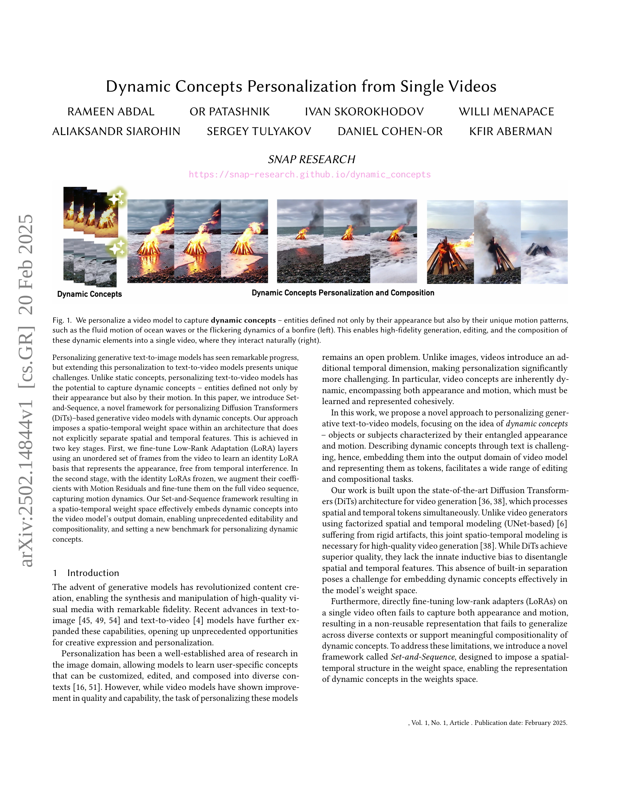
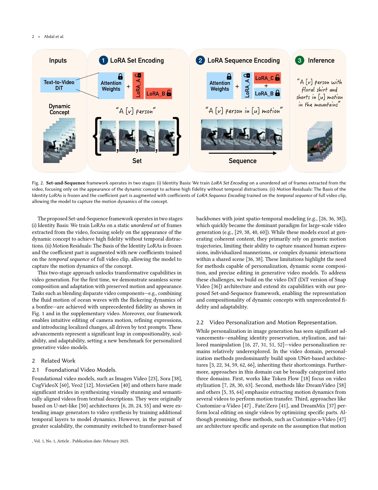
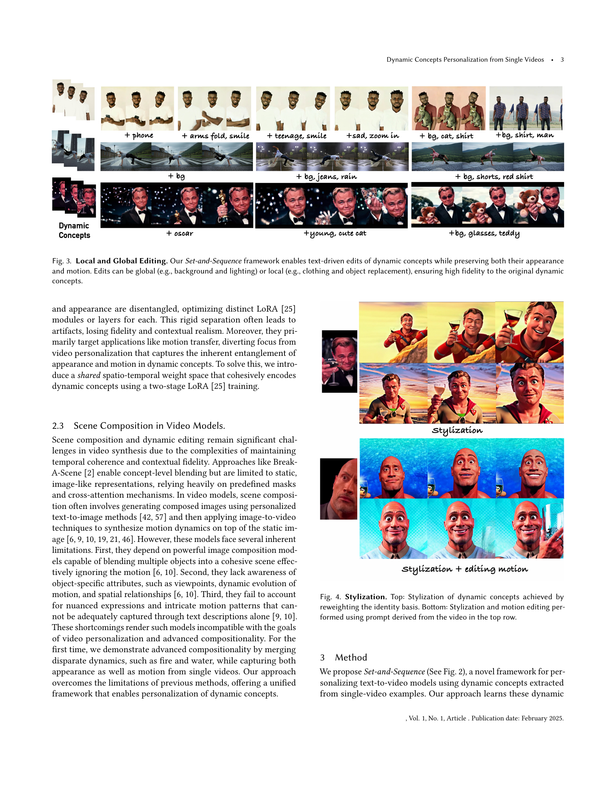
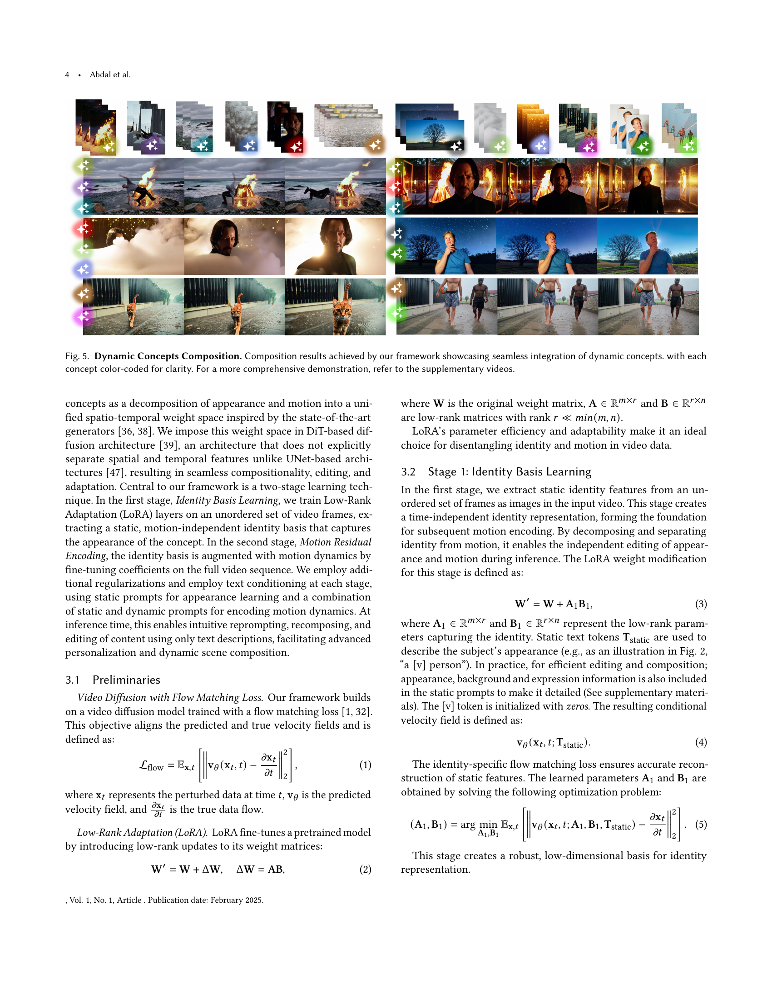
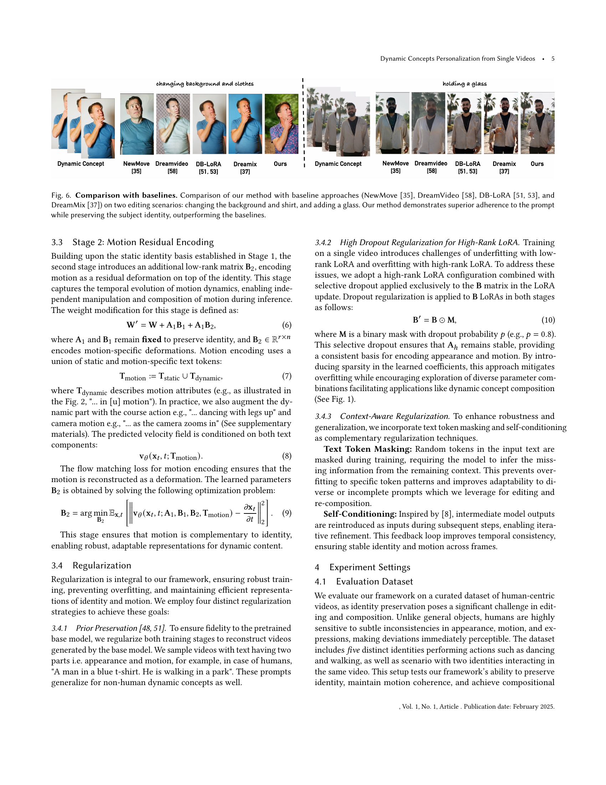
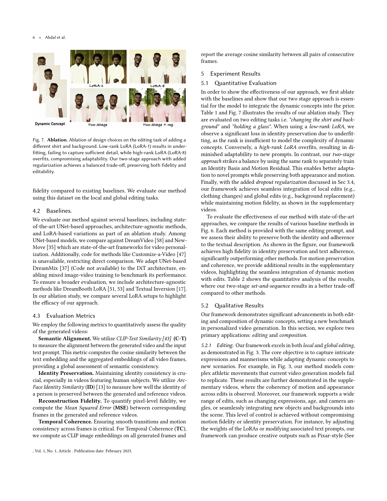
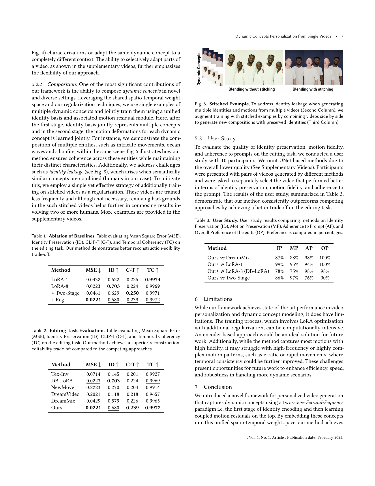
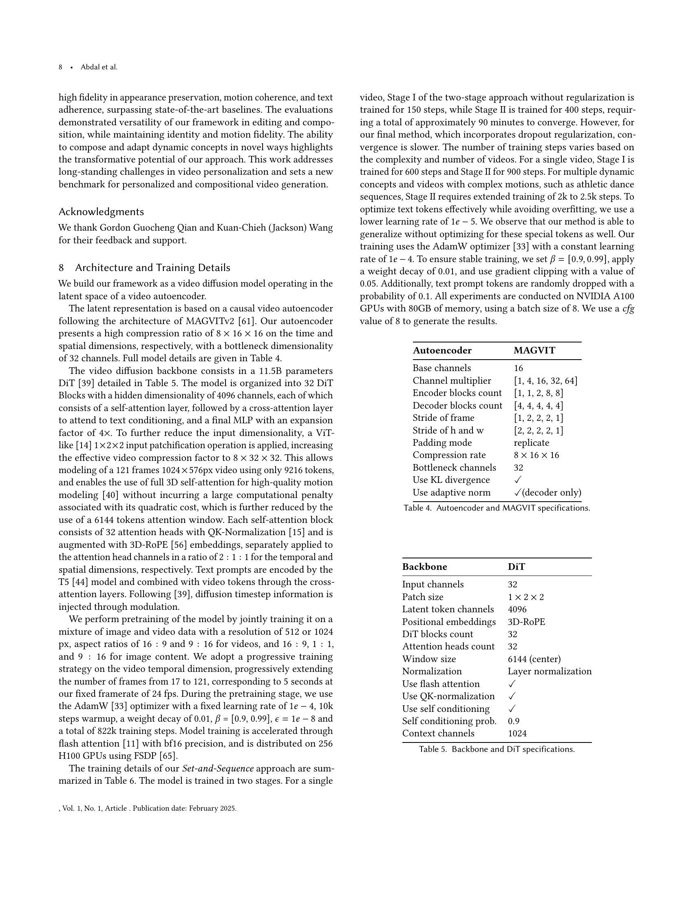
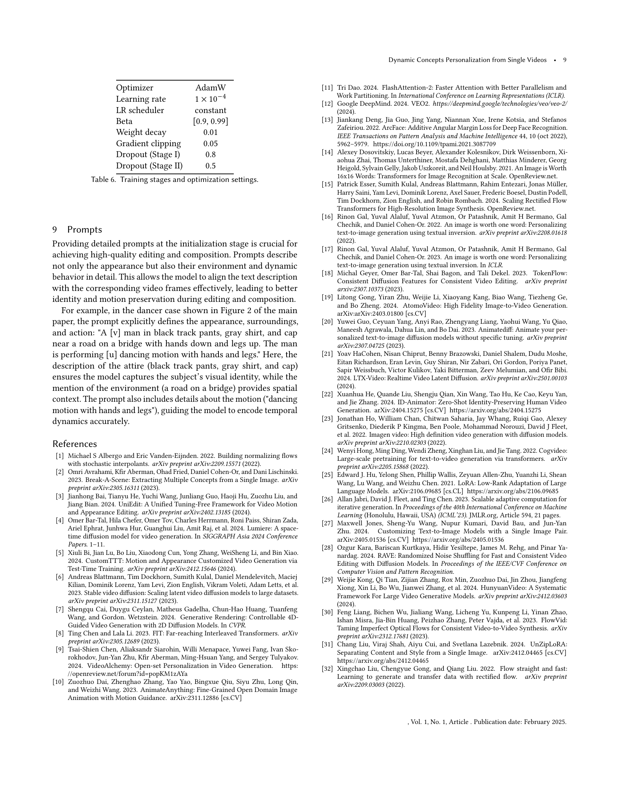
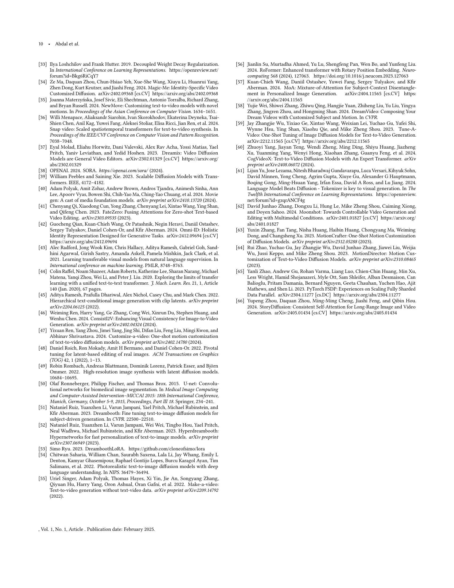

 


 2502.14844 
 Rameen Abdal et el. 
 
 🤗 2025-02-21 
 



↗ arXiv


↗ Hugging Face


↗ Papers with Code


### TL;DR



기존의 텍스트-비디오 생성 모델들은 **동적인 개념** (예: 파도의 움직임, 불꽃의 깜빡임)을 정확하게 포착하고 개인화하는 데 어려움을 겪었습니다. 특히, **단일 비디오**만으로 학습할 때는 외형과 움직임을 분리하여 표현하는 것이 어려워, **자연스러운 상호 작용이나 편집**이 어려웠습니다. 이는 비디오 생성 모델의 **한계점**이었습니다.

본 연구는 이러한 문제를 해결하기 위해 **Set-and-Sequence**라는 새로운 프레임워크를 제안합니다. 이는 **두 단계**로 나뉘는데, 첫 번째 단계에서는 비디오의 정지된 프레임을 사용하여 외형을 학습하고, 두 번째 단계에서는 전체 비디오 시퀀스를 사용하여 움직임을 학습합니다. **이를 통해 단일 비디오로부터 동적 개념을 효과적으로 학습**하고, 고품질 비디오 생성, 자유로운 편집 및 다양한 요소들의 자연스러운 합성을 가능하게 했습니다.  **기존 방법 대비 우수한 성능**을 보였고, 향후 연구를 위한 새로운 가능성을 제시했습니다.



#### Key Takeaways


 단일 비디오에서 동적 개념을 학습하는 Set-and-Sequence 프레임워크 제시 



 고품질 비디오 생성, 편집 및 합성 성능 향상 



 기존 방법론 대비 우수한 성능 및 편집 가능성 입증 


#### Why does it matter?
본 논문은 **동적 개념의 개인화된 비디오 생성**이라는 중요한 문제에 대한 새로운 접근 방식을 제시하여, 연구자들에게 **비디오 생성 및 편집 분야의 혁신적인 방법론**을 제공합니다. 특히, 단일 비디오로부터 동적 개념을 효과적으로 학습하고, 자연스러운 상호 작용을 가능하게 하는 **새로운 프레임워크**를 제시하여, 앞으로의 연구 방향을 제시하고 있습니다.  **비디오 개인화와 동적 편집**에 대한 관심이 높아지고 있는 현재 연구 동향에 따라, 본 논문은 시각적 미디어 생성 및 조작 분야에 큰 영향을 미칠 것으로 예상됩니다.

------
#### Visual Insights

> 🔼 그림 1은 단순히 외형뿐 아니라 고유한 움직임 패턴(예: 파도의 부드러운 움직임이나 모닥불의 흔들리는 역동성)까지 포착하도록 비디오 모델을 개인화하는 과정을 보여줍니다.  왼쪽은 개별 동적 개념을 보여주고, 오른쪽은 이러한 동적 요소들을 자연스럽게 상호 작용하는 단일 비디오로 생성, 편집 및 합성할 수 있음을 보여줍니다.  이를 통해 고품질의 비디오 생성, 편집 및 다양한 동적 요소들의 자연스러운 합성이 가능해집니다.
> 

> 
read the caption

> Figure 1. We personalize a video model to capture dynamic concepts – entities defined not only by their appearance but also by their unique motion patterns, such as the fluid motion of ocean waves or the flickering dynamics of a bonfire (left). This enables high-fidelity generation, editing, and the composition of these dynamic elements into a single video, where they interact naturally (right).
> 


| Method | MSE ↓ | ID ↑ | C-T ↑ | TC ↑ |
|---|---|---|---|---|
| LoRA-1 | 0.0432 | 0.622 | 0.226 | **0.9974** |
| LoRA-8 | **0.0223** | **0.703** | 0.224 | 0.9969 |
| + Two-Stage | 0.0461 | 0.629 | **0.250** | 0.9971 |
| + Reg | **0.0221** | **0.680** | **0.239** | **0.9972** |

> 🔼 표 1은 기준 모델들에 대한 에이블레이션 결과를 보여줍니다. 편집 작업에 대한 평균 제곱 오차(MSE), 정체성 보존(ID), CLIP-T(C-T), 시간적 일관성(TC)을 평가하여 제시합니다. 본 논문의 방법론은 재구성과 편집성 간의 균형을 더 잘 맞추는 것을 보여줍니다. MSE는 재구성 품질을, ID는 원본 비디오의 정체성이 얼마나 잘 유지되었는지를, C-T는 생성된 비디오와 입력 텍스트 프롬프트 간의 의미적 일치도를, TC는 비디오 프레임 간의 시간적 일관성을 측정합니다. 이 표는 제안된 방법이 기존 방법들보다 재구성과 편집성 측면에서 더 나은 성능을 보임을 보여줍니다.
> 

> 
read the caption

> Table 1. Ablation of Baselines. Table evaluating Mean Square Error (MSE), Identity Preservation (ID), CLIP-T (C-T), and Temporal Coherency (TC) on the editing task. Our method demonstrates better reconstruction-edibility trade-off.
> 

### In-depth insights

#### Dynamic Concept Encoding
본 논문에서 제안하는 "다이내믹 개념 인코딩"은 **비디오 모델에 동적인 개념을 효과적으로 통합하는 핵심 전략**입니다.  단순히 외형적인 특징만이 아닌, **움직임 패턴까지 고려하여 동적인 개념을 포착**하는 것이 중요하며, 이를 위해 공간적, 시간적 요소를 모두 고려하는 **새로운 가중치 공간을 설계**합니다.  **두 단계 접근 방식**을 통해, 먼저 정적인 프레임들을 사용하여 외형 정보를 학습하고,  이후 전체 비디오 시퀀스를 사용하여 움직임 역학을 추가적으로 학습합니다.  이는 외형과 움직임의 혼합을 가능하게 하며, **비디오 편집 및 구성에 있어 높은 유연성**을 제공합니다.  결과적으로, **자연스러운 상호 작용과 고품질의 비디오 생성, 편집 및 구성**이 가능해집니다.  **LoRA(Low-Rank Adaptation)를 활용**하여 모델의 효율적인 개선을 가능하게 하는 것도 중요한 특징입니다.

#### Two-Stage LoRA Training
이 논문에서 제안하는 **두 단계 LoRA 훈련**은 동적 개념을 생성 비디오 모델에 효과적으로 통합하는 핵심 전략입니다. **첫 번째 단계는 정체성 기반 학습**으로, 비디오의 무작위 프레임 집합에 대해 LoRA 계층을 미세 조정하여 시간적 간섭 없이 외형을 나타내는 정체성 LoRA 기반을 학습합니다. **두 번째 단계는 모션 잔차 인코딩**으로, 정체성 LoRA의 기반을 고정하고 전체 비디오 시퀀스에서 미세 조정하여 모션 역학을 포착합니다. 이러한 두 단계 접근 방식을 통해 **공간-시간 가중치 공간**이 효과적으로 생성되어 동적 개념이 비디오 모델의 출력 영역에 통합됩니다. 이는 **전례 없는 편집성과 구성성**을 가능하게 하여 동적 개념을 개인화하는 새로운 기준을 제시합니다.  **정체성과 모션의 분리**는 고품질의 비디오 생성과 편집에 필수적이며, 이를 통해 **자연스러운 장면 구성 및 적응**을 실현합니다. 이 방법은 다양한 동적 개념을 통합하여 **매우 사실적이고 세련된** 비디오 생성 및 편집을 가능하게 합니다.

#### Compositional Editing
본 논문에서 제시된 "합성 편집(Compositional Editing)" 개념은 **단일 비디오로부터 추출된 동적 개념을 활용하여 고품질 비디오를 생성, 편집, 합성하는 능력**을 의미합니다.  기존의 정적 개념에 기반한 편집 방식과 달리, **외형뿐 아니라 고유한 움직임 패턴까지 포착하여 자연스러운 상호 작용을 가능하게** 합니다.  예를 들어, 바닷물의 유동적인 움직임과 모닥불의 깜빡이는 역동성을 결합하는 등 이전에는 불가능했던 수준의 고충실도 합성이 가능해졌습니다. 이러한 **합성 편집 기능은 다양한 텍스트 프롬프트를 통해 직관적인 편집과 구성을 가능하게 하며**,  카메라 움직임 조정, 표정 수정, 국소적 변경 등의 정교한 편집 작업도 지원합니다.  **공간-시간적 가중치 공간을 효과적으로 활용하여 동적 개념을 모델에 통합**,  전례 없는 수준의 편집성 및 구성성을 제공하는 것이 핵심입니다. 따라서,  **동적 개념의 표현 및 조작에 있어 새로운 기준**을 제시한다고 볼 수 있습니다.

#### Motion Representation
본 논문에서 다루는 동작 표현은 **비디오 생성 모델에 동적인 개념을 통합하는 핵심 과제**입니다.  단순히 이미지 시퀀스를 생성하는 것을 넘어, **물리적 현실성과 자연스러운 움직임**을 표현해야 합니다. 이를 위해, 기존의 단순한 움직임 벡터 표현 방식 대신, **공간-시간적 가중치 공간**을 활용하여 동작을 모델링하는 새로운 방법을 제시합니다. 이는 단순히 공간적 특징과 시간적 특징을 분리하여 처리하는 것이 아니라, **두 특징의 상호작용**을 고려함으로써 보다 자연스럽고 정확한 동작 표현을 가능하게 합니다. **Set-and-Sequence 프레임워크**는 이러한 공간-시간적 가중치 공간을 효과적으로 구현하는 핵심이며, **정체성(Identity)와 움직임(Motion)을 분리하여 학습**함으로써, 편집과 구성의 용이성을 높입니다.  이는 개별 요소의 움직임을 자유롭게 조정하고, 다양한 동작들을 자연스럽게 결합하는 창의적인 비디오 제작을 가능하게 하는 핵심적인 요소입니다.

#### Future Research
미래 연구 방향으로는 **다양한 동적 개념의 표현력 향상**을 위한 연구가 중요합니다.  현재 모델은 특정 동작이나 외형에 대한 학습 데이터가 충분할 때 높은 성능을 보이지만, 다양한 상황과 복잡한 움직임을 포괄하는 일반화 능력 향상이 필요합니다.  **데이터 효율성 개선**을 위한 연구도 중요합니다.  단일 비디오로부터 동적 개념을 학습하는 것은 데이터 부족 문제를 야기할 수 있으며, 이를 해결하기 위한 효율적인 학습 방법 및 데이터 증강 기법 연구가 필요합니다.  **다른 모달리티와의 통합**도 고려해야 합니다.  음성이나 텍스트 정보를 추가적으로 활용하여 동적 개념을 더욱 풍부하고 정확하게 표현하는 연구가 진행될 수 있습니다.  또한, **실시간 처리 성능 개선**을 위한 연구도 중요한데, 현재 모델은 처리 속도가 느리다는 단점이 있으며, 실시간 응용을 위해서는 처리 속도를 개선하는 연구가 필수적입니다.  마지막으로, **윤리적 문제 고려** 또한 중요합니다.  개인 정보 보호 및 저작권 문제 등 윤리적 문제에 대한 고려 없이 모델을 개발 및 활용하는 것은 위험할 수 있습니다.  따라서, 이러한 윤리적 문제를 해결하기 위한 연구가 병행되어야 합니다.

### More visual insights

More on figures

> 🔼 그림 2는 Set-and-Sequence 프레임워크의 두 단계를 보여줍니다. 먼저, Identity Basis 단계에서는 비디오에서 추출한 무작위 프레임 집합을 사용하여 LoRA Set Encoding을 학습합니다. 이 단계에서는 시간적 요소를 배제하고 동적 개념의 외형에만 집중하여 고품질의 결과를 얻습니다. 다음으로 Motion Residuals 단계에서는 Identity LoRA의 기저를 고정하고, 전체 비디오 시퀀스를 사용하여 학습한 LoRA Sequence Encoding의 계수를 추가하여 모델이 동적 개념의 움직임을 포착할 수 있도록 합니다.  결과적으로, 이 두 단계를 통해 외형과 움직임을 효과적으로 분리하여 학습하고, 고품질의 비디오 생성, 편집, 합성이 가능해집니다.
> 

> 
read the caption

> Figure 2. Set-and-Sequence framework operates in two stages: (i) Identity Basis: We train LoRA Set Encoding on a unordered set of frames extracted from the video, focusing only on the appearance of the dynamic concept to achieve high fidelity without temporal distractions. (ii) Motion Residuals: The Basis of the Identity LoRAs is frozen and the coefficient part is augmented with coefficients of LoRA Sequence Encoding trained on the temporal sequence of full video clip, allowing the model to capture the motion dynamics of the concept.
> 

> 🔼 그림 3은 Set-and-Sequence 프레임워크의 텍스트 기반 편집 기능을 보여줍니다. 이 프레임워크는 동적인 개념(예: 불꽃의 움직임이나 파도의 흐름)의 외관과 움직임을 모두 보존하면서, 배경과 조명 변경과 같은 전역적 편집이나 의복 및 사물 교체 같은 국소적 편집을 가능하게 합니다.  원본 동적 개념에 대한 높은 충실도를 유지하면서 다양한 편집이 가능함을 보여주는 여러 가지 예시가 포함되어 있습니다.
> 

> 
read the caption

> Figure 3. Local and Global Editing. Our Set-and-Sequence framework enables text-driven edits of dynamic concepts while preserving both their appearance and motion. Edits can be global (e.g., background and lighting) or local (e.g., clothing and object replacement), ensuring high fidelity to the original dynamic concepts.
> 

> 🔼 그림 4는 동적 개념의 스타일 변환 과정을 보여줍니다. 상단은 아이덴티티 기반의 가중치 재조정을 통해 동적 개념의 스타일을 변환한 결과를 보여줍니다. 하단은 상단 영상에서 파생된 프롬프트를 사용하여 스타일 변환과 동작 편집을 동시에 수행한 결과를 보여줍니다. 즉, 상단에서는 외형적인 스타일만 변경하고 하단에서는 외형과 움직임 모두를 제어하여 보다 세밀한 편집이 가능함을 보여줍니다.
> 

> 
read the caption

> Figure 4. Stylization. Top: Stylization of dynamic concepts achieved by reweighting the identity basis. Bottom: Stylization and motion editing performed using prompt derived from the video in the top row.
> 

> 🔼 본 그림은 논문에서 제시된 프레임워크를 사용하여 동적인 개념들을 원활하게 결합한 결과를 보여줍니다. 각 개념은 명확성을 위해 색상으로 구분되어 있으며, 여러 동적 개념들의 자연스러운 상호 작용을 보여줍니다. 보다 자세한 내용은 보충 비디오를 참조하세요.
> 

> 
read the caption

> Figure 5. Dynamic Concepts Composition. Composition results achieved by our framework showcasing seamless integration of dynamic concepts. with each concept color-coded for clarity. For a more comprehensive demonstration, refer to the supplementary videos.
> 

> 🔼 그림 6은 제안된 방법의 성능을 기존 방법들과 비교 분석한 결과를 보여줍니다.  두 가지 편집 시나리오(배경과 셔츠 변경, 컵 추가)에서 제안된 방법과 NewMove, DreamVideo, DB-LoRA, DreamMix 네 가지 기존 방법의 결과를 비교합니다.  비교 결과는 프롬프트 충실도와 주체 식별 유지를 중심으로 이루어졌으며, 제안된 방법이 기존 방법들보다 프롬프트를 더 잘 따르면서 주체의 정체성을 더 잘 유지하는 것을 보여줍니다.
> 

> 
read the caption

> Figure 6. Comparison with baselines. Comparison of our method with baseline approaches (NewMove (Materzyńska et al., 2024), DreamVideo (Wei et al., 2024), DB-LoRA (Ryu, 2023; Ruiz et al., 2023a), and DreamMix (Molad et al., 2023)) on two editing scenarios: changing the background and shirt, and adding a glass. Our method demonstrates superior adherence to the prompt while preserving the subject identity, outperforming the baselines.
> 

> 🔼 그림 7은 저자들이 제안한 방법의 핵심 구성 요소인 두 단계 학습과 정규화의 효과를 보여주는 실험 결과입니다. 배경과 셔츠를 바꾸는 편집 작업을 예시로, 저랭크 LoRA(LoRA-1)를 사용하면 세부 정보를 충분히 포착하지 못해 과소적합이 발생하고, 고랭크 LoRA(LoRA-8)를 사용하면 적응력이 저하되는 과적합이 발생합니다. 반면에 저자들이 제안한 두 단계 접근 방식에 정규화를 추가하면 충실도와 편집 가능성을 모두 유지하면서 균형을 맞출 수 있습니다.
> 

> 
read the caption

> Figure 7. Ablation. Ablation of design choices on the editing task of adding a different shirt and background. Low-rank LoRA (LoRA-1) results in underfitting, failing to capture sufficient detail, while high-rank LoRA (LoRA-8) overfits, compromising adaptability. Our two-stage approach with added regularization achieves a balanced trade-off, preserving both fidelity and editability.
> 

More on tables


| Method | MSE ↓ | ID ↑ | C-T ↑ | TC ↑ |
|---|---|---|---|---|
| Tex-Inv | 0.0714 | 0.145 | 0.201 | 0.9927 |
| DB-LoRA | 0.0223 | 0.703 | 0.224 | 0.9969 |
| NewMove | 0.2223 | 0.270 | 0.204 | 0.9914 |
| DreamVideo | 0.2021 | 0.118 | 0.218 | 0.9657 |
| DreamMix | 0.0429 | 0.579 | 0.226 | 0.9965 |
| Ours | 0.0221 | 0.680 | 0.239 | 0.9972 |
> 🔼 표 2는 비디오 편집 작업에 대한 평가 지표를 보여줍니다. 평가 지표는 평균 제곱 오차(MSE), 신원 보존(ID), CLIP-T(C-T), 시간적 일관성(TC)을 포함합니다. 이 표는 제안된 방법이 경쟁 기법에 비해 재구성과 편집성 간의 균형을 더 잘 맞춘다는 것을 보여줍니다. 즉,  MSE는 낮게 유지하면서 동시에 ID, C-T, TC 점수는 높게 유지하여 원본 비디오의 특징을 잘 유지하면서도 자유롭게 편집할 수 있음을 의미합니다.
> 

> 
read the caption

> Table 2. Editing Task Evaluation. Table evaluating Mean Square Error (MSE), Identity Preservation (ID), CLIP-T (C-T), and Temporal Coherency (TC) on the editing task. Our method achieves a superior reconstruction-editability trade-off compared to the competing approaches.
> 


| Method | IP | MP | AP | OP |
|---|---|---|---|---|
| Ours *vs* DreamMix | 87% | 88% | 98% | 100% |
| Ours *vs* LoRA-1 | 99% | 95% | 94% | 100% |
| Ours *vs* LoRA-8 (DB-LoRA) | 78% | 75% | 98% | 98% |
| Ours *vs* Two-Stage | 86% | 97% | 76% | 90% |
> 🔼 이 표는 사용자 연구 결과를 보여줍니다.  사용자들은 다양한 방법으로 생성된 비디오 쌍을 보고, 각 방법의 신원 보존(ID), 모션 보존(MP), 프롬프트 준수(AP) 및 편집의 전반적인 선호도(OP)를 평가했습니다.  선호도는 백분율로 계산되었습니다.  즉, 사용자들이 각 방법이 얼마나 잘 작동하는지에 대해 주관적인 의견을 제시한 결과를 정량적으로 보여주는 표입니다.
> 

> 
read the caption

> Table 3. User Study. User study results comparing methods on Identity Preservation (ID), Motion Preservation (MP), Adherence to Prompt (AP), and Overall Preference of the edits (OP). Preference is computed in percentages.
> 


| Autoencoder | MAGVIT |
|---|---| 
| Base channels | 16 |
| Channel multiplier | [1, 4, 16, 32, 64] |
| Encoder blocks count | [1, 1, 2, 8, 8] |
| Decoder blocks count | [4, 4, 4, 4, 4] |
| Stride of frame | [1, 2, 2, 2, 1] |
| Stride of h and w | [2, 2, 2, 2, 1] |
| Padding mode | replicate |
| Compression rate | 8x16x16 |
| Bottleneck channels | 32 |
| Use KL divergence | ✓ |
| Use adaptive norm | ✓(decoder only) |
> 🔼 이 표는 논문의 '8 Architecture and Training Details' 섹션에 있는 MAGVIT 기반의 비디오 오토인코더의 구체적인 사양을 보여줍니다.  자세히는 인코더와 디코더 블록의 수, 채널 수, 스트라이드, 패딩 방식, 압축 비율, bottleneck 채널 수, KL divergence 및 적응형 정규화 사용 여부 등이 포함되어 있습니다.
> 

> 
read the caption

> Table 4. Autoencoder and MAGVIT specifications.
> 


| Backbone | DiT |
|---|---| 
| Input channels | 32 |
| Patch size | 1 × 2 × 2 |
| Latent token channels | 4096 |
| Positional embeddings | 3D-RoPE |
| DiT blocks count | 32 |
| Attention heads count | 32 |
| Window size | 6144 (center) |
| Normalization | Layer normalization |
| Use flash attention | ✓ |
| Use QK-normalization | ✓ |
| Use self conditioning | ✓ |
| Self conditioning prob. | 0.9 |
| Context channels | 1024 |
> 🔼 표 5는 논문의 DiT(Diffusion Transformer) 기반 비디오 생성 모델의 백본(backbone)과 DiT 사양에 대한 세부 정보를 보여줍니다.  자세하게는, 입력 채널 수, 패치 크기, 잠재 토큰 채널, 위치 임베딩 방식, DiT 블록 수, 어텐션 헤드 수, 어텐션 윈도우 크기, 정규화 기법, 플래시 어텐션 사용 여부, QK 정규화 사용 여부, 셀프 컨디셔닝 사용 여부, 컨텍스트 채널 수 등 DiT 아키텍처의 주요 하이퍼파라미터들이 포함되어 있습니다. 이 표는 모델의 구조와 하이퍼파라미터 설정을 이해하는 데 중요한 역할을 합니다.
> 

> 
read the caption

> Table 5. Backbone and DiT specifications.
> 


| Optimizer | AdamW |
|---|---| 
| Learning rate | $1\times 10^{-4}$ |
| LR scheduler | constant |
| Beta | [0.9, 0.99] |
| Weight decay | 0.01 |
| Gradient clipping | 0.05 |
| Dropout (Stage I) | 0.8 |
| Dropout (Stage II) | 0.5 |
> 🔼 표 6은 논문의 훈련 과정에 대한 세부 정보를 보여줍니다.  두 단계로 진행되는 훈련 과정(Identity Basis 학습 및 Motion Residual Encoding)에서 사용된 최적화 설정, 하이퍼파라미터(학습률, 가중치 감소, 그래디언트 클리핑 등), 드롭아웃 비율, 그리고 각 단계의 반복 횟수 등을 포함하고 있습니다. 이를 통해 본 연구에서 사용된 훈련 전략을 명확히 이해하는 데 도움을 줍니다.
> 

> 
read the caption

> Table 6. Training stages and optimization settings.
> 

### Full paper



