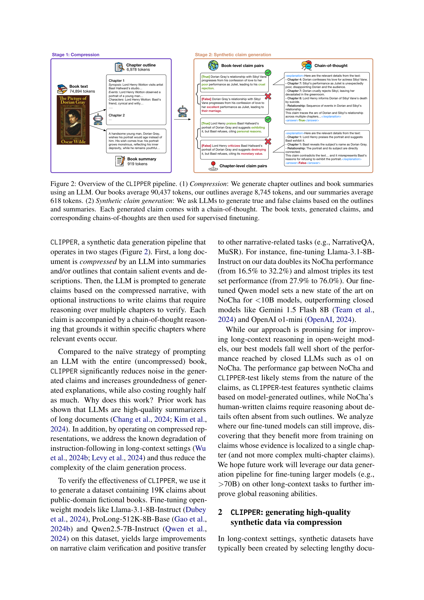
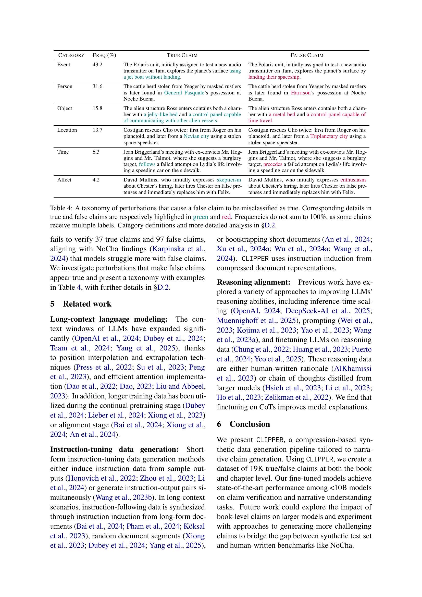
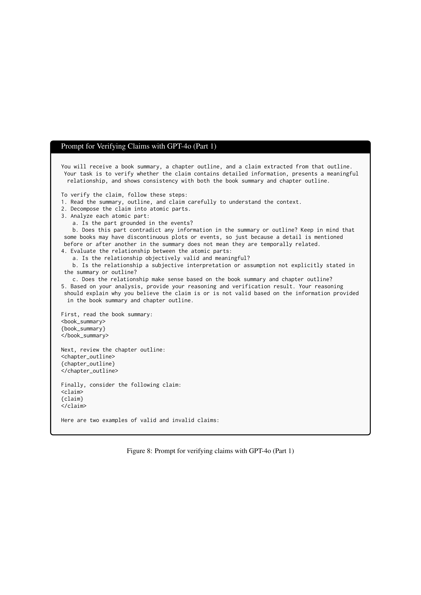

 


 2502.14854 
 Chau Minh Pham et el. 
 
 🤗 2025-02-21 
 



↗ arXiv


↗ Hugging Face


↗ Papers with Code


### TL;DR



ì¥ë¬¸ ë§¥ë½ ì¶”ë¡ ì„ ìœ„í•œ 고품질 합성 ë°ì´í„° ìƒì„±ì€ LLM ê°œë°œì˜ í° ê³¼ì œì…니다.  ê¸°ì¡´ì˜ ë‹¨ìˆœí•œ ë°©ë²•ë“¤ì€ ì¥ë¬¸ í…스트ì—ì„œ ë³µì¡í•œ ì¶”ë¡ ì„ ìš”êµ¬í•˜ëŠ” ê³¼ì œì— ì í•©í•˜ì§€ ì•Šê³ , 오류가 ë§ìœ¼ë©° ë¹„ìš©ì´ ë§ì´ 듭니다.  

CLIPPER는 ì´ëŸ¬í•œ 문제를 해결하기 위해 **í…스트 압축**ì„ ê¸°ë°˜ìœ¼ë¡œ 합니다.  먼저, ì¥ë¬¸ì˜ í…스트를 요약 ë° ì¥ë³„ 개요로 압축하고, ì´ë¥¼ 바탕으로 ë³µì¡í•œ 주ì¥ê³¼ 사고 ê³¼ì •ì„ ìƒì„±í•©ë‹ˆë‹¤.  **CLIPPER를 통해 ìƒì„±ëœ 19,000ê°œì˜ í•©ì„± ë°ì´í„°ì…‹**ì„ ì‚¬ìš©í•˜ì—¬ 여러 LLM 모ë¸ì„ 미세 ì¡°ì •í•œ ê²°ê³¼, **기존 최고 ì„±ëŠ¥ì„ ë›°ì–´ë„˜ëŠ” 성과**를 ê±°ë‘었습니다. 특íˆ, 10B ë¯¸ë§Œì˜ ì†Œê·œëª¨ 모ë¸ì—ì„œì˜ ì„±ëŠ¥ í–¥ìƒì´ ë‘드러집니다.



#### Key Takeaways


 CLIPPER는 ì¥ë¬¸ ë§¥ë½ ì¶”ë¡ ì„ ìœ„í•œ 합성 ë°ì´í„° ìƒì„± 문제를 해결하기 위한 압축 기반 ì ‘ê·¼ë²•ì„ ì œì‹œí•©ë‹ˆë‹¤. 



 CLIPPER를 사용하여 ìƒì„±ëœ 합성 ë°ì´í„°ëŠ” 기존 방법보다 ë”ìš± 정확하고 ë³µì¡í•˜ë©°, ì´ë¥¼ 통해 LLMì˜ ì¥ë¬¸ ë§¥ë½ ì¶”ë¡  ì„±ëŠ¥ì„ í¬ê²Œ í–¥ìƒì‹œí‚µë‹ˆë‹¤. 



 CLIPPER는 10B ë¯¸ë§Œì˜ ì†Œê·œëª¨ 모ë¸ì—ì„œë„ ê´„ëª©í•  만한 성능 í–¥ìƒì„ 달성하며, 새로운 state-of-the-art를 달성합니다. 


#### Why does it matter?
본 ë…¼ë¬¸ì€ **ì¥ë¬¸ ë§¥ë½ ì¶”ë¡ ì„ ìœ„í•œ 합성 ë°ì´í„° ìƒì„±ì˜ 어려움**ì„ í•´ê²°í•˜ëŠ” 압축 기반 ì ‘ê·¼ ë°©ì‹ì¸ CLIPPER를 제시하여 **ì¥ë¬¸ ë§¥ë½ ì¶”ë¡  능력 í–¥ìƒ**ì— ê¸°ì—¬í•©ë‹ˆë‹¤.  CLIPPER는 기존 ë°©ë²•ì˜ í•œê³„ë¥¼ 극복하고, ë”ìš± **유효하고 정확한 합성 ë°ì´í„°**를 ìƒì„±í•˜ì—¬ LLM 성능 í–¥ìƒì— 새로운 ê°€ëŠ¥ì„±ì„ ì œì‹œí•˜ë©°, **추후 연구를 위한 새로운 ë°©í–¥**ì„ ì œì‹œí•©ë‹ˆë‹¤.  특íˆ, 소규모 모ë¸ì—ì„œì˜ ì„±ëŠ¥ í–¥ìƒì€ ìƒë‹¹íˆ 주목할 만합니다.

------
#### Visual Insights

> 🔼 그림 1ì€ CLIPPERì˜ í…ŒìŠ¤íŠ¸ 세트와 NoCha 벤치마í¬ì—ì„œ 기준 모ë¸, 소규모 í쇄형 ëª¨ë¸ ë° CLIPPER 모ë¸ì˜ 결과를 ë³´ì—¬ì¤ë‹ˆë‹¤.  ê°€ë¡œì¶•ì€ ì •í™•ë„(%)ì´ê³  ì„¸ë¡œì¶•ì€ ëª¨ë¸ ì´ë¦„ì…니다.  ê° ëª¨ë¸ì— 대해 CLIPPER 테스트 세트와 NoCha 벤치마í¬ì—ì„œì˜ ì„±ëŠ¥ì´ í‘œì‹œë©ë‹ˆë‹¤.  CLIPPER 모ë¸ì€ 합성 ë°ì´í„°ë¡œ 미세 ì¡°ì •ë˜ì—ˆìœ¼ë©°, 기준 모ë¸ê³¼ 비êµí•˜ì—¬ ì„œìˆ ì  ì£¼ì¥ ê²€ì¦ ì‘ì—…ì—ì„œ ìƒë‹¹í•œ 성능 í–¥ìƒì„ ë³´ì—¬ì¤ë‹ˆë‹¤.  즉, CLIPPER를 사용한 미세 ì¡°ì •ì€ ëª¨ë¸ì˜ ì„œìˆ ì  ì£¼ì¥ ê²€ì¦ ëŠ¥ë ¥ì„ í¬ê²Œ í–¥ìƒì‹œí‚¨ë‹¤ëŠ” ê²ƒì„ ë³´ì—¬ì¤ë‹ˆë‹¤.
> 

> 
read the caption

> Figure 1: Results on CLIPPER’s test set and NoCha for baselines, small closed models, and CLIPPER models. Fine-tuning on our synthetic data significantly improves narrative claim verification.
> 


| Category | NAÃVE | CLIPPER | Error Definition | Example |
|---|---|---|---|---|
| Invalid | 11.5% | 9.1% | The claim is incorrect with respect to the book text, or the true/false claim pair is invalid. | Anne rejects three marriage proposals during her time at Redmond College: from Charlie Sloane, Gilbert Blythe, and Roy Gardner, all because she doesn’t love them. (This false claim is not entirely false because Anne really didn’t love them or wasn’t initially aware of her romantic feelings.). |
| Misattribution | 28.9% | 4.6% | The claim is valid, but the associated explanation does not cite the correct chapters. | Dr. Sheppard…was the last person known to have seen Roger Ackroyd alive at 8:50 PM on the night of the murder, and he later assisted Hercule Poirot in the investigation while simultaneously concealing Ralph Paton in a nursing home. (The explanation cites Chapter 1, 4, 16, and 20, but misses Chapter 24, which mentions that Ralph is in a nursing home) |
| Explicit references | 15.4% | 0.0% | The claim is easier to verify since it includes direct quotes and chapter references, eliminating the need for event retrieval. | Alice’s pursuit of the White Rabbit, which begins with her following him down a rabbit hole in Chapter 1, continues throughout her adventure, including an encounter in the King and Queen of Hearts’ court in Chapter 11 where the Rabbit acts as a herald. |
| Duplication | 17.3% | 3.0% | The claim describes the same events as another. Although their content is similar, differences in wording may allow both to pass our deduplication process. | "Dorian Gray’s cruel rejection of Sibyl Vane after her poor performance as Juliet leads to her suicide, which Dorian callously dismisses by attending the opera the following night, resulting in the first noticeable change in his portrait […]" versus "Dorian Gray’s cruel rejection of Sibyl Vane after her poor performance as Juliet leads to her suicide, causing the first visible change in his portrait […] culminate in his murder of Basil Hallward years later […]." |

> 🔼 í‘œ 1ì€ NAÃVE 방법과 CLIPPER ë°©ë²•ì„ ì‚¬ìš©í•˜ì—¬ ìƒì„±ëœ 주ì¥ë“¤ì— 대한 오류 ìœ í˜•ì„ ë³´ì—¬ì¤ë‹ˆë‹¤.  NAÃVE ë°©ë²•ì€ í‘œ 5ì˜ 6ê¶Œì˜ ì±…ì„ ë°”íƒ•ìœ¼ë¡œ 52ê°œì˜ ì£¼ì¥ì„ ìƒì„±í–ˆê³ , CLIPPER ë°©ë²•ì€ ê°™ì€ ì±…ë“¤ì„ ë°”íƒ•ìœ¼ë¡œ 66ê°œì˜ ì£¼ì¥ì„ ìƒì„±í–ˆìŠµë‹ˆë‹¤.  í‘œì—는 ê° ë°©ë²•ìœ¼ë¡œ ìƒì„±ëœ 주ì¥ë“¤ 중ì—ì„œ ì˜ëª»ëœ 주ì¥, ì˜ëª»ëœ ì¥ì„ ì¸ìš©í•œ 주ì¥, ì¥ ë²ˆí˜¸ ë˜ëŠ” ì§ì ‘ ì¸ìš©ë¬¸ì„ í¬í•¨í•˜ëŠ” 주ì¥, ì¤‘ë³µëœ ì£¼ì¥ ë“±ì˜ ì˜¤ë¥˜ ìœ í˜•ì´ ë‚˜íƒ€ë‚˜ ìˆìŠµë‹ˆë‹¤.  NAÃVE 방법으로 ìƒì„±ëœ 주ì¥ë“¤ì—는 CLIPPER 방법보다 훨씬 ë” ë§ì€ 오류가 í¬í•¨ë˜ì–´ ìˆìŒì„ ë³´ì—¬ì¤ë‹ˆë‹¤.  í‘œì—는 NAÃVE 방법으로 ìƒì„±ëœ 주ì¥ë“¤ 중ì—ì„œ 오류 ìœ í˜•ì˜ ì˜ˆì‹œë„ í¬í•¨ë˜ì–´ ìˆìŠµë‹ˆë‹¤.
> 

> 
read the caption

> Table 1: Error types among claims produced by NAÃVE (52) and CLIPPER (66) based on six books from Table 5. Examples are selected from NAÃVE claims. CLIPPER produces much fewer claims with errors than NAÃVE.
> 

### In-depth insights

#### Long-Context LLM Data
ì¥ë¬¸ 컨í…스트 LLM ë°ì´í„°ëŠ” **대규모 언어 모ë¸(LLM)**ì˜ ì„±ëŠ¥ í–¥ìƒì— 필수ì ì´ë‚˜, 고품질 ë°ì´í„° ìƒì„±ì˜ 어려움으로 ì¸í•´ 연구가 í™œë°œíˆ ì§„í–‰ë˜ê³  ìˆìŠµë‹ˆë‹¤.  **ë°ì´í„°ì˜ 품질과 확ì¥ì„±**ì€ ì¥ë¬¸ 컨í…스트 추론 ì„±ëŠ¥ì— ì§ì ‘ì ì¸ ì˜í–¥ì„ 미칩니다.  ë‹¨ìˆœíˆ ê¸´ 문서를 사용하는 것보다, **요약, 개요 ìƒì„± ë“±ì˜ ì••ì¶• 기법**ì„ í†µí•´ 모ë¸ì˜ 처리 ë¶€ë‹´ì„ ì¤„ì´ê³ , 핵심 ì •ë³´ì— ì§‘ì¤‘í•˜ëŠ” ì „ëµì´ 효과ì ì…니다.  **ì¸ê°„ì˜ ê°œì…ì„ ìµœì†Œí™”**하면서 고품질 ë°ì´í„°ë¥¼ 효율ì ìœ¼ë¡œ ìƒì„±í•˜ëŠ” ë°©ë²•ì— ëŒ€í•œ 연구가 중요하며, **합성 ë°ì´í„° ìƒì„± ë° ê²€ì¦** ê³¼ì •ì˜ ë¹„ìš© 효율성 ë˜í•œ ê³ ë ¤ë˜ì–´ì•¼ 합니다.  **다양한 í‰ê°€ 지표**를 활용한 ê°ê´€ì ì¸ 성능 측정과, 실제 ì‘ìš© 환경ì—ì„œì˜ ëª¨ë¸ ì„±ëŠ¥ ê²€ì¦ì„ 통해 LLM ë°ì´í„°ì…‹ ì—°êµ¬ì˜ ì‹¤íš¨ì„±ì„ ë†’ì¼ ìˆ˜ ìˆìŠµë‹ˆë‹¤.

#### Compression-Based Gen
압축 기반 ìƒì„±(Compression-Based Gen) ë°©ë²•ì€ **ì¥ë¬¸ì˜ í…스트 ë°ì´í„°ë¥¼ 효율ì ìœ¼ë¡œ 처리**하기 위한 핵심 ì „ëµì…니다.  ì´ëŠ” 긴 ë¬¸ë§¥ì„ ìš”êµ¬í•˜ëŠ” ì‘ì—…ì—ì„œ **LLMì˜ ì„±ëŠ¥ 저하 문제를 í•´ê²°**하는 ë° ì¤‘ìš”í•©ë‹ˆë‹¤.  **본 ë…¼ë¬¸ì€ ì••ì¶•ëœ ì¤‘ê°„ 표현** (예: ì¥ ìš”ì•½, ì¥ ê°œìš”)ì„ í™œìš©í•˜ì—¬ LLMì´ ì¥ë¬¸ ë°ì´í„°ì—ì„œ 효과ì ìœ¼ë¡œ 추론하고, **ì¸ê³µì§€ëŠ¥ì´ ìƒì„±í•œ ë°ì´í„°ì˜ ì§ˆì„ ë†’ì´ê³ , ìƒì„± ë¹„ìš©ì„ ì ˆê°**í•  수 ìˆìŒì„ ë³´ì—¬ì¤ë‹ˆë‹¤.  ë‹¨ìˆœíˆ ì›ë³¸ í…스트를 사용하는 것보다 훨씬 **정확하고, 근거가 명확하며, ë³µì¡í•œ 질문ì—ë„ ì˜ ëŒ€ì‘**하는 ë°ì´í„° ìƒì„±ì´ 가능해ì§ì„ 실험ì ìœ¼ë¡œ ì¦ëª…합니다.  **압축 ì „ëµì˜ 효과는 ì¥ë¬¸ ë°ì´í„°ë¥¼ 처리하는 LLMì˜ í•œê³„ë¥¼ 극복**하는 ë° ì¤‘ìš”í•˜ë©°, **고품질 합성 ë°ì´í„° ìƒì„±ì„ 위한 새로운 ë°©í–¥**ì„ ì œì‹œí•©ë‹ˆë‹¤.  향후 연구는 ë”ìš± 확ì¥ëœ 모ë¸ê³¼ 다양한 ê³¼ì œì— ëŒ€í•œ ì ìš© ê°€ëŠ¥ì„±ì„ íƒìƒ‰í•˜ëŠ” ë° ì´ˆì ì„ ë§ì¶°ì•¼ 합니다.

#### CLIPPER Pipeline Eval
CLIPPER 파ì´í”„ë¼ì¸ í‰ê°€ëŠ” **합성 ë°ì´í„° ìƒì„± ê³¼ì •ì˜ ê° ë‹¨ê³„(압축, í´ë ˆì„ ìƒì„±, ê²€ì¦)ì˜ ì„±ëŠ¥ê³¼ í’ˆì§ˆì„ ë‹¤ê°ì ìœ¼ë¡œ 분ì„**하는 ê²ƒì„ ì˜ë¯¸í•©ë‹ˆë‹¤.  **단순 ì •í™•ë„ ì¸¡ì •ì„ ë„˜ì–´, ìƒì„±ëœ í´ë ˆì„ì˜ íƒ€ë‹¹ì„±, ê·¼ê±°ì˜ ëª…í™•ì„±, 그리고 ë³µì¡ë„까지 ê³ ë ¤**하여 종합ì ì¸ í‰ê°€ë¥¼ ìˆ˜í–‰í–ˆì„ ê²ƒì…니다.  특íˆ, **ê¸°ì¡´ì˜ ë‹¨ìˆœ ì ‘ê·¼ ë°©ì‹(NAÃVE)ê³¼ì˜ ë¹„êµ ë¶„ì„ì„ í†µí•´ CLIPPERì˜ íš¨ìœ¨ì„±ê³¼ ìš°ìˆ˜ì„±ì„ ì…ì¦**하려 í–ˆì„ ê²ƒì´ë©°, ì´ë¥¼ 위해 다양한 지표(정확ë„, 오류 유형 분류, 비용 ë¶„ì„ ë“±)를 í™œìš©í–ˆì„ ê²ƒìœ¼ë¡œ 예ìƒë©ë‹ˆë‹¤.  **다양한 ê·œëª¨ì˜ ì–¸ì–´ 모ë¸ì— 대한 파ì¸íŠœë‹ 결과를 통해 CLIPPERê°€ ì¥ë¬¸ 추론 능력 í–¥ìƒì— 미치는 ì˜í–¥ì„ 실험ì ìœ¼ë¡œ ê²€ì¦**하는 과정 ë˜í•œ í¬í•¨ë˜ì—ˆì„ 것ì…니다.  **ë°ì´í„°ì…‹ì˜ 품질과 ëª¨ë¸ ì„±ëŠ¥ ê°„ì˜ ìƒê´€ê´€ê³„ 분ì„ì„ í†µí•´, CLIPPERì˜ ë°ì´í„° ìƒì„± ì „ëµì˜ ìœ íš¨ì„±ì„ ë’·ë°›ì¹¨**하는 결과를 ì œì‹œí–ˆì„ ê°€ëŠ¥ì„±ì´ ë†’ìŠµë‹ˆë‹¤.  ì „ë°˜ì ìœ¼ë¡œ, CLIPPER 파ì´í”„ë¼ì¸ í‰ê°€ëŠ” 정량ì , ì •ì„±ì  ë¶„ì„ì„ ì¢…í•©í•˜ì—¬ CLIPPERì˜ ì‹¤ìš©ì„±ê³¼ 효과를 ê°ê´€ì ìœ¼ë¡œ 제시하는 ë° ì´ˆì ì„ ë§ì¶”ì—ˆì„ ê²ƒìœ¼ë¡œ 예ìƒë©ë‹ˆë‹¤.

#### Finetuning & Analysis
본 ë…¼ë¬¸ì˜ "미세조정 ë° ë¶„ì„" ë¶€ë¶„ì€ **합성 ë°ì´í„°ì…‹ì„ 사용한 LLM ë¯¸ì„¸ì¡°ì •ì˜ íš¨ê³¼**를 심층ì ìœ¼ë¡œ 다룹니다.  **CLIPPER ë°ì´í„°ì…‹ì„ ì´ìš©í•œ 세 가지 모ë¸(ProLong, Llama, Qwen)ì˜ ë¯¸ì„¸ì¡°ì • ê²°ê³¼**를 제시하며, **기존 ëª¨ë¸ ëŒ€ë¹„ 성능 í–¥ìƒ**ì„ ë³´ì—¬ì¤ë‹ˆë‹¤. íŠ¹íˆ ì¥ë¬¸ 추론 과제ì—ì„œì˜ ì„±ëŠ¥ í–¥ìƒì´ ë‘드러지며,  **NarrativeQA, MuSR 등 다른 관련 과제ì—ì„œì˜ ì„±ëŠ¥ í–¥ìƒ**ë„ í™•ì¸ë©ë‹ˆë‹¤. ë‹¨ìˆœíˆ ì„±ëŠ¥ 수치만 제시하는 ê²ƒì´ ì•„ë‹ˆë¼, **미세조정 ì „í›„ì˜ ì¶”ë¡  과정(Chain-of-Thought)ì˜ ì§ˆì  ë³€í™”**, **ë°ì´í„°ì…‹ì˜ 특징(claim scope, data length)**ì— ë”°ë¥¸ 성능 변화 ë“±ì„ ë¶„ì„하여 **ëª¨ë¸ ì„±ëŠ¥ í–¥ìƒì˜ ì›ì¸ê³¼ 한계**를 ë°íˆë ¤ëŠ” ì‹œë„ê°€ ë‹ë³´ì…니다.  **ë°ì´í„°ì…‹ì˜ ì§ˆì  ì¸¡ë©´ì„ ì •ëŸ‰ì ìœ¼ë¡œ í‰ê°€**하고, **모ë¸ì˜ ê°•ì ê³¼ 약ì **ì„ êµ¬ì²´ì ìœ¼ë¡œ 분ì„하는 ë¶€ë¶„ì€ ì—°êµ¬ì˜ ì‹ ë¢°ë„를 높ì…니다. 하지만,  **ëª¨ë¸ í¬ê¸°ì˜ 한계**와 **특정 ê³¼ì œì— ëŒ€í•œ í¸í–¥ì„±** ë“±ì€ ì¶”ê°€ 연구가 í•„ìš”í•¨ì„ ì‹œì‚¬í•©ë‹ˆë‹¤.

#### Future Work & Limits
본 ë…¼ë¬¸ì€ ì¥ë¬¸ ë§¥ë½ ì¶”ë¡ ì„ ìœ„í•œ 합성 ë°ì´í„° ìƒì„±ì— ìˆì–´ 압축 기반 ì ‘ê·¼ ë°©ì‹ì¸ CLIPPER를 제시합니다.  **ë¯¸ë˜ ì—°êµ¬ ë°©í–¥**으로는, **ë”ìš± í¬ê³  ë³µì¡í•œ 모ë¸ì— 대한 CLIPPER 파ì´í”„ë¼ì¸ì˜ ì ìš©**ì„ í†µí•´ 성능 í–¥ìƒì„ ë„모하는 ê²ƒì´ ì¤‘ìš”í•©ë‹ˆë‹¤.  **í˜„ì¬ ëª¨ë¸ì˜ 한계ì **ì€ ê¸´ ë¬¸ë§¥ì„ ë‹¤ë£¨ëŠ” ë° ì–´ë ¤ì›€ì„ ê²ªê³ , **합성 ë°ì´í„°ì˜ 한계**ë¡œ ì¸í•´ 실제 ì¸ê°„ì´ ì‘성한 ë°ì´í„°ì…‹ê³¼ì˜ 성능 ì°¨ì´ë¥¼ ì™„ì „íˆ í•´ì†Œí•˜ì§€ 못하는 ì ì…니다. ë”°ë¼ì„œ **다양한 ìœ í˜•ì˜ ì¥ë¬¸ ë°ì´í„°ë¥¼ 활용한 추가 실험**ì„ í†µí•´ 모ë¸ì˜ ì¼ë°˜í™” ì„±ëŠ¥ì„ ë†’ì´ê³ , **ì¸ê°„ì˜ ì¶”ë¡  능력과 ë”ìš± 근접한 합성 ë°ì´í„° ìƒì„± ì „ëµ**ì„ ëª¨ìƒ‰í•´ì•¼ 합니다. ë˜í•œ, **CLIPPERì˜ íš¨ìœ¨ì„±ì„ ë†’ì´ëŠ” 연구**와 **다양한 하ì´í¼íŒŒë¼ë¯¸í„° ì¡°ì •**ì„ í†µí•œ 최ì í™” ë°©ì•ˆì„ íƒêµ¬í•˜ëŠ” ê²ƒë„ ì¤‘ìš”í•©ë‹ˆë‹¤.

### More visual insights

More on tables


| Models | CLIPPER-test | NoCha | NarrativeQA | Bench QA | MuSR |
|---|---|---|---|---|---| 
| Qwen2.5-7B-Instruct | 51.0% | 24.1% | 40.3% | 35.3% | 41.2% |
| Llama-3.1-8B-Instruct | 27.9% | 16.5% | 47.7% | 47.8% | 40.3% |
| ProLong-512K-8B-Instruct | 34.5% | 16.9% | 44.0% | 42.6% | 42.3% |
|  Qwen2.5-7B-CLIPPER | 73.9% | 32.4% | 46.0% | 42.3% | 45.2% |
|  Llama-3.1-8B-CLIPPER | 76.0% | 32.2% | 49.0% | 46.5% | 43.6% |
|  ProLong-512K-8B-CLIPPER | 75.0% | 32.3% | 49.0% | 38.5% | 44.5% |
| ProLong-512K-8B-WritingPrompts | 63.0% | 24.1% | 31.0% | 35.8% | 45.2% |
> 🔼 í‘œ 2는 CLIPPER ë°ì´í„°ì…‹ì„ 사용하여 미세 ì¡°ì •ëœ ì–¸ì–´ 모ë¸ì˜ ì„±ëŠ¥ì„ ë³´ì—¬ì¤ë‹ˆë‹¤.  CLIPPER-test와 NoCha 벤치마í¬ëŠ” ì„œìˆ ì  ì£¼ì¥ ê²€ì¦ ì‘ì—…ì—ì„œì˜ ì •í™•ë„를 측정합니다. NarrativeQA, âˆBench QA, MuSR 벤치마í¬ëŠ” 서술 ì´í•´ ëŠ¥ë ¥ì„ í‰ê°€í•©ë‹ˆë‹¤.  í‘œì—ì„œ ì•Œ 수 ìˆë“¯ì´, CLIPPER ë°ì´í„°ì…‹ìœ¼ë¡œ 미세 ì¡°ì •í•œ 모ë¸ì€ ì£¼ì¥ ê²€ì¦ ë° ì„œìˆ  ì´í•´ ì‘ì—… 모ë‘ì—ì„œ ì„±ëŠ¥ì´ í–¥ìƒë¨ì„ 확ì¸í•  수 ìˆìŠµë‹ˆë‹¤.
> 

> 
read the caption

> Table 2: Model accuracy on claim verification (CLIPPER-test, NoCha) and narrative understanding benchmarks (NarrativeQA, âˆ\inftyâˆBench QA, MuSR). Finetuning models using CLIPPER improves performance on claim verification and narrative understanding.
> 


| Claim: | "Jacques consistently uses pastoral themes to express his love for Belle-bouche, first through metaphorical discussions of shepherds and shepherdesses, and later while walking through an orchard and discussing Arcadian lovers." |
> 🔼 í‘œ 3ì€ John Esten Cookeì˜ ì €ì„œì¸ 'The Youth of Jefferson'ì˜ ì£¼ì¥ì— 대해 Llama-Instruct와 Llama-CLIPPERê°€ ìƒì„±í•œ Chain of Thought(CoT) ì‘ë‹µì„ ë¹„êµí•œ 것ì…니다. Llama-CLIPPERì˜ CoT ì‘답ì—는 Llama-Instructì˜ ì‘답보다 ë” ë§ì€ 명시ì ì¸ ì¥ ì°¸ì¡°(녹색으로 ê°•ì¡° 표시)와 세부 ì •ë³´ê°€ í¬í•¨ë˜ì–´ ìˆìŠµë‹ˆë‹¤. ì´ëŠ” CLIPPERê°€ ìƒì„±í•œ 합성 ë°ì´í„°ë¥¼ 사용하여 미세 ì¡°ì •í•œ 모ë¸ì´ ë”ìš± 구체ì ì´ê³  근거 ìˆëŠ” ì„¤ëª…ì„ ìƒì„±í•  수 ìˆìŒì„ ë³´ì—¬ì¤ë‹ˆë‹¤.
> 

> 
read the caption

> Table 3: Comparison of CoT responses produced by Llama-Instruct and Llama-CLIPPER for a claim from John Esten Cooke’s The Youth of Jefferson. Llama-CLIPPER’s CoT response contains more explicit chapter references (highlighed in green) and details compared to that of Llama-Instruct (highlighted in red).
> 


| Model | Chain of Thought (CoT)                                                                                                                                                                                                                                 | Answer |
|---|---|---|
| Llama-Instruct | "The statement claims that Jacques consistently uses pastoral themes to express his love for Belle-bouche. To evaluate this statement, we need to examine the text and identify instances where Jacques uses pastoral themes to express his love for Belle-bouche. The text mentions that Jacques discusses crooks, flowers, and shepherdesses with Belle-bouche, and later, while walking through an orchard, he talks about Arcadian lovers, specifically mentioning Strephon, Chloe, Corydon, Daphnis, and Narcissus. These instances suggest that Jacques does use pastoral themes to express his love for Belle-bouche. However, we need to consider whether this is a consistent pattern throughout the text."  Answer: TRUE | TRUE |
| Llama-CLIPPER | "Here are the relevant details from the text:  • Chapter 2: Jacques engages in a metaphorical discussion about shepherds and shepherdesses, expressing his love for Belle-bouche.  • Chapter 17: Jacques and Belle-bouche walk through the orchard, discussing the twentieth of May as a day for lovers.  • Relationship: Recurring theme of pastoral love In Chapter 2, Jacques engages in a metaphorical discussion about shepherds and shepherdesses to express his love for Belle-bouche. This theme continues in Chapter 17, where Jacques and Belle-bouche walk through an orchard, discussing the twentieth of May as a day for lovers. This connection shows Jacques’ consistent use of pastoral imagery to convey his romantic feelings for Belle-bouche throughout the story." Answer: TRUE | TRUE |
> 🔼 ì´ í‘œëŠ” ì˜ëª»ëœ 주ì¥ì„ 사실로 ì˜ëª» 분류하는 ì›ì¸ì´ ë˜ëŠ” 변화 ìœ í˜•ì„ ë³´ì—¬ì¤ë‹ˆë‹¤. 참과 거짓 주ì¥ì—ì„œ 해당 ë‚´ìš©ì€ ê°ê° 녹색과 빨간색으로 ê°•ì¡° 표시ë˜ì–´ ìˆìŠµë‹ˆë‹¤. ì¼ë¶€ 주ì¥ì€ 여러 가지 ë²”ì£¼ì— ì†í•˜ê¸° ë•Œë¬¸ì— ë¹ˆë„ì˜ í•©ê³„ê°€ 100%ê°€ 아닙니다. ê° ë²”ì£¼ì˜ ì세한 ì •ì˜ëŠ” 부ë¡ì˜ 오류 ë¶„ì„ ì„¹ì…˜ì—ì„œ 확ì¸í•  수 ìˆìŠµë‹ˆë‹¤.
> 

> 
read the caption

> Table 4: A taxonomy of perturbations that cause a false claim to be misclassified as true. Corresponding details in true and false claims are respectively highlighed in green and red. Frequencies do not sum to 100%, as some claims receive multiple labels. Category definitions and more detailed analysis in §LABEL:appendix:error-analysis.
> 


| Category | Freq (%) | True Claim | False Claim |
|---|---|---|---| 
| Event | 43.2 | The Polaris unit, initially assigned to test a new audio transmitter on Tara, explores the planet’s surface using a jet boat without landing. | The Polaris unit, initially assigned to test a new audio transmitter on Tara, explores the planet’s surface by landing their spaceship. |
| Person | 31.6 | The cattle herd stolen from Yeager by masked rustlers is later found in General Pasquale’s possession at Noche Buena. | The cattle herd stolen from Yeager by masked rustlers is later found in Harrison’s possession at Noche Buena. |
| Object | 15.8 | The alien structure Ross enters contains both a chamber with a jelly-like bed and a control panel capable of communicating with other alien vessels. | The alien structure Ross enters contains both a chamber with a metal bed and a control panel capable of time travel. |
| Location | 13.7 | Costigan rescues Clio twice: first from Roger on his planetoid, and later from a Nevian city using a stolen space-speedster. | Costigan rescues Clio twice: first from Roger on his planetoid, and later from a Triplanetary city using a stolen space-speedster. |
| Time | 6.3 | Jean Briggerland’s meeting with ex-convicts Mr. Hoggins and Mr. Talmot, where she suggests a burglary target, follows a failed attempt on Lydia’s life involving a speeding car on the sidewalk. | Jean Briggerland’s meeting with ex-convicts Mr. Hoggins and Mr. Talmot, where she suggests a burglary target, precedes a failed attempt on Lydia’s life involving a speeding car on the sidewalk. |
| Affect | 4.2 | David Mullins, who initially expresses skepticism about Chester’s hiring, later fires Chester on false pretenses and immediately replaces him with Felix. | David Mullins, who initially expresses enthusiasm about Chester’s hiring, later fires Chester on false pretenses and immediately replaces him with Felix. |
> 🔼 ì´ í‘œëŠ” ìˆ˜ë™ ë¶„ì„ì— ì‚¬ìš©ëœ 6ê¶Œì˜ ì±… 목ë¡ì„ ë³´ì—¬ì¤ë‹ˆë‹¤.  연구ìë“¤ì´ ì±… ë‚´ìš©ì— ìµìˆ™í•˜ì—¬ ìˆ˜ë™ ê²€ì¦ ê³¼ì •ì„ ìš©ì´í•˜ê²Œ 하기 위해 해당 ì±…ë“¤ì´ ì„ íƒë˜ì—ˆìŠµë‹ˆë‹¤.  í‘œì—는 ê° ì±…ì˜ ì œëª©, ì €ì, 출íŒì—°ë„, í† í° ìˆ˜, ì¥ ìˆ˜ê°€ í¬í•¨ë˜ì–´ ìˆìŠµë‹ˆë‹¤.
> 

> 
read the caption

> Table 5: Six books used in our manual analysis. Books are chosen due to familiarity with the content.
> 


| Title | Author | Publication Year | Number of Tokens | Number of Chapters |
|---|---|---|---|---|
| Anne of the Island | L. M. Montgomery | 1915 | 111,337 | 41 |
| Alice in Wonderland | Lewis Carroll | 1865 | 36,691 | 12 |
| The Murder of Roger Ackroyd | Agatha Christie | 1926 | 98,602 | 27 |
| The Picture of Dorian Gray | Oscar Wilde | 1890 | 105368 | 20 |
| Frankenstein | Mary Shelley | 1818 | 97,574 | 24 |
| The Adventures of Tom Sawyer | Mark Twain | 1876 | 97,968 | 35 |
> 🔼 í‘œ 6ì€ CLIPPERì˜ í…ŒìŠ¤íŠ¸ ì„¸íŠ¸ì— ëŒ€í•œ 정확ë„를 ë³´ì—¬ì¤ë‹ˆë‹¤.  'ì±… 본문 í¬í•¨' ì—´ì€ ëª¨ë¸ì´ ì±…ì˜ ì „ì²´ 본문과 함께 ì§ˆë¬¸ì„ ë°›ì•˜ì„ ë•Œì˜ ì •í™•ë„를 나타내고, 'ì±… 본문 미í¬í•¨' ì—´ì€ ì±… 본문 ì—†ì´ ì§ˆë¬¸ë§Œ ë°›ì•˜ì„ ë•Œì˜ ì •í™•ë„를 나타냅니다. ì´ëŠ” 모ë¸ì´ 주어진 맥ë½ì— 얼마나 ì˜ì¡´í•˜ëŠ”지, 그리고 긴 문맥 ë‚´ 추론 ëŠ¥ë ¥ì´ ì–¼ë§ˆë‚˜ 중요한지를 보여주는 지표ì…니다.  ì±… ë³¸ë¬¸ì´ ì—†ì„ ê²½ìš° 모ë¸ì˜ ì„±ëŠ¥ì´ í¬ê²Œ 저하ë˜ëŠ” ê²ƒì„ í†µí•´ 긴 문맥 ë‚´ 추론 ì‘ì—…ì—ì„œ ì±… ë³¸ë¬¸ì˜ ì¤‘ìš”ì„±ì„ í™•ì¸í•  수 ìˆìŠµë‹ˆë‹¤.
> 

> 
read the caption

> Table 6: Accuracy on CLIPPER’s test set (with and without book texts).
> 


| Models | No Text | With Text |
|---|---|---|
| ProLong-Instruct | 0.0% | 35.6% |
| Llama-Instruct | 0.0% | 32.8% |
| Qwen-Instruct | 0.0% | 51.4% |
> 🔼 í‘œ 7ì€ CLIPPERì˜ í…ŒìŠ¤íŠ¸ ì„¸íŠ¸ì— ëŒ€í•œ 정확ë„를 ë³´ì—¬ì¤ë‹ˆë‹¤. ì´ í‘œëŠ” 모ë¸ì´ ì±…ì˜ ë³¸ë¬¸ì´ë‚˜ 메타ë°ì´í„° ì—†ì´ë„ 주어진 ì§ˆë¬¸ì— ëŒ€í•´ 얼마나 정확하게 답변하는지를 ë³´ì—¬ì¤ë‹ˆë‹¤.  즉, 모ë¸ì´ ë‹¨ìˆœíˆ ì•”ê¸°ê°€ ì•„ë‹Œ 실제 추론 ëŠ¥ë ¥ì„ ë°”íƒ•ìœ¼ë¡œ 답변하는지 í‰ê°€í•˜ê¸° 위한 실험 ê²°ê³¼ì…니다.  ê° ëª¨ë¸ë³„ë¡œ True/False ë¬¸ì œì— ëŒ€í•œ 정확ë„를 제시하고 ìˆìŠµë‹ˆë‹¤.
> 

> 
read the caption

> Table 7: Accuracy on CLIPPER’s test set (no book text or metadata provided).
> 


| Models | Before SFT | After SFT |
|---|---|---|
| ProLong-Instruct | 0.0% | 25.2% |
| Llama-Instruct | 20.2% | 13.8% |
| Qwen-Instruct | 21.7% | 22.9% |
> 🔼 í‘œ 8ì€ í•©ì„± ë°ì´í„° ìƒì„± 파ì´í”„ë¼ì¸ì˜ ê° ë‹¨ê³„ë³„ ë¹„ìš©ì„ ë³´ì—¬ì¤ë‹ˆë‹¤.  단계별 ë¹„ìš©ì€ ê° ë‹¨ê³„ë¥¼ 수행하는 ë° ì‚¬ìš©ëœ LLM (GPT-4 ë˜ëŠ” Claude)ì˜ í† í° ìˆ˜ì™€ ê°€ê²©ì„ ê¸°ë°˜ìœ¼ë¡œ 계산ë˜ì—ˆìŠµë‹ˆë‹¤.  ê° ë‹¨ê³„ì˜ ë¹„ìš©ì€ ë¯¸êµ­ 달러로 표시ë˜ë©° ì†Œìˆ˜ì  ë„·ì§¸ ì리까지 반올림ë˜ì—ˆìŠµë‹ˆë‹¤.  ì´ í‘œëŠ” 합성 ë°ì´í„° ìƒì„±ì— 드는 ì´ ë¹„ìš©ì„ íŒŒì•…í•˜ëŠ” ë° ë„ì›€ì´ ë©ë‹ˆë‹¤.
> 

> 
read the caption

> Table 8: Cost to run pipeline per claim (in US dollars, rounded to four decimal places).
> 


| Stage | Cost |
|---|---| 
| Book summary generation | $0.0021 |
| Chapter outline generation | $0.0107 |
| Book-level claim synthesis | $0.0129 |
| Chapter-level claim synthesis | $0.0172 |
| Deduplication | $0.0021 |
| Verification | $0.0064 |
| Total | $0.0514 |
> 🔼 í‘œ 9는 논문ì—ì„œ ì œì‹œëœ NAÃVE 방법과 CLIPPER ë°©ë²•ì˜ ì¶”ì • ë¹„ìš©ì„ ì†Œìˆ˜ì  ë‘˜ì§¸ ì리까지 반올림하여 ë³´ì—¬ì¤ë‹ˆë‹¤.  NAÃVE ë°©ë²•ì€ ì±… ì „ì²´ í…스트를 사용하여 주ì¥ì„ ìƒì„±í•˜ëŠ” 반면, CLIPPER ë°©ë²•ì€ ì±…ì„ ìš”ì•½ ë° ê°œìš”ë¡œ 압축하여 주ì¥ì„ ìƒì„±í•©ë‹ˆë‹¤. ì´ í‘œëŠ” ê° ë°©ë²•ì˜ ì±… 수준 주ì¥ê³¼ ì¥ ìˆ˜ì¤€ ì£¼ì¥ ìƒì„±ì— 대한 ë¹„ìš©ì„ ë¹„êµí•˜ì—¬ CLIPPER ë°©ë²•ì´ NAÃVE 방법보다 비용 효율ì ì„ì„ ë³´ì—¬ì¤ë‹ˆë‹¤.
> 

> 
read the caption

> Table 9: Estimated cost for our NAÃVE vs CLIPPER approach (rounded to two decimal places)
> 


|                     | NAÃVE | CLIPPER |
|---------------------|--------|---------|
| Cost per claim (book-level) | $0.09  | $0.07   |
| Cost per claim (chap-level) | $0.04  | $0.02   |
> 🔼 í‘œ 10ì€ ë…¼ë¬¸ì—ì„œ ì‚¬ìš©ëœ ê° í”„ë¡¬í”„íŠ¸ì— í•´ë‹¹í•˜ëŠ” ê·¸ë¦¼ì˜ ë²ˆí˜¸ë¥¼ ë³´ì—¬ì¤ë‹ˆë‹¤.  즉, ê° í”„ë¡¬í”„íŠ¸ê°€ ë…¼ë¬¸ì˜ ì–´ë–¤ ê·¸ë¦¼ì— ì„¤ëª…ë˜ì–´ ìˆëŠ”지 보여주는 참조표ì…니다.  본 논문ì—서는 프롬프트 엔지니어ë§ì„ 통해 합성 ë°ì´í„°ì…‹ì„ ìƒì„±í•˜ëŠ”ë°, ê° ë‹¨ê³„ë³„ 프롬프트를 ì‹œê°ì ìœ¼ë¡œ ì´í•´í•˜ê¸° 쉽ë„ë¡ ê·¸ë¦¼ìœ¼ë¡œ 나타내고 í‘œ 10ì—서는 ì´ ê·¸ë¦¼ë“¤ê³¼ í”„ë¡¬í”„íŠ¸ì˜ ë§¤í•‘ 관계를 ë³´ì—¬ì¤ë‹ˆë‹¤.
> 

> 
read the caption

> Table 10: Figure references for each prompt.
> 

### Full paper



