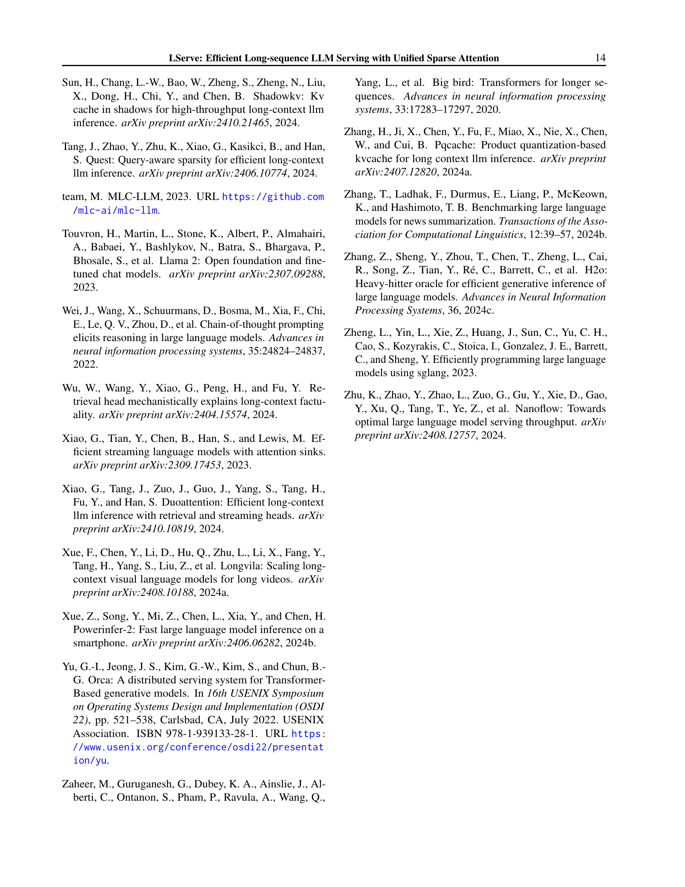

 


 2502.14866 
 Shang Yang et el. 
 
 🤗 2025-02-21 
 



↗ arXiv


↗ Hugging Face


↗ Papers with Code


### TL;DR



**장문 컨텍스트 LLM은 뛰어난 성능을 보이지만, 어텐션 메커니즘의 계산 복잡도와 KV 캐시의 큰 메모리 사용량으로 인해 서빙 속도가 느린 문제가 있습니다.** 기존의 희소 어텐션 기법들은 정적 또는 동적 희소성만을 활용하여 성능 향상에 한계가 있었습니다.  또한, KV 캐시 메모리 사용량을 줄이기 위한 양자화 기법들은 계산량 감소에는 기여하지 못했습니다.

**본 논문에서 제안하는 LServe는 하이브리드 희소 어텐션을 통해 이러한 문제를 해결합니다.**  LServe는 정적 및 동적 희소성을 결합하여 어텐션 계산량을 줄이고, 계층적 KV 페이지 선택 정책을 통해 필요한 KV 페이지 수를 최소화합니다.  실험 결과, LServe는 기존 방법들에 비해 LLM 서빙 속도를 최대 2.9배까지 향상시켰으며, 장문 컨텍스트 정확도는 유지했습니다.  **이는 하드웨어 친화적인 희소 어텐션 구조를 통한 효율적인 LLM 서빙 시스템의 가능성을 보여주는 중요한 결과입니다.**



#### Key Takeaways


 LServe는 하이브리드 희소 어텐션을 사용하여 장문 컨텍스트 LLM 서빙 속도를 크게 향상시켰습니다. 



 LServe는 정적 및 동적 희소성을 결합하여 계산 복잡도와 메모리 사용량을 효과적으로 줄였습니다. 



 LServe는 계층적 KV 페이지 선택 정책을 통해 장문 컨텍스트 기능을 유지하면서 KV 페이지 수를 최소화했습니다. 


#### Why does it matter?
**본 논문은 장문 컨텍스트 LLM 서빙의 효율성을 높이는 데 중요한 의미를 지닙니다.**  **하이브리드 희소 어텐션을 통해 계산 복잡도를 줄이고 메모리 사용량을 최소화하는 새로운 방법을 제시하여, 장문 컨텍스트 LLM의 실제 적용 가능성을 크게 높였습니다.**  향후 연구 방향으로 **다양한 LLM 아키텍처와 하드웨어 플랫폼에 대한 호환성 및 확장성** 연구가 제시되며, **동적 희소성 패턴의 최적화 및 새로운 희소 어텐션 기법 개발**에 대한 가능성을 열었습니다.  **본 논문의 결과는 LLM 서빙 분야의 발전에 크게 기여할 것으로 예상됩니다.**

------
#### Visual Insights

> 🔼 그림 1은 하이브리드 희소 어텐션을 활용하여 장문 시퀀스 LLM을 효율적으로 제공하는 시스템인 LServe를 보여줍니다.  다양한 희소 패턴과 KV 캐시 양자화를 통합함으로써, LServe는 프리필링 단계와 디코딩 단계 모두에서 상당한 속도 향상을 달성하는 동시에 메모리 소비량도 줄입니다.  구체적으로, LServe는 프리필링 및 디코딩 단계에서 모두 하드웨어 친화적인 다양한 구조화된 희소 패턴을 단일 프레임워크로 통합하여, 중요도가 낮은 토큰에 대한 계산을 블록 단위로 건너뜁니다. 이를 통해 정적 및 동적 희소성을 결합하여 속도 향상을 달성하고, 컨텍스트 길이에 관계없이 일정한 수의 KV 페이지만으로 장문 컨텍스트 기능을 유지할 수 있습니다.
> 

> 
read the caption

> Figure 1: LServe is an efficient system for serving long-sequence LLMs that leverages hybrid sparse attention. With the unification of different sparse patterns as well as KV cache quantization, LServe achieves significant speedups in both prefilling stage and decoding stage while also reducing the memory consumption.
> 


| Seq_len | Page Size | Page Size | Page Size | Page Size | Max Slowdown |
|---|---|---|---|---|---| 
|  | 16 | 32 | 64 | 128 |  |
| 512 | 11.0 ms | 10.7 ms | **10.5 ms** | 10.5 ms |  |
| 1024 | 13.8 ms | 13.0 ms | **12.7 ms** | 12.7 ms |  |
| 2048 | 22.1 ms | 20.1 ms | **18.3 ms** | 18.2 ms |  |
| 4096 | 35.7 ms | 31.6 ms | **28.1 ms** | 28.1 ms |  |
| 8192 | **77.1 ms** | **63.0 ms** | **51.0 ms** | 50.6 ms |  |
| Max Slowdown | 1.52× | 1.25× | 1.01× | 1.00× |  |

> 🔼 표 1은 페이지 크기가 LLM 서빙 시스템의 효율성에 미치는 영향을 보여줍니다. 큰 페이지 크기는 메모리 레이아웃의 연속성과 어텐션 연산 중 GPU 대역폭 사용률을 향상시키므로 하드웨어 친화적입니다. 예를 들어, QServe (Lin et al., 2024b)에서 페이지 크기를 줄이면 시스템 전체 속도가 크게 저하됩니다. 이 표는 단일 A100 GPU에서 QServe의 단계별 디코딩 지연 시간(ms/단계)을 보여주는 데모를 제공합니다. Llama3-8B 모델 아키텍처를 사용하고 배치 크기는 32입니다.
> 

> 
read the caption

> Table 1: Page size significantly impacts the LLM serving system’s efficiency: Larger page size is more hardware-friendly as it improves contiguity of memory layout and the GPU bandwidth utilization during attention computation. For example, simply shrinking the page size in QServe Lin et al. (2024b) leads to prominent slow-down of the end-to-end system. We evaluate the per-step decoding latency (ms / step) of QServe on a single A100 GPU for demonstration. We use Llama3-8B model architecture, with the batch size of 32.
> 

### In-depth insights

#### Unified Sparse Attn
본 논문에서 제시된 "통합 스파스 어텐션(Unified Sparse Attention)"은 장문의 시퀀스를 효율적으로 처리하기 위한 핵심 전략입니다. **기존의 스파스 어텐션 기법들이 가지는 한계점들을 극복하기 위해, 정적 스파스성과 동적 스파스성을 단일 프레임워크 내에서 통합**합니다. 이를 통해 **프리필링 및 디코딩 단계 모두에서 연산량을 획기적으로 줄이고, 메모리 사용량 또한 최소화**할 수 있습니다.  **하드웨어 친화적인 구조화된 스파스 패턴을 통합**하여 다양한 스파스성 기법의 장점을 활용하며, **정적 스파스성은 계산량 감소, 동적 스파스성은 메모리 효율 증대**에 기여합니다. 특히, **쿼리 중심 유사도를 기반으로 KV 페이지를 동적으로 제거하는 계층적 KV 페이지 선택 정책**은 긴 문맥을 유지하면서도 효율성을 크게 높입니다.  결과적으로, 통합 스파스 어텐션은 **LLM 서빙 성능을 전반적으로 향상시키는 핵심 기술**로 작용합니다. 이는 단순한 속도 향상을 넘어 **장문 컨텍스트 처리의 가능성을 넓히는 혁신적인 접근법**이라고 할 수 있습니다.

#### Hybrid Sparsity
본 논문에서 제안하는 핵심 개념인 "하이브리드 스파스티"는 **정적 스파스티**와 **동적 스파스티**의 장점을 결합하여 장문의 LLM 서빙 효율을 극대화하는 전략입니다. 정적 스파스티는 사전에 특정 토큰의 중요도를 분석하여 계산을 생략하는 방식으로, 하드웨어 친화적인 구조화된 스파스 패턴을 활용하여 성능 향상을 도모합니다. 반면 동적 스파스티는 쿼리 중심의 유사도를 기반으로 실행 중에 중요하지 않은 KV 페이지를 동적으로 제거하는 방식으로, 컨텍스트 길이에 상관없이 일정량의 KV 페이지만 유지하여 메모리 효율을 높입니다.  **두 기법의 통합**을 통해 상호 보완적인 효과를 창출하며, 이는 특히 디코딩 단계에서 **KV 캐시 메모리 관리의 효율성**에 크게 기여합니다.  **하이브리드 스파스티**는 단순히 두 기법의 합 이상의 효과를 가져오며, 전체적인 LLM 서빙 성능을 비약적으로 개선하는 데 중요한 역할을 수행합니다.  이러한 접근 방식은 장문의 컨텍스트 처리에 필수적인 메모리 효율성과 속도 향상을 동시에 달성하는 혁신적인 전략으로 평가될 수 있습니다.

#### Long-context LLM
장문맥락 LLM은 **긴 문맥을 처리하는 능력**으로 주목받고 있습니다. 기존의 LLM이 제한된 토큰 수로 인해 긴 문서나 복잡한 대화를 처리하는 데 어려움을 겪었던 반면, 장문맥락 LLM은 이러한 제약을 극복하고 **더욱 풍부하고 자연스러운 상호작용**을 가능하게 합니다. 하지만, **계산 복잡도 및 메모리 사용량 증가**라는 기술적 과제가 있습니다. 이는 어텐션 메커니즘의 특성상 토큰 수의 제곱에 비례하여 계산량이 늘어나기 때문입니다.  따라서 장문맥락 LLM의 효율적인 서빙을 위해서는 **메모리 효율적인 어텐션 메커니즘**과 **계산량을 줄이는 기법**이 필수적입니다. **스파스 어텐션**, **KV 캐시 최적화**, **모델 구조 개선** 등 다양한 연구가 진행 중이며, LServe와 같이 이러한 기술들을 통합하여 실질적인 성능 향상을 이루는 시스템 또한 등장하고 있습니다.  **향후 연구 방향**으로는 더욱 효율적인 스파스 어텐션 기법 개발, 다양한 하드웨어 플랫폼에 대한 최적화, 그리고 **장문맥락 이해 능력과 실제 응용 간의 균형**을 맞추는 것이 중요할 것입니다.  궁극적으로는 장문맥락 LLM이 **더욱 광범위한 분야**에서 활용될 수 있도록 **접근성 및 효율성을 높이는** 노력이 지속적으로 필요합니다.

#### KV Cache Quant
**KV 캐시 양자화(KV Cache Quantization)**는 대용량 언어 모델(LLM)의 추론 속도를 높이기 위한 중요한 최적화 기법입니다.  LLM은 어텐션 메커니즘으로 인해 KV 캐시(Key-Value cache)가 상당한 메모리 공간을 차지하는데, 이 캐시에 저장된 키와 값 벡터의 비트 수를 줄여 메모리 사용량을 감소시키고, 따라서 I/O 트래픽을 줄이며 처리 속도를 향상시키는 것이 핵심입니다.  **양자화 기법**은 정밀도 손실을 최소화하면서 효율적인 메모리 관리를 가능하게 합니다.  **저비트 양자화**는 메모리 대역폭을 줄이고, 더 빠른 메모리 액세스를 가능하게 하여 전반적인 성능 향상에 기여합니다. 하지만, 단순히 비트 수만 줄이는 것은 정확도 저하로 이어질 수 있으므로, **정확도와 성능 간의 절충**을 잘 고려해야 합니다.  **LServe와 같은 시스템**은 이러한 양자화 기술을 다른 최적화 기법들과 결합하여,  **더욱 효과적인 장기 시퀀스 LLM 서빙**을 가능하게 합니다.  **계층적 페이지 선택**과 같은 추가적인 메커니즘은 양자화의 효과를 극대화하여, 메모리 효율성을 높이는 동시에 정확도 저하를 최소화합니다.  **다양한 양자화 기법**을 적용한 연구가 진행되고 있으며, 각 기법의 특징과 장단점을 고려하여  LLM의 종류, 하드웨어 플랫폼 등을 고려한 최적의 양자화 전략이 필요합니다.  궁극적으로는, **효율적인 KV 캐시 양자화**는 LLM 서빙의 성능을 비약적으로 향상시켜 더욱 다양한 애플리케이션에서 LLM을 활용할 수 있도록 할 것입니다.

#### Future Work
본 논문의 "향후 연구 방향"에 대한 심층적인 고찰은 **LServe의 확장성 및 효율성 개선**에 초점을 맞춰야 합니다.  **다양한 LLM 아키텍처 및 크기**에 대한 LServe의 적용성을 평가하고, **메모리 사용량 감소**를 위한 추가적인 최적화 방안을 모색해야 합니다. 특히, **대규모 언어 모델의 비용 효율적인 서빙**을 위해서는 하드웨어 가속화와의 통합 및 최적화가 필수적입니다.  **동적 스파스 어텐션 전략의 고도화**를 통해 더욱 정확하고 효율적인 계산을 가능하게 하는 연구도 중요합니다. 또한, **다양한 스파스 패턴의 조합**을 통해 최적의 성능을 달성하는 새로운 알고리즘을 개발하는 것도 중요한 과제입니다.  **실제 서비스 환경에서의 성능 평가**를 통해 LServe의 실용성을 입증하고, 사용자 피드백을 바탕으로 지속적인 개선을 이루어야 합니다.  마지막으로,  **다양한 하드웨어 플랫폼**에 대한 지원을 확대하고, 사용자 친화적인 인터페이스를 제공하여 접근성을 높이는 것도 중요한 향후 연구 과제입니다.

### More visual insights

More on figures

> 🔼 그림 2는 Llama-3-8B 모델을 NVIDIA A100 GPU에서 사용하여 측정한 지연 시간을 보여줍니다.  두 가지 단계, 즉 프리필링(prefilling) 단계와 디코딩(decoding) 단계 모두에 대한 지연 시간 분해를 나타냅니다. 시퀀스 길이가 증가함에 따라 어텐션(attention) 메커니즘의 계산 복잡도 때문에 프리필링 단계에서는 이차적(quadratic)으로, 디코딩 단계에서는 선형적으로(linearly) 지연 시간이 증가합니다. 반면에 GEMM(general matrix multiplication) 연산은 프리필링 단계에서는 선형적으로, 디코딩 단계에서는 일정하게(constant) 지연 시간을 나타냅니다. 이는 어텐션 메커니즘이 시퀀스 길이 증가에 따라 지연 시간에 미치는 영향이 GEMM보다 훨씬 크다는 것을 보여줍니다.
> 

> 
read the caption

> Figure 2:  Latency breakdown of LLM inference for both prefilling and decoding stage. As sequence length increases, attention dominates both stages due to its quadratic complexity in prefilling stage and linear complexity during decoding stage. In contrast, GEMM exhibits linear complexity during prefilling stage and constant complexity during decoding stage. Latency numbers measured with Llama-3-8B on NVIDIA A100 GPU.
> 

> 🔼 그림 3은 GPU에서의 어텐션 계산 과정을 보여줍니다. 디코딩 및 프리필링 단계 모두에서 각 쿼리 토큰은 모든 키와 값 토큰을 블록 단위로 순차적으로 반복합니다. KV 블록을 건너뛰면 순차적 반복 횟수가 줄어들어 어텐션 연산이 가속화됩니다.  이는 쿼리 토큰이 연산량을 줄이기 위해 일부 KV 블록을 건너뛸 수 있음을 의미합니다. 이러한 블록 스킵 기법은 특히 긴 시퀀스 처리 시 효율성을 크게 높입니다. 프리필링 단계에서는 배치 크기와 쿼리 토큰의 수에 따라 병렬 처리가 가능하지만, KV 토큰 차원의 연산은 여전히 순차적입니다. 디코딩 단계에서는 각 요청마다 하나의 쿼리 토큰만 처리되므로 KV 토큰 차원 연산이 더욱 순차적으로 처리됩니다. 따라서 블록 스킵 기법은 두 단계 모두에서 어텐션 연산 시간을 단축하는 데 효과적입니다.
> 

> 
read the caption

> Figure 3: Attention calculation on GPUs: In both the decoding and prefilling stages, each query token iterates over all key and value tokens sequentially in a block-by-block manner. Skipping KV blocks reduces the number of sequential iterations, directly accelerating attention.
> 

> 🔼 그림 4는 LServe의 통합 블록 스파스 어텐션 패턴을 보여줍니다.  LServe는 다양한 스파스 패턴(정적 스파스, 동적 스파스 등)을 단일 프레임워크로 통합하여 효율적인 장문 시퀀스 처리를 가능하게 합니다.  (a)는 일반적인 밀집 어텐션, (b)는 블록 스파스 어텐션을 통해 계산량을 줄이는 방법, (c)는 스트리밍 헤드를 사용하여 일부 토큰에 대한 어텐션 계산을 생략하는 방법, (d)는 쿼리 중심 유사도에 따라 KV 페이지를 동적으로 제거하는 방법을 각각 나타냅니다.  이러한 다양한 스파스 패턴의 통합을 통해 LServe는 계산 비용을 최소화하면서 장문 컨텍스트의 정확도를 유지합니다.
> 

> 
read the caption

> Figure 4: Unified block sparse attention pattern. LServe integrates various sparsity patterns into a unified framework.
> 

> 🔼 그림 5는 LServe 시스템의 개요를 보여줍니다.  Prefilling 단계에서 LServe는 융합된 sparse attention kernel 내에서 dense head와 streaming head를 모두 처리합니다. 과거의 Key와 Value는 streaming head와 dense head 각각을 위한 두 개의 별도 paging 시스템에 저장됩니다. Decoding 단계에서 LServe는 페이지 선택 절차를 통해 dense head에 dynamic sparsity를 적용합니다.  Decoding 단계의 어텐션에는 선택된 KV 페이지만 로드됩니다.  단순화를 위해 normalization layer와 residual connection은 생략되었습니다.
> 

> 
read the caption

> Figure 5: LServe system overview. In prefilling stage, LServe processes both dense heads and streaming heads within a fused sparse attention kernel. Past Keys and Values are stored in two separate paging systems: one for streaming heads and the other for dense heads. In decoding stage, LServe applies dynamic sparsity on dense heads with a page selection procedure. Only selected KV Pages will be loaded for the decoding stage attention. We omit normalization layers and residual connections in this figure for the sake of simplicity.
> 

> 🔼 그림 6은 Needle-in-a-Haystack (NIAH) 벤치마크를 사용하여 Llama-3-8B 모델을 평가한 결과를 보여줍니다.  query-aware 페이지 선택 알고리즘(예: Quest)의 효과는 KV 페이지 크기가 커짐에 따라 저하됩니다(b, c, d). 페이지 크기를 무분별하게 늘리면, 선택된 페이지 수(토큰 예산)를 선형적으로 증가시키더라도 성능 저하가 발생합니다(e, f).  즉, 페이지 크기가 커질수록 query-aware 페이지 선택 알고리즘의 정확도가 떨어지고, 성능 저하가 발생한다는 것을 보여줍니다.
> 

> 
read the caption

> Figure 6: We evaluate the Llama-3-8B model with the Needle-in-a-Haystack (NIAH) Kamradt (2024) benchmarks. The effectiveness of query-aware page selection algorithms (e.g., Quest Tang et al. (2024)) gets impaired when the KV page granularity grows (b,c,d). Naively scaling up the page sizes will lead to significant performance loss even if we linearly increase the number of selected pages (token budget) (e,f).
> 

> 🔼 그림 7은 LServe 시스템에서 계층적 페이징의 작동 방식을 보여줍니다. 각 물리적 페이지는 8개의 토큰을 포함하고, 각 논리적 페이지는 4개의 토큰으로 구성됩니다. k_max와 k_min 벡터는 각 물리적 페이지의 끝에 연결되며, 컨텍스트 단계와 이전 디코딩 단계에서 미리 계산됩니다. 각 물리적 페이지의 중요도는 해당 페이지에 포함된 논리적 페이지의 중요도 점수 중 최댓값으로 결정됩니다. 단순화를 위해 이 그림에서는 KV 양자화를 생략했습니다.  이 그림은 LServe 시스템에서 사용되는 계층적 페이징 기법을 시각적으로 설명하여, 물리적 페이지와 논리적 페이지의 관계, k_max와 k_min 벡터의 활용, 그리고 페이지 중요도 결정 방식을 명확히 이해하는 데 도움을 줍니다.
> 

> 
read the caption

> Figure 7: Hierarchical Paging in LServe system. We assume the each physical page contains Np=8subscript𝑁𝑝8N_{p}=8italic_N start_POSTSUBSCRIPT italic_p end_POSTSUBSCRIPT = 8 tokens and each logical page has Nl=4subscript𝑁𝑙4N_{l}=4italic_N start_POSTSUBSCRIPT italic_l end_POSTSUBSCRIPT = 4 tokens. The km⁢a⁢xsubscript𝑘𝑚𝑎𝑥k_{max}italic_k start_POSTSUBSCRIPT italic_m italic_a italic_x end_POSTSUBSCRIPT and km⁢i⁢nsubscript𝑘𝑚𝑖𝑛k_{min}italic_k start_POSTSUBSCRIPT italic_m italic_i italic_n end_POSTSUBSCRIPT vectors are concatenated to the end of each physical page, and are pre-computed during the context stage and previous decoding steps. The importance of each physical page is decided by the max of the importance scores of the logical pages it contains. We omitted KV quantization in this figure for the sake of simplicity.
> 

> 🔼 그림 8은 LServe에서 재사용 가능한 페이지 선택기를 도입한 것을 보여줍니다. 이 선택기는 연속적인 토큰들의 쿼리 유사성을 활용하여 선택기 오버헤드를 줄입니다. 이 그림에서는 설명 목적으로 재사용 가능한 선택기의 청크 크기를 2로 설정했습니다.  구체적으로, 이 그림은 기존의 동적 페이지 선택 방식(a)과 재사용 가능한 페이지 선택 방식(b)을 비교하여 보여줍니다. (b)에서 볼 수 있듯이,  연속적인 토큰들의 쿼리가 유사할 경우, 페이지 선택 과정을 첫 번째 토큰에서만 수행하고, 이후 토큰들에 대해서는 동일한 선택 결과를 재사용합니다. 이를 통해 불필요한 페이지 선택 연산을 줄여 성능을 향상시키는 것을 알 수 있습니다.  이는 특히 긴 시퀀스를 처리할 때 효과적입니다.
> 

> 
read the caption

> Figure 8: We introduce Reusable Page Selector in LServe, which utilize the similarity of queries of consecutive tokens to cut down the selector overhead. The chunk size of reusable selector is set to 2 in this figure for the demonstration purpose.
> 

> 🔼 그림 9는 Needle-in-a-Haystack 벤치마크 데이터셋을 사용하여 LServe 모델의 정확도를 평가한 결과를 보여줍니다.  Needle-in-a-Haystack은 긴 문맥을 다루는 LLM의 능력을 평가하기 위한 벤치마크로, 특정 단어나 구절을 찾는 어려운 과제를 포함합니다. 그림은 LServe가 다양한 문맥 길이(문서 길이)에 대해 높은 정확도를 유지함을 시각적으로 보여줍니다.  즉, LServe가 긴 문맥에도 효과적으로 대처하며 정확도 저하 없이 성능을 발휘함을 나타냅니다.
> 

> 
read the caption

> Figure 9: Accuracy evaluation on Needle-in-a-Haystack.
> 

> 🔼 그림 10은 LServe를 기준으로 정규화된 각 시스템의 상대적 처리량을 y축에 나타낸 디코딩 속도 평가 결과를 보여줍니다. MInference는 밀집 어텐션을 사용하는 비최적화된 디코딩 단계로 인해 디코딩 성능이 제한적이지만, vLLM에 통합되면 vLLM과 비슷한 처리량을 달성할 수 있습니다. 이 그림은 다양한 시스템의 디코딩 속도를 비교 분석하여 LServe의 효율성을 강조합니다. 각 시스템의 디코딩 속도는 LServe의 속도를 기준으로 정규화되어 시각적으로 비교가 용이합니다.
> 

> 
read the caption

> Figure 10: Decoding Speed Evaluation. The y-axis indicates the relative throughput of each system, normalized by the speed of LServe. Note that MInference exhibits limited decoding performance due to its unoptimized decoding stage with dense attention, but when integrated into vLLM, it can achieve throughput comparable to that of vLLM.
> 

> 🔼 그림 11은 서로 다른 서빙 프레임워크에서 장문 시퀀스의 프리필링 성능을 비교한 그래프입니다. LServe의 속도를 기준으로 정규화하여 표시하였습니다.  각 프레임워크의 프리필링 속도를 시퀀스 길이별로 비교하여 LServe의 성능 우수성을 보여줍니다. 그래프는 다양한 시퀀스 길이에 따른 상대적 처리량을 보여주어, LServe가 다른 방법들에 비해 얼마나 효율적인지 명확하게 시각적으로 나타냅니다.
> 

> 
read the caption

> Figure 11: Prefilling Speed Evaluation. Performance comparison of long-sequence prefilling across different serving frameworks, normalized to LServe’s speed.
> 

> 🔼 그림 12는 논문의 3.1절 'Unified Block Sparse Attention'에서 설명하는 새로운 통합 블록 스파스 어텐션 방식의 성능 평가 결과를 보여줍니다.  x축은 스파스 레벨(%), y축은 어텐션 연산에 소요되는 지연 시간(ms)을 나타냅니다.  그림은 제안된 LServe 모델(파란색 막대)이 기존의 MInference 모델(주황색 막대)과 Oracle(이론적 최고 성능, 회색 점선)에 비해 어텐션 연산 속도가 얼마나 향상되었는지를 다양한 스파스 레벨에서 비교 분석한 결과를 보여줍니다.  LServe 모델은 다양한 스파스 레벨에서 MInference 모델에 비해 1.3배의 속도 향상을 보여주고 있으며, 이론적 최고 성능에 근접한 결과를 얻음을 시각적으로 보여줍니다. 이를 통해 제안된 어텐션 커널의 효율성을 명확히 보여줍니다.
> 

> 
read the caption

> Figure 12: Prefilling Stage Attention Kernel Evaluation.
> 

> 🔼 그림 13은 계층적 페이징을 사용하여 LServe가 원본 모델의 긴 컨텍스트 검색 기능을 유지하면서 키-값(KV) 토큰 예산을 늘리지 않고도 성능을 유지할 수 있음을 보여줍니다.  세 가지 다른 물리적 페이지 크기(16, 32, 64 토큰)에 대해 실험하여 각각의 페이지 크기에 대해  정확도를 비교 분석하고 있습니다. Llama-3-8B 모델을 사용하여 실험했습니다.  이 그림은  다양한 페이지 크기에서도  토큰 예산을 증가시키지 않고도  긴 컨텍스트 성능을 유지하는 계층적 페이징 기법의 효과를 보여줍니다.
> 

> 
read the caption

> Figure 13: Hierarchical paging enables LServe to preserve the long-context retrieval capabilities of the original model without increasing the key-value (KV) token budget. We use Llama-3-8B for the ablation.
> 

> 🔼 그림 14는 재사용 가능한 페이지 선택의 효과를 보여줍니다. 동적 페이지 선택기의 오버헤드는 계산 복잡도가 입력 시퀀스 길이에 따라 선형적으로 증가하기 때문에 상당히 큽니다. 본 논문에서 제안하는 재사용 가능한 페이지 선택 방식은 이 문제를 효과적으로 완화합니다. Llama-3-8B 모델을 사용하여 측정한 지연 시간 분해를 보여줍니다.  이 그림은 동적 페이지 선택기의 오버헤드가 시퀀스 길이에 따라 선형적으로 증가하는 반면, 재사용 가능한 페이지 선택 방식을 사용하면 오버헤드를 크게 줄일 수 있음을 시각적으로 보여줍니다.  이는 긴 시퀀스에 대한 처리 속도를 향상시키는 데 중요한 역할을 합니다.
> 

> 
read the caption

> Figure 14: Effect of Reusable Page Selection. The overhead of the dynamic page selector is significant, as its complexity increases linearly with input sequence length. Our Reusable Page Selection effectively mitigates this issue. The latency breakdown is evaluated on Llama-3-8B.
> 

> 🔼 그림 15는 LServe에서 정적 및 동적 스파스성으로 얻는 효율성 향상을 보여줍니다. 이러한 스파스 패턴은 복합적인 속도 향상 효과를 제공하는데, 정적 스파스성은 짧은 문맥에서 더 효과적이고, 동적 스파스성은 긴 문맥에서 더 큰 이점을 제공합니다. Llama-2-7B의 단일 어텐션 레이어의 대기 시간을 보고합니다.  정적 스파스성은 어텐션 헤드의 일부를 스트리밍 헤드로 변환하여 계산량을 줄입니다.  짧은 문맥에서는 스트리밍 헤드가 효과적이지만, 긴 문맥에서는 동적 스파스성이 중요해집니다. 동적 스파스성은 쿼리에 따라 중요하지 않은 토큰을 동적으로 제거하여 연산량을 줄입니다. 긴 문맥에서는 더 많은 토큰이 제거되므로 속도 향상 효과가 커집니다. 그림은 다양한 시퀀스 길이에 따른 각 스파스성 기법과 기준 모델의 대기 시간을 비교하여 LServe의 효율성을 보여줍니다.
> 

> 
read the caption

> Figure 15: Efficiency gains from static and dynamic sparsity in LServe. These sparsity patterns contribute to a compound speedup effect, with static sparsity being more effective at shorter contexts, and dynamic sparsity offering greater benefits at longer contexts. We report the latency of a single attention layer in Llama-2-7B.
> 

> 🔼 그림 16은 LServe에서의 전반적인 속도 향상을 보여줍니다. 어텐션 계층 분석 결과와 일관되게, 정적 스파스성(스트리밍 헤드 50%)은 짧은 문맥 길이에서 더 큰 이점을 제공합니다. 반면에 동적 스파스성은 더 긴 시퀀스에 대해 최대 4.5배의 전반적인 속도 향상을 달성합니다. 이 결과는 배치 크기가 1인 Llama-3-8B를 사용한 측정 결과를 기반으로 합니다. 즉, 그림은 정적 스파스와 동적 스파스가 서로 다른 문맥 길이에서 어떻게 다른 성능 향상을 가져오는지 보여주는 그래프입니다. 정적 스파스는 짧은 문맥에서 효과적이고 동적 스파스는 긴 문맥에서 훨씬 더 큰 속도 향상을 가져옵니다.
> 

> 
read the caption

> Figure 16: End-to-end speedup breakdown in LServe: Consistent with findings from attention layer analysis, static sparsity (50% streaming heads) yields greater benefits at shorter context lengths. In contrast, dynamic sparsity achieves up to 4.5×\times× end-to-end speedup for longer sequences. Results are based on measurements using Llama-3-8B with unit batch size.
> 

More on tables


| Model | Llama-3-8B |  | Llama-2-7B |  |
|---|---|---|---|---|
| Benchmark | Dense | LServe | Dense | LServe |
| 2WikiMQA | 30.3 | 31.6 | 35.4 | 35.1 |
| DuReader | 30.3 | 30.8 | 25.4 | 24.7 |
| HotpotQA | 41.7 | 42.7 | 47.4 | 49.6 |
| MultiNews | 27.7 | 27.7 | 26.6 | 26.6 |
| Qasper | 31.7 | 29.3 | 32.6 | 29.5 |
| QMSum | 23.8 | 24.0 | 21.0 | 21.3 |
| SamSum | 41.2 | 39.3 | 41.8 | 41.5 |
| TriviaQA | 84.9 | 83.7 | 86.2 | 86.5 |
| **Average** | **38.9** | **38.6** | **39.5** | **39.4** |
> 🔼 표 2는 LongBench(Bai et al., 2023) 벤치마크를 사용하여 LServe의 정확도를 평가한 결과를 보여줍니다.  두 가지 모델(Llama-3-8B와 Llama-2-7B)과 10가지 다양한 벤치마크에 대해 LServe와 기존의 완전한(dense) 어텐션 방식의 정확도를 비교 분석했습니다.  각 벤치마크는 다양한 유형의 자연어 처리 작업을 포함하며, 결과는 LServe가 다양한 작업에서 완전한 어텐션 방식과 유사한 성능을 보임을 보여줍니다.
> 

> 
read the caption

> Table 2: Accuracy evaluation on LongBench Bai et al. (2023). We compare our method with vanilla dense attention on 2 models and 10 different benchmarks.
> 


| Model | 32K | 64K | 128K | 160K | 192K | 256K |
|---|---|---|---|---|---|---|
| Llama-3-8B | 90.5 | 86.8 | 83.8 | 79.3 | 79.6 | 79.4 |
| LServe-4096 | 91.0 | 85.6 | 81.0 | 79.0 | 76.1 | 75.7 |
| LServe-8192 | 91.8 | 86.1 | 81.7 | 81.2 | 79.7 | 79.1 |
> 🔼 표 3은 RULER 벤치마크(Hsieh et al., 2024)에 대한 정확도 평가 결과를 보여줍니다. 다양한 난이도의 작업(멀티 홉 추적 및 집계 등)을 포함하여 문맥 탐색 이상의 동작을 테스트합니다. LServe-N은 동적 스파스성에 대한 토큰 예산을 N으로 설정했음을 나타냅니다. 긴 문맥 입력의 경우 LServe의 지연 시간은 어텐션만으로 결정되지 않고 페이지 선택기와 GEMM도 영향을 미칩니다. 실험 결과에 따르면 시퀀스 길이가 128K를 초과하는 경우 LServe-8192는 LServe-4096보다 최대 6% 느릴 뿐입니다.
> 

> 
read the caption

> Table 3: Accuracy evaluation on RULER Hsieh et al. (2024). We evaluate the accuracy of Llama-3-8B on RULER benchmarks, including challenging tasks such as multi-hop tracing and aggregation to test behaviors beyond searching from context. LServe-N𝑁Nitalic_N denotes that the token budget for dynamic sparsity is N𝑁Nitalic_N. Note that for long-context inputs, latency is not dominated by attention alone in LServe, with page selector and GEMM also contributing to it. Experiments reveal that LServe-8192 is only up to 6% slower than LServe-4096 when the sequence length exceeds 128K.
> 


| Stage | System | Sequence Length 4K | Sequence Length 8K | Sequence Length 16K | Sequence Length 32K | Sequence Length 64K |
|---|---|---|---|---|---|---|
|Prefilling Latency (s)|Quest|0.51|0.82|1.62|3.61|OOM|
| |LServe|0.24|0.49|1.08|2.32|5.27|
|Speedup| |2.1×|1.7×|1.5×|1.6×|/|
|Decoding Latency (ms)|Quest|13.13|13.58|14.08|14.86|OOM|
| |LServe|10.02|10.29|10.22|10.24|11.54|
|Speedup| |1.3×|1.3×|1.4×|1.5×|/|
> 🔼 본 표는 LServe와 Quest (Tang et al., 2024) 시스템의 성능을 비교 분석한 결과를 보여줍니다.  Quest 시스템이 GQA(Ainslie et al., 2023) 아키텍처를 지원하지 않기 때문에 Llama-2-7B 모델을 사용하여 두 시스템의  Prefilling 단계와 Decoding 단계의 지연 시간(Latency)을 벤치마크했습니다.  표에서 확인할 수 있듯이, LServe는 Quest 시스템보다 Prefilling 단계와 Decoding 단계 모두에서 더 낮은 지연 시간을 기록하여 성능 우위를 보였습니다.  이는 LServe의 효율적인 아키텍처와 최적화 기법이 장문의 시퀀스 처리에 효과적임을 시사합니다.
> 

> 
read the caption

> Table 4: LServe achieves lower latency over Quest Tang et al. (2024) system in both prefilling stage and decoding stage. We benchmark the two systems on Llama-2-7B model, since Quest does not support GQA Ainslie et al. (2023) architecture.
> 


| Reuse Interval | Dense | 1 | 2 | 4 | 8 | 16 |
|---|---|---|---|---|---|---|
| LServe-4096 | 86.8 | 86.2 | 85.6 | 85.6 | 84.8 | 83.2 |
| LServe-8192 | 86.8 | 86.1 | 85.8 | 85.5 | 85.6 | 84.8 |
> 🔼 표 5는 LServe의 재사용 가능한 페이지 선택기가 모델의 장기 컨텍스트 정확도를 유지하면서 재사용 간격 4를 사용하여 선택 오버헤드를 4배까지 크게 줄이는 방법을 보여줍니다. Llama-3-8B 모델을 사용하여 RULER 벤치마크(Hsieh et al., 2024)에서 시퀀스 길이 64K에 대해 평가를 수행했습니다. LServe-N은 동적 스파스성에 대한 토큰 예산이 N임을 나타냅니다.
> 

> 
read the caption

> Table 5: The reusable page selector in LServe preserves the model’s long-context accuracy while significantly reducing selection overhead by 4×\times× with a reuse interval of 4. We evaluate Llama-3-8B on RULER Hsieh et al. (2024) at a sequence length of 64K. LServe-N𝑁Nitalic_N denotes that the token budget for dynamic sparsity is N𝑁Nitalic_N.
> 

### Full paper



