 


 2502.14922 
 Zihao Zeng et el. 
 
 🤗 2025-02-24 
 



↗ arXiv


↗ Hugging Face


### TL;DR



대규모 언어 모델(LLM)은 복잡한 추론 과제를 수행하는 데 뛰어난 능력을 보이지만, **문맥을 잘못 해석**하거나 **핵심 정보를 간과**하는 등의 **사실 오류** 문제가 있습니다. 이는 모델이 정확한 문제를 이해하지 못하고 잘못된 결론에 도달하게 만드는 주요 원인 중 하나입니다. 기존 연구들은 주로 모델의 추론 메커니즘 자체를 개선하는 데 초점을 맞춰왔지만, 이러한 사실 오류 문제는 충분히 해결하지 못했습니다.

본 논문에서는 이러한 문제를 해결하기 위해 **Stick to the Facts (SIFT)**라는 새로운 **사후 훈련 기법**을 제안합니다. SIFT는 모델이 스스로 핵심 정보를 요약한 **스티커**를 생성하고, 이를 활용하여 추론 과정을 개선하는 방식입니다. 스티커와 원래 질문을 이용한 두 가지 예측 결과가 다를 경우, **순차적인 최적화 과정**을 통해 스티커를 개선하여 더욱 정확한 추론을 가능하게 합니다. 실험 결과, SIFT는 다양한 LLM과 벤치마크에서 일관된 성능 향상을 보여주었으며, 특히 DeepSeek-R1 모델의 AIME2024 성능을 state-of-the-art 수준으로 끌어올렸습니다.



#### Key Takeaways


 LLM의 추론 과정에서 발생하는 문맥 오류 문제를 해결하기 위한 새로운 방법인 SIFT를 제시 



 SIFT는 스티커를 생성하여 중요 정보를 명시적으로 강조하고, 추론 결과를 개선 



 다양한 모델과 벤치마크에서 일관된 성능 향상을 확인, 새로운 state-of-the-art 달성 


#### Why does it matter?
본 논문은 **대규모 언어 모델(LLM)**의 추론 과정에서 발생하는 **사실 오류** 문제를 해결하기 위한 새로운 방법을 제시하여, **LLM의 추론 성능 향상**에 크게 기여할 수 있습니다. 특히, **사후 훈련 방식**을 통해 추가적인 데이터나 훈련 없이도 성능 향상을 이끌어 낸다는 점에서 실용적인 측면에서 중요한 의미를 지닙니다. 또한, 제시된 방법은 다양한 LLM과 벤치마크에서 일관된 성능 향상을 보여주어, **폭넓은 적용 가능성**을 시사합니다. 이는 향후 LLM 기반 응용 연구에 있어 중요한 전환점을 마련할 수 있습니다.

------
#### Visual Insights

> 🔼 그림 1은 SIFT 기법을 DeepSeek-R1 모델에 적용했을 때 AIME2024, AIME2025, MATH-500 데이터셋에서 매우 경쟁력 있는 추론 성능을 보여줍니다. 특히 Pass@1 정확도를 기준으로 평가했을 때, SIFT 적용 후 성능이 크게 향상되었음을 확인할 수 있습니다.  AIME 데이터셋의 o1-mini 와 o3-mini 결과는 Ye et al.(2025) 논문을 참고했습니다. 이 그림은 SIFT 기법의 효과를 다양한 벤치마크에서 정량적으로 보여주는 주요 결과를 시각적으로 제시합니다.
> 

> 
read the caption

> Figure 1: Applying SIFT to DeepSeek-R1 demonstrates highly competitive reasoning performance on AIME2024, AIME2025, and MATH-500 (pass@1 accuracy). The results for o1-mini and o3-mini on AIME are referenced from Ye et al. (2025).
> 


| Consistency | Stage 1 | Stage 2 | Stage 3 |
|---|---|---|---|
| Greedy | 77.56 | 78.62 | 79.23 |
| (i) Sticker | 78.85 | 79.65 | 80.29 |
| (ii) Prediction | 85.37 | 86.20 | 86.28 |
| (iii) SIFT | — | — | 88.25 |

> 🔼 본 표는 SIFT(Stick to the Facts)의 다양한 일관성 통합 전략에 대한 성능 비교 결과를 보여줍니다. 여러 단계에 걸쳐 SIFT와 Self-Consistency (Wang et al., 2023a)를 통합했을 때 성능이 크게 향상되었으며, 특히 SIFT-Consistency가 가장 높은 정확도 향상을 달성했습니다.  표에는 각 단계별(Stage 1, 2, 3)로 나누어 그리디(Greedy) 전략과 Sticker, Prediction, SIFT 일관성 전략을 적용한 결과의 정확도를 보여줍니다.
> 

> 
read the caption

> Table 1: Performance comparison of different consistency integration strategies for SIFT across multiple stages. The results show that integrating SIFT with Self-Consistency Wang et al. (2023a) leads to significant performance improvements, with SIFT-Consistency achieving the highest accuracy boost.
> 

### In-depth insights

#### LLM Context Errors
LLM의 컨텍스트 오류는 **모델이 입력 텍스트의 핵심 정보를 잘못 해석하거나 무시하거나 환각하는 현상**을 말합니다. 이는 단순한 계산 오류부터 복잡한 추론 과정의 실패까지 다양한 문제를 야기할 수 있습니다.  **단어의 의미를 잘못 이해하거나 문맥을 고려하지 못하는 것**이 대표적인 예시입니다. 예를 들어, "1킬로그램당 10달러"라는 문구에서 '당'의 의미를 제대로 파악하지 못하여 잘못된 계산을 하는 경우가 있습니다. 이러한 오류는 모델의 크기나 성능과 무관하게 발생할 수 있으며, **추론 과정의 신뢰성을 크게 저해**합니다. 따라서, LLM의 추론 능력 향상을 위해서는 단순히 추론 메커니즘을 개선하는 것뿐만 아니라 **컨텍스트를 정확하게 이해하고 처리하는 능력을 높이는 것**이 중요합니다.  이는 사전 훈련 데이터의 질 개선이나, 추론 과정에서 컨텍스트의 핵심 정보를 명확히 강조하는 기술 개발 등을 통해 달성될 수 있을 것입니다.  **컨텍스트 오류의 해결은 LLM의 실제 응용 가능성을 높이는 데 필수적**이며, 앞으로 연구가 더욱 집중되어야 할 분야입니다.

#### SIFT Framework
본 논문에서 제시된 SIFT 프레임워크는 **LLM의 추론 과정에서 발생하는 맥락 오류 문제를 해결하기 위한 후처리 기법**입니다. SIFT는 모델 자체가 핵심 정보를 강조하는 스티커(Sticker)를 생성하고, 이 스티커를 활용하여 LLM의 추론 과정을 보다 명확하게 맥락에 연결시키는 방식을 사용합니다. **스티커 생성, 합의 예측, 순방향 최적화, 역방향 생성의 네 가지 핵심 연산**으로 구성되며, 스티커와 쿼리 간의 불일치가 발생할 경우, 이를 지속적으로 개선하여 보다 정확한 추론 결과를 도출합니다. 특히, **다양한 크기의 LLM과 벤치마크에서 일관된 성능 향상**을 보여주는 실험 결과는 SIFT의 효용성을 입증합니다. 이는 기존의 추론 최적화 연구와는 달리, LLM이 올바른 문제에 대해 추론하는지 여부에 초점을 맞춘다는 점에서 중요한 의의를 지닙니다.

#### SIFT Experiments
본 논문의 가상의 "SIFT 실험" 부분은 다양한 크기와 구조의 여러 언어 모델들에 걸쳐 SIFT 기법의 성능과 일반화 능력을 평가하는 실험들을 포괄할 것입니다.  **다양한 벤치마크 데이터셋** (예: GSM8K, MATH-500, AIME2024)을 사용하여 **SIFT의 정확도 향상**을 측정하고, 특히 **DeepSeek-R1과 같은 최첨단 모델에서의 성과**에 주목할 것입니다. 또한, **SIFT의 여러 단계(Sticker 생성, 합의 예측, 순방향 및 역방향 최적화)**에 대한 반복적인 최적화 실험과, **Self-Consistency와 같은 다른 기법과의 결합 효과**에 대한 분석도 포함될 것입니다.  **Sticker 생성 및 예측 과정에서의 오류 분석**을 통해 SIFT의 한계와 개선 방향을 탐색하고, 다양한 모델 크기와 복잡성에 따른 SIFT의 확장성을 검증하는 실험도 진행될 것입니다.  결과적으로 이러한 다각적인 실험을 통해 **SIFT의 견고성, 일반화 능력 및 실용성**에 대한 심도 있는 이해를 얻을 수 있을 것입니다.

#### SIFT Limitations
SIFT는 추론 과정에서의 사실 오류를 해결하는 데 효과적이지만, 몇 가지 한계점을 가지고 있습니다. **훈련이 필요없는 방식**이기 때문에, 모델 자체에 내재된 제한점을 극복하는 데는 어려움이 있습니다. **추론 과정의 효율성을 높이기 위해 추가적인 훈련**이 필요할 수 있으며, 특히 다양한 유형의 문제에 적용하기 위해서는 **더 많은 데이터**가 필요할 수 있습니다. 또한, **역 추론(Inverse Generation)** 과정에서 모델의 고유한 경향성에 지나치게 의존하여, 실제 문제와의 관련성이 떨어지는 결과를 생성할 수 있습니다.  **다양한 크기와 구조의 LLM**에 대해 일관된 성능 향상을 보이지만,  모든 LLM에서 동일한 수준의 개선을 보장할 수 없다는 점도 한계입니다. 마지막으로, **SIFT의 효과는 사용되는 LLM과 벤치마크**에 따라 달라질 수 있으므로, 범용적인 해결책이라고 보기는 어렵습니다. 따라서 SIFT의 실제 적용 가능성을 높이기 위해서는 이러한 한계점들을 보완하는 추가적인 연구가 필요합니다.

#### Future of SIFT
SIFT의 미래는 **추가적인 데이터 없이 사실에 기반한 추론의 신뢰성을 높이는 데 중점을 둘 것**으로 예상됩니다.  **지속적인 학습 없이 추론 성능을 향상**시키는 접근 방식은 효율성 측면에서 매력적이며, 특히 리소스가 제한적인 환경에서 유용합니다.  **모델의 크기와 상관없이 견고한 성능**을 보이는 SIFT는 다양한 크기의 언어 모델에 적용될 수 있으며, 이는 확장성을 보여줍니다.  하지만, **더욱 복잡한 추론 과제**에 대한 SIFT의 성능 개선은 **추가적인 연구**가 필요합니다.  **다양한 유형의 언어 모델과 추론 벤치마크**에 대한 실험은 SIFT의 일반화 능력을 평가하고,  **모델의 내부 작동 방식에 대한 심층적인 이해**를 통해 한층 더 개선된 추론 시스템을 구축하는 데 도움이 될 것입니다. 또한, **SIFT와 다른 추론 향상 기법들과의 결합**을 통해 시너지 효과를 창출할 수 있는 가능성도 탐색할 필요가 있습니다.

### More visual insights

More on figures

> 🔼 그림 2는 SIFT 모델에서 사용되는 질문(Query)과 그에 해당하는 스티커(Sticker)의 예시를 보여줍니다.  질문은 집을 사고 수리한 후 되파는 과정에서 이익을 계산하는 문제이며, 스티커는 질문의 핵심 정보인 집 구매 가격, 수리 비용, 집값 상승률 등을 간결하게 요약하여 보여줍니다. 이는 SIFT 모델이 문맥에서 핵심 정보를 추출하여 추론 과정에 활용하는 방식을 시각적으로 설명하는 예시입니다.
> 

> 
read the caption

> Figure 2: An example of a query and its Sticker.
> 

> 🔼 그림 3은 LLM 추론 과정에서 발생하는 사실적 오류(factual drift)를 보여줍니다. (i) 부분은 모델이 스티커를 생성하는 과정에서, (ii) 부분은 생성된 스티커를 바탕으로 예측하는 과정에서 발생할 수 있는 사실적 오류를 예시로 제시합니다.  (i)에서는 질문의 핵심 제약 조건을 무시하거나 잘못 해석하는 경우, (ii)에서는 스티커 자체는 정확하지만 모델이 스티커를 잘못 해석하여 예측값이 잘못되는 경우를 보여줍니다.  두 경우 모두 모델이 문맥을 정확하게 이해하지 못하여 추론에 오류가 발생하는 것을 보여주는 대표적인 예시입니다.
> 

> 
read the caption

> Figure 3: Factual drift occurs during (i) Sticker generation and (ii) prediction generation from Sticker.
> 

> 🔼 그림 4는 DeepSeek-R1 모델이 추론 과정에서 자체적으로 질문을 재검토하고, 핵심 정보에 집중하여, 질문을 다른 표현으로 바꾸는 과정(자기 검증)을 보여줍니다.  모델은 추론 과정에서 발생할 수 있는 오류를 스스로 수정하기 위해 질문의 핵심 내용을 다시 확인하고, 더 명확한 표현으로 바꾸어 추론을 계속 진행합니다. 이는 모델이 추론 과정의 정확성을 높이기 위한 자기 교정 메커니즘의 일환입니다.
> 

> 
read the caption

> Figure 4: Self-verification occurs during DeepSeek-R1’s reasoning, where the model revisiting the query, focusing on key information, and paraphrasing it.
> 

> 🔼 그림 5는 SIFT의 핵심적인 네 가지 과정을 보여줍니다. (i) 스티커 생성(SG)은 모델이 질의문에서 핵심 정보를 요약하여 스티커를 생성하는 단계입니다. (ii) 합의 예측(CP)은 스티커만을 사용한 예측과 질의문과 스티커를 함께 사용한 예측을 비교하여 두 예측이 일치하는지 확인하는 단계입니다. 일치하지 않으면 (iii) 순방향 최적화(FO)를 통해 스티커가 질의문과 더 잘 맞도록 스티커를 개선하고, (iv) 역방향 생성(IG)을 통해 모델의 고유한 경향에 맞춰 스티커를 조정하여 보다 정확한 추론 결과를 얻습니다.
> 

> 
read the caption

> Figure 5: Four core operations in SIFT: (i) Sticker Generation (SG), (ii) Consensus Prediction (CP), (iii) Forward Optimization (FO), (iv) Inverse Generation (IG).
> 

> 🔼 그림 6은 다양한 모델과 데이터셋에 걸쳐 SIFT와 기존 제로샷 CoT의 성능을 비교한 것입니다. SIFT는 세 단계로 나뉩니다. 1단계는 SG와 CP만 사용하고, 2단계와 3단계는 순방향(+FO) 및 역방향(+IG)으로 스티커를 최적화합니다. 그림의 양방향 화살표는 제로샷 CoT와 완전한 SIFT(즉, 3단계) 간의 성능 차이를 강조합니다. 거의 모든 경우에 SIFT가 성능을 크게 향상시키는 것을 알 수 있습니다.
> 

> 
read the caption

> Figure 6:  Comparison of SIFT and traditional Zero-shot CoT across multiple models and datasets. We divide SIFT into three stages: Stage 1 only uses SG & CP, while Stage 2 and Stage 3 optimize the Sticker through forward (+FO) and inverse (+IG) direction, respectively. The bidirectional arrows in the figure highlight the performance gap between Zero-shot CoT and the complete SIFT (i.e., Stage 3). We see that in nearly all scenarios, SIFT leads to a significant performance improvement.
> 

> 🔼 그림 7은 SIFT의 반복적인 최적화 결과를 보여줍니다.  샘플당 토큰 수가 증가함에 따라 성능이 향상되는 것을 확인할 수 있습니다. 특히, 2단계와 3단계의 첫 번째 반복에서 상당한 성능 향상이 관찰됩니다.  2단계는 Sticker를 query에 맞추는 전방 최적화(Forward Optimization)을 수행하고, 3단계는 모델의 추론 경향에 맞추는 역방향 생성(Inverse Generation)을 추가하여 더욱 정확한 추론을 유도합니다.  각 단계의 반복 횟수를 늘림으로써, 모델은 더욱 세련된 Sticker를 생성하여 추론 성능을 향상시키는 것을 보여줍니다.
> 

> 
read the caption

> Figure 7: Iterative optimization results for SIFT. The performance improves as the number of tokens per sample increases across different stages. Significant gains are observed in the first repeats of Stage 2 and Stage 3.
> 

> 🔼 그림 8은 '스티커만'과 '질의어와 스티커' 표현 방식에서 얻은 예측의 정확도를 각 단계별로 보여주는 벤 다이어그램입니다. 백분율은 두 방법 모두 동일한 결과를 정확하게 예측한 정확도를 나타냅니다. 1단계에서 2단계로 갈 때 정확도가 6.14% 증가하고, 2단계에서 3단계로 갈 때 4.85% 증가합니다. 이 결과는 순방향 최적화(FO)와 역방향 생성(IG)이 두 표현 방식의 예측 정렬을 향상시키는 데 중요한 영향을 미친다는 것을 보여줍니다.
> 

> 
read the caption

> Figure 8: Venn diagrams illustrating the accuracy of predictions obtained from the “Only Sticker” and “Query & Sticker” representations at each stage. The percentages represent the accuracy where both methods correctly predict the same outcomes. From Stage 1 to Stage 2, the accuracy increases by 6.14%, and from Stage 2 to Stage 3, it increases by 4.85%. The results show the significant impact of Forward Optimization (FO) and Inverse Generation (IG) in improving prediction alignment from the two representations.
> 

> 🔼 그림 9는 SIFT와 표준 자기일관성(Self-Consistency, SC)의 정확도와 샘플당 평균 토큰 수를 비교한 것입니다. 실선은 SC(파란색)와 SIFT(빨간색)에서 사용된 출력 토큰을 나타내고, 점선은 사용된 총 토큰 수를 나타냅니다. 범례의 '*' 기호는 추론 중 추가 형식 지정 및 예시 제약 조건으로 인해 SIFT의 총 토큰 수가 변동될 수 있음을 나타냅니다. SIFT는 SC와 비슷한 정확도를 달성하면서 상당히 적은 출력 토큰을 사용하여 효율성을 입증합니다.  즉, SIFT는 Self-Consistency와 유사한 성능을 보이지만, 사용하는 토큰 수는 훨씬 적다는 것을 보여줍니다.
> 

> 
read the caption

> Figure 9: Comparison of SIFT and standard Self-Consistency (SC) in terms of accuracy versus average tokens per sample. The solid lines represent the output tokens used by SC (blue) and SIFT (red), while the dashed lines indicate the total tokens consumed. The “*” symbol in the legend denotes that the total tokens for SIFT fluctuate due to the additional formatting and example constraints used during inference. SIFT achieves comparable accuracy to SC while using significantly fewer output tokens, demonstrating its efficiency.
> 

> 🔼  그림 10은 질의당 샘플링된 응답의 개수가 다를 때 SIFT-일관성과 자기 일관성을 비교한 것입니다. SIFT-일관성은 자기 일관성보다 일관되게 성능이 우수함을 보여줍니다.  즉, 여러 번의 응답을 생성하여 그 결과를 종합하는 자기 일관성 방법과 달리, SIFT-일관성은  SIFT의  Sticker를 활용하여 일관성 있는 추론을 수행함으로써 더 높은 정확도를 달성합니다.
> 

> 
read the caption

> Figure 10: Comparison of SIFT-Consistency and Self-Consistency across different numbers of sampled responses per query. SIFT-Consistency consistently outperforms Self-Consistency.
> 

> 🔼 그림 11은 증가하는 평균 토큰 수에 따른 DeepSeek-R1에 대한 SIFT의 성능을 보여줍니다.  x축은 평균 토큰 수를 나타내고, y축은 정확도(%)를 나타냅니다.  두 개의 데이터 세트(AIME2024와 MATH-500)에 대한 결과가 표시되며, 각 데이터 세트에 대해 Zero-shot CoT와 SIFT의 세 가지 단계(Stage 1, Stage 2, Stage 3)의 성능이 비교됩니다. 이를 통해 SIFT가 평균 토큰 수가 증가함에 따라 성능이 향상되는 것을 확인할 수 있으며, 특히 Stage 3 (역방향 최적화 포함)에서 가장 큰 성능 향상이 나타나는 것을 알 수 있습니다.  이 그래프는 SIFT가 토큰 수가 증가함에 따라 더욱 효과적임을 시각적으로 보여줍니다.
> 

> 
read the caption

> Figure 11: SIFT performance on DeepSeek-R1 with increasing average token count.
> 

> 🔼 그림 12는 SIFT 방법에서 예측 결과를 바탕으로 역으로 스티커를 생성하기 위한 프롬프트 형식을 보여줍니다.  이 프롬프트는 모델이 예측 결과를 분석하여 그에 맞는 조건과 질문을 포함하는 스티커를 생성하도록 유도합니다.  즉, 모델이 도출한 답변을 토대로 원래 질문의 핵심 요소들을 추출하는 과정을 설명하는 프롬프트입니다.  모델은 주어진 예측(prediction)을 분석하여 그에 대한 조건(conditions)과 질문(question)을 생성해야 합니다.  조건들은 개별적으로 나열되고 번호가 매겨져 있으며, 질문은 명확하고 간결하게 표현되어야 합니다.
> 

> 
read the caption

> Figure 12: Prompt format for generating a Sticker inversely from the prediction.
> 

> 🔼 그림 13은 SIFT(Stick to the Facts) 방법에서 질문에 대한 예측을 생성하기 위한 프롬프트 형식을 보여줍니다.  세 가지 프롬프트 유형이 있는데, 각각 질문 자체, 추출된 Sticker만, 그리고 질문과 Sticker를 함께 사용하는 경우입니다. 각 프롬프트는 모델이 단계별로 추론하고 최종 답변을 표시하도록 지시합니다.  본질적으로, 이 그림은 SIFT의 핵심 구성 요소인 합의 예측(Consensus Prediction) 단계에서 모델이 어떻게 질문을 해석하고 답을 생성하는지 보여주는 것입니다.
> 

> 
read the caption

> Figure 13: Prompt format for generating predictions.
> 

> 🔼 그림 14는 질의(query)에서 스티커(Sticker)를 생성하기 위한 프롬프트 형식을 보여줍니다.  이 프롬프트는 모델이 질의에서 중요한 정보를 추출하여 구조화된 스티커로 만들도록 안내합니다.  구체적으로, 질의에서 주어진 조건들을 개별적으로 나열하고, 질문 자체를 명확하게 요약하는 방식으로 스티커를 생성하도록 설계되었습니다.  잘못된 조건이나 불필요한 정보가 제거되고, 질문의 핵심 내용만 담긴 스티커를 생성하는 데 목적이 있습니다.
> 

> 
read the caption

> Figure 14: Prompt format for generating a Sticker from the query.
> 

> 🔼 그림 15는 SIFT 알고리즘에서 스티커를 개선하기 위한 순방향 최적화 과정에 사용되는 프롬프트 형식을 보여줍니다.  이 프롬프트는 원본 질문과 후보 스티커(조건과 질문을 포함)를 입력받아 최적화된 스티커를 생성합니다. 최적화는 누락, 잘못됨, 불필요한 조건, 부정확한 질문 표현, 수학적/논리적 불일치, 출력 형식 오류 등을 수정하는 데 중점을 둡니다. 출력 형식은 조건과 질문으로 구성되며,  각 조건은 별도의 줄에 번호가 매겨져 나열됩니다. 질문은 원본 질문과 후보 스티커를 비교 분석하여 개선된 명확한 문장으로 표현됩니다.
> 

> 
read the caption

> Figure 15: Prompt format for forward optimization of the Sticker.
> 

More on tables


| Model | Stage 1 | Stage 2 | Stage 3 | Stage 3 from Stage 1 |
|---|---|---|---|---|
| Llama | 77.56 | 78.62 | 79.23 | 74.07 |
| Qwen | 92.57 | 92.95 | 92.87 | 90.90 |
> 🔼 이 표는 Llama3.2-3B-Instruct 모델과 Qwen2.5-7B-Instruct 모델의 GSM8K 데이터셋 상에서의 성능을 비교 분석한 결과를 보여줍니다.  특히, SIFT(Stick to the Facts) 방법의 단계별 적용(Stage 1, Stage 2, Stage 3)에 따른 성능 변화를 보여주며, Stage 2를 건너뛰고 Stage 1에서 Stage 3으로 바로 넘어갔을 때 성능 저하가 발생함을 시각적으로 확인할 수 있습니다.  Stage 1은 Sticker 생성과 Consensus Prediction만을 포함하고, Stage 2는 여기에 Forward Optimization을 추가하고, Stage 3는 Inverse Generation까지 포함하는 SIFT의 세 단계를 나타냅니다.
> 

> 
read the caption

> Table 2: Performance comparison of Llama3.2-3B-Instruct and Qwen2.5-7B-Instruct on GSM8K, with and without Stage 2. The results show a performance drop when skipping directly from Stage 1 to Stage 3.
> 


<table class="ltx_tabular ltx_centering ltx_guessed_headers ltx_align_middle" id="S4.T3.3">
<thead class="ltx_thead">
<tr class="ltx_tr" id="S4.T3.3.4.1">
<th class="ltx_td ltx_align_left ltx_th ltx_th_column ltx_th_row ltx_border_tt" id="S4.T3.3.4.1.1">Strategy</th>
<th class="ltx_td ltx_align_center ltx_th ltx_th_column ltx_border_tt" id="S4.T3.3.4.1.2">Accuracy</th>
</tr>
</thead>
<tbody class="ltx_tbody">
<tr class="ltx_tr" id="S4.T3.1.1">
<th class="ltx_td ltx_align_left ltx_th ltx_th_row ltx_border_t" id="S4.T3.1.1.1"><math alttext="P_{Q,S}\verb| if |P_{Q,S}\verb|=|P_{S}\verb| else |P_{Q}" class="ltx_Math" display="inline" id="S4.T3.1.1.1.m1.4"><semantics id="S4.T3.1.1.1.m1.4a"><mrow id="S4.T3.1.1.1.m1.4.5" xref="S4.T3.1.1.1.m1.4.5.cmml"><msub id="S4.T3.1.1.1.m1.4.5.2" xref="S4.T3.1.1.1.m1.4.5.2.cmml"><mi id="S4.T3.1.1.1.m1.4.5.2.2" xref="S4.T3.1.1.1.m1.4.5.2.2.cmml">P</mi><mrow id="S4.T3.1.1.1.m1.2.2.2.4" xref="S4.T3.1.1.1.m1.2.2.2.3.cmml"><mi id="S4.T3.1.1.1.m1.1.1.1.1" xref="S4.T3.1.1.1.m1.1.1.1.1.cmml">Q</mi><mo id="S4.T3.1.1.1.m1.2.2.2.4.1" xref="S4.T3.1.1.1.m1.2.2.2.3.cmml">,</mo><mi id="S4.T3.1.1.1.m1.2.2.2.2" xref="S4.T3.1.1.1.m1.2.2.2.2.cmml">S</mi></mrow></msub><mo id="S4.T3.1.1.1.m1.4.5.1" xref="S4.T3.1.1.1.m1.4.5.1.cmml">⁢</mo><mi class="ltx_mathvariant_monospace" id="S4.T3.1.1.1.m1.4.5.3" mathvariant="monospace" xref="S4.T3.1.1.1.m1.4.5.3.cmml"> if </mi><mo id="S4.T3.1.1.1.m1.4.5.1a" xref="S4.T3.1.1.1.m1.4.5.1.cmml">⁢</mo><msub id="S4.T3.1.1.1.m1.4.5.4" xref="S4.T3.1.1.1.m1.4.5.4.cmml"><mi id="S4.T3.1.1.1.m1.4.5.4.2" xref="S4.T3.1.1.1.m1.4.5.4.2.cmml">P</mi><mrow id="S4.T3.1.1.1.m1.4.4.2.4" xref="S4.T3.1.1.1.m1.4.4.2.3.cmml"><mi id="S4.T3.1.1.1.m1.3.3.1.1" xref="S4.T3.1.1.1.m1.3.3.1.1.cmml">Q</mi><mo id="S4.T3.1.1.1.m1.4.4.2.4.1" xref="S4.T3.1.1.1.m1.4.4.2.3.cmml">,</mo><mi id="S4.T3.1.1.1.m1.4.4.2.2" xref="S4.T3.1.1.1.m1.4.4.2.2.cmml">S</mi></mrow></msub><mo id="S4.T3.1.1.1.m1.4.5.1b" xref="S4.T3.1.1.1.m1.4.5.1.cmml">⁢</mo><mi class="ltx_mathvariant_monospace" id="S4.T3.1.1.1.m1.4.5.5" mathvariant="monospace" xref="S4.T3.1.1.1.m1.4.5.5.cmml">=</mi><mo id="S4.T3.1.1.1.m1.4.5.1c" xref="S4.T3.1.1.1.m1.4.5.1.cmml">⁢</mo><msub id="S4.T3.1.1.1.m1.4.5.6" xref="S4.T3.1.1.1.m1.4.5.6.cmml"><mi id="S4.T3.1.1.1.m1.4.5.6.2" xref="S4.T3.1.1.1.m1.4.5.6.2.cmml">P</mi><mi id="S4.T3.1.1.1.m1.4.5.6.3" xref="S4.T3.1.1.1.m1.4.5.6.3.cmml">S</mi></msub><mo id="S4.T3.1.1.1.m1.4.5.1d" xref="S4.T3.1.1.1.m1.4.5.1.cmml">⁢</mo><mi class="ltx_mathvariant_monospace" id="S4.T3.1.1.1.m1.4.5.7" mathvariant="monospace" xref="S4.T3.1.1.1.m1.4.5.7.cmml"> else </mi><mo id="S4.T3.1.1.1.m1.4.5.1e" xref="S4.T3.1.1.1.m1.4.5.1.cmml">⁢</mo><msub id="S4.T3.1.1.1.m1.4.5.8" xref="S4.T3.1.1.1.m1.4.5.8.cmml"><mi id="S4.T3.1.1.1.m1.4.5.8.2" xref="S4.T3.1.1.1.m1.4.5.8.2.cmml">P</mi><mi id="S4.T3.1.1.1.m1.4.5.8.3" xref="S4.T3.1.1.1.m1.4.5.8.3.cmml">Q</mi></msub></mrow><annotation-xml encoding="MathML-Content" id="S4.T3.1.1.1.m1.4b"><apply id="S4.T3.1.1.1.m1.4.5.cmml" xref="S4.T3.1.1.1.m1.4.5"><times id="S4.T3.1.1.1.m1.4.5.1.cmml" xref="S4.T3.1.1.1.m1.4.5.1"></times><apply id="S4.T3.1.1.1.m1.4.5.2.cmml" xref="S4.T3.1.1.1.m1.4.5.2"><csymbol cd="ambiguous" id="S4.T3.1.1.1.m1.4.5.2.1.cmml" xref="S4.T3.1.1.1.m1.4.5.2">subscript</csymbol><ci id="S4.T3.1.1.1.m1.4.5.2.2.cmml" xref="S4.T3.1.1.1.m1.4.5.2.2">𝑃</ci><list id="S4.T3.1.1.1.m1.2.2.2.3.cmml" xref="S4.T3.1.1.1.m1.2.2.2.4"><ci id="S4.T3.1.1.1.m1.1.1.1.1.cmml" xref="S4.T3.1.1.1.m1.1.1.1.1">𝑄</ci><ci id="S4.T3.1.1.1.m1.2.2.2.2.cmml" xref="S4.T3.1.1.1.m1.2.2.2.2">𝑆</ci></list></apply><ci id="S4.T3.1.1.1.m1.4.5.3.cmml" xref="S4.T3.1.1.1.m1.4.5.3">monospace- if </ci><apply id="S4.T3.1.1.1.m1.4.5.4.cmml" xref="S4.T3.1.1.1.m1.4.5.4"><csymbol cd="ambiguous" id="S4.T3.1.1.1.m1.4.5.4.1.cmml" xref="S4.T3.1.1.1.m1.4.5.4">subscript</csymbol><ci id="S4.T3.1.1.1.m1.4.5.4.2.cmml" xref="S4.T3.1.1.1.m1.4.5.4.2">𝑃</ci><list id="S4.T3.1.1.1.m1.4.4.2.3.cmml" xref="S4.T3.1.1.1.m1.4.4.2.4"><ci id="S4.T3.1.1.1.m1.3.3.1.1.cmml" xref="S4.T3.1.1.1.m1.3.3.1.1">𝑄</ci><ci id="S4.T3.1.1.1.m1.4.4.2.2.cmml" xref="S4.T3.1.1.1.m1.4.4.2.2">𝑆</ci></list></apply><ci id="S4.T3.1.1.1.m1.4.5.5.cmml" xref="S4.T3.1.1.1.m1.4.5.5">monospace-=</ci><apply id="S4.T3.1.1.1.m1.4.5.6.cmml" xref="S4.T3.1.1.1.m1.4.5.6"><csymbol cd="ambiguous" id="S4.T3.1.1.1.m1.4.5.6.1.cmml" xref="S4.T3.1.1.1.m1.4.5.6">subscript</csymbol><ci id="S4.T3.1.1.1.m1.4.5.6.2.cmml" xref="S4.T3.1.1.1.m1.4.5.6.2">𝑃</ci><ci id="S4.T3.1.1.1.m1.4.5.6.3.cmml" xref="S4.T3.1.1.1.m1.4.5.6.3">𝑆</ci></apply><ci id="S4.T3.1.1.1.m1.4.5.7.cmml" xref="S4.T3.1.1.1.m1.4.5.7">monospace- else </ci><apply id="S4.T3.1.1.1.m1.4.5.8.cmml" xref="S4.T3.1.1.1.m1.4.5.8"><csymbol cd="ambiguous" id="S4.T3.1.1.1.m1.4.5.8.1.cmml" xref="S4.T3.1.1.1.m1.4.5.8">subscript</csymbol><ci id="S4.T3.1.1.1.m1.4.5.8.2.cmml" xref="S4.T3.1.1.1.m1.4.5.8.2">𝑃</ci><ci id="S4.T3.1.1.1.m1.4.5.8.3.cmml" xref="S4.T3.1.1.1.m1.4.5.8.3">𝑄</ci></apply></apply></annotation-xml><annotation encoding="application/x-tex" id="S4.T3.1.1.1.m1.4c">P_{Q,S}\verb| if |P_{Q,S}\verb|=|P_{S}\verb| else |P_{Q}</annotation><annotation encoding="application/x-llamapun" id="S4.T3.1.1.1.m1.4d">italic_P start_POSTSUBSCRIPT italic_Q , italic_S end_POSTSUBSCRIPT typewriter_if italic_P start_POSTSUBSCRIPT italic_Q , italic_S end_POSTSUBSCRIPT typewriter_= italic_P start_POSTSUBSCRIPT italic_S end_POSTSUBSCRIPT typewriter_else italic_P start_POSTSUBSCRIPT italic_Q end_POSTSUBSCRIPT</annotation></semantics></math></th>
<td class="ltx_td ltx_align_center ltx_border_t" id="S4.T3.1.1.2">77.56</td>
</tr>
<tr class="ltx_tr" id="S4.T3.2.2">
<th class="ltx_td ltx_align_left ltx_th ltx_th_row" id="S4.T3.2.2.1"><math alttext="P_{S}\verb| if |P_{S}\verb|=|P_{Q}\verb| else |P_{Q,S}" class="ltx_Math" display="inline" id="S4.T3.2.2.1.m1.2"><semantics id="S4.T3.2.2.1.m1.2a"><mrow id="S4.T3.2.2.1.m1.2.3" xref="S4.T3.2.2.1.m1.2.3.cmml"><msub id="S4.T3.2.2.1.m1.2.3.2" xref="S4.T3.2.2.1.m1.2.3.2.cmml"><mi id="S4.T3.2.2.1.m1.2.3.2.2" xref="S4.T3.2.2.1.m1.2.3.2.2.cmml">P</mi><mi id="S4.T3.2.2.1.m1.2.3.2.3" xref="S4.T3.2.2.1.m1.2.3.2.3.cmml">S</mi></msub><mo id="S4.T3.2.2.1.m1.2.3.1" xref="S4.T3.2.2.1.m1.2.3.1.cmml">⁢</mo><mi class="ltx_mathvariant_monospace" id="S4.T3.2.2.1.m1.2.3.3" mathvariant="monospace" xref="S4.T3.2.2.1.m1.2.3.3.cmml"> if </mi><mo id="S4.T3.2.2.1.m1.2.3.1a" xref="S4.T3.2.2.1.m1.2.3.1.cmml">⁢</mo><msub id="S4.T3.2.2.1.m1.2.3.4" xref="S4.T3.2.2.1.m1.2.3.4.cmml"><mi id="S4.T3.2.2.1.m1.2.3.4.2" xref="S4.T3.2.2.1.m1.2.3.4.2.cmml">P</mi><mi id="S4.T3.2.2.1.m1.2.3.4.3" xref="S4.T3.2.2.1.m1.2.3.4.3.cmml">S</mi></msub><mo id="S4.T3.2.2.1.m1.2.3.1b" xref="S4.T3.2.2.1.m1.2.3.1.cmml">⁢</mo><mi class="ltx_mathvariant_monospace" id="S4.T3.2.2.1.m1.2.3.5" mathvariant="monospace" xref="S4.T3.2.2.1.m1.2.3.5.cmml">=</mi><mo id="S4.T3.2.2.1.m1.2.3.1c" xref="S4.T3.2.2.1.m1.2.3.1.cmml">⁢</mo><msub id="S4.T3.2.2.1.m1.2.3.6" xref="S4.T3.2.2.1.m1.2.3.6.cmml"><mi id="S4.T3.2.2.1.m1.2.3.6.2" xref="S4.T3.2.2.1.m1.2.3.6.2.cmml">P</mi><mi id="S4.T3.2.2.1.m1.2.3.6.3" xref="S4.T3.2.2.1.m1.2.3.6.3.cmml">Q</mi></msub><mo id="S4.T3.2.2.1.m1.2.3.1d" xref="S4.T3.2.2.1.m1.2.3.1.cmml">⁢</mo><mi class="ltx_mathvariant_monospace" id="S4.T3.2.2.1.m1.2.3.7" mathvariant="monospace" xref="S4.T3.2.2.1.m1.2.3.7.cmml"> else </mi><mo id="S4.T3.2.2.1.m1.2.3.1e" xref="S4.T3.2.2.1.m1.2.3.1.cmml">⁢</mo><msub id="S4.T3.2.2.1.m1.2.3.8" xref="S4.T3.2.2.1.m1.2.3.8.cmml"><mi id="S4.T3.2.2.1.m1.2.3.8.2" xref="S4.T3.2.2.1.m1.2.3.8.2.cmml">P</mi><mrow id="S4.T3.2.2.1.m1.2.2.2.4" xref="S4.T3.2.2.1.m1.2.2.2.3.cmml"><mi id="S4.T3.2.2.1.m1.1.1.1.1" xref="S4.T3.2.2.1.m1.1.1.1.1.cmml">Q</mi><mo id="S4.T3.2.2.1.m1.2.2.2.4.1" xref="S4.T3.2.2.1.m1.2.2.2.3.cmml">,</mo><mi id="S4.T3.2.2.1.m1.2.2.2.2" xref="S4.T3.2.2.1.m1.2.2.2.2.cmml">S</mi></mrow></msub></mrow><annotation-xml encoding="MathML-Content" id="S4.T3.2.2.1.m1.2b"><apply id="S4.T3.2.2.1.m1.2.3.cmml" xref="S4.T3.2.2.1.m1.2.3"><times id="S4.T3.2.2.1.m1.2.3.1.cmml" xref="S4.T3.2.2.1.m1.2.3.1"></times><apply id="S4.T3.2.2.1.m1.2.3.2.cmml" xref="S4.T3.2.2.1.m1.2.3.2"><csymbol cd="ambiguous" id="S4.T3.2.2.1.m1.2.3.2.1.cmml" xref="S4.T3.2.2.1.m1.2.3.2">subscript</csymbol><ci id="S4.T3.2.2.1.m1.2.3.2.2.cmml" xref="S4.T3.2.2.1.m1.2.3.2.2">𝑃</ci><ci id="S4.T3.2.2.1.m1.2.3.2.3.cmml" xref="S4.T3.2.2.1.m1.2.3.2.3">𝑆</ci></apply><ci id="S4.T3.2.2.1.m1.2.3.3.cmml" xref="S4.T3.2.2.1.m1.2.3.3">monospace- if </ci><apply id="S4.T3.2.2.1.m1.2.3.4.cmml" xref="S4.T3.2.2.1.m1.2.3.4"><csymbol cd="ambiguous" id="S4.T3.2.2.1.m1.2.3.4.1.cmml" xref="S4.T3.2.2.1.m1.2.3.4">subscript</csymbol><ci id="S4.T3.2.2.1.m1.2.3.4.2.cmml" xref="S4.T3.2.2.1.m1.2.3.4.2">𝑃</ci><ci id="S4.T3.2.2.1.m1.2.3.4.3.cmml" xref="S4.T3.2.2.1.m1.2.3.4.3">𝑆</ci></apply><ci id="S4.T3.2.2.1.m1.2.3.5.cmml" xref="S4.T3.2.2.1.m1.2.3.5">monospace-=</ci><apply id="S4.T3.2.2.1.m1.2.3.6.cmml" xref="S4.T3.2.2.1.m1.2.3.6"><csymbol cd="ambiguous" id="S4.T3.2.2.1.m1.2.3.6.1.cmml" xref="S4.T3.2.2.1.m1.2.3.6">subscript</csymbol><ci id="S4.T3.2.2.1.m1.2.3.6.2.cmml" xref="S4.T3.2.2.1.m1.2.3.6.2">𝑃</ci><ci id="S4.T3.2.2.1.m1.2.3.6.3.cmml" xref="S4.T3.2.2.1.m1.2.3.6.3">𝑄</ci></apply><ci id="S4.T3.2.2.1.m1.2.3.7.cmml" xref="S4.T3.2.2.1.m1.2.3.7">monospace- else </ci><apply id="S4.T3.2.2.1.m1.2.3.8.cmml" xref="S4.T3.2.2.1.m1.2.3.8"><csymbol cd="ambiguous" id="S4.T3.2.2.1.m1.2.3.8.1.cmml" xref="S4.T3.2.2.1.m1.2.3.8">subscript</csymbol><ci id="S4.T3.2.2.1.m1.2.3.8.2.cmml" xref="S4.T3.2.2.1.m1.2.3.8.2">𝑃</ci><list id="S4.T3.2.2.1.m1.2.2.2.3.cmml" xref="S4.T3.2.2.1.m1.2.2.2.4"><ci id="S4.T3.2.2.1.m1.1.1.1.1.cmml" xref="S4.T3.2.2.1.m1.1.1.1.1">𝑄</ci><ci id="S4.T3.2.2.1.m1.2.2.2.2.cmml" xref="S4.T3.2.2.1.m1.2.2.2.2">𝑆</ci></list></apply></apply></annotation-xml><annotation encoding="application/x-tex" id="S4.T3.2.2.1.m1.2c">P_{S}\verb| if |P_{S}\verb|=|P_{Q}\verb| else |P_{Q,S}</annotation><annotation encoding="application/x-llamapun" id="S4.T3.2.2.1.m1.2d">italic_P start_POSTSUBSCRIPT italic_S end_POSTSUBSCRIPT typewriter_if italic_P start_POSTSUBSCRIPT italic_S end_POSTSUBSCRIPT typewriter_= italic_P start_POSTSUBSCRIPT italic_Q end_POSTSUBSCRIPT typewriter_else italic_P start_POSTSUBSCRIPT italic_Q , italic_S end_POSTSUBSCRIPT</annotation></semantics></math></th>
<td class="ltx_td ltx_align_center" id="S4.T3.2.2.2">77.02</td>
</tr>
<tr class="ltx_tr" id="S4.T3.3.3">
<th class="ltx_td ltx_align_left ltx_th ltx_th_row ltx_border_bb" id="S4.T3.3.3.1"><math alttext="P_{Q}\verb| if |P_{Q}\verb|=|P_{Q,S}\verb| else |P_{S}" class="ltx_Math" display="inline" id="S4.T3.3.3.1.m1.2"><semantics id="S4.T3.3.3.1.m1.2a"><mrow id="S4.T3.3.3.1.m1.2.3" xref="S4.T3.3.3.1.m1.2.3.cmml"><msub id="S4.T3.3.3.1.m1.2.3.2" xref="S4.T3.3.3.1.m1.2.3.2.cmml"><mi id="S4.T3.3.3.1.m1.2.3.2.2" xref="S4.T3.3.3.1.m1.2.3.2.2.cmml">P</mi><mi id="S4.T3.3.3.1.m1.2.3.2.3" xref="S4.T3.3.3.1.m1.2.3.2.3.cmml">Q</mi></msub><mo id="S4.T3.3.3.1.m1.2.3.1" xref="S4.T3.3.3.1.m1.2.3.1.cmml">⁢</mo><mi class="ltx_mathvariant_monospace" id="S4.T3.3.3.1.m1.2.3.3" mathvariant="monospace" xref="S4.T3.3.3.1.m1.2.3.3.cmml"> if </mi><mo id="S4.T3.3.3.1.m1.2.3.1a" xref="S4.T3.3.3.1.m1.2.3.1.cmml">⁢</mo><msub id="S4.T3.3.3.1.m1.2.3.4" xref="S4.T3.3.3.1.m1.2.3.4.cmml"><mi id="S4.T3.3.3.1.m1.2.3.4.2" xref="S4.T3.3.3.1.m1.2.3.4.2.cmml">P</mi><mi id="S4.T3.3.3.1.m1.2.3.4.3" xref="S4.T3.3.3.1.m1.2.3.4.3.cmml">Q</mi></msub><mo id="S4.T3.3.3.1.m1.2.3.1b" xref="S4.T3.3.3.1.m1.2.3.1.cmml">⁢</mo><mi class="ltx_mathvariant_monospace" id="S4.T3.3.3.1.m1.2.3.5" mathvariant="monospace" xref="S4.T3.3.3.1.m1.2.3.5.cmml">=</mi><mo id="S4.T3.3.3.1.m1.2.3.1c" xref="S4.T3.3.3.1.m1.2.3.1.cmml">⁢</mo><msub id="S4.T3.3.3.1.m1.2.3.6" xref="S4.T3.3.3.1.m1.2.3.6.cmml"><mi id="S4.T3.3.3.1.m1.2.3.6.2" xref="S4.T3.3.3.1.m1.2.3.6.2.cmml">P</mi><mrow id="S4.T3.3.3.1.m1.2.2.2.4" xref="S4.T3.3.3.1.m1.2.2.2.3.cmml"><mi id="S4.T3.3.3.1.m1.1.1.1.1" xref="S4.T3.3.3.1.m1.1.1.1.1.cmml">Q</mi><mo id="S4.T3.3.3.1.m1.2.2.2.4.1" xref="S4.T3.3.3.1.m1.2.2.2.3.cmml">,</mo><mi id="S4.T3.3.3.1.m1.2.2.2.2" xref="S4.T3.3.3.1.m1.2.2.2.2.cmml">S</mi></mrow></msub><mo id="S4.T3.3.3.1.m1.2.3.1d" xref="S4.T3.3.3.1.m1.2.3.1.cmml">⁢</mo><mi class="ltx_mathvariant_monospace" id="S4.T3.3.3.1.m1.2.3.7" mathvariant="monospace" xref="S4.T3.3.3.1.m1.2.3.7.cmml"> else </mi><mo id="S4.T3.3.3.1.m1.2.3.1e" xref="S4.T3.3.3.1.m1.2.3.1.cmml">⁢</mo><msub id="S4.T3.3.3.1.m1.2.3.8" xref="S4.T3.3.3.1.m1.2.3.8.cmml"><mi id="S4.T3.3.3.1.m1.2.3.8.2" xref="S4.T3.3.3.1.m1.2.3.8.2.cmml">P</mi><mi id="S4.T3.3.3.1.m1.2.3.8.3" xref="S4.T3.3.3.1.m1.2.3.8.3.cmml">S</mi></msub></mrow><annotation-xml encoding="MathML-Content" id="S4.T3.3.3.1.m1.2b"><apply id="S4.T3.3.3.1.m1.2.3.cmml" xref="S4.T3.3.3.1.m1.2.3"><times id="S4.T3.3.3.1.m1.2.3.1.cmml" xref="S4.T3.3.3.1.m1.2.3.1"></times><apply id="S4.T3.3.3.1.m1.2.3.2.cmml" xref="S4.T3.3.3.1.m1.2.3.2"><csymbol cd="ambiguous" id="S4.T3.3.3.1.m1.2.3.2.1.cmml" xref="S4.T3.3.3.1.m1.2.3.2">subscript</csymbol><ci id="S4.T3.3.3.1.m1.2.3.2.2.cmml" xref="S4.T3.3.3.1.m1.2.3.2.2">𝑃</ci><ci id="S4.T3.3.3.1.m1.2.3.2.3.cmml" xref="S4.T3.3.3.1.m1.2.3.2.3">𝑄</ci></apply><ci id="S4.T3.3.3.1.m1.2.3.3.cmml" xref="S4.T3.3.3.1.m1.2.3.3">monospace- if </ci><apply id="S4.T3.3.3.1.m1.2.3.4.cmml" xref="S4.T3.3.3.1.m1.2.3.4"><csymbol cd="ambiguous" id="S4.T3.3.3.1.m1.2.3.4.1.cmml" xref="S4.T3.3.3.1.m1.2.3.4">subscript</csymbol><ci id="S4.T3.3.3.1.m1.2.3.4.2.cmml" xref="S4.T3.3.3.1.m1.2.3.4.2">𝑃</ci><ci id="S4.T3.3.3.1.m1.2.3.4.3.cmml" xref="S4.T3.3.3.1.m1.2.3.4.3">𝑄</ci></apply><ci id="S4.T3.3.3.1.m1.2.3.5.cmml" xref="S4.T3.3.3.1.m1.2.3.5">monospace-=</ci><apply id="S4.T3.3.3.1.m1.2.3.6.cmml" xref="S4.T3.3.3.1.m1.2.3.6"><csymbol cd="ambiguous" id="S4.T3.3.3.1.m1.2.3.6.1.cmml" xref="S4.T3.3.3.1.m1.2.3.6">subscript</csymbol><ci id="S4.T3.3.3.1.m1.2.3.6.2.cmml" xref="S4.T3.3.3.1.m1.2.3.6.2">𝑃</ci><list id="S4.T3.3.3.1.m1.2.2.2.3.cmml" xref="S4.T3.3.3.1.m1.2.2.2.4"><ci id="S4.T3.3.3.1.m1.1.1.1.1.cmml" xref="S4.T3.3.3.1.m1.1.1.1.1">𝑄</ci><ci id="S4.T3.3.3.1.m1.2.2.2.2.cmml" xref="S4.T3.3.3.1.m1.2.2.2.2">𝑆</ci></list></apply><ci id="S4.T3.3.3.1.m1.2.3.7.cmml" xref="S4.T3.3.3.1.m1.2.3.7">monospace- else </ci><apply id="S4.T3.3.3.1.m1.2.3.8.cmml" xref="S4.T3.3.3.1.m1.2.3.8"><csymbol cd="ambiguous" id="S4.T3.3.3.1.m1.2.3.8.1.cmml" xref="S4.T3.3.3.1.m1.2.3.8">subscript</csymbol><ci id="S4.T3.3.3.1.m1.2.3.8.2.cmml" xref="S4.T3.3.3.1.m1.2.3.8.2">𝑃</ci><ci id="S4.T3.3.3.1.m1.2.3.8.3.cmml" xref="S4.T3.3.3.1.m1.2.3.8.3">𝑆</ci></apply></apply></annotation-xml><annotation encoding="application/x-tex" id="S4.T3.3.3.1.m1.2c">P_{Q}\verb| if |P_{Q}\verb|=|P_{Q,S}\verb| else |P_{S}</annotation><annotation encoding="application/x-llamapun" id="S4.T3.3.3.1.m1.2d">italic_P start_POSTSUBSCRIPT italic_Q end_POSTSUBSCRIPT typewriter_if italic_P start_POSTSUBSCRIPT italic_Q end_POSTSUBSCRIPT typewriter_= italic_P start_POSTSUBSCRIPT italic_Q , italic_S end_POSTSUBSCRIPT typewriter_else italic_P start_POSTSUBSCRIPT italic_S end_POSTSUBSCRIPT</annotation></semantics></math></th>
<td class="ltx_td ltx_align_center ltx_border_bb" id="S4.T3.3.3.2">76.04</td>
</tr>
</tbody>
</table>
> 🔼 표 3은 다양한 합의 예측(CP) 전략의 성능 비교를 보여줍니다.  PQ, PS, PQ,S는 각각 질의, 스티커, 질의와 스티커가 결합된 것에서 생성된 예측값을 나타냅니다. 표의 첫 번째 행은 SIFT에서 사용된 전략을 나타내며, 최적의 접근 방식임을 보여줍니다.  즉,  SIFT에서는 질의와 스티커에서 생성된 예측값이 동일한 경우 질의와 스티커 결합 예측값을 사용하고, 다른 경우 질의 예측값을 사용하는 전략을 사용합니다.
> 

> 
read the caption

> Table 3: Performance comparison of various CP strategies. Here, PQsubscript𝑃𝑄P_{Q}italic_P start_POSTSUBSCRIPT italic_Q end_POSTSUBSCRIPT, PSsubscript𝑃𝑆P_{S}italic_P start_POSTSUBSCRIPT italic_S end_POSTSUBSCRIPT, and PQ,Ssubscript𝑃𝑄𝑆P_{Q,S}italic_P start_POSTSUBSCRIPT italic_Q , italic_S end_POSTSUBSCRIPT represent the predictions generated from query, Sticker, and query augmented with Sticker, respectively. The first row of the table represents the strategy used in SIFT, which is shown to be the optimal approach.
> 

### Full paper


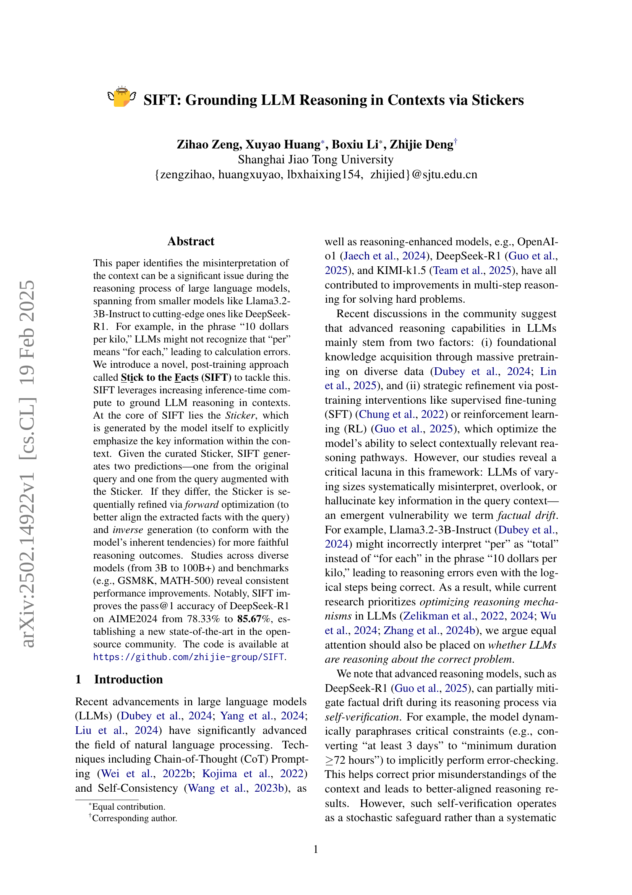
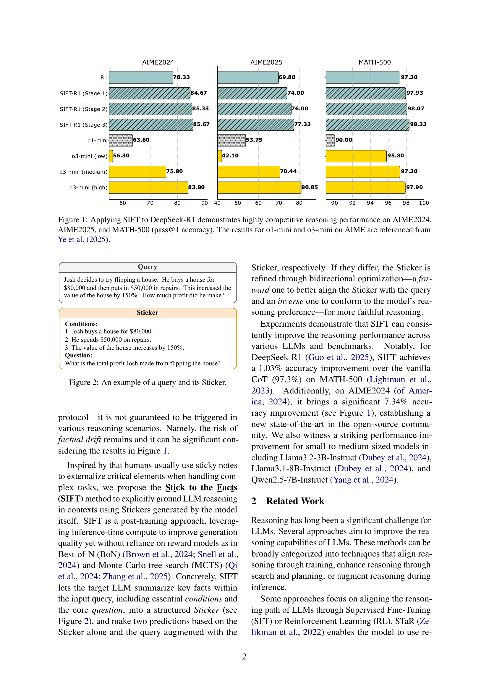
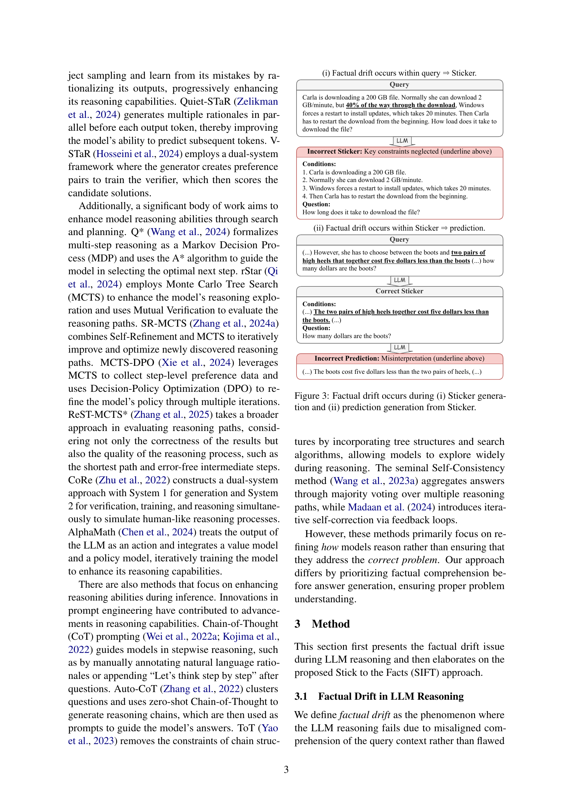
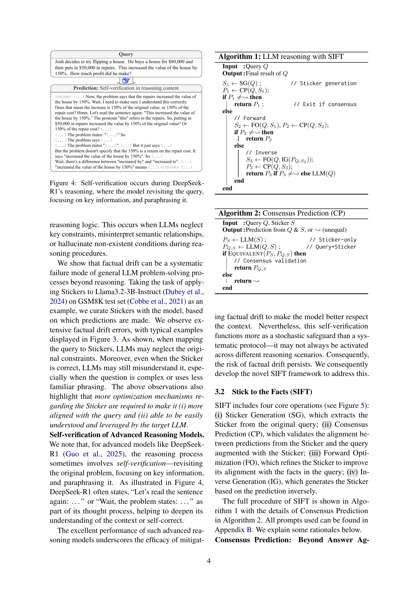
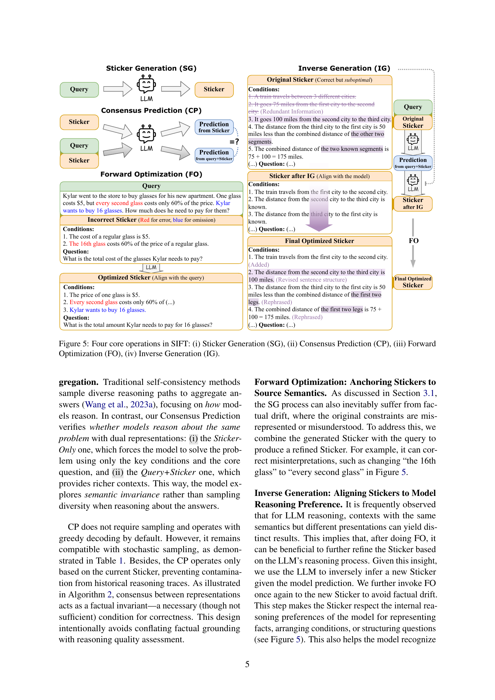
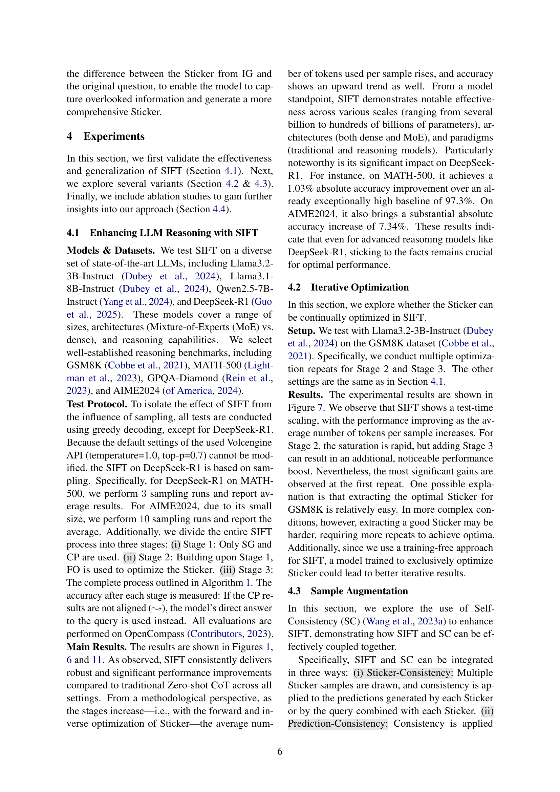
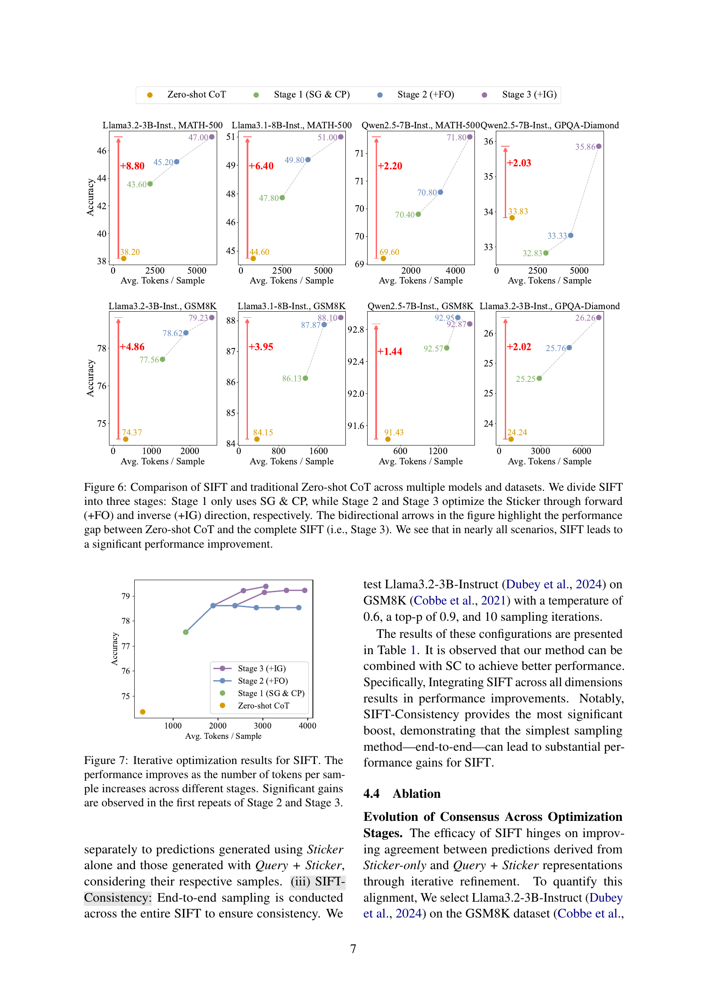
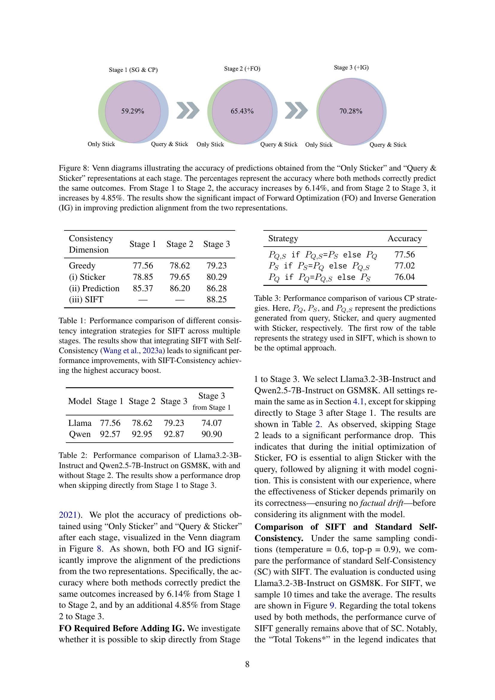
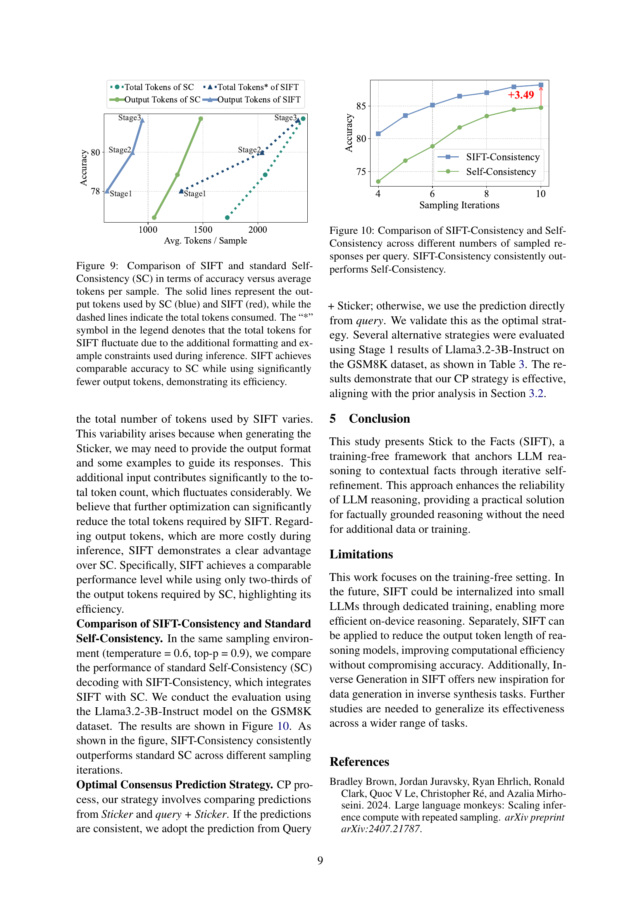
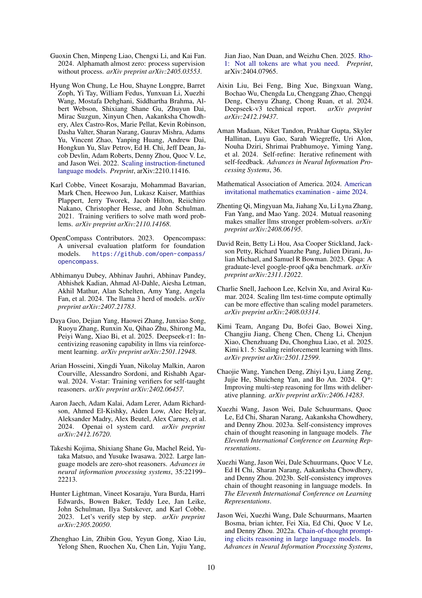
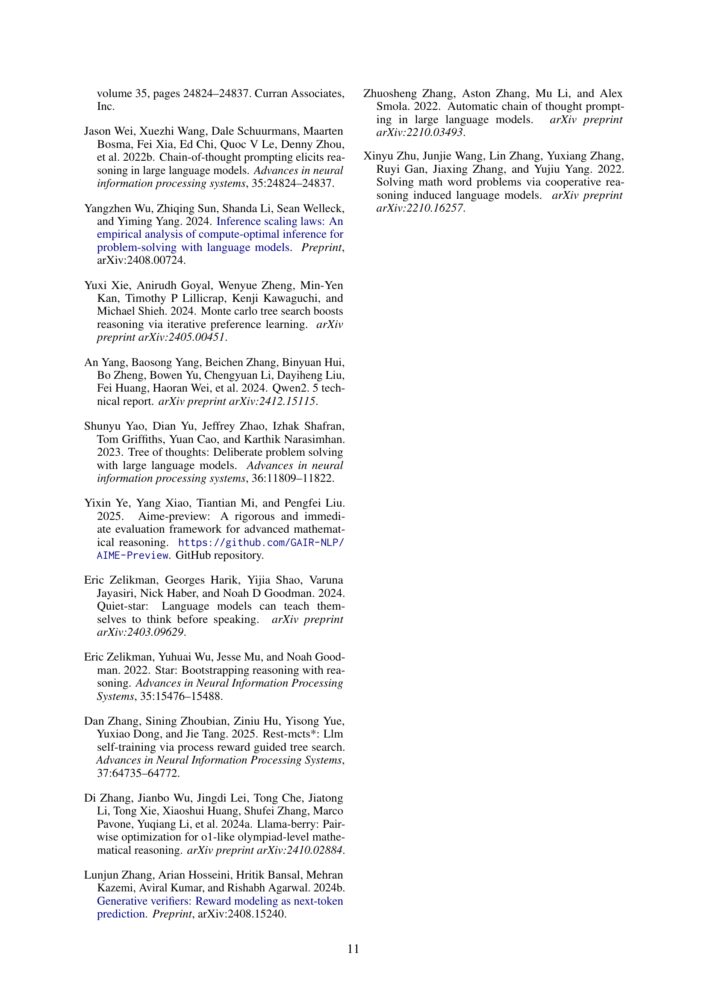
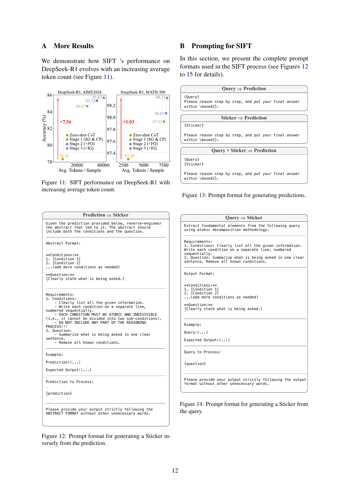
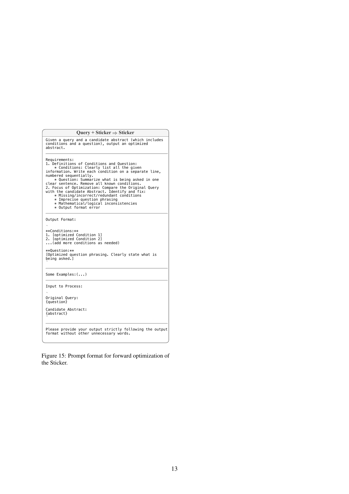
