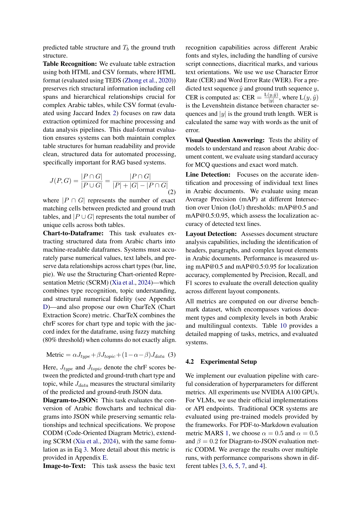

 


 2502.14949 
 Ahmed Heakl et el. 
 
 🤗 2025-02-24 
 



↗ arXiv


↗ Hugging Face


↗ Papers with Code


### TL;DR



아랍어는 특유의 필기체, 오른쪽에서 왼쪽으로 쓰는 방향, 복잡한 서체 등으로 인해 영어나 다른 언어에 비해 **OCR 기술 개발이 어려운 분야**입니다. 기존 아랍어 OCR 데이터셋은 크기가 작거나 특정 유형의 문서에만 집중되어 있어, **다양한 아랍어 문서 유형을 포괄하는 포괄적인 벤치마크가 필요**했습니다. 또한, 기존 평가 시스템은 **문서 이해 과제를 충분히 다루지 못해** 아랍어 OCR 모델의 실제 성능을 정확하게 평가하기 어려웠습니다.

본 연구는 이러한 문제를 해결하기 위해 **KITAB-Bench**라는 새로운 벤치마크를 제시합니다. KITAB-Bench는 **다양한 유형의 아랍어 문서 8,809개를 포함**하며, **9개의 주요 도메인과 36개의 하위 도메인**으로 구성되어 있습니다. 또한, 기존 OCR 방식보다 성능이 평균 60% 향상된 최신 비전-언어 모델의 성과를 보여주는 등 **다양한 평가 지표**를 제공하여 **아랍어 OCR 모델의 성능을 정확하게 평가**하고 **향후 연구를 위한 표준 프레임워크**를 제공합니다. 특히, PDF를 Markdown으로 변환하는 과정에서 최고 모델의 정확도가 65%에 그친다는 점을 통해 아랍어 OCR 기술 개발의 어려움을 보여줍니다.



#### Key Takeaways


 KITAB-Bench는 아랍어 OCR 및 문서 이해를 위한 8,809개의 샘플을 포함하는 포괄적인 벤치마크를 제시합니다. 



 본 벤치마크는 기존 아랍어 OCR 모델의 한계를 강조하고, 차트 추출 및 다이어그램 추출을 위한 새로운 평가 지표를 제안합니다. 



 KITAB-Bench는 아랍어 문서 분석 방법 개선을 주도하고 영어 OCR 기술과의 성능 격차를 해소하는 엄격한 평가 프레임워크를 구축합니다. 


#### Why does it matter?
본 논문은 **아랍어 OCR 및 문서 이해 분야의 벤치마크 부족**이라는 중요한 문제를 해결합니다.  **KITAB-Bench**는 다양한 아랍어 문서 유형을 포괄하는 포괄적인 벤치마크를 제공하여 **향후 연구 및 모델 개발**을 위한 표준화된 프레임워크를 제시합니다. 이는 **아랍어 자연어 처리 기술 발전**에 크게 기여할 뿐만 아니라, **다국어 OCR 연구**에도 시사하는 바가 큽니다. 이를 통해 더욱 정확하고 효율적인 아랍어 문서 처리 시스템 개발이 가속화될 것으로 예상됩니다.

------
#### Visual Insights

> 🔼 그림 1은 KITAB-Bench의 핵심 도메인과 하위 도메인을 보여줍니다. 벤치마크는 OCR, 차트를 JSON으로 변환, 표 인식 등 9가지 주요 도메인과 스캔 텍스트, 필기 텍스트, 다양한 차트 유형 등 36개의 하위 도메인을 포함합니다. 현대 아랍어 문서 처리 및 분석을 위한 포괄적인 평가 프레임워크를 제공합니다. 그림은 아랍어 OCR 및 문서 이해를 위한 다양한 작업과 데이터 유형의 범위를 시각적으로 보여줍니다.
> 

> 
read the caption

> Figure 1: Overview of the core domains and sub-domains in KITAB-Bench. Our benchmark spans nine major domains (e.g., OCR, charts to JSON, table recognition) and 36 sub-domains (e.g., scanned text, handwritten text, various chart types), providing a comprehensive evaluation framework for modern Arabic document processing and analysis.
> 


| Domain/ | EXAMS-V∗ | Camel- | MIDAD† | KHATT | KITAB- | 
|---|---|---|---|---|---| 
| **Characteristics** |  | **Bench** |  |  | **Bench (Ours)** | 
| PDF to Markdown | ✗ | ✗ | ✗ | ✗ | ✓ | 
| Layout Detection | ✗ | ✗ | ✗ | ✗ | ✓ | 
| Line Detection | ✗ | ✗ | ✗ | ✗ | ✓ | 
| Line Recognition | ✗ | ✓ | ✗ | ✗ | ✓ | 
| Table Recognition | ✗ | ✗ | ✗ | ✗ | ✓ | 
| Image to Text | ✓ | ✓ | ✓ | ✓ | ✓ | 
| Charts to JSON | ✗ | ✗ | ✗ | ✗ | ✓ | 
| Diagram to Code | ✗ | ✗ | ✗ | ✗ | ✓ | 
| VQA | ✓ | ✓ | ✗ | ✗ | ✓ | 
| Handwritten Samples | ✗ | ✗ | ✓ | ✓ | ✓ | 
| Open Source | ✓ | ✓ | ✗ | ✓ | ✓ | 
| Total Samples (#) | 823 | 3,004 | 29,435 | 5,000 | 8,809 | 

> 🔼 표 1은 다양한 도메인에 걸쳐 아랍어 OCR 벤치마크를 비교한 표입니다. LaraBench(Abdelali et al., 2023), CamelBench(Ghaboura et al., 2024), MIDAD(Bhatia et al., 2024), KHATT(Mahmoud et al., 2014) 및 KITAB-Bench(본 연구)를 비교하여 아랍어 OCR의 성능을 다양한 측면에서 평가하고, 각 벤치마크의 데이터셋 크기, 지원하는 작업 유형, 아랍어 데이터 비율 등을 보여줍니다.  표에는 각 벤치마크의 강점과 약점을 파악하고, 본 연구의 KITAB-Bench가 기존 벤치마크보다 어떤 점에서 개선되었는지를 보여주는 정보가 포함되어 있습니다. 특히, 아랍어 데이터만 고려한 경우(*)와 데이터셋의 테스트셋만 고려한 경우(†)에 대한 정보도 제공합니다.
> 

> 
read the caption

> Table 1: Comparison of Arabic OCR Benchmarks Across Different Domains. Benchmarks compared: LaraBench Abdelali et al. (2023), CamelBench Ghaboura et al. (2024), MIDAD Bhatia et al. (2024), KHATT Mahmoud et al. (2014), and KITAB-Bench (Ours). (∗*∗: Only the Arabic samples are considered.) (††\dagger†: The test set of the dataset is considered.)
> 

### In-depth insights

#### Arabic OCR Gaps
아랍어 OCR 분야의 주요한 기술적 격차는 **아랍어 특유의 필기체**, **오른쪽에서 왼쪽으로 쓰는 방향**, 그리고 **다양한 서체와 서예적 특징**으로 인해 발생합니다.  기존의 영어 OCR 시스템은 이러한 아랍어의 고유한 특징들을 고려하지 않고 설계되었기 때문에, 아랍어 문서의 정확한 인식 및 처리에 어려움을 겪습니다. 이러한 어려움은 **데이터 부족**, **표준화된 벤치마크의 부재**, 그리고 **첨단 기술의 적용 부족**으로 이어집니다. **특히, PDF 변환, 표 인식, 그리고 차트 해석과 같은 고급 문서 이해 작업은 아직도 미흡한 수준**이며, 이는 아랍어 OCR 기술 발전을 위한 **중요한 과제**로 남아 있습니다. 따라서, **다양한 아랍어 문서 유형을 포괄하는 대규모 데이터셋 구축**, **엄격한 평가 기준을 갖춘 벤치마크 개발**, 그리고 **첨단 딥러닝 기술과 다국어 지원 모델의 적용**이 아랍어 OCR 기술 격차를 해소하고 성능 향상에 크게 기여할 것입니다.

#### KITAB-Bench Eval
KITAB-Bench 평가는 아랍어 OCR 및 문서 이해를 위한 **종합적이고 다양한 벤치마크**의 성능을 평가하는 데 중점을 둡니다. 이 평가는 **다양한 도메인과 하위 도메인에 걸쳐 8,809개의 샘플을 포함**하여 광범위한 아랍어 문서 유형의 포괄적인 컬렉션을 제공합니다. 이 평가는 레이아웃 감지, 다양한 형식의 인식, 구조화된 출력 생성과 같은 **다양한 문서 이해 과제를 평가**하기 위해 **엄격한 평가 프레임워크를 사용**합니다.  KITAB-Bench 평가는 기존의 아랍어 OCR 시스템과 최신 VLMs의 성능을 비교하여 **현재 아랍어 OCR 모델의 한계와 향상의 여지를 강조**합니다.  특히 PDF에서 Markdown으로의 변환과 같은 작업에서 제한 사항이 드러납니다.  **CharTeX 및 CODM과 같은 새로운 지표**를 제안하여 차트 및 다이어그램 추출의 평가를 개선합니다.  전반적으로 KITAB-Bench 평가는 아랍어 OCR 기술의 발전을 주도하고 영어 OCR 기술과의 성능 격차를 해소하기 위한 **엄격하고 포괄적인 평가 프레임워크**를 확립합니다.

#### LLM-Assisted Data
LLM 기반 데이터 증강 전략은 **대규모 고품질 데이터셋의 부족**이라는 아랍어 OCR 분야의 주요 과제를 해결하기 위한 혁신적인 접근 방식을 제시합니다. 이는 **인간의 개입과 LLM의 생성 능력을 결합**하여 다양한 유형의 아랍어 문서를 생성하고, 기존 데이터셋의 한계를 극복하는 데 효과적입니다. 특히 **5단계 파이프라인**을 통해 주제 생성, 데이터 생성, 코드 생성, 렌더링, 그리고 인간 평가라는 단계를 거쳐 정확도와 다양성을 확보합니다. 이러한 방식은 합성 데이터의 질을 높이고, 아랍어 OCR 시스템의 성능 평가에 필요한 **다양하고 풍부한 데이터**를 제공할 수 있습니다.  하지만 **LLM의 한계와 편향성**을 고려하여 데이터 품질 관리 및 검증 절차를 강화하는 것이 중요하며, **윤리적 고려사항** 또한 숙고되어야 할 것입니다.  **데이터의 다양성과 품질**이 향상된 아랍어 OCR 시스템의 발전에 중요한 역할을 할 것이라는 점을 감안하면 LLM 기반 데이터 증강은 매우 유망한 전략입니다.

#### Benchmark Results
본 논문의 벤치마크 결과 부분은 다양한 아랍어 OCR 시스템과 비전-언어 모델(VLMs)의 성능을 종합적으로 평가한 결과를 보여줍니다. **폐쇄형 모델(예: Gemini-2.0-Flash)**은 거의 모든 과제에서 **개방형 모델(예: Qwen2-VL)**보다 뛰어난 성능을 보였습니다. 특히, **표 인식 및 PDF-Markdown 변환**과 같은 복잡한 작업에서 그 차이가 두드러졌습니다. 그러나 **개방형 모델들 또한 특정 과제(예: VQA)**에서 폐쇄형 모델에 필적하는 성능을 보임으로써, 비용 효율적인 대안으로서의 가능성을 시사합니다. **전통적인 OCR 시스템**은 대부분의 과제에서 VLM에 비해 성능이 낮았지만, 특정 하위 작업(예: 레이아웃 감지)에서 경쟁력 있는 결과를 보여주었습니다. 이러한 결과는 아랍어 OCR 분야에서 VLMs의 잠재력을 강조하지만, 전통적인 방법과의 상호 보완적인 사용을 제안합니다. **벤치마크의 포괄적인 평가 틀**은 다양한 아랍어 문서 유형과 작업을 다루어, 실제 응용 프로그램의 성능을 더 정확하게 반영합니다.

#### Future Directions
본 논문의 "미래 방향"에 대한 심도있는 고찰은 아랍어 OCR 및 문서 이해 분야의 지속적인 발전을 위한 핵심 과제와 기회를 제시합니다. **아랍어 필기체의 복잡성, 다양한 서체, 이중 방향성 텍스트 흐름과 같은 고유한 문제점을 해결하기 위한 추가적인 연구 노력**이 필요합니다. 특히, **합성 데이터 생성 파이프라인의 개선을 통한 대규모 다중 모달 데이터셋 구축**은 견고하고 정확한 아랍어 OCR 시스템 개발에 필수적입니다. 또한, **최첨단 비전-언어 모델의 잠재력을 활용**하여 문서 레이아웃 분석, 표 인식, 다이어그램 해석과 같은 고급 문서 이해 작업을 개선하는 연구에 중점을 두어야 합니다. **표준화된 평가 프레임워크의 지속적인 발전**은 아랍어 OCR 시스템의 성능을 객관적으로 비교하고 향상시키는 데 중요한 역할을 합니다. 마지막으로, **다국어 OCR 시스템 개발**을 통해 영어 기반 기술과 아랍어 OCR 기술 간의 성능 격차를 해소하는 연구가 중요합니다. 이러한 미래 방향에 대한 집중적인 연구는 아랍어 문서 처리의 혁신을 가속화하고, 아랍어 정보 접근성을 높일 수 있을 것입니다.

### More visual insights

More on figures

> 🔼 본 그림(그림 2)은 논문에서 제시된 벤치마크에 포함된 다양한 작업들을 개괄적으로 보여줍니다.  표 인식, 차트 이해, 텍스트 인식, 다이어그램 분석, VQA, 선 검출, 레이아웃 분석, PDF-Markdown 변환 등 여덟 가지 주요 구성 요소가 각 작업의 입력과 출력 예시와 함께 자세히 설명되어 있습니다. 각 작업에 대한 입력 및 출력 데이터 예시가 포함되어 있어, 벤치마크의 범위와 복잡성을 더 잘 이해하는 데 도움을 줍니다.
> 

> 
read the caption

> Figure 2: Overview of different tasks in our benchmark: Eight key components illustrating the task inputs and outputs for table recognition, chart understanding, text recognition, diagram analysis, VQA, line detection, layout analysis, and PDF-to-Markdown conversion, complete with input/output examples for each task.
> 

> 🔼 그림 3은 표 인식, 이미지에서 텍스트 추출, 다이어그램 JSON 변환, 레이아웃 감지 등 네 가지 문서 이해 작업에 대한 다양한 모델(Ground Truth, EasyOCR, GPT-4, Qwen, Surya, Tesseract, Yolo, DETR 포함)의 성능을 아랍어 문서 벤치마크 데이터를 사용하여 성공 및 실패 사례와 함께 비교한 것입니다.  각 모델의 강점과 약점을 보여주는 성공적인 예와 실패적인 예가 함께 제시되어 아랍어 문서 처리의 어려움을 더 잘 이해하는 데 도움을 줍니다.
> 

> 
read the caption

> Figure 3: Comparison of model performance across four document understanding tasks (Table Recognition, Image to Text, Diagram to JSON, and Layout Detection) showing successful and failed cases for different models including Ground Truth, EasyOCR, GPT-4, Qwen, Surya, Tesseract, Yolo, and DETR on Arabic document benchmark data.
> 

> 🔼 본 그림은 논문의 합성 데이터 생성 파이프라인을 보여줍니다. 이 파이프라인은 5단계로 구성되며, 각 단계는 대규모 언어 모델(LLM)을 사용하여 주제를 생성하고, 원시 데이터를 만들고, 시각화 코드를 생성하고, 차트와 다이어그램을 렌더링하고, 품질 관리를 위해 사람의 평가를 수행합니다. 각 단계의 세부적인 과정과 LLM의 역할을 자세히 설명하면, 주제 생성 단계에서는 LLM이 여러 도메인에 걸쳐 다양한 주제 이름을 생성하고, 데이터 생성 단계에서는 검증된 주제를 기반으로 구조화된 원시 데이터를 생성하며, 코드 생성 단계에서는 검증된 원시 데이터를 플로팅 코드로 변환하고, 이미지 렌더링 단계에서는 전문적인 렌더링 엔진을 사용하여 시각적 표현을 생성하고, 마지막으로 사람의 평가를 통해 품질 관리를 수행합니다.
> 

> 
read the caption

> Figure 4: Synthetic Data Generation Pipeline: A 5-stage process using LLMs to generate topics, create raw data, produce visualization code, render charts, and perform human evaluation for quality control.
> 

> 🔼 그림 5는 논문에서 다루는 다양한 작업 범주에 대한 프롬프트들을 보여줍니다. 각 프롬프트는 특정 작업(차트 유형 예측, PDF를 마크다운으로 변환, OCR, 다이어그램 유형 예측, 차트 토픽 파악, 차트 데이터 추출, 다이어그램 데이터 추출, 표 HTML 형식으로 변환, 표 데이터프레임 형식으로 변환)에 대한 구체적인 지침과 예시들을 포함하고 있습니다. 이 프롬프트들은 대규모 언어 모델(LLM)이 각 작업을 수행하는 방법을 안내하는 역할을 하며, 모델의 성능 평가와 분석에 중요한 부분을 차지합니다.  각 프롬프트는 입력 데이터의 형식과 예상되는 출력 형식을 명확히 제시하여 LLM이 작업을 정확하게 수행하도록 유도합니다. 특히, 차트와 다이어그램 관련 프롬프트는 데이터의 구조와 의미를 정확히 파악하고, 출력 형식을 지정함으로써 LLM이 데이터를 효율적으로 처리하고 분석할 수 있도록 돕습니다.
> 

> 
read the caption

> Figure 5: Prompts for Different Task Categories.
> 

> 🔼 그림 6은 논문의 실험 설정 부분에 있는 그림으로, 다양한 유형의 다이어그램과 표에 대한 프롬프트(지시문)들을 보여줍니다.  각 프롬프트는 특정 유형의 다이어그램이나 표의 데이터를 추출하고, JSON이나 HTML, CSV와 같은 특정 형식으로 출력하도록 모델에게 지시하는 역할을 합니다.  이는 모델이 다양한 형식의 데이터를 처리하고, 구조화된 출력을 생성하는 능력을 평가하기 위한 실험 설계의 일부입니다.  예시로는, 플로우차트, 트리맵, 클래스 다이어그램의 데이터 추출을 위한 프롬프트와, 표 데이터를 HTML과 CSV 형식으로 변환하는 프롬프트 등이 포함되어 있습니다.
> 

> 
read the caption

> Figure 6: Prompts for Diagrams and Tables.
> 

More on tables


| Domain | Total Samples |
|---|---| 
| PDF to Markdown | 33 |
| Layout | 2,100 |
| Line Detection | 378 |
| Line Recognition | 378 |
| Table Recognition | 456 |
| Image to Text | 3,760 |
| Charts to DataFrame | 576 |
| Diagram to Json | 226 |
| VQA | 902 |
| **Total** | **8,809** |
> 🔼 표 2는 논문의 데이터셋에 있는 서로 다른 도메인에 걸쳐 분포된 표본의 수를 보여줍니다.  표에는 도메인별 표본 수가 요약되어 있으며, 보다 자세한 하위 도메인 및 데이터 소스 정보는 부록 A에서 확인할 수 있습니다.  이 표는 데이터셋의 규모와 다양성을 파악하는 데 도움을 주며, 각 도메인에 대한 표본 수의 균형을 평가하는 데 유용합니다.
> 

> 
read the caption

> Table 2: Distribution of samples across different domains in our dataset. A more detailed count for different sub-domains and data sources is in Appendix A.
> 


| Task | Metric | Surya | Tesseract | EasyOCR |
|---|---|---|---|---|
| Detection | mAP@50 | 79.67 | 46.39 | 68.02 |
|  | mAP@0.5:0.95 | 27.40 | 14.30 | **32.74** |
| Recognition | WER | 1.01 | 1.00 | **0.53** |
|  | CER | 0.87 | 0.66 | **0.20** |
> 🔼 본 표는 논문의 벤치마크에서 라인 검출 및 라인 인식 작업에 대한 다양한 모델의 성능을 보여줍니다.  특히, KITAB-Bench 벤치마크 데이터셋을 사용하여 Surya, Tesseract, EasyOCR 세 가지 모델의 평가 결과(mAP@50, mAP@0.5:0.95, WER, CER)를 제시합니다. 이를 통해 각 모델의 라인 검출 및 인식 정확도를 비교 분석하여 성능 차이를 명확히 보여줍니다.
> 

> 
read the caption

> Table 3: Performance of different models on Line Detection and Line Recognition Task on our Benchmark
> 


| Dataset | Metric | Surya | Yolo-doc-laynet | Detr |
|---|---|---|---|---|
|  |  |  | **laynet** | **(docling)** |
| BCE | mAP@0.5 | 0.506 | 0.470 | **0.750** |
|  | mAP@0.5:0.95 | 0.381 | 0.369 | **0.566** |
|  | Precision | **0.751** | 0.608 | 0.626 |
|  | Recall | 0.593 | 0.592 | **0.725** |
|  | F1 Score | 0.635 | 0.585 | **0.654** |
| DocLayNet | mAP@0.5 | 0.675 | 0.404 | **0.758** |
|  | mAP@0.5:0.95 | 0.469 | 0.335 | **0.541** |
|  | Precision | **0.782** | 0.527 | 0.635 |
|  | Recall | 0.856 | 0.503 | **0.770** |
|  | F1 Score | 0.799 | 0.499 | **0.670** |
> 🔼 표 4는 서로 다른 평가 지표를 사용하여 레이아웃 감지 모델의 성능을 비교한 결과를 보여줍니다.  다양한 레이아웃 감지 모델들의 mAP@0.5, mAP@0.5:0.95, 정밀도, 재현율, F1 점수를 BCE 및 DocLayNet 데이터셋에서 비교 분석하여 각 모델의 강점과 약점을 파악하는 데 도움이 됩니다.  BCE 데이터셋은 아랍어 문서에 특화되어 있으며, DocLayNet 데이터셋은 영어 문서를 포함합니다.
> 

> 
read the caption

> Table 4: Performance comparison of layout detection models using different evaluation metrics
> 


| Model Group | Models | TEDS (HTML) | Jaccard (CSV) | CHrF (Text) | TEDS (Table) | MARS |
|---|---|---|---|---|---|---|
| Closed | GPT-4o | **85.76** | **66.36** | 69.62 | **60.61** | 65.12 |
|  | GPT-4o-mini | 69.32 | 49.50 | 56.59 | 52.69 | 54.64 |
|  | Gemini-2.0-Flash | 83.08 | 65.55 | **75.75** | **65.65** |  |
| Open | Qwen2-VL-7B | 57.83 | 40.20 | 40.30 | 2.54 | 21.42 |
|  | Qwen2.5-VL-7B | 59.31 | 59.58 | 69.21 | 11.65 | 40.43 |
|  | AIN-7B | 75.94 | 64.83 | 56.52 | 49.32 | 52.92 |
| Framework | Tesseract | 28.23D 38.64I | 14.85D 16.04I | 59.91D | 45.44D | 52.68D |
|  | EasyOCR | 49.10D 39.09I | 23.83D 17.88I | 57.46D | 51.12D | 54.29D |
|  | Surya | 50.15M | 70.42M | 58.38M | 44.29M | 51.34M |
|  |  |  |  |  |  |  |
| DDocling [Auer et al. (2024)](https://arxiv.org/html/2502.14949/bib.bib4) pipeline IImg2Table [Cattan (2021)](https://arxiv.org/html/2502.14949/bib.bib9) pipeline MMarker [Paruchuri (2024a)](https://arxiv.org/html/2502.14949/bib.bib36) pipeline |  |  |  |  |  |  |
> 🔼 표 5는 제시된 벤치마크에서 표 추출 및 PDF에서 마크다운으로의 종단간 변환 작업에 대한 다양한 모델의 성능 비교를 보여줍니다. 이 표는 다양한 모델(GPT-40, Gemini-2.0-Flash, Qwen2-VL-7B 등)의 TEDS (HTML), Jaccard (CSV), CHrF (텍스트), TEDS (표), MARS 지표를 비교하여 종합적인 성능 평가를 제공합니다.  각 모델의 장단점을 비롯하여 각 모델의 세부적인 성능 수치가 제시되어 있으며, 이를 통해 각 모델의 적합성을 평가할 수 있습니다.
> 

> 
read the caption

> Table 5: Performance comparison of different models for table extraction and end-to-end PDF to markdown conversion tasks on our benchmark.
> 


| Group | Models | CHrF ↑ | CER ↓ | WER ↓ |
|---|---|---|---|---|
| Closed | GPT-4o | 61.01 | 0.31 | 0.55 |
|  | GPT-4o-mini | 47.21 | 0.43 | 0.71 |
|  | Gemini-2.0-Flash | 77.95 | 0.13 | 0.32 |
| Open | Qwen2VL-7B | 33.94 | 1.48 | 1.55 |
|  | Qwen2.5VL-7B | 49.23 | 1.20 | 1.41 |
|  | AIN-7B | 78.33 | 0.20 | 0.28 |
| Framework | Tesseract | 39.62 | 0.54 | 0.84 |
|  | EasyOCR | 45.47 | 0.58 | 0.89 |
|  | Paddle | 16.73 | 0.79 | 1.02 |
|  | Surya | 20.61 | 4.95 | 5.61 |
> 🔼 표 6은 제시된 벤치마크에서 이미지를 텍스트로 변환하는 작업에 대한 다양한 모델의 성능을 비교한 것입니다.  표에는 GPT-4, Gemini, Qwen과 같은 대규모 언어 모델과 Tesseract, EasyOCR과 같은 기존 OCR 시스템의 성능이 CER(Character Error Rate) 및 WER(Word Error Rate)을 사용하여 제시되어 있습니다. 자세한 내용은 부록 B에 있는 다양한 오픈 소스 데이터 세트 간의 성능 비교를 참고하시기 바랍니다.
> 

> 
read the caption

> Table 6: Performance comparison of models for OCR (image to text) tasks on our benchmark. A detailed performance comparison among different open-source dataset is available in Appendix B
> 


| Group | Model | Chart SCRM | Chart CharTeX | Diagram CODM | Visual QA MTVQAO | Visual QA ChartsVQAM | Visual QA DiagramsVQAM | Visual QA PATDVQAM | Visual QA Average |
|---|---|---|---|---|---|---|---|---|---|
| Closed | GPT-4o | 68.6 | 45.95 | 61.6 | 32.00 | 77.00 | 85.29 | 82.50 | 69.19 |
|  | GPT-4o-mini | 67.2 | 43.33 | 61.4 | 26.80 | 58.00 | 83.33 | 80.00 | 62.03 |
|  | Gemini-2.0-Flash | **71.4** | **56.28** | **71.8** | **35.00** | 72.00 | **88.24** | 75.50 | 67.68 |
| Open | Qwen2-VL-7B | 56.6 | 21.59 | 63.0 | 19.60 | 59.00 | 82.35 | 77.50 | 59.61 |
|  | Qwen2.5-VL-7B | 36.2 | 22.08 | 59.2 | 23.00 | 74.00 | 79.41 | 74.50 | 62.72 |
|  | AIN-7B | 66.6 | 34.61 | 66.40 | 31.50 | 75.00 | 85.29 | **87.00** | **69.69** |
> 🔼 표 7은 다양한 모델이 차트 이해, 다이어그램 파싱 및 시각적 질문 답변 작업에서 보여주는 성능을 보여줍니다.  VQA 작업의 경우, O는 MTVQA Tang et al.(2024) 데이터셋의 개방형 질문 유형을 나타내고, M은 객관식 질문 유형을 나타냅니다.  각 모델의 성능은 SCRM(차트), CharTeX(차트), CODM(다이어그램), MTVQA, ChartsVQA, DiagramsVQA, PATDVQA 지표를 사용하여 측정됩니다.  표는 폐쇄형 및 개방형 대규모 언어 모델, 전통적인 OCR 시스템의 성능을 비교합니다.
> 

> 
read the caption

> Table 7: Model Performance on Chart Understanding, Diagram Parsing, and Visual Question Answering Tasks. For VQA tasks, O𝑂Oitalic_O denotes open-ended question type from MTVQA Tang et al. (2024) dataset and M𝑀Mitalic_M denotes MCQ type questions.
> 


| Domain | Sub-Domain | Dataset Source | Original | Selected | Total |
|---|---|---|---|---|---| 
| PDF to Markdown | General | Manual | 33 | 33 | 33 |
| Layout Detection | Docs | BCE-Arabic-v1 [Saad et al. (2016)](https://arxiv.org/html/2502.14949/bib.bib42.png) | 1.9k | 1,700 | 2,100 |
|  |  | DocLayNet [Pfitzmann et al. (2022)](https://arxiv.org/html/2502.14949/bib.bib39.png) | 80k | 400 |  |
| Line Detection | Docs | Manual | 375 | 378 | 378 |
| Line Recognition | Docs | Manual | 375 | 378 | 378 |
| Table Recognition | Financial | Pixmo [Deitke et al. (2024)](https://arxiv.org/html/2502.14949/bib.bib11.png) | 490 | 456 | 456 |
| Image to Text | Synthetic | PATS [El-Muhtaseb (2010)](https://arxiv.org/html/2502.14949/bib.bib14.png) | 21.6k | 500 | 3,760 |
|  |  | SythenAR | 39.1k | 500 |  |
|  | Historical | HistoryAr [Pantke et al. (2014)](https://arxiv.org/html/2502.14949/bib.bib35.png) | 1.5k | 200 |  |
|  |  | HistoricalBooks | 40 | 10 |  |
|  | Hand. Paragraph | Khatt [Mahmoud et al. (2014)](https://arxiv.org/html/2502.14949/bib.bib30.png) | 2.72k | 200 |  |
|  | Hand. Word | ADAB [Boubaker et al. (2021)](https://arxiv.org/html/2502.14949/bib.bib7.png) | 15k | 200 |  |
|  | Hand. Line | Muharaf [Saeed et al. (2024)](https://arxiv.org/html/2502.14949/bib.bib43.png) | 24.5k | 200 |  |
|  |  | OnlineKhatt [Mahmoud et al. (2018)](https://arxiv.org/html/2502.14949/bib.bib31.png) | 8.5k | 200 |  |
|  |  | Khatt [Mahmoud et al. (2014)](https://arxiv.org/html/2502.14949/bib.bib30.png) | 13.4k | 200 |  |
|  | PPT | ISI-PPT [Wu and Natarajan (2017)](https://arxiv.org/html/2502.14949/bib.bib55.png) | 86.5k | 500 |  |
|  | Blogs | ArabicOCR | 20.3k | 50 |  |
|  |  | Hindawi [Elfilali (2023)](https://arxiv.org/html/2502.14949/bib.bib15.png) | 79k | 200 |  |
|  | Scene | EvAREST [Hassan et al. (2021)](https://arxiv.org/html/2502.14949/bib.bib20.png) | 5.59k | 800 |  |
| Charts to DataFrame | Bar | Synthetic | 100 | 61 | 576 |
|  | Line | Synthetic | 100 | 43 |  |
|  | Pie | Synthetic | 100 | 56 |  |
|  | Box | Synthetic | 100 | 31 |  |
|  | Violin | Synthetic | 100 | 36 |  |
|  | Area | Synthetic | 50 | 29 |  |
|  | SunBurst | Synthetic | 30 | 15 |  |
|  | Dot | Synthetic | 30 | 15 |  |
|  | Dual Axis | Synthetic | 20 | 26 |  |
|  | Density Curve | Synthetic | 10 | 5 |  |
|  | Bubble | Synthetic | 20 | 13 |  |
|  | Grouped Bar | Synthetic | 50 | 60 |  |
|  | Stacked Bar | Synthetic | 50 | 82 |  |
|  | Histogram | Synthetic | 100 | 70 |  |
|  | HeatMap | Synthetic | 10 | 11 |  |
|  | Scatter | Synthetic | 100 | 23 |  |
| Diagram to Json | Sequence | Synthetic | 50 | 46 | 226 |
|  | Funnel | Synthetic | 20 | 52 |  |
|  | Class | Synthetic | 20 | 30 |  |
|  | Network | Synthetic | 20 | 18 |  |
|  | Venn | Synthetic | 20 | 7 |  |
|  | FlowChart | Synthetic | 100 | 112 |  |
|  | TreeMap | Synthetic | 100 | 157 |  |
| VQA | Diagrams | Manual | 102 | 102 | 902 |
|  | Charts | Manual | 105 | 100 |  |
|  | News Letter | PATD [Bouressace and Csirik (2019)](https://arxiv.org/html/2502.14949/bib.bib8.png) | 2.42k | 200 |  |
|  | Scene | MTVQA | 818 | 500 |  |
| Total Dataset Size |  |  | – |  | 8,809 |
> 🔼 표 8은 논문의 데이터셋 분포를 보여줍니다.  도메인(예: OCR, 차트에서 JSON으로 변환, 표 인식), 하위 도메인(예: 스캔된 텍스트, 필기 텍스트, 다양한 차트 유형), 그리고 데이터 소스(예: 기존 데이터셋, 수동 주석이 달린 PDF, 합성 데이터)별로 데이터 샘플의 수를 보여줍니다. 이 표는 각 작업에 사용된 데이터의 유형과 양을 이해하는 데 도움이 됩니다. KITAB-Bench 벤치마크의 포괄적인 성격을 보여주는 상세한 분포를 제공합니다.
> 

> 
read the caption

> Table 8: Dataset Distribution Across Different Domains, sub-domains and Data Source
> 


| Dataset | Size | GPT-4o CER | GPT-4o WER | GPT-4o-mini CER | GPT-4o-mini WER | Gemini-2.0-Flash CER | Gemini-2.0-Flash WER | Qwen2-VL CER | Qwen2-VL WER |
|---|---|---|---|---|---|---|---|---|---| 
| PATS | 500 | 0.23 | 0.30 | 0.53 | 0.71 | 0.01 | 0.02 | 1.02 | 1.02 |
| SythenAR | 500 | 0.09 | 0.20 | 0.14 | 0.32 | 0.07 | 0.17 | 0.59 | 1.13 |
| HistoryAr | 200 | 0.51 | 0.82 | 0.67 | 0.96 | 0.28 | 0.64 | 3.46 | 2.86 |
| HistoricalBooks | 10 | 0.41 | 0.76 | 0.59 | 0.88 | 0.05 | 0.22 | 1.90 | 2.16 |
| Khatt | 200 | 0.45 | 0.74 | 0.64 | 0.91 | 0.19 | 0.45 | 1.12 | 5.04 |
| Adab | 200 | 0.30 | 0.73 | 0.35 | 0.83 | 0.19 | 0.56 | 0.63 | 1.08 |
| Muharaf | 200 | 0.56 | 0.90 | 0.63 | 0.94 | 0.33 | 0.69 | 3.57 | 2.87 |
| OnlineKhatt | 200 | 0.29 | 0.63 | 0.41 | 0.76 | 0.17 | 0.44 | 1.30 | 2.01 |
| ISI-PPT | 500 | 0.08 | 0.18 | 0.15 | 0.31 | 0.06 | 0.15 | 1.03 | 1.06 |
| ArabicOCR | 50 | 0.06 | 0.26 | 0.16 | 0.46 | 0.00 | 0.02 | 1.25 | 1.50 |
| Hindawi | 200 | 0.34 | 0.56 | 0.48 | 0.71 | 0.01 | 0.04 | 1.82 | 2.05 |
| EvArest | 800 | 0.20 | 0.38 | 0.25 | 0.51 | 0.18 | 0.36 | 0.41 | 0.95 |
| **Total** | 3,760 | 0.31 | 0.55 | 0.43 | 0.71 | 0.13 | 0.32 | 1.48 | 1.20 |
> 🔼 표 9는 KITAB-Bench라는 아랍어 OCR 벤치마크에서 다양한 대규모 비전-언어 모델(VLMs)의 성능을 비교한 표입니다.  '낮을수록 좋음'을 나타내는 지표인 문자 오류율(CER)과 단어 오류율(WER)을 사용하여 VLMs의 아랍어 텍스트 인식 능력을 평가하고 있습니다.  표에는 다양한 데이터셋의 크기와 각 모델의 CER 및 WER 값이 제시되어 있어,  모델별 성능 차이와 데이터셋 유형에 따른 성능 변화를 분석할 수 있습니다.  특히,  합성 데이터셋과 실제 데이터셋에서의 성능 차이를 비교함으로써, 모델의 일반화 능력을 평가하는 데 유용한 정보를 제공합니다.
> 

> 
read the caption

> Table 9: Performance comparison of Large Vision-Language Models on KITAB-Bench (lower is better).
> 


| Dataset | Size | Qwen2.5-VL CER | Qwen2.5-VL WER | AIN CER | AIN WER | Tesseract CER | Tesseract WER | Surya CER | Surya WER |
|---|---|---|---|---|---|---|---|---|---| 
| PATS | 500 | 0.26 | 0.36 | 0.00 | 0.00 | 0.14 | 0.28 | 4.66 | 4.67 |
| SythenAR | 500 | 0.21 | 0.40 | 0.04 | 0.16 | 0.31 | 0.72 | 4.82 | 7.90 |
| HistoryAr | 200 | 0.47 | 0.83 | 0.26 | 0.54 | 0.72 | 1.26 | 10.32 | 12.78 |
| HistoricalBooks | 10 | 0.33 | 0.72 | 0.84 | 0.88 | 0.74 | 0.99 | 6.81 | 6.30 |
| Khatt | 200 | 0.07 | 0.22 | 0.61 | 1.12 | 0.67 | 1.06 | 4.25 | 3.77 |
| Adab | 200 | 0.00 | 0.01 | 1.00 | 1.00 | 1.00 | 1.14 | 7.28 | 8.71 |
| Muharaf | 200 | 0.61 | 0.96 | 0.38 | 0.54 | 0.77 | 1.22 | 6.19 | 7.48 |
| OnlineKhatt | 200 | 0.36 | 0.70 | 0.03 | 0.12 | 0.59 | 1.20 | 6.71 | 6.95 |
| ISI-PPT | 500 | 0.36 | 0.54 | 0.52 | 0.53 | 0.31 | 0.64 | 4.25 | 3.77 |
| ArabicOCR | 50 | 1.00 | 1.00 | 0.01 | 0.01 | 0.01 | 0.01 | 2.75 | 3.58 |
| Hindawi | 200 | 1.00 | 1.00 | 0.11 | 0.15 | 0.31 | 0.72 | 0.15 | 0.20 |
| EvArest | 800 | 0.19 | 0.36 | 0.30 | 0.32 | 0.85 | 1.02 | 5.91 | 3.86 |
|  | 3,760 | 0.28 | 0.54 | 0.20 | 0.58 | 0.89 | 0.79 | 4.95 | 5.61 |
> 🔼 표 10은 문서 이해 작업에 대한 종합적인 평가 지표와 모델을 보여줍니다. 이 표는 문서 이해, 표 이해, 시각적 이해 작업의 세 가지 주요 범주로 구성됩니다. 각 작업은 특정 지표를 사용하여 평가되며 다양한 모델과 OCR 시스템에서 구현됩니다.  각 범주에는 여러 하위 작업이 포함되며(예: 문서 이해에는 PDF-Markdown 변환, 레이아웃 탐지, 라인 탐지 등이 포함됨), 각 하위 작업에는 해당 평가 지표가 있습니다. 이 표는 연구에서 사용된 다양한 모델과 시스템의 성능을 비교 분석하는 데 유용합니다.
> 

> 
read the caption

> Table 10: Comprehensive evaluation metrics and models for document understanding tasks. The table is organized into three main categories: document understanding, table understanding, and visual understanding tasks. Each task is evaluated using specific metrics and implemented across various models and OCR systems.
> 

### Full paper



