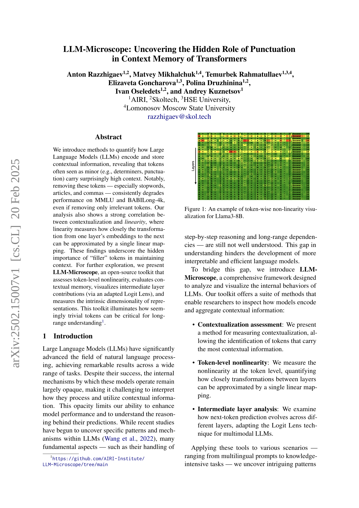
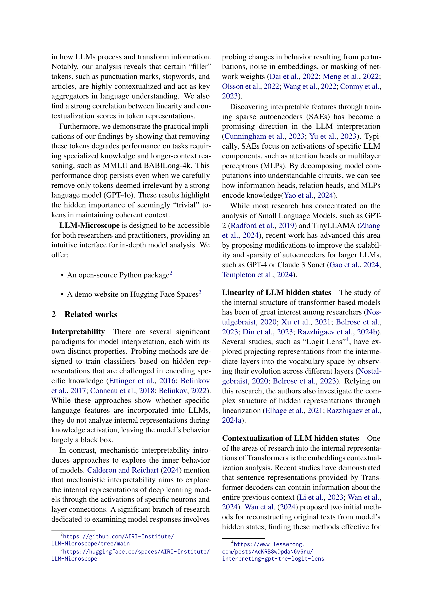
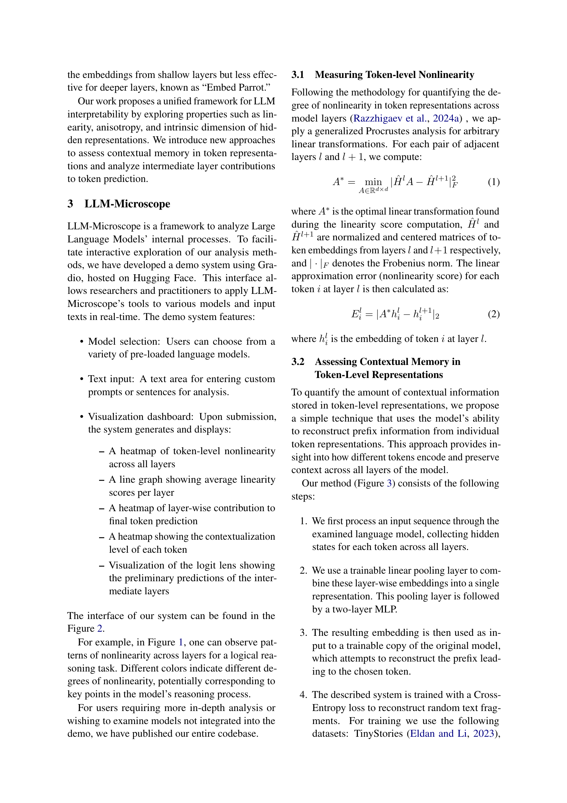
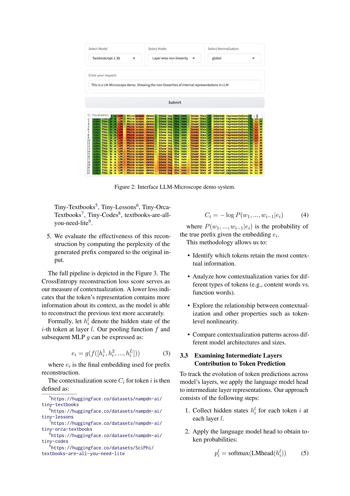
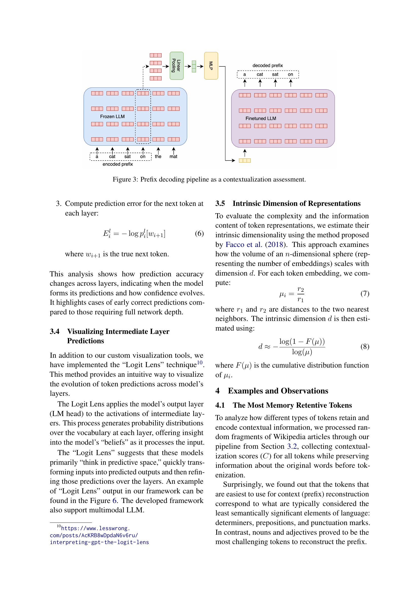
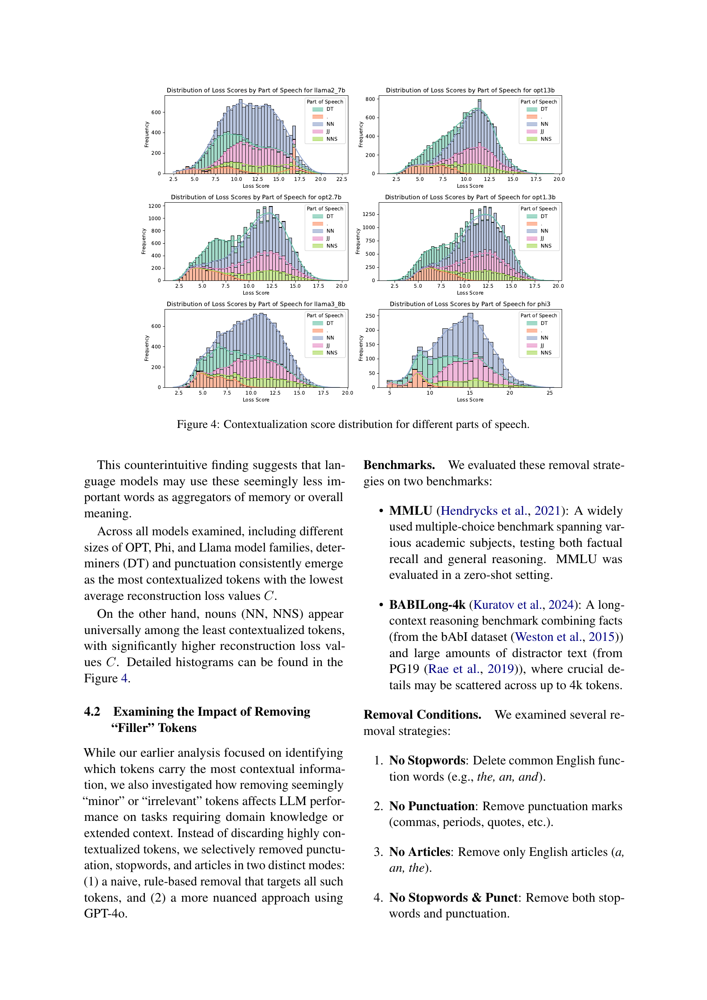
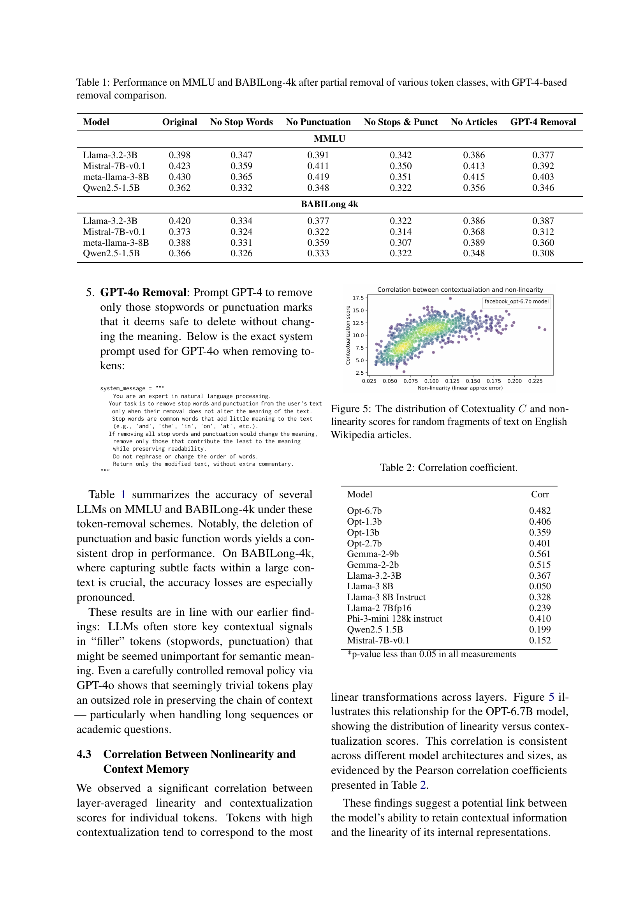
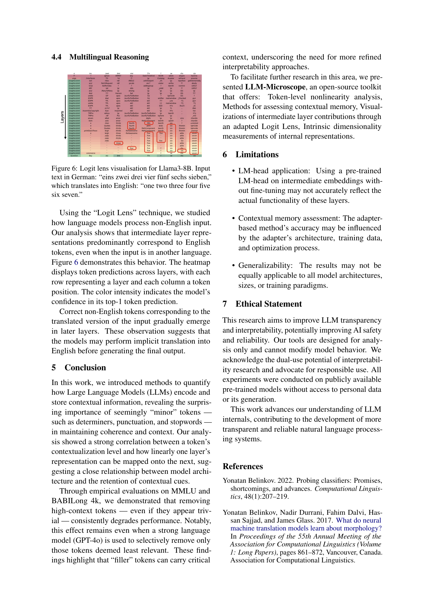
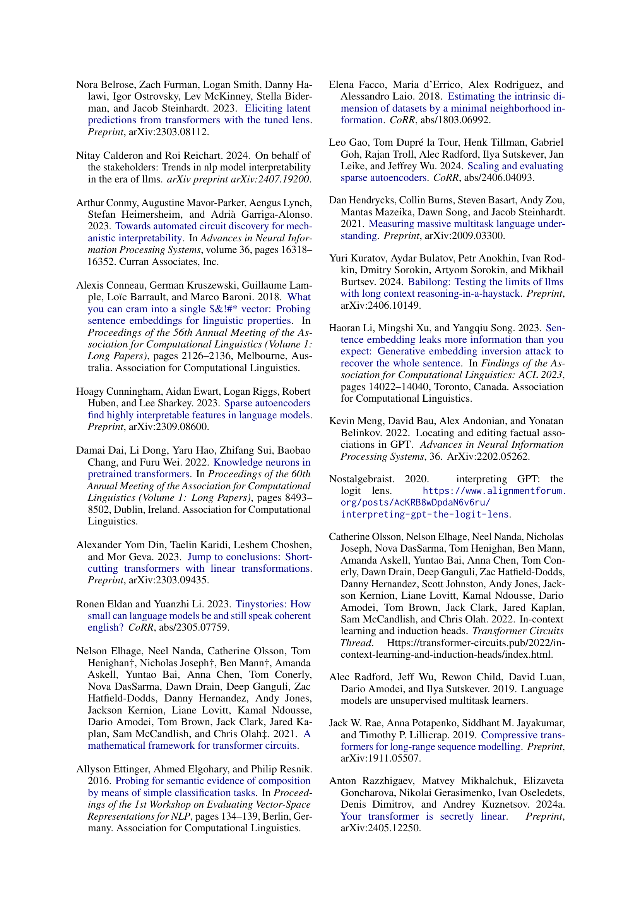
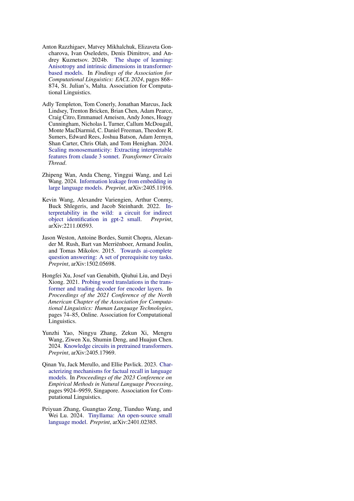

 


 2502.15007 
 Anton Razzhigaev et el. 
 
 🤗 2025-02-24 
 



↗ arXiv


↗ Hugging Face


### TL;DR



대규모 언어 모델(LLM)은 자연어 처리 분야에서 괄목할 만한 성과를 거두었지만, 그 내부 작동 방식은 여전히 불투명합니다. 특히, **토큰(단어, 구두점 등)이 문맥 정보를 어떻게 인코딩하고 저장하는지**에 대한 이해는 부족한 실정입니다. 이러한 이해 부족은 LLM의 성능 개선 및 한계 극복에 어려움을 초래합니다.

본 논문에서는 LLM이 문맥 정보를 어떻게 처리하는지 정량적으로 분석하기 위한 새로운 방법론을 제시합니다. **LLM-Microscope이라는 오픈소스 도구**를 통해 토큰 수준의 비선형성, 문맥 기억, 중간층의 기여도 등을 평가하고 시각화하여 LLM의 내부 동작을 자세히 분석할 수 있습니다. 연구 결과, **구두점이나 관사와 같은 작은 토큰이 문맥 정보 유지에 중요한 역할**을 하며, 이러한 토큰을 제거하면 LLM의 성능이 저하된다는 것을 밝혔습니다. 이는 LLM의 해석성을 높이고 성능 개선에 기여할 수 있는 중요한 발견입니다.



#### Key Takeaways


 구두점과 같은 작은 토큰이 LLM의 문맥 기억에 중요한 역할을 한다는 사실을 밝힘 



 LLM의 토큰 수준 비선형성, 문맥 기억, 중간층 기여도를 평가하는 LLM-Microscope 도구 개발 



 토큰 제거 실험을 통해 문맥 정보 유지에 필수적인 토큰의 중요성을 입증 


#### Why does it matter?
본 논문은 **대규모 언어 모델(LLM)의 내부 작동 방식에 대한 이해를 높이는 데 중요한 기여**를 합니다. LLM의 성능을 개선하고 한계를 극복하기 위한 연구에 새로운 방향을 제시하며, **토큰 수준의 비선형성 및 문맥 기억 평가 방법**을 제시하여 향후 연구에 널리 활용될 수 있습니다. 또한, **개방형 도구인 LLM-Microscope을 제공**하여 연구자들이 LLM을 분석하고 이해하는 데 도움을 줍니다. 이는 LLM의 해석성을 높이는 데 기여하고, 신뢰할 수 있는 LLM 개발 및 활용에 중요한 전환점을 가져올 수 있습니다.

------
#### Visual Insights

> 🔼 그림 1은 Llama3-8B 모델에서 토큰별 비선형성을 시각화한 예시입니다.  각 행은 모델의 레이어를, 각 열은 토큰을 나타냅니다. 색상은 해당 토큰이 각 레이어에서 얼마나 비선형적으로 변환되는지를 보여줍니다.  밝은 색상은 높은 비선형성, 어두운 색상은 낮은 비선형성을 나타냅니다. 이 시각화는 모델 내부에서 토큰이 어떻게 처리되는지, 그리고 특히 어떤 토큰이 맥락 정보를 유지하는 데 중요한 역할을 하는지를 이해하는 데 도움이 됩니다.
> 

> 
read the caption

> Figure 1: An example of token-wise non-linearity visualization for Llama3-8B.
> 


| Model | Original | No Stop Words | No Punctuation | No Stops & Punct | No Articles | GPT-4 Removal |
|---|---|---|---|---|---|---|
| **MMLU** |  |  |  |  |  |  |
| Llama-3.2-3B | 0.398 | 0.347 | 0.391 | 0.342 | 0.386 | 0.377 |
| Mistral-7B-v0.1 | 0.423 | 0.359 | 0.411 | 0.350 | 0.413 | 0.392 |
| meta-llama-3-8B | 0.430 | 0.365 | 0.419 | 0.351 | 0.415 | 0.403 |
| Qwen2.5-1.5B | 0.362 | 0.332 | 0.348 | 0.322 | 0.356 | 0.346 |
| **BABILong 4k** |  |  |  |  |  |  |
| Llama-3.2-3B | 0.420 | 0.334 | 0.377 | 0.322 | 0.386 | 0.387 |
| Mistral-7B-v0.1 | 0.373 | 0.324 | 0.322 | 0.314 | 0.368 | 0.312 |
| meta-llama-3-8B | 0.388 | 0.331 | 0.359 | 0.307 | 0.389 | 0.360 |
| Qwen2.5-1.5B | 0.366 | 0.326 | 0.333 | 0.322 | 0.348 | 0.308 |

> 🔼 표 1은 다양한 토큰 종류의 부분 제거 후, GPT-4 기반 제거 비교를 통해 MMLU 및 BABILong-4k 에서의 성능을 보여줍니다.  다양한 모델에서 구두점,  불용어, 관사 등을 제거했을 때의 성능 변화를 정량적으로 비교 분석하여  '채우는' 역할의 토큰 (구두점, 불용어 등) 이 모델 성능에 미치는 영향을 보여줍니다.  GPT-4를 사용한 선택적 토큰 제거 방식과의 비교를 통해  단순 제거가 아닌 의미를 고려한 토큰 제거의 효과도 보여줍니다.
> 

> 
read the caption

> Table 1: Performance on MMLU and BABILong-4k after partial removal of various token classes, with GPT-4-based removal comparison.
> 

### In-depth insights

#### Hidden Punctuation
본 논문은 **숨겨진 구두점**이라는 개념을 중심으로 대규모 언어 모델(LLM)의 내부 동작에 대한 흥미로운 통찰력을 제공합니다.  연구진은 일반적으로 무시되거나 중요하지 않다고 간주되는 구두점, 관사, 그리고 다른 기능어들이 실제로 LLM이 문맥 정보를 처리하고 장기 의존성을 유지하는 데 **핵심적인 역할**을 한다는 것을 발견했습니다. 특히, 이러한 **'필러 토큰'**들의 제거는 MMLU 및 BABILong-4k와 같은 복잡한 언어 이해 과제에서 성능 저하로 이어진다는 것을 실험적으로 입증했습니다.  이는 단순히 관련 없는 토큰을 제거하는 것만으로도 성능이 저하된다는 것을 시사하며, **구두점과 기능어들이 문맥 정보를 통합하고 모델의 추론 과정에 중요한 역할**을 수행한다는 것을 보여줍니다.  본 연구는 LLM의 해석 가능성을 높이는 새로운 도구인 LLM-Microscope를 제시하며,  이는 토큰 수준의 비선형성 평가, 문맥 기억 평가, 중간층 기여 시각화 등의 기능을 제공하여 **LLM의 내부 동작에 대한 심층적 분석**을 가능하게 합니다.

#### LLM Contextualization
본 논문은 대규모 언어 모델(LLM)의 맥락 정보 처리 방식에 대한 심층적인 분석을 제시합니다. 특히, **구두점이나 관사와 같은 작은 토큰들이 모델의 맥락 기억 및 이해에 놀라울 정도로 중요한 역할**을 한다는 것을 밝힙니다. 이러한 토큰들을 제거하면 모델의 성능이 저하되는 현상을 통해 이를 확인하며, **맥락화와 선형성 사이의 강한 상관 관계**도 제시합니다.  즉, 선형적인 변환에 가까울수록 맥락 정보를 잘 처리한다는 것입니다.  **LLM-Microscope라는 오픈소스 도구**를 통해 토큰 수준의 비선형성 측정, 맥락 기억 평가, 중간 계층의 기여 시각화, 그리고 표현의 고유 차원 측정 등의 기능을 제공하여 LLM의 내부 동작 메커니즘을 자세히 살펴볼 수 있습니다.  결론적으로, 이 연구는 LLM의 맥락 처리 과정에 대한 이해를 높이고, 모델 성능 향상 및 해석 가능성 증진에 기여할 수 있는 귀중한 통찰력을 제공합니다.

#### Token Nonlinearity
본 논문에서 제시된 토큰 비선형성(Token Nonlinearity) 개념은 **대규모 언어 모델(LLM)이 문맥 정보를 처리하는 방식에 대한 중요한 통찰력**을 제공합니다.  단순히 선형 변환으로는 설명할 수 없는 토큰 간의 복잡한 상호작용을 포착하여,  **'채움말' 토큰(filler tokens)**으로 여겨지는 구두점, 관사, 접속사 등이 실제로는 **문맥 유지에 매우 중요한 역할**을 수행한다는 사실을 보여줍니다.  비선형성 측정을 통해 **토큰의 문맥 의존성과 비선형적 변환의 강도 사이의 상관관계**를 분석함으로써,  LLM의 내부 동작 메커니즘에 대한 이해를 증진시킬 수 있습니다.  이러한 분석은 단순히 모델 성능 개선뿐 아니라, LLM의 **해석성 및 신뢰성 향상**에도 기여할 수 있는 중요한 단서를 제공합니다.

#### LLM-Microscope Tool
LLM-Microscope는 **대규모 언어 모델(LLM)의 내부 동작을 분석하고 시각화하는 포괄적인 도구**입니다.  토큰 수준의 비선형성을 평가하고, 컨텍스트 메모리를 측정하며, 중간 계층의 기여도를 시각화하는 기능을 제공합니다.  특히, **구두점이나 관사와 같은 ‘채움’ 토큰이 컨텍스트 유지를 위해 중요한 역할**을 한다는 점을 밝히는 데 기여합니다.  **Logit Lens 기법을 활용하여 모델의 예측 과정을 시각화**하고, 표현의 고유 차원을 측정하여 모델의 복잡성을 분석합니다.  **오픈소스 Python 패키지와 Hugging Face Spaces 데모 웹사이트**를 통해 접근성을 높였으며, 연구자와 실무자 모두에게 유용한 도구입니다.  **다양한 모델과 텍스트 입력을 지원**하며, 컨텍스트 메모리와 비선형성 간의 상관관계 분석 등 심도 있는 모델 분석을 가능하게 합니다.  결론적으로 LLM-Microscope는 LLM의 작동 원리를 이해하고 성능을 개선하는 데 중요한 역할을 할 것으로 기대됩니다.

#### Multilingual LLM
다국어 LLM에 대한 심층적인 논의는 본 연구에서 직접적으로 다루지 않지만, 제시된 방법론과 결과를 통해 다국어 LLM의 해석 및 향상에 대한 귀중한 통찰력을 얻을 수 있습니다. 특히, **토큰 수준의 비선형성 측정 및 문맥 기억 평가 방법**은 다양한 언어 모델의 내부 동작을 이해하는 데 유용하며, 다국어 LLM의 **문맥 정보 처리 방식**에 대한 새로운 관점을 제공합니다.  **중간 계층 분석**을 통해 다국어 상황에서의 예측 과정을 시각화하고, 언어 간의 차이점 및 공통점을 파악하여 모델 성능 향상에 기여할 수 있습니다. 또한, **‘필러’ 토큰(구두점, 관사, 접속사 등)**의 중요성을 강조하는 연구 결과는 다국어 LLM에서도 마찬가지로 적용될 수 있으며, 이러한 토큰 제거가 성능 저하로 이어진다는 사실은 **다국어 처리 과정에서의 문맥 유지의 중요성**을 시사합니다.  **다국어 프롬프트 및 지식 집약적 과제**에 대한 분석을 통해 다국어 LLM의 특징 및 한계를 더 잘 이해할 수 있고, 향후 연구 방향을 제시하는 데 도움이 될 수 있습니다.  결론적으로, 본 연구는 다국어 LLM의 내부 작동 원리를 밝히는 데 기여하며, 향후 다국어 LLM의 성능 향상 및 해석 가능성을 높이는 데 중요한 기반을 마련할 수 있습니다.

### More visual insights

More on figures

> 🔼 LLM-Microscope 데모 시스템의 인터페이스를 보여주는 그림입니다. 사용자는 모델 선택, 사용자 지정 프롬프트 또는 분석할 문장 입력, 시각화 대시보드(모든 계층에 걸친 토큰 수준의 비선형성 히트맵, 계층별 평균 선형성 점수 선 그래프, 최종 토큰 예측에 대한 계층별 기여 히트맵, 각 토큰의 맥락화 수준 히트맵, 중간 계층의 예측을 보여주는 로짓 렌즈 시각화)를 통해 다양한 모델과 텍스트 입력을 실시간으로 분석할 수 있습니다.
> 

> 
read the caption

> Figure 2: Interface LLM-Microscope demo system.
> 

> 🔼  그림 3은 문맥 정보화 평가를 위한 접두사 디코딩 파이프라인을 보여줍니다.  LLM이 토큰 표현에 얼마나 많은 문맥 정보를 저장하는지 측정하기 위해, 모델의 각 레이어에서 생성된 은닉 상태를 사용하여 이전 토큰들을 재구성하는 모델을 학습시킵니다.  이를 통해 각 토큰이 얼마나 문맥 정보를 잘 유지하고 있는지를 정량화하고, 문맥 정보화 점수를 계산할 수 있습니다.  그림에서는, 입력 시퀀스가 LLM을 통과하여 각 토큰의 레이어별 은닉 상태가 수집되고, 이들을 결합하여 단일 표현을 만드는 과정을 보여줍니다.  이후, 이 표현은 훈련된 LLM의 복사본에 입력되어 앞선 토큰들을 재구성하려고 시도합니다.  전체 과정은 교차 엔트로피 손실을 사용하여 학습됩니다.
> 

> 
read the caption

> Figure 3: Prefix decoding pipeline as a contextualization assessment.
> 

> 🔼 이 그림은 다양한 품사에 따른 문맥화 점수 분포를 보여줍니다.  각 그래프는 특정 언어 모델(llama2_7b, opt-13b, opt-2.7b, opt-1.3b, llama3_8b, phi-3)과 다양한 품사(DT, NN, PRP, NNS)에 대한 문맥화 점수의 분포를 히스토그램으로 나타냅니다.  낮은 문맥화 점수는 토큰이 해당 문맥에서 중요한 정보를 많이 담고 있음을 시사합니다. 그림을 통해 다양한 모델과 품사에 걸쳐 문맥화 점수 분포가 어떻게 다른지 비교 분석할 수 있습니다. 특히, 관사(DT)와 같은 기능어는 낮은 점수를, 명사(NN, NNS)는 높은 점수를 보이는 경향이 있습니다.
> 

> 
read the caption

> Figure 4: Contextualization score distribution for different parts of speech.
> 

> 🔼 그림 5는 영어 위키피디아 문서의 무작위 단락에 대해 문맥성 점수(C)와 비선형성 점수의 분포를 보여줍니다.  각 점은 하나의 토큰을 나타내며, x축은 비선형성 점수(선형 근사 오차), y축은 문맥성 점수(토큰의 문맥 정보 유지 능력)를 나타냅니다. 이 그림은 문맥성 점수가 높은 토큰이 낮은 비선형성 점수를 가질 가능성이 높다는 것을 시각적으로 보여주어, 모델의 내부 표현에서 문맥 정보와 선형성 간의 관계를 분석하는 데 도움을 줍니다.
> 

> 
read the caption

> Figure 5: The distribution of Cotextuality C𝐶Citalic_C and non-linearity scores for random fragments of text on English Wikipedia articles.
> 

> 🔼 그림 6은 Llama3-8B 모델의 Logit Lens 시각화를 보여줍니다. 독일어 입력 문장 'eins zwei drei vier fünf sechs sieben'(하나 둘 셋 넷 다섯 여섯 일곱)을 영어로 번역한 'one two three four five six seven'과 비교하여, 언어 모델이 다국어 입력을 처리하는 과정을 보여줍니다.  각 행은 모델 레이어를, 각 열은 토큰 위치를 나타냅니다. 색의 강도는 모델의 최상위 토큰 예측에 대한 신뢰도를 나타냅니다.  이 시각화를 통해 입력 언어(독일어)의 토큰이 후반 레이어에서 영어 번역에 해당하는 토큰으로 점진적으로 변환되는 과정을 확인할 수 있습니다.  이것은 모델이 최종 출력을 생성하기 전에 암묵적으로 입력을 영어로 번역할 수 있음을 시사합니다.
> 

> 
read the caption

> Figure 6: Logit lens visualisation for Llama3-8B. Input text in German: “eins zwei drei vier fünf sechs sieben,” which translates into English: “one two three four five six seven.”
> 

### Full paper



