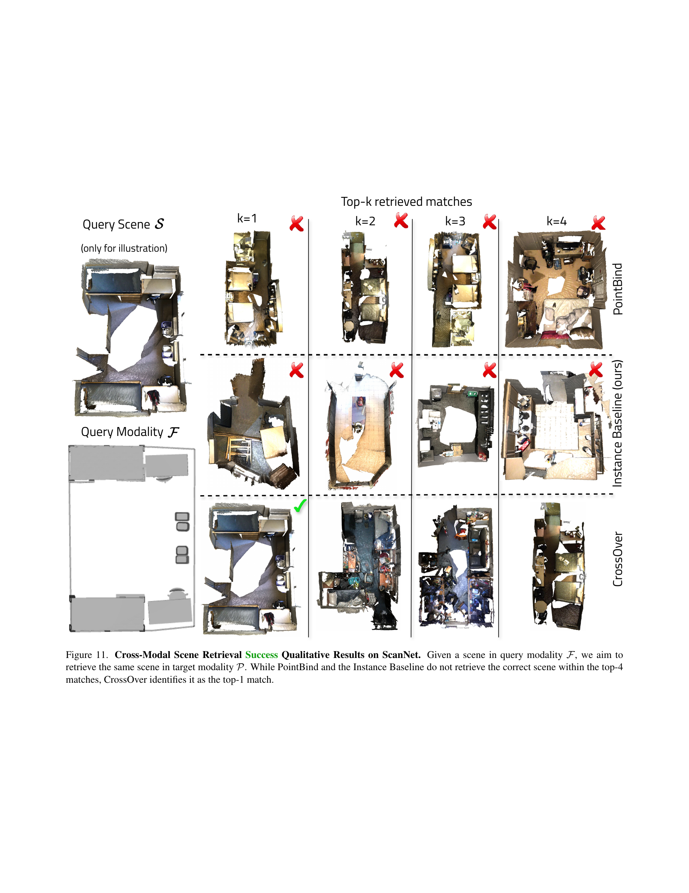
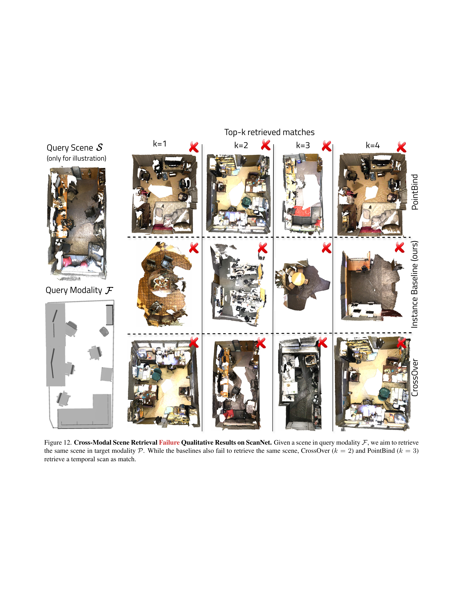

 


 2502.15011 
 Sayan Deb Sarkar et el. 
 
 🤗 2025-02-24 
 



↗ arXiv


↗ Hugging Face


### TL;DR



3D 장면 이해는 다양한 모달리티(예: 이미지, 포인트 클라우드, CAD)의 데이터를 통합하는 것이 중요하지만, 실제 환경 데이터는 종종 불완전하고 모달리티 간 정렬이 어렵다는 문제가 있습니다.  기존 방법들은 완벽한 데이터 정렬을 가정하거나 객체 수준에서만 정렬을 시도하여, 실제 응용에는 제한적입니다. 

본 논문은 이러한 문제를 해결하기 위해 **CrossOver**라는 새로운 프레임워크를 제시합니다. CrossOver는 **장면 수준에서 유연한 모달리티 정렬**을 수행하여, 모달리티 간 일관성이 부족하거나 데이터가 불완전하더라도 3D 장면을 이해할 수 있습니다.  **차원별 특징 추출기**와 **다단계 학습 파이프라인**을 사용하여, 명시적인 객체 의미론 없이도 강력한 장면 검색과 객체 위치 확인 기능을 제공합니다.  ScanNet과 3RScan 데이터셋 실험 결과, CrossOver는 다양한 지표에서 우수한 성능을 보이며 실용적인 3D 장면 이해 시스템의 가능성을 보여줍니다.



#### Key Takeaways


 CrossOver는 **모달리티 간의 정렬이 완벽하지 않거나 데이터가 불완전한 실제 환경에서도 3D 장면을 효과적으로 이해**할 수 있습니다. 



 **장면 수준 모달리티 정렬 기법**을 통해 **다양한 모달리티(RGB 이미지, 포인트 클라우드, CAD 모델, 평면도, 텍스트 설명) 간의 유연한 정렬**을 지원합니다. 



 ScanNet 및 3RScan 데이터셋에서의 평가 결과, CrossOver는 다양한 지표에서 **기존 방법보다 우수한 성능**을 보였으며, 실제 응용 분야에서의 적용 가능성을 보여줍니다. 


#### Why does it matter?
본 논문은 **다양한 모달리티의 데이터를 활용하여 3D 장면을 이해하는 새로운 프레임워크인 CrossOver**를 제시합니다. 기존의 객체 수준 정렬 방식과 달리, CrossOver는 **유연한 장면 수준 모달리티 정렬**을 통해 **모달리티 간의 일관성이 부족하거나 불완전한 데이터를 처리**할 수 있습니다. 이는 실제 환경에서 흔히 발생하는 데이터 제약을 극복하고 **더욱 실용적인 3D 장면 이해 시스템** 구축을 위한 중요한 발걸음입니다.  향후 연구는 다양한 데이터셋과 까다로운 실제 응용 분야에서 CrossOver의 성능을 더욱 개선하는 데 초점을 맞출 수 있으며, **실시간 3D 장면 재구성 및 내비게이션 시스템** 개발에 활용될 수 있습니다.

------
#### Visual Insights

> 🔼 그림 1은 다양한 작업을 가능하게 하는 통합된 모달-애그노스틱 임베딩 공간을 학습하는 3D 장면의 크로스-모달 정렬 방법인 CrossOver를 보여줍니다. 예를 들어, 쿼리 장면의 3D CAD 모델과 재구성된 점 구름 데이터베이스가 주어지면 CrossOver는 가장 일치하는 점 구름을 검색하고, 객체 인스턴스가 알려진 경우 무차별 대입 정렬을 사용하여 검색된 점 구름에서 일치하는 인스턴스가 있는 가구 CAD 모델의 개별 위치를 식별할 수 있습니다. 이 기능은 가상 및 증강 현실에 직접적인 응용 프로그램을 제공합니다.
> 

> 
read the caption

> Figure 1: CrossOver is a cross-modal alignment method for 3D scenes that learns a unified, modality-agnostic embedding space, enabling a range of tasks. For example, given the 3D CAD model of a query scene and a database of reconstructed point clouds, CrossOver can retrieve the closest matching point cloud and, if object instances are known, it can identify the individual locations of furniture CAD models with matched instances in the retrieved point cloud, using brute-force alignment. This capability has direct applications in virtual and augmented reality.
> 


| Method | Scannet [11] | 3RScan [38] |  | Method | Scannet [11] | 3RScan [38] |
|---|---|---|---|---|---|---|
| Scene-level Recall ↑ | R@25% | R@50% | R@75% | R@25% | R@50% | R@75% |
| $\mathcal{I}\rightarrow\mathcal{P}$ |  |  |  |  |  |  |
| ULIP-2 [43] | 1.28 | 0.64 | 0.24 | 1.91 | 0.40 | 0.28 |
| PointBind [18] | 6.73 | 0.96 | 0.32 | 3.18 | 0.64 | 0.01 |
| Inst. Baseline (Ours) | 88.46 | 37.82 | 1.92 | 93.63 | 35.03 | 3.82 |
| **Ours** | **98.08** | **76.92** | **23.40** | **99.36** | **79.62** | **22.93** |
| $\mathcal{I}\rightarrow\mathcal{R}$ |  |  |  |  |  |  |
| ULIP-2 [43] | 98.12 | 96.21 | 60.34 | 98.66 | 85.91 | 36.91 |
| PointBind [18] | 98.22 | 95.17 | 62.07 | 100 | 87.25 | 41.61 |
| Inst. Baseline (Ours) | 99.31 | 97.59 | 71.13 | 100 | 92.62 | 55.03 |
| **Ours** | **99.66** | **98.28** | **76.29** | **100** | **97.32** | **67.79** |
| $\mathcal{P}\rightarrow\mathcal{R}$ |  |  |  |  |  |  |
| ULIP-2 [43] | 37.24 | 16.90 | 8.62 | 16.78 | 6.04 | 1.34 |
| PointBind [18] | 54.83 | 27.93 | 11.72 | 21.48 | 6.04 | 2.01 |
| Inst. Baseline (Ours) | 98.63 | 83.85 | 46.74 | 92.62 | 60.40 | 20.81 |
| **Ours** | **99.31** | **96.56** | **70.10** | **100** | **89.26** | **50.34** |

> 🔼 표 1은 3RScan 데이터셋 [38]을 사용한 시간적 인스턴스 매칭 결과를 보여줍니다. 본 연구의 방법은 특별히 이 작업에 대해 학습되지 않았음에도 불구하고 동일 모드 작업에서 기준 모델보다 더 나은 성능을 보여줍니다. 또한, 크로스 모드 작업에서도 좋은 성능을 나타냅니다.  하지만, 텍스트 설명 (ℛ)이 포함된 경우 성능이 저하되는데, 이는 설명이 장면의 레이아웃에 따라 달라지며 물체의 배치가 변경되면 유효성이 떨어질 수 있기 때문입니다.
> 

> 
read the caption

> Table 1: Temporal Instance Matching on 3RScan [38]. Our method exhibits better performance in the same-modal task compared to baselines, despite not being specifically trained on this. It also performs well on cross-modal tasks. Lower performance when ℛℛ\mathcal{R}caligraphic_R is involved is expected, as descriptions are contextualized within the scene’s layout and may lose validity if objects rearrange.
> 

### In-depth insights

#### Cross-Modal Alignment
본 논문은 다양한 모드(RGB 이미지, 점 구름, CAD 모델, 평면도, 텍스트 설명)의 3D 장면 데이터를 **유연한 장면 수준의 모드 정렬**을 통해 통합하는 새로운 프레임워크인 CrossOver를 제시합니다. 기존의 객체 단위 정렬 방식과 달리, CrossOver는 각 객체 인스턴스에 대해 정렬된 모드 데이터를 필요로 하지 않고, **모드에 상관없이 통합된 임베딩 공간**을 학습합니다.  **차원별 특징 인코더**와 **다단계 학습 파이프라인**을 사용하여 모드 간의 관계를 효과적으로 학습하며, 누락된 모드가 있더라도 강건한 성능을 보입니다. ScanNet 및 3RScan 데이터셋에서의 실험 결과는 다양한 지표에서 CrossOver의 우수성을 보여주며, **실세계 3D 장면 이해**에 대한 적용 가능성을 시사합니다.  특히, **결측 모드에 대한 강건성**과 **모드 간의 상호 작용을 명시적으로 학습하지 않고도 모드 간의 관계를 학습하는 능력**이 핵심적인 강점으로 부각됩니다.

#### Scene-Level Fusion
본 논문에서 제시된 "Scene-Level Fusion"은 다양한 모달리티(RGB 이미지, 포인트 클라우드, CAD 모델, 평면도, 텍스트 설명)로부터 추출된 개별 인스턴스 특징들을 통합하여 **통합된 장면 표현(unified scene representation)**을 생성하는 핵심 과정입니다. 단순히 특징들을 연결하는 것이 아니라, **가중치 부여(weighted fusion)**를 통해 각 모달리티의 중요도를 학습하고, **다차원 특징 정보(dimensionality-specific features)**를 효과적으로 결합합니다. 이를 통해 모달리티 간의 상호작용을 포착하고, 특정 모달리티가 부족하더라도 강건한 장면 검색과 객체 위치 파악이 가능해집니다. **모달리티 간의 일관성(modality alignment)**을 명시적으로 강요하지 않고, **잠재적인 다중 모달리티 행동(emergent cross-modal behavior)**을 학습함으로써, 실제 환경의 불완전하고 일관성 없는 데이터에도 적용 가능한 유연성을 제공합니다.  결과적으로, Scene-Level Fusion은 CrossOver 모델의 핵심적인 강점인 **모달리티 독립적인 장면 이해(modality-agnostic scene understanding)**를 가능하게 하는 중요한 구성 요소입니다.

#### Emergent Behavior
본 논문에서 다룬 'Emergent Behavior'는 **다양한 모달리티 간의 명시적인 사전 학습 없이도 CrossOver 모델이 모달리티 간의 관계를 학습하고 예측하는 능력**을 의미합니다.  이는 단순히 각 모달리티를 개별적으로 처리하는 것이 아니라, **모달리티 간의 상호 작용과 유사성을 통해 새로운 정보를 생성하고,  결측된 모달리티를 추론하는 능력**을 보여줍니다.  예를 들어, RGB 이미지와 평면도 사이의 관계를 명시적으로 학습시키지 않았음에도 불구하고,  CrossOver는 이미지로부터 장면의 레이아웃을 추론하고 평면도를 통해  이미지 내의 물체 위치를 찾아낼 수 있습니다.  **이러한 능력은 다양한 실제 응용 분야에서 매우 중요한데,  실제 환경에서는 모든 모달리티의 데이터가 완벽하게 갖춰져 있지 않기 때문**입니다.  CrossOver의 Emergent Behavior는 **데이터 부족 상황이나 불완전한 정보에도 불구하고, 강건하고 유연한 3D 장면 이해를 가능하게 하는 핵심 요소**입니다.  이는 단순히 기술적 진보를 넘어 **새로운 인공지능 모델 설계의 패러다임 변화**를 보여주는 중요한 발견입니다.

#### Missing Modality
본 논문에서 다루는 핵심 개념 중 하나인 '결측 모달리티(Missing Modality)'는 **다양한 모달리티 데이터(RGB 이미지, 포인트 클라우드, CAD 모델 등)가 모두 완벽하게 갖춰져 있지 않은 현실 세계의 복잡한 3D 환경**을 반영합니다. 기존의 멀티 모달 접근 방식은 각 객체에 대해 모든 모달리티 데이터가 완벽하게 정렬되어 있고 일관성을 유지한다는 가정하에 설계되었지만, 실제 환경에서는 이러한 가정이 성립하지 않습니다. 따라서 **CrossOver는 결측 모달리티 상황에서도 강건하게 동작**할 수 있도록 설계되었습니다. 이는 엄격한 객체 수준의 모달리티 정렬 대신, 유연한 장면 수준의 모달리티 정렬을 통해 **모든 모달리티를 통합된 공간에 매핑**하는 방법을 제시합니다.  **모달리티 특징 간의 상관 관계를 명시적으로 정의하지 않고도 잠재적인 상호작용을 학습**하여, 특정 모달리티가 누락되더라도 다른 모달리티 정보를 활용해 견고한 장면 검색 및 객체 위치 파악을 수행할 수 있게 됩니다.

#### Future Directions
본 논문의 "미래 방향"에 대한 심층적인 고찰은 **다양한 모달리티 데이터의 통합 및 활용**을 고도화하는 데 초점을 맞춰야 합니다.  **불완전하거나 일관성 없는 데이터에 대한 강건성 확보**는 실제 환경 적용에 필수적이며, **데이터 증강 및 모델 정제**를 통해 해결할 수 있습니다.  **시간적 변화에 대한 모델 적응력 향상** 또한 중요한 과제입니다.  **동적 환경에서의 객체 인식 및 추적 성능 개선**을 위해, **장기간에 걸친 시계열 데이터 분석**과 **시간적 일관성을 고려한 학습 전략**이 필요합니다.  마지막으로, **다양한 응용 분야 확장**을 위한 노력이 필요합니다.  예를 들어, **로봇 제어, 증강 현실, 건설 현장 모니터링** 등 실제 세계 문제 해결에 기여할 수 있는 방향으로 연구를 확장하는 것이 중요합니다.  이러한 노력을 통해 CrossOver는 **더욱 견고하고 실용적인 3D 장면 이해 시스템**으로 발전할 수 있을 것입니다.

### More visual insights

More on figures

> 🔼 그림 2는 CrossOver의 개요를 보여줍니다.  입력으로는 다양한 모달리티(RGB 이미지, 점 구름, CAD 모델, 평면도, 텍스트 설명)로 표현된 3D 장면 𝒮와 그 장면 내의 개별 인스턴스 𝒪ᵢ가 주어집니다. CrossOver는 인스턴스 수준에서 각 모달리티 간의 상호작용을 포착하는 인스턴스 수준 다중 모달 상호작용 모듈과, 모든 인스턴스를 종합하여 단일 특징 벡터 ℱₛ로 장면을 나타내는 장면 수준 다중 모달 상호작용 모듈을 사용하여 통합 임베딩 공간 내에서 모든 모달리티를 정렬하는 것을 목표로 합니다.  통합 차원 인코더는 각 장면 모달리티를 ℱₛ와 상호 작용하면서 독립적으로 처리하도록 학습하여 정확한 의미 인스턴스 정보에 대한 의존성을 제거합니다.
> 

> 
read the caption

> Figure 2: Overview of CrossOver. Given a scene 𝒮𝒮\mathcal{S}caligraphic_S and its instances 𝒪isubscript𝒪𝑖\mathcal{O}_{i}caligraphic_O start_POSTSUBSCRIPT italic_i end_POSTSUBSCRIPT represented across different modalities ℐ,𝒫,ℳ,ℛ,ℱℐ𝒫ℳℛℱ\mathcal{I},\mathcal{P},\mathcal{M},\mathcal{R},\mathcal{F}caligraphic_I , caligraphic_P , caligraphic_M , caligraphic_R , caligraphic_F, the goal is to align all modalities within a shared embedding space. The Instance-Level Multimodal Interaction module captures modality interactions at the instance level within the context of a scene. This is further enhanced by the Scene-Level Multimodal Interaction module, which jointly processes all instances to represent the scene with a single feature vector ℱ𝒮subscriptℱ𝒮\mathcal{F_{S}}caligraphic_F start_POSTSUBSCRIPT caligraphic_S end_POSTSUBSCRIPT. The Unified Dimensionality Encoders eliminate dependency on precise semantic instance information by learning to process each scene modality independently while interacting with ℱ𝒮subscriptℱ𝒮\mathcal{F_{S}}caligraphic_F start_POSTSUBSCRIPT caligraphic_S end_POSTSUBSCRIPT.
> 

> 🔼 그림 3은 본 논문에서 제안하는 방법인 CrossOver의 핵심 구성 요소인 교차 모드 장면 검색 추론 파이프라인을 보여줍니다.  특정 장면을 나타내는 질의 모드(예: 점 구름)가 주어지면, 해당 차원 특징 인코더를 사용하여 공유 교차 모드 임베딩 공간 내에서 해당 장면의 특징 벡터(예: ℱ3D)를 얻습니다. 그런 다음, 대상 모드(예: 평면도)의 데이터베이스에서 가장 가까운 특징 벡터(예: ℱ2D)를 찾고, 해당 특징 벡터와 가장 유사한 장면을 데이터베이스에서 검색합니다. 이 과정을 통해 서로 다른 모드(예: 점 구름과 평면도)로 표현된 장면들 간의 유사성을 효과적으로 파악하여 장면 검색 작업을 수행합니다.
> 

> 
read the caption

> Figure 3: Cross-modal Scene Retrieval Inference Pipeline. Given a query modality (𝒫𝒫\mathcal{P}caligraphic_P) that represents a scene, we obtain with the corresponding dimensionality encoder its feature vector (ℱ3⁢Dsubscriptℱ3𝐷\mathcal{F}_{3D}caligraphic_F start_POSTSUBSCRIPT 3 italic_D end_POSTSUBSCRIPT) in the shared cross-modal embedding space. We identify the closest feature vector (ℱ2⁢Dsubscriptℱ2𝐷\mathcal{F}_{2D}caligraphic_F start_POSTSUBSCRIPT 2 italic_D end_POSTSUBSCRIPT) in the target modality (ℱℱ\mathcal{F}caligraphic_F) and retrieve the corresponding scene from a database of scenes in ℱℱ\mathcal{F}caligraphic_F.
> 

> 🔼 그림 4 (a)는 ScanNet 데이터셋에서 제안된 CrossOver 방법의 인스턴스 매칭 성능을 보여줍니다.  여러 가지 모달리티 조합 (예: 이미지-텍스트, 포인트 클라우드-메쉬 등)에 대한 인스턴스 매칭 재현율(Recall)을 다양한 기준(Top-k)으로 측정하여, CrossOver가 다양한 모달리티 조합에서도 높은 성능을 유지함을 보여줍니다. 각 모달리티 조합에 대한 재현율 수치를 통해 CrossOver의 강건성과 다양한 3D 데이터 유형에 대한 적응력을 평가할 수 있습니다.  단순히 모든 모달리티 쌍을 훈련하는 것이 아니라, 특정 기준 모달리티와의 정렬에 중점을 둔 훈련 전략이 효과적임을 시사합니다. 이는 부분적으로 모달리티 데이터가 누락된 상황에서도 강건한 성능을 유지하는 데 기여합니다.
> 

> 
read the caption

> (a) Instance Matching Recall on ScanNet
> 

> 🔼 그림 4(b)는 ScanNet과 3RScan 데이터셋에서 다양한 모달리티 조합에 대한 장면 수준 일치 재현율을 보여줍니다.  단순히 개별 객체 수준의 정합이 아닌, 전체 장면의 다양한 모달리티(RGB 이미지, 점군, CAD 모델, 평면도, 텍스트 설명) 간의 일관성을 평가합니다. 각 막대는 특정 모달리티 쌍(예: RGB 이미지에서 점군으로)에 대한 성능을 나타내며, R@25%, R@50%, R@75%는 상위 25%, 50%, 75%의 장면이 정확하게 일치하는 비율을 의미합니다. 이를 통해 CrossOver 모델이 부분적인 모달리티 정보만으로도 얼마나 효과적으로 장면을 인식하고 일치시키는지 보여줍니다.
> 

> 
read the caption

> (b) Scene-Level Matching Recall on ScanNet and 3RScan
> 

> 🔼 그림 4는 ScanNet과 3RScan 데이터셋에서 CrossOver 모델의 성능을 보여줍니다. (a)는 CrossOver가 모든 조합에 대해 명시적으로 학습하지 않았음에도 불구하고, 임베딩 공간 내에서 부상적 동작을 달성함을 보여줍니다. 이는 Instance Baseline (Ours)에도 적용됩니다. CrossOver는 모달리티 융합 시 더 많은 장면 맥락을 통합하기 때문에 자체 기준선보다 성능이 우수합니다. (b)는 제안된 방법이 모든 데이터셋에서 기존 방법들을 능가하며, 학습된 다중 모달 상호작용의 강건성을 보여줍니다.
> 

> 
read the caption

> Figure 4:  Cross-Modal Instance Retrieval on ScanNet and 3RScan. (a) Even though CrossOver does not explicitly train all modality combinations, it achieves emergent behavior within the embedding space. The same applies to our Instance Baseline (Ours). CrossOver performs better than our self-baseline since it incorporates more scene context in the fusion of modalities. (b) Our method outperforms all baselines in all datasets, showcasing the robustness of learned cross-modal interactions.
> 

> 🔼 그림 5는 ScanNet 데이터셋에서 다양한 모드 간의 장면 검색 결과를 정성적으로 보여줍니다. 질의 모드 ℱ에서 특정 장면을 찾고, 이와 동일한 장면을 목표 모드 𝒫에서 찾는 것을 목표로 합니다. PointBind 및 인스턴스 기준 모델은 상위 4개의 일치 항목 내에서 정확한 장면을 검색하지 못하는 반면, CrossOver는 상위 1개의 일치 항목으로 정확히 찾아냅니다. 특히 CrossOver의 임베딩 공간에서는 시간적으로 가까운 장면들이 서로 가까이 위치하는 경향이 있습니다. 예를 들어, k=2 및 k=3에서 검색된 장면들은 질의 장면과 유사한 객체 배치를 보여주며, k=4에서는 빨간색 소파와 같은 세부적인 특징도 공유합니다.
> 

> 
read the caption

> Figure 5: Cross-Modal Scene Retrieval Qualitative Results on ScanNet. Given a scene in query modality ℱℱ\mathcal{F}caligraphic_F, we aim to retrieve the same scene in target modality 𝒫𝒫\mathcal{P}caligraphic_P. While PointBind and the Instance Baseline do not retrieve the correct scene within the top-4 matches, CrossOver identifies it as the top-1 match. Notably, temporal scenes appear close together in CrossOver’s embedding space (e.g., k=2𝑘2k=2italic_k = 2, k=3𝑘3k=3italic_k = 3), with retrieved scenes featuring similar object layouts to the query scene, such as the red couch in k=4𝑘4k=4italic_k = 4.
> 

> 🔼 그림 6은 ScanNet 데이터셋에서 다양한 방법들을 사용하여 상위 1, 5, 10, 20개의 장면 매칭 재현율을 보여주는 그래프입니다. 세 가지 모달리티 쌍(이미지→점 구름, 이미지→텍스트 설명, 점 구름→텍스트 설명)에 대해 비교 분석합니다. 본 연구의 방법과 인스턴스 기준 방법은 점 구름→텍스트 설명에 대해서는 명시적으로 학습되지 않았습니다. 306개의 장면 데이터셋을 기반으로 계산되었으며, 본 연구의 방법이 우수한 성능을 보임을 보여줍니다. 본 연구의 방법과 자체 인스턴스 기준 방법 간의 차이는 통합 인코더를 통해 향상된 다중 모달리티 장면 수준 상호작용 때문입니다.
> 

> 
read the caption

> Figure 6: Cross-Modal Scene Retrieval on ScanNet (Scene Matching Recall). Plots showcase the top 1, 5, 10, 20 scene matching recall of different methods on three modality pairs: ℐ→𝒫→ℐ𝒫\mathcal{I}\rightarrow\mathcal{P}caligraphic_I → caligraphic_P, ℐ→ℛ→ℐℛ\mathcal{I}\rightarrow\mathcal{R}caligraphic_I → caligraphic_R, 𝒫→ℛ→𝒫ℛ\mathcal{P}\rightarrow\mathcal{R}caligraphic_P → caligraphic_R. Ours and the Instance Baseline have not been explicitly trained on 𝒫→ℛ→𝒫ℛ\mathcal{P}\rightarrow\mathcal{R}caligraphic_P → caligraphic_R. Results are computed on a database of 306 scenes and showcase the superior performance of our approach. Once again, the difference between Ours and our self-baseline is attributed to the enhanced cross-modal scene-level interactions achieved with the unified encoders.
> 

> 🔼 그림 4(a)는 ScanNet과 3RScan 데이터셋에서 다양한 조합의 modality(RGB 이미지, 점 구름, CAD 모델, 평면도, 텍스트 설명)에 대해 CrossOver 모델의 instance matching 성능을 보여줍니다.  각 modality 쌍에 대한 instance retrieval 정확도(recall)를 다양한 recall threshold(R@25%, R@50%, R@75%)에서 평가하여 시각화합니다.  즉, 특정 modality에서 관찰된 instance를 다른 modality에서 얼마나 정확하게 찾을 수 있는지를 보여주는 지표입니다.  여러 modality 쌍 간의 비교를 통해 CrossOver 모델의 강건성과 다양한 modality 간의 상호 작용 능력을 평가합니다.
> 

> 
read the caption

> (a) Instance Matching Recall
> 

> 🔼 그림 (b)는 CrossOver 모델의 장면 수준 일치율 성능을 보여줍니다. ScanNet과 3RScan 데이터셋에서 다양한 모달리티 쌍에 대한 장면 수준 재현율(Recall)을 R@25%, R@50%, R@75% 세 가지 수준에서 평가하여, CrossOver 모델의 성능을 다른 기준 모델들(ULIP-2, PointBind, 인스턴스 기준 모델)과 비교 분석한 결과를 나타냅니다. 이를 통해 CrossOver 모델이 다양한 장면과 모달리티에서 우수한 장면 수준 일치율을 달성함을 시각적으로 보여줍니다.
> 

> 
read the caption

> (b) Scene-Level Matching Recall
> 

> 🔼 그림 7은 ScanNet 데이터셋에서 데이터 규모를 확장하여 학습시킨 결과를 보여줍니다. ScanNet과 3RScan 데이터셋을 함께 학습시키면 개별 데이터셋으로 학습시킨 것보다 결과가 향상됩니다. 예상대로 3RScan으로만 학습하고 ScanNet에서 평가하면 성능이 제한적입니다. 3RScan은 ℐ, 𝒫, ℛ 모드만 포함한다는 점에 유의하십시오. 이 그림은 다양한 데이터셋을 활용하여 학습함으로써 모델의 일반화 능력을 향상시키고, 다양한 시나리오에서 강인한 성능을 발휘하는 CrossOver의 능력을 보여줍니다.
> 

> 
read the caption

> Figure 7: Scaled-up training performance on ScanNet. When training on both ScanNet and 3RScan datasets together, results improve from any individual dataset training. As expected, training on 3RScan and evaluating on ScanNet will have limited performance. Note that the 3RScan includes only the ℐℐ\mathcal{I}caligraphic_I, 𝒫𝒫\mathcal{P}caligraphic_P, and ℛℛ\mathcal{R}caligraphic_R modalities.
> 

> 🔼 그림 8은 ScanNet 데이터셋에서 교차 모달 I→P→I 장면 검색 결과를 보여줍니다.  여러 상위 k개 매칭에 대해 평가된 카메라 뷰 수에 따른 장면 매칭 재현율(재현율), 범주 재현율, 시간적 재현율, 범주 내 재현율을 보여줍니다. 최대 k값은 재현율 유형(장면 유사도, 범주, 시간적 변화)에 따라 다릅니다. 즉, 장면의 유사성, 범주, 시간적 변화 등 여러 기준에 따라 적용 가능한 매칭의 수가 달라집니다.
> 

> 
read the caption

> Figure 8: Cross-Modal ℐ→𝒫→ℐ𝒫\mathcal{I}\rightarrow\mathcal{P}caligraphic_I → caligraphic_P Scene Retrieval on ScanNet. Plots showcase scene matching recall (Recall), category recall, temporal recall, and intra-category recall for different number of camera views evaluated on several Top-k𝑘kitalic_k matches. Note that maximum k𝑘kitalic_k differs per recall since the amount of eligible matches depends on the criteria for each recall type: scene similarity, category, temporal changes.
> 

> 🔼 그림 9는 3RScan 데이터셋에서 교차 모드 ℐ→𝒫ℐ→𝒫I→P 장면 검색 결과를 보여줍니다.  여러 개의 카메라 뷰를 사용했을 때의 장면 매칭 재현율(Recall)과 시간적 재현율을 보여주는 그래프입니다.  즉, 다른 모드(예: RGB 이미지)로부터 3D 점 구름 데이터를 검색하는 성능을 다양한 수의 카메라 시점을 사용하여 평가한 결과입니다.  점 구름 데이터의 시간적 일관성(동일 장소를 다른 시간에 촬영한 데이터)을 고려하여 시간적 재현율 또한 평가하였습니다.
> 

> 
read the caption

> Figure 9: Cross-Modal ℐ→𝒫→ℐ𝒫\mathcal{I}\rightarrow\mathcal{P}caligraphic_I → caligraphic_P Scene Retrieval on 3RScan. Plots showcase scene matching recall (Recall) and temporal recall for different number of camera views.
> 

More on tables


<table class="ltx_tabular ltx_align_middle" id="S4.T1.7.7">
<tr class="ltx_tr" id="S4.T1.1.1.1">
<td class="ltx_td ltx_align_center ltx_border_tt" colspan="4" id="S4.T1.1.1.1.1">
Scene-level Recall <math alttext="\uparrow" class="ltx_Math" display="inline" id="S4.T1.1.1.1.1.m1.1"><semantics id="S4.T1.1.1.1.1.m1.1a"><mo id="S4.T1.1.1.1.1.m1.1.1" stretchy="false" xref="S4.T1.1.1.1.1.m1.1.1.cmml">↑</mo><annotation-xml encoding="MathML-Content" id="S4.T1.1.1.1.1.m1.1b"><ci id="S4.T1.1.1.1.1.m1.1.1.cmml" xref="S4.T1.1.1.1.1.m1.1.1">↑</ci></annotation-xml><annotation encoding="application/x-tex" id="S4.T1.1.1.1.1.m1.1c">\uparrow</annotation><annotation encoding="application/x-llamapun" id="S4.T1.1.1.1.1.m1.1d">↑</annotation></semantics></math>
</td>
</tr>
<tr class="ltx_tr" id="S4.T1.7.7.8">
<td class="ltx_td ltx_align_left ltx_border_r ltx_border_t" id="S4.T1.7.7.8.1">Method</td>
<td class="ltx_td ltx_align_center ltx_border_t" id="S4.T1.7.7.8.2">
R@25%</td>
<td class="ltx_td ltx_align_center ltx_border_t" id="S4.T1.7.7.8.3">
R@50%</td>
<td class="ltx_td ltx_align_center ltx_border_t" id="S4.T1.7.7.8.4">
R@75%</td>
</tr>
<tr class="ltx_tr" id="S4.T1.2.2.2">
<td class="ltx_td ltx_align_left ltx_border_t" colspan="4" id="S4.T1.2.2.2.1" style="background-color:#EEEEEE;">same-modal (<math alttext="\mathcal{P}\rightarrow\mathcal{P}" class="ltx_Math" display="inline" id="S4.T1.2.2.2.1.1.m1.1" style="background-color:#EEEEEE;"><semantics id="S4.T1.2.2.2.1.1.m1.1a"><mrow id="S4.T1.2.2.2.1.1.m1.1.1" xref="S4.T1.2.2.2.1.1.m1.1.1.cmml"><mi class="ltx_font_mathcaligraphic" id="S4.T1.2.2.2.1.1.m1.1.1.2" mathbackground="#EEEEEE" xref="S4.T1.2.2.2.1.1.m1.1.1.2.cmml">𝒫</mi><mo id="S4.T1.2.2.2.1.1.m1.1.1.1" mathbackground="#EEEEEE" stretchy="false" xref="S4.T1.2.2.2.1.1.m1.1.1.1.cmml">→</mo><mi class="ltx_font_mathcaligraphic" id="S4.T1.2.2.2.1.1.m1.1.1.3" mathbackground="#EEEEEE" xref="S4.T1.2.2.2.1.1.m1.1.1.3.cmml">𝒫</mi></mrow><annotation-xml encoding="MathML-Content" id="S4.T1.2.2.2.1.1.m1.1b"><apply id="S4.T1.2.2.2.1.1.m1.1.1.cmml" xref="S4.T1.2.2.2.1.1.m1.1.1"><ci id="S4.T1.2.2.2.1.1.m1.1.1.1.cmml" xref="S4.T1.2.2.2.1.1.m1.1.1.1">→</ci><ci id="S4.T1.2.2.2.1.1.m1.1.1.2.cmml" xref="S4.T1.2.2.2.1.1.m1.1.1.2">𝒫</ci><ci id="S4.T1.2.2.2.1.1.m1.1.1.3.cmml" xref="S4.T1.2.2.2.1.1.m1.1.1.3">𝒫</ci></apply></annotation-xml><annotation encoding="application/x-tex" id="S4.T1.2.2.2.1.1.m1.1c">\mathcal{P}\rightarrow\mathcal{P}</annotation><annotation encoding="application/x-llamapun" id="S4.T1.2.2.2.1.1.m1.1d">caligraphic_P → caligraphic_P</annotation></semantics></math>)</td>
</tr>
<tr class="ltx_tr" id="S4.T1.7.7.9">
<td class="ltx_td ltx_align_left ltx_border_r" id="S4.T1.7.7.9.1">MendNet <cite class="ltx_cite ltx_citemacro_cite">[<a class="ltx_ref" href="https://arxiv.org/html/2502.15011v1#bib.bib15" title="">15</a>]</cite>
</td>
<td class="ltx_td ltx_align_center" id="S4.T1.7.7.9.2">80.68</td>
<td class="ltx_td ltx_align_center" id="S4.T1.7.7.9.3">64.77</td>
<td class="ltx_td ltx_align_center" id="S4.T1.7.7.9.4">37.50</td>
</tr>
<tr class="ltx_tr" id="S4.T1.3.3.3">
<td class="ltx_td ltx_align_left ltx_border_r" id="S4.T1.3.3.3.1">VN-DGCNNcls <cite class="ltx_cite ltx_citemacro_cite">[<a class="ltx_ref" href="https://arxiv.org/html/2502.15011v1#bib.bib13" title="">13</a>]</cite>
</td>
<td class="ltx_td ltx_align_center" id="S4.T1.3.3.3.2">72.32</td>
<td class="ltx_td ltx_align_center" id="S4.T1.3.3.3.3">53.41</td>
<td class="ltx_td ltx_align_center" id="S4.T1.3.3.3.4">29.55</td>
</tr>
<tr class="ltx_tr" id="S4.T1.4.4.4">
<td class="ltx_td ltx_align_left ltx_border_r" id="S4.T1.4.4.4.1">VN-ONetrecon <cite class="ltx_cite ltx_citemacro_cite">[<a class="ltx_ref" href="https://arxiv.org/html/2502.15011v1#bib.bib13" title="">13</a>]</cite>
</td>
<td class="ltx_td ltx_align_center" id="S4.T1.4.4.4.2">86.36</td>
<td class="ltx_td ltx_align_center" id="S4.T1.4.4.4.3">71.59</td>
<td class="ltx_td ltx_align_center" id="S4.T1.4.4.4.4">44.32</td>
</tr>
<tr class="ltx_tr" id="S4.T1.7.7.10">
<td class="ltx_td ltx_align_left ltx_border_r" id="S4.T1.7.7.10.1">LivingScenes  <cite class="ltx_cite ltx_citemacro_cite">[<a class="ltx_ref" href="https://arxiv.org/html/2502.15011v1#bib.bib47" title="">47</a>]</cite>
</td>
<td class="ltx_td ltx_align_center" id="S4.T1.7.7.10.2" style="background-color:#E1FFA8;">87.50</td>
<td class="ltx_td ltx_align_center" id="S4.T1.7.7.10.3" style="background-color:#E1FFA8;">78.41</td>
<td class="ltx_td ltx_align_center" id="S4.T1.7.7.10.4" style="background-color:#E1FFA8;">50.00</td>
</tr>
<tr class="ltx_tr" id="S4.T1.7.7.11">
<td class="ltx_td ltx_align_left ltx_border_r" id="S4.T1.7.7.11.1">Ours</td>
<td class="ltx_td ltx_align_center" id="S4.T1.7.7.11.2" style="background-color:#BFFFBF;">92.31</td>
<td class="ltx_td ltx_align_center" id="S4.T1.7.7.11.3" style="background-color:#BFFFBF;">84.62</td>
<td class="ltx_td ltx_align_center" id="S4.T1.7.7.11.4" style="background-color:#BFFFBF;">57.69</td>
</tr>
<tr class="ltx_tr" id="S4.T1.7.7.12">
<td class="ltx_td ltx_align_left" colspan="4" id="S4.T1.7.7.12.1" style="background-color:#EEEEEE;">cross-modal (ours)</td>
</tr>
<tr class="ltx_tr" id="S4.T1.5.5.5">
<td class="ltx_td ltx_align_left ltx_border_r" id="S4.T1.5.5.5.1"><math alttext="\mathcal{I}\rightarrow\mathcal{P}" class="ltx_Math" display="inline" id="S4.T1.5.5.5.1.m1.1"><semantics id="S4.T1.5.5.5.1.m1.1a"><mrow id="S4.T1.5.5.5.1.m1.1.1" xref="S4.T1.5.5.5.1.m1.1.1.cmml"><mi class="ltx_font_mathcaligraphic" id="S4.T1.5.5.5.1.m1.1.1.2" xref="S4.T1.5.5.5.1.m1.1.1.2.cmml">ℐ</mi><mo id="S4.T1.5.5.5.1.m1.1.1.1" stretchy="false" xref="S4.T1.5.5.5.1.m1.1.1.1.cmml">→</mo><mi class="ltx_font_mathcaligraphic" id="S4.T1.5.5.5.1.m1.1.1.3" xref="S4.T1.5.5.5.1.m1.1.1.3.cmml">𝒫</mi></mrow><annotation-xml encoding="MathML-Content" id="S4.T1.5.5.5.1.m1.1b"><apply id="S4.T1.5.5.5.1.m1.1.1.cmml" xref="S4.T1.5.5.5.1.m1.1.1"><ci id="S4.T1.5.5.5.1.m1.1.1.1.cmml" xref="S4.T1.5.5.5.1.m1.1.1.1">→</ci><ci id="S4.T1.5.5.5.1.m1.1.1.2.cmml" xref="S4.T1.5.5.5.1.m1.1.1.2">ℐ</ci><ci id="S4.T1.5.5.5.1.m1.1.1.3.cmml" xref="S4.T1.5.5.5.1.m1.1.1.3">𝒫</ci></apply></annotation-xml><annotation encoding="application/x-tex" id="S4.T1.5.5.5.1.m1.1c">\mathcal{I}\rightarrow\mathcal{P}</annotation><annotation encoding="application/x-llamapun" id="S4.T1.5.5.5.1.m1.1d">caligraphic_I → caligraphic_P</annotation></semantics></math></td>
<td class="ltx_td ltx_align_center" id="S4.T1.5.5.5.2">89.74</td>
<td class="ltx_td ltx_align_center" id="S4.T1.5.5.5.3">73.08</td>
<td class="ltx_td ltx_align_center" id="S4.T1.5.5.5.4">42.31</td>
</tr>
<tr class="ltx_tr" id="S4.T1.6.6.6">
<td class="ltx_td ltx_align_left ltx_border_r" id="S4.T1.6.6.6.1"><math alttext="\mathcal{I}\rightarrow\mathcal{R}" class="ltx_Math" display="inline" id="S4.T1.6.6.6.1.m1.1"><semantics id="S4.T1.6.6.6.1.m1.1a"><mrow id="S4.T1.6.6.6.1.m1.1.1" xref="S4.T1.6.6.6.1.m1.1.1.cmml"><mi class="ltx_font_mathcaligraphic" id="S4.T1.6.6.6.1.m1.1.1.2" xref="S4.T1.6.6.6.1.m1.1.1.2.cmml">ℐ</mi><mo id="S4.T1.6.6.6.1.m1.1.1.1" stretchy="false" xref="S4.T1.6.6.6.1.m1.1.1.1.cmml">→</mo><mi class="ltx_font_mathcaligraphic" id="S4.T1.6.6.6.1.m1.1.1.3" xref="S4.T1.6.6.6.1.m1.1.1.3.cmml">ℛ</mi></mrow><annotation-xml encoding="MathML-Content" id="S4.T1.6.6.6.1.m1.1b"><apply id="S4.T1.6.6.6.1.m1.1.1.cmml" xref="S4.T1.6.6.6.1.m1.1.1"><ci id="S4.T1.6.6.6.1.m1.1.1.1.cmml" xref="S4.T1.6.6.6.1.m1.1.1.1">→</ci><ci id="S4.T1.6.6.6.1.m1.1.1.2.cmml" xref="S4.T1.6.6.6.1.m1.1.1.2">ℐ</ci><ci id="S4.T1.6.6.6.1.m1.1.1.3.cmml" xref="S4.T1.6.6.6.1.m1.1.1.3">ℛ</ci></apply></annotation-xml><annotation encoding="application/x-tex" id="S4.T1.6.6.6.1.m1.1c">\mathcal{I}\rightarrow\mathcal{R}</annotation><annotation encoding="application/x-llamapun" id="S4.T1.6.6.6.1.m1.1d">caligraphic_I → caligraphic_R</annotation></semantics></math></td>
<td class="ltx_td ltx_align_center" id="S4.T1.6.6.6.2">62.33</td>
<td class="ltx_td ltx_align_center" id="S4.T1.6.6.6.3">38.96</td>
<td class="ltx_td ltx_align_center" id="S4.T1.6.6.6.4">18.18</td>
</tr>
<tr class="ltx_tr" id="S4.T1.7.7.7">
<td class="ltx_td ltx_align_left ltx_border_bb ltx_border_r" id="S4.T1.7.7.7.1"><math alttext="\mathcal{P}\rightarrow\mathcal{R}" class="ltx_Math" display="inline" id="S4.T1.7.7.7.1.m1.1"><semantics id="S4.T1.7.7.7.1.m1.1a"><mrow id="S4.T1.7.7.7.1.m1.1.1" xref="S4.T1.7.7.7.1.m1.1.1.cmml"><mi class="ltx_font_mathcaligraphic" id="S4.T1.7.7.7.1.m1.1.1.2" xref="S4.T1.7.7.7.1.m1.1.1.2.cmml">𝒫</mi><mo id="S4.T1.7.7.7.1.m1.1.1.1" stretchy="false" xref="S4.T1.7.7.7.1.m1.1.1.1.cmml">→</mo><mi class="ltx_font_mathcaligraphic" id="S4.T1.7.7.7.1.m1.1.1.3" xref="S4.T1.7.7.7.1.m1.1.1.3.cmml">ℛ</mi></mrow><annotation-xml encoding="MathML-Content" id="S4.T1.7.7.7.1.m1.1b"><apply id="S4.T1.7.7.7.1.m1.1.1.cmml" xref="S4.T1.7.7.7.1.m1.1.1"><ci id="S4.T1.7.7.7.1.m1.1.1.1.cmml" xref="S4.T1.7.7.7.1.m1.1.1.1">→</ci><ci id="S4.T1.7.7.7.1.m1.1.1.2.cmml" xref="S4.T1.7.7.7.1.m1.1.1.2">𝒫</ci><ci id="S4.T1.7.7.7.1.m1.1.1.3.cmml" xref="S4.T1.7.7.7.1.m1.1.1.3">ℛ</ci></apply></annotation-xml><annotation encoding="application/x-tex" id="S4.T1.7.7.7.1.m1.1c">\mathcal{P}\rightarrow\mathcal{R}</annotation><annotation encoding="application/x-llamapun" id="S4.T1.7.7.7.1.m1.1d">caligraphic_P → caligraphic_R</annotation></semantics></math></td>
<td class="ltx_td ltx_align_center ltx_border_bb" id="S4.T1.7.7.7.2">68.83</td>
<td class="ltx_td ltx_align_center ltx_border_bb" id="S4.T1.7.7.7.3">40.26</td>
<td class="ltx_td ltx_align_center ltx_border_bb" id="S4.T1.7.7.7.4">22.08</td>
</tr>
</table>
> 🔼 표 2는 3RScan 데이터셋에서 수행된 교차 모드 장면 검색 결과를 보여줍니다. 이 표는 쿼리 모드와 대상 모드 간의 일치율을 다양한 지표(예: 상위 1, 5, 10위 정확도)로 평가하여 교차 모드 장면 검색 성능을 보여줍니다. ScanNet 결과(표 3)와 유사한 성능을 보임을 알 수 있습니다.
> 

> 
read the caption

> Table 2: Cross-Modal Scene Retrieval on 3RScan. Similar performance to the ScanNet results in Tab. 3 is observed.
> 


| Method | Scene Matching Recall ↑ | Temporal Recall ↑ |  |  |  |  |  |  |
|---|---|---|---|---|---|---|---|---|
|  | top-1 | top-5 | top-10 | top-20 | top-1 | top-5 | top-10 |  |
|---|---|---|---|---|---|---|---|---|
| ℐ→𝒫 |  |  |  |  |  |  |  |  |
| ULIP-2 [43] | 1.27 | 5.10 | 7.01 | 12.74 | 0.04 | 4.26 | 12.77 |  |
| PointBind [18] | 1.27 | 4.46 | 9.55 | 17.20 | 2.13 | 4.26 | 8.51 |  |
| Inst. Baseline (Ours) | 8.92 | 30.57 | 43.31 | 64.33 | 0.04 | 19.15 | 42.55 |  |
| Ours | **14.01** | **49.04** | **66.88** | **83.44** | **12.77** | **36.17** | **70.21** |  |
| ℐ→ℛ |  |  |  |  |  |  |  |  |
| ULIP-2 [43] | 2.01 | 4.70 | 7.38 | 14.77 | 2.13 | 6.38 | 12.77 |  |
| PointBind [18] | 1.34 | 4.77 | 6.71 | 13.42 | 2.13 | 6.38 | 14.89 |  |
| Inst. Baseline (Ours) | **8.72** | **40.94** | **57.05** | **69.80** | **6.38** | **38.30** | **63.83** |  |
| Ours | 6.04 | 26.85 | 42.28 | 62.42 | 2.13 | 34.04 | **63.83** |  |
| 𝒫→ℛ |  |  |  |  |  |  |  |  |
| ULIP-2 [43] | 0.67 | 3.36 | 6.71 | 12.75 | 2.13 | 6.38 | 6.38 |  |
| PointBind [18] | 0.67 | 3.36 | 6.71 | 13.42 | 2.13 | 6.38 | 6.38 |  |
| Inst. Baseline (Ours) | 0.76 | 14.09 | 24.83 | 36.24 | 0.04 | 14.89 | 27.66 |  |
| Ours | **6.71** | **19.46** | **32.31** | **51.01** | **8.51** | **27.66** | **51.06** |  |
> 🔼 표 3은 ScanNet 데이터셋을 사용한 다양한 조합의 모달 간 장면 검색 결과를 보여줍니다.  CrossOver는 기존 최첨단 방법들과 자체 기준 모델을 능가하는 성능을 대부분의 경우에서 보여줍니다. 하지만, 카테고리 내 검색에서는 특정 모달 조합(예: 이미지에서 텍스트로)에서 자체 기준 모델이 더 나은 성능을 보이는데, 이는 CrossOver의 텍스트 인코더 성능이 다소 부족하기 때문으로 분석됩니다.
> 

> 
read the caption

> Table 3: Cross-Modal Scene Retrieval on ScanNet. We consistently outperform state-of-the-art methods and our self-baseline in most cases. The latter performs better in certain modality pairs on intra-category, with the biggest gap observed in ℐ→ℛ→ℐℛ\mathcal{I}\rightarrow\mathcal{R}caligraphic_I → caligraphic_R; this can be attributed to our less powerful text encoder.
> 


| Method | Scene Category Recall ↑ |  |  | Temporal Recall ↑ |  |  | Intra-Category Recall ↑ |  |  |
|---|---|---|---|---|---|---|---|---|---| 
|  | top-1 | top-5 | top-10 | top-1 | top-5 | top-10 | top-1 | top-3 | top-5 |
|---|---|---|---|---|---|---|---|---|---| 
| ℐ→𝒫 |  |  |  |  |  |  |  |  |  |
| ULIP-2 [43] | 7.37 | 25.96 | 43.27 | 0.04 | 1.00 | 3.00 | 16.77 | 41.53 | 55.54 |
| PointBind [18] | 13.78 | 24.36 | 42.95 | 2.00 | 5.00 | 7.00 | 20.03 | 40.68 | 57.01 |
| Inst. Baseline (Ours) | 42.95 | 70.19 | 81.09 | 13.00 | 35.00 | 60.00 | 46.37 | 79.68 | 88.43 |
| Ours | 64.74 | 89.42 | 94.23 | 13.00 | 41.00 | 84.00 | 38.98 | 73.28 | 85.00 |
| ℐ→ℛ |  |  |  |  |  |  |  |  |  |
| ULIP-2 [43] | 41.92 | 57.73 | 61.86 | 1.00 | 2.00 | 8.00 | 19.48 | 42.18 | 56.69 |
| PointBind [18] | 49.48 | 70.45 | 80.07 | 2.00 | 6.00 | 12.00 | 19.19 | 41.54 | 55.85 |
| Inst. Baseline (Ours) | 49.14 | 71.48 | 80.07 | 8.00 | 28.00 | 46.00 | 28.00 | 62.33 | 72.62 |
| Ours | 57.39 | 82.82 | 87.63 | 3.00 | 25.00 | 51.00 | 29.04 | 57.85 | 70.75 |
| 𝒫→ℛ |  |  |  |  |  |  |  |  |  |
| ULIP-2 [43] | 11.34 | 15.12 | 23.27 | 1.00 | 2.00 | 4.00 | 18.12 | 41.15 | 54.93 |
| PointBind [18] | 18.21 | 26.46 | 31.96 | 1.00 | 2.00 | 6.00 | 18.25 | 40.05 | 54.84 |
| Inst. Baseline (Ours) | 28.87 | 50.86 | 66.67 | 5.00 | 13.00 | 23.00 | 29.41 | 50.84 | 65.65 |
| Ours | 57.73 | 79.04 | 85.57 | 5.00 | 20.00 | 46.00 | 26.79 | 56.67 | 68.63 |
| ℐ→ℱ |  |  |  |  |  |  |  |  |  |
| ULIP-2 [43] | 38.46 | 55.77 | 64.42 | 1.00 | 2.00 | 10.00 | 18.48 | 39.09 | 55.96 |
| PointBind [18] | 35.58 | 62.82 | 72.76 | 1.00 | 11.00 | 21.00 | 20.03 | 43.08 | 58.62 |
| Ours | 58.01 | 81.09 | 89.10 | 8.00 | 32.00 | 61.00 | 28.57 | 55.67 | 71.77 |
| 𝒫→ℱ |  |  |  |  |  |  |  |  |  |
| ULIP-2 [43] | 13.14 | 26.28 | 33.65 | 1.00 | 1.00 | 6.00 | 17.46 | 38.74 | 53.99 |
| PointBind [18] | 14.10 | 48.72 | 59.62 | 0.50 | 5.00 | 7.00 | 23.17 | 39.23 | 57.08 |
| Ours | 55.77 | 78.53 | 86.54 | 10.00 | 30.00 | 57.00 | 31.34 | 63.42 | 74.15 |
| ℛ→ℱ |  |  |  |  |  |  |  |  |  |
| ULIP-2 [43] | 8.25 | 29.21 | 40.21 | 1.00 | 2.00 | 5.00 | 18.24 | 41.80 | 55.35 |
| PointBind [18] | 14.43 | 27.15 | 48.45 | 1.00 | 5.00 | 8.00 | 13.64 | 38.32 | 54.20 |
| Ours | 54.64 | 74.91 | 80.41 | 6.00 | 17.00 | 35.00 | 23.00 | 51.37 | 66.84 |
> 🔼 표 4는 ScanNet 데이터셋에서 모달리티 쌍이 같은 이미지 저장소를 공유하지 않더라도, 제안된 방법이 데이터셋의 특정 쌍이 부족하더라도 높은 성능을 유지함을 보여주는 실험 결과를 보여줍니다.  이 표는 각 모달리티 쌍(P→M, P→ℳ, ℳ→P)에 대해, 겹치지 않는 데이터로 학습했을 때의 인스턴스 매칭 재현율(top-1, top-3)을 보여줍니다.  이는 부분적으로 겹치는 데이터를 사용하여도 모델의 성능이 크게 저하되지 않음을 시사합니다.
> 

> 
read the caption

> Table 4: Ablation on 𝒫→ℳ→𝒫ℳ\mathcal{P}\rightarrow\mathcal{M}caligraphic_P → caligraphic_M instance matching on ScanNet with non-overlapping data per modality pair. Despite modality pairs not sharing the same image repository, our method retains high performance even when a pair is underrepresented in the data.
> 


| Available Data | Instance Matching Recall ↑ | 
|---|---|---|---|---|---| 
| 
<math xmlns="http://www.w3.org/1998/Math/MathML"><mi>ℐ</mi><mo>→</mo><mi>𝒫</mi></math> (%)
 | 
<math xmlns="http://www.w3.org/1998/Math/MathML"><mi>ℐ</mi><mo>→</mo><mi>ℳ</mi></math> (%)
 | **same** | **diff** | **top-1** | **top-3** | 
| 25 | 75 | 86.32 | **73.38** | 55.46 | 79.73 | 
| 50 | 50 | **87.46** | 70.02 | 57.49 | 79.94 | 
| 75 | 25 | 87.35 | 67.65 | 54.99 | 79.45 | 
| 100 | 100 | 87.44 | 72.46 | **59.88** | **80.81** | 
> 🔼 표 B.1은 ScanNet 데이터셋에서 장면 수준 매칭 결과를 보여줍니다. '모든 쌍'은 모든 쌍방향 모달리티 조합으로 인스턴스 수준 인코더를 훈련시킨 것을 의미합니다. 표에서 보듯이, 모든 쌍방향 조합으로 훈련시킨다고 해서 성능이 크게 향상되는 것은 아닙니다.  '우리 모델'(Emergent)에서 직접 정렬되지 않은 모달리티 쌍에서도 마찬가지입니다. 즉, 모든 가능한 모달리티 조합을 사용하여 훈련하는 것보다 특정 참조 모달리티에 맞춰 정렬하는 것이 더 효과적임을 보여줍니다.
> 

> 
read the caption

> Table B.1: Scene-level matching results on ScanNet. ‘All Pairs’ refers to training our instance-level encoder with all pairwise modality combinations. As shown, training on all pairwise combinations does not provide drastically improved performance, as one would expect, even in the modality pairs that are not directly aligned in ‘Ours’ (emergent).
> 


| Trained on | R@25% | R@50% | R@75% |
|---|---|---|---|
| 𝒫→ℳ |  |  |  |
| 3RScan | 22.44 | 8.01 | 2.24 |
| Scannet | **86.54** | 64.42 | 33.97 |
| 3RScan + Scannet | **86.54** | 63.46 | **34.29** |
| 𝒫→ℛ |  |  |  |
| 3RScan | 84.54 | 48.80 | 24.74 |
| Scannet | **99.31** | 96.22 | 68.38 |
| 3RScan + Scannet | **99.31** | **97.25** | **70.10** |
| ℳ→ℛ |  |  |  |
| 3RScan | 68.97 | 48.28 | 22.22 |
| Scannet | **99.62** | **98.47** | 82.38 |
| 3RScan + Scannet | 99.23 | 97.70 | **83.91** |
> 🔼 표 B.2는 3RScan 데이터셋에서의 장면 수준 매칭 결과를 보여줍니다. '모든 쌍'은 인스턴스 수준 인코더를 모든 쌍방향 모달리티 조합으로 훈련시킨 것을 의미합니다. ScanNet과 유사하게, 모든 쌍방향 조합으로 훈련하는 것은 '우리' (새로운) 방법에서 직접 정렬되지 않은 모달리티 쌍에서도 성능 향상을 제공하지 않습니다. 이 표는 다양한 모달리티 조합에 대한 장면 검색 정확도를 비교 분석하여, 모든 쌍방향 조합 훈련이 항상 최선의 방법은 아님을 보여줍니다.  '우리' 방법은 특정 참조 모달리티와의 정렬에 집중하여, 특히 모달리티 누락 시에 강건성을 향상시킵니다.
> 

> 
read the caption

> Table B.2: Scene-level matching results on 3RScan. ‘All Pairs’ refers to training our instance-level encoder with all pairwise modality combinations. Similar to ScanNet, training on all pairwise combinations does not provide improved performance, as one would expect, even in the modality pairs that are not directly aligned in ‘Ours’ (emergent).
> 


| Scene-level Recall ↑ | R@25% | R@50% | R@75% |
|---|---|---|---|
| **<binary data, 1 bytes><binary data, 1 bytes><binary data, 1 bytes> → <binary data, 1 bytes><binary data, 1 bytes><binary data, 1 bytes>** |  |  |  |
| All Pairs | 97.12 | 75.00 | 15.06 |
| Ours | **98.08** | **76.92** | **23.40** |
| **<binary data, 1 bytes><binary data, 1 bytes><binary data, 1 bytes> → <binary data, 1 bytes><binary data, 1 bytes><binary data, 1 bytes>** |  |  |  |
| All Pairs | **100** | 98.08 | 75.95 |
| Ours | 99.66 | **98.28** | **76.29** |
| **<binary data, 1 bytes><binary data, 1 bytes><binary data, 1 bytes> → <binary data, 1 bytes><binary data, 1 bytes>** |  |  |  |
| All Pairs | **87.82** | 63.14 | 33.97 |
| Ours | 86.54 | **63.46** | **34.29** |
| **<binary data, 1 bytes><binary data, 1 bytes><binary data, 1 bytes> → <binary data, 1 bytes><binary data, 1 bytes><binary data, 1 bytes>** |  |  |  |
| All Pairs | **99.66** | **97.25** | **75.26** |
| Ours _(emergent)_ | 99.31 | 96.56 | 70.10 |
| **<binary data, 1 bytes><binary data, 1 bytes><binary data, 1 bytes> → <binary data, 1 bytes><binary data, 1 bytes>** |  |  |  |
| All Pairs | **89.42** | **65.71** | 35.26 |
| Ours _(emergent)_ | 87.50 | 61.54 | 30.77 |
| **<binary data, 1 bytes><binary data, 1 bytes><binary data, 1 bytes> → <binary data, 1 bytes><binary data, 1 bytes><binary data, 1 bytes>** |  |  |  |
| All Pairs | **100** | **98.08** | 83.52 |
| Ours _(emergent)_ | 99.23 | 97.70 | **83.91** |
> 🔼 표 C.1은 ScanNet 데이터셋에서 동일 모드 시나리오(예: 이미지-이미지, 점 구름-점 구름)에 대한 장면 검색 결과를 보여줍니다.  본 논문의 방법은 기준 방법들과 비교하여 대부분의 지표에서 동등하거나 더 나은 성능을 보여줍니다. 이는 각 모달리티의 특징들이 임베딩 공간 내에서 잘 정렬되어 있음을 시사하며, 이는 교차 모달리티 학습 목표에도 불구하고 달성된 결과입니다.  단일 모달리티 내에서의 정렬이 우수하다는 것은 교차 모달리티 학습에서도 효과적으로 다른 모달리티를 이해하는 데 기여했음을 보여주는 것입니다.
> 

> 
read the caption

> Table C.1: Same-Modality Scene Retrieval on ScanNet. Our method performs on par with or better than baselines in same-modality scene retrieval across most metrics, indicating that individual modalities in our method are closely aligned within the embedding space, despite the cross-modal training objective.
> 


| Scene-level Recall ↑ | R@25% | R@50% | R@75% |
|---|---|---|---|
|  |  |  |  |
| All Pair loss | **99.36** | 77.71 | 17.20 |
| Ours | **99.36** | **79.62** | **22.93** |
|  |  |  |  |
| All Pair Loss | **100** | **97.32** | 62.42 |
| Ours | **100** | **97.32** | **67.79** |
|  |  |  |  |
| All Pair Loss | **100** | **93.96** | **54.36** |
| Ours _**(emergent)**_ | **100** | 89.26 | 50.34 |
> 🔼 표 C.2는 3RScan 데이터셋에서 동일 모드 시나리오 하에서 수행된 장면 검색 결과를 보여줍니다. 본 논문의 방법은 대부분의 지표에서 기준 방법들과 동등하거나 더 나은 성능을 보입니다. 그러나 3RScan 데이터셋의 제한된 훈련 데이터 가용성으로 인해 전반적인 성능이 다소 낮을 수 있습니다. 이 표는 동일한 모드(예: RGB 이미지와 RGB 이미지, 혹은 포인트 클라우드와 포인트 클라우드)를 사용하여 장면 검색 작업을 평가한 결과를 보여주고 있습니다. 각 모드에 대한 상위 1, 5, 10개의 검색 결과에 대한 재현율을 보여주어 모델이 얼마나 정확하게 동일한 장면을 식별하는지 평가합니다. 또한, 장면 범주 재현율, 시간적 재현율, 범주 내 재현율 등 추가적인 지표도 제시하여 모델의 성능을 다각적으로 평가합니다.
> 

> 
read the caption

> Table C.2: Same-Modality Scene Retrieval on 3RScan. Our method performs on par with or better than baselines in same-modality scene retrieval across most metrics. The lower performance on this dataset is likely due to limited training data availability.
> 


| Method | Scene Category Recall ↑ |  |  | Temporal Recall ↑ |  |  | Intra-Category Recall ↑ |  |  |
|---|---|---|---|---|---|---|---|---|---| 
|  | top-1 | top-5 | top-10 | top-1 | top-5 | top-10 | top-1 | top-3 | top-5 |
|---|---|---|---|---|---|---|---|---|---| 
| ℐ→ℐ |  |  |  |  |  |  |  |  |  |
| ULIP-2 [43] | 35.9 | 44.23 | 56.73 | 1.00 | 2.00 | 30.00 | 89.75 | 96.91 | 96.91 |
| PointBind [18] | **93.59** | 96.79 | **98.08** | **22.00** | **59.00** | **99.00** | 90.21 | **100** | **100** |
| Inst. Baseline (Ours) | 89.74 | 95.19 | 97.12 | **22.00** | 58.00 | **99.00** | 80.22 | 98.84 | 99.87 |
| Ours | 91.67 | **97.76** | 98.08 | 11.00 | **59.00** | 98.00 | **100** | **100** | **100** |
| ℛ→ℛ |  |  |  |  |  |  |  |  |  |
| ULIP-2 [43] | 11.34 | 18.56 | 24.05 | 1.00 | 2.00 | 4.00 | 36.63 | 57.12 | 66.17 |
| PointBind [18] | 11.34 | 18.56 | 24.05 | 1.00 | 2.00 | 4.00 | 36.63 | 57.12 | 66.17 |
| Inst. Baseline (Ours) | 69.42 | **91.75** | **94.16** | **13.00** | **51.00** | **83.00** | 86.56 | 97.65 | 99.20 |
| Ours | **76.98** | 91.75 | 94.85 | **14.00** | 40.00 | 79.00 | **100** | **100** | **100** |
| 𝒫→𝒫 |  |  |  |  |  |  |  |  |  |
| ULIP-2 [43] | 13.14 | 13.14 | 23.72 | 1.00 | 2.00 | 3.00 | 21.52 | 42.12 | 57.25 |
| PointBind [18] | 17.63 | 58.33 | 71.47 | 7.00 | 23.00 | 45.00 | 59.54 | 90.36 | 96.46 |
| Inst. Baseline (Ours) | 38.14 | 75.00 | 85.38 | 14.00 | 42.00 | 73.00 | 86.31 | 97.14 | 99.81 |
| Ours | **86.54** | **95.51** | **96.79** | **19.00** | **57.00** | **96.00** | **100** | **100** | **100** |
| ℱ→ℱ |  |  |  |  |  |  |  |  |  |
| ULIP-2 [43] | 13.78 | 24.36 | 41.03 | 1.00 | 2.00 | 5.00 | 99.27 | 99.89 | 99.89 |
| PointBind [18] | 63.78 | 82.37 | 89.10 | 7.00 | 37.00 | 67.00 | **100** | **100** | **100** |
| Ours | 59.95 | **83.65** | **90.38** | **14.00** | **43.00** | **74.00** | **100** | **100** | **100** |
| 𝐅ₛ→𝐅ₛ |  |  |  |  |  |  |  |  |  |
| Ours | 94.23 | 97.44 | 98.08 | 17.00 | 57.00 | 99.00 | 100 | 100 | 100 |
> 🔼 표 D.1은 ScanNet 데이터셋에서 교차 모드 장면 검색에 대한 장면 수준 인코더 추론에 대한 단일 모드 및 모든 쌍방향 모드 학습 결과를 보여줍니다. '모든 쌍'은 모든 쌍방향 모드 조합으로 통합 인코더를 학습하는 것을 나타내고, '단일 모드'는 단일 모드 입력을 사용하는 장면 수준 인코더를 의미합니다. 표에서 볼 수 있듯이 본 연구의 방법은 대부분의 경우 장면 수준 인코더와 '모든 쌍'보다 성능이 우수합니다. 통합 차원 인코더와 달리 장면 수준 인코더는 단일 모드로 작동하더라도 인스턴스 수준 데이터에 의존합니다.
> 

> 
read the caption

> Table D.1: Uni-modal & All pair-wise modality training on Scene-Level Encoder Inference on Cross-Modal Scene Retrieval on ScanNet. ‘All Pairs’ refers to training our unified encoder with all pairwise modality combinations. ‘Uni-modal’ refers to the scene-level encoder with single-modality input. As shown in the Table, our approach outperforms the scene-level encoder and ‘All Pairs’ in most cases. Unlike the unified dimensionality encoders, the scene-level encoder relies on instance-level data, even when operating on a single modality.
> 


| Method | top-1 ↑ | top-5 ↑ | top-10 ↑ |
|---|---|---|---|
| <math>\mathcal{I}\rightarrow\mathcal{I}</math> |  |  |  |
| ULIP-2 [43] | 2.13 | 8.51 | 29.79 |
| PointBind [18] | 10.64 | 51.06 | 93.62 |
| Inst. Baseline (Ours) | 4.26 | 65.96 | 100 |
| Ours | 17.02 | 61.70 | 100 |
| <math>\mathcal{R}\rightarrow\mathcal{R}</math> |  |  |  |
| ULIP-2 [43] | 2.13 | 6.38 | 8.51 |
| PointBind [18] | 2.13 | 6.38 | 8.51 |
| Inst. Baseline (Ours) | 19.15 | 46.81 | 91.49 |
| Ours | 12.77 | 51.06 | 87.23 |
| <math>\mathcal{P}\rightarrow\mathcal{P}</math> |  |  |  |
| ULIP-2 [43] | 0.04 | 4.26 | 6.38 |
| PointBind [18] | 2.13 | 17.02 | 36.17 |
| Inst. Baseline (Ours) | 6.38 | 29.79 | 3.83 |
| Ours | 19.15 | 65.96 | 97.87 |
| <math>\mathbf{F}_{\mathcal{S}}\rightarrow\mathbf{F}_{\mathcal{S}}</math> |  |  |  |
| Ours | 17.02 | 59.57 | 97.87 |
> 🔼 표 D.2는 3RScan 데이터셋에서 교차 모달 장면 검색에 대한 장면 수준 인코더 추론에 대한 단일 모드 및 모든 쌍방향 모드 학습 결과를 보여줍니다. '모든 쌍'은 모든 쌍방향 모드 조합으로 통합 인코더를 학습하는 것을 나타내고, '단일 모드'는 단일 모드 입력을 사용하는 장면 수준 인코더를 나타냅니다. 표에서 알 수 있듯이 본 연구의 접근 방식은 한 가지 경우를 제외하고는 장면 수준 인코더보다 성능이 뛰어납니다. 통합 차원 인코더와 달리 장면 수준 인코더는 단일 모드로 작동하더라도 인스턴스 수준 데이터에 의존합니다.
> 

> 
read the caption

> Table D.2: Uni-modal & All pair-wise modality training on Scene-Level Encoder Inference on Cross-Modal Scene Retrieval on 3RScan. ‘All Pairs’ refers to training our unified encoder with all pairwise modality combinations. ‘Uni-modal’ refers to the scene-level encoder with single-modality input. As shown in the Table, our approach outperforms the scene-level encoder in all but one case. Unlike the unified dimensionality encoders, the scene-level encoder relies on instance-level data, even when operating with a single modality.
> 


<table class="ltx_tabular ltx_align_middle" id="S4.T1a.7.7">
<tr class="ltx_tr" id="S4.T1a.4.4.4">
<td class="ltx_td ltx_align_left ltx_border_r ltx_border_tt" id="S4.T1a.4.4.4.5">Method</td>
<td class="ltx_td ltx_align_center ltx_border_tt" colspan="4" id="S4.T1a.1.1.1.1">
Scene Matching Recall <math alttext="\uparrow" class="ltx_Math" display="inline" id="S4.T1a.1.1.1.1.m1.1"><semantics id="S4.T1a.1.1.1.1.m1.1a"><mo id="S4.T1a.1.1.1.1.m1.1.1" mathsize="144%" stretchy="false" xref="S4.T1a.1.1.1.1.m1.1.1.cmml">↑</mo><annotation-xml encoding="MathML-Content" id="S4.T1a.1.1.1.1.m1.1b"><ci id="S4.T1a.1.1.1.1.m1.1.1.cmml" xref="S4.T1a.1.1.1.1.m1.1.1">↑</ci></annotation-xml><annotation encoding="application/x-tex" id="S4.T1a.1.1.1.1.m1.1c">\uparrow</annotation><annotation encoding="application/x-llamapun" id="S4.T1a.1.1.1.1.m1.1d">↑</annotation></semantics></math>
</td>
<td class="ltx_td ltx_align_center ltx_border_tt" colspan="3" id="S4.T1a.2.2.2.2">
Scene Category Recall <math alttext="\uparrow" class="ltx_Math" display="inline" id="S4.T1a.2.2.2.2.m1.1"><semantics id="S4.T1a.2.2.2.2.m1.1a"><mo id="S4.T1a.2.2.2.2.m1.1.1" mathsize="144%" stretchy="false" xref="S4.T1a.2.2.2.2.m1.1.1.cmml">↑</mo><annotation-xml encoding="MathML-Content" id="S4.T1a.2.2.2.2.m1.1b"><ci id="S4.T1a.2.2.2.2.m1.1.1.cmml" xref="S4.T1a.2.2.2.2.m1.1.1">↑</ci></annotation-xml><annotation encoding="application/x-tex" id="S4.T1a.2.2.2.2.m1.1c">\uparrow</annotation><annotation encoding="application/x-llamapun" id="S4.T1a.2.2.2.2.m1.1d">↑</annotation></semantics></math>
</td>
<td class="ltx_td ltx_align_center ltx_border_tt" colspan="3" id="S4.T1a.3.3.3.3">
Temporal Recall <math alttext="\uparrow" class="ltx_Math" display="inline" id="S4.T1a.3.3.3.3.m1.1"><semantics id="S4.T1a.3.3.3.3.m1.1a"><mo id="S4.T1a.3.3.3.3.m1.1.1" mathsize="144%" stretchy="false" xref="S4.T1a.3.3.3.3.m1.1.1.cmml">↑</mo><annotation-xml encoding="MathML-Content" id="S4.T1a.3.3.3.3.m1.1b"><ci id="S4.T1a.3.3.3.3.m1.1.1.cmml" xref="S4.T1a.3.3.3.3.m1.1.1">↑</ci></annotation-xml><annotation encoding="application/x-tex" id="S4.T1a.3.3.3.3.m1.1c">\uparrow</annotation><annotation encoding="application/x-llamapun" id="S4.T1a.3.3.3.3.m1.1d">↑</annotation></semantics></math>
</td>
<td class="ltx_td ltx_align_center ltx_border_tt" colspan="3" id="S4.T1a.4.4.4.4">
Intra-Category Recall <math alttext="\uparrow" class="ltx_Math" display="inline" id="S4.T1a.4.4.4.4.m1.1"><semantics id="S4.T1a.4.4.4.4.m1.1a"><mo id="S4.T1a.4.4.4.4.m1.1.1" mathsize="144%" stretchy="false" xref="S4.T1a.4.4.4.4.m1.1.1.cmml">↑</mo><annotation-xml encoding="MathML-Content" id="S4.T1a.4.4.4.4.m1.1b"><ci id="S4.T1a.4.4.4.4.m1.1.1.cmml" xref="S4.T1a.4.4.4.4.m1.1.1">↑</ci></annotation-xml><annotation encoding="application/x-tex" id="S4.T1a.4.4.4.4.m1.1c">\uparrow</annotation><annotation encoding="application/x-llamapun" id="S4.T1a.4.4.4.4.m1.1d">↑</annotation></semantics></math>
</td>
</tr>
<tr class="ltx_tr" id="S4.T1a.7.7.8">
<td class="ltx_td ltx_border_r ltx_border_t" id="S4.T1a.7.7.8.1"></td>
<td class="ltx_td ltx_align_center ltx_border_t" id="S4.T1a.7.7.8.2">top-1</td>
<td class="ltx_td ltx_align_center ltx_border_t" id="S4.T1a.7.7.8.3">top-5</td>
<td class="ltx_td ltx_align_center ltx_border_t" id="S4.T1a.7.7.8.4">top-10</td>
<td class="ltx_td ltx_align_center ltx_border_r ltx_border_t" id="S4.T1a.7.7.8.5">top-20</td>
<td class="ltx_td ltx_align_center ltx_border_t" id="S4.T1a.7.7.8.6">top-1</td>
<td class="ltx_td ltx_align_center ltx_border_t" id="S4.T1a.7.7.8.7">top-5</td>
<td class="ltx_td ltx_align_center ltx_border_r ltx_border_t" id="S4.T1a.7.7.8.8">top-10</td>
<td class="ltx_td ltx_align_center ltx_border_t" id="S4.T1a.7.7.8.9">top-1</td>
<td class="ltx_td ltx_align_center ltx_border_t" id="S4.T1a.7.7.8.10">top-5</td>
<td class="ltx_td ltx_align_center ltx_border_rr ltx_border_t" id="S4.T1a.7.7.8.11">top-10</td>
<td class="ltx_td ltx_align_center ltx_border_t" id="S4.T1a.7.7.8.12">top-1</td>
<td class="ltx_td ltx_align_center ltx_border_t" id="S4.T1a.7.7.8.13">top-3</td>
<td class="ltx_td ltx_align_center ltx_border_t" id="S4.T1a.7.7.8.14">top-5</td>
</tr>
<tr class="ltx_tr" id="S4.T1a.5.5.5">
<td class="ltx_td ltx_align_left ltx_border_t" colspan="14" id="S4.T1a.5.5.5.1" style="background-color:#EEEEEE;"><math alttext="\mathcal{I}\rightarrow\mathcal{P}" class="ltx_Math" display="inline" id="S4.T1a.5.5.5.1.m1.1" style="background-color:#EEEEEE;"><semantics id="S4.T1a.5.5.5.1.m1.1a"><mrow id="S4.T1a.5.5.5.1.m1.1.1" xref="S4.T1a.5.5.5.1.m1.1.1.cmml"><mi class="ltx_font_mathcaligraphic" id="S4.T1a.5.5.5.1.m1.1.1.2" mathbackground="#EEEEEE" mathsize="144%" xref="S4.T1a.5.5.5.1.m1.1.1.2.cmml">ℐ</mi><mo id="S4.T1a.5.5.5.1.m1.1.1.1" mathbackground="#EEEEEE" mathsize="144%" stretchy="false" xref="S4.T1a.5.5.5.1.m1.1.1.1.cmml">→</mo><mi class="ltx_font_mathcaligraphic" id="S4.T1a.5.5.5.1.m1.1.1.3" mathbackground="#EEEEEE" mathsize="144%" xref="S4.T1a.5.5.5.1.m1.1.1.3.cmml">𝒫</mi></mrow><annotation-xml encoding="MathML-Content" id="S4.T1a.5.5.5.1.m1.1b"><apply id="S4.T1a.5.5.5.1.m1.1.1.cmml" xref="S4.T1a.5.5.5.1.m1.1.1"><ci id="S4.T1a.5.5.5.1.m1.1.1.1.cmml" xref="S4.T1a.5.5.5.1.m1.1.1.1">→</ci><ci id="S4.T1a.5.5.5.1.m1.1.1.2.cmml" xref="S4.T1a.5.5.5.1.m1.1.1.2">ℐ</ci><ci id="S4.T1a.5.5.5.1.m1.1.1.3.cmml" xref="S4.T1a.5.5.5.1.m1.1.1.3">𝒫</ci></apply></annotation-xml><annotation encoding="application/x-tex" id="S4.T1a.5.5.5.1.m1.1c">\mathcal{I}\rightarrow\mathcal{P}</annotation><annotation encoding="application/x-llamapun" id="S4.T1a.5.5.5.1.m1.1d">caligraphic_I → caligraphic_P</annotation></semantics></math></td>
</tr>
<tr class="ltx_tr" id="S4.T1a.7.7.9">
<td class="ltx_td ltx_align_left ltx_border_r" id="S4.T1a.7.7.9.1">Uni-modal</td>
<td class="ltx_td ltx_align_center" id="S4.T1a.7.7.9.2" style="background-color:#E1FFA8;">16.67</td>
<td class="ltx_td ltx_align_center" id="S4.T1a.7.7.9.3" style="background-color:#E1FFA8;">51.92</td>
<td class="ltx_td ltx_align_center" id="S4.T1a.7.7.9.4">66.67</td>
<td class="ltx_td ltx_align_center ltx_border_r" id="S4.T1a.7.7.9.5">85.26</td>
<td class="ltx_td ltx_align_center" id="S4.T1a.7.7.9.6">36.22</td>
<td class="ltx_td ltx_align_center" id="S4.T1a.7.7.9.7">73.72</td>
<td class="ltx_td ltx_align_center ltx_border_r" id="S4.T1a.7.7.9.8">85.26</td>
<td class="ltx_td ltx_align_center" id="S4.T1a.7.7.9.9" style="background-color:#BFFFBF;">14.00</td>
<td class="ltx_td ltx_align_center" id="S4.T1a.7.7.9.10">36.00</td>
<td class="ltx_td ltx_align_center ltx_border_rr" id="S4.T1a.7.7.9.11">67.00</td>
<td class="ltx_td ltx_align_center" id="S4.T1a.7.7.9.12" style="background-color:#BFFFBF;">49.05</td>
<td class="ltx_td ltx_align_center" id="S4.T1a.7.7.9.13" style="background-color:#BFFFBF;">85.15</td>
<td class="ltx_td ltx_align_center" id="S4.T1a.7.7.9.14" style="background-color:#BFFFBF;">91.91</td>
</tr>
<tr class="ltx_tr" id="S4.T1a.7.7.10">
<td class="ltx_td ltx_align_left ltx_border_r" id="S4.T1a.7.7.10.1">All Pairs</td>
<td class="ltx_td ltx_align_center" id="S4.T1a.7.7.10.2">16.35</td>
<td class="ltx_td ltx_align_center" id="S4.T1a.7.7.10.3">54.17</td>
<td class="ltx_td ltx_align_center" id="S4.T1a.7.7.10.4" style="background-color:#E1FFA8;">75.32</td>
<td class="ltx_td ltx_align_center ltx_border_r" id="S4.T1a.7.7.10.5" style="background-color:#BFFFBF;">91.35</td>
<td class="ltx_td ltx_align_center" id="S4.T1a.7.7.10.6" style="background-color:#BFFFBF;">65.71</td>
<td class="ltx_td ltx_align_center" id="S4.T1a.7.7.10.7" style="background-color:#E1FFA8;">86.54</td>
<td class="ltx_td ltx_align_center ltx_border_r" id="S4.T1a.7.7.10.8" style="background-color:#E1FFA8;">93.91</td>
<td class="ltx_td ltx_align_center" id="S4.T1a.7.7.10.9">11.00</td>
<td class="ltx_td ltx_align_center" id="S4.T1a.7.7.10.10" style="background-color:#BFFFBF;">42.00</td>
<td class="ltx_td ltx_align_center ltx_border_rr" id="S4.T1a.7.7.10.11" style="background-color:#E1FFA8;">77.00</td>
<td class="ltx_td ltx_align_center" id="S4.T1a.7.7.10.12">41.51</td>
<td class="ltx_td ltx_align_center" id="S4.T1a.7.7.10.13">71.38</td>
<td class="ltx_td ltx_align_center" id="S4.T1a.7.7.10.14">84.85</td>
</tr>
<tr class="ltx_tr" id="S4.T1a.7.7.11">
<td class="ltx_td ltx_align_left ltx_border_r" id="S4.T1a.7.7.11.1">Ours</td>
<td class="ltx_td ltx_align_center" id="S4.T1a.7.7.11.2" style="background-color:#BFFFBF;">21.15</td>
<td class="ltx_td ltx_align_center" id="S4.T1a.7.7.11.3" style="background-color:#BFFFBF;">57.05</td>
<td class="ltx_td ltx_align_center" id="S4.T1a.7.7.11.4" style="background-color:#BFFFBF;">77.56</td>
<td class="ltx_td ltx_align_center ltx_border_r" id="S4.T1a.7.7.11.5" style="background-color:#E1FFA8;">89.10</td>
<td class="ltx_td ltx_align_center" id="S4.T1a.7.7.11.6" style="background-color:#E1FFA8;">64.74</td>
<td class="ltx_td ltx_align_center" id="S4.T1a.7.7.11.7" style="background-color:#BFFFBF;">89.42</td>
<td class="ltx_td ltx_align_center ltx_border_r" id="S4.T1a.7.7.11.8" style="background-color:#BFFFBF;">94.23</td>
<td class="ltx_td ltx_align_center" id="S4.T1a.7.7.11.9" style="background-color:#E1FFA8;">13.00</td>
<td class="ltx_td ltx_align_center" id="S4.T1a.7.7.11.10" style="background-color:#E1FFA8;">41.00</td>
<td class="ltx_td ltx_align_center ltx_border_rr" id="S4.T1a.7.7.11.11" style="background-color:#BFFFBF;">84.00</td>
<td class="ltx_td ltx_align_center" id="S4.T1a.7.7.11.12" style="background-color:#E1FFA8;">38.98</td>
<td class="ltx_td ltx_align_center" id="S4.T1a.7.7.11.13" style="background-color:#E1FFA8;">73.28</td>
<td class="ltx_td ltx_align_center" id="S4.T1a.7.7.11.14" style="background-color:#E1FFA8;">85.00</td>
</tr>
<tr class="ltx_tr" id="S4.T1a.6.6.6">
<td class="ltx_td ltx_align_left" colspan="14" id="S4.T1a.6.6.6.1" style="background-color:#EEEEEE;"><math alttext="\mathcal{I}\rightarrow\mathcal{R}" class="ltx_Math" display="inline" id="S4.T1a.6.6.6.1.m1.1" style="background-color:#EEEEEE;"><semantics id="S4.T1a.6.6.6.1.m1.1a"><mrow id="S4.T1a.6.6.6.1.m1.1.1" xref="S4.T1a.6.6.6.1.m1.1.1.cmml"><mi class="ltx_font_mathcaligraphic" id="S4.T1a.6.6.6.1.m1.1.1.2" mathbackground="#EEEEEE" mathsize="144%" xref="S4.T1a.6.6.6.1.m1.1.1.2.cmml">ℐ</mi><mo id="S4.T1a.6.6.6.1.m1.1.1.1" mathbackground="#EEEEEE" mathsize="144%" stretchy="false" xref="S4.T1a.6.6.6.1.m1.1.1.1.cmml">→</mo><mi class="ltx_font_mathcaligraphic" id="S4.T1a.6.6.6.1.m1.1.1.3" mathbackground="#EEEEEE" mathsize="144%" xref="S4.T1a.6.6.6.1.m1.1.1.3.cmml">ℛ</mi></mrow><annotation-xml encoding="MathML-Content" id="S4.T1a.6.6.6.1.m1.1b"><apply id="S4.T1a.6.6.6.1.m1.1.1.cmml" xref="S4.T1a.6.6.6.1.m1.1.1"><ci id="S4.T1a.6.6.6.1.m1.1.1.1.cmml" xref="S4.T1a.6.6.6.1.m1.1.1.1">→</ci><ci id="S4.T1a.6.6.6.1.m1.1.1.2.cmml" xref="S4.T1a.6.6.6.1.m1.1.1.2">ℐ</ci><ci id="S4.T1a.6.6.6.1.m1.1.1.3.cmml" xref="S4.T1a.6.6.6.1.m1.1.1.3">ℛ</ci></apply></annotation-xml><annotation encoding="application/x-tex" id="S4.T1a.6.6.6.1.m1.1c">\mathcal{I}\rightarrow\mathcal{R}</annotation><annotation encoding="application/x-llamapun" id="S4.T1a.6.6.6.1.m1.1d">caligraphic_I → caligraphic_R</annotation></semantics></math></td>
</tr>
<tr class="ltx_tr" id="S4.T1a.7.7.12">
<td class="ltx_td ltx_align_left ltx_border_r" id="S4.T1a.7.7.12.1">Uni-modal</td>
<td class="ltx_td ltx_align_center" id="S4.T1a.7.7.12.2">2.75</td>
<td class="ltx_td ltx_align_center" id="S4.T1a.7.7.12.3">11.00</td>
<td class="ltx_td ltx_align_center" id="S4.T1a.7.7.12.4">18.21</td>
<td class="ltx_td ltx_align_center ltx_border_r" id="S4.T1a.7.7.12.5">29.90</td>
<td class="ltx_td ltx_align_center" id="S4.T1a.7.7.12.6">19.59</td>
<td class="ltx_td ltx_align_center" id="S4.T1a.7.7.12.7">46.74</td>
<td class="ltx_td ltx_align_center ltx_border_r" id="S4.T1a.7.7.12.8">62.89</td>
<td class="ltx_td ltx_align_center" id="S4.T1a.7.7.12.9">2.00</td>
<td class="ltx_td ltx_align_center" id="S4.T1a.7.7.12.10">14.00</td>
<td class="ltx_td ltx_align_center ltx_border_rr" id="S4.T1a.7.7.12.11">19.00</td>
<td class="ltx_td ltx_align_center" id="S4.T1a.7.7.12.12">26.12</td>
<td class="ltx_td ltx_align_center" id="S4.T1a.7.7.12.13">55.80</td>
<td class="ltx_td ltx_align_center" id="S4.T1a.7.7.12.14">66.71</td>
</tr>
<tr class="ltx_tr" id="S4.T1a.7.7.13">
<td class="ltx_td ltx_align_left ltx_border_r" id="S4.T1a.7.7.13.1">All Pairs</td>
<td class="ltx_td ltx_align_center" id="S4.T1a.7.7.13.2" style="background-color:#E1FFA8;">7.56</td>
<td class="ltx_td ltx_align_center" id="S4.T1a.7.7.13.3" style="background-color:#BFFFBF;">33.68</td>
<td class="ltx_td ltx_align_center" id="S4.T1a.7.7.13.4" style="background-color:#BFFFBF;">50.17</td>
<td class="ltx_td ltx_align_center ltx_border_r" id="S4.T1a.7.7.13.5" style="background-color:#BFFFBF;">65.64</td>
<td class="ltx_td ltx_align_center" id="S4.T1a.7.7.13.6" style="background-color:#BFFFBF;">65.98</td>
<td class="ltx_td ltx_align_center" id="S4.T1a.7.7.13.7" style="background-color:#BFFFBF;">83.16</td>
<td class="ltx_td ltx_align_center ltx_border_r" id="S4.T1a.7.7.13.8" style="background-color:#BFFFBF;">88.66</td>
<td class="ltx_td ltx_align_center" id="S4.T1a.7.7.13.9" style="background-color:#BFFFBF;">8.00</td>
<td class="ltx_td ltx_align_center" id="S4.T1a.7.7.13.10" style="background-color:#BFFFBF;">28.00</td>
<td class="ltx_td ltx_align_center ltx_border_rr" id="S4.T1a.7.7.13.11" style="background-color:#BFFFBF;">52.00</td>
<td class="ltx_td ltx_align_center" id="S4.T1a.7.7.13.12" style="background-color:#BFFFBF;">29.99</td>
<td class="ltx_td ltx_align_center" id="S4.T1a.7.7.13.13" style="background-color:#BFFFBF;">58.42</td>
<td class="ltx_td ltx_align_center" id="S4.T1a.7.7.13.14" style="background-color:#BFFFBF;">72.64</td>
</tr>
<tr class="ltx_tr" id="S4.T1a.7.7.14">
<td class="ltx_td ltx_align_left ltx_border_r" id="S4.T1a.7.7.14.1">Ours</td>
<td class="ltx_td ltx_align_center" id="S4.T1a.7.7.14.2" style="background-color:#BFFFBF;">8.59</td>
<td class="ltx_td ltx_align_center" id="S4.T1a.7.7.14.3" style="background-color:#E1FFA8;">31.27</td>
<td class="ltx_td ltx_align_center" id="S4.T1a.7.7.14.4" style="background-color:#E1FFA8;">45.70</td>
<td class="ltx_td ltx_align_center ltx_border_r" id="S4.T1a.7.7.14.5" style="background-color:#E1FFA8;">59.79</td>
<td class="ltx_td ltx_align_center" id="S4.T1a.7.7.14.6" style="background-color:#E1FFA8;">57.39</td>
<td class="ltx_td ltx_align_center" id="S4.T1a.7.7.14.7" style="background-color:#E1FFA8;">82.82</td>
<td class="ltx_td ltx_align_center ltx_border_r" id="S4.T1a.7.7.14.8" style="background-color:#E1FFA8;">87.63</td>
<td class="ltx_td ltx_align_center" id="S4.T1a.7.7.14.9" style="background-color:#E1FFA8;">3.00</td>
<td class="ltx_td ltx_align_center" id="S4.T1a.7.7.14.10" style="background-color:#E1FFA8;">25.00</td>
<td class="ltx_td ltx_align_center ltx_border_rr" id="S4.T1a.7.7.14.11" style="background-color:#E1FFA8;">51.00</td>
<td class="ltx_td ltx_align_center" id="S4.T1a.7.7.14.12" style="background-color:#E1FFA8;">29.04</td>
<td class="ltx_td ltx_align_center" id="S4.T1a.7.7.14.13" style="background-color:#E1FFA8;">57.85</td>
<td class="ltx_td ltx_align_center" id="S4.T1a.7.7.14.14" style="background-color:#E1FFA8;">70.75</td>
</tr>
<tr class="ltx_tr" id="S4.T1a.7.7.7">
<td class="ltx_td ltx_align_left" colspan="14" id="S4.T1a.7.7.7.1" style="background-color:#EEEEEE;"><math alttext="\mathcal{P}\rightarrow\mathcal{R}" class="ltx_Math" display="inline" id="S4.T1a.7.7.7.1.m1.1" style="background-color:#EEEEEE;"><semantics id="S4.T1a.7.7.7.1.m1.1a"><mrow id="S4.T1a.7.7.7.1.m1.1.1" xref="S4.T1a.7.7.7.1.m1.1.1.cmml"><mi class="ltx_font_mathcaligraphic" id="S4.T1a.7.7.7.1.m1.1.1.2" mathbackground="#EEEEEE" mathsize="144%" xref="S4.T1a.7.7.7.1.m1.1.1.2.cmml">𝒫</mi><mo id="S4.T1a.7.7.7.1.m1.1.1.1" mathbackground="#EEEEEE" mathsize="144%" stretchy="false" xref="S4.T1a.7.7.7.1.m1.1.1.1.cmml">→</mo><mi class="ltx_font_mathcaligraphic" id="S4.T1a.7.7.7.1.m1.1.1.3" mathbackground="#EEEEEE" mathsize="144%" xref="S4.T1a.7.7.7.1.m1.1.1.3.cmml">ℛ</mi></mrow><annotation-xml encoding="MathML-Content" id="S4.T1a.7.7.7.1.m1.1b"><apply id="S4.T1a.7.7.7.1.m1.1.1.cmml" xref="S4.T1a.7.7.7.1.m1.1.1"><ci id="S4.T1a.7.7.7.1.m1.1.1.1.cmml" xref="S4.T1a.7.7.7.1.m1.1.1.1">→</ci><ci id="S4.T1a.7.7.7.1.m1.1.1.2.cmml" xref="S4.T1a.7.7.7.1.m1.1.1.2">𝒫</ci><ci id="S4.T1a.7.7.7.1.m1.1.1.3.cmml" xref="S4.T1a.7.7.7.1.m1.1.1.3">ℛ</ci></apply></annotation-xml><annotation encoding="application/x-tex" id="S4.T1a.7.7.7.1.m1.1c">\mathcal{P}\rightarrow\mathcal{R}</annotation><annotation encoding="application/x-llamapun" id="S4.T1a.7.7.7.1.m1.1d">caligraphic_P → caligraphic_R</annotation></semantics></math></td>
</tr>
<tr class="ltx_tr" id="S4.T1a.7.7.15">
<td class="ltx_td ltx_align_left ltx_border_r" id="S4.T1a.7.7.15.1">Uni-modal</td>
<td class="ltx_td ltx_align_center" id="S4.T1a.7.7.15.2">2.06</td>
<td class="ltx_td ltx_align_center" id="S4.T1a.7.7.15.3">5.15</td>
<td class="ltx_td ltx_align_center" id="S4.T1a.7.7.15.4">12.03</td>
<td class="ltx_td ltx_align_center ltx_border_r" id="S4.T1a.7.7.15.5">21.31</td>
<td class="ltx_td ltx_align_center" id="S4.T1a.7.7.15.6">11.68</td>
<td class="ltx_td ltx_align_center" id="S4.T1a.7.7.15.7">39.86</td>
<td class="ltx_td ltx_align_center ltx_border_r" id="S4.T1a.7.7.15.8">57.04</td>
<td class="ltx_td ltx_align_center" id="S4.T1a.7.7.15.9">3.00</td>
<td class="ltx_td ltx_align_center" id="S4.T1a.7.7.15.10">6.00</td>
<td class="ltx_td ltx_align_center ltx_border_rr" id="S4.T1a.7.7.15.11">11.00</td>
<td class="ltx_td ltx_align_center" id="S4.T1a.7.7.15.12">25.82</td>
<td class="ltx_td ltx_align_center" id="S4.T1a.7.7.15.13">53.52</td>
<td class="ltx_td ltx_align_center" id="S4.T1a.7.7.15.14">68.08</td>
</tr>
<tr class="ltx_tr" id="S4.T1a.7.7.16">
<td class="ltx_td ltx_align_left ltx_border_r" id="S4.T1a.7.7.16.1">All Pairs</td>
<td class="ltx_td ltx_align_center" id="S4.T1a.7.7.16.2" style="background-color:#E1FFA8;">6.87</td>
<td class="ltx_td ltx_align_center" id="S4.T1a.7.7.16.3" style="background-color:#E1FFA8;">24.05</td>
<td class="ltx_td ltx_align_center" id="S4.T1a.7.7.16.4" style="background-color:#E1FFA8;">37.46</td>
<td class="ltx_td ltx_align_center ltx_border_r" id="S4.T1a.7.7.16.5" style="background-color:#BFFFBF;">58.42</td>
<td class="ltx_td ltx_align_center" id="S4.T1a.7.7.16.6" style="background-color:#E1FFA8;">56.70</td>
<td class="ltx_td ltx_align_center" id="S4.T1a.7.7.16.7" style="background-color:#E1FFA8;">74.57</td>
<td class="ltx_td ltx_align_center ltx_border_r" id="S4.T1a.7.7.16.8" style="background-color:#E1FFA8;">82.82</td>
<td class="ltx_td ltx_align_center" id="S4.T1a.7.7.16.9" style="background-color:#E1FFA8;">3.00</td>
<td class="ltx_td ltx_align_center" id="S4.T1a.7.7.16.10" style="background-color:#BFFFBF;">22.00</td>
<td class="ltx_td ltx_align_center ltx_border_rr" id="S4.T1a.7.7.16.11" style="background-color:#E1FFA8;">41.00</td>
<td class="ltx_td ltx_align_center" id="S4.T1a.7.7.16.12" style="background-color:#BFFFBF;">31.94</td>
<td class="ltx_td ltx_align_center" id="S4.T1a.7.7.16.13" style="background-color:#E1FFA8;">56.12</td>
<td class="ltx_td ltx_align_center" id="S4.T1a.7.7.16.14" style="background-color:#BFFFBF;">70.22</td>
</tr>
<tr class="ltx_tr" id="S4.T1a.7.7.17">
<td class="ltx_td ltx_align_left ltx_border_bb ltx_border_r" id="S4.T1a.7.7.17.1">Ours</td>
<td class="ltx_td ltx_align_center ltx_border_bb" id="S4.T1a.7.7.17.2" style="background-color:#BFFFBF;">7.22</td>
<td class="ltx_td ltx_align_center ltx_border_bb" id="S4.T1a.7.7.17.3" style="background-color:#BFFFBF;">27.49</td>
<td class="ltx_td ltx_align_center ltx_border_bb" id="S4.T1a.7.7.17.4" style="background-color:#BFFFBF;">44.33</td>
<td class="ltx_td ltx_align_center ltx_border_bb ltx_border_r" id="S4.T1a.7.7.17.5" style="background-color:#E1FFA8;">57.73</td>
<td class="ltx_td ltx_align_center ltx_border_bb" id="S4.T1a.7.7.17.6" style="background-color:#BFFFBF;">57.73</td>
<td class="ltx_td ltx_align_center ltx_border_bb" id="S4.T1a.7.7.17.7" style="background-color:#BFFFBF;">79.04</td>
<td class="ltx_td ltx_align_center ltx_border_bb ltx_border_r" id="S4.T1a.7.7.17.8" style="background-color:#BFFFBF;">85.57</td>
<td class="ltx_td ltx_align_center ltx_border_bb" id="S4.T1a.7.7.17.9" style="background-color:#BFFFBF;">5.00</td>
<td class="ltx_td ltx_align_center ltx_border_bb" id="S4.T1a.7.7.17.10" style="background-color:#E1FFA8;">20.00</td>
<td class="ltx_td ltx_align_center ltx_border_bb ltx_border_rr" id="S4.T1a.7.7.17.11" style="background-color:#BFFFBF;">46.00</td>
<td class="ltx_td ltx_align_center ltx_border_bb" id="S4.T1a.7.7.17.12" style="background-color:#E1FFA8;">26.79</td>
<td class="ltx_td ltx_align_center ltx_border_bb" id="S4.T1a.7.7.17.13" style="background-color:#BFFFBF;">56.57</td>
<td class="ltx_td ltx_align_center ltx_border_bb" id="S4.T1a.7.7.17.14" style="background-color:#E1FFA8;">68.63</td>
</tr>
</table>
> 🔼 표 E.1은 3RScan 데이터셋에서 단일 이미지로부터 다중 모달 맵 데이터베이스에서 해당하는 장면을 검색하는 크로스-모달 조밀한 시각적 위치 확인 작업에 대한 결과를 보여줍니다. SceneGraphLoc [29]의 실험 설정을 따라 평가를 수행하고, 기준 방법들과 비교하여 우리의 방법의 성능을 분석합니다. 우리의 다중 모달 맵은 SceneGraphLoc보다 정보량이 적지만, 경쟁력 있는 성능을 보여줍니다.
> 

> 
read the caption

> Table E.1: Cross-Modal Coarse Visual Localization on 3RScan. Given a single image of a scene, the goal is to retrieve the corresponding scene from a database of multi-modal maps. We evaluate following the experimental setup in SceneGraphLoc [29] and compare our method to it and its baselines. Despite encoding less information in our multi-modal maps, our method performs competitively with SceneGraphLoc.
> 

### Full paper



