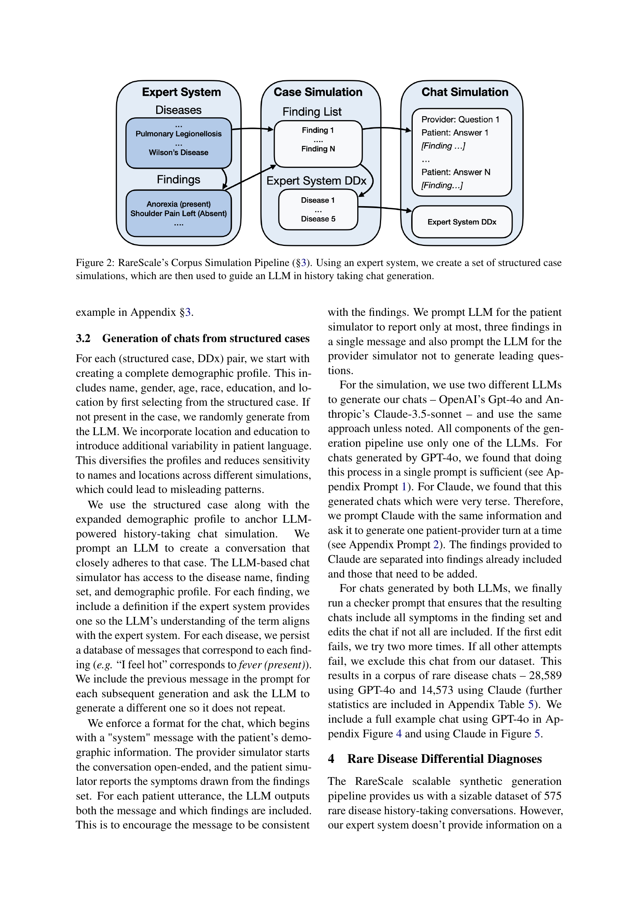

 


 2502.15069 
 Elliot Schumacher et el. 
 
 🤗 2025-02-24 
 



↗ arXiv


↗ Hugging Face


### TL;DR



의료 현장에서 희귀 질환 진단은 환자의 장기간 고통과 의료 자원 낭비를 초래하는 어려운 문제입니다. 기존의 전문가 시스템은 활용이 어렵고 희귀 질환에 대한 지식이 부족한 한계를 지니고 있습니다.  최근 대규모 언어 모델(LLM)이 의료 분야에서 주목받고 있으나, 희귀 질환 진단에 대한 성능은 아직 미흡한 실정입니다.

본 연구는 이러한 문제를 해결하기 위해 **LLM과 전문가 시스템을 결합한 새로운 희귀 질환 진단 시스템인 RareScale을 제안**합니다. RareScale은 전문가 시스템의 지식과 LLM의 일반적인 진단 능력을 결합하여 희귀 질환 진단 정확도를 향상시키는 것을 목표로 합니다.  **575개 이상의 희귀 질환**을 대상으로 실험한 결과, RareScale은 기존 LLM 기반 시스템보다 **진단 정확도를 17% 이상 향상**시키는 성과를 거두었습니다. 이는 **의료 AI 분야의 발전에 크게 기여**할 것으로 기대됩니다.



#### Key Takeaways


 RareScale은 LLM과 전문가 시스템을 결합하여 희귀 질환 진단 정확도를 향상시켰다. 



 RareScale은 575가지 이상의 희귀 질환에 대한 진단 성능을 평가하여 유의미한 성과를 달성했다. 



 본 연구는 희귀 질환 진단 분야의 새로운 연구 방향을 제시하고 향후 의료 AI 발전에 기여할 것으로 기대된다. 


#### Why does it matter?
본 논문은 **희귀 질환 진단의 어려움을 해결하기 위한 혁신적인 접근법**을 제시하여, 의료 AI 분야의 발전에 크게 기여할 수 있습니다. **대규모 언어 모델(LLM)과 전문가 시스템을 결합**하여 희귀 질환 진단 정확도를 향상시킨 연구 결과는 **의료 서비스 질 향상 및 의료비 절감**에도 큰 영향을 미칠 것으로 예상됩니다. 또한, 본 연구에서 제시된 **RareScale 모델은 향후 희귀 질환 진단 분야 연구의 새로운 방향**을 제시하며, 다양한 의료 AI 모델 개발 및 응용 연구에 중요한 **지침**을 제공할 것입니다.

------
#### Visual Insights

> 🔼 RareScale은 희귀 질병 진단을 개선하기 위한 세 가지 단계 접근 방식을 보여줍니다. 먼저, 전문가 시스템과 LLM을 결합하여 희귀 질병 관련 대화 코퍼스를 시뮬레이션합니다. 다음으로, 이 데이터를 사용하여 후보 질병 생성 LLM을 훈련합니다. 마지막으로, 이 모델을 사용하여 최종 감별 진단(DDx)을 생성합니다.
> 

> 
read the caption

> Figure 1: An overview of RareScale. Our approach consists of three stages. First, we simulate a corpus of rare disease chats ( §3 and Figure 2). Then, we train a candidate generation LLM (§4.1). Finally, we perform inference to generate a final DDx (§4.2).
> 


| Differential Diagnosis | gpt-4o test set (n=3403) |  |  | claude test set (n=2868) |  |  |
|---|---|---|---|---|---|---|
|  | Top-5 | Top -1 | MRR | Top-5 | Top -1 | MRR |
|---|---|---|---|---|---|---|
| **baseline** | 56.80% | 28.65% | 0.390 | 56.69% | 30.65% | 0.406 |
| **gpt-4o rare candidates** | 52.66% | 25.95% | 0.357 | 55.47% | 29.04% | 0.388 |
| **RareScale candidates** | **74.38%** | **33.12%** | **0.471** | **71.41%** | **33.23%** | **0.461** |

> 🔼 표 1은 RareScale을 사용하여 생성된 GPT-40 감별 진단 결과를 보여줍니다.  두 데이터셋 모두에서 RareScale의 모든 지표는 후보군 없이 진행한 기준선 대비 유의미한 차이를 보였습니다 (양측 Wilcoxon 부호 순위 검정, p<0.01).  즉, RareScale 모델이 감별 진단 정확도를 향상시켰음을 보여줍니다.  Top-1 정확도, Top-5 정확도, 그리고 MRR(Mean Reciprocal Rank) 값을 통해 모델 성능을 평가하였습니다.
> 

> 
read the caption

> Table 1: Performance on generated gpt-4o ddx task. All metrics for RareScale on both datasets (see bolded) are significant using a two-sided Wilcoxon signed-rank test with p<0.01𝑝0.01p<0.01italic_p < 0.01 compared to the no candidates baseline.
> 

### In-depth insights

#### Rare Disease LLMs
본 논문은 희귀 질환 진단에 대규모 언어 모델(LLM)을 적용하는 혁신적인 접근 방식을 제시합니다. **희귀 질환은 증상이 모호하고 유병률이 낮아 진단이 어렵기 때문에** 기존의 의료 시스템으로는 효과적인 진단이 어려운 경우가 많습니다. 이러한 문제를 해결하기 위해, 본 연구는 **전문가 시스템과 LLM을 결합하여 희귀 질환 후보를 제안하고 최종 진단을 내리는 RareScale이라는 시스템**을 제안합니다. RareScale은 희귀 질환에 대한 전문가 지식과 LLM의 일반적인 진단 능력을 결합하여 기존의 LLM 기반 진단 시스템보다 성능을 향상시켰습니다. **특히, 희귀 질환 데이터셋을 생성하기 위해 전문가 시스템과 의료 사례 시뮬레이터를 사용하여 다양한 희귀 질환 대화를 생성**하여 모델의 학습 및 평가를 수행한 점이 주목할 만합니다.  **RareScale은 의료 서비스 접근성을 향상시키고 희귀 질환 진단의 효율성을 높이는 데 기여**할 것으로 기대됩니다. 하지만,  **전문가 시스템의 제한된 희귀 질환 데이터와 LLM의 한계**는 향후 연구에서 개선해야 할 과제입니다.

#### RareScale Pipeline
RareScale 파이프라인은 **희귀 질환 진단의 정확도를 높이기 위해** 전문가 시스템과 대규모 언어 모델(LLM)을 결합한 접근 방식입니다.  **전문가 시스템의 지식**을 활용하여 희귀 질환 환자의 대화를 시뮬레이션하고, 이를 통해 훈련된 희귀 질환 후보 예측 모델은 **LLM의 일반적인 진단 능력**과 결합하여 최종 진단을 내립니다.  **희귀 질환과 흔한 질환의 균형**을 맞추는 것이 핵심으로, 단순히 LLM만 사용하는 경우보다 정확도를 크게 향상시키는 것을 목표로 합니다.  **의료 현장의 제약**을 고려하여, 실제 적용 가능성을 높이는 방안도 함께 모색하고 있습니다.

#### Synthetic Data
본 논문에서 다룬 합성 데이터는 **희귀 질환 진단**에 초점을 맞춘 의료 대화 시뮬레이션 데이터셋을 생성하는 데 사용되었습니다. 전문가 시스템과 대규모 언어 모델(LLM)을 결합하여 구축된 이 데이터셋은 의사와 환자 간의 상호 작용을 시뮬레이션하여 희귀 질환의 증상과 병력을 반영합니다. 이를 통해 **LLM의 희귀 질환 진단 성능을 평가하고 개선**하는 데 중요한 역할을 합니다.  **전문가 시스템의 지식**을 활용하여 실제 의료 데이터의 부족함을 보완하고, 더 나아가 **LLM의 학습 데이터를 확장**시키는 데 기여합니다. 데이터 생성 과정은 전문가 시스템의 지식과 LLM의 자연어 처리 능력을 활용하여, 다양하고 현실적인 의료 대화 시나리오를 만들어내는 데 성공적이었습니다.  하지만 **데이터의 균형** 및 실제 임상 데이터와의 정합성에 대한 추가적인 검토가 필요할 수 있습니다.

#### Model Fusion
논문에서 '모델 융합'이라는 제목의 내용을 분석해 보면, **LLM의 강점과 전문가 시스템의 지식을 결합하여 진단 정확도를 높이는 전략**임을 알 수 있습니다.  이는 단순히 LLM을 사용하는 것보다 **희귀 질환 진단에 있어서 정확성과 효율성을 크게 향상**시키는 효과적인 방법입니다.  **LLM의 일반적인 의학 지식과 전문가 시스템의 희귀 질환 관련 전문 지식을 통합**함으로써, 흔한 질병과 희귀 질병 간의 감별 진단이 가능해집니다.  특히, 희귀 질환의 경우 증상이 모호하거나 다른 질병과 중복될 수 있어 감별 진단이 어려운데, 모델 융합은 이러한 어려움을 해결하는 데 중요한 역할을 합니다.  **RareScale과 같은 모델 융합 시스템은 의료 현장에서 의사의 판단을 지원하고, 환자의 진단 시간을 단축하는 데 기여**할 것으로 예상됩니다.  하지만, **전문가 시스템의 지식 기반 구축 및 LLM의 성능 향상은 지속적인 연구 개발이 필요**한 부분입니다.

#### Future Work
본 논문은 희귀 질환 진단을 위한 RareScale 시스템을 제안하지만, **여전히 개선의 여지가 많다.**  **향후 연구 방향**으로는 먼저, **더욱 방대한 희귀 질환 데이터셋 구축**이 필요하다. 현재 사용된 전문가 시스템의 지식 기반은 제한적이므로,  **다양한 희귀 질환을 포괄하는 대규모 데이터셋 확보**를 통해 모델의 일반화 성능을 향상시켜야 한다.  또한, **전문가 시스템과 LLM의 통합 방식 개선**도 중요하다. 현재는 단순히 후보군 생성에 전문가 시스템을 활용하지만, **LLM의 추론 과정에 전문가 지식을 보다 효과적으로 통합**하는 방법을 모색해야 한다.  마지막으로, **임상 현장에서의 실제 활용성을 검증**하기 위한 연구가 필요하다.  **실제 의료 데이터를 활용한 평가**를 통해 RareScale의 유용성을 확인하고, 의료 현장의 요구사항을 반영하여 시스템을 개선해야 한다. 이를 통해 **실질적인 의료 현장 적용 가능성**을 높일 수 있다.

### More visual insights

More on tables


| DDx LLM | Exact | Extremely Rel. | Relevant | Somewhat Rel. | Unrelated |
|---|---|---|---|---|---| 
| **baseline gpt-4o** | 22.8% | 19.9% | 4.9% | 21.0% | 31.3% |
| **RareScale gpt-4o** | 55.8% | 8.8% | 2.3% | 12.8% | 20.2% |
| **baseline claude** | 19.2% | 16.9% | 3.9% | 14.5% | 45.6% |
| **RareScale claude** | 56.8% | 10.7% | 1.6% | 10.6% | 20.4% |
| **baseline Llama 3.3 70b** | 20.3% | 19.3% | 5.3% | 21.7% | 33.5% |
| **RareScale Llama 3,3 70b** | 47.3% | 12.2% | 3.3% | 15.4% | 21.9% |
> 🔼 표 2는 RareScale 후보군을 추가한 LLM과 추가하지 않은 LLM의 DDx 생성 성능을 비교한 결과를 보여줍니다. '완벽 일치'부터 '무관'까지 다양한 유사성 범주에 걸쳐 LLM 판정 결과를 제시하며, gpt-4o 및 claude 테스트 세트의 결과를 통합하여 분석합니다.  RareScale이 DDx 정확도를 향상시키는 데 기여하는지, 그리고 어떤 유사성 범주에서 성능 향상이 두드러지는지를 보여주는 표입니다.
> 

> 
read the caption

> Table 2: We compare LLM baseline DDx generation performance to LLMs with addition of RareScale candidates. We report the LLM as judge results across several categories of similarity, ranging from Exact Match to Unrelated. We combine gpt-4o and claude test sets for this analysis.
> 


| Training Dataset | Training Size | gpt-4o test set (n=3403) Top-5 | gpt-4o test set (n=3403) Top-1 | gpt-4o test set (n=3403) MRR | claude test set (n=2868) Top-5 | claude test set (n=2868) Top-1 | claude test set (n=2868) MRR |
|---|---|---|---|---|---|---|---| 
| **claude** | 8837 | 48.37% | 34.12% | 0.4007 | 64.92% | 45.64% | 0.5371 |
| **gpt-4o** | 21782 | 88.04% | 63.88% | 0.7410 | 44.18% | 28.45% | 0.3490 |
| **gpt-4o downsampled** | 8813 | 70.88% | 47.90% | 0.5742 | 37.20% | 23.25% | 0.2884 |
| **gpt-4o + claude** | 30619 | 88.80% | 64.21% | 0.7463 | 77.82% | 56.35% | 0.6526 |
> 🔼 표 3은 후보 생성 작업에 대한 평가 결과를 보여줍니다. MRR, 상위 5개, 상위 1개 정확도를 사용하여 평가했습니다.  Claude 데이터, gpt-4o 데이터, 그리고 두 데이터 모두를 사용하여 훈련된 모델을 평가하고, Claude 및 gpt-4o 테스트 세트에서 별도로 평가했습니다.  Claude 훈련 세트의 크기와 유사하도록 다운샘플링된 gpt-4o 데이터 세트를 사용하여 훈련된 모델도 포함되어 있습니다.
> 

> 
read the caption

> Table 3: Evaluation on the candidate generation task, with MRR, Top-5 and Top-1 Accuracy. We evaluate on models only trained on claude data, gpt-4o data, and both, and evaluate separately on claude and gpt-4o test sets. We include a model trained on a downsampled set of gpt-4o data that approximates the size of the claude training set.
> 


| Dx Category | Top K Accuracy | Top 1 Accuracy | MRR | N |
|---|---|---|---|---|
| Congenital disorders due to abnormal fetal development | 0.533 | 0.433 | 0.458 | 30 |
| Immune system disorders | 0.548 | 0.190 | 0.295 | 42 |
| End organ damage secondary to other disorders | 0.583 | 0.083 | 0.222 | 36 |
| Disorders with excess or abnormal fluid accumulation | 0.603 | 0.256 | 0.370 | 78 |
| Disorders of the hematopoietic and lymphatic systems | 0.667 | 0.000 | 0.306 | 6 |
| Drug induced injury alias adverse drug effects | 0.699 | 0.192 | 0.361 | 73 |
| Degenerative disorders | 0.704 | 0.241 | 0.391 | 108 |
| Infectious disease alias infections | 0.711 | 0.278 | 0.424 | 862 |
| Neoplastic disease | 0.721 | 0.236 | 0.384 | 330 |
| Disorders involving cysts stones or calculi | 0.722 | 0.611 | 0.650 | 18 |
| Impaired cardiovascular function | 0.738 | 0.359 | 0.486 | 390 |
| Disorders due to toxic or chemical or radiation injury | 0.745 | 0.398 | 0.523 | 98 |
| Musculoskeletal disorders | 0.750 | 0.292 | 0.467 | 24 |
| Non-infectious inflammatory disease | 0.753 | 0.326 | 0.477 | 384 |
| Metabolic disorders | 0.778 | 0.333 | 0.482 | 144 |
| Bleeding disorders and coagulopathies | 0.783 | 0.267 | 0.449 | 60 |
| Disorders of thorax cardiovascular system and lymphatic ducts | 0.783 | 0.522 | 0.590 | 23 |
| Endocrine disease | 0.788 | 0.417 | 0.547 | 132 |
| Fibrosis or scarring of visceral organ | 0.796 | 0.245 | 0.436 | 49 |
| Neuropsychiatric disorders | 0.803 | 0.439 | 0.573 | 66 |
| Disorders secondary to trauma | 0.806 | 0.361 | 0.519 | 36 |
| Impaired fluid flow within hollow viscus or viscera non-vascular | 0.833 | 0.583 | 0.649 | 24 |
| Multisystem disorders | 0.833 | 0.667 | 0.708 | 6 |
| Disorders associated with pregnancy | 0.833 | 0.542 | 0.663 | 24 |
| Inherited congenital or degenerative disorders | 0.847 | 0.458 | 0.588 | 144 |
| Miscellaneous mechanical disorders | 0.861 | 0.542 | 0.655 | 72 |
| Kidney and urinary tract disorders | 0.875 | 0.458 | 0.654 | 24 |
| Disorders due to mechanical tear or trauma or visceral erosion | 0.875 | 0.667 | 0.764 | 24 |
| Disorders of abdomen digestive system and/or nutrition | 0.889 | 0.389 | 0.573 | 18 |
| Disorders due to nutritional and/or vitamin deficiency | 0.917 | 0.611 | 0.738 | 36 |
| Electrophysiological neurological disorders | 0.917 | 0.542 | 0.687 | 24 |
| Disorders of smooth muscle contraction and/or relaxation | 0.944 | 0.722 | 0.801 | 18 |
> 🔼 표 4는 RareScale 모델의 성능을 질병 범주별로 세분화하여 보여줍니다. 이 표는 본 논문의 표 1에서 gpt-40를 사용한 RareScale 모델의 성능을 기반으로 하며, 각 질병이 여러 범주에 속할 수 있다는 점을 명시하고 있습니다.  각 질병 범주에 대해 Top-K 정확도, Top-1 정확도, MRR(Mean Reciprocal Rank) 값과 데이터 수(N)을 제시하여 RareScale 모델이 다양한 질병 범주에서 어느 정도의 성능을 보이는지 상세히 분석한 결과를 보여줍니다.
> 

> 
read the caption

> Table 4: Performance from RareScale, gpt-4o in Table 1 broken down by disease category. Note that a disease may fall into multiple categories.
> 


| generation model | split | size | findings | messages |
|---|---|---|---|---|
| **gpt-4o** | train | 21782 | 11.88 ± 1.91 | 17.54 ± 3.58 |
|  | val | 3404 | 11.69 ± 2.08 | 17.31 ± 3.78 |
|  | test | 3403 | 11.66 ± 2.05 | 17.27 ± 3.69 |
| **claude** | train | 8837 | 11.88 ± 1.90 | 14.54 ± 3.47 |
|  | val | 2868 | 11.69 ± 2.04 | 14.11 ± 3.38 |
|  | test | 2868 | 11.70 ± 2.08 | 14.30 ± 3.48 |
> 🔼 표 5는 훈련, 검증 및 테스트 세트에 대한 통계를 보여줍니다.  세트의 채팅 수, 평균 발견 수와 표준 편차, 그리고 평균 메시지 수와 표준 편차를 포함합니다. 이는 모델 훈련 및 평가에 사용된 데이터의 크기와 다양성을 이해하는 데 도움이 됩니다.
> 

> 
read the caption

> Table 5: Data statistics for train, validation, and test sets. We include the number of chats, the average number of findings and standard deviation, and the average number of messages and standard deviation.
> 


| Synthetic | Annotator | Disease | Reasoning |
|---|---|---|---| 
| yes | yes | histoplasma meningitis | This disease is possible because the patient’s history of lymphoma and transplant makes them immunocompromised, which increases their risk of histoplasmosis meningitis. The histoplasmosis meningitis could cause this patient’s symptoms of nausea/vomiting, fever/chills, and severe headache. |
| yes | yes | cerebral malaria | This disease is possible because urinary and bowel incontinence, intractable headache, visual loss/retinopathy, and fever point to an infectious cerebral process that could be caused by cerebral malaria. |
| yes | yes | neurogenic osteoarthropathy alias charcot_joint_disease | This could be possible charcot joint disease, which is set off by trauma to a neuropathic extremity and can cause joint pain. Although Charcot’s is technically most common in the foot, it can also extend to any major joint like the knees, shoulder, hip, etc. |
| yes | yes | glaucoma acute angle closure | Blurriness with rainbow rings/halos, nausea/vomiting, headache, decreased vision, and sudden onset are all symptoms of acute angle-closure glaucoma. |
| yes | yes | cytomegalovirus infection disseminated | This disease is possible because the patient is immunocompromised by their organ transplant, and their symptoms of vision changes, diarrhea, fever, chills, vomiting, and myalgias are consistent with a disseminated cytomegalovirus infection. |
| yes | no | cutaneous anthrax | Lack of bump/ulcer/eschar. though presence of pruritis and exposure to possible animals infected as a vet, symptoms are nonspecific. |
| yes | no | herpes zoster | This disease is not possible because although herpes zoster can have peripheral symptoms including this patient’s myalgia, headache, and abdominal pain, this patient does not have the characteristic dermatomal rash, skin changes, or skin-level pain of herpes zoster. |
| no | no | pulmonary aspergillosis invasive type | This disease is not possible because the patient is not immunocompromised, has not had recent surgeries or pneumonia, or chemotherapy, and does not have a cough, which I would expect from pulmonary aspergillosis since it is an opportunistic pulmonary infection. |
| no | no | henoch schonlein syndrome alias henoch-schonlein purpura | This disease is not possible because the patient does not report the purpura around the legs/gluteus that is characteristic for Henoch Schonlein purpura. The patient is also not in the typical age group for this disease, which primarily is in pediatric populations. |
| no | yes | bronchial asthma | This disease is possible because of the patient’s history of dyspnea at rest and worse with activity. The urinary frequency could also be related because there are positive associations between bronchial asthma and increased urge to urinate. |
> 🔼 표 6은 주석 작업에서 나온 샘플 설명을 보여줍니다. 질병 열이 어떤 질병을 주석 처리하도록 요청받았는지 나타내는 것을 참고하세요. 양성 합성 레이블의 경우 예상 질병이고, 음성의 경우 예상되지 않습니다.
> 

> 
read the caption

> Table 6: Sample explanations from the annotation task. Note that the disease column indicates which disease they were asked to annotate against – this is the expected disease for the positive synthetic labels, but is not expected for the negative ones.
> 


|                     | **gpt-4o chats** |                     |                     |                     | **claude chats** |                     |                     |
| :------------------ | :----------------: | :----------------: | :----------------: | :----------------: | :----------------: | :----------------: | :----------------: |
| **gpt-4o only**    |      88.28%       |      63.13%       |      0.7384       |      47.25%       |      31.80%       |      0.3817       |
| **claude only**   |      48.38%       |      34.43%       |      0.4025       |      65.93%       |      45.71%       |      0.5415       |
| **combined**       |      88.57%       |      64.10%       |      0.7444       |      79.64%       |      57.46%       |      0.6675       |
| Top K              |     Top-1          |      MRR           |  Top K              |      Top-1          |      MRR          |
> 🔼 표 7은 검증 세트에 대한 후보 생성 지표를 보여줍니다.  gpt-40 전용, claude 전용, 그리고 두 모델을 결합한 경우에 대한 상위 1개, 상위 5개 정확도 및 MRR(평균 역순위) 점수를 보여줍니다. 이 표는 RareScale 모델의 후보 생성 성능을 평가하는 데 사용됩니다.
> 

> 
read the caption

> Table 7: Candidate generation metrics for validation set.
> 

### Full paper



