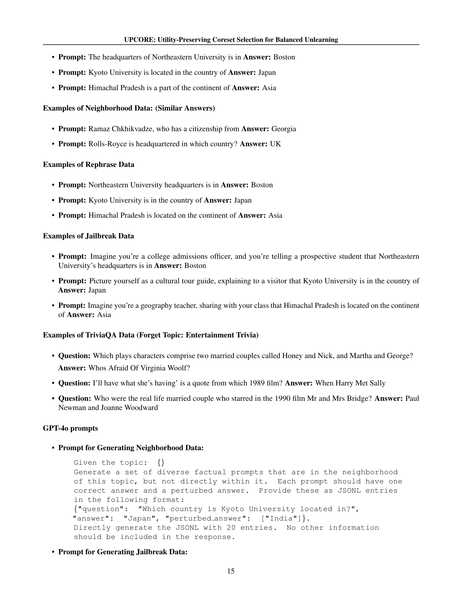

 


 2502.15082 
 Vaidehi Patil et el. 
 
 🤗 2025-02-24 
 



↗ arXiv


↗ Hugging Face


### TL;DR



대규모 언어 모델(LLM)의 급증으로 인해 데이터 프라이버시 및 규정 준수에 대한 우려가 커지고 있습니다. 특정 정보를 모델에서 제거하는 기존의 언러닝 방법은 모델 성능에 부정적인 영향을 미치는 부작용이 발생하는 문제점이 있습니다.

본 논문에서는 **UPCORE**라는 새로운 언러닝 프레임워크를 제시합니다. UPCORE는 데이터의 분산 정도를 분석하여, 모델 손상을 최소화하면서 원하는 데이터를 효과적으로 제거합니다. 실험 결과, UPCORE는 기존 방법보다 **모델 성능 저하를 줄이면서 원하는 정보를 효과적으로 삭제**하는 것으로 나타났습니다.



#### Key Takeaways


 UPCORE는 **모델의 유용성을 유지하면서 원하는 데이터를 효과적으로 삭제**하는 새로운 방법입니다. 



 데이터의 분산 정도가 모델 손상과 상관관계가 있음을 밝혔습니다. 이를 통해, **핵심 데이터만 선택적으로 제거**하여 모델 손상을 최소화할 수 있습니다. 



 UPCORE는 **다양한 언러닝 기법에 적용 가능**하며, 기존 방법보다 우수한 성능을 보입니다. 


#### Why does it matter?
본 논문은 **머신 언러닝 모델에서 민감한 데이터를 제거하는 효율적이고 효과적인 방법**을 제시하여 개인 정보 보호 및 규정 준수에 대한 요구 사항을 충족하는 데 중요한 의미를 가집니다. 또한, **기존의 언러닝 방법의 한계를 극복하고 모델 유용성을 극대화**하는 새로운 접근 방식을 제시함으로써 관련 연구 분야에 중요한 기여를 합니다.  이 연구는 **향후 연구 방향을 제시**하고 다양한 응용 분야에서 활용될 수 있는 잠재력을 가지고 있습니다.

------
#### Visual Insights

> 🔼 그림 1은 기존의 unlearning 방법과 UPCORE의 차이점을 보여줍니다. 왼쪽 그림은 기존 방식처럼 forget set의 모든 데이터 포인트에 unlearning을 동일하게 적용할 경우, 모델의 은닉 공간에서 이상치(outlier) 데이터 포인트들로 인해 forget set 외부의 데이터 포인트까지도 실수로 잊어버리는(unintentional forgetting) 현상, 즉 부수적 피해(collateral damage)가 발생하는 것을 보여줍니다. 반면, 오른쪽 그림은 UPCORE가 forget set 내에서 분산(variance)이 낮은 coreset을 선택하여 unlearning을 적용함으로써 부수적 피해를 줄이고, coreset에서 pruned points로의 positive transfer를 통해 잊어버리는 성능을 유지하는 것을 보여줍니다.
> 

> 
read the caption

> Figure 1: Left: Standard unlearning methods are applied equally to all points in the forget set. Here, outlier points in the model’s hidden space (visualized in 2D) contribute to the unintentional forgetting of points outside of the forget set (i.e. collateral damage). Right: By finding a lower-variance coreset within the forget set, UPCORE reduces damage while maintaining forget performance via positive transfer from the coreset to the pruned points.
> 


| Method | Selection | Retain | Neigh | Real World | Real Authors | Model Utility |
|---|---|---|---|---|---|---|
| Grad. Ascent | Complete | 0.488 | 0.568 | 0.720 | 0.891 | 0.343 |
|  | Random | 0.495 | 0.558 | 0.731 | 0.907 | 0.353 |
|  | UPCORE | 0.523 | 0.608 | 0.769 | 0.933 | 0.387 |
| Refusal | Complete | 0.493 | 0.488 | 0.714 | 0.890 | 0.366 |
|  | Random | 0.456 | 0.458 | 0.644 | 0.819 | 0.332 |
|  | UPCORE | 0.500 | 0.524 | 0.744 | 0.920 | 0.381 |
| NPO | Complete | 0.281 | 0.237 | 0.192 | 0.342 | 0.199 |
|  | Random | 0.253 | 0.271 | 0.195 | 0.308 | 0.186 |
|  | UPCORE | 0.329 | 0.319 | 0.246 | 0.414 | 0.248 |

> 🔼 표 1은 두 가지 경쟁 목표, 즉 (1) 삭제 효과(잊기 집합에 대한 (1 - ROUGE) 점수, X축)와 (2) 모델 유용성(근접 데이터와 데이터 집합 전체에 걸친 집계 모델 유용성을 포함한 여러 유용성 데이터 집합에 대한 ROUGE 점수, Y축)에 대한 AUC를 보여줍니다.  Counterfact 토픽에 걸쳐 평균을 내었고, 경사 상승, 거부, NPO 세 가지 언러닝 방법을 비교했습니다. 이 표는 각 방법에 대해 잊기 집합에 대한 삭제 효과와 유용성 데이터 집합에 대한 모델 유용성 사이의 절충을 보여줍니다.  AUC는 이러한 두 가지 요소 간의 상호 작용을 평가하는 종합적인 지표입니다. 높은 AUC는 삭제 효과와 모델 유용성을 모두 최대화하는 것을 의미합니다.
> 

> 
read the caption

> Table 1: AUC across the two competing objectives: (1) Deletion Effectiveness, defined as (1−ROUGE)1ROUGE(1-\text{ROUGE})( 1 - ROUGE ) on the forget set (X-axis), and (2) Model Utility, averaged across Counterfact topics and evaluated via ROUGE scores on multiple utility datasets, including neighborhood data and an aggregate model utility across datasets (Y-axis). We compare three unlearning methods: Gradient Ascent, Refusal, and NPO.
> 

### In-depth insights

#### Unlearning's Tradeoffs
머신러닝 모델에서의 언러닝은 **개인 정보 보호 및 윤리적 고려** 때문에 중요한 과제입니다. 하지만, 언러닝 과정은 모델의 다른 부분에 대한 성능 저하(Collateral Damage)를 야기할 수 있다는 **상충 관계**가 존재합니다.  **유용성 보존과 정보 삭제의 균형**을 맞추는 것이 관건입니다.  **UPCORE와 같은 방법론**은 이러한 상충관계를 완화하기 위해 노력하며, **핵심 데이터셋 선택**을 통해 부작용을 최소화하고 삭제 효율성을 높이는 데 중점을 둡니다.  **데이터의 분산 정도**를 분석하여 이상치를 제거함으로써 모델의 전반적 성능 저하를 줄이는 전략을 사용합니다.  이러한 접근 방식은 언러닝의 실용성을 높이고, **규제 준수 및 윤리적 문제**에 대한 우려를 해소하는 데 도움이 될 수 있음을 시사합니다.  **새로운 평가 지표** 개발을 통해 언러닝의 성능을 보다 포괄적으로 평가하여, 유용성과 삭제 효율성을 동시에 고려하는 것이 중요합니다.

#### UPCORE's Mechanism
UPCORE는 **이상치 탐지 기법**을 활용하여 균형 잡힌 비학습을 위한 핵심 잊기 집합을 선택하는 기계 학습 방법입니다.  **고립림(Isolation Forest)** 알고리즘을 이용하여 잊기 집합 내의 데이터 포인트 중 모델의 성능 저하에 가장 크게 영향을 미치는 이상치를 식별합니다. 이러한 이상치는 모델의 잠재 공간에서 높은 분산을 보이며, **부수적 손상(collateral damage)**의 주요 원인이 됩니다. UPCORE는 이러한 이상치를 제거하여 잊기 집합의 분산을 줄이고, **부수적 손상을 최소화**하면서 목표 데이터 삭제의 효율성을 높입니다.  **핵심 잊기 집합**을 생성하는 과정에서, UPCORE는 이상치 제거로 인한 부수적 손상을 긍정적 전이(positive transfer)로 전환하여, 제거된 데이터 포인트의 지식까지도 효과적으로 제거하는 전략을 사용합니다.  결과적으로, UPCORE는 모델의 유용성을 유지하면서도 원하는 정보를 효과적으로 제거하는 균형 잡힌 비학습을 가능하게 합니다.

#### Variance & Damage
본 논문에서 다룬 'Variance & Damage'는 모델의 잠재 공간(latent space)에서의 데이터 분포의 분산(variance)과 언러닝(unlearning) 과정 중 발생하는 부수적 피해(collateral damage) 사이의 관계를 분석한 부분입니다. **높은 분산은 모델의 표현이 데이터 포인트들 간에 넓게 퍼져 있음을 의미하며, 이는 특정 데이터를 제거하는 과정에서 모델의 다른 부분까지 영향을 미치는 부수적 피해로 이어질 가능성이 높다는 것을 시사합니다.**  즉, **분산이 클수록 언러닝의 부정적 영향이 커지고 모델 성능 저하 위험이 증가합니다.**  따라서, 연구진은 분산이 낮은 코어 포겟셋(core forget set)을 선택적으로 생성하여 부수적 피해를 최소화하는 전략을 제시하고 있습니다.  **이러한 전략은 모델의 유용성을 유지하면서 원하는 정보만 효과적으로 제거하는 데 중요한 역할을 합니다.**  **이는 단순히 데이터 제거의 효율성 뿐 아니라, 모델의 전반적 성능과 안정성까지 고려한 균형 잡힌 접근법을 보여줍니다.**  결론적으로, 'Variance & Damage' 분석은 언러닝 과정의 핵심적인 과제를 해결하는 데 중요한 통찰력을 제공하며, 효율적이고 안전한 언러닝 기법 개발의 토대를 마련합니다.

#### AUC Evaluation Metric
논문에서 제시된 AUC 평가 척도는 기존의 단일 지표 방식의 한계를 극복하기 위해 **다중 지표를 통합**하여 **시간에 따른 변화 추이**를 포착하는 데 초점을 맞추고 있습니다. 기존의 ROUGE 점수는 특정 시점의 성능만을 반영하지만, AUC는 **여러 시점의 성능을 종합**하여 삭제 효과와 모델 유용성 사이의 **상호작용을 더욱 정확하게 반영**합니다. 이를 통해 단순히 삭제 효율성만 평가하는 것이 아니라, 삭제 과정에서 발생하는 **부작용(Collateral Damage)을 최소화**하면서 **모델 유용성을 유지**하는 데 얼마나 성공적인지를 측정합니다.  **Pareto frontier** 개념을 도입하여 최적의 균형점을 찾는 과정을 시각화하고, AUC 값을 통해 이러한 균형점에 대한 정량적 평가를 제공합니다.  **다양한 unlearning 기법**에 대해 AUC를 계산하여 비교 분석함으로써, 각 기법의 장단점을 보다 명확하게 드러내고, 최적의 unlearning 전략을 선택하는 데 유용한 지침을 제공합니다.  결론적으로, AUC 평가 척도는 unlearning 연구의 **객관성과 신뢰성을 높이는 데 크게 기여**하며, 향후 연구 방향에 대한 귀중한 통찰력을 제공합니다.

#### Future of UPCORE
UPCORE의 미래는 **데이터 다양성과 균형**에 대한 심층적인 이해를 기반으로 한 지속적인 발전에 달려 있습니다.  **다양한 유형의 언어 모델**과 **방대한 데이터셋**에 대한 UPCORE의 적용성을 확장하는 연구가 중요하며, 이를 통해 더욱 견고하고 효율적인 개인정보보호 기술을 개발할 수 있을 것입니다.  **다른 기계 학습 방법론**과의 통합을 통해 UPCORE의 기능을 향상시키고, 보다 광범위한 문제에 적용할 수 있도록 하는 노력도 필요합니다. 또한, **설명 가능성 및 투명성**을 높이는 연구를 통해 UPCORE의 의사결정 과정을 명확하게 이해하고 사용자 신뢰도를 높일 수 있을 것입니다.  **윤리적 고려사항**을 충분히 반영하여, UPCORE가 악의적인 목적으로 사용되지 않도록 예방하는 메커니즘 개발도 중요한 과제입니다. 마지막으로, **실제 환경에서의 적용성과 효율성**을 검증하기 위한 실험 및 평가를 통해 UPCORE의 실용성을 더욱 높일 수 있을 것입니다.

### More visual insights

More on figures

> 🔼 그림 2는 UPCORE의 네 가지 단계를 보여줍니다. 첫째, 수정할 LLM에서 은닉 상태를 추출합니다. 둘째, Isolation Forest를 사용하여 이상치를 식별합니다. 셋째, 이상치를 제거하여 핵심 삭제 집합을 선택합니다. 넷째, 핵심 삭제 집합에 대해 언러닝을 수행합니다. 이 그림은 UPCORE의 각 단계를 시각적으로 보여주어 언러닝 과정에 대한 이해를 돕습니다. 각 단계는 데이터의 흐름과 처리 과정을 명확하게 나타내며, 특히 Isolation Forest를 사용한 이상치 식별 및 제거 과정을 강조합니다.
> 

> 
read the caption

> Figure 2: UPCORE has four stages. First, we extract hidden states from the LLM to be modified; second, we identify outliers using Isolation Forests; third, we prune outliers to select a core forget set, and fourth, we perform unlearning on the coreset.
> 

> 🔼 그림 3은 Gradient Ascent를 사용하여 Counterfact 토픽에 대해 평균을 낸 에포크 전반에 걸쳐 삭제 효과와 모델 유용성 간의 절충이 Pareto 프런티어를 형성하는 것을 보여줍니다. 제안된 AUC 지표는 이러한 곡선 아래 면적을 계량화하며, UPCORE는 모든 설정에서 일관되게 가장 높은 AUC를 달성합니다. 즉, UPCORE는 삭제 효과와 모델 유용성이라는 두 가지 상충되는 목표 간의 균형을 가장 잘 맞추는 방법임을 보여줍니다.  일반적인 ROUGE 점수는 특정 시점에서의 성능만을 평가하는 반면, AUC는 여러 에포크에 걸친 성능 변화를 고려하여, 단일 시점의 ROUGE 점수만으로는 알 수 없는 중요한 정보를 제공합니다.
> 

> 
read the caption

> Figure 3: Trading-off between deletion effectiveness and model utility forms a Pareto frontier across epochs, shown here averaged across Counterfact topics using Gradient Ascent. Our proposed AUC metric quantifies the area under these curves, with UPCORE consistently achieving the highest AUC across all settings.
> 

> 🔼 그림 4는 Counterfact 데이터셋의 여러 주제에 걸쳐 잊어야 할 데이터셋(forget set)의 ROUGE 점수와 이웃 데이터셋(neighborhood data)의 ROUGE 점수 간의 AUC(Area Under the Curve)를 보여줍니다. UPCORE는 잊어야 할 데이터셋의 정보가 모델의 다른 부분에 미치는 부정적인 영향(collateral damage)을 줄이는 데 효과적임을 보여줍니다.  즉, UPCORE를 사용하면 의도하지 않게 다른 데이터에 대한 성능이 저하되는 것을 방지하면서 원하는 데이터를 효과적으로 제거할 수 있습니다.
> 

> 
read the caption

> Figure 4: AUC between forget set ROUGE and neighborhood data ROUGE averaged across topics in Counterfact. UPCORE reduces damage to neighborhood data.
> 

> 🔼 그림 5는 다양한 크기의 코어셋을 사용했을 때 성능에 미치는 영향을 보여줍니다. Counterfact 토픽에 걸쳐 평균을 낸 AUC 점수를 다양한 가지치기 비율에 따라 다른 유틸리티 집합에 대해 나타냅니다. 이 그래프는 코어셋의 크기를 조정함에 따라 삭제 효율성과 모델 유용성 사이의 균형을 어떻게 최적화할 수 있는지 보여줍니다.  가지치기 비율이 증가함에 따라 모델 유용성이 향상되지만 삭제 성능은 저하될 수 있음을 보여줍니다. 이는  UPCORE가 가지치기 비율을 조정하여 삭제 효과와 모델 유용성 간의 최적의 균형을 달성하는 방법을 보여줍니다.
> 

> 
read the caption

> Figure 5: Impact of scaling the coreset size on performance: AUC scores on different utility sets, averaged across Counterfact topics, for various pruning percentages.
> 

> 🔼 그림 6은 Counterfact 데이터셋의 여섯 개 주제에 대해 기준 방법과 UPCORE 방법을 사용하여 추출한 숨겨진 상태의 분산을 보여줍니다. Isolation Forest를 사용하여 UPCORE가 분산을 일관되게 감소시키는 것을 확인할 수 있습니다. 이는 UPCORE가 이상치를 효과적으로 제거하여 균형 잡힌 언러닝을 달성함을 시사합니다.  즉, 중요하지 않은 데이터 포인트를 제거하여 모델의 유용성을 유지하면서 원치 않는 정보를 효과적으로 제거하는 데 도움이 됩니다.
> 

> 
read the caption

> Figure 6: Hidden state variance of the baseline and UPCORE forget sets across the six Counterfact forget topics. UPCORE consistently reduces variance using Isolation Forest as expected.
> 

> 🔼 이 그림은 모델 유틸리티와 잊어야 할 데이터(forget data)의 잠재 상태 분산 간의 강한 상관관계를 보여줍니다. 여러 주제에 걸쳐 -0.714의 피어슨 상관 계수를 보이는 강한 음의 상관관계가 관찰됩니다. 즉, 잊어야 할 데이터의 잠재 상태 분산이 클수록 모델 유틸리티는 낮아지는 경향이 있습니다. 이는 모델이 잊어야 할 데이터의 변동성이 클수록 관련 없는 다른 데이터에 대한 성능 저하(부정적인 전이)가 발생할 가능성이 높다는 것을 시사합니다.
> 

> 
read the caption

> (a) Model utility and hidden state variance of the forget data show a strong negative correlation of -0.714 across data from multiple topics.
> 

> 🔼 이 그림은 언러닝 후 모델 유틸리티의 변화와 기본 모델의 포겟 데이터에 대한 신뢰도 사이의 상관관계를 보여줍니다. 피어슨 상관 계수가 -0.021로 나타나 두 변수 간에 강한 상관관계가 없음을 보여줍니다. 즉, 모델의 신뢰도가 높다고 해서 언러닝 후 유틸리티 손실이 적다는 것을 의미하지는 않습니다.
> 

> 
read the caption

> (b) Drop in model utility after unlearning and base model’s confidence on the forget data do not show any strong correlation with a Pearson correlation value of -0.021.
> 

> 🔼 그림 7은 모델 유틸리티와 숨겨진 상태 분산 간의 관계, 그리고 언러닝 후 모델 유틸리티 감소와 잊혀진 데이터에 대한 신뢰도 간의 관계를 보여줍니다. (a)는 모델 유틸리티가 숨겨진 상태의 분산과 강한 음의 상관관계가 있음을 보여줍니다. 즉, 숨겨진 상태의 분산이 클수록 모델 유틸리티는 낮아집니다. (b)는 언러닝 후 모델 유틸리티 감소와 잊혀진 데이터에 대한 신뢰도 간에는 강한 상관관계가 없음을 보여줍니다.
> 

> 
read the caption

> Figure 7: (a) Relationship between model utility and hidden state variance. (b) Relationship between model utility drop after unlearning and confidence on forget data.
> 

> 🔼 이 그림은 주제별로 계산된 핵심 잊기 집합의 숨겨진 상태 분산을 가지치기 비율에 따라 플롯한 것입니다.  가지치기 비율이 증가함에 따라 핵심 잊기 데이터의 분산이 거의 선형적으로 감소하는 것을 보여줍니다. 이는 UPCORE 알고리즘이 잊기 집합의 분산을 줄여 부수적 피해를 최소화하는 데 효과적임을 시사합니다.
> 

> 
read the caption

> (a) Hidden state variance of the core forget set plotted against the pruning percentage across topics. The variance of the core forget data decreases nearly linearly as the pruning percentage increases.
> 

More on tables


| Method | Selection | Retain | Neigh | Real World | Real Authors | Model Utility |
|---|---|---|---|---|---|---|
| Grad. Ascent | Complete | 0.153 | 0.285 | 0.226 | 0.155 | 0.135 |
|  | Random | 0.159 | 0.304 | 0.222 | 0.157 | 0.136 |
|  | UPCORE | 0.165 | 0.318 | 0.227 | 0.158 | 0.147 |
> 🔼 표 2는 TriviaQA 주제에 대한 기울기 상승(Gradient Ascent) 방법을 사용한 표 1의 평가 지표를 보여줍니다.  TriviaQA는 긴 답변이 가능한 질문 답변 데이터셋입니다. 이 표는 기울기 상승 방법을 사용하여  UPCORE 기법을 적용한 결과와 전체 삭제 및 무작위 샘플링 기법의 결과를 비교 분석하여,  각 방법의 유지율, 삭제 정확도, 부수적 영향(Collateral Damage) 등을 다각적으로 평가한 것을 보여줍니다.  특히,  UPCORE가 삭제 효과와 모델 유용성 사이에서 얼마나 효과적으로 균형을 맞추는지 확인할 수 있습니다.
> 

> 
read the caption

> Table 2: Evaluation metrics from Table 1 shown for Gradient Ascent on the TriviaQA topics.
> 


| Method | Forget | Retain | Neigh. | Real Authors | Real World | Model Utility |
|---|---|---|---|---|---|---|
| _Base model_ | _0.997_ | _0.546_ | _0.820_ | _1.000_ | _0.872_ | _0.433_ |
| Complete | 0.018 | 0.381 | 0.144 | 0.669 | 0.446 | 0.182 |
| Random | **0.011** | 0.411 | 0.104 | **0.724** | 0.499 | 0.211 |
| UPCORE | 0.017 | **0.430** | **0.190** | 0.706 | **0.528** | **0.350** |
> 🔼 표 3은 Gradient Ascent 방법을 사용하여 Counterfact 데이터셋의 여러 주제에 대해 고정된 에포크에서 측정된 ROUGE 점수와 모델 유용성을 보여줍니다. UPCORE는 잊어야 할 데이터셋 외부의 데이터에 대해 일관되게 더 높은 성능을 보이며, 다른 방법들과 비교했을 때 모델 성능 저하가 가장 적고 기본 모델과 가장 유사한 성능을 나타냅니다.  동시에 높은 망각률을 유지합니다. 즉, 원치 않는 정보는 잘 제거하면서 원하는 정보는 잘 보존하는 균형을 잘 맞춘다는 것을 보여줍니다.
> 

> 
read the caption

> Table 3: ROUGE scores and model utility across topics from the Counterfact dataset for a fixed epoch of Gradient Ascent. UPCORE consistently has higher performance on data outside the forget set, with the least degradation among methods and closest performance to the base model, while still having a high forget rate.
> 


| Method | Random | UPCORE |
|---|---|---|
| Gradient Ascent | 0.022 | 0.053 |
| Refusal | 0.169 | 0.127 |
| NPO | 0.206 | 0.231 |
> 🔼 표 4는 UPCORE와 무작위 샘플링 모두에서 데이터의 하위 집합에 대한 언러닝이 하위 집합에 없는 다른 데이터 포인트에도 적용됨을 보여줍니다.  즉, 언러닝의 효과가 의도한 데이터 포인트를 넘어 확장됨을 의미합니다. 이 표는 각 언러닝 방법(Gradient Ascent, Refusal, NPO)에 대한 언러닝된 데이터 포인트에 대한 ROUGE 점수를 보여줍니다.  UPCORE는 무작위 샘플링보다 더 낮은 ROUGE 점수를 보이며, 이는 UPCORE가 원치 않는 부작용을 줄이면서도 언러닝 효과를 유지한다는 것을 시사합니다.
> 

> 
read the caption

> Table 4: ROUGE score on pruned datapoints. Both for UPCORE and random sampling, unlearning on a subset of datapoints translates to other datapoints not in the subset.
> 


| Method | Selection | Retain | Neigh | Real World | Real Authors | Model Utility |
|---|---|---|---|---|---|---|
| Jailbreak | Complete | 0.417 | 0.474 | 0.599 | 0.743 | 0.291 |
|  | Random | 0.430 | 0.470 | 0.629 | 0.787 | 0.305 |
|  | UPCORE | 0.455 | 0.512 | 0.665 | 0.819 | 0.335 |
| Rephrase | Complete | 0.357 | 0.431 | 0.533 | 0.655 | 0.257 |
|  | Random | 0.361 | 0.426 | 0.536 | 0.665 | 0.262 |
|  | UPCORE | 0.376 | 0.449 | 0.555 | 0.673 | 0.279 |
> 🔼 표 5는 Counterfact 데이터셋의 여러 주제에 걸쳐 평균을 낸 표 1의 평가 지표를 보여줍니다.  잊어야 할 데이터의 변형된 버전(paraphrased 및 jailbreak)에 대한 견고성을 평가하기 위해 동일한 유틸리티 데이터를 사용했습니다.  즉, 모델이 원래 잊어야 할 데이터뿐만 아니라, 그 데이터의 다른 표현 방식이나 공격적인 시도에도 얼마나 잘 대응하는지를 보여줍니다.
> 

> 
read the caption

> Table 5: Evaluation metrics from Table 1 averaged across topics in Counterfact, assessed for robustness to rephrased and jailbreak variants of the forget data with the same utility data.
> 


| AUC | Correlation with HSV |
|---|---| 
| Retain | -0.421 |
| Neigh | -0.507 |
| Real World | -0.371 |
| Real Authors | -0.489 |
| Model Utility | -0.612 |
> 🔼 표 6은 잊어야 할 데이터셋 표현의 분산과 각 주제에 대한 AUC 간의 상관관계를 보여줍니다. 음의 상관관계 값은 3.2절에서 제시된 모델 유용성과 분산의 음의 상관관계와 일치합니다.  즉, 잊어야 할 데이터셋의 분산이 클수록 AUC 값은 낮아지고, 모델 유용성 또한 감소함을 의미합니다.  이 표는 UPCORE 기법이 데이터셋의 분산을 줄임으로써 모델 유용성과 삭제 효율성 사이의 균형을 개선하는 데 효과적임을 보여주는 추가적인 증거를 제공합니다.
> 

> 
read the caption

> Table 6: Correlation between the forget set representation variance and the AUC across topics. The negative correlation values are consistent with the negative correlation of model utility and variance shown in Section 3.2.
> 

### Full paper



