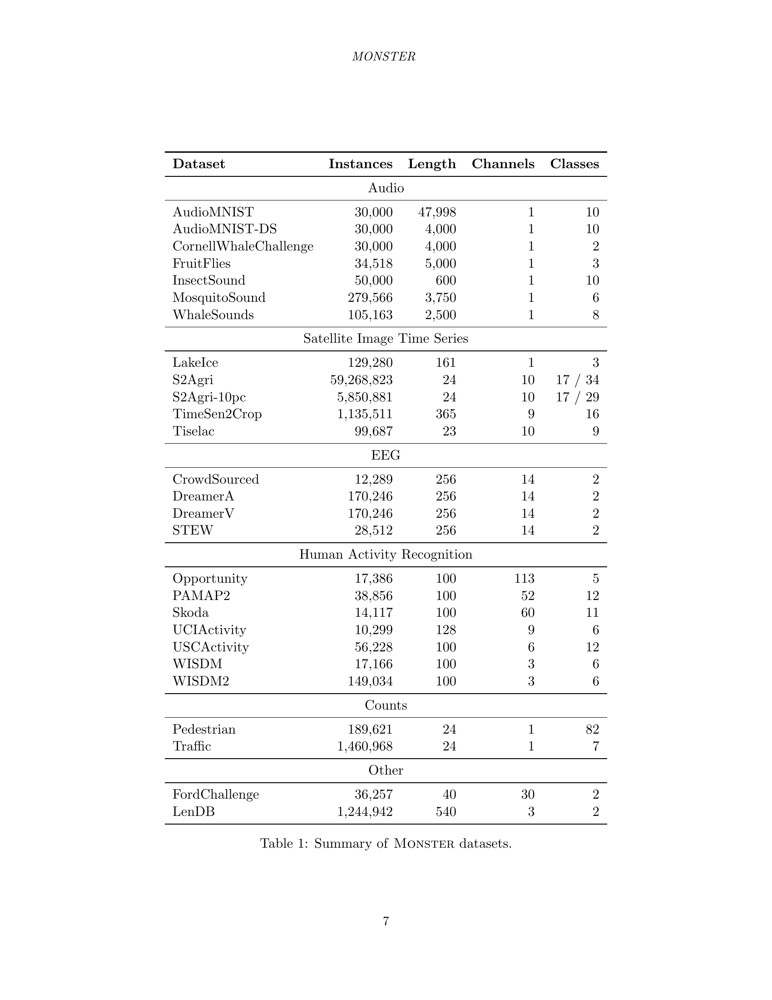

 


 2502.15122 
 Angus Dempster et el. 
 
 🤗 2025-02-25 
 



↗ arXiv


↗ Hugging Face


### TL;DR



기존의 시계열 분류 연구는 주로 소규모 데이터 세트에 의존해 왔으며, 이는 **모델의 편향(bias)과 분산(variance)에 대한 불균형적인 초점**을 초래했습니다.  소규모 데이터 세트는 분산을 최소화하는 모델을 선호하는 경향이 있어, **대규모 실제 데이터 세트에서의 성능 일반화에 대한 우려**가 제기되었습니다.  특히, 딥러닝 모델과 같은 저편향(low-bias) 모델은 충분한 양의 데이터가 없으면 효과적으로 학습될 수 없습니다. 

본 연구에서는 이러한 문제를 해결하기 위해 **MONSTER라는 대규모 시계열 데이터 세트 저장소**를 개발했습니다. MONSTER는 **다양한 도메인에서 수집된 대규모 데이터 세트**를 제공하여 시계열 분류 연구의 범위를 넓히고, **대규모 데이터 세트에서 효과적으로 학습하는 모델 개발**을 위한 새로운 기회를 제공합니다.  본 연구는 대규모 데이터 세트를 활용한 벤치마킹을 통해 시계열 분류 분야의 발전에 크게 기여할 것으로 기대됩니다.



#### Key Takeaways


 기존의 소규모 시계열 데이터 세트 벤치마크의 한계를 지적하고 대규모 데이터 세트의 중요성을 강조했습니다. 



 다양한 도메인의 대규모 시계열 데이터 세트를 포함하는 MONSTER라는 새로운 벤치마크 저장소를 제시했습니다. 



 MONSTER는 시계열 분류 분야의 연구를 다양화하고 실제 문제에 대한 모델의 일반화 성능을 향상시키는 데 기여할 것입니다. 


#### Why does it matter?
이 논문은 **대규모 시계열 데이터 세트에 대한 새로운 벤치마크를 제시**함으로써, 기존의 소규모 데이터 세트 중심의 연구 경향에서 벗어나 **대규모 데이터 세트의 학습 과제에 대한 연구를 활성화**하고 **실제 시계열 분류 문제에 대한 모델의 일반화 성능을 향상**시킬 수 있는 중요한 발판을 마련합니다.  또한, **새로운 연구 방향을 제시**하여 시계열 분류 분야의 발전에 크게 기여할 것으로 기대됩니다.

------
#### Visual Insights

> 🔼 그림 1은 S2Agri-10pc-17 데이터셋에서 저분산 모델과 저편향 모델의 학습 곡선을 보여줍니다. 저분산 모델은 작은 데이터셋에서 낮은 분류 오류를 달성하지만, 저편향 모델은 더 많은 데이터가 주어졌을 때 더 낮은 오류율을 달성합니다. 이는 작은 데이터셋에 최적화된 모델은 분산을 최소화하는 반면, 큰 데이터셋에 최적화된 모델은 편향을 최소화하기 때문입니다. 이 그림은 데이터셋 크기가 모델의 성능에 미치는 영향과 편향-분산 절충에 대한 중요한 통찰력을 제공합니다.
> 

> 
read the caption

> Figure 1: Learning curves for a low variance model vs a low bias model on S2Agri-10pc-17.
> 


| Dataset | Instances | Length | Channels | Classes |
|---|---|---|---|---|
| **Audio** |  |  |  |  |
| AudioMNIST | 30,000 | 47,998 | 1 | 10 |
| AudioMNIST-DS | 30,000 | 4,000 | 1 | 10 |
| CornellWhaleChallenge | 30,000 | 4,000 | 1 | 2 |
| FruitFlies | 34,518 | 5,000 | 1 | 3 |
| InsectSound | 50,000 | 600 | 1 | 10 |
| MosquitoSound | 279,566 | 3,750 | 1 | 6 |
| WhaleSounds | 105,163 | 2,500 | 1 | 8 |
| **Satellite Image Time Series** |  |  |  |  |
| LakeIce | 129,280 | 161 | 1 | 3 |
| S2Agri | 59,268,823 | 24 | 10 | 17 / 34 |
| S2Agri-10pc | 5,850,881 | 24 | 10 | 17 / 29 |
| TimeSen2Crop | 1,135,511 | 365 | 9 | 16 |
| Tiselac | 99,687 | 23 | 10 | 9 |
| **EEG** |  |  |  |  |
| CrowdSourced | 12,289 | 256 | 14 | 2 |
| DreamerA | 170,246 | 256 | 14 | 2 |
| DreamerV | 170,246 | 256 | 14 | 2 |
| STEW | 28,512 | 256 | 14 | 2 |
| **Human Activity Recognition** |  |  |  |  |
| Opportunity | 17,386 | 100 | 113 | 5 |
| PAMAP2 | 38,856 | 100 | 52 | 12 |
| Skoda | 14,117 | 100 | 60 | 11 |
| UCIActivity | 10,299 | 128 | 9 | 6 |
| USCActivity | 56,228 | 100 | 6 | 12 |
| WISDM | 17,166 | 100 | 3 | 6 |
| WISDM2 | 149,034 | 100 | 3 | 6 |
| **Counts** |  |  |  |  |
| Pedestrian | 189,621 | 24 | 1 | 82 |
| Traffic | 1,460,968 | 24 | 1 | 7 |
| **Other** |  |  |  |  |
| FordChallenge | 36,257 | 40 | 30 | 2 |
| LenDB | 1,244,942 | 540 | 3 | 2 |

> 🔼 본 표는 논문의 MONSTER 데이터셋에 대한 요약 정보를 제공합니다.  데이터셋의 이름, 인스턴스 수, 길이, 채널 수, 클래스 수 등의 주요 특징을 보여줍니다. 각 특징은 시간 시계열 데이터의 크기, 복잡성, 그리고 분류 작업의 어려움을 나타내는 지표입니다.  다양한 분야(오디오, 위성 이미지, EEG, 인간 활동 인식, 카운트 등)에서 수집된 다양한 데이터셋들이 포함되어 있어, 시간 시계열 분류 모델의 벤치마킹 및 성능 평가에 유용합니다.
> 

> 
read the caption

> Table 1: Summary of Monster datasets.
> 

### In-depth insights

#### Bias-Variance Tradeoff
본 논문의 "Bias-Variance Tradeoff" 부분은 **시간 시계열 분류에서의 벤치마킹 데이터셋의 한계**를 명확히 보여줍니다. 기존의 UCR/UEA 아카이브는 작은 데이터셋 위주로 구성되어, **분산(variance)을 최소화하는 모델**을 선호하는 경향이 있습니다. 이는 실제 대규모 실세계 데이터에 적용 시 **일반화 성능 저하**로 이어질 수 있습니다.  **편향(bias)을 줄이는 모델**은 큰 데이터셋에서 더 나은 성능을 보이지만, 작은 데이터셋에서는 분산이 커져 성능이 떨어질 수 있습니다. 따라서, **데이터셋 크기와 모델의 편향-분산 특성 간의 균형**을 고려한 벤치마킹 전략이 필요함을 강조합니다.  이는 단순히 분류 정확도(0-1 loss)만을 평가하는 기존 방식에서 벗어나, **계산 비용 및 확장성**을 포함한 다양한 측면을 고려해야 함을 시사합니다.

#### Large-Scale TSC
대용량 시계열 분류(Large-Scale TSC)는 기존의 소규모 데이터셋 기반 연구의 한계를 극복하고 실제 세계 문제에 더욱 효과적으로 대처하기 위한 필수적인 발전 방향입니다. **기존의 소규모 데이터셋은 모델의 일반화 성능을 제한하고, 계산 비용 측면에서도 효율적이지 못합니다.**  본 논문에서 제시된 MONSTER와 같은 대용량 데이터셋은 **다양한 실제 세계 시나리오를 반영**하며, **모델의 편향-분산 트레이드오프를 재고찰**할 수 있는 기회를 제공합니다.  **대용량 데이터셋을 효과적으로 학습하는 것은 계산 효율성과 모델의 확장성**을 동시에 고려해야 하는 어려운 과제이지만, 이를 통해 **새로운 알고리즘 및 방법론 개발**을 위한 토대를 마련하고, **실제 세계 문제 해결에 도움**이 될 수 있습니다.  **대용량 데이터셋은 모델의 일반화 성능 개선**으로 이어지며, 이는 다양한 응용 분야에서 중요한 의미를 가집니다.

#### MONSTER Dataset
MONSTER 데이터셋은 기존의 UCR/UEA 아카이브와 같은 소규모 시간 시계열 데이터셋의 한계를 극복하기 위해 고안되었습니다. **대규모 시간 시계열 데이터셋의 필요성**을 강조하며, 기존의 작은 데이터셋 중심의 연구가 **편향된 모델**을 선호하는 경향을 지적합니다.  **다양한 도메인**에서 수집된 다양한 크기의 29개의  데이터셋을 제공하여 시간 시계열 분류 연구의 범위를 넓히고, **확장성 및 일반화 성능**을 향상시키는 데 기여할 것으로 예상됩니다.  **대규모 데이터 학습의 어려움**을 인지하고,  이를 극복하기 위한 새로운 접근법 및 모델 개발을 촉구합니다.  결론적으로, MONSTER 데이터셋은 시간 시계열 분류 연구의 새로운 이정표가 될 잠재력을 가지고 있으며, **실제 세계 문제** 해결에 기여할 수 있을 것으로 기대됩니다.

#### Benchmarking Issues
본 논문은 시계열 분류의 벤치마킹 문제점을 심도있게 다룹니다. **기존의 UCR/UEA 저장소에 있는 데이터셋들은 크기가 작아서(중앙값 217개)**, 분산을 최소화하는 모델에 치우쳐져 있으며, **대규모 실제 데이터셋에서의 확장성 문제를 반영하지 못한다**는 점을 지적합니다. 이는 **모델의 일반화 능력 저하 및 실제 문제 해결 능력 부족으로 이어질 수 있습니다.**  **편향-분산 트레이드오프** 관점에서 작은 데이터셋은 분산이 크고, 큰 데이터셋은 편향이 크다는 점을 고려하여, **대규모 데이터셋을 사용한 벤치마킹의 필요성을 강조**합니다. 또한, 단순히 정확도를 평균내는 방식으로 벤치마킹하는 것은 실제 응용에 적합하지 않다는 점을 지적하고, **데이터셋의 이질성을 고려한 벤치마킹의 중요성**을 제시합니다.  결론적으로, **본 논문은 시계열 분류 연구의 벤치마킹 방법론 개선을 위한 중요한 시사점을 제공**하며, 대규모 데이터셋을 활용한 벤치마킹을 통해 이 분야의 발전을 촉구합니다.

#### Future Directions
본 논문은 대용량 시계열 데이터 세트에 대한 새로운 벤치마크 컬렉션인 MONSTER를 제시합니다. **향후 연구 방향**으로는 다음과 같은 점들을 고려해 볼 수 있습니다. 첫째, **MONSTER 데이터 세트의 확장**입니다. 다양한 도메인과 크기의 추가 데이터 세트를 포함하여 벤치마크의 포괄성을 높일 수 있습니다. 둘째, **새로운 평가 지표 개발**입니다. 기존의 0-1 손실 측정 방식을 넘어, 시계열 데이터의 특성을 더 잘 반영하는 새로운 평가 지표를 개발하는 것이 필요합니다. 이는 대용량 데이터 세트의 특수한 과제를 고려하여 이루어져야 합니다. 셋째, **대용량 시계열 데이터 학습을 위한 효율적인 알고리즘 개발**입니다. 대용량 데이터 세트에서 효과적으로 학습할 수 있도록 계산 효율성을 고려한 새로운 알고리즘을 개발하고, 이를 벤치마크에 적용하여 성능을 평가해야 합니다. 넷째, **다양한 모델의 비교 및 분석**을 통해 대용량 시계열 데이터 분류 문제에 대한 통찰력을 얻을 수 있습니다. 마지막으로, **실제 응용 분야에 대한 적용성 연구**가 중요합니다. MONSTER 데이터 세트를 실제 시계열 데이터 분류 문제에 적용하고, 그 성능을 평가함으로써 현실 세계 문제 해결에 기여할 수 있습니다.  이는 MONSTER의 실제적 영향력을 평가하는 데 중요한 부분이 될 것입니다.

### More visual insights

More on figures

> 🔼 그림 2는 논문의 3.1절 '오디오' 섹션에 포함된 다양한 오디오 데이터셋의 클래스 분포를 보여줍니다. 각 데이터셋은 여러 클래스로 구성되며, 각 막대의 높이는 해당 클래스에 속한 샘플의 수를 나타냅니다. 이 그림은 각 오디오 데이터셋에서 클래스가 어떻게 분포되어 있는지를 시각적으로 보여주어, 데이터 불균형 여부와 같은 중요한 정보를 제공합니다. 예를 들어, 'AudioMNIST' 데이터셋은 0부터 9까지의 숫자를 나타내는 10개의 클래스로 구성되고, 각 클래스에 거의 동일한 수의 샘플이 포함되어 있음을 보여줍니다. 반면에 다른 데이터셋의 경우 클래스 불균형이 존재할 수 있습니다.
> 

> 
read the caption

> Figure 2: Class distributions for the audio datasets.
> 

> 🔼 그림 3은 논문에서 다루는 위성 데이터셋의 클래스 분포를 보여줍니다.  각 데이터셋(LakeIce, S2Agri-10pc-17, S2Agri-10pc-34, S2Agri-17, S2Agri-34, TimeSen2Crop, Tiselac)에 대해 각 클래스에 속한 샘플의 수를 시각적으로 나타내어, 데이터셋별 클래스 불균형 정도를 파악하는 데 도움을 줍니다. 이는 시간 순서 데이터 분류 작업의 성능 평가 및 모델 비교에 중요한 정보를 제공합니다.
> 

> 
read the caption

> Figure 3: Class distributions for the satellite datasets.
> 

> 🔼 그림 4는 S2Agri 데이터셋에 사용된 Sentinel-2 타일의 위치를 보여주는 프랑스 지도입니다. 이 이미지는 프랑스의 12,100 평방 킬로미터 지역을 보여주는 Sentinel-2 데이터 타일(T31TFM)을 보여줍니다. 이 타일에는 2017년 1월부터 10월 사이에 관측된 길이 24의 시간 시계열이 포함되어 있으며, 다양한 작물 유형과 지형 조건이 있습니다. 원래 S2Agri 데이터셋은 구획 기반 처리를 위해 설계되었으며, 각 구획에 대한 데이터가 별도의 파일에 제공됩니다. 하지만 그림에서는 픽셀 기반 처리를 위해 데이터를 재구성하여 59,268,823개의 픽셀을 포함하는 데이터셋을 만들었습니다.
> 

> 
read the caption

> Figure 4: Map of France showing the location of the Sentinel-2 tile used in the S2Agri dataset.
> 

> 🔼 이 그림은 오스트리아 지역의 Sentinel-2 타일 위치를 보여줍니다. Sentinel-2는 유럽 우주국(ESA)의 다중 분광 위성으로, 지구 관측을 위한 고해상도 이미지를 제공합니다. 이 그림은 TimeSen2Crop 데이터셋에 대한 설명에서 사용되며, 오스트리아 전역에 걸쳐 있는 15개의 Sentinel-2 타일을 표시하고 있습니다. 각 타일은 고유한 위치를 가지며, TimeSen2Crop 데이터셋의 다양한 농작물 유형에 대한 정보를 담고 있습니다.
> 

> 
read the caption

> (a) Map of Austria showing Sentinel-2 Tiles
> 

> 🔼 이 그림은 TimeSen2Crop 데이터셋에 사용된 Sentinel-2 타일의 클래스 분포를 보여줍니다. 각 타일별로 16개의 클래스에 속하는 샘플의 개수를 시각적으로 나타내어, 데이터셋의 클래스 불균형 정도와 각 타일 간의 클래스 분포 차이를 한눈에 파악할 수 있도록 합니다.  데이터셋의 클래스 불균형은 모델 학습에 영향을 줄 수 있으므로, 이 그림은 모델 개발 및 평가 과정에서 중요한 정보를 제공합니다.
> 

> 
read the caption

> (b) Class counts by Sentinel-2 Tile
> 

> 🔼 그림 5는 TimeSen2Crop 데이터셋에 사용된 Sentinel-2 타일의 위치와 각 클래스의 개수를 보여줍니다. (a)는 오스트리아 지역의 Sentinel-2 타일 위치를 지도로 표시하고, (b)는 각 타일별 클래스별 데이터 개수를 막대 그래프로 나타냅니다. 이 그림은 TimeSen2Crop 데이터셋의 공간적 분포와 클래스 불균형 정도를 이해하는 데 도움을 줍니다.
> 

> 
read the caption

> Figure 5: Location of Sentinel-2 tiles and class counts for the TimeSen2Crop dataset
> 

> 🔼 그림 (a)는 프랑스령 레위니옹 섬의 지도와 5개의 교차 검증(cross-validation) 폴드의 데이터 분포를 보여줍니다. 각 폴드는 섬의 특정 영역에 해당하는 픽셀들을 포함하고 있으며, 공간적으로 분리되어 있습니다. 이는 훈련된 모델의 일반화 성능을 현실적으로 평가하기 위해 고안된 방법입니다. 즉, 각 폴드의 데이터는 서로 공간적으로 분리되어 있어, 특정 영역에서 학습된 특징이 다른 영역에서도 잘 작동하는지 확인하는 데 도움이 됩니다.
> 

> 
read the caption

> (a) Map of Reunion Island and fold data distribution
> 

> 🔼 그림 (b)는 Tiselac 데이터셋에 대한 각 폴드별 레이블 수를 보여줍니다.  각 폴드는 데이터셋의 일부이며, 모델 훈련과 평가에 사용됩니다. 이 그림은 각 클래스(도시 지역, 희소 식생, 기타 건물 지역, 암석과 노출된 토양, 초지, 사탕수수 작물, 기타 작물, 물, 숲)에 속한 샘플의 수를 각 폴드별로 시각적으로 나타냅니다. 이 정보는 데이터셋의 클래스 불균형 정도와 각 폴드의 데이터 분포를 이해하는 데 유용합니다. 데이터셋의 클래스가 폴드에 걸쳐 고르게 분포되어 있는지 또는 특정 클래스가 특정 폴드에 과도하게 집중되어 있는지를 확인할 수 있습니다. 이는 모델의 성능과 일반화 능력에 영향을 미칠 수 있으므로 중요한 정보입니다.
> 

> 
read the caption

> (b) Label counts by fold
> 

> 🔼 그림 6은 TiSeLaC 데이터셋에 대한 레이블 분포와 레위니옹 섬의 지도를 보여줍니다. (a)는 OpenStreetMap으로부터 가져온 레위니옹 섬의 지도이며, 샘플 데이터 픽셀은 축척에 맞춰 표시되지 않았습니다. (b)는 5개의 교차 검증 폴드 각각에 대한 레이블 수를 보여주는 막대 그래프입니다. 각 막대의 세로 길이는 해당 폴드에서 각 클래스의 샘플 수를 나타냅니다. 이 그림은 TiSeLaC 데이터셋의 레이블 분포가 균등하지 않고, 공간적으로 분포되어 있음을 보여줍니다.
> 

> 
read the caption

> Figure 6: Map of Reunion Island and label counts by fold for the Tiselac dataset. Note (a); Map from Open Street Map, sample data pixels are not to scale.
> 

> 🔼 그림 7은 논문의 3.3절 EEG 데이터셋에 대한 설명 그림입니다. 그림은 CrowdSourced, DreamerA, DreamerV, STEW 네 가지 EEG 데이터셋의 클래스 분포를 보여줍니다. 각 데이터셋에 대해 클래스의 개수와 각 클래스에 속한 데이터의 비율을 시각적으로 나타내어 각 데이터셋의 클래스 불균형 정도를 한눈에 파악할 수 있도록 합니다.  이는 각 데이터셋의 특징을 이해하는 데 중요한 정보를 제공합니다.
> 

> 
read the caption

> Figure 7: Class distributions for the EEG datasets.
> 

> 🔼 그림 8은 논문의 HAR(Human Activity Recognition) 데이터셋에 대한 클래스 분포를 보여줍니다. 각 데이터셋(Opportunity, PAMAP2, Skoda, UCIActivity, USCActivity, WISDM, WISDM2)에 대해 각 클래스의 샘플 수를 시각적으로 나타내어 각 데이터셋에서 어떤 활동 클래스가 얼마나 많이 포함되어 있는지 한눈에 파악할 수 있도록 합니다. 이는 데이터 불균형 여부와 각 클래스의 대표성을 판단하는 데 유용한 정보를 제공합니다.
> 

> 
read the caption

> Figure 8: Class distributions for the HAR datasets.
> 

> 🔼 그림 9는 PAMAP2 데이터셋에 있는 활동 범주의 분포를 보여줍니다.  원형 차트는 각 활동 범주가 데이터셋에서 차지하는 비율을 시각적으로 나타냅니다.  각 부분은 특정 활동을 나타내고, 그 크기는 해당 활동의 데이터셋 내 샘플 수의 비율에 비례합니다. 이는 PAMAP2 데이터셋의 클래스 불균형 정도를 파악하는 데 도움이 됩니다.
> 

> 
read the caption

> Figure 9: Distribution of activity categories for PAMAP2.
> 

> 🔼 그림 10은 Skoda 데이터셋에 대한 활동 범주의 분포를 보여줍니다. Skoda 데이터셋은 자동차 정비 시나리오에서 수행되는 10가지 특정 조작 동작을 포착합니다. 이 데이터셋은 고장 복원력, 센서 수와 관련된 성능 확장성, 전력 성능 관리와 같은 제스처의 여러 측면을 조사하는 것을 목표로 합니다. 데이터셋은 일반적으로 자동차 정비 중에 수행되는 10가지의 고유한 조작 동작으로 구성됩니다. 각 제스처는 70번 기록되었으며, 전체적으로 약 3시간의 기록 시간을 제공합니다. 이를 통해 다양한 시나리오에서의 제스처를 철저하게 분석할 수 있습니다.
> 

> 
read the caption

> Figure 10: Distribution of activity categories for Skoda.
> 

> 🔼 그림 11은 USC-HAD 데이터셋의 활동 범주 분포를 보여줍니다.  각 활동의 데이터셋 내 비율을 원형 차트로 시각적으로 표현하여, 어떤 활동에 대한 데이터가 얼마나 풍부한지 한눈에 파악할 수 있도록 합니다. 이는 데이터셋의 균형 여부를 판단하고, 모델 학습 및 평가에 활용할 수 있는 중요한 정보입니다.
> 

> 
read the caption

> Figure 11: Distribution of activity categories for USC-HAD.
> 

> 🔼 그림 12는 논문의 3.5절 '계수(Counts)' 섹션에 속한 그림으로, 보행자 수 및 교통량 데이터 세트의 클래스 분포를 보여줍니다.  각 데이터 세트는 시간 경과에 따른 계수를 나타내는 여러 클래스(예: 보행자 수의 시간대별 분포, 교통량의 요일별 분포 등)로 구성됩니다.  이 그림은 각 클래스에 속한 데이터의 개수를 시각적으로 표현하여, 데이터 세트의 클래스 불균형 정도를 파악하는 데 도움을 줍니다.
> 

> 
read the caption

> Figure 12: Class distributions for the count datasets.
> 

> 🔼 그림 13은 논문에서 다루는 데이터셋 중 분류되지 않은 데이터셋들의 클래스 분포를 보여줍니다.  각 데이터셋(FordChallenge와 LenDB)의 클래스 개수와 각 클래스에 속한 데이터의 개수를 시각적으로 나타내어, 각 데이터셋 내부의 클래스 불균형 정도를 파악하는 데 도움을 줍니다. 이는 다양한 유형의 시간 시계열 데이터에 대한 모델의 성능을 평가하고 분석하는 데 중요한 정보입니다.
> 

> 
read the caption

> Figure 13: Class distributions for the uncategorised datasets.
> 

> 🔼 그림 14는 29개의 MONSTER 데이터셋에 대한 여러 기준 모델의 평균 0-1 손실과 쌍별 차이를 보여주는 다중 비교 행렬입니다. 각 셀은 특정 모델 쌍의 평균 0-1 손실 차이를 나타내며, 양수 값은 첫 번째 모델이 더 나은 성능을 보임을 의미합니다. 행과 열은 각기 다른 모델을 나타내고, 행렬의 대각선은 각 모델의 평균 0-1 손실을 보여줍니다. 이 그림은 다양한 모델들의 상대적 성능을 비교하고, 특정 모델이 다른 모델보다 얼마나 더 나은 성능을 보이는지 정량적으로 보여줍니다.
> 

> 
read the caption

> Figure 14: Multi-comparison matrix showing mean 0–​1 loss and pairwise differences.
> 

> 🔼 그림 15는 다양한 범주(오디오, 계수, 뇌파/EEG, HAR, 위성, 기타)별로 각 데이터 세트에 대한 0-1 손실을 보여줍니다. 각 점은 단일 데이터 세트를 나타내고, 가로 막대는 각 범주 내에서 각 분류기의 평균 0-1 손실을 나타냅니다. 이 그림은 일부 범주에서는 다양한 방법의 0-1 손실이 비슷하지만 다른 범주에서는 상당한 차이가 있음을 보여줍니다.
> 

> 
read the caption

> Figure 15: 0–​1 loss by category.
> 

> 🔼 그림 16은 ConvTran 모델의 0-1 손실에 대한 쌍별 비교 결과를 보여줍니다. ConvTran 모델의 성능을 다른 여러 기준 모델들(ET, FCN, HInceptionTime, Hydra, Quant, TempCNN)과 비교하여 각 모델의 강점과 약점을 보여줍니다.  각 점은 데이터셋에 대한 결과를 나타내며, 색깔은 어떤 모델이 더 나은 성능을 보였는지 나타냅니다.  이 그림은 ConvTran 모델이 특히 다른 모델들보다 뛰어난 성능을 보이는 데이터셋과, 오히려 다른 모델들이 더 나은 성능을 보이는 데이터셋을 명확하게 보여줍니다. 이를 통해 ConvTran 모델의 장단점 및 다양한 데이터셋에 대한 일반화 성능을 파악하는 데 도움이 됩니다.
> 

> 
read the caption

> Figure 16: Pairwise 0–​1 loss for ConvTran.
> 

> 🔼 그림 17은 ConvTran 모델의 쌍별 로그 손실을 보여줍니다.  각 점은 ConvTran과 다른 모델(ET, FCN, HInception, Hydra, Quant, TempCNN) 간의 0-1 손실 차이를 나타냅니다.  x축은 ConvTran의 로그 손실을, y축은 다른 모델의 로그 손실을 나타내며, 각 점의 색상은 어떤 모델과 비교했는지 나타냅니다.  대각선은 두 모델의 로그 손실이 동일한 경우를 나타냅니다. 대각선 위의 점은 ConvTran의 로그 손실이 더 낮음을, 대각선 아래의 점은 다른 모델의 로그 손실이 더 낮음을 의미합니다. 이 그림을 통해 ConvTran 모델의 성능을 다른 모델과 비교하고 강점과 약점을 파악할 수 있습니다. 특히, 어떤 데이터셋에서 ConvTran이 우수한지, 어떤 데이터셋에서 다른 모델이 더 나은지 확인할 수 있습니다.
> 

> 
read the caption

> Figure 17: Pairwise log-loss for ConvTran.
> 

> 🔼 그림 18은 ConvTran 모델의 훈련 시간에 대한 쌍별 비교 결과를 보여줍니다.  각 점은 ConvTran과 다른 기준 모델들(ET, FCN, HInceptionTime, Hydra, Quant, TempCNN) 간의 훈련 시간 차이를 나타냅니다.  x축은 ConvTran의 훈련 시간을, y축은 다른 모델의 훈련 시간을 나타내며, 각 점의 위치는 모델 간의 상대적 훈련 시간을 보여줍니다.  점의 색깔은 어떤 모델이 더 빠른 훈련 시간을 보였는지 나타냅니다 (예: 파란색은 ConvTran이 더 빠르고 빨간색은 다른 모델이 더 빠름). 이 그림은 다양한 모델들의 훈련 시간 효율성을 비교하는 데 도움이 됩니다.
> 

> 
read the caption

> Figure 18: Pairwise training time for ConvTran.
> 

> 🔼 그림 19는 ET(Extremely Randomised Trees) 분류기의 성능을 다른 기준 모델들과 비교 분석한 결과를 보여줍니다. 각 점은 특정 데이터셋에 대한 ET와 다른 모델의 0-1 손실(분류 오류율)을 나타내며,  x축은 다른 모델의 0-1 손실, y축은 ET의 0-1 손실 값입니다.  각 그래프는 특정 모델(ConvTran, FCN, HInception, Hydra, Quant, TempCNN)과 ET의 성능을 비교 분석한 결과를 보여줍니다.  만약 점이 대각선 위에 있으면 두 모델의 성능이 비슷한 것이고, 대각선 아래에 있으면 ET가 더 나은 성능을 보이는 것이고, 대각선 위에 있으면 다른 모델이 더 나은 성능을 보이는 것입니다. 이 그림을 통해 각 모델의 상대적 강점과 약점을 데이터셋 별로 비교 분석할 수 있습니다. 
> 

> 
read the caption

> Figure 19: Pairwise results (0–​1 loss) for ET.
> 

> 🔼 그림 20은 FCN 모델의 쌍별 0-1 손실 결과를 보여줍니다. 각 그래프는 두 모델 간의 0-1 손실을 비교하며, x축은 한 모델의 0-1 손실, y축은 다른 모델의 0-1 손실을 나타냅니다. 각 점은 특정 데이터셋의 결과를 나타내며, 점의 색깔은 어떤 모델이 더 낮은 0-1 손실을 달성했는지 나타냅니다(예: 파란색 점은 ConvTran이 더 낮은 손실을 달성한 경우, 빨간색 점은 그렇지 않은 경우). 이 그림은 FCN 모델의 성능을 다른 모델과 비교하여 분석하는 데 사용됩니다.
> 

> 
read the caption

> Figure 20: Pairwise results (0–​1 loss) for FCN.
> 

> 🔼 그림 21은 HInceptionTime 모델의 0-1 손실에 대한 쌍별 결과를 보여줍니다. 각 그래프는 ConvTran과 다른 기준 모델(ET, FCN, Hydra, Quant, TempCNN) 중 하나 간의 쌍별 비교를 보여줍니다. x축은 ConvTran의 0-1 손실을, y축은 다른 모델의 0-1 손실을 나타냅니다. 각 점은 하나의 데이터셋을 나타내며, 점의 위치는 두 모델의 0-1 손실을 비교하여 어떤 모델이 더 좋은 성능을 보이는지 시각적으로 보여줍니다. 대각선은 두 모델의 성능이 동일한 경우를 나타내고, 대각선 위에 있는 점은 ConvTran이 더 낮은 0-1 손실을 기록했음을 나타내고, 대각선 아래에 있는 점은 다른 모델이 더 낮은 0-1 손실을 기록했음을 나타냅니다. 각 그래프의 제목에는 데이터셋의 개수가 표시되어 있습니다. 이 그림은 다양한 시간 시계열 데이터셋에서 HInceptionTime 모델의 성능을 다른 기준 모델과 비교하여 평가하는 데 도움이 됩니다.
> 

> 
read the caption

> Figure 21: Pairwise results (0–​1 loss) for HInceptionTime.
> 

> 🔼 그림 22는 Hydra 모델의 0-1 손실에 대한 쌍별 결과를 보여줍니다. 각 그래프는 Hydra 모델과 다른 기준 모델(ConvTran, ET, FCN, HInceptionTime, Quant, TempCNN) 간의 0-1 손실을 비교합니다. 각 점은 특정 데이터셋에 대한 결과를 나타내며, x축은 Hydra 모델의 0-1 손실을, y축은 다른 모델의 0-1 손실을 나타냅니다. 대각선은 두 모델의 0-1 손실이 동일한 경우를 나타냅니다. 대각선 위에 있는 점은 Hydra 모델이 더 낮은 0-1 손실을 달성했음을, 대각선 아래에 있는 점은 다른 모델이 더 낮은 0-1 손실을 달성했음을 의미합니다. 이 그림은 다양한 데이터셋에서 Hydra 모델의 성능을 다른 모델과 비교하여 Hydra 모델의 강점과 약점을 보여줍니다.
> 

> 
read the caption

> Figure 22: Pairwise results (0–​1 loss) for Hydra.
> 

> 🔼 그림 23은 Quant 알고리즘의 0-1 손실에 대한 쌍별 결과를 보여줍니다. 각 그래프는 ConvTran, ET, FCN, HInceptionTime, Hydra, 그리고 TempCNN과 Quant의 성능을 비교합니다. 각 점은 특정 데이터셋에서의 두 알고리즘의 0-1 손실 값을 나타내며, x축과 y축은 각각 두 알고리즘의 0-1 손실을 나타냅니다. 대각선은 두 알고리즘의 성능이 동일한 경우를 나타냅니다. 점이 대각선 위에 있으면 Quant가 더 좋은 성능을 보였고, 아래에 있으면 다른 알고리즘이 더 좋은 성능을 보였음을 의미합니다.
> 

> 
read the caption

> Figure 23: Pairwise results (0–​1 loss) for Quant.
> 

> 🔼 그림 24는 TempCNN 모델의 0-1 손실에 대한 쌍별 결과를 보여줍니다. 각 그래프는 ConvTran 모델과 다른 기준 모델(ET, FCN, HInceptionTime, HYDRA, Quant) 간의 쌍별 0-1 손실을 비교합니다. x축은 ConvTran 모델의 0-1 손실을, y축은 다른 모델의 0-1 손실을 나타냅니다. 각 점은 개별 데이터셋을 나타내며, 점의 위치는 두 모델의 성능을 비교하여 ConvTran이 더 나은 성능을 보이는 경우(ConvTran is better here) 또는 다른 모델이 더 나은 성능을 보이는 경우(다른 모델 is better here)를 나타냅니다. 이 그림은 ConvTran 모델과 다른 모델의 성능을 데이터셋별로 비교하여 TempCNN 모델의 강점과 약점을 파악하는 데 도움이 됩니다.
> 

> 
read the caption

> Figure 24: Pairwise results (0–​1 loss) for TempCNN.
> 

> 🔼 그림 25는 Extremely Randomized Trees(ET) 분류기의 쌍별 로그 손실 결과를 보여줍니다. 각 그래프는 ET와 다른 기준 모델(ConvTran, FCN, HInceptionTime, HYDRA, Quant, TempCNN) 간의 쌍별 비교를 보여줍니다. x축은 ConvTran의 로그 손실을 나타내고 y축은 다른 모델의 로그 손실을 나타냅니다. 각 점은 MONSTER 벤치마크 데이터셋 중 하나의 결과를 나타냅니다. 각 그래프의 제목에는 비교에 사용된 두 모델과 데이터셋의 수가 표시되어 있습니다. 이 그림은 ET 모델의 성능과 다른 모델과의 관계를 시각적으로 비교 분석하는 데 도움이 됩니다.
> 

> 
read the caption

> Figure 25: Pairwise results (log-loss) for ET.
> 

> 🔼 그림 26은 FCN 모델의 쌍별 로그 손실 결과를 보여줍니다. 각 그래프는 두 모델의 성능을 비교합니다. x축은 ConvTran의 로그 손실을, y축은 다른 모델(ET, HInception, Hydra, Quant, TempCNN)의 로그 손실을 나타냅니다. 각 점은 데이터셋을 나타내며, 점의 색상은 어떤 모델이 더 낮은 로그 손실을 달성했는지 나타냅니다. 예를 들어, 빨간색 점은 ConvTran이 더 낮은 로그 손실을 달성했음을 의미합니다. 이 그림은 ConvTran과 다른 모델 간의 성능 차이를 시각적으로 비교 분석하는 데 도움을 줍니다. 특히 각 모델 간의 강점과 약점을 데이터셋별로 비교하여 이해하는 데 유용한 정보를 제공합니다.
> 

> 
read the caption

> Figure 26: Pairwise results (log-loss) for FCN.
> 

> 🔼 그림 27은 HInceptionTime 모델의 쌍별 로그 손실 결과를 보여줍니다.  각 그래프는 HInceptionTime과 다른 기준 모델(ConvTran, ET, FCN, Hydra, Quant, TempCNN 중 하나) 간의 쌍별 로그 손실 비교를 나타냅니다. 각 점은 특정 데이터셋에 대한 결과를 나타내며, x축은 ConvTran(또는 다른 비교 대상 모델)의 로그 손실, y축은 HInceptionTime의 로그 손실을 나타냅니다.  빨간색 점은 HInceptionTime이 더 낮은 로그 손실을 기록한 데이터셋을, 파란색 점은 비교 대상 모델이 더 낮은 로그 손실을 기록한 데이터셋을 나타냅니다. 이 그림을 통해 HInceptionTime 모델의 성능을 다양한 기준 모델과 비교하여 분석할 수 있습니다. 
> 

> 
read the caption

> Figure 27: Pairwise results (log-loss) for HInceptionTime.
> 

> 🔼 그림 28은 Hydra 모델의 쌍별 로그 손실 결과를 보여줍니다. 각 하위 그림은 Hydra 모델과 다른 기준 모델(ConvTran, ET, FCN, HInceptionTime, Quant, TempCNN) 간의 쌍별 로그 손실을 비교합니다. 각 점은 하나의 데이터셋을 나타내며, x축은 기준 모델의 로그 손실, y축은 Hydra 모델의 로그 손실을 나타냅니다. 대각선은 기준 모델과 Hydra 모델의 로그 손실이 같은 경우를 나타냅니다. 점이 대각선 위에 있으면 Hydra 모델의 로그 손실이 더 낮다는 것을, 대각선 아래에 있으면 Hydra 모델의 로그 손실이 더 높다는 것을 의미합니다. 각 하위 그림의 제목은 비교에 사용된 기준 모델과 데이터셋의 유형을 나타냅니다. 이 그림은 Hydra 모델이 특정 데이터셋에서는 다른 모델보다 성능이 우수하지만, 다른 데이터셋에서는 성능이 열등할 수 있음을 보여줍니다.
> 

> 
read the caption

> Figure 28: Pairwise results (log-loss) for Hydra.
> 

> 🔼 그림 29는 Quant 알고리즘의 쌍별 비교 결과를 로그 손실(log-loss)을 기준으로 나타낸 그림입니다. 각 점은 특정 데이터셋에 대한 두 알고리즘의 로그 손실 값을 나타내며, x축은 기준 알고리즘(ConvTran, ET, FCN, HInceptionTime, Hydra, TempCNN 중 하나)의 로그 손실, y축은 Quant 알고리즘의 로그 손실을 나타냅니다.  점의 위치는 두 알고리즘의 성능 차이를 보여줍니다. 예를 들어, 점이 y=x 선보다 위에 있다면 Quant가 더 좋은 성능을 보였음을 나타내고, 아래에 있다면 기준 알고리즘이 더 좋은 성능을 보였음을 나타냅니다.  이 그림을 통해 Quant 알고리즘이 다른 알고리즘에 비해 어떤 데이터셋에서는 우수한 성능을, 또 다른 데이터셋에서는 열등한 성능을 보이는지 시각적으로 확인할 수 있습니다.
> 

> 
read the caption

> Figure 29: Pairwise results (log-loss) for Quant.
> 

> 🔼 그림 30은 TempCNN 모델에 대한 쌍별 로그 손실 결과를 보여줍니다. 각 그래프는 TempCNN 모델의 로그 손실과 다른 모델(ConvTran, ET, FCN, HInceptionTime, HYDRA, Quant)의 로그 손실을 비교합니다. x축은 TempCNN의 로그 손실을, y축은 다른 모델의 로그 손실을 나타냅니다. 각 점은 특정 데이터셋에 대한 결과를 나타내며, 점의 색깔은 해당 모델이 TempCNN보다 로그 손실이 더 낮은지(파란색), 높은지(빨간색), 비슷한지(회색)를 나타냅니다. 이 그림은 TempCNN 모델의 성능을 다른 모델과 비교하여, TempCNN의 강점과 약점을 데이터셋별로 분석하는 데 도움이 됩니다.
> 

> 
read the caption

> Figure 30: Pairwise results (log-loss) for TempCNN.
> 

> 🔼 그림 31은 극도로 무작위화된 트리(ET) 모델을 사용한 훈련 시간에 대한 쌍별 결과를 보여줍니다. 각 그래프는 ET 모델과 다른 기준 모델 간의 훈련 시간을 비교합니다. x축은 다른 모델의 훈련 시간이고 y축은 ET 모델의 훈련 시간입니다. 각 점은 데이터 세트의 폴드를 나타냅니다. 점의 색상은 각 폴드에서 어떤 모델의 훈련 시간이 더 빠른지를 나타냅니다. 이 그림은 ET 모델의 훈련 시간이 다른 모델에 비해 상대적으로 짧은 몇몇 데이터세트가 있지만 다른 데이터세트에서는 비슷하거나 더 긴 경우도 있음을 보여줍니다. 이는 ET 모델이 다른 모델에 비해 항상 더 효율적인 것은 아님을 시사합니다.
> 

> 
read the caption

> Figure 31: Pairwise results (training time) for ET.
> 

> 🔼 그림 32는 논문의 4.5절(Pairwise Comparisons)에 있는 그림으로, FCN 모델의 훈련 시간에 대한 쌍별 비교 결과를 보여줍니다.  각 그래프는 ConvTran, ET, HInceptionTime, HYDRA, Quant, TempCNN 등 다른 모델들과 FCN 모델의 훈련 시간을 비교 분석한 결과를 나타냅니다. 각 점은 특정 데이터셋에 대한 훈련 시간을 나타내며, x축은 FCN 모델의 훈련 시간, y축은 다른 모델의 훈련 시간을 나타냅니다.  각 그래프 상단의 텍스트는 어떤 모델이 특정 데이터셋에서 더 빠른 훈련 시간을 보였는지 나타냅니다. 이 그림을 통해 FCN 모델의 훈련 시간이 다른 모델들과 비교하여 얼마나 효율적인지 또는 비효율적인지를 데이터셋 별로 비교 분석할 수 있습니다.
> 

> 
read the caption

> Figure 32: Pairwise results (training time) for FCN.
> 

> 🔼 그림 33은 HInceptionTime 모델에 대한 훈련 시간의 쌍별 비교 결과를 보여줍니다.  각 그래프는 ConvTran, ET, FCN, Hydra, Quant, TempCNN 등 다른 모델과의 훈련 시간을 비교합니다.  각 점은 개별 데이터셋에 대한 훈련 시간을 나타내며, x축은 ConvTran의 훈련 시간, y축은 다른 모델의 훈련 시간을 나타냅니다.  각 그래프의 제목에는 비교되는 모델이 명시되어 있습니다.  이 그림을 통해 HInceptionTime 모델의 훈련 시간을 다른 모델들과 비교하여 상대적인 효율성을 파악할 수 있습니다.
> 

> 
read the caption

> Figure 33: Pairwise results (training time) for HInceptionTime.
> 

> 🔼 그림 34는 Hydra 모델의 훈련 시간에 대한 쌍대 비교 결과를 보여줍니다. 각 그래프는 Hydra 모델과 다른 기준 모델(ConvTran, ET, FCN, HInceptionTime, Quant, TempCNN) 간의 훈련 시간을 비교합니다. x축은 Hydra 모델의 훈련 시간이고 y축은 다른 모델의 훈련 시간입니다. 각 점은 하나의 데이터셋을 나타내며, 점의 색깔은 어떤 모델이 더 빠른 훈련 시간을 가졌는지 나타냅니다. 예를 들어, 파란색 점은 Hydra 모델의 훈련 시간이 더 빠르다는 것을 의미하고, 빨간색 점은 다른 모델의 훈련 시간이 더 빠르다는 것을 의미합니다. 이 그림은 다양한 데이터셋에서 Hydra 모델의 훈련 시간 성능을 다른 모델들과 비교 분석하는 데 도움이 됩니다.
> 

> 
read the caption

> Figure 34: Pairwise results (training time) for Hydra.
> 

> 🔼 그림 35는 Quant 알고리즘의 훈련 시간에 대한 쌍별 비교 결과를 보여줍니다.  각 그래프는 Quant와 다른 베이스라인 모델(ConvTran, ET, FCN, HInceptionTime, Hydra, TempCNN) 간의 훈련 시간을 비교합니다.  x축은 Quant의 훈련 시간을, y축은 다른 모델의 훈련 시간을 나타냅니다. 각 점은 특정 데이터셋에 대한 결과를 나타내며, 점의 위치는 두 모델의 훈련 시간 차이를 보여줍니다.  예를 들어, 점이 대각선 위에 있다면 두 모델의 훈련 시간이 비슷하다는 것을, 대각선 아래에 있다면 Quant가 더 빠르다는 것을, 대각선 위에 있다면 다른 모델이 더 빠르다는 것을 의미합니다. 이 그림을 통해 Quant 알고리즘의 계산 효율성을 다른 모델들과 비교하여 평가할 수 있습니다.
> 

> 
read the caption

> Figure 35: Pairwise results (training time) for Quant.
> 

> 🔼 그림 36은 TempCNN 모델에 대한 쌍별 학습 시간 결과를 보여줍니다. 각 하위 그림은 ConvTran, ET, FCN, HInceptionTime, HYDRA, Quant 모델들과 TempCNN 모델의 학습 시간을 비교 분석한 결과를 나타냅니다. x축은 TempCNN 모델의 학습 시간을, y축은 다른 모델들의 학습 시간을 나타내며, 각 점은 특정 데이터셋에 대한 결과를 의미합니다. 색상은 각 모델 별 비교 결과를 나타냅니다. 예를 들어, 파란색 점은 TempCNN 모델이 다른 모델보다 학습 시간이 더 빠른 경우를, 빨간색 점은 TempCNN 모델보다 느린 경우를 의미합니다. 이 그림을 통해 TempCNN 모델의 학습 시간이 다른 모델들과 비교하여 어느 정도 빠르거나 느린지, 그리고 각 데이터셋 별로 어떤 경향성을 보이는지에 대한 정보를 얻을 수 있습니다. 특히, TempCNN 모델이 다른 모델에 비해 상대적으로 빠른 경우와 느린 경우를 명확하게 구분하여 보여주기 때문에, 모델의 학습 시간 효율성을 이해하는데 도움이 됩니다.
> 

> 
read the caption

> Figure 36: Pairwise results (training time) for TempCNN.
> 

More on tables


| GPU           | GPU           | GPU           | GPU           | GPU           | CPU           | CPU           |
|---------------|---------------|---------------|---------------|---------------|---------------|---------------|
| Hydra         | ConvTran       | TempCNN        | FCN            | HInception     | ET             | Quant          |
| 47m 44s       | 5d 6h         | 2d 9h         | 2d 12h        | 6d 6h         | 5h 10m        | 20h 10m       |
> 🔼 표 2는 논문에서 사용된 여러 머신 러닝 모델들의 총 학습 시간을 보여줍니다. GPU와 CPU를 사용한 모델들의 학습 시간이 각각 표시되어 있으며, 각 데이터셋에 대한 평균 학습 시간을 나타냅니다. 이 표는 다양한 모델들의 계산 효율성을 비교하는 데 도움이 됩니다.
> 

> 
read the caption

> Table 2: Total Training Time
> 


|             | ConvTran                                  | FCN                                       | HInception                               | TempCNN                                 | Hydra†                                   | Quant‡                                  |
| :----------- | :------------------------------------------ | :----------------------------------------- | :---------------------------------------- | :----------------------------------------- | :---------------------------------------- | :---------------------------------------- |
| min          | 27,039 Traffic                             | 264,962 CornellWhale                      | 869,570 CornellWhale                     | 424,649 Tiselac                          | 6,144 FordChallenge                       | 275 CrowdSourced                          |
| max          | 486,941 Opportunity                         | 380,037 Opportunity                       | 1,420,145 Opportunity                    | 786,444,426 AudioMNIST                   | 167,936 Pedestrian                        | 379,112 Traffic                           |
> 🔼 표 3은 다양한 시간 시계열 분류 모델의 매개변수 수를 보여줍니다. 각 모델의 최소 및 최대 매개변수 수와 해당 매개변수 수를 가진 데이터 세트가 나열되어 있습니다.  가장 많은 매개변수를 가진 모델과 가장 적은 매개변수를 가진 모델의 비교를 통해, 모델 복잡도와 데이터 세트 크기 사이의 관계를 파악하는 데 도움이 됩니다.
> 

> 
read the caption

> Table 3: Number of Parameters
> 

### Full paper



