 


 2502.15168 
 Justin Qiu et el. 
 
 🤗 2025-02-24 
 



↗ arXiv


↗ Hugging Face


### TL;DR



기존의 스타일 임베딩 모델은 주로 영어에만 초점을 맞추고 있어, 다양한 언어에 대한 스타일 분석 및 전이 작업에 어려움이 있었습니다. 또한, 다국어 스타일 임베딩 모델의 성능을 평가할 수 있는 벤치마크도 부족했습니다. 이러한 문제를 해결하기 위해 본 연구에서는 다국어 스타일 임베딩 모델을 제안합니다.

본 연구에서는 합성 데이터와 대조 학습 기법을 사용하여 다국어 스타일 임베딩 모델(MSTYLEDISTANCE)을 개발했습니다. 이 모델은 9개 언어의 데이터를 사용하여 학습되었으며, 새로운 다국어 및 교차 언어 STEL-or-Content 벤치마크를 통해 성능을 평가했습니다.  그 결과, MSTYLEDISTANCE는 기존 모델보다 다국어 스타일 임베딩 작업에서 우수한 성능을 보였으며, 다국어 저자 검증 작업에서도 효과적인 결과를 보였습니다.



#### Key Takeaways


 MSTYLEDISTANCE는 다국어 스타일 임베딩을 학습하는 최초의 모델입니다. 



 새로운 다국어 및 교차 언어 STEL-or-Content 벤치마크를 통해 모델 성능을 평가했습니다. 



 다국어 저자 검증 작업에서 기존 모델보다 우수한 성능을 보였습니다. 


#### Why does it matter?
**다국어 스타일 임베딩 연구에 대한 새로운 접근법**을 제시하고, **다국어 스타일 분류 작업에 대한 새로운 벤치마크**를 제공한다는 점에서 이 논문은 중요합니다. **기존의 영어 중심 모델의 한계를 극복**하고, **다양한 언어에 대한 스타일 표현의 일반화 가능성**을 높이는 데 기여합니다. **새로운 다국어 스타일 임베딩 모델(MSTYLEDISTANCE)은 다양한 하류 작업에서 우수한 성능**을 보여주며, **향후 다국어 자연어 처리 연구에 광범위하게 활용될 가능성**을 제시합니다.

------
#### Visual Insights

> 🔼 그림 1은 다국어 스타일 임베딩 모델인 mStyleDistance의 학습 과정을 보여줍니다.  mStyleDistance는 9개 언어의 약 40가지 스타일 특징에 대한 합성 긍정적 및 부정적 예시를 사용하여 대조 학습 방식으로 훈련됩니다.  이를 통해 다국어 및 교차 언어 훈련 삼중항(triplets)을 생성하여 다양한 언어 간 스타일을 효과적으로 학습할 수 있도록 합니다.  각 삼중항은 동일한 스타일이나 다른 내용(긍정적 예시), 그리고 동일한 내용이나 다른 스타일(부정적 예시)을 가진 문장 쌍으로 구성됩니다. 이러한 대조 학습을 통해 모델은 스타일을 효과적으로 구분하고 다양한 언어 간 스타일 유사성을 학습합니다.
> 

> 
read the caption

> Figure 1: mStyleDistance is trained using contrastive learning from synthetic positive and negative examples of ~40 style features in 9 languages to form both multilingual and cross-lingual training triplets.
> 


| Model | Simplicity | Formality | Toxicity | Positivity | Formality (cross-lingual) |
|---|---|---|---|---|---| 
| Wegmann et al. (2022) | 0.23 | 0.63 | 0.19 | 0.23 | 0.45 |
| StyleDistance | 0.21 | 0.67 | 0.15 | 0.18 | 0.49 |
| xlm-roberta-base | 0.12 | 0.16 | 0.09 | 0.07 | 0.19 |
| LISA | 0.15 | 0.09 | 0.09 | 0.21 | 0.27 |
| mStyleDistance | 0.36 | 0.71 | 0.37 | 0.30 | 0.53 |

> 🔼 표 1은 다국어 및 교차 언어 STEL-또는-콘텐츠 벤치마크에 대한 성능을 보여줍니다. 각 스타일 특징에 대해 언어별로 평균을 낸 결과입니다.  mStyleDistance는 교차 언어 및 전반적인 성능에서 우수한 성능을 보입니다.  이 표는 다양한 언어와 스타일 특징에 걸쳐 mStyleDistance 모델의 성능을 평가하고, 기존 모델들과 비교하여 그 우수성을 보여줍니다.  구체적으로, 단순성, 형식성, 독성, 긍정성과 같은 여러 스타일 특징에 대한 다국어 및 교차 언어 평가 결과가 제시됩니다.
> 

> 
read the caption

> Table 1: Performance on the multilingual and cross-lingual STEL-or-content benchmarks, averaged across languages for each style feature. mStyleDistance leads in cross-lingual and overall performance.
> 

### In-depth insights

#### Multilingual Style
본 논문은 **다국어 스타일 임베딩**에 대한 심도있는 연구를 제시합니다. 기존 영어 중심의 연구와 달리 다양한 언어의 스타일 특징을 포착하는 모델을 제안하고, **합성 데이터와 대조 학습**을 통해 효과적으로 다국어 스타일 임베딩을 학습하는 방법을 보여줍니다. 특히, **새로운 다국어 STEL-or-Content 벤치마크**를 통해 모델의 성능을 평가하고, **다국어 저작 검증 작업**에서도 우수한 성능을 확인합니다. 이는 다국어 자연어 처리 분야에서 스타일 분석 및 전이, 저작 확인 등 다양한 응용 분야에 기여할 수 있는 중요한 결과입니다.  **다국어 지원**이라는 측면에서 기존 연구의 한계를 극복하고, **다양한 언어의 스타일 특징을 효과적으로 학습**한다는 점에서 큰 의의가 있습니다. 또한, 공개된 모델과 데이터는 후속 연구에 귀중한 자원이 될 것입니다.

#### Synthetic Data
본 논문에서 합성 데이터의 사용은 **다국어 스타일 임베딩 학습**이라는 주요 목표 달성을 위한 핵심 전략으로 제시됩니다. 실제 다국어 말뭉치 데이터 확보의 어려움을 극복하고 다양한 언어와 스타일 특징을 포괄하는 풍부한 학습 데이터를 생성하기 위해 **합성 데이터 생성 기법**을 채택한 것입니다.  이는 기존 영어 중심의 연구에서 벗어나 다국어 지원 모델 개발의 가능성을 열어주는 중요한 시도이며, **대규모 언어 모델(LLM) 기반의 데이터 생성 및 검증 과정**을 통해 생성된 데이터의 품질을 확보하려는 노력이 엿보입니다.  하지만, **LLM의 고유한 한계와 편향성**으로 인해 합성 데이터의 완벽한 현실 반영에는 어려움이 따를 수 있으며, 이러한 한계를 보완하기 위한 추가적인 연구 및 검증이 필요하다는 점을 시사합니다.  **다국어 평가 벤치마크 구축** 또한 합성 데이터의 유용성을 평가하는 중요한 부분으로, 실험 결과를 통해 제시된 모델의 성능을 객관적으로 평가하고 향후 연구 방향을 제시하는 데 기여합니다.

#### Contrastive Learning
대조 학습은 유사한 샘플들을 가깝게, 상이한 샘플들을 멀리 매핑하여 고차원 특징 공간에서 데이터의 표현 학습을 향상시키는 강력한 기법입니다. **이 기법은 스타일 전이와 저자 식별과 같은 다양한 자연어 처리 작업에 적용되어 왔습니다.**  본 논문에서는 다국어 스타일 임베딩 모델을 학습하기 위해 합성 데이터와 대조 학습을 사용하는 방법을 제시합니다. **대조 학습을 통해 모델은 다양한 언어와 스타일 기능에 걸쳐 스타일을 효과적으로 구분하고 표현하는 임베딩을 학습합니다.** 이는 기존의 단일 언어 모델보다 뛰어난 성능을 보여주는 다국어 스타일 임베딩을 생성하는 데 중요한 역할을 합니다. **합성 데이터의 사용은 실제 데이터셋의 부족 문제를 해결하고 다양한 언어와 스타일을 포괄하는 폭넓은 학습을 가능하게 합니다.**  하지만, 대조 학습은 합성 데이터의 품질에 의존하며, 이러한 합성 데이터가 실제 데이터와 얼마나 유사한지에 대한 검증이 필요합니다. 따라서, **본 연구의 핵심은 다국어 대조 학습을 통해 고품질 다국어 스타일 임베딩을 효과적으로 생성할 수 있음을 보여주는 데 있습니다.**

#### Cross-lingual Results
본 논문의 핵심 내용 중 하나인 **교차 언어(Cross-lingual)** 결과는 다국어 스타일 임베딩 모델의 성능을 평가하는 데 중요한 역할을 합니다. 단일 언어 내에서의 성능 뿐 아니라, 서로 다른 언어 간의 스타일 유사성을 얼마나 잘 포착하는지 보여주는 척도이기 때문입니다.  **다양한 언어 쌍**에 대한 실험 결과는 모델의 일반화 능력을 평가하는 데 사용되며, **특정 언어에 편향되지 않고 범용적으로 스타일을 이해**하는지 확인하는 중요한 지표가 됩니다. 높은 교차 언어 성능은 **모델의 견고성과 일반화 능력**을 시사하며, 다국어 스타일 전이 및 분석 작업에 대한 실용성을 높입니다.  반면 낮은 성능은 모델이 **특정 언어에 과도하게 의존**하거나, 스타일 특징을 제대로 추출하지 못함을 의미할 수 있으며, 모델 개선을 위한 추가 연구의 필요성을 강조합니다.  결과 해석 시에는 **데이터셋의 균형**과 **언어 간 유사성**도 고려해야 합니다.  **통계적 유의성 검정**을 통해 결과의 신뢰도를 높이는 것이 중요합니다.

#### Future Directions
본 논문의 "미래 방향"에 대한 제 생각은 다음과 같습니다. **다국어 스타일 임베딩 모델의 성능 향상**을 위해서는 더욱 다양하고 방대한 양의 데이터가 필요하며, **저자 식별 및 기타 하위 작업에 대한 성능 평가**를 통해 실제 적용 가능성을 검증해야 합니다. 또한, **합성 데이터의 품질 향상** 및 **다양한 스타일 특징에 대한 포괄적인 고려**가 중요하며, **비슷한 스타일을 가진 문장 간의 거리 측정 방식의 개선**도 필요합니다. **다국어 지원 범위 확장**과 **저자 식별 작업을 넘어선 다양한 하위 작업 적용** 등을 통해 더욱 폭넓은 활용성을 확보해야 할 것입니다.  **윤리적 문제**, 특히 편향된 합성 데이터 사용에 대한 우려에 대한 심도있는 논의와 해결책 제시도 미래 연구의 중요한 과제입니다.

### More visual insights

More on figures

> 🔼 이 그림은 러시아어로 된 두 문장 쌍을 생성하기 위한 예시 프롬프트를 보여줍니다.  프롬프트는 GPT-4와 같은 대규모 언어 모델에 입력되어 활동태/수동태, 주제, 길이, 시제, 문장 유형 등 다양한 속성을 가진 문장 쌍을 생성하는 데 사용됩니다.  이 그림은 논문의 다국어 합성 데이터 생성 방법을 설명하는 부분에 포함되어 있습니다.
> 

> 
read the caption

> Figure 2: Example prompt for generating a pair of sentences in Russian.
> 

> 🔼 이 그림은 논문의 데이터 생성 과정에 대한 부분에서,  인간이 주석을 다는 인터페이스의 예시 화면을 보여줍니다.  화면에는 특정 스타일 특징(예: 능동태 사용)이 문장에 있는지 여부를 판단하고, 문장의 유창성을 평가하는 질문이 포함되어 있습니다.  주석 작업자는 해당 질문에 답하고 유창성 점수를 매겨 데이터 품질을 높입니다.
> 

> 
read the caption

> Figure 3: Instances from the annotation interface.
> 

> 🔼 그림 4는 다국어 및 교차 언어 SoC 벤치마크의 예시를 보여줍니다. 다국어 SoC의 경우, 앵커는 pos 및 neg 문장과 같은 언어를 사용합니다. 교차 언어 SoC의 경우, 앵커는 pos 및 neg 문장과 다른 언어를 사용합니다. 이 그림은 다국어 및 교차 언어 설정에서 스타일과 내용을 구별하는 모델의 능력을 평가하는 데 사용된 벤치마크의 예시를 보여줍니다. 각 예시는 앵커 문장(a), 앵커와 동일한 스타일이지만 내용이 다른 문장(pos), 그리고 앵커와 동일한 내용이지만 스타일이 다른 문장(neg)으로 구성됩니다. 다국어 SoC의 경우 세 문장 모두 동일한 언어를 사용하지만, 교차 언어 SoC의 경우 앵커 문장은 pos 및 neg 문장과 다른 언어를 사용합니다.
> 

> 
read the caption

> Figure 4: Instances from our multilingual and cross-lingual SoC benchmarks. For multilingual SoC, the anchor is in the same language as the pos and neg sentences. For cross-lingual SoC, the anchor is in a different language from the pos and neg sentences.
> 

More on tables


| Model | PAN 2013 Greek | PAN 2013 Spanish | PAN 2014 Greek | PAN 2014 Spanish | PAN 2014 Dutch | PAN 2015 Greek | PAN 2015 Spanish | PAN 2015 Dutch | Average Greek | Average Spanish | Average Dutch | Average Overall |
|---|---|---|---|---|---|---|---|---|---|---|---|---|
| Wegmann et al. (2022) | 0.66 | 0.87 | 0.56 | 0.54 | 0.59 | 0.47 | 0.61 | 0.59 | 0.56 | 0.67 | 0.59 | 0.61 |
| StyleDistance | 0.61 | 0.62 | 0.48 | 0.51 | 0.65 | 0.47 | 0.73 | 0.59 | 0.52 | 0.62 | 0.62 | 0.59 |
| LISA | 0.51 | 0.64 | 0.46 | 0.56 | 0.62 | 0.48 | 0.66 | 0.48 | 0.48 | 0.62 | 0.55 | 0.55 |
| mStyleDistance | 0.41 | 0.78 | 0.53 | 0.56 | 0.63 | 0.58 | 0.53 | 0.38 | 0.64 | 0.73 | 0.60 | 0.66 |
> 🔼 표 2는 2013년부터 2015년까지 PAN 저작자 검증 공유 과제에서 그리스어, 스페인어, 네덜란드어에 대한 결과를 보여줍니다. 각 PAN 데이터셋에 대한 성능과 동일한 언어에 대한 데이터셋 전반의 평균 성능을 별도로 보고합니다. 저작자 검증에 대해서는 표준 ROC-AUC 측정항목을 사용합니다. 이 표는 다국어 저작자 검증 작업에서 MSTYLEDISTANCE 임베딩의 성능을 보여줍니다.
> 

> 
read the caption

> Table 2: Results on the PAN 2013-2015 AV shared task for Greek, Spanish, and Dutch. We report performance separately on each PAN dataset and average performance across datasets for the same language. We use the standard ROC-AUC metric for AV.
> 


| Features Tested | m avg | c avg | Retained Perf (%) | Retained Perf (%) |
|---|---|---|---|---|
|  |  |  | m | c |
| In-Domain | 0.38 | 0.53 | 100% | 100% |
| Out of Domain | 0.31 | 0.44 | 75% | 74% |
| Out of Distribution | 0.31 | 0.40 | 75% | 62% |
| No Language Overlap | 0.35 | 0.52 | 89% | 97% |
> 🔼 표 3은 다국어(m avg) 및 교차 언어(c avg) STEL-또는-내용 작업에서 세 가지 일반화 조건 하에서 mStyleDistance 임베딩을 보여줍니다.  이 표는 모델이 훈련 데이터에 없는 스타일 특징이나 언어에 대해 얼마나 잘 일반화하는지 평가하기 위한 세 가지 실험 조건(도메인 내, 도메인 외부, 분포 외부, 언어 중복 없음)의 결과를 보여줍니다. 각 조건은 특정 스타일 특징이나 언어를 제거하여 모델의 강건성과 일반화 성능을 평가합니다.  '보존된 성능(%)' 열은 각 조건에서 기준 모델에 대한 성능 향상 비율을 나타냅니다.
> 

> 
read the caption

> Table 3: mStyleDistance embeddings under three generalization conditions on the multilingual (m avg) and cross-lingual (c avg) STEL-or-Content tasks.
> 


| Language | Baseline | Feature
Presence | Feature
Presence | Baseline | Fluency | Fluency | Baseline | Diversity | Diversity | Baseline | Similarity | Similarity |
|---|---|---|---|---|---|---|---|---|---|---|
| ar | 0.5 | 0.7475 | 0.7475 | 0.5 | 0.9526 | 0.8278 | 0.8245 | 0.9232 | 0.9156 |
| de | 0.5 | 1.0000 | 1.0000 | 0.5 | 0.7708 | 0.8345 | 0.8341 | 0.8799 | 0.9171 |
| es | 0.5 | 0.8125 | 0.8125 | 0.5 | 0.9853 | 0.8449 | 0.8478 | 0.8567 | 0.9298 |
| fr | 0.5 | 0.7391 | 0.7391 | 0.5 | 0.9855 | 0.8483 | 0.8404 | 0.8573 | 0.9224 |
| hi | 0.5 | 0.7595 | 0.7595 | 0.5 | 0.9958 | 0.8588 | 0.8253 | 0.9468 | 0.8903 |
| ja | 0.5 | 0.6667 | 0.6667 | 0.5 | 0.8889 | 0.8528 | 0.8321 | 0.8514 | 0.8761 |
| ko | 0.5 | 0.8000 | 0.8000 | 0.5 | 0.8972 | 0.8540 | 0.8214 | 0.8652 | 0.9286 |
| ru | 0.5 | 0.8000 | 0.8000 | 0.5 | 0.8972 | 0.8542 | 0.8097 | 0.8713 | 0.9171 |
| zh-hans | 0.5 | 0.7475 | 0.7475 | 0.5 | 0.9526 | 0.8571 | 0.8220 | 0.8729 | 0.9322 |
| **Average** | **0.5** | **0.7859** | **0.7859** | **0.5** | **0.9251** | **0.8480** | **0.8286** | **0.8805** | **0.9144** |
> 🔼 표 4는 본 논문에서 사용된 합성 데이터셋에 대한 사람 평가와 합성 평가 결과를 보여줍니다.  각 언어별로 특징 존재 여부 정확도, 유창성 점수, 다양성 점수, 그리고 유사도 점수가 제시되어 있습니다. 이 표는 합성 데이터셋의 질적 평가를 확인하고, 실제 데이터와의 비교를 통해 데이터셋의 신뢰성을 검증하는 데 중요한 역할을 합니다.
> 

> 
read the caption

> Table 4: Human and synthetic evaluations on our synthetic dataset.
> 


| Hyperparameter | Value |
|---|---| 
| Model | `xlm-roberta-base` |
| Hardware | 4x or 8x NVIDIA RTX A6000 |
| Distributed Protocol | PyTorch FSDP |
| Data Type | `torch.bfloat16` |
| Loss Function | `TripletLoss` (Schroff et al., [2015]) |
| Triplet Loss Margin | 0.1 |
| LoRA (Hu et al., [2021]) | `all-linear, r=8, lora_alpha=8, lora_dropout=0.0` |
| Optimizer | `adamw_torch` |
| Learning Rate | 1e-4 |
| Weight Decay | 0.01 |
| Learning Rate Scheduler | `linear` |
| Warmup Steps | 0 |
| Batch Size | 384 |
| Train-Validation Split | 90/10% |
| Early Stopping Threshold | 0.0 |
| Early Stopping Patience | 1 epoch |
> 🔼 표 5는 대조 학습 훈련 실험에 사용된 하이퍼파라미터들을 보여줍니다. 모델, 하드웨어, 분산 프로토콜, 데이터 유형, 손실 함수, 삼중항 손실 마진, LORA 최적화, 최적화 프로그램, 학습률, 가중치 감쇠, 학습률 스케줄러, 워밍업 단계, 배치 크기, 훈련-검증 분할, 조기 중지 임계값, 조기 중지 기다림 등의 세부 정보가 포함되어 있습니다. 이 표는 본 논문의 훈련 과정에 대한 자세한 내용을 제공하여 재현성을 높입니다.
> 

> 
read the caption

> Table 5: Hyperparameters selected for contrastive learning training experiments.
> 


| Ablation Condition | Ablated Features and Languages |
|---|---| 
| **Out-of-Domain** | **Ablated Style Features:** Usage of Formal Tone, Usage of Contractions, Usage of Numerical Substitution, Complex Sentence Structure, Usage of Positive Tone, Usage of Offensive Tone, Usage of Polite Tone |
| **Out-of-Distribution** | **Ablated Style Features:** Usage of Formal Tone, Usage of Polite Tone, Fluency in Sentence Construction, Usage of Only Uppercase Letters, Usage of Only Lowercase Letters, Incorporation of Humor, Usage of Sarcasm, Usage of Contractions, Usage of Numerical Substitution, Usage of Text Emojis, Usage of Emojis, Presence of Misspelled Words, Complex Sentence Structure, Usage of Long Words, Usage of Polite Tone, Usage of Offensive Tone |
| **No Language Overlap** | **Ablated Languages:** ar (Arabic), de (German), es (Spanish), fr (French), hi (Hindi), ja (Japanese), ru (Russian) |
> 🔼 표 6은 본 논문의 ablation 연구에서 세 가지 ablation 조건(Out-of-Domain, Out-of-Distribution, No Language Overlap)에 대해 제거된 스타일 특징과 언어를 보여줍니다.  각 조건은 모델의 일반화 능력을 평가하기 위해 특정 스타일 특징 또는 언어를 제외하고 훈련 데이터를 변경하여 수행되었습니다. Out-of-Domain은 특정 스타일 특징을 제외하고, Out-of-Distribution은 훈련 데이터에 없는 유사한 스타일 특징을 제거하며, No Language Overlap은 평가에 사용된 언어를 훈련 데이터에서 제외합니다. 이 표는 ablation 연구의 설정을 명확히 설명하여,  각 조건에서 어떤 스타일 특징과 언어가 제외되었는지 이해하는 데 도움을 줍니다.
> 

> 
read the caption

> Table 6: Style features and languages ablated for Out-of-Domain, Out-of-Distribution, and No Language Overlap, the three ablation conditions in our ablation study.
> 


| Features Tested | Multi-lingual SoC |  |  |  | Cross-lingual SoC | Retained Perf (%) |  
|---|---|---|---|---|---|---|---|
|  | **Simplicity** | **Formality** | **Toxicity** | **Positivity** | **Formality** | m | c |
|  |  |  |  |  |  |  |  |
| In-Domain | 0.36 | 0.71 | 0.37 | 0.30 | 0.53 | 100% | 100% |
| Out of Domain | 0.29 | 0.63 | 0.31 | 0.23 | 0.44 | 75% | 74% |
| Out of Distribution | 0.33 | 0.39 | 0.26 | 0.32 | 0.40 | 75% | 62% |
| No Language Overlap | 0.27 | 0.51 | 0.41 | 0.32 | 0.52 | 89% | 97% |
> 🔼 표 7은 다국어 스타일 임베딩 모델인 mStyleDistance의 일반화 성능을 평가하기 위한 제거 연구 결과를 보여줍니다. SoC 벤치마크에서 세 가지 일반화 조건(도메인 내, 도메인 외, 분포 외 및 언어 중복 없음) 하에서 mStyleDistance 임베딩의 성능 유지율을 보여줍니다. 각 조건에서 특정 스타일 특징 또는 언어를 제거하여 모델의 견고성과 일반화 능력을 평가합니다.
> 

> 
read the caption

> Table 7: Full results of the ablation study for mStyleDistance embeddings on the SoC benchmarks.
> 


| Language | Wegmann et al. (2022) | StyleDistance | xlm-roberta-base | LISA | mStyleDistance |
|---|---|---|---|---|---| 
| **Simplicity** |  |  |  |  |  |
| de | 0.23 | 0.06 | 0.00 | 0.00 | **0.24** |
| en | 0.26 | 0.32 | 0.05 | 0.00 | **0.36** |
| fr | 0.29 | 0.33 | 0.22 | 0.12 | **0.46** |
| it | 0.21 | 0.15 | 0.08 | 0.03 | **0.48** |
| ja | 0.09 | 0.05 | 0.01 | **0.48** | 0.14 |
| pt-br | 0.10 | 0.07 | 0.04 | 0.03 | **0.15** |
| ru | 0.26 | 0.24 | 0.07 | 0.15 | **0.38** |
| sl | 0.43 | 0.43 | 0.46 | 0.39 | **0.69** |
| average | 0.23 | 0.21 | 0.12 | 0.15 | **0.36** |
| **Formality** |  |  |  |  |  |
| fr | 0.70 | 0.81 | 0.16 | 0.06 | **0.82** |
| it | 0.64 | 0.63 | 0.18 | 0.10 | **0.69** |
| pt-br | 0.56 | 0.57 | 0.15 | 0.11 | **0.62** |
| average | 0.63 | 0.67 | 0.16 | 0.09 | **0.71** |
| **Toxicity** |  |  |  |  |  |
| am | 0.35 | 0.29 | 0.24 | 0.21 | **0.53** |
| ar | 0.05 | 0.04 | 0.02 | 0.10 | **0.18** |
| de | 0.01 | 0.02 | 0.01 | 0.00 | **0.28** |
| en | **0.56** | 0.48 | 0.09 | 0.08 | 0.51 |
| es | 0.26 | 0.20 | 0.13 | 0.05 | **0.35** |
| hi | 0.15 | 0.09 | 0.09 | 0.15 | **0.37** |
| ru | 0.18 | 0.16 | 0.13 | 0.09 | **0.61** |
| uk | 0.07 | 0.05 | 0.04 | 0.02 | **0.25** |
| zh | 0.05 | 0.02 | 0.04 | 0.07 | **0.23** |
| average | 0.19 | 0.15 | 0.09 | 0.09 | **0.37** |
| **Positivity** |  |  |  |  |  |
| bn | 0.27 | 0.13 | 0.04 | 0.23 | **0.32** |
| en | **0.21** | 0.20 | 0.03 | 0.19 | 0.18 |
| hi | 0.11 | 0.10 | 0.04 | 0.14 | **0.22** |
| mag | 0.09 | 0.08 | 0.08 | 0.13 | **0.41** |
| ml | 0.32 | 0.28 | 0.10 | 0.27 | **0.39** |
| mr | 0.19 | 0.18 | 0.03 | 0.17 | **0.22** |
| or | 0.27 | 0.19 | 0.08 | 0.24 | **0.35** |
| pa | 0.18 | 0.15 | 0.06 | 0.17 | **0.23** |
| te | 0.39 | 0.34 | 0.20 | 0.29 | **0.40** |
| ur | 0.24 | 0.20 | 0.08 | 0.28 | **0.26** |
| average | 0.23 | 0.18 | 0.07 | 0.21 | **0.30** |
| **Formality (cross-lingual)** |  |  |  |  |  |
| fr-it | 0.47 | 0.51 | 0.22 | 0.28 | **0.53** |
| fr-pt | 0.45 | 0.48 | 0.19 | 0.29 | **0.52** |
| it-fr | 0.48 | **0.53** | 0.18 | 0.26 | **0.53** |
| it-pt | 0.41 | 0.45 | 0.19 | 0.27 | **0.52** |
| pt-fr | 0.46 | **0.53** | 0.17 | 0.27 | **0.53** |
| pt-it | 0.42 | 0.47 | 0.21 | 0.27 | **0.52** |
| average | 0.45 | 0.49 | 0.19 | 0.27 | **0.53** |
> 🔼 표 8은 다국어 및 교차 언어 STEL 또는 콘텐츠 벤치마크에 대한 전체 성능을 보여줍니다. 교차 언어 SoC 평가에서 'a-b'는 앵커 문장이 모두 언어 a에 있고 대안 문장이 모두 언어 b에 있다는 것을 의미합니다. mStyleDistance는 교차 언어 및 전반적인 성능에서 우수한 결과를 보여줍니다.
> 

> 
read the caption

> Table 8: Full performance on the multilingual and cross-lingual STEL-or-content benchmarks. For the cross-lingual SoC evaluation, 'a-b' means that the anchor sentences were all in language a and alternative sentences were all in language b. mStyleDistance leads in cross-lingual and overall performance.
> 


| Style Feature | Positive and Negative Prompts | Style Feature Definition | Excluded In |
|---|---|---|---| 
| Usage of Conjunctions | Positive: With conjunctions  Negative: Less frequent conjunctions | The "Usage of Conjunctions" text style feature refers to the use of words that connect clauses or sentences. Conjunctions are words like "and", "but", "or", "so", "because", etc. They are used to make sentences longer, more complex, or to show the relationship between different parts of a sentence. |  |
| Usage of Numerical Substitution | Positive: With number substitution  Negative: Without number substitution | Numerical substitution refers to the practice of replacing certain letters in words with numbers that visually resemble those letters. For example, replacing the letter ’e’ with the number ’3’ in the word ’hello’ to make it ’h3llo’. This is a common feature in internet slang and informal digital communication. | Arabic, Hindi, Japanese, Korean, Chinese |
| Usage of Words Indicating Affective Processes | Positive: Affective processes  Negative: Cognitive processes | The text style feature "Usage of Words Indicating Affective Processes" refers to the use of words that express emotions, feelings, or attitudes. These could be words that show happiness, sadness, anger, fear, surprise, or any other emotional state. The presence of such words in a text indicates that the writer is expressing some form of emotional reaction or sentiment. |  |
| Usage of Metaphors | Positive: With metaphor  Negative: Without metaphor | The "Usage of Metaphors" text style feature refers to the presence of phrases or sentences in the text that describe something by comparing it indirectly to something else. This is often done to make a description more vivid or to explain complex ideas in a more understandable way. For example, saying "time is a thief" is a metaphor because it’s not literally true but it helps to convey the idea that time passes quickly and can’t be regained. |  |
| Usage of Long Words | Positive: Long average word length  Negative: Short average word length | The "Usage of Long Words" text style feature refers to the frequency or prevalence of long words, typically those with more than six or seven letters, in a given text. This style feature is often used to measure the complexity or sophistication of the text. If a text has many long words, it is said to have a high usage of long words. | Arabic, Japanese, Korean, Chinese |
| Usage of Uppercase Letters | Positive: With uppercase letters  Negative: Without uppercase letters | The usage of uppercase letters as a text style feature refers to the frequency or manner in which capital letters are used in a text. This could be for emphasis, to denote shouting or strong emotions, or to highlight specific words or phrases. It’s not just about the start of sentences or proper nouns, but also about other uses of capital letters in the text. | Arabic, Hindi, Japanese, Korean, Chinese |
| Usage of Articles | Positive: With articles  Negative: Less frequent articles | The "Usage of Articles" text style feature refers to how often a text uses words like "a", "an", and "the". These words are called articles and they are used before nouns. This feature measures the frequency of these articles in a given text. | Arabic, Hindi, Japanese, Korean, Russian, Chinese |
| Usage of Text Emojis | Positive: Text Emojis  Negative: No Emojis | The text style feature "Usage of Text Emojis" refers to the inclusion of emoticons or smileys in the text. These are combinations of keyboard characters that represent facial expressions or emotions, such as :-D for a big grin or happy face. The presence of these symbols in a text indicates the use of this style feature. |  |
| Usage of Nominalizations | Positive: With nominalizations  Negative: Without nominalizations | Nominalizations refer to the use of verbs, adjectives, or adverbs as nouns in a sentence. This style feature is often used to make sentences more concise or formal. For example, "the investigation of the crime" is a nominalization of "investigate the crime". |  |
| Frequent Usage of Function Words | Positive: With function words  Negative: Less frequent function words | The text style feature "Frequent Usage of Function Words" refers to the regular use of words that have little meaning on their own but work in combination with other words to express grammatical relationships. These words include prepositions (like ’in’, ’at’, ’on’), conjunctions (like ’and’, ’but’, ’or’), articles (like ’a’, ’an’, ’the’), and pronouns (like ’he’, ’they’, ’it’). |  |
| Usage of Self-Focused Perspective or Words | Positive: Self-focused  Negative: Third-person singular | The "Usage of Self-Focused Perspective or Words" text style feature refers to the use of words or phrases that focus on the speaker or writer themselves. This includes the use of first-person pronouns like "I", "me", "my", "mine", and "myself", or statements that express the speaker’s personal thoughts, feelings, or experiences. |  |
| Usage of Formal Tone | Positive: Formal  Negative: Informal | The "Usage of Formal Tone" text style feature refers to the use of language that is polite, impersonal and adheres to established conventions in grammar and syntax. It avoids slang, contractions, colloquialisms, and often uses more complex sentence structures. This style is typically used in professional, academic, or official communications. |  |
| Usage of Emojis | Positive: With Emojis  Negative: No Emojis | The "Usage of Emojis" text style feature refers to the inclusion of emojis, or digital icons, in a text. Emojis are often used to express emotions, ideas, or objects without using words. If a text contains emojis, it has this style feature. |  |
| Usage of Offensive Language | Positive: Offensive  Negative: Non-Offensive | The "Usage of Offensive Language" text style feature refers to the presence of words or phrases in the text that are considered rude, disrespectful, or inappropriate. These can include swear words, slurs, or any language that could be seen as insulting or derogatory. |  |
| Usage of Present Tense and Present-Focused Words | Positive: Present-focused  Negative: Future-focused | The text style feature "Usage of Present Tense and Present-Focused Words" refers to the use of verbs in the present tense and words that focus on the current moment or situation. This means the text is primarily discussing events, actions, or states that are happening now or general truths. It’s like the text is talking about what is happening in the present time. |  |
| Presence of Misspelled Words | Positive: Sentence With a Few Misspelled Words  Negative: Normal Sentence | The text style feature "Presence of Misspelled Words" refers to the occurrence of words in a text that are not spelled correctly according to standard dictionary spelling. This could be due to typing errors, lack of knowledge about the correct spelling, or intentional for stylistic or informal communication purposes. |  |
| Incorporation of Humor | Positive: With Humor  Negative: Without Humor | The "Incorporation of Humor" text style feature refers to the use of language, phrases, or expressions in a text that are intended to make the reader laugh or feel amused. This could include jokes, puns, funny anecdotes, or witty remarks. It’s all about adding a touch of comedy or light-heartedness to the text. |  |
| Usage of Personal Pronouns | Positive: With personal pronouns  Negative: Less frequent pronouns | The "Usage of Personal Pronouns" text style feature refers to the use of words in a text that refer to a specific person or group of people. These words include "I", "you", "he", "she", "it", "we", and "they". The presence of these words in a text can indicate a more personal or direct style of communication. |  |
| Fluency in Sentence Construction | Positive: Fluent sentence  Negative: Disfluent sentence | "Fluency in Sentence Construction" refers to the smoothness and ease with which sentences are formed and flow together. It involves using correct grammar, appropriate vocabulary, and logical connections between ideas. A text with this feature would read smoothly, without abrupt changes or awkward phrasing. |  |
| Usage of Only Uppercase Letters | Positive: All Upper Case  Negative: Proper Capitalization | The usage of only uppercase letters style feature refers to the practice of writing all the letters in a text in capital letters. This means that every single letter in the text, whether at the beginning, middle, or end of a sentence, is capitalized. It’s like the ’Caps Lock’ key on your keyboard is always turned on while typing the text. | Arabic, Hindi, Japanese, Korean, Chinese |
| Usage of Self-Focused Perspective or Words | Positive: Self-focused  Negative: Inclusive-focused | The "Usage of Self-Focused Perspective or Words" text style feature refers to the use of words or phrases that focus on the speaker or writer themselves. This includes the use of first-person pronouns like "I", "me", "my", "mine", and "myself", or statements that express the speaker’s personal thoughts, feelings, or experiences. |  |
| Usage of Pronouns | Positive: With pronouns  Negative: Less frequent pronouns | The "Usage of Pronouns" text style feature refers to the frequency and types of pronouns used in a text. Pronouns are words like ’he’, ’she’, ’it’, ’they’, ’we’, ’you’, ’I’, etc., that stand in place of names or nouns in sentences. This feature can indicate the level of personalization, formality, or perspective in a text. |  |
| Usage of Words Indicating Cognitive Processes | Positive: Cognitive process  Negative: Perceptual process | The text style feature "Usage of Words Indicating Cognitive Processes" refers to the use of words that show thinking or mental processes. These words can express understanding, knowledge, belief or doubt. For example, words like ’think’, ’know’, ’believe’, ’understand’ are used to indicate cognitive processes. |  |
| Complex Sentence Structure | Positive: Complex  Negative: Simple | The "Complex Sentence Structure" text style feature refers to sentences that contain multiple ideas or points, often connected by conjunctions (like ’and’, ’but’, ’or’) or punctuation (like commas, semicolons). These sentences often include dependent clauses, which are parts of the sentence that can’t stand alone as a complete thought, alongside independent clauses, which can stand alone. In simpler terms, if a sentence has more than one part and these parts are linked together in a way that they give more detailed information or express multiple thoughts, it has a complex sentence structure. |  |
| Positive Sentiment Expression | Positive: Positive  Negative: Negative | Positive Sentiment Expression is a text style feature that refers to the use of words, phrases, or expressions that convey a positive or optimistic viewpoint or emotion. This could include expressions of happiness, joy, excitement, love, or any other positive feelings. The text is considered to have this feature if it makes the reader feel good or positive after reading it. |  |
| Usage of Numerical Digits | Positive: With digits  Negative: Less frequent digits | The "Usage of Numerical Digits" text style feature refers to the presence and use of numbers in a text. This includes any digit from 0-9 used alone or in combination to represent quantities, dates, times, or any other numerical information. |  |
| Usage of Words Indicating Affective Process | Positive: Affective process  Negative: Perceptual process | The "Usage of Words Indicating Affective Process" text style feature refers to the use of words that express emotions, feelings, or attitudes. These words can show positive or negative sentiments, like happiness, anger, love, or hate. If a text uses a lot of these words, it means the writer is expressing a lot of emotion or personal feelings. |  |
| Usage of Active Voice | Positive: Active  Negative: Passive | The usage of active voice in a text style feature refers to sentences where the subject performs the action stated by the verb. In other words, the subject is active and directly involved in the action. For example, in the sentence "The cat chased the mouse", ’the cat’ is the subject that is actively doing the chasing. |  |
| Usage of Only Lowercase Letters | Positive: All Lower Case  Negative: Proper Capitalization | The style feature "usage of only lowercase letters" refers to the practice of writing all words in a text with small letters only, without using any capital letters. This means that even the first word of a sentence, proper nouns, or the pronoun ’I’ are not capitalized. It’s like writing a whole text without ever pressing the shift key on your keyboard. | Arabic, Hindi, Japanese, Korean, Chinese |
| Frequent Usage of Common Verbs | Positive: With common verbs  Negative: Less frequent common verbs | The text style feature "Frequent Usage of Common Verbs" refers to the regular use of basic action words in a text. These are often simple, everyday verbs that are widely used in language, such as ’is’, ’have’, ’do’, ’say’, ’go’, etc. If a text frequently uses these common verbs, it has this style feature. |  |
| Usage of Prepositions | Positive: With prepositions  Negative: Less frequent prepositions | The "Usage of Prepositions" text style feature refers to the use of words that link nouns, pronouns, or phrases to other words within a sentence. These words often indicate location, direction, time, or manner. Examples of prepositions include words like "in", "at", "on", "over", "under", "after", and "before". |  |
| Usage of Self-Focused Language | Positive: Self-focused  Negative: Audience-focused | The "Usage of Self-Focused Language" text style feature refers to the use of words or phrases that focus on the speaker or writer themselves. This includes the use of first-person pronouns like "I", "me", "my", "mine", and "myself". It’s a way of writing or speaking where the person is often referring to their own thoughts, feelings, or experiences. |  |
| Usage of Certain Tone | Positive: Certain  Negative: Uncertain | This text style feature refers to the use of a confident tone in writing, where the author avoids using uncertain words or phrases such as ’I think’, ’might’, or ’seems’. This results in a text that appears more assertive and sure of the information being presented. |  |
| Usage of Present-Focused Tense and Words | Positive: Present-focused  Negative: Past-focused | The "Usage of Present-Focused Tense and Words" text style feature refers to the use of verbs in the present tense and words that focus on the current moment or situation. This means the text is primarily discussing events, actions, or states that are happening right now or generally true. |  |
| Usage of Sarcasm | Positive: With sarcasm  Negative: Without sarcasm | The "Usage of Sarcasm" text style feature refers to the presence of statements or expressions in the text that mean the opposite of what they literally say, often used to mock or show irritation. This style is often characterized by irony, ridicule, or mockery, and is used to express contempt or to criticize something or someone in a humorous way. |  |
| Usage of Self-Focused Perspective or Words | Positive: Self-focused  Negative: You-focused | The "Usage of Self-Focused Perspective or Words" text style feature refers to the use of words or phrases that focus on the speaker or writer themselves. This includes the use of first-person pronouns like "I", "me", "my", "mine", and "myself", or statements that express the speaker’s personal thoughts, feelings, or experiences. |  |
| Frequent Usage of Punctuation | Positive: With frequent punctuation  Negative: Less Frequent punctuation | The text style feature "Frequent Usage of Punctuation" refers to the regular and abundant use of punctuation marks such as commas, periods, exclamation points, question marks, etc., in a piece of text. This style feature is present when the writer often uses these symbols to structure their sentences, express emotions, or emphasize certain points. |  |
| Usage of Polite Tone | Positive: Polite  Negative: Impolite | The "Usage of Polite Tone" text style feature refers to the use of respectful and considerate language in a text. This can include using words like ’please’, ’thank you’, or phrases that show deference or respect to the reader. It’s about making the text sound courteous and respectful, rather than demanding or rude. |  |
| Usage of Contractions | Positive: With contractions  Negative: Without contractions | The "Usage of Contractions" text style feature refers to the use of shortened forms of words or phrases in a text. These are typically formed by omitting certain letters or sounds and replacing them with an apostrophe, such as "don’t" for "do not" or "I’m" for "I am". If a text frequently uses such shortened forms, it has this style feature. | Arabic, Hindi, Japanese, Korean, Russian, Chinese |
| Frequent Usage of Determiners | Positive: With determiners  Negative: Less frequent determiners | The text style feature "Frequent Usage of Determiners" refers to the regular use of words that introduce a noun and give information about its quantity, proximity, definiteness, etc. These words include ’the’, ’a’, ’an’, ’this’, ’that’, ’these’, ’those’, ’my’, ’your’, ’his’, ’her’, ’its’, ’our’, ’their’. If a text often uses such words, it has this style feature. |  |
> 🔼 표 9는 본 논문에서 사용된 40가지 스타일 특징을 보여줍니다. 각 특징에 대한 설명과 해당 특징이 특정 언어에 적용될 수 없는 경우를 나타내는 ‘제외된 언어’ 열이 포함되어 있습니다. 이 표는 다국어 합성 데이터셋을 생성할 때 어떤 스타일 특징을 고려했는지, 그리고 각 언어의 특성에 따라 어떤 특징이 제외되었는지를 보여주는 중요한 정보를 제공합니다.
> 

> 
read the caption

> Table 9: 40 style features, with the ‘Excluded in’ column indicating that a particular feature was omitted from our dataset due to its inapplicability to a specific language.
> 

### Full paper


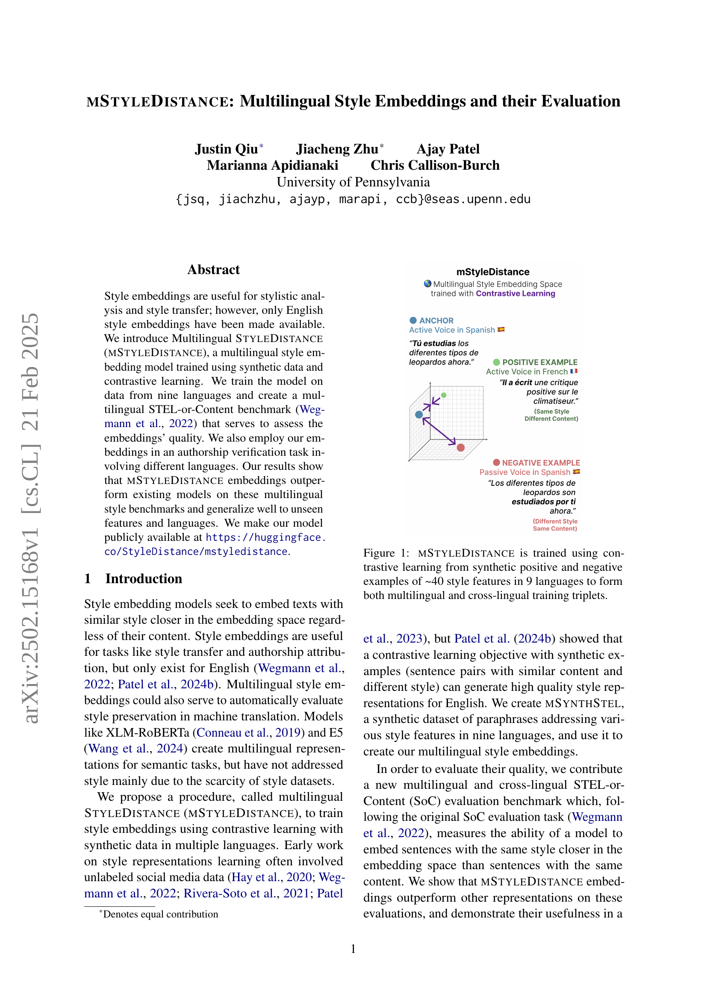
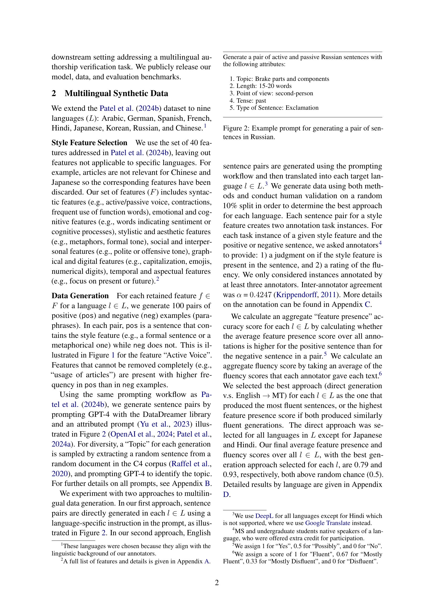
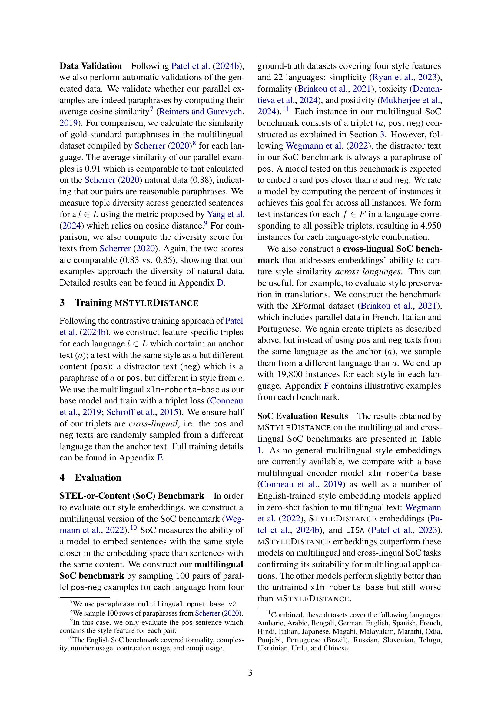
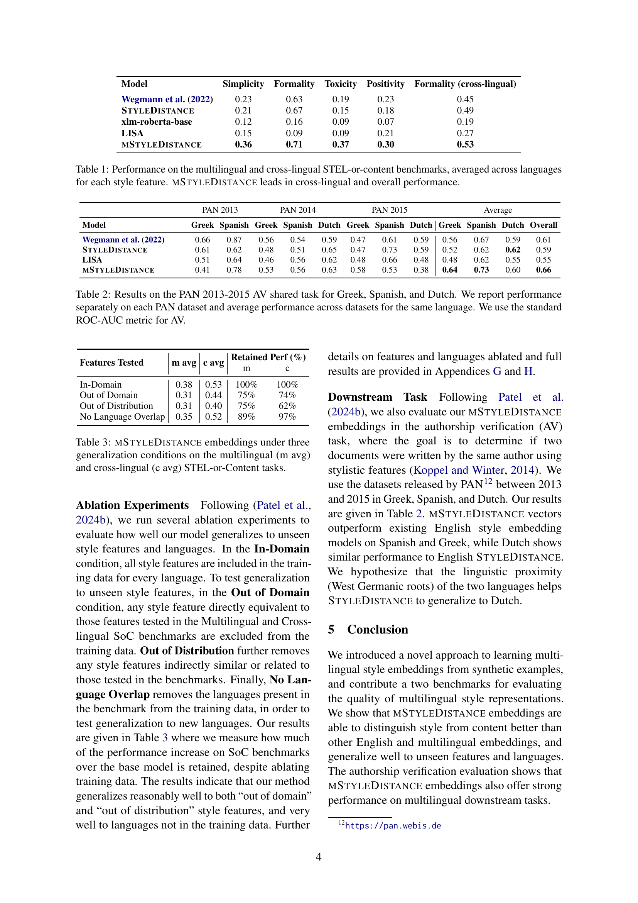
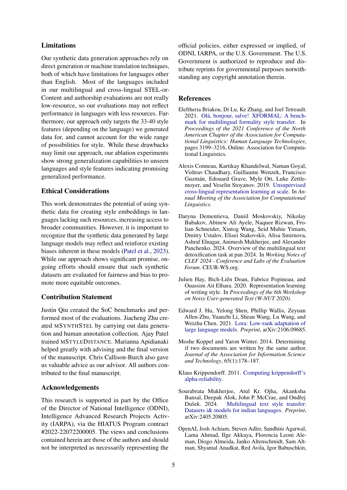
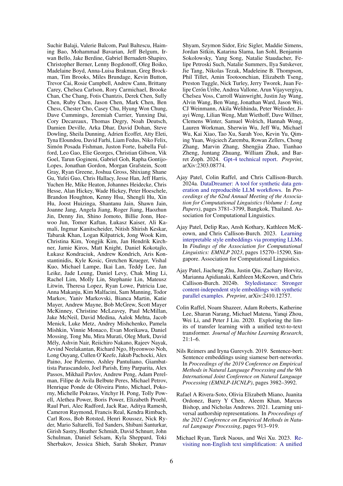
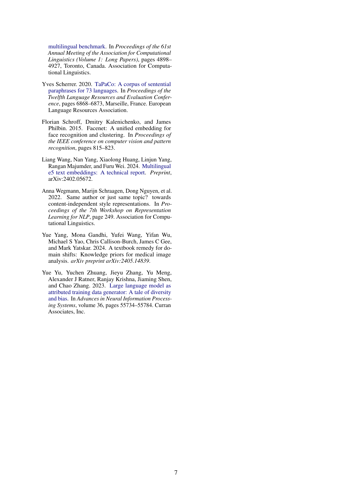
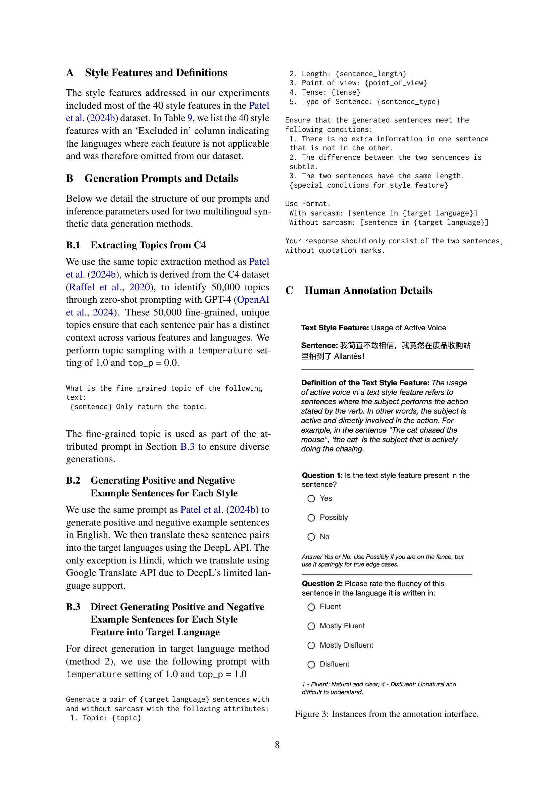
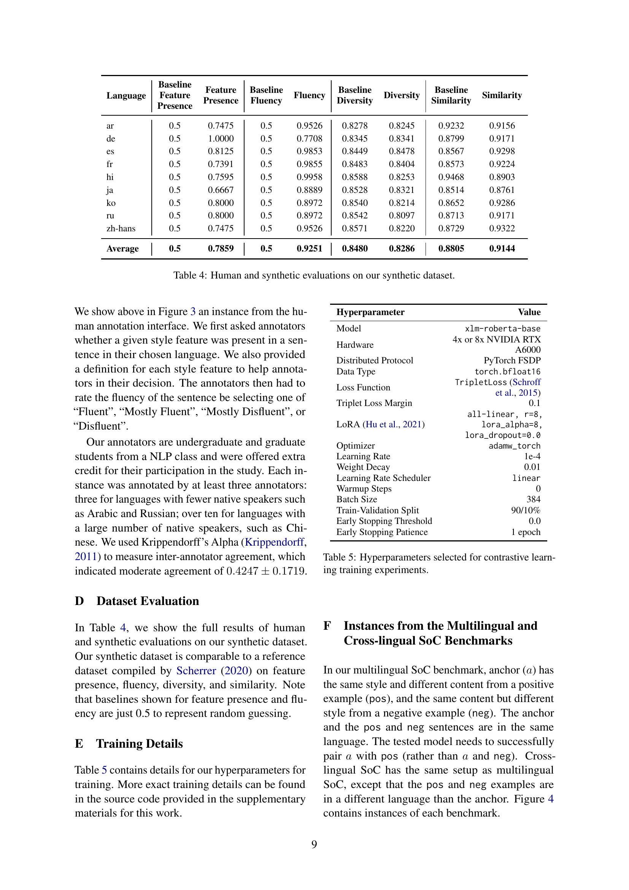
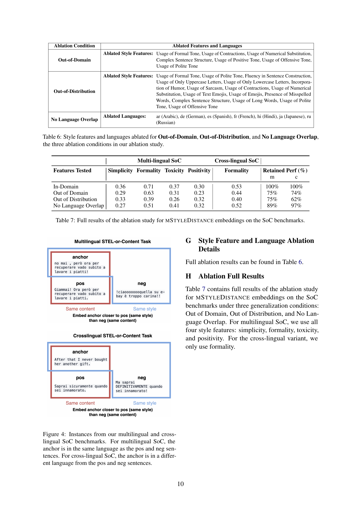
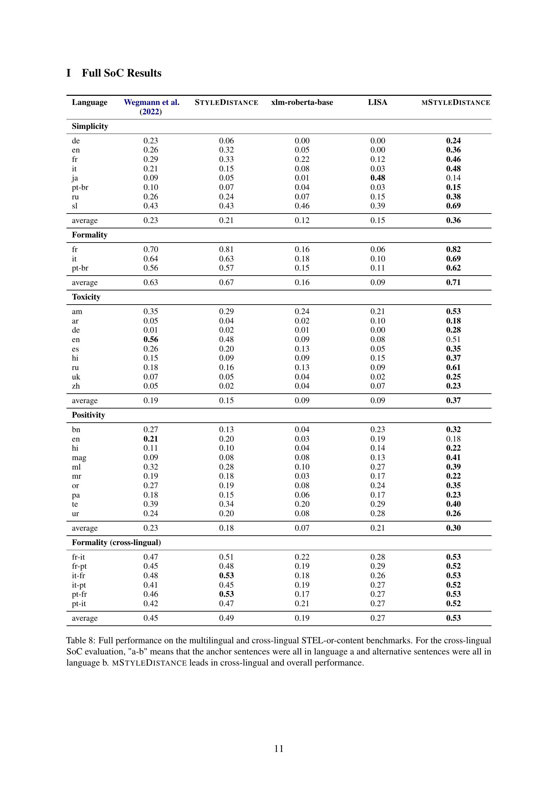
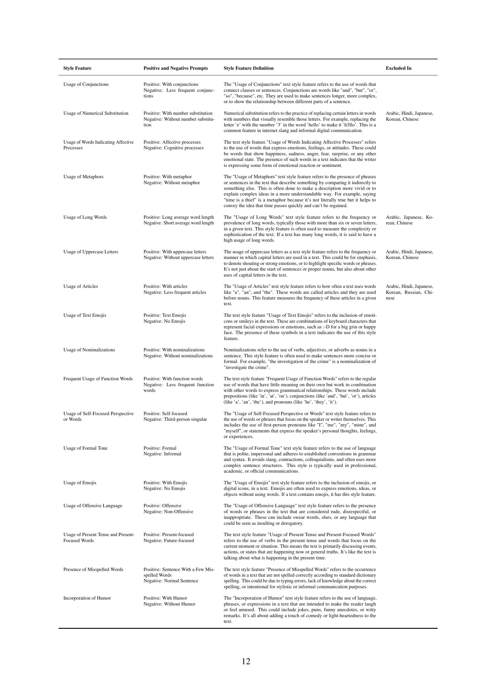
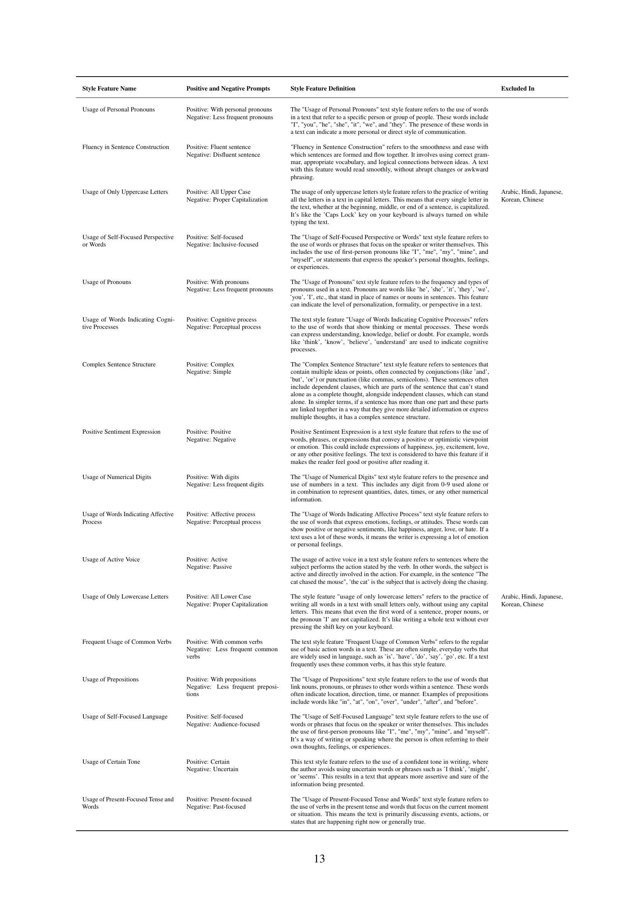
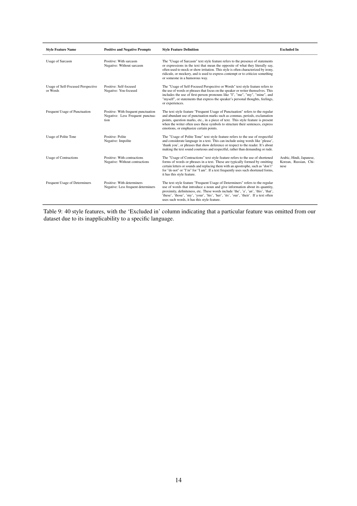
