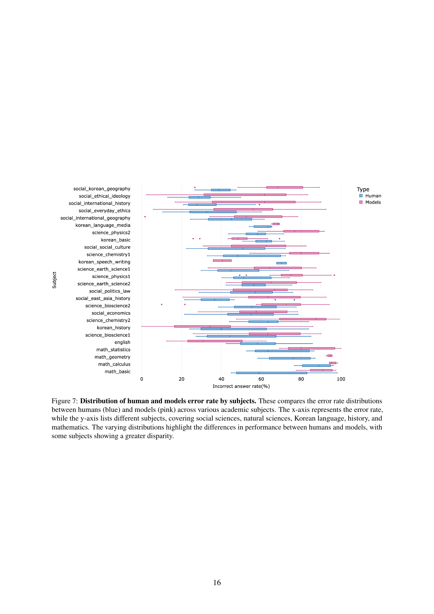

 


 2502.15422 
 Sanghee Park et el. 
 
 🤗 2025-02-24 
 



↗ arXiv


↗ Hugging Face


### TL;DR



본 논문에서는 **한국 교육 과정의 다양한 수준의 시험을 기반으로 다모달 생성 AI를 평가하는 새로운 벤치마크인 KoNET**을 소개합니다. 기존 영어 중심의 벤치마크와 달리, KoNET은 한국어를 중심으로 다양한 교육 수준(초등, 중등, 고등, 대학)의 시험 문제를 포함하고 있어, **AI 모델의 일반화 능력과 교육 현장 적용 가능성**을 더욱 폭넓게 평가할 수 있습니다. 특히, **다양한 오픈소스, 오픈액세스, 상용 API 모델들의 성능을 비교 분석**하여 AI의 강점과 약점을 심층적으로 파악합니다.  

KoNET은 **다양한 유형의 문제와 인간 오류율 데이터**를 제공하여 AI 모델의 성능을 인간의 수준과 직접적으로 비교할 수 있게 합니다. 또한,  **다모달 데이터를 사용하여 시각 및 언어 정보를 통합적으로 평가**하고, **코드와 데이터셋을 공개**하여 재현성 높은 연구를 가능하게 합니다. 이를 통해, KoNET은 **저자원 언어에 대한 AI 연구 및 교육 기술 발전에 크게 기여**할 것으로 기대됩니다.



#### Key Takeaways


 KoNET은 한국 교육 과정의 엄격한 기준을 반영한 새로운 다모달 생성 AI 평가 기준입니다. 



 KoNET은 다양한 수준의 한국어 교육 시험을 활용하여 AI의 교육적 적용 가능성을 평가합니다. 



 KoNET을 통해 오픈소스 및 상용 API 모델들의 성능을 비교 분석하여, 한국어 및 저자원 언어에 대한 AI의 성능 및 한계점을 파악할 수 있습니다. 


#### Why does it matter?
본 논문은 **한국 교육 과정의 엄격한 기준을 반영한 다국어, 다모달 평가 기준**을 제시하여, AI 연구자들에게 새로운 연구 방향을 제시하고, **다양한 언어와 모달리티에 대한 AI 성능 평가의 중요성**을 강조합니다.  이는 향후 **AI 교육 기술 개발 및 다국어 지원 AI 시스템 발전**에 크게 기여할 것으로 예상됩니다. 또한, 공개된 데이터셋과 코드를 통해 재현성 높은 연구를 가능하게 하여, AI 분야의 연구 발전에 크게 기여할 것으로 기대됩니다.

------
#### Visual Insights

> 🔼 그림 1은 KoNET의 예시와 성능 개요를 보여줍니다. (a)는 수학 문제 예시를 보여주며, 교육 수준이 높아짐에 따라 문제의 복잡성과 난이도가 증가함을 보여줍니다. (b)는 최신 AI 모델의 정확도가 더 높은 교육과정으로 갈수록 감소하는 것을 보여줍니다. 4장에서 자세한 분석을 제공합니다.
> 

> 
read the caption

> Figure 1: Examples and Performance Overview of KoNET. (a) Illustration of mathematics problem examples, highlighting the increased complexity and difficulty as the educational level progresses. (b) Demonstration of how the accuracy of contemporary AI models decreases with more advanced curricula. A detailed analysis is provided in Section 4.
> 

### In-depth insights

#### KoNET: A New Benchmark
본 논문에서 제시된 KoNET은 한국 교육 과정의 다양한 측면을 반영한 **새로운 다중모드 생성 AI 벤치마크**입니다. **초등, 중등, 고등, 대학 입시 시험** 등 다양한 수준의 시험 문제를 활용하여 AI의 성능을 종합적으로 평가합니다.  기존 영어 중심의 벤치마크와 달리 한국어를 중심으로 평가함으로써 **저자원 언어에 대한 AI 성능 평가**에 대한 새로운 시각을 제공합니다. **개방형, 폐쇄형 모델 모두 포함**하여 다양한 모델을 평가하고, **인간의 오류율과 비교 분석**을 통해 AI의 실제 능력을 측정합니다.  **다양한 유형의 문제, 다양한 난이도**를 갖추어 AI의 일반화 능력과 추론 능력을 포괄적으로 평가하며,  **오픈소스 코드와 데이터셋** 제공을 통해 연구의 투명성과 재현성을 높입니다. 이러한 특징들은 KoNET이 **실제 교육 환경에 적용 가능한 AI 시스템 개발**에 큰 기여를 할 것임을 시사합니다.

#### Multimodal AI Assessment
본 논문은 한국 교육 과정의 다양한 시험 문제들을 활용하여 **다중 모드(Multimodal) AI 시스템의 평가를 위한 새로운 벤치마크인 KoNET**을 제시합니다. KoNET은 초등, 중등, 고등, 대학교 수준의 시험 문제들을 포함하며, **문제의 난이도와 다양성**을 통해 AI의 교육적 성취도를 종합적으로 평가할 수 있도록 설계되었습니다. 특히, **한국어라는 상대적으로 덜 연구된 언어**에 초점을 맞춤으로써, 기존 영어 중심의 벤치마크의 한계를 극복하고 다양한 언어적 환경에서의 AI 성능을 평가하는 데 기여합니다. KoNET은 다양한 오픈소스 및 상용 API 모델들을 평가하고, 인간의 오류율과 비교 분석하여 AI의 실제 학습 능력을 측정합니다. 또한, 이미지와 텍스트를 결합한 **다중 모드 질문 답변(VQA)** 방식을 사용하여 AI의 다양한 인지 능력을 평가하고, **실제 교육 현장에 적용 가능한 실용적인 벤치마크**를 제공하고자 합니다.

#### LLM vs. MLLM Performance
본 논문은 LLM과 MLLM의 성능을 비교 분석하는 데 중점을 두고 있습니다. 특히 한국 교육 과정에 맞춰 제작된 KoNET 벤치마크를 활용하여, **LLM이 MLLM보다 KoNET에서 더 나은 성능을 보인다는 점을 밝혔습니다.** 이는 기존 영어 중심의 벤치마크와는 다른 결과로, **한국어와 같은 저자원 언어 환경에서의 모델 성능 평가의 중요성을 강조합니다.** 또한, 폐쇄형 API 기반의 모델들이 오픈소스 모델들보다 KoNET에서 더 높은 정확도를 보였는데, 이는 **한국어 특화 전략**의 영향으로 추측됩니다.  **다양한 모델 크기와 유형에 걸친 비교 분석**을 통해, 모델 크기가 성능 향상에 기여하지만 오픈소스 MLLM의 경우 한국어 처리 능력이 부족한 점을 보여줍니다.  결론적으로, **KoNET은 저자원 언어 및 다양한 교육 과정을 고려한 멀티모달 AI 성능 평가에 중요한 역할**을 할 것이며, 앞으로 이 분야의 연구를 위한 귀중한 자료가 될 것으로 기대됩니다.

#### Human Error Rate Analysis
본 논문에서 인간 오류율 분석은 **한국 교육 과정의 난이도를 반영**하여 AI 모델의 성능을 평가하는 데 중요한 역할을 합니다.  **KoCSAT(대학수학능력시험)의 오류율 데이터**를 활용하여 AI 모델의 성능을 실제 인간의 수준과 비교 분석함으로써 AI 모델의 강점과 약점을 명확히 파악할 수 있습니다.  특히, **문제 유형별(이해, 순서 배열, 삽입 등) 오류율을 비교 분석**하여 AI 모델이 어떤 유형의 문제에 강하고 약한지를 파악하고, **인간과 AI의 오류 패턴을 비교**함으로써 AI 모델의 한계를 밝히는 데 도움이 될 것입니다.  **난이도에 따른 오류율 변화**를 분석하여 AI 모델의 학습 능력과 일반화 능력을 평가할 수 있으며, **다양한 언어**에 대한 분석을 통해 AI 모델의 다국어 처리 능력을 평가하는 데 활용될 수 있습니다.  **인간의 오류율과 AI의 오류율을 상호 비교**하여 AI 모델의 성능 향상을 위한 방향을 제시하는 데 중요한 자료로 활용될 수 있습니다.

#### Multilingual AI Capabilities
본 논문은 한국 교육 과정을 기반으로 다국어 AI의 능력을 평가하는 벤치마크인 KoNET을 제시합니다. KoNET은 다양한 언어(한국어를 포함)의 질문과 답변으로 구성된 다중 모드 질문 답변(VQA) 데이터셋으로, **다국어 AI 모델의 실제 세계 적용 가능성을 평가**하는 데 초점을 맞춥니다. 특히, 한국어를 중심으로 하여 영어 중심의 기존 벤치마크의 한계를 극복하고 **저자원 언어 모델의 성능 평가**에 기여합니다.  KoNET은 다양한 교육 수준(초등, 중등, 고등, 대학)의 시험 문제를 포함하여 **모델의 일반화 능력**을 평가하며, 인간의 오류율 데이터를 활용하여 AI 성능을 보다 정확하게 측정합니다.  **개방형과 폐쇄형 모델을 모두 포함**하여 다양한 AI 시스템의 성능을 비교 분석함으로써, 다국어 AI 기술의 현황과 향후 발전 방향에 대한 귀중한 통찰력을 제공합니다.  결과적으로, KoNET은 **다국어 AI의 교육적 맥락에서의 실질적인 성능 평가**를 위한 강력한 도구이며, 다국어 AI 기술의 발전에 크게 기여할 것으로 예상됩니다.

### More visual insights

More on figures

> 🔼 그림 2는 인간의 오류율과 독점 모델의 오류율 간의 상관관계를 분석한 결과를 보여줍니다. x축은 인간의 오류율을, y축은 독점 모델의 오류율을 나타냅니다.  이 분석은 다양한 시험 문제에 대한 인간과 모델의 응답을 비교하여 각각의 오류율을 계산합니다. 부록 C.3에서는 이러한 오류율 계산 방법에 대한 자세한 설명을 제공합니다.  이 그림은 인간과 AI 모델의 오류 패턴이 어떻게 유사하거나 다른지 보여주는 중요한 시각적 자료입니다. 특히 인간의 오류율이 높은 문제에서 AI 모델의 오류율도 높은 경향이 있는지, 혹은 그 반대인지 등을 확인할 수 있습니다.
> 

> 
read the caption

> Figure 2: Correlation analysis of error rates. The x-axis shows human error rates, and the y-axis displays error rates from closed-source models. Appendix C.3 offers a detailed discussion on the methods used to calculate these error rates.
> 

> 🔼 그림 3은 KoNET의 구성요소를 보여주는 예시입니다. KoNET은 이미지와 질문을 이해하고, 긴 본문을 읽고 이해하며, 간단한 지식 기반 질문에 답하는 등 다양한 유형의 문제를 포함합니다. 그림은 KoNET에 포함된 다양한 문제 유형의 예시를 보여주는 대표적인 이미지들입니다.  각 문제 유형은 시각적 자료(이미지)를 기반으로 한 문제, 긴 지문을 이해해야 풀 수 있는 문제, 그리고 간단한 지식만으로 답할 수 있는 문제를 포함하여 시험의 다양성을 보여줍니다.
> 

> 
read the caption

> Figure 3: Illustrative Representation of the KoNET. The test includes various types of questions, such as those requiring comprehension of images and queries, reading and understanding of lengthy texts, and simple knowledge-based queries.
> 

> 🔼 본 그림은 논문의 실험 과정에서 사용된 세 가지 프롬프트 유형(Direct, CoT, Judge)의 예시를 보여줍니다. Direct 프롬프트는 답변 추출을 위해 사용되며,  CoT(Chain-of-Thought) 프롬프트는 추론 기반의 답변 생성을 위해 사용됩니다. Judge 프롬프트는 생성된 답변의 정확도 평가에 사용됩니다. 각 프롬프트 유형은 한국어와 영어 두 가지 버전으로 제시되어 있으며,  OCR 토큰 정보를 포함하고 있습니다.  각 프롬프트 유형은 모델의 답변 생성 및 평가 과정을 보다 효율적으로 수행하는 데 기여합니다.
> 

> 
read the caption

> Figure 4: Examples of prompt formats used in the study. These include Direct prompts for answer extraction, CoT (Chain-of-Thought) prompts for reasoning-based inference, and Judge prompts for evaluating the accuracy of generated responses.
> 

> 🔼 그림 5는 KoNET을 포함한 여러 벤치마크에서 LLMs와 MLLMs의 성능을 비교 분석한 결과를 보여줍니다.  다양한 벤치마크에서 LLMs와 MLLMs의 성능을 비교하여 각 모델 유형의 정확도 분포를 보여줍니다.  기존 벤치마크와 달리 KoNET에서는 LLMs와 MLLMs 간의 성능 분포 경향이 다르게 나타나는 것을 보여줍니다.  즉, 기존 벤치마크에서는 비슷한 성능 분포를 보였던 LLMs와 MLLMs이 KoNET에서는 서로 다른 분포를 보인다는 것을 의미합니다.
> 

> 
read the caption

> Figure 5: Performance of LLMs and MLLMs across Previous benchmarks and KoNET. These present a performance comparison between LLMs and MLLMs across various benchmarks, including KoNET. These illustrate the accuracy distribution for each model type, but KoNET shows a different distribution trend between LLMs and MLLMs compared to other benchmarks.
> 

> 🔼 그림 6은 세 가지 유형의 독해 과제(왼쪽부터 문장 선택, 문장 순서 배열, 문장 삽입)에 대한 사람의 오류율을 보여줍니다. 상단의 백분율은 학생들의 응답을 기반으로 계산된 오류율을 나타냅니다. 오류율이 높을수록 더 어려운 과제이며, 더 깊이 있는 이해가 필요함을 시사합니다. 특히, 독해 지문의 복잡성이 증가함에 따라 오류율도 높아지는 경향이 나타나, 정보 이해 및 구조화에 대한 인지적 부하가 커짐을 보여줍니다.
> 

> 
read the caption

> Figure 6: Examples of human error rate. These illustrates human error rates across three types of comprehension tasks: sentence selection (left), sentence ordering (middle), and sentence insertion (right). The percentages at the top represent the error rates calculated based on responses from students. Higher error rates indicate more challenging tasks requiring deeper comprehension. Notably, as the complexity of the comprehension text increases, the error rate also rises, suggesting a greater cognitive load in understanding and structuring the given information.
> 

> 🔼 그림 7은 다양한 과목에 걸쳐 인간과 모델의 오류율 분포를 비교한 것입니다. x축은 오류율을 나타내고, y축은 사회 과학, 자연 과학, 한국어, 역사, 수학 등 다양한 과목을 보여줍니다. 인간(파란색)과 모델(분홍색)의 오류율 분포를 비교하여 과목별 성과 차이를 보여줍니다. 일부 과목에서는 인간과 모델 간의 성과 차이가 더 크게 나타납니다.
> 

> 
read the caption

> Figure 7: Distribution of human and models error rate by subjects. These compares the error rate distributions between humans (blue) and models (pink) across various academic subjects. The x-axis represents the error rate, while the y-axis lists different subjects, covering social sciences, natural sciences, Korean language, history, and mathematics. The varying distributions highlight the differences in performance between humans and models, with some subjects showing a greater disparity.
> 

> 🔼 그림 8은 질문의 배점에 따른 사람과 모델의 오류율 분포를 보여줍니다. x축은 오답률을, y축은 배점으로 나눈 질문들을 나타냅니다. 고득점 질문일수록 더 높은 추론 및 이해 능력이 필요하며, 이는 사람과 모델 모두의 오류율 증가로 나타납니다. 이 그림은 다양한 난이도의 질문에 대한 사람과 모델의 성능 차이를 자세히 보여줍니다.
> 

> 
read the caption

> Figure 8: Distribution of human and models error rate by points. These presents the error rate distribution of humans (green) and models (brown) based on different point values assigned to questions. The x-axis represents the percentage of incorrect answers, while the y-axis categorizes questions by their point values. Higher-point questions generally require deeper reasoning and comprehension, which is reflected in the increasing error rates for both humans and models.
> 

> 🔼 그림 9는 다양한 언어 모델의 여러 언어에 대한 성능을 보여줍니다. x축은 정확도 백분율을 나타내고 y축은 다양한 언어를 나열합니다. 일반적으로 오픈소스 모델은 클로즈드소스 모델에 비해 유창하게 지원하는 언어의 범위가 좁은 경향이 있습니다. 그러나 클로즈드소스 LLM에서도 특정 언어(예: 쓰기 방향이 영어와 다른 아랍어)의 성능이 저하되는 경우가 있습니다.
> 

> 
read the caption

> Figure 9: Performance of multilingual ability. These illustrations depict the accuracy distribution of various models across multiple languages, highlighting their multilingual capabilities. The x-axis represents accuracy percentages, while the y-axis lists different languages. In general, Open Source models tend to support a narrower range of languages fluently compared to Closed Source models. However, even among Closed Source LLMs, performance tends to decline for certain languages; for instance, Arabic differs from English in writing direction, which can impact model performance.
> 

### Full paper



