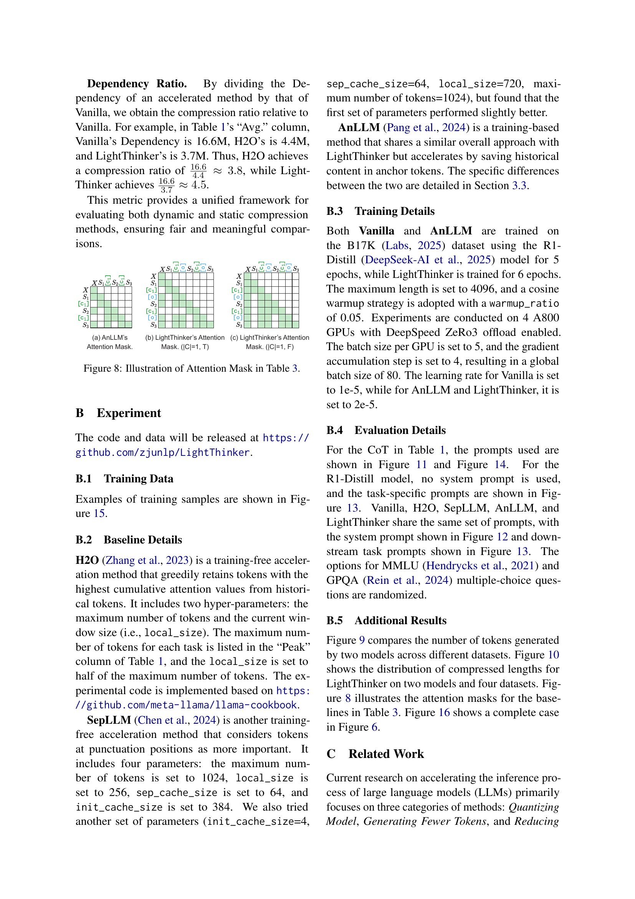

 


 2502.15589 
 Jintian Zhang et el. 
 
 🤗 2025-02-24 
 



↗ arXiv


↗ Hugging Face


↗ Papers with Code


### TL;DR



대규모 언어 모델(LLM)은 복잡한 추론 작업에서 뛰어난 성능을 보이지만, 긴 토큰 시퀀스 생성으로 인해 메모리 사용량과 계산 비용이 많이 소요되는 문제가 있습니다.  이는 특히 장문의 텍스트를 생성하거나 복잡한 추론 작업을 수행할 때 더욱 심각해집니다.  기존 연구는 추론 과정에서 개입이 필요 없는 방법과 실시간 개입이 필요한 방법으로 나뉘는데, 각각 데이터 생성의 어려움과 추론 지연 문제를 가지고 있습니다. 

본 논문에서는 LightThinker라는 새로운 방법을 제시합니다. LightThinker는 **인간의 인지 과정에서 영감을 얻어**, 추론 중에 LLM이 중간 단계의 사고 과정을 동적으로 압축하고 원래 추론 과정을 버리는 방식으로 토큰 수를 크게 줄입니다.  **데이터 재구성, 은닉 상태를 간결한 토큰으로 매핑, 특수 어텐션 마스크 생성**을 통해 이를 구현합니다.  또한, Dependency 지표를 도입하여 압축 정도를 측정하고, 다양한 데이터셋과 모델을 사용한 실험을 통해 LightThinker의 효율성과 정확도를 검증합니다.  LightThinker는 메모리 사용량과 추론 시간을 감소시키면서 경쟁력 있는 정확도를 유지하여 LLM의 효율성을 크게 향상시킵니다.



#### Key Takeaways


 LightThinker는 **중간 단계의 사고 과정을 압축**하여 토큰 수를 줄임으로써 메모리 사용량과 추론 시간을 크게 단축합니다. 



 LightThinker는 **경쟁력 있는 정확도**를 유지하면서 효율성을 향상시키는 새로운 방법을 제시합니다. 



 새로운 Dependency 지표를 도입하여 **압축 정도를 정량적으로 측정**하는 방법을 제시합니다. 


#### Why does it matter?
본 논문은 **대규모 언어 모델의 효율성을 저하시키는 과도한 토큰 생성 문제**를 해결하기 위한 새로운 방법을 제시하여, **추론 속도 향상과 메모리 사용량 감소**에 크게 기여합니다.  이는 복잡한 추론 작업에서 LLM의 성능을 저하시키지 않으면서 효율성을 높이는 데 중요한 의미를 지닙니다.  또한, 제시된 방법은 **새로운 연구 방향**을 제시하며, 향후 LLM의 효율성 향상을 위한 다양한 연구를 촉진할 것으로 예상됩니다. 

------
#### Visual Insights


Method|GSM8K Acc ↑|GSM8K Time ↓|GSM8K Peak ↓|GSM8K Dep ↓|MMLU Acc ↑|MMLU Time ↓|MMLU Peak ↓|MMLU Dep ↓|GPQA Acc ↑|GPQA Time ↓|GPQA Peak ↓|GPQA Dep ↓|BBH Acc ↑|BBH Time ↓|BBH Peak ↓|BBH Dep ↓|AVG. Acc ↑|AVG. Time ↓|AVG. Peak ↓|AVG. Dep ↓
---|---|---|---|---|---|---|---|---|---|---|---|---|---|---|---|---|---|---|---|---
Qwen2.5-7B Series| | | | | | | | | | | | | | | | | | | |
CoT|27.75|1.66|513|0.1M|66.50|1.77|649|0.2M|26.76|0.60|968|0.5M|65.45|0.68|570|0.1M|46.62|1.18|675|0.2M
Distill-R1|81.88|5.60|844|1.1M|28.24|14.31|2483|7.5M|10.10|8.01|6718|31M|57.78|5.53|1967|6.0M|44.50|8.36|3003|11.3M
Vanilla|90.90|11.83|2086|3.9M|59.98|20.61|3417|10M|30.81|10.76|8055|39M|69.90|11.50|3786|13M|62.90|13.68|4336|16.6M
+ H2O|89.92|22.19|640|1.2M|59.69|29.02|1024|3.2M|24.75|15.61|1200|9.8M|70.10|15.61|1024|3.5M|61.12|20.61|972|4.4M
+ SepLLM|30.40|53.52|1024|6.9M|10.81|53.45|1024|9.0M|0.00|11.65|1024|10M|8.08|26.64|1024|9.4M|12.32|36.32|1024|8.9M
AnLLM|78.39|15.26|789|1.6M|54.63|14.13|875|2.0M|19.70|9.14|3401|11M|54.95|10.04|1303|3.8M|51.92|12.14|1592|4.6M
Ours (tho.)|90.14|11.46|676|1.0M|60.47|13.09|944|1.9M|30.30|8.41|2385|9.3M|70.30|7.71|1151|2.7M|62.80|10.17|1289|3.7M
Ours (token)|87.11|11.48|1038|1.5M|57.35|13.80|489|3.5M|28.28|6.94|3150|12M|74.14|7.43|1512|2.9M|63.13|11.02|1826|4.8M
Llama3.1-8B Series| | | | | | | | | | | | | | | | | | | |
CoT|85.14|2.15|550|0.2M|65.82|2.39|736|0.3M|24.75|0.96|1231|0.9M|66.46|0.93|642|0.2M|60.54|1.61|790|0.4M
Distill-R1|73.62|2.58|395|0.1M|22.01|2.97|582|0.8M|20.20|5.24|3972|16M|37.58|0.83|380|0.2M|38.35|2.91|1332|4.4M
Vanilla|91.43|12.06|1986|3.0M|69.62|14.82|2883|6.9M|40.91|7.98|6622|26M|83.03|6.80|2793|5.9M|71.25|10.42|3571|10.5M
+ H2O|90.45|20.23|640|1.0M|65.92|27.11|736|1.8M|31.81|12.55|1536|7.9M|78.99|11.43|1024|2.1M|66.79|17.83|984|3.2M
+ SepLLM|26.25|50.05|1024|5.8M|25.12|50.11|1024|7.5M|2.53|12.62|1024|10M|14.55|27.14|1024|8.5M|17.11|34.98|1024|8.0M
AnLLM|77.33|17.92|589|1.1M|58.62|16.53|589|1.2M|31.31|7.19|838|3.7M|68.89|9.79|621|1.6M|59.04|12.86|659|1.9M
Ours (tho.)|88.25|12.65|629|0.9M|63.39|14.88|882|1.8M|36.36|6.38|1796|6.4M|79.39|7.46|911|1.9M|66.85|10.34|1055|2.7M
Ours (token)|85.52|13.87|1104|1.7M|61.05|15.85|1538|3.3M|31.82|6.94|3150|12M|74.14|11.02|1826|4.8M|63.13|11.02|1826|4.8M

> 🔼 표 1은 네 가지 데이터셋(GSM8K, MMLU, GPQA, BBH)에서 두 가지 언어 모델(Qwen2.5-7B, Llama3.1-8B)을 사용하여 LightThinker를 포함한 다양한 방법들의 성능을 비교 분석한 결과를 보여줍니다.  CoT(Chain-of-Thought) 방법은 instruction model 기반이며, Vanilla, AnLLM, LightThinker는 Distill-R1 기반입니다. 연한 파란색 배경은 가속화 방법을 나타내며, 굵은 글씨는 최고 성능, 밑줄 친 글씨는 두 번째로 높은 성능을 나타냅니다. Vanilla 모델의 정확도(Acc)는 가속화 방법들의 상한선 역할을 합니다. Dep는 백만 단위, Time은 시간(hour), Peak는 개수로 측정됩니다. 압축 비율은 가속화 방법과 Vanilla 간의 Dep 비율로 어림잡아 계산할 수 있습니다. 자세한 내용은 부록 A를 참조하십시오.
> 

> 
read the caption

> Table 1:  Main results. The CoT is based on the instruction model, while Vanilla, AnLLM, and LightThinker are based on Distill-R1. The light blue background indicates acceleration methods, with bold representing the best and underline the second best among them. The Acc of Vanilla serves as the upper bound for Acc of acceleration methods. Dep is measured in million, Time in hours, and Peak in counts. The compression ratio can be roughly estimated by the ratio of Dep between acceleration methods and Vanilla. See Appendix A for more details.
> 

### In-depth insights

#### Dynamic Thought Compression
**동적 사고 압축**은 대규모 언어 모델(LLM)의 효율성을 높이기 위한 혁신적인 방법입니다. 기존의 LLM은 복잡한 추론 과정에서 많은 토큰을 생성하여 메모리 소비 및 연산 비용이 많이 들었습니다. 동적 사고 압축은 이러한 문제를 해결하기 위해 **추론 과정 중에 중간 단계의 생각을 실시간으로 압축**하는 기술입니다.  이는 인간의 사고 과정에서 불필요한 정보는 과감히 버리고 핵심 내용만 기억하는 방식에서 영감을 얻었습니다.  **핵심 개념은 긴 추론 과정을 압축된 표현으로 변환하여 토큰 수를 줄이고, 불필요한 정보를 제거하여 메모리 사용량과 추론 시간을 단축**하는 것입니다.  이러한 압축은 모델이 언제 어떻게 압축할지 학습하는 과정을 통해 이루어지며, 이는 **특수한 어텐션 마스크와 데이터 재구성**을 통해 구현됩니다.  **의존성(Dep) 지표**를 통해 압축 정도를 정량적으로 측정할 수 있으며, 이를 통해 압축과 추론 정확도 간의 균형을 최적화할 수 있습니다.  **동적 사고 압축은 LLM의 효율성을 크게 향상**시키지만, **압축 시점 및 압축 방식 결정**, **압축된 정보의 손실 가능성**, **다양한 작업에 대한 일반화 성능** 등 해결해야 할 과제도 존재합니다.

#### Dependency Metric
논문에서 제시된 'Dependency Metric'은 **토큰 생성 과정에서의 의존성을 정량화하는 지표**입니다.  이는 단순히 최대 토큰 개수를 측정하는 것보다 **더욱 포괄적인 정보를 제공**합니다. 기존의 최대 토큰 개수 측정 방식은 동적 압축 기법과 정적 압축 기법을 비교하는 데 어려움이 있었는데, 이 지표는 **다양한 압축 방식 간의 공정한 비교**를 가능하게 합니다.  특히, **시간에 따른 토큰 사용량의 변화**를 고려하여 **순간적인 최대치가 아닌 전체적인 의존성**을 반영합니다. 따라서 **압축률을 보다 정확하게 평가**하는 데 유용하며, 모델의 효율성과 성능 간의 균형을 평가하는 데 중요한 역할을 합니다.  이는 단순히 토큰의 수를 줄이는 것이 아니라, **실제로 의미 있는 정보에 대한 의존성**을 측정하여 모델의 효율성을 더욱 정확하게 파악하는 데 기여합니다.  **압축의 효과** 뿐 아니라, **모델의 추론 과정**에 대한 이해도 높일 수 있다는 점에서 매우 중요한 지표입니다.

#### Ablation Study
**절제 연구**는 모델의 성능에 특정 구성 요소가 미치는 영향을 평가하기 위해 설계되었습니다. 이는 모델의 다양한 측면을 제거하거나 변경하여 수행되며, 이를 통해 연구자는 모델의 아키텍처, 학습 전략 및 기타 요소가 최종 결과에 어떻게 기여하는지에 대한 통찰력을 얻을 수 있습니다. **LightThinker의 경우**, 절제 연구는 압축 전략의 효과를 평가하는 데 사용되었을 것입니다. 즉, 압축 메커니즘을 제거하거나 변경함으로써 모델의 정확도, 추론 시간 및 메모리 사용량에 어떤 영향을 미치는지 분석합니다. 이를 통해 **LightThinker의 핵심 구성 요소**의 중요성과 **모델 성능 개선**에 대한 기여도를 측정할 수 있고, 모델의 효율성을 극대화하기 위한 최적의 파라미터와 아키텍처를 결정하는 데 중요한 정보를 제공할 것입니다. 또한, 절제 연구를 통해 LightThinker의 **한계점**을 파악하고 향후 개선 방향을 제시하는 데 도움이 될 것입니다.

#### Reasoning Efficiency
본 논문에서 다루는 추론 효율성(Reasoning Efficiency)은 대규모 언어 모델(LLM)이 복잡한 추론 작업을 수행하는 데 필요한 계산 비용과 메모리 사용량을 최소화하는 것을 의미합니다.  **LightThinker 모델은 중간 단계의 추론 과정을 압축하여 토큰 수를 줄임으로써 효율성을 높이는 데 중점**을 두고 있습니다.  이는 인간의 인지 과정에서 영감을 얻어,  冗長한 생각 과정을 간결하게 만들고 불필요한 정보를 제거하는 방식과 유사합니다.  **LightThinker의 핵심은 효율성과 정확도 간의 균형**입니다.  단순히 속도만 향상시키는 것이 아니라, **압축된 표현을 통해 정확도를 유지하면서 추론 시간과 메모리 사용량을 감소**시키는 것을 목표로 합니다.  실험 결과는 LightThinker가 기존 모델에 비해 메모리 사용량을 크게 줄이고 추론 시간을 단축시키는 동시에 정확도를 유지하거나 약간 향상시킨다는 것을 보여줍니다.  **특히, 의사결정 과정에 대한 의존성(Dependency) 척도를 도입하여 압축률을 정량적으로 측정**하는 부분은  LLM의 효율성을 평가하는 새로운 관점을 제시합니다.  이는 단순한 토큰 수 감소뿐 아니라,  실제 추론 과정에서 얼마나 효율적으로 정보를 처리하는지를 평가하는 중요한 지표가 됩니다.

#### Future Work
본 논문은 LightThinker라는 새로운 방법을 제시하여 대규모 언어 모델(LLM)의 추론 효율성을 향상시키는 데 중점을 두었습니다.  **미래 연구 방향**으로는 LightThinker의 성능을 더욱 개선하고 확장하는 데 초점을 맞춰야 합니다. 먼저, 매개변수 효율적인 미세 조정 방법(예: LoRA, QLoRA)을 LightThinker에 적용하는 연구가 필요합니다.  **더 큰 데이터셋**을 사용한 실험을 통해 LightThinker의 일반화 성능을 평가하고 개선하는 것도 중요합니다.  **Llama 계열 모델**에 대한 성능 저하 문제를 해결하기 위해 더욱 정교한 최적화 목표를 설정하고 압축 성능을 개선해야 합니다. 또한, LightThinker의 동적 압축 특성으로 인해 발생할 수 있는 **일시적인 메모리 과부하 문제**를 해결하기 위한 연구가 필요합니다.  **토큰 분할 기능의 설계**를 개선하고, 다양한 작업(예: 새로운 텍스트 생성, 코드 생성, 멀티턴 대화)에 대한 LightThinker의 성능을 평가하는 것 또한 중요한 미래 연구 과제입니다. 마지막으로, 강화 학습을 활용하여 LightThinker의 추론 능력을 더욱 향상시키는 방안을 연구해야 합니다.

### More visual insights

More on tables


|       | GSM8K | MMLU | GPQA | BBH |
| :---- | :----: | :----: | :----: | :----: |
| Qwen  | 20    | 37   | 115  | 48   |
| Llama | 26    | 47   | 139  | 55   |
> 🔼 LightThinker 모델을 사용한 네 가지 데이터셋(GSM8K, MMLU, GPQA, BBH)에 대한 평균 압축 횟수 통계를 보여줍니다. 각 데이터셋에 대해 LightThinker가 생각 단계를 압축하는 횟수의 평균값을 제시하여 모델의 압축 동작을 정량적으로 분석합니다.
> 

> 
read the caption

> Table 2:  Statistics of the average number of compressions per dataset for LightThinker.
> 


| Metric | GSM8K | MMLU | GPQA | BBH | AVG |
|---|---|---|---|---|---| 
| AnLLM | 78.39 | 54.63 | 19.70 | 54.95 | 51.92 |
| Ours (|C|=1, T) | 78.32 | 58.23 | 20.71 | 55.35 | 53.15 |
| Ours (|C|=1, F) | 80.21 | 58.23 | 22.22 | 62.02 | 55.67 |
> 🔼 이 표는 Qwen 모델을 사용한 LightThinker의 ablation 실험 결과를 보여줍니다.  AnLLM의 어텐션 마스크 메커니즘을 사용한 결과와 LightThinker의 어텐션 마스크 메커니즘을 사용한 결과를 비교하여 정확도를 네 개의 데이터셋(GSM8K, MMLU, GPQA, BBH)에서 평가합니다.  'T'는 AnLLM의 어텐션 마스크 메커니즘을, 'F'는 LightThinker의 어텐션 마스크 메커니즘을 나타냅니다.  LightThinker의 설계에서 어텐션 마스크와 토큰 분리의 효과를 분석하기 위한 것입니다.
> 

> 
read the caption

> Table 3:  Ablation results on the Qwen, reporting accuracy on four datasets. “T” denotes the use of AnLLM’s attention mask mechanism, while “F” indicates the use of LightThinker’s attention mask mechanism.
> 

### Full paper



