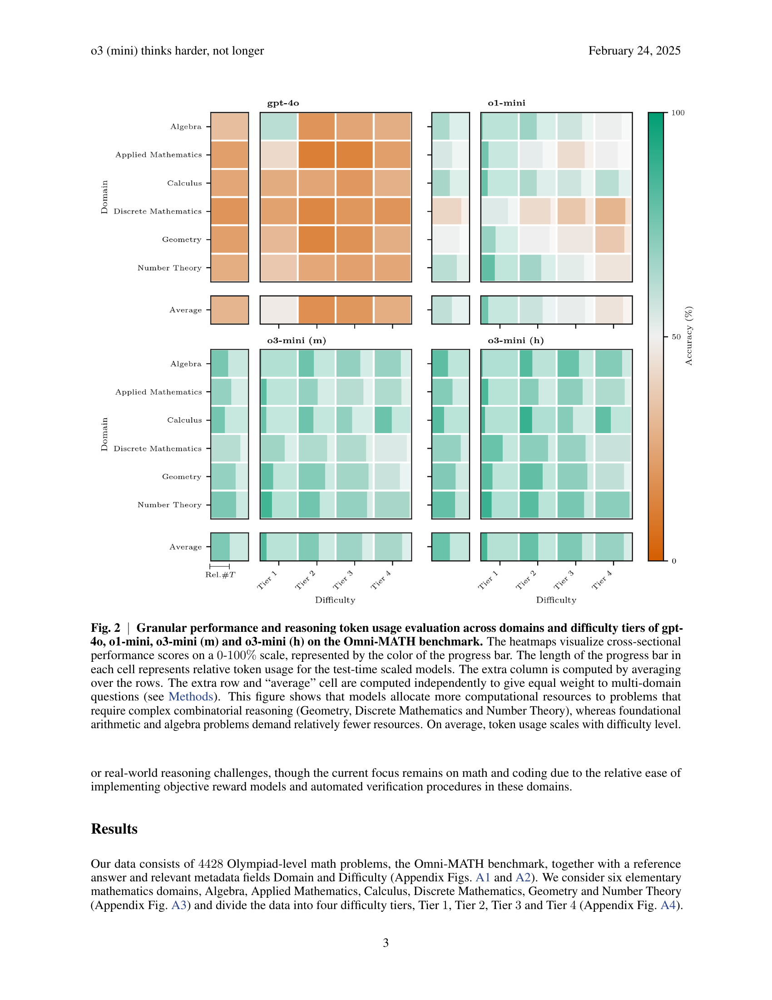
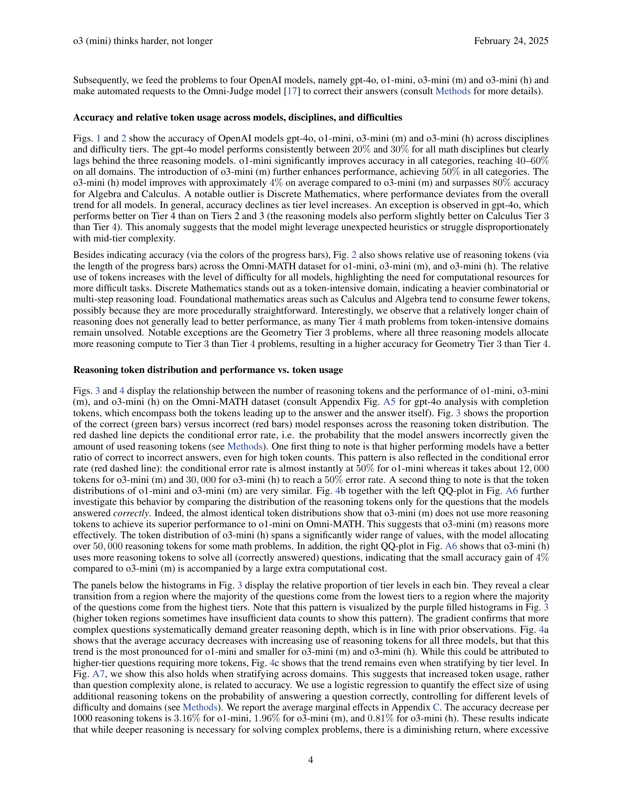

 


 2502.15631 
 Marthe Ballon et el. 
 
 🤗 2025-02-24 
 



↗ arXiv


↗ Hugging Face


### TL;DR



최근 대규모 언어 모델(LLM)은 수학적 추론 능력 향상에 눈에 띄는 발전을 보였습니다. 이는 주로 chain-of-thought 기법과 test-time compute scaling을 활용한 결과입니다.  하지만 추론 토큰 사용량과 정확도 향상 간의 관계는 아직 명확히 밝혀지지 않았습니다. 기존 연구는 모델 세대 간의 비교에서 성능 향상이 더 긴 추론 사슬 때문인지, 아니면 더 효율적인 추론 때문인지 불분명했습니다.

본 연구는 Omni-MATH 벤치마크를 사용하여 01-mini 및 03-mini 변형 모델에서 chain-of-thought 길이를 체계적으로 분석했습니다.  그 결과, 03-mini 모델은 01-mini 모델보다 더 높은 정확도를 달성했지만, 추론 사슬 길이는 더 길지 않았습니다.  모든 모델과 연산 설정에서 추론 사슬이 길어질수록 정확도가 감소하는 경향을 보였으며, 이는 더 능숙한 모델에서 그 감소폭이 상당히 작았습니다.  이는 새롭게 등장한 추론 모델이 test-time compute를 더 효과적으로 사용한다는 것을 시사합니다.



#### Key Takeaways


 더욱 발전된 모델일수록 추론 과정이 길어진다고 해서 항상 정확도가 높아지는 것은 아니다. 



 모델의 성능 향상은 더 긴 추론 과정이 아닌, 더 효율적인 추론 메커니즘에 기인한다. 



 추론 토큰 사용량과 정확도 간의 관계를 분석하여 모델 효율성과 확장성을 높이는 새로운 평가 방법론 및 방향을 제시한다. 


#### Why does it matter?
본 논문은 **대규모 언어 모델의 추론 능력과 성능 간의 관계**에 대한 새로운 통찰력을 제공합니다.  **추론 토큰의 사용량 증가가 항상 정확도 향상으로 이어지는 것은 아니라는 점**을 보여줌으로써, 효율적인 모델 설계 및 평가 방법론 개선에 중요한 시사점을 제시합니다.  **향후 연구를 위한 새로운 방향**을 제시하고, **모델의 효율성 및 확장성 향상**에 기여할 수 있습니다.

------
#### Visual Insights

> 🔼 그림 1은 OpenAI의 gpt-4o, o1-mini, o3-mini(m), o3-mini(h) 모델의 Omni-MATH 벤치마크 결과를 보여줍니다.  각 모델의 다양한 수학 분야(대수, 응용수학, 미적분, 이산수학, 기하학, 정수론)와 난이도(Tier 1~4)별 정확도를 비교하여 나타냅니다. gpt-4o 모델은 어떤 분야에서도 50%의 정확도를 달성하지 못하고 추론 모델들에 비해 성능이 현저히 떨어지는 것을 확인할 수 있습니다. o1-mini 모델은 모든 분야에서 40~60%의 정확도를 달성하며 성능이 크게 향상되었고, o3 모델들은 모든 분야에서 50%를 넘는 정확도를 보입니다. 일반적으로 난이도가 높아질수록 정확도는 감소하지만, gpt-4o 모델의 경우 Tier 2, 3, 4에서 정확도와 난이도 간의 불균형을 보이는 예외적인 결과를 보입니다.
> 

> 
read the caption

> Fig. 1: Accuracy comparison of OpenAI models gpt-4o, o1-mini, o3-mini (m) and o3-mini (h) on the Omni-MATH benchmark. This figure displays the accuracy of gpt-4o, o1-mini, o3-mini (m) and o3-mini (h) on the Omni-MATH benchmark across disciplines and difficulty tiers. The gpt-4o model fails to attain 50%percent5050\%50 % in any category and consistently lags behind the reasoning models. o1-mini significantly improves accuracy, reaching accuracies of 40404040-60%percent6060\%60 % across all domains, while the o3-models surpass 50%percent5050\%50 % accuracy in all categories. In general, accuracy declines as difficulty increases, with the exception of gpt-4o, which shows accuracy vs. difficulty level imbalance for Tiers 2222, 3333, and 4444.
> 

### In-depth insights

#### Reasoning Efficiency
본 논문은 대규모 언어 모델(LLM)의 추론 능력 향상에 있어 **토큰 사용량 증가보다 추론 효율성 개선이 더 중요함**을 보여줍니다. 기존 연구들과 달리, 단순히 추론 단계의 길이만을 고려하지 않고, 다양한 모델의 추론 과정에서 토큰 사용량과 정확도 간의 관계를 체계적으로 분석합니다. 특히, **더욱 발전된 모델일수록 토큰 사용량이 많지 않더라도 높은 정확도를 달성**하며, 추론 과정의 효율성이 향상되었음을 시사합니다.  이는 **모델의 추론 능력이 단순히 토큰 수에 비례하는 것이 아니라, 보다 효율적인 추론 전략을 사용**함으로써 개선되었음을 의미합니다. 따라서, LLM의 성능 평가는 토큰 사용량 뿐 아니라, **추론 효율성 및 전략**까지 고려해야 함을 강조합니다.  향후 연구에서는 효율적인 추론 메커니즘을 규명하고, 더욱 효율적인 LLM 설계 및 평가 방법을 개발하는 데 초점을 맞춰야 할 것입니다.

#### Scaling Laws Revisited
**스케일링 법칙 재검토**는 기존의 거대 언어 모델(LLM) 스케일링 법칙에 대한 새로운 관점을 제시합니다.  기존 연구는 모델 크기, 데이터 크기, 컴퓨팅 자원 증가에 따른 성능 향상을 중점적으로 다루었지만, **본 연구는 이러한 요소들 간의 상호작용 및 효율성에 초점**을 맞춥니다.  특히, 추론 과정의 토큰 사용량과 정확도 향상 간의 관계를 심층적으로 분석하여 단순히 토큰 수 증가가 아닌, **더욱 효율적인 추론 전략**의 중요성을 강조합니다.  **새로운 세대의 모델들은 이전 세대보다 더 효율적으로 컴퓨팅 자원을 활용**하여 동일하거나 더 높은 정확도를 달성하며, **단순한 규모 확장보다 질적인 향상**을 우선시함을 보여줍니다. 이는 향후 LLM 개발 및 평가 방식에 대한 중요한 시사점을 제공하며, **효율성과 확장성 측면에서 새로운 연구 방향**을 제시합니다.  **보다 효율적인 모델 설계 및 평가 지표 개발**이 향후 연구의 중요한 과제로 부각됩니다.

#### Omni-MATH Benchmark
Omni-MATH 벤치마크는 기존의 수학적 추론 벤치마크의 한계를 극복하기 위해 고안된 새로운 평가 기준입니다. **기존 벤치마크들이 대규모 언어 모델(LLM)의 성능을 충분히 평가하지 못했던 점을 감안하여**, Omni-MATH는 **올림피아드 수준의 복잡한 문제들을 포함하여** 다양한 수준의 수학 문제들을 제공합니다.  **33개 이상의 하위 영역과 10개 이상의 난이도 레벨로 세분화된 문제들은**, LLM의 수학적 추론 능력을 보다 정교하게 평가할 수 있도록 합니다. 또한, Omni-MATH는 **Omni-Judge라는 자동 평가 모델을 함께 제공하여** 평가 과정의 효율성과 정확성을 높였습니다. 이는 기존의 수동 평가 방식의 한계를 극복하고 보다 객관적이고 효율적인 평가를 가능하게 합니다.  **다양한 난이도와 영역을 포괄하는 문제 구성은**, LLM의 수학적 추론 능력을 다각적으로 평가하는 데 중요한 역할을 하며,  **다양한 모델의 성능 비교를 위한 견고한 기준**을 제시합니다. 따라서 Omni-MATH 벤치마크는 LLM의 수학적 추론 능력을 평가하는데 있어서 획기적인 발전이라고 볼 수 있습니다.

#### Model Overthinking
모델 과잉 사고는 대규모 언어 모델(LLM)이 복잡한 문제를 해결할 때 **필요 이상으로 많은 추론 단계를 거치는 현상**을 말합니다. 이는 모델이 문제의 본질을 파악하지 못하고 불필요한 정보를 처리하거나, 잘못된 추론 경로를 따라가는 등 비효율적인 문제 해결 전략을 사용하는 것으로 이어집니다. 이러한 과잉 사고는 모델의 성능 저하, 계산 비용 증가, 그리고 해석의 어려움으로 이어질 수 있습니다. 본 논문에서는 과잉 사고를 줄이기 위한 다양한 방법들을 제시하고, 그 효과를 실험적으로 검증합니다. **특히, 모델의 성능을 저해하지 않으면서 추론 단계를 줄이는 기술**에 대한 연구 결과는 실제 응용에 중요한 시사점을 제공합니다. **추론 과정의 효율성을 높이는 것은 LLM의 성능 향상과 실용성 측면에서 중요한 과제**이며, 이를 해결하기 위한 지속적인 연구가 필요합니다.

#### Future Research
본 논문의 핵심 결과는 더욱 능숙한 언어 모델이 더 긴 추론 과정 없이도 더 나은 정확도를 달성한다는 점과, 더 긴 추론 사슬이 항상 더 나은 정확도로 이어지는 것은 아니라는 점을 보여줍니다.  **미래 연구는 모델이 과도하게 생각하는지(overthinking) 또는 과소하게 생각하는지(underthinking)를 더욱 명확히 밝히고, 추론 단계 길이, 입력 길이, 추론 실패 모드 및 수학적 추론 최적화에 대한 연구를 보완하는 데 집중해야 합니다.** 또한, **다양한 추론 도메인을 포괄하는 보다 일반적인 벤치마크를 고려하여 모델 성능 평가를 개선할 수 있습니다.**  **특히, 명확하게 정의된 보상 모델과 검증 시스템을 갖춘 코딩 벤치마크는 모델의 성능을 평가하는 데 중요한 역할을 합니다.**  **더 나아가, 효율성, 확장성 및 평가 방법론 측면에서 더욱 발전된 미래 연구는 테스트 시간 컴퓨팅 모델이 추론 깊이와 리소스 사용 간의 균형을 개선하는 데 기여할 가능성을 제시합니다.**

### More visual insights

More on figures

> 🔼 그림 2는 Omni-MATH 벤치마크에서 gpt-4o, o1-mini, o3-mini (m), o3-mini (h) 모델의 도메인 및 난이도별 성능과 추론 토큰 사용량을 보여줍니다. 히트맵은 각 셀의 진행률 막대 색상으로 0~100% 범위의 단면 성능 점수를 시각화합니다. 각 셀의 진행률 막대 길이는 테스트 시간에 맞춰 조정된 모델의 상대적 토큰 사용량을 나타냅니다. 추가 열은 행의 평균을 계산하여 얻은 값이며, 추가 행과 '평균' 셀은 다중 도메인 질문에 동일한 가중치를 부여하기 위해 독립적으로 계산됩니다(방법 참조). 이 그림은 모델이 기하학, 이산 수학, 정수론과 같이 복잡한 조합 추론이 필요한 문제에 더 많은 컴퓨팅 리소스를 할당하는 반면, 기본적인 산술 및 대수 문제에는 상대적으로 적은 리소스를 필요로 함을 보여줍니다. 평균적으로 토큰 사용량은 난이도와 비례합니다.
> 

> 
read the caption

> Fig. 2: Granular performance and reasoning token usage evaluation across domains and difficulty tiers of gpt-4o, o1-mini, o3-mini (m) and o3-mini (h) on the Omni-MATH benchmark. The heatmaps visualize cross-sectional performance scores on a 00-100%percent100100\%100 % scale, represented by the color of the progress bar. The length of the progress bar in each cell represents relative token usage for the test-time scaled models. The extra column is computed by averaging over the rows. The extra row and “average” cell are computed independently to give equal weight to multi-domain questions (see Methods). This figure shows that models allocate more computational resources to problems that require complex combinatorial reasoning (Geometry, Discrete Mathematics and Number Theory), whereas foundational arithmetic and algebra problems demand relatively fewer resources. On average, token usage scales with difficulty level.
> 

> 🔼 그림 3은 세 가지 모델 (o1-mini, o3-mini (m), o3-mini (h))의 추론 토큰 분포, 토큰 영역 정확도의 변화, 난이도 계층과 토큰 사용 간의 일관성을 분석한 것입니다. 주요 패널에는 누적 히스토그램으로 표시된 추론 토큰 분포가 나타나 있으며, Omni-MATH 데이터 세트에서 각 모델이 정답과 오답을 구분한 비율을 보여줍니다. 보조 y축은 토큰 수가 구간 임계값을 초과했을 때 모델이 오답을 생성할 확률을 나타냅니다. 히스토그램 아래 패널에는 채우기 히스토그램이 포함되어 있으며, 색상 불투명도는 수학 문제의 난이도 레벨을 나타냅니다. o1-mini와 o3-mini (m)은 유사한 추론 토큰 분포를 가지고 있으며, o3-mini (m)은 토큰 수가 많은 영역에서 더 많은 정답을 생성합니다. o3-mini (h)는 토큰 수가 매우 많더라도 정답과 오답의 비율이 좋습니다. 모든 모델에서 오답을 생성할 확률은 토큰 수가 증가함에 따라 증가합니다. 마지막으로, 각 구간에서 난이도 레벨의 상대적 비율을 보면, 대부분의 질문이 가장 낮은 난이도 레벨에서 나오는 영역에서 대부분의 질문이 가장 높은 난이도 레벨에서 나오는 영역으로의 명확한 전환이 나타납니다.
> 

> 
read the caption

> Fig. 3: Analysis of the reasoning token distribution, evolution of token region accuracy, and consistency between difficulty tiers and token usage for o1-mini, o3-mini (m) and o3-mini (h). The main panels of the figure display the distribution of the reasoning tokens as a stacked histogram, illustrating the proportion of correctly and incorrectly answered questions in the Omni-MATH dataset by o1-mini, o3-mini (m) and o3-mini (h). The secondary y𝑦yitalic_y-axis depicts the probability that the model answers incorrectly given that the token count has surpassed the bin threshold (see Methods). The panels below the histogram contain a filled histogram where the color opacity represents the difficulty level of the math questions (cfr. Fig. A4). The figure shows that o1-mini and o3-mini (m) have a similar reasoning token distribution, with o3-mini (m) giving more correct answers for high-token regions. o3-mini (h) has a good ratio of correct vs. incorrect answers, even for very high token counts. The probability of giving an incorrect answer increases with token count for all models. Finally, the relative proportion of tier levels in each bin reveal a clear transition from a region where the majority of the questions come from the lowest tiers to a region where the majority of the questions come from the highest tiers (for bins with a sufficient amount of data points).
> 

> 🔼 그림 4는 03-mini 모델이 01-mini 모델보다 더 긴 추론 과정 없이도 더 높은 정확도를 달성하고, 일반적으로 더 성능이 좋은 모델일수록 추론 토큰이 증가함에 따라 정확도 저하가 덜 심하다는 것을 보여줍니다. (a)는 그림 3의 히스토그램 각 구간에서 정답 개수를 전체 질문 개수로 나눠 계산한 추론 토큰당 정확도를 나타냅니다. 추론 토큰 사용량이 증가함에 따라 정확도는 감소하며, 더 성능이 좋은 모델일수록 기울기가 완만해집니다. 이러한 효과는 회귀 분석에서 더 정량적으로 분석됩니다(방법 참조). (b)는 정답에 대한 추론 토큰 분포를 박스 플롯으로 보여줍니다. 그림 A6의 왼쪽 패널에서 자세히 살펴보면 01-mini와 03-mini (m)의 토큰 분포가 매우 유사합니다. 03-mini (h)의 토큰 분포는 03-mini (m)의 분포에 비해 선형적으로 확장됩니다(그림 A6 오른쪽). (c)는 난이도별로 (a)의 그래프를 계층화하여 나타냅니다. 난이도 구간 내에서도 추론 토큰 사용량이 많을수록 정확도가 감소합니다. 이는 난이도 수준뿐만 아니라 추론 토큰 수도 모델 응답의 정확성을 나타내는 지표로 사용할 수 있음을 시사합니다. 그림 A7에서는 도메인별로도 같은 현상이 나타남을 보여줍니다.
> 

> 
read the caption

> Fig. 4: o3 (mini) thinks harder, not longer. This figure shows that o3-mini (m) does not require longer reasoning chains than o1-mini to achieve better accuracy and that, in general, more proficient models exhibit less accuracy decay as reasoning tokens increase. a, Accuracy per reasoning token, computed by dividing the number of correctly answered questions by the total number of questions in each bin of the histograms in Fig. 3. Accuracy declines as reasoning token usage increases. Furthermore, we observe that the slope of the lines becomes flatter for higher performing models. These effects are further quantified in the regression analysis (see Methods). b, The boxplots show the distribution of the reasoning tokens for correctly answered questions. Further investigation in the left panel of Fig. A6 confirms that o1-mini and o3-mini (m) have a very similar token distribution. The token distribution of o3-mini (h) is stretched linearly with respect to the one of o3-mini (m) (Fig. A6 right). c, Stratifying plot a by difficulty level shows that, within difficulty tiers, accuracy also decreases with higher reasoning token usage. This suggests that the number of reasoning tokens, rather that difficulty level alone, can be used as a signal for the correctness of the model’s answer. In Fig. A7, we show this also holds when stratifying across domains.
> 

> 🔼 그림 A1은 Omni-MATH 데이터셋의 예시 문제를 보여줍니다. Omni-MATH 데이터셋은 정답과 함께 풀이 과정이 상세히 적혀있는 4428개의 수학 문제로 구성되어 있으며, 각 문제는 도메인, 난이도, 출처와 같은 메타데이터 정보를 포함하고 있습니다. 이 그림은 Omni-MATH 데이터셋의 문제 형식과 구성 요소를 보여주는 대표적인 예시 문제를 제시합니다.
> 

> 
read the caption

> Fig. A1: Sample problem from the Omni-MATH dataset. The Omni-MATH dataset consists of 4428442844284428 Olympiad-level math problems together with an exact answer, a written out solution and metadata Domain, Difficulty and Source.
> 

> 🔼 그림 A2는 Omni-Judge 모델의 출력 예시를 보여줍니다. Omni-Judge 모델은 문제, 참조 답변 및 o3-mini (h) 모델이 생성한 솔루션을 입력받습니다.  [17]에서처럼 Omni-Judge 모델은 '학생'의 최종 답변을 반복하고, 이 답변이 참조 답변과 동일한지 평가하고, 추가적인 근거를 제공하도록 프롬프트됩니다. o3-mini (h)가 문제 명세를 반복하는 부분은 생략되어 있습니다.  즉, 그림은 Omni-Judge가 학생의 답변을 평가하는 과정과 그 결과, 그리고 추가적인 설명을 제시하는 예시를 보여줍니다.  이를 통해 Omni-Judge의 작동 방식과 평가 기준을 이해하는 데 도움이 됩니다.
> 

> 
read the caption

> Fig. A2: Sample of the Omni-Judge output when presented with a problem, a reference answer and an o3-mini (h) generated solution. The Omni-Judge model is prompted as in [17], which is to repeat the ‘student’s’ final answer, asses the equivalence of this answer with the reference answer and provide complementary justification. We omit the part where o3-mini (h) repeats the problem specifications, indicated by […].
> 

> 🔼 그림 A3은 Omni-MATH 데이터셋의 주요 도메인 분포를 보여줍니다. 여러 도메인에 속하는 수학 문제는 각 도메인별로 계산되므로, 문제의 총 개수는 그림 A4보다 많습니다. 이 그림은 Omni-MATH 데이터셋에 포함된 다양한 수학 문제의 도메인별 분포를 시각적으로 보여줍니다. 각 도메인에 속한 문제의 개수를 막대 그래프로 표현하여, 어떤 도메인의 문제가 가장 많고 적은지를 한눈에 파악할 수 있도록 합니다. 특히, 하나의 문제가 여러 도메인에 걸쳐있을 경우 각 도메인별로 모두 계산에 포함시켜, 각 도메인의 문제 수를 정확히 반영하고 있습니다. 그림 A4와 비교하여, 각 도메인별 문제 수의 차이를 더욱 명확히 보여줍니다.
> 

> 
read the caption

> Fig. A3: Domain distribution of the Omni-MATH dataset. This figure displays the distribution of the primary domains of the Omni-MATH dataset. Math problems that belong to multiple domains are counted for each domain, so the total number of question is higher than in Fig. A4.
> 

> 🔼 그림 A4는 Omni-MATH 데이터셋의 난이도 분포를 보여줍니다. 이 그림은 난이도 수준을 4개의 난이도 계층으로 분류한 것을 보여줍니다. 각 계층은 데이터셋의 난이도 분포의 사분위수를 기반으로 하며, 개별 난이도 수준은 구분하지 않습니다. 즉, 데이터셋의 전체 난이도 분포를 4개의 동일한 크기의 그룹으로 나누고, 각 그룹에 해당하는 문제들의 난이도를 하나의 계층으로 간주합니다. 이를 통해 난이도를 보다 효율적으로 분류하고 분석할 수 있습니다.
> 

> 
read the caption

> Fig. A4:  Classification of difficulty levels in balanced difficulty tiers. This figure shows the difficulty distribution of the Omni-MATH dataset. The difficulty levels are classified in difficulty tiers based on the quartiles of the distribution (without separating difficulty levels).
> 

### Full paper



