 


 2502.15814 
 Gallil Maimon et el. 
 
 🤗 2025-02-25 
 



↗ arXiv


↗ Hugging Face


↗ Papers with Code


### TL;DR



대규모 컴퓨팅 자원이 필요한 음성 언어 모델(SLM) 훈련은 연구의 진입 장벽을 높입니다. 기존 연구들은 수십만 시간의 음성 데이터와 많은 GPU를 사용하여 훈련하는 데 수많은 컴퓨팅 자원을 필요로 했습니다. 이는 많은 연구자들에게 SLM 연구를 어렵게 만드는 주요 원인이었습니다. 특히 학계에서는 고성능 컴퓨팅 자원을 확보하기 어려워 SLM 연구에 어려움을 겪고 있습니다.

본 논문에서는 이러한 문제를 해결하기 위해 **단일 GPU를 사용하여 24시간 내에 고품질 SLM을 훈련하는 새로운 방법인 Slam을 제시**합니다. Slam은 모델 초기화, 아키텍처, 데이터, 최적화 알고리즘 등 다양한 요소를 최적화하여 제한된 자원 내에서 최고의 성능을 달성합니다. 연구진은 다양한 실험을 통해 Slam이 컴퓨팅 자원을 확장할 경우 기존 최고 성능의 SLM과 동등하거나 그 이상의 성능을 보임을 입증했습니다. **이를 통해 Slam은 SLM 연구의 접근성을 높이고 연구 속도를 높이는 데 크게 기여**할 것으로 예상됩니다.



#### Key Takeaways


 단일 GPU를 사용하여 24시간 이내에 고품질 음성 언어 모델(SLM)을 훈련하는 새로운 방법(Slam)을 제시 



 모델 초기화, 아키텍처, 데이터 선택 전략 등 다양한 요소들이 SLM 훈련 성능에 미치는 영향을 실험적으로 분석 



 제한된 컴퓨팅 환경에서도 최첨단 SLM과 동등한 성능을 달성하며, 컴퓨팅 자원을 확장할 경우 더욱 향상된 성능을 보임 


#### Why does it matter?
본 논문은 **단일 GPU를 사용하여 하루 만에 고품질 음성 언어 모델을 훈련하는 방법**을 제시하여, 연구자들이 컴퓨팅 자원에 대한 제약 없이 SLM 연구를 진행할 수 있도록 합니다. 이는 **SLM 연구의 접근성을 높이고 연구 속도를 높이는 데 크게 기여**할 것으로 예상됩니다. 또한, 제시된 방법은 컴퓨팅 자원을 확장하여 더욱 우수한 성능을 달성할 수 있다는 것을 보여줌으로써, **향후 SLM 연구의 방향을 제시**하는 중요한 의미를 가집니다.

------
#### Visual Insights

> 🔼 그림 1은 다양한 음성 언어 모델(SLM)의 Topic-StoryCloze 성능을 훈련 연산량의 함수로 비교한 것입니다. 원의 크기는 모델의 크기를 나타냅니다. 이 그림은 SLM의 성능이 훈련에 사용된 연산량에 따라 어떻게 달라지는지 보여주는 시각적 자료입니다.  다양한 SLM이 훈련에 사용된 연산량에 따라 Topic-StoryCloze 과제에서 어떤 성능을 보이는지 비교하여 SLM 훈련의 효율성과 확장성에 대한 통찰력을 제공합니다.
> 

> 
read the caption

> Figure 1: Comparing Topic-StoryCloze performance of different SLMs as a function of training compute. Model size is indicated by the size of the circle.
> 


| Model | Data | Data | Metric | Metric | Metric | Metric |
|---|---|---|---|---|---|---|
|  | Div. | Syn. | sBLIMP ↑ | sSC ↑ | tSC ↑ | GenPPL ↓ |
| OPT125M | ✗ | ✓ | 55.28 | **55.46** | **75.18** | **96.8** |
|  | ✓ | ✓ | 55.06 | 55.00 | 74.83 | 116.6 |
|  | ✗ | ✗ | **55.88** | 54.52 | 70.82 | 160.3 |
|  | ✓ | ✗ | 55.65 | 54.78 | 70.18 | 172.7 |
| Qwen-0.5B | ✗ | ✓ | 56.45 | **55.59** | **78.01** | **88.3** |
|  | ✓ | ✓ | 56.17 | 55.37 | 77.13 | 101.3 |
|  | ✗ | ✗ | **56.60** | 53.50 | 71.14 | 145.4 |
|  | ✓ | ✗ | 56.10 | 53.72 | 70.66 | 161.8 |

> 🔼 표 1은 다양한 음성 데이터와 합성 데이터를 사용하여 학습한 SLM(음성 언어 모델)의 성능에 미치는 영향을 분석한 결과를 보여줍니다. 기본 Slam 레시피는 다양한 데이터를 사용하지 않고 Libri-light 및 LibriSpeech 데이터만 사용하지만, 합성 sTinyStories 데이터는 사용합니다. 표에는 다양한 데이터 조합에 따른 SLM 성능 지표(Div, Syn, SBLIMP↑, SSC, SC↑, GenPPL↓)가 제시되어 있습니다.  여기서 Div는 다양성, Syn은 합성 데이터 사용 여부를 나타내고, 나머지는 성능 지표입니다.  SBLIMP, SSC, SC는 각각 높을수록 좋은 성능을 의미하며, GenPPL은 낮을수록 좋은 성능을 나타냅니다.
> 

> 
read the caption

> Table 1: Analysing impact of training data diversity and synthetic data on SLM performance. The default Slam recipe does not use diverse data (only Libri-light and LibriSpeech), but uses the synthetic sTinyStories data.
> 

### In-depth insights

#### SLAM: A Fast Recipe
이 논문은 **단일 학술용 GPU에서 24시간 만에 고품질 음성 언어 모델(SLM)을 훈련하는 방법인 SLAM**을 제시합니다.  이는 모델 초기화 및 아키텍처, 합성 훈련 데이터, 합성 데이터를 사용한 선호도 최적화 및 기타 구성 요소 조정을 통해 이루어집니다.  **SLAM은 더 많은 컴퓨팅 성능을 사용할 경우에도 확장성이 뛰어나** 최고 수준의 SLM과 비슷한 결과를 훨씬 적은 비용으로 얻을 수 있습니다.  **기존 연구에서 예측한 컴퓨팅 성능보다 훨씬 뛰어난 성능**을 보여주며 SLM 연구의 접근성을 높이는 데 기여할 것으로 기대됩니다.  **합성 데이터의 효과적인 활용 및 훈련 전략**은 이러한 놀라운 성능 향상의 핵심 요소이며, 향후 SLM 연구에 중요한 시사점을 제공합니다.  본 연구는 제한된 리소스 환경에서도 고품질 SLM 훈련이 가능하다는 것을 보여주는 중요한 결과이며, 학계 및 산업계 모두에 큰 영향을 미칠 수 있습니다.  **오픈 소스로 공개된 코드, 모델, 훈련 레시피 및 합성 데이터**는 SLM 연구의 발전에 더욱 기여할 것입니다.

#### Data & Diversity
본 논문에서 다루는 '데이터 및 다양성' 부분은 **데이터의 질과 양** 뿐 아니라, **데이터의 다양성**이 음성 언어 모델 학습에 미치는 영향을 심도 있게 분석한 내용입니다. 단순히 데이터 양의 증가만이 성능 향상을 보장하지 않으며, 다양한 방언, 화자 특징, 음향 환경 등을 포함하는 **다양한 데이터**를 사용해야 모델의 일반화 능력과 견고성을 확보할 수 있다는 점을 강조합니다.  특히, **합성 데이터의 효과적인 활용**을 통해 제한된 컴퓨팅 자원으로도 고품질 모델을 학습할 수 있는 가능성을 보여주고 있으며, 이는 **학습 데이터의 효율성**을 높이는 중요한 전략임을 시사합니다.  **다양한 데이터셋의 실험적 비교**를 통해 데이터 다양성의 영향을 정량적으로 평가하고 분석함으로써, 향후 음성 언어 모델 연구의 방향을 제시하는 데 기여하고 있습니다.  **특히, 실제 데이터와 합성 데이터를 결합하는 접근법**은 컴퓨팅 자원의 제약이 있는 환경에서도 모델의 성능을 크게 향상시킬 수 있다는 것을 보여주는 중요한 결과입니다.

#### Scaling Laws
본 논문에서 '스케일링 법칙'은 **대규모 언어 모델(LLM)의 성능이 계산 자원(데이터, 연산)에 따라 어떻게 확장되는지**를 설명하는 중요한 개념입니다. 기존의 연구들은 텍스트 기반 LLM의 스케일링 법칙을 제시했지만, 음성 언어 모델(SLM)에 대한 연구는 부족했습니다. 이 논문은 **SLM의 스케일링 법칙에 대한 새로운 통찰력**을 제공하며, 기존 연구의 비관적인 전망과 달리 **훨씬 효율적인 SLM 학습이 가능함**을 보여줍니다.  **적은 계산 자원으로도 고품질 SLM을 학습할 수 있는 새로운 방법론**을 제시하며,  이는 SLM 연구의 발전에 중요한 기여를 할 것으로 예상됩니다.  특히, **합성 데이터 활용 및 최적화 전략**이 SLM 스케일링 법칙에 미치는 영향을 분석하고, **실제 성능을 예측치보다 훨씬 상회**하는 결과를 얻어냈다는 점은 주목할 만합니다.

#### Efficient Training
본 논문에서 "효율적인 훈련"이라는 주제는 **단일 학술용 GPU에서 24시간 이내에 고품질 음성 언어 모델(SLM)을 훈련하는 방법**을 제시하는 데 초점을 맞추고 있습니다. 이는 기존의 막대한 컴퓨팅 자원이 필요한 SLM 훈련 방식과 대조적입니다.  논문은 모델 초기화 및 아키텍처, 합성 훈련 데이터, 합성 데이터를 사용한 기본 설정 최적화 및 기타 구성 요소 조정을 통해 이를 달성합니다.  **계산 비용의 일부만 사용하여 최고 수준의 SLM과 동등한 결과**를 얻는다는 실험적 증거를 제시하며,  SLM 훈련 및 연구의 접근성을 높이는 데 기여합니다.  **SLM 확장 법칙의 맥락에서 볼 때, 이러한 결과는 예상되는 최적의 컴퓨팅 성능을 훨씬 뛰어넘어** SLM의 실현 가능성에 대한 낙관적인 전망을 제시합니다.  이는 단순히 효율적인 훈련 기법을 제시하는 것을 넘어,  **제한된 자원 환경에서도 고품질 SLM 개발이 가능함**을 보여주는 중요한 발견입니다.

#### Future of SLMs
**SLM의 미래는 엄청난 잠재력과 함께 도전 과제를 안고 있습니다.**  본 논문에서 제시된 Slam 기법처럼, **단일 GPU에서 하루 만에 고품질 SLM을 훈련하는 획기적인 방법론**은 SLM 연구의 접근성을 높이고 발전 속도를 가속화할 것입니다.  그러나, **데이터 다양성 확보 및 계산 비용** 문제는 여전히 해결해야 할 과제입니다.  **합성 데이터 활용**은 이러한 문제 해결에 기여할 수 있지만, **합성 데이터의 품질 및 현실 세계 데이터와의 차이**를 극복하는 것이 중요합니다. 또한, **모델의 크기와 컴퓨팅 자원의 균형**을 맞추는 것, **다중 언어 지원 및 다양한 음성 특징 고려**, 그리고 **윤리적, 사회적 영향에 대한 고려** 등도 SLM의 미래를 위한 중요한 고려 사항입니다. **Slam과 같은 효율적인 훈련 기법은 SLM 연구의 발전을 촉진**할 것이며, 다양한 분야에서 음성 데이터를 활용한 혁신적인 응용 프로그램의 등장을 기대할 수 있습니다. 하지만,  **지속적인 연구와 발전**을 통해 상기 문제들을 해결하고, SLM 기술의 잠재력을 안전하고 책임감 있게 실현하는 것이 중요합니다.

### More visual insights

More on figures

> 🔼 그림 2는 비슷한 매개변수 수를 가진 다양한 언어 모델들의 퍼플렉서티(PPL)를 비교한 그래프입니다.  TWIST 초기화를 사용했을 때와 사용하지 않았을 때의 성능 차이를 보여줍니다. TWIST 초기화는 사전 훈련된 텍스트 언어 모델을 사용하여 음성 언어 모델의 학습을 초기화하는 기법입니다. 그래프를 통해 TWIST 초기화가 모델의 성능 향상에 미치는 영향을 확인할 수 있습니다.
> 

> 
read the caption

> Figure 2: Comparing PPL of different models of similar parameter count, with and without TWIST initialisation.
> 

> 🔼 그림 3은 TWIST 초기화를 사용하여 다양한 모델의 PPL(퍼플렉서티)을 비교한 그래프입니다.  x축은 추정된 FLOPs(부동 소수점 연산 수)이고, y축은 검증 퍼플렉서티입니다.  다양한 크기의 여러 모델 아키텍처(MobileLLM, SmolLM2, OPT, Pythia, Qwen2.5)의 퍼플렉서티를 비교하여 TWIST 초기화가 모델 성능에 미치는 영향을 보여줍니다. TWIST 초기화가 특히 성능이 우수한 모델들에서 퍼플렉서티를 향상시키는 것을 알 수 있습니다.  이 그래프를 통해 연구자들은 제한된 계산 자원 내에서 최적의 모델 크기와 아키텍처를 선택하는 데 도움이 될 수 있는 정보를 얻을 수 있습니다.
> 

> 
read the caption

> Figure 3: Comparing PPL of different models under TWIST initialisation.
> 

> 🔼 그림 4는 연구에서 최고 성능을 보인 모델에 대해 다양한 최적화 알고리즘(Optimizer)과 학습률 스케줄러(Scheduler)를 사용했을 때의 검증 퍼플렉서티(PPL)를 비교한 그래프입니다.  x축은 추정된 FLOPs(연산량)이고, y축은 검증 퍼플렉서티(PPL)입니다. 서로 다른 최적화 알고리즘과 학습률 스케줄러의 조합에 따른 모델 성능의 차이를 보여주어, 어떤 조합이 가장 효과적인지 확인하는 데 도움이 됩니다.  다양한 최적화 알고리즘(AdamW, AdEMAMix, AdaLomo)과 학습률 스케줄러(Cosine, InverseSqrt)의 조합을 시각적으로 비교하여 최적의 하이퍼파라미터 설정을 찾는 데 활용됩니다.
> 

> 
read the caption

> Figure 4: Comparing validation PPL of our best model with different optimisers and schedulers.
> 

> 🔼 그림 5는 24시간의 컴퓨팅 예산 중 Direct Preference Optimization (DPO)에 할당하는 최적 시간을 분석한 결과를 보여줍니다.  전체 24시간 중 DPO에 사용되는 시간을 달리하여 모델 성능에 미치는 영향을 평가합니다.  그래프는 DPO에 할당된 시간에 따른 다양한 평가 지표(예: SSC, SBLIMP, GenPPL)의 변화를 보여주어, DPO에 최적의 시간을 할당함으로써 모델 성능을 극대화하는 방법을 제시합니다.
> 

> 
read the caption

> Figure 5: Analysing the optimal part of the 24 hour compute budget that should be used for DPO, with the rest used for pre-training.
> 

More on tables


| Model | Compute (GPU days) | Parameters | sBLIMP ↑ | sStoryCloze ↑ | tStoryCloze ↑ | GenPPL ↓ | Auto-BLEU ↓ |
|---|---|---|---|---|---|---|---| 
| TWIST-350M [Hassid et al. (2024)] | 40*V100 | 305M | 56.20 | - | - | 137.3 | 3.46 |
| TWIST-1.3B [Hassid et al. (2024)] | 160*V100 | 1B | 57.00 | 52.4 | 70.6 | 131.8 | 3.20 |
| TWIST-7B [Hassid et al. (2024)] | ? | 7B | 59.00 | 55.3 | 74.1 | 93.7 | 3.06 |
| TWIST-13B [Hassid et al. (2024)] | ? | 13B | 59.20 | 55.4 | 76.4 | - | - |
| Scaled Optimal [Cuervo and Marxer (2024)] | ? | 823M | **61.3** | **56.7** | **78.0** | - | - |
| Predicted Optimal [Cuervo and Marxer (2024)] | 1*A5000 | 78M | 56.85 | 54.09 | 70.49 | - | - |
| TWIST-350M (Original recipe) | 1*A5000 | 305M | 51.52 ± .19 | 53.65 ± .57 | 68.80 ± .47 | 259.2 ± 6.7 | 3.26 ± .46 |
| TWIST-350M + sTinyStories | 1*A5000 | 305M | 51.21 ± .26 | 54.17 ± .54 | 72.40 ± .18 | 159.0 ± 6.0 | 4.18 ± .24 |
| _Slam_ (-DPO) (ours) | 1*A5000 | 358M | 56.45 ± .17 | 55.59 ± .30 | 78.01 ± .27 | 88.3 ± 1.0 | 3.47 ± .17 |
| _Slam_ (ours) | 1*A5000 | 358M | **58.86** ± .20 | **58.04** ± .51 | **82.04** ± .21 | **62.8** ± 4.1 | 3.88 ± .11 |
> 🔼 표 2는 제안된 Slam 방법의 성능을 기존 최고 수준의 음성 언어 모델(SLM)들과 비교하고, 계산 자원에 따른 예측 최적 성능을 함께 보여줍니다.  Slam 방법을 저희 코드와 계산 자원을 사용하여 TWIST-350M 모델을 훈련시킨 결과도 기존 훈련 방식과 비교하여 제시합니다.  ± 기호는 3번의 시드(seed) 실행에 대한 최소값과 최대값의 차이를 나타냅니다.  즉,  본 표는 제한된 계산 자원으로 고품질 SLM을 훈련시킬 수 있는 Slam의 효율성을 다양한 측면에서 보여주는 결과를 종합적으로 제시합니다.
> 

> 
read the caption

> Table 2: Comparing slamming to leading SLMs, and predicted optimal performance for the compute. We also consider TWIST-350350350350M using our code and compute budget, but with the original training recipe. ±plus-or-minus\pm± indicates distance to min/max of 3333 seeds.
> 


|       | GPUs        | Params | Num tokens | sBLIMP ↑ | sStoryCloze ↑ | tStoryCloze ↑ | GenPPL ↓ | Auto-BLEU ↓ |
|-------|--------------|--------|------------|----------|-------------|-------------|----------|------------|
| **Speech only pre-training** |              |        |            |          |             |             |          |            |
| GSLM [Lakhotia et al. (2021)](https://arxiv.org/html/2502.15814/bib.bib34) | 8*V100      | 100M   | 1B         | 54.2     | 53.3        | 66.6        | ∅        | ∅          |
| SyllableLM [Baade et al. (2024)](https://arxiv.org/html/2502.15814/bib.bib3) | 4*A40       | 300M   | 16B        | 63.7     | ∅           | 75.4        | ∅        | ∅          |
| TWIST-350M [Hassid et al. (2024)](https://arxiv.org/html/2502.15814/bib.bib22) | 8*V100      | 305M   | 10.8B      | 56.20    | ∅           | ∅           | 137.3    | 3.46       |
| TWIST-1.3B [Hassid et al. (2024)](https://arxiv.org/html/2502.15814/bib.bib22) | 32*V100     | 1B     | 10.8B      | 57.00    | 52.4        | 70.6        | 131.8    | 3.20       |
| TWIST-7B [Hassid et al. (2024)](https://arxiv.org/html/2502.15814/bib.bib22) | 32*V100     | 7B     | 36B        | 59.00    | 55.3        | 74.1        | 93.74    | 3.06       |
| TWIST-13B [Hassid et al. (2024)](https://arxiv.org/html/2502.15814/bib.bib22) | 32*V100     | 13B    | 36B        | 59.20    | 55.4        | 76.4        | ∅        | ∅          |
| Scaled Optimal [Cuervo and Marxer (2024)](https://arxiv.org/html/2502.15814/bib.bib9) | ∅           | 823M   | 82B        | **61.3** | 56.7        | 78.0        | ∅        | ∅          |
| Moshi [Défossez et al. (2024)](https://arxiv.org/html/2502.15814/bib.bib12) | ?*H100      | 7B     | ?          | 58.9     | **58.7**   | **81.8**   | ∅        | ∅          |
| SpiritLM [Nguyen et al. (2025)](https://arxiv.org/html/2502.15814/bib.bib53) | 64*A100     | 7B     | 100B       | 58.0     | 54.8        | 72.9        | ∅        | ∅          |
| **Joint speech-text pre-training / preference optimisation** |              |        |            |          |             |             |          |            |
| [Zeng et al. (2024)](https://arxiv.org/html/2502.15814/bib.bib84) | ∅           | 9B     | ∼1T        | ∅         | **62.4**   | 82.9        | ∅        | ∅          |
| Moshi [Défossez et al. (2024)](https://arxiv.org/html/2502.15814/bib.bib12) | ?*H100      | 7B     | ∼720B      | 58.8     | 60.8        | 83.0        | ∅        | ∅          |
| SpiritLM [Nguyen et al. (2025)](https://arxiv.org/html/2502.15814/bib.bib53) | 64*A100     | 7B     | 100B       | 58.3     | 61.0        | 82.9        | ∅        | ∅          |
| AlignSLM-1.3B [Lin et al. (2024)](https://arxiv.org/html/2502.15814/bib.bib39) | 64*A100     | 1B     | 10.8B + ∼158B | 59.8     | 55.0        | 80.0        | ∅        | ∅          |
| AlignSLM-7B [Lin et al. (2024)](https://arxiv.org/html/2502.15814/bib.bib39) | 64*A100     | 7B     | 36B + ∼158B | **62.3** | 61.1        | **86.8**   | ∅        | ∅          |
| *Slam* (-DPO) | 2*A100      | 358M   | 16.7B      | 58.53    | 58.15       | 80.71       | 67.3     | 3.25       |
| *Slam* | 1*A5000     | 358M   | 1.4B + 5M   | 58.86    | 58.04       | 82.04       | 62.8     | 3.88       |
| *Slam* (scaled) | 2*A100      | 358M   | 16.7B + 9M | **61.11** | **61.30**  | **84.18**  | **46.6** | 3.75       |
> 🔼 표 3은 Slam 모델 학습에 사용되는 컴퓨팅 자원을 확장했을 때의 효과를 분석한 결과를 보여줍니다.  'Number tokens' 열은 학습에 사용된 총 토큰 수를 나타내지만, 실제로는 중복 토큰이 포함되어 있을 수 있으므로, 제공된 정보를 바탕으로 추정한 값입니다.  '+' 표시는 DPO(Direct Preference Optimization) 학습에 사용된 토큰임을 나타냅니다.  즉,  본 표는 다양한 규모의 모델과 컴퓨팅 자원을 사용했을 때의 성능 변화를 보여주는 비교 분석표입니다.
> 

> 
read the caption

> Table 3: Analysing the effect of scaling up compute for Slam. Number tokens refers to total, not necessarily unique, tokens used for training (estimated from the provided information). We separately mark DPO tokens with a +.
> 


| Parameter | Value |
|---|---| 
| Text Base Model | Qwen2.5-0.5B |
| TWIST initialisation | True |
| Data | Librilight + Librispeech + sTinyStories |
| Train Time | 23.5 hours ≃ 17625 steps |
| RoPE theta | 10000 |
| Context length | 1024 |
| Per device Batch Size | 8 |
| Gradient Accumulation | 16 |
| Base Learning Rate | 1e-3 |
| Warmup Ratio | 1% |
| Optimizer | AdamW |
| Learning Rate Scheduler | cosine with min 5e-5 |
| Max Grad Norm | 0.5 |
| Dtype | bfloat16 |
> 🔼 표 4는 본 논문에서 제안하는 Slam 방법론의 전처리 단계(DPO 이전)에 대한 하이퍼파라미터 설정을 보여줍니다. 모델, 데이터, 학습 시간, ROPE 세타 값, 컨텍스트 길이, 배치 크기, 그래디언트 누적, 학습률, 웜업 비율, 최적화 알고리즘, 학습률 스케줄러, 최대 그래디언트 정규화, 데이터 타입 등의 세부적인 설정 값이 포함되어 있습니다. 이 표는 Slam 방법론의 재현성을 높이고, 다른 연구자들이 동일한 설정으로 실험을 수행할 수 있도록 자세한 정보를 제공합니다.
> 

> 
read the caption

> Table 4: Slam (-DPO) Pre Training Recipe
> 


| Parameter | Value |
|---|---| 
| Initial Model | _Slam_ (-DPO) |
| Data | SpokenSwag with auto-bleu smaller than 0.3 |
| Train Time | 0.5 hour ≃ 813 steps |
| RoPE theta | 10000 |
| Context length | 1024 |
| Per device Batch Size | 4 |
| Gradient Accumulation | 16 |
| Base Learning Rate | 5e-5 |
| Optimizer | AdamW |
| Learning Rate Scheduler | inverse sqrt |
| Max Grad Norm | 0.5 |
| Dtype | bfloat16 |
| DPO β | 0.1 |
> 🔼 표 5는 논문의 실험 설계에서 사용된 Slam 모델의 DPO(Direct Preference Optimization) 학습 레시피를 보여줍니다.  DPO는 합성 데이터를 사용하여 모델의 성능을 향상시키는 기법입니다. 이 표에는 DPO 학습에 사용된 초기 모델, 데이터, 학습 시간, ROPE(Rotary Position Embedding) θ 값, 컨텍스트 길이, 배치 크기, 그래디언트 누적, 기본 학습률, 최적화기, 학습률 스케줄러, 최대 그래디언트 놈, 데이터 타입 등의 하이퍼파라미터 정보가 포함되어 있습니다.
> 

> 
read the caption

> Table 5: Slam DPO Training Recipe
> 


| Model Name | Number of Params |
|---|---| 
| MobileLLM-125M [Liu et al. (2024b)](https://arxiv.org/html/2502.15814v1#bib.bib41) | 106,492,608 |
| MobileLLM-350M [Liu et al. (2024b)](https://arxiv.org/html/2502.15814v1#bib.bib41) | 315,117,120 |
| OPT-125M [Zhang et al. (2022)](https://arxiv.org/html/2502.15814v1#bib.bib85) | 87,015,936 |
| OPT-350M [Zhang et al. (2022)](https://arxiv.org/html/2502.15814v1#bib.bib85) | 305,714,176 |
| QWEN2.5-0.5B [Yang et al. (2024a)](https://arxiv.org/html/2502.15814v1#bib.bib80) | 358,347,904 |
| SmolLM2-135M [Allal et al. (2025)](https://arxiv.org/html/2502.15814v1#bib.bib1) | 106,492,608 |
| SmolLM2-360M [Allal et al. (2025)](https://arxiv.org/html/2502.15814v1#bib.bib1) | 315,117,120 |
| Pythia-160M [Biderman et al. (2023)](https://arxiv.org/html/2502.15814v1#bib.bib5) | 85,827,072 |
| Pythia-410M [Biderman et al. (2023)](https://arxiv.org/html/2502.15814v1#bib.bib5) | 303,339,520 |
> 🔼 이 표는 음성 전용 단위(500개)로 어휘집을 변경한 후의 모델 이름과 매개변수 수를 보여줍니다.  모델 이름과 크기 정보를 통해,  본 논문에서 사용된 다양한 모델들의 규모를 비교하고 이해하는 데 도움을 줍니다.  각 모델의 매개변수 수는 음성 인식 및 생성 성능에 영향을 미치는 중요한 요소입니다.
> 

> 
read the caption

> Table 6: Model names and parameter counts after changing vocabulary to speech only units (500).
> 


| Dataset | Number of Hours | Number of Tokens |
|---|---|---|
| Libri-Light [Kahn et al. (2020)](https://arxiv.org/html/2502.15814v1#bib.bib29) | 50K | 3.5B |
| LibriSpeech [Panayotov et al. (2015)](https://arxiv.org/html/2502.15814v1#bib.bib57) | 960 | 67M |
| SWC [Baumann et al. (2018)](https://arxiv.org/html/2502.15814v1#bib.bib4) | 750 | 19M |
| Tedlium [Hernandez et al. (2018)](https://arxiv.org/html/2502.15814v1#bib.bib23) | 1.6K | 110M |
| PeopleSpeech [Galvez et al. (2021)](https://arxiv.org/html/2502.15814v1#bib.bib18) | 7K | 480M |
| VoxPopuli [Wang et al. (2021b)](https://arxiv.org/html/2502.15814v1#bib.bib74) | 24K | 1.64B |
| sTinyStories | 30K | 2.2B |
> 🔼 표 7은 논문에서 사용된 데이터셋의 크기 정보를 보여줍니다.  각 데이터셋의 이름과 함께 학습에 사용된 시간(시간), 토큰 수(개수)를 보여줍니다.  이 표는 다양한 크기와 특징을 가진 데이터셋을 사용하여 음성 언어 모델을 훈련시키는 실험 설정을 이해하는 데 도움이 됩니다.
> 

> 
read the caption

> Table 7: Dataset train set sizes that we use.
> 

### Full paper


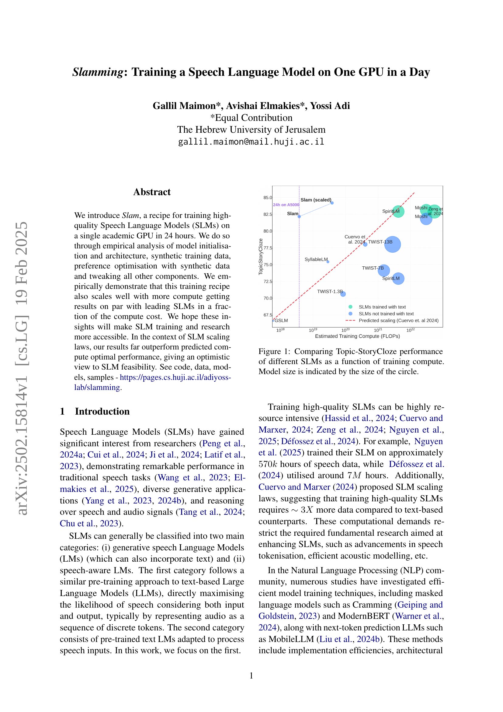
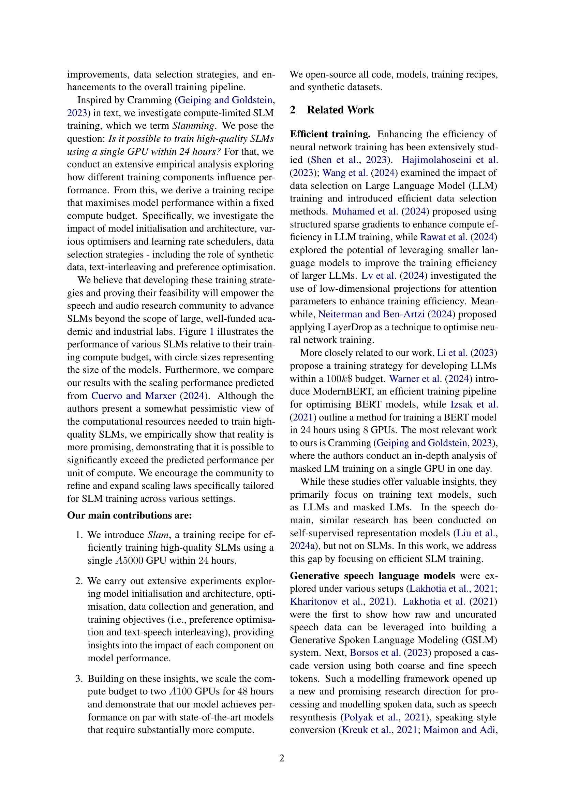
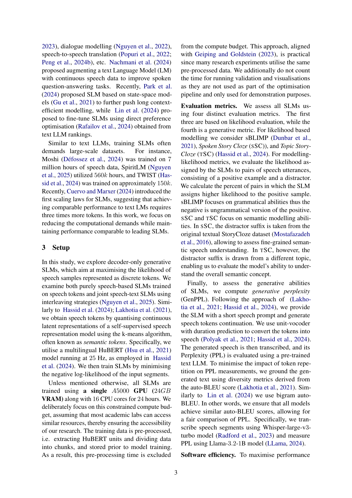
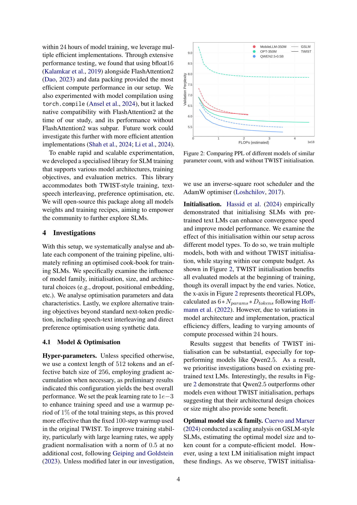
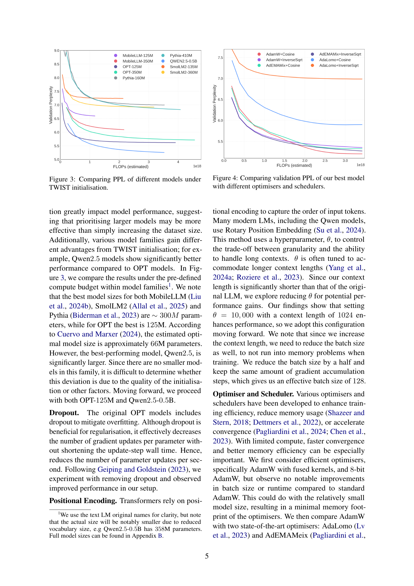
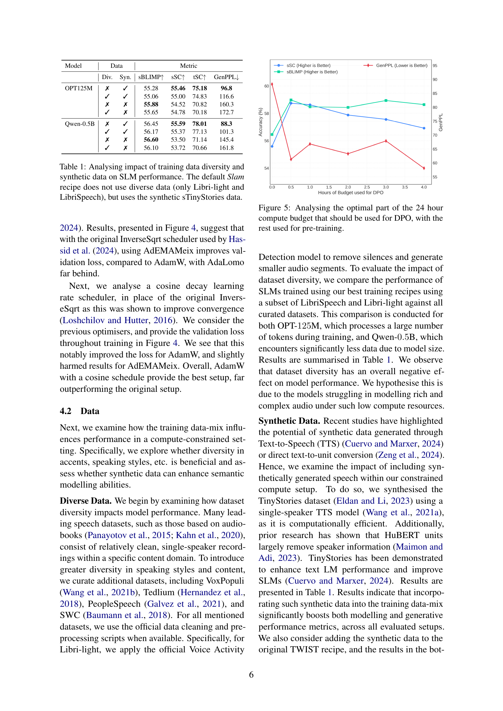
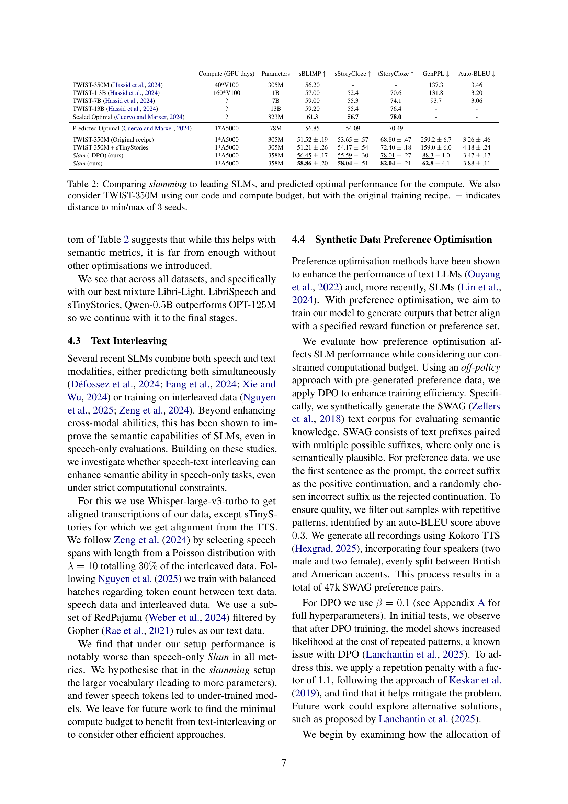
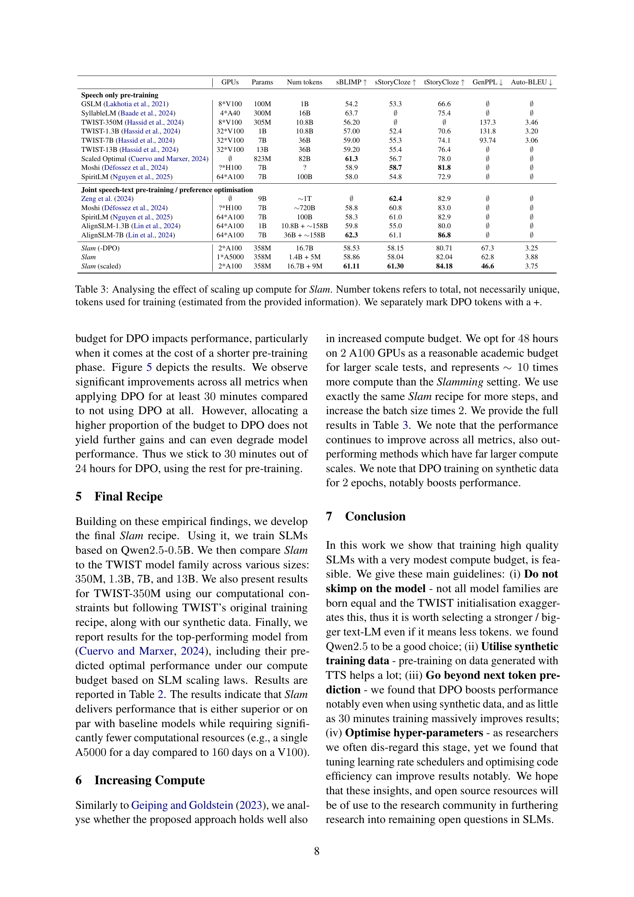
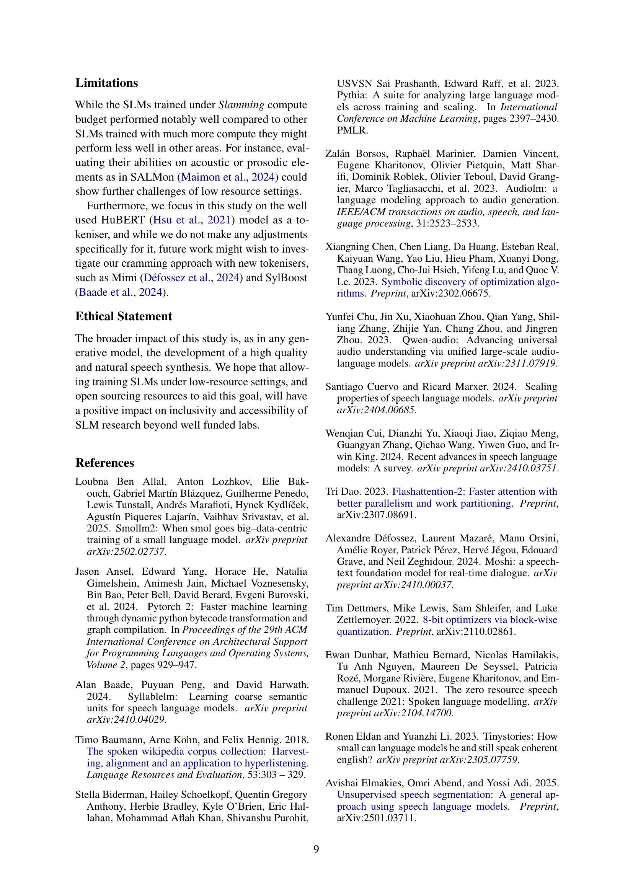
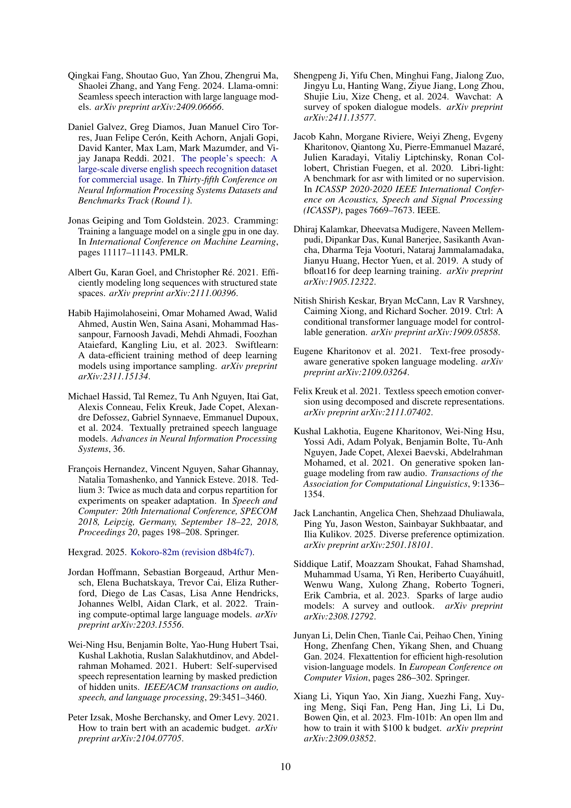
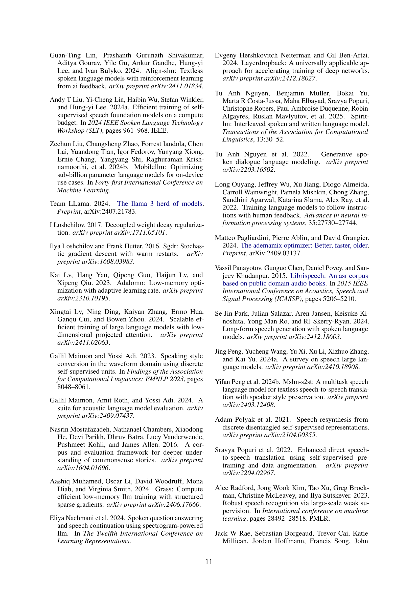
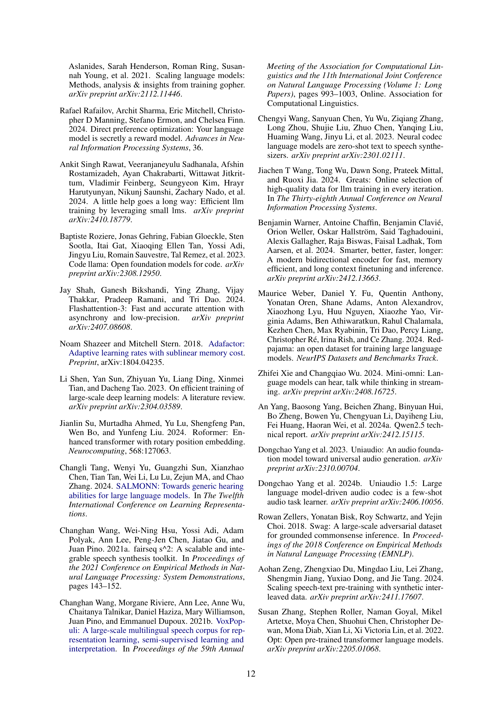
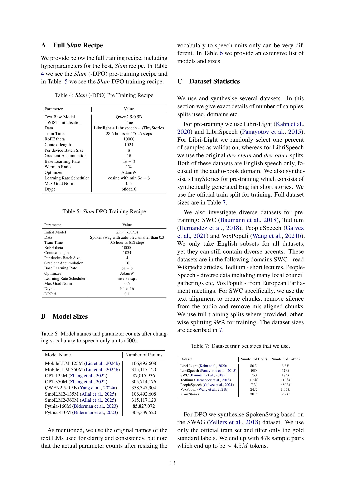

