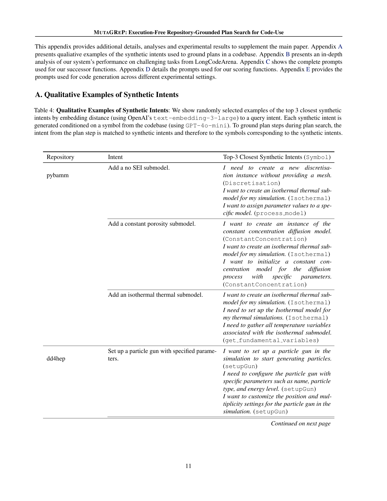

 


 2502.15872 
 Zaid Khan et el. 
 
 🤗 2025-02-25 
 



↗ arXiv


↗ Hugging Face


↗ Papers with Code


### TL;DR



대규모 코드 저장소를 활용한 코드 생성 작업은 **컨텍스트 창의 크기 제한**과 **LLM의 추론 능력 저하** 문제를 갖습니다. 기존의 접근 방식은 전체 저장소를 LLM의 컨텍스트에 추가하는 방식이었지만, 이는 효율적이지 않고, 컨텍스트 크기 제한으로 인해 성능이 저하되는 문제가 있었습니다.  인간 프로그래머는 코드베이스를 효율적으로 탐색하여 문제 해결에 필요한 기능을 찾고 계획을 세우는 능력을 가지고 있습니다. 

본 논문에서는 **MUTAGREP**이라는 새로운 방법론을 제시합니다. MUTAGREP은 **신경망 기반 트리 검색**을 사용하여 사용자의 요청을 코드베이스에 기반한 자연어 단계로 분해하는 계획을 검색합니다.  **계획 공간에서 신경망 기반 트리 검색**을 수행하고, **계획을 변형**하며, **심볼 검색**을 통해 계획을 코드베이스에 연결합니다.  MUTAGREP은 **실행없이** 계획을 생성하므로, 코드 실행 없이도 계획을 생성하고 평가할 수 있습니다.  LongCodeArena 벤치마크를 통해 GPT-40의 성능과 유사한 수준의 결과를 얻었으며, 더 작은 모델에서도 성능 향상을 확인했습니다.



#### Key Takeaways


 MUTAGREP은 코드베이스에서 관련 코드 부분을 자동으로 찾아 계획을 세우는 방법을 제시합니다. 



 MUTAGREP은 제한된 컨텍스트 창 내에서도 LLMì˜ 성능을 향상시킵니다. 



 MUTAGREP은 다양한 크기의 LLM에서도 효과적이며, 어려운 코딩 과제 해결에 도움이 됩니다. 


#### Why does it matter?
본 논문은 **코드 생성 시스템의 효율성과 성능을 향상시키는 새로운 방법론**을 제시하여, 연구자들에게 **새로운 연구 방향**을 제시하고 **실질적인 영향**을 미칩니다. 특히, 대규모 코드베이스를 활용하는 코드 생성 작업에서 **컨텍스트 창의 한계를 극복**하고 **성능을 향상**시키는 데 기여하며, 다양한 **LLM과의 호환성**을 고려하여 실용적인 가치를 더합니다. 또한, 제시된 방법론의 **설계 공간을 탐색**하고, **성능 평가를 위한 벤치마크**를 제공하여, 후속 연구에 대한 **일반화 가능성**을 높입니다. 따라서, 코드 생성 분야의 연구자들에게 **중요한 참고 자료**가 될 수 있습니다.

------
#### Visual Insights

> 🔼 MUTAGReP는 특정 코드베이스를 사용하여 코드를 작성해야 하는 사용자 요청을 받으면, 실현 가능한 계획을 찾기 위해 LLM 기반 트리 검색을 사용합니다. 검색 과정에서는 심볼 검색기를 사용하여 코드베이스에서 사용 가능한 심볼로 구현할 수 있는 계획으로 검색을 제한하고, 계획을 변형하여 검색 공간을 탐색합니다. 계획의 각 단계는 자연어 의도와 의도를 구현하는 데 사용할 수 있는 코드베이스의 심볼로 구성됩니다. 자세한 계획과 함께 사용자 요청은 코드베이스의 필요한 컨텍스트를 다운스트림 코딩 시스템에 제공하여 계획을 코드로 변환하는 데 사용됩니다. MUTAGReP의 계획 검색은 테스트 시간 컴퓨팅 확장의 이점을 활용하며, 코드 실행 없이 레포지토리 기반 계획을 생성합니다.
> 

> 
read the caption

> Figure 1: MutaGReP Overview Given a user request that requires writing code against a specific codebase, we search for realizable plans to solve the user’s request using LLM-guided tree search. Our search procedure uses a symbol retriever to constrain search to plans which are implementable with symbols available in the codebase and explores the search space by mutating plans. Each step of the plan consists of a natural language intent and symbols from the codebase that can be used to implement the intent. The user request along with the detailed plan serves as an enriched query that provides necessary context from the codebase to any downstream coding system to convert the plan to code. Our plan search benefits from test-time compute scaling and produces repo-grounded plans without requiring code execution.
> 


| Notation | Meaning |
|---|---| 
| \mathcal{B} | Set of all symbols (functions, classes, methods) in codebase |
| \mathcal{L} | Set of all finite character strings (natural language) |
| t∈\mathcal{L} | Natural language intent for a plan step |
| B⊆\mathcal{B} | Set of relevant symbols for implementing a step |
| x=(t,B) | Plan step: a tuple of intent and relevant symbols |
| p=[x_{1},...,x_{n}] | Plan: sequence of plan steps |
| \mathcal{P} | Space of all possible plans |
| g:\mathcal{L}→ℙ(\mathcal{B}) | Maps intents to relevant symbols where ℙ is the power set |
| s:\mathcal{P}→ℙ(\mathcal{P}) | Generates set of possible next plans or successors |
| h:\mathcal{P}→℠| Scoring function for ranking plans |

> 🔼 본 논문 전체에서 사용되는 표기법(Notation)들을 정리한 표입니다.  각 약어와 기호가 의미하는 바를 명확히 설명하여, 논문을 읽는 독자들이 표기법에 대한 혼란 없이 내용을 이해하도록 돕습니다.  예를 들어, 'B'는 코드베이스의 모든 심볼(함수, 클래스, 메서드) 집합을 의미하고, 'L'은 모든 유한 문자열(자연어) 집합을 의미하는 등, 논문에서 사용되는 주요 변수와 집합에 대한 정의를 담고 있습니다.
> 

> 
read the caption

> Table 1: Notation used throughout this paper
> 

### In-depth insights

#### Repo-Grounded Planning
본 논문에서 제시된 Repo-Grounded Planning은 **대규모 코드 저장소의 기능을 활용하여 코드 생성 작업을 수행하는 새로운 패러다임**을 보여줍니다. 기존의 접근 방식은 저장소 전체를 LLM의 컨텍스트 윈도우에 추가하는 방식이었지만, 이는 비효율적이고 LLM의 추론 능력 저하를 야기할 수 있었습니다. 반면 Repo-Grounded Planning은 **인간 프로그래머처럼 저장소를 탐색하여 필요한 기능을 찾아내고, 이를 바탕으로 문제 해결 계획을 세우는 방식**을 모방합니다. 이를 위해 **MUTAGREP이라는 신경망 기반 트리 검색 알고리즘을 사용하여 코드베이스에 기반한 계획(plan)을 생성**합니다. 각 계획은 자연어 단계로 구성되며, 코드베이스의 심볼(함수, 클래스, 변수 등)을 사용하여 구현됩니다. **계획 검색 과정은 코드 실행 없이 이루어지며, 생성된 계획은 LLM에 전달되어 실제 코드로 변환**됩니다. 이러한 접근 방식은 테스트 시간 계산 능력 확장에 유리하며, 효율적인 코드 생성을 가능하게 합니다.

#### LLM-Guided Tree Search
LLM 기반 트리 탐색은 **대규모 코드베이스 내에서 실행 가능한 코드 계획을 찾는 데 효과적인 방법**임을 보여줍니다. 이는 자연어로 된 사용자 질의를 코드베이스에 기반한 단계별 계획으로 분해하여 LLM이 계획의 각 단계를 평가하고, 가장 유망한 후보 계획을 확장하여 트리를 생성하는 방식으로 진행됩니다. **계획 공간은 반구조화되어 있고 방대하기 때문에** 이러한 접근 방식은 효율적이며, **LLM의 강력한 자연어 이해 및 추론 능력**을 활용하여 실현 가능성 있는 계획을 식별하는 데 도움이 됩니다.  **상호 작용적이고 반복적인 계획 탐색**은 인간 프로그래머의 방식을 모방하여 코드베이스 내에서 적절한 기능을 찾아 문제 해결 계획을 수립하는 과정을 재현합니다.  **계획 탐색 알고리즘과 계획 평가 함수**의 설계는 시스템의 성능에 중요한 영향을 미치며, 이는 다양한 변형들을 실험하여 최적의 성능을 얻는 방식으로 검증될 수 있습니다.  결과적으로 LLM 기반 트리 탐색은 **복잡한 코드베이스에서의 코드 생성 문제를 해결하는 효율적이고 강력한 방법**이며, 향후 연구를 통해 더욱 발전될 여지가 있습니다.

#### Successor Function Design
본 논문에서 제안하는 MUTAGREP 모델의 핵심 구성 요소 중 하나인 후계 함수(successor function) 설계는 **LLM(Large Language Model) 기반의 트리 탐색**을 통해 코드베이스에 기반한 실행 불가능한 계획을 생성하는 문제를 해결하는 데 중점을 둡니다.  **단조(monotonic) 후계 함수**는 기존 계획에 새로운 단계를 추가하는 방식으로 계획 공간을 탐색하며, 이는 계획의 점진적인 구축에 효과적입니다. 반면, **비제한적(unconstrained) 후계 함수**는 기존 계획의 임의적인 수정을 허용하여 국소적 최적점에 빠지는 것을 방지하는 데 도움이 됩니다.  두 가지 방식 모두 **LLM을 활용하여 자연어 의도(intent)를 코드베이스의 기호(symbol)와 연결**하고, 계획의 실현 가능성을 높이는 데 기여합니다.  **후계 함수의 선택은 탐색 효율성**에 직접적인 영향을 미치므로,  **계산 비용과 탐색 범위** 사이의 균형을 고려하여 신중하게 결정되어야 합니다.  **트리 탐색 전략과 후계 함수의 상호작용** 또한 중요하게 고려되어야 할 요소이며, 이를 통해 계획 탐색 과정의 효율성과 정확성을 최적화할 수 있습니다.

#### Scoring Function Analysis
점수 함수 분석은 다양한 점수 함수들이 코드 생성 성능에 미치는 영향을 평가하는 데 중점을 둡니다. **다양성 점수 함수**는 코드가 다양한 코드베이스 심볼들을 활용하도록 유도하지만, **LLM 기반 점수 함수**는 실제 코드 실행 없이 계획의 적합성을 평가하는 데 유용합니다. **오라클 점수 함수**는 지표로서 사용되며, 실제 코드 생성 성능과의 상관관계를 파악하는 데 도움이 됩니다. 실험 결과, 다양성 점수 함수는 평균 성능을 높이는 데 효과적이며, LLM 기반 점수 함수는 실제 코드 생성 결과와의 일관성을 높이는 데 효과적임을 보여줍니다. **최적의 점수 함수 선택은 사용되는 검색 전략이나 코드 생성 모델에 따라 달라질 수 있습니다.** 따라서 다양한 점수 함수들을 비교 분석하고, 특정 상황에 적합한 함수를 선택하는 것이 중요합니다. 또한, 점수 함수의 설계는 계획의 실현 가능성과 사용자 의도 충족도 사이의 균형을 고려하여 이루어져야 합니다.  점수 함수의 성능을 향상시키기 위해서는 **더욱 정교한 평가 기준**과 **LLM의 능력을 활용한 지능형 점수 매커니즘**을 개발하는 것이 필요합니다.

#### Future Work: MCTS
본 논문에서는 계획 검색에 대한 새로운 접근법으로 MCTS(Monte Carlo Tree Search)를 제시하지는 않았지만, **미래 연구 방향으로 MCTS를 언급**함으로써 향후 연구의 가능성을 제시하고 있습니다.  MCTS는 계획 공간 탐색의 복잡성을 다루는 데 효과적이며, 특히 **계획의 부분적인 수정이나 재조합**이 필요한 경우에 강점을 보입니다.  논문에서 제시된 방법론은 계획을 트리 형태로 표현하고, 각 노드를 계획의 후보로 간주하여 탐색하는 방식을 사용합니다.  이러한 트리 기반 탐색은 MCTS에 자연스럽게 통합될 수 있으며, **더욱 효율적인 계획 발견**을 가능하게 할 수 있습니다.  **MCTS의 확률적 성격**은 계획 공간의 불확실성을 다루는 데 도움이 될 수 있으며, **다양한 계획 후보**를 생성하고 평가하는 데 유용합니다.  하지만 MCTS를 적용하는 데는 **계산 비용 증가**라는 어려움이 존재하며, 이를 효율적으로 관리하는 전략이 필요합니다.  또한, **계획 평가 함수의 설계**도 중요한 과제입니다.  MCTS를 효과적으로 활용하려면 계획의 질을 정확하게 평가하는 함수가 필수적이며, 이는 **LLM(Large Language Model) 기반 평가**를 통해 해결될 수 있습니다.  결론적으로, MCTS의 적용은 MUTAGREP의 성능을 향상시키고 계획 검색의 효율성을 높이는 데 기여할 것으로 예상되며,  **미래 연구의 중요한 방향**이 될 것입니다.

### More visual insights

More on figures

> 🔼 그림 2는 MutaGReP이 LongCodeArena 쿼리에 대해 생성한 저장소 기반 계획을 보여줍니다. 각 계획 단계는 코드베이스에서 검색된 상위 5개 기호와 함께 자연어 의도로 구성됩니다. 이러한 기호는 해당 단계를 구현하는 데 유용할 수 있습니다.  즉, 사용자의 코드 생성 요청을 해결하기 위해 코드베이스에서 필요한 부분을 명확하게 식별하고, 각 단계별로 필요한 코드 부분을 자연어로 설명하며, 해당 단계를 구현하는 데 사용할 수 있는 코드베이스 내의 관련 함수, 클래스 또는 변수를 제시하는 계획을 보여줍니다.
> 

> 
read the caption

> Figure 2: A repo-grounded plan created by MutaGReP on a query from LongCodeArena. Each plan step consists of a natural language intent with top-5 symbols retrieved from the codebase that might be useful for implementing the step.
> 

> 🔼 그림 3은 MUTAGREP의 계획 탐색 과정을 보여줍니다. 트리의 각 노드는 코드베이스에 기반한 계획(repo-grounded plan)을 나타냅니다. 각 시간 단계에서, 트리를 성장시키기 위해 노드 하나가 선택되고, 선택된 계획을 변형(mutate)하여 후속 계획(successor plans)들이 생성됩니다.  계획 공간(plan space)이 매우 크고 구조가 반정형적이기 때문에, MUTAGREP은 LLM을 이용하여 트리 기반 탐색을 수행합니다.  즉, LLM이 계획을 변형하는 함수(successor function) 역할을 합니다.  계획의 평가는 점수 함수(scoring function)에 의해 이루어지며, 점수가 높은 계획이 더 유망한 계획으로 간주됩니다. 그림에서는 계획의 변형 과정과 함께, 유망한 후속 계획을 선택하는 과정을 단계별로 시각적으로 보여줍니다.
> 

> 
read the caption

> Figure 3: Overview of plan search. Each node in the tree is a repo-grounded plan. At every time step, a node is chosen for growing the tree and successors are created by mutating the chosen plan. We use an LLM to implement the successor function.
> 

> 🔼 그림 4는 MUTAGREP의 계획 생성 과정을 보여줍니다. 왼쪽 열에는 초기 계획이, 오른쪽 열에는 이 계획을 변형하여 생성된 새로운 계획들이 나열되어 있습니다. 계획의 각 단계는 자연어 의도(t)와 그 의도를 구현하는 데 사용될 수 있는 코드베이스의 심볼(B)의 쌍으로 구성됩니다. 계획 변형 함수(s)는 초기 계획을 수정하여 새로운 계획을 생성하고, 접지 함수(g)는 수정된 의도를 구현하는 데 사용될 수 있는 심볼들을 매핑합니다. 예를 들어, t2와 t3는 수정된 의도를, B2와 B3는 이에 해당하는 심볼들을 나타냅니다.
> 

> 
read the caption

> Figure 4: Mutation and grounding. The successor function s𝑠sitalic_s mutates a plan (left-most column) to generate new plans (right-most column). For each modified intent (t2subscript𝑡2t_{2}italic_t start_POSTSUBSCRIPT 2 end_POSTSUBSCRIPT and t3subscript𝑡3t_{3}italic_t start_POSTSUBSCRIPT 3 end_POSTSUBSCRIPT), the grounding function g𝑔gitalic_g maps the intent to symbols that might be used to implement the intent (B2subscript𝐵2B_{2}italic_B start_POSTSUBSCRIPT 2 end_POSTSUBSCRIPT and B3subscript𝐵3B_{3}italic_B start_POSTSUBSCRIPT 3 end_POSTSUBSCRIPT).
> 

> 🔼 그림 5는 제한 없는 변이 전략이 단조 변이 전략보다 성능이 우수함을 보여줍니다. 특히, 계산 자원이 제한적인 경우에 더욱 그러합니다. 이 그림은 최적의 점수 함수와 3의 분기 계수를 사용하는 최고-우선 탐색을 이용하여 각 변이 전략에 대해 생성된 계획에서 지상 진실 기호의 백분율을 나타내는 기호 재현율을 보여줍니다. 또한, 이 그림은 테스트 시간 계산을 확장(예산 증가)함으로써 얻을 수 있는 이점을 보여줍니다.
> 

> 
read the caption

> Figure 5: Unconstrained mutation outperforms monotonic mutation, especially at lower budgets. Here, we show the symbol recall (% of ground truth symbols in the generated plans) of each mutation strategy using best-first search with the oracle scoring function and branching factor of 3333. This figure also illustrates gains from scaling test-time compute (by increasing budget).
> 

> 🔼 그림 6은 세 가지 서로 다른 탐색 전략(정보에 입각한 최우선 탐색, 무정보 깊이 우선 탐색, 선형 탐색)의 성능을 비교한 결과를 보여줍니다.  정보에 입각한 최우선 탐색 전략이 무정보 깊이 우선 탐색 및 선형 탐색 전략보다 성능이 우수하며, 분기 계수(BF)가 증가할수록 성능이 향상됨을 보여줍니다. 특히 정보에 입각한 탐색 전략에서 이러한 성능 향상이 더욱 두드러집니다. 이는 정보에 입각한 탐색 전략이 탐색 공간의 유망한 영역을 효율적으로 탐색하여 더 나은 계획을 생성하기 때문입니다.
> 

> 
read the caption

> Figure 6: Comparison of Search Strategies. Informed (best-first) search outperforms uninformed (depth-first) and linear search strategies and performance improves with branching factor (BF), especially for informed search.
> 

> 🔼 그림 7은 제안된 방법을 사용했을 때 다양한 모델의 성능이 향상되었음을 보여줍니다. 특히, Qwen 2.5 Coder 32B 모델은 전체 저장소를 사용한 GPT-40보다 120k 토큰 적게 사용했음에도 불구하고 더 나은 성능을 보였습니다.  GPT-40보다 성능이 더 좋은 모델(예: O1)도 제안된 GPT-40 기반 계획에서 이점을 얻었습니다. 빨간색 선은 전체 저장소를 사용했을 때 GPT-40의 성능을 나타냅니다.
> 

> 
read the caption

> Figure 7: Our plans consistently improve performance across all models. Qwen 2.5 Coder 32B with our plans exceeds GPT-4o’s full-repo performance despite conditioning on 120k fewer context tokens. Even models stronger than GPT-4o (e.g., O1) benefit from our GPT-4o-generated plans. The red line shows GPT-4o performance when given the full repository as context.
> 

> 🔼 그림 8은 GPT-40 모델이 전체 코드 저장소를 사용한 경우에도 성능이 저조했던 어려운 과제들에서 제안된 계획이 성능 향상에 기여했음을 보여줍니다. 특히 GPT-40 모델이 전체 코드 저장소를 사용했을 때 성능이 가장 저조했던 상위 10% 과제에서 트리 기반 검색을 통해 생성된 계획을 적용했을 때 성능 향상이 있었습니다. 이는 제안된 계획이 어려운 과제 해결에 도움이 되는 효과적인 정보를 제공함을 시사합니다.
> 

> 
read the caption

> Figure 8: Our plans enable progress on hard tasks where even full-repo context performed poorly. Conditioning on tree-searched plans shows gains on the hardest 10% of tasks where GPT-4o with full-repo context performed poorly.
> 

> 🔼 그림 9는 LongCodeArena 벤치마크에서 가장 어려운 과제(전체 저장소 성능 기준 하위 10%)에 대한 성능 비교를 보여줍니다. 각 저장소에 대해 GPT-40이 전체 저장소를 컨텍스트로 제공받았을 때(빨간색), ReACT 생성 계획을 사용했을 때(주황색), 그리고 본 논문에서 제안하는 트리 탐색 계획을 사용했을 때(파란색)의 성능을 보여줍니다. 막대는 5개 샘플에 대한 평균 성능을 나타내며, 오차 막대의 아래쪽은 최악의 경우 성능을 나타냅니다. 제안하는 트리 탐색 계획(제약 없는 후속 함수와 분기 계수 3 사용)은 두 개의 기준선을 일관되게 능가하며, 최악의 경우 성능이 기준선의 평균 성능을 초과하는 경우가 많습니다. 모든 점수는 참조 솔루션과의 정렬을 측정하는 API 중복률 백분율입니다.
> 

> 
read the caption

> Figure 9: Performance comparison on the most challenging LongCodeArena tasks (bottom 10th percentile by full-repo performance). For each repository, we show the performance of GPT-4o when given: the full repository as context (red), ReACT-generated plans (orange), or our tree-searched plans (blue). Bars show average performance across 5 samples, while the bottom of error bars indicates worst-case performance. Our tree-searched plans (using unconstrained successor function and branching factor=3) consistently outperform both baselines, with worst-case performance often exceeding the baselines’ average performance. All scores are API overlap percentages measuring alignment with reference solutions.
> 

> 🔼 그림 10은 단조 증가 후속 함수 프롬프트를 보여줍니다. 이 프롬프트는 기존 단계를 유지하면서 새로운 단계만 추가할 수 있는 단조 증가 후속 함수에 사용됩니다.  프롬프트는 사용자 요청과 부분적으로 완성된 계획을 제공하고, LLM이 계획을 수정하여 사용자 요청을 더 잘 충족하도록 유도합니다.  예시는 LLM이 올바른 XML 형식을 생성하고, 단계 번호는 정수로, 다른 텍스트나 주석은 포함하지 않도록 안내합니다.  기존 단계에 대한 피드백은 해당 단계를 달성하는 데 도움이 되는 코드베이스의 기호, 해당 기호의 서명, 그리고 각 기호에 대한 정당성을 포함합니다.
> 

> 
read the caption

> Figure 10: Monotonic Successor Function Prompt
> 

> 🔼 이 그림은 논문의 3.1절 Successor Function and Grounding 에서 언급되는 Unconstrained Successor Function의 프롬프트 예시를 보여줍니다.  Unconstrained Successor Function은 계획(plan)을 수정할 때 기존 단계들을 유지해야 한다는 제약 없이 임의적인 수정을 허용하는 함수입니다.  프롬프트는 LLM이 계획을 수정하는 방법에 대한 지침과, 계획 수정에 사용될 수 있는 코드베이스의 심볼 정보, 그리고 수정된 계획의 XML 형식을 포함합니다.  LLM은 이 프롬프트를 사용하여 사용자의 요청을 더 잘 충족하는 수정된 계획을 생성합니다.
> 

> 
read the caption

> Figure 11: Unconstrained Successor Function Prompt
> 

> 🔼 그림 12는 MUTAGREP에서 사용하는 Likert 스코어링 함수에 대한 프롬프트를 보여줍니다. 이 프롬프트는 사용자의 질문과 이를 해결하기 위한 계획, 그리고 각 단계에 관련된 심볼 목록을 제공합니다.  평가자는 1~7점 척도(1: 매우 동의하지 않음, 7: 매우 동의함)로 계획이 사용자의 질문을 얼마나 잘 해결하는지, 그리고 각 단계가 제시된 심볼을 사용하여 코드로 구현할 수 있는지 여부를 평가합니다.  XML 형식의 응답을 요구하여 계획 수준과 단계 수준 모두에 대한 평가를 구조화합니다. 이를 통해 계획의 전반적인 적합성과 각 단계의 실행 가능성을 정량적으로 평가합니다.
> 

> 
read the caption

> Figure 12: Likert Scoring Function Prompt
> 

> 🔼 그림 13은 본 논문에서 제시하는 계획 기반 코드 생성 프롬프트를 보여줍니다.  이 프롬프트는 사용자 질문을 해결하기 위한 단계별 계획을 제공하여, 코드 생성 모델이 사용자 질문을 더 잘 이해하고, 계획에 따라 코드를 생성하도록 돕는 역할을 합니다.  프롬프트는 계획의 각 단계에 사용할 제안된 심볼 목록을 포함하고 있으며, 각 심볼의 정의를 함께 제공합니다. 필요한 경우 코드베이스의 모든 심볼 목록과 코드베이스 구조의 맵도 함께 제공합니다.  모델이 계획에 따라 코드를 생성하도록 유도하는 옵션도 포함되어 있습니다.  최종적으로 모델은 사용자 질문을 해결하는 코드를 생성해야 합니다.  결과적으로,  이 프롬프트는 계획에 명시된 심볼을 사용하여 사용자 질문을 충족하는 코드를 생성하는 데 모델을 유도합니다.
> 

> 
read the caption

> Figure 13: Plan-based Code Generation Prompt
> 

> 🔼 그림 14는 전체 코드베이스를 컨텍스트로 제공하는 코드 생성 프롬프트를 보여줍니다. 이 프롬프트는 사용자에게 라이브러리를 사용하여 작업을 완료하는 파이썬 코드를 작성하도록 지시합니다.  라이브러리 이름과 작업 설명이 제공되며, 사용자는 라이브러리에 대한 지식을 사용하여 작업을 완료하는 코드를 생성해야 합니다.  전체 코드베이스가 컨텍스트로 제공되므로, 모델은 코드베이스의 모든 기능을 활용하여 코드를 생성할 수 있습니다.
> 

> 
read the caption

> Figure 14: Full-repository Context Code Generation Prompt
> 

> 🔼 그림 15는 본 논문에서 사용한 코드 생성 프롬프트 중 하나를 보여줍니다. 이 프롬프트는 코드베이스에 대한 어떠한 정보도 제공하지 않고, 오직 사용자의 질의만을 제공합니다.  즉, 모델은 사용 가능한 코드베이스에 대한 지식 없이 사용자의 요청을 충족하는 코드를 생성해야 합니다.  이를 통해 코드베이스를 활용하는 다른 접근 방식과 비교하여, 코드베이스 정보를 활용하는 것이 코드 생성 성능에 어떤 영향을 미치는지 평가할 수 있습니다.  본 실험에서는 이 프롬프트를 사용하여, 단순히 사용자의 질의만으로 코드를 생성하는 기준 성능을 측정합니다.
> 

> 
read the caption

> Figure 15: Instruction-only Code Generation Prompt
> 

More on tables


|                     | Avg. Tokens | Overlap Score                     |
| :------------------ | :---------- | :--------------------------------- |
| Context Fill       |             | Best-of-5 | Average |
| Instruction Only   | 250         | 42.3       | 32.2       |
| ReAct              | 4,831       | 47.2 (+5.0) | 39.8 (+7.6) |
| Plan Search (ours) | 5,473       | 53.9 (+11.7)| 48.0 (+15.8) |
| Full Repo          | 121,262     | 58.7 (+16.5)| 49.9 (+17.6) |
> 🔼 표 2는 제안된 계획 기반 코드 생성 방법을 다른 방법들과 비교 분석한 결과를 보여줍니다.  비교 대상 방법들은 평균 context 사용량에 따라 정렬되어 있으며, 계획 기반 방법은 context 전체를 사용하는 방법과 유사한 성능을 보이면서 ReAct 기반 계획보다 훨씬 우수한 성능을 나타냅니다.  즉, 전체 코드베이스를 LLM context에 추가하는 방법과 비슷한 성능을  훨씬 적은 context로 달성하며, ReAct 기반 방법보다 성능이 월등히 좋음을 의미합니다.
> 

> 
read the caption

> Table 2: Comparing our plan based code generation to alternative approaches. Approaches are sorted by average amount of context usage. Using a fraction of the context, Plan Search is competitive with adding the entire codebase into the LLM context and significantly outperforms ReAct based planning.
> 


|       |       | Overlap Score        |       |
|---|---|---|---| 
| Scoring Fn. | Win Rate | Best-of-N | Average |
|---|---|---|---| 
| Diversity | 35% | 49.8 | 41.9 |
| Likert | 65% | 47.2 | 39.8 |
> 🔼 본 표는 두 가지 다른 계획 점수 매기기 함수, 즉 다양성 점수기와 라이커 점수기를 비교한 결과를 보여줍니다. 다양성 점수기는 중복을 제거한 코드에서 고유한 심볼의 수를 기반으로 계획을 평가하는 반면, 라이커 점수기는 대규모 언어 모델(LLM)을 사용하여 계획의 정확성과 실행 가능성을 평가합니다. 결과적으로 다양성 점수기는 API 중복 측정에서 약간 더 나은 점수를 얻었지만, LLM 판정관은 사용자 질의에 대한 충실도가 더 높다고 판단하여 라이커 점수기가 선택한 계획을 선호했습니다. 이는 라이커 점수기가 생성된 계획의 질을 더 잘 평가한다는 것을 시사합니다.
> 

> 
read the caption

> Table 3: Comparing scoring functions. While diversity scorer scores slightly better on the overlap metrics, an LLM judge prefers the plans chosen by the Likert scorer suggesting higher fidelity of Likert-chosen plans to the original user query.
> 


| Repository | Intent | Top-3 Closest Synthetic Intents (Symbol) | 
|---|---|---| 
| pybamm | Add a no SEI submodel. | _I need to create a new discretisation instance without providing a mesh._ (Discretisation) _I want to create an isothermal thermal submodel for my simulation._ (Isothermal) _I want to assign parameter values to a specific model._ (process_model) | 
|  | Add a constant porosity submodel. | _I want to create an instance of the constant concentration diffusion model._ (ConstantConcentration) _I want to create an isothermal thermal submodel for my simulation._ (Isothermal) _I want to initialize a constant concentration model for the diffusion process with specific parameters._ (ConstantConcentration) | 
|  | Add an isothermal thermal submodel. | _I want to create an isothermal thermal submodel for my simulation._ (Isothermal) _I need to set up the Isothermal model for my thermal simulations._ (Isothermal) _I need to gather all temperature variables associated with the isothermal submodel._ (get_fundamental_variables) | 
| dd4hep | Set up a particle gun with specified parameters. | _I want to set up a particle gun in the simulation to start generating particles._ (setupGun) _I need to configure the particle gun with specific parameters such as name, particle type, and energy level._ (setupGun) _I want to customize the position and multiplicity settings for the particle gun in the simulation._ (setupGun) | 
|  | Set up a tracker for the simulation. | _I want to set up a tracking field for my particle simulation using a specific configuration._ (setupTrackingFieldMT) _I want to set up the construction of the detector in the simulation._ (detectorConstruction) _I want to configure the tracking field setup for my Geant4 simulation._ (setupTrackingField) | 
|  | Set up event actions for particle printing. | _I am looking to set up a generator action for particle generation in my application._ (GeneratorAction) _I want to set up a particle gun in the simulation to start generating particles._ (setupGun) _I would like to use the tracking action functionality to monitor particle tracks in my experiment._ (TrackingAction) | 
| fealpy | Create a uniform time mesh for the simulation. | _I want to generate the initial mesh for my 2D time harmonic solver._ (init_mesh) _I want to ensure that the mesh is refined uniformly to improve simulation accuracy._ (init_mesh) _I want to create a uniform triangular mesh to use in my analysis._ (init_mesh) | 
|  | Solve the linear system to update the solution at the current time step. | _I need to update my solution by solving the linear system after applying Dirichlet boundary conditions._ (solve) _I need to iterate through time steps and update my model’s solutions._ (time_integration) _I need to update the state of my model variables after solving the system._ (solve) | 
|  | Advance to the next time level in the time mesh. | _I want to progress the time in my algorithm by moving to the next time level._ (next_time_level) _I want to advance to the next time level in the simulation._ (next_time_level) _I want to progress to the subsequent time level in the timeline._ (next_time_level) | 
| nplab | Create an experiment class that involves a shutter and a spectrometer. | _I want to initialize a new shutter instance in my experiment setup._ (Shutter) _I want to prepare a shutter for my nanophotonics experiments._ (Shutter) _I need to construct a shutter object to manage exposure times._ (Shutter) | 
|  | Initialize and display the GUI application. | _I want to initialize a new GUI widget that will display a plot._ (Widget) _I want to initialize the user interface for the spectrometers in the application._ (_init_ui) _I need to initialize a GUI component that displays spectrometer controls._ (SpectrometersUI) | 
|  | Define properties for irradiation time and wait time. | _I need to configure the integration time and delay settings for my spectrometer to ensure accurate time series measurements._ (update_time_series_params) _I need to expose the instrument for a set amount of time and ensure it blocks until the exposure completes._ (expose) _I want to specify the duration for which the spectrometer should collect data during a measurement._ (set_integration_time) | 
| python-sc2 | Manage drones to gather minerals if vespene gas is above a certain threshold or Zergling speed upgrade is pending. | _I want to check if my unit is currently gathering resources from a mineral field or vespene geyser._ (is_gathering) _I need to identify the units that are engaged in gathering minerals or vespene._ (gathering) _I need to direct a unit to gather either minerals or gas for my economy._ (gather) | 
|  | Research Zergling speed upgrade if conditions are met. | _I need to queue an upgrade research for my unit._ (research) _I need to determine how fast my unit can move considering the effects of any active upgrades._ (calculate_speed) _I want to start researching an upgrade if the necessary tech building is ready._ (research) | 
|  | Draw a creep pixelmap for debugging purposes. | _I want to check if there is creep on a specific grid point in the game._ (has_creep) _I want to output debug information by drawing a box around a game unit._ (debug_box2_out) _I want to draw a visual line between two points in my game for debugging purposes._ (debug_line_out) | 
| basilisk | Initialize and execute the simulation within the scenario execution function. | _I need to initialize the simulation and prepare all modules for execution._ (SimBaseClass) _I want to execute a simulation by assigning the appropriate execution function._ (setExecutionFunction) _I need to prepare my simulation for execution by initializing all required data structures and parameters._ (SimBaseClass) | 
|  | Import necessary modules and set up file paths for the simulation. | _I need to initialize the simulation and prepare all modules for execution._ (SimBaseClass) _I want to configure my simulation environment with the correct paths and logger setup on initialization._ (SimBaseClass) _I need to ensure that all modules in the simulation are properly self-initialized._ (InitializeSimulation) | 
|  | Define a function to execute the simulation scenario, including configuring stop time and initializing the simulation. | _I want to define an execution function that will run my simulation instance._ (setExecutionFunction) _I want to define the parameters for running a simulation, including the creation and execution functions._ (SimulationParameters) _I want to define how long my simulation should run by setting the stop time._ (ConfigureStopTime) | 
> 🔼 표 4는 합성 의도의 정성적 예시를 보여줍니다. 즉, 쿼리 의도에 대한 임베딩 거리(OpenAI의 text-embedding-3-large 사용)가 가장 가까운 상위 3개의 합성 의도의 무작위로 선택된 예시들을 보여줍니다. 각 합성 의도는 코드베이스의 심볼을 조건으로 하여 생성됩니다(GPT-40-mini 사용). 계획 검색 중 계획 단계를 접지시키기 위해 계획 단계의 의도는 합성 의도와 일치하고 따라서 합성 의도에 해당하는 심볼과 일치합니다.
> 

> 
read the caption

> Table 4: Qualitative Examples of Synthetic Intents: We show randomly selected examples of the top 3 closest synthetic intents by embedding distance (using OpenAI’s text-embedding-3-large) to a query intent. Each synthetic intent is generated conditioned on a symbol from the codebase (using GPT-4o-mini). To ground plan steps during plan search, the intent from the plan step is matched to synthetic intents and therefore to the symbols corresponding to the synthetic intents.
> 

### Full paper



