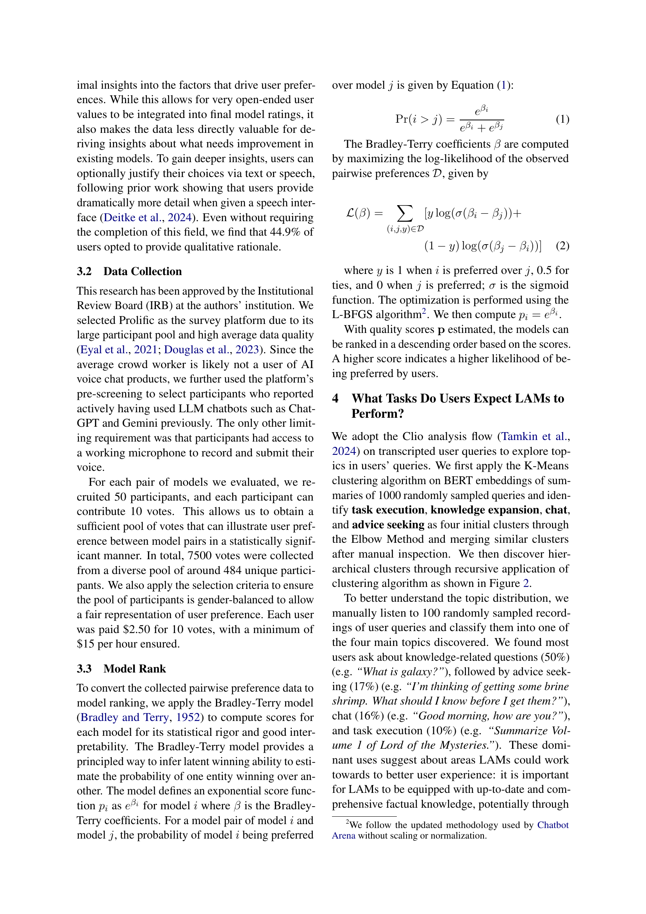

 


 2502.15919 
 Minzhi Li et el. 
 
 🤗 2025-02-25 
 



↗ arXiv


↗ Hugging Face


↗ Papers with Code


### TL;DR



현존하는 대규모 언어 모델(LLM) 평가 방식이 사용자의 실제 요구와 선호도를 충분히 반영하지 못한다는 문제의식에서 출발합니다. 기존 연구는 주로 객관적인 지표(정확도, WER 등)에 기반한 정적 평가에 집중했지만, 본 연구는 **484명의 참가자와 7,500개의 상호작용 데이터**를 통해 사용자 중심의 동적 평가를 수행했습니다.  이는 LAM의 개발 방향 설정에 있어 사용자 경험을 우선시하는 패러다임 전환을 의미합니다.

본 연구는 **사용자 질의 분석을 통한 주요 사용 사례 도출**, **모델별 선호도 비교 및 질적 피드백 분석**, **기존 벤치마크와 사용자 선호도 간의 상관관계 분석** 등의 과정을 거쳤습니다.  그 결과, **기존 벤치마크가 사용자 선호도를 잘 예측하지 못한다는 사실**을 발견하고, 오디오 인터페이스 디자인 및 LAM 평가 방식 개선에 대한 시사점을 제시했습니다.  이는 **향후 LAM 연구의 발전에 기여**할 뿐만 아니라, AI 시스템 개발 전반에 걸쳐 사용자 경험을 최우선시하는 개발 방식의 정착에 기여할 것으로 기대됩니다.



#### Key Takeaways


 사용자 참여형 평가를 통해 LAM의 실제 사용성과 사용자 선호도를 측정할 수 있음을 보여줌 



 기존 정적 벤치마크는 LAM의 사용자 경험을 정확하게 예측하지 못함을 밝힘 



 오디오 인터페이스의 주요 사용 사례를 파악하고 향후 LAM 평가 및 개발 방향 제시 


#### Why does it matter?
본 논문은 **대규모 오디오 모델(LAM)의 사용자 중심 평가 방식 부재**라는 중요한 문제를 제기하며, **사용자 참여형 평가를 통해 LAM의 실제 사용성과 사용자 선호도를 측정**하고, 기존 정적 벤치마크의 한계를 밝히는 데 기여합니다.  **사용자 인터랙션 데이터 분석**을 통해 오디오 인터페이스의 주요 사용 사례를 파악하고, **새로운 평가 지표 개발**의 방향을 제시하여 향후 LAM 연구의 발전에 중요한 영향을 미칠 것으로 예상됩니다.  또한, 본 연구는 **다양한 분야의 연구자들에게 적용 가능한 사용자 중심 평가 방법론**을 제시함으로써, AI 시스템 개발 전반에 걸쳐 긍정적인 영향을 줄 수 있습니다.

------
#### Visual Insights

> 🔼 본 논문의 그림 1은 대규모 오디오 모델(LAM)을 평가하는 두 가지 방법인 정적 평가와 대화형 평가를 비교한 그림입니다. 정적 평가는 기존의 벤치마크 데이터셋을 사용하여 객관적이고 재현 가능한 결과를 얻는 반면, 대화형 평가는 사용자의 동적인 상호 작용을 통해 LAM의 실제 사용성과 사용자 선호도를 평가합니다.  본 연구에서는 대화형 평가를 통해 LAM이 어떻게 사용될 가능성이 높은지, 그리고 어떻게 벤치마크할 수 있는지를 이해하고자 하였습니다. 그림은 정적 평가와 대화형 평가의 차이점을 시각적으로 보여주고, 각 방법의 장단점을 명확하게 제시합니다.
> 

> 
read the caption

> Figure 1: Comparison of static and interactive ways of evaluating Large Audio Models. In this work, we perform interactive evaluations to understand how LAMs are likely to be used and how they can be benchmarked.
> 


| Model | Humor | Sarcasm | Intent | Emotion | Relation | Gender | Age | Accent | Grounding | Language | Entity | QA | Instruction | ASR |
|---|---|---|---|---|---|---|---|---|---|---|---|---|---|---|
| _Commercial LAMs_ |  |  |  |  |  |  |  |  |  |  |  |  |  |  |
| **GPT4o** | †44.6 | †53.6 | †89.2 | †29.1 | †59.7 | 13.6 | †12.2 | †35.3 | †22.2 | †73.3 | 35.8 | †65.2 | †64.0 | 0.19 |
| **Gemini** | 35.7 | 36.0 | †91.4 | †27.2 | 35.9 | †43.9 | 7.9 | †24.5 | †25.9 | †68.8 | 23.6 | †64.2 | 59.2 | †0.17 |
| _Open-Weights LAMs_ |  |  |  |  |  |  |  |  |  |  |  |  |  |  |
| **Qwen2-audio** | 34.9 | †41.5 | †81.1 | 23.2 | 17.3 | †69.1 | †12.3 | 5.4 | 10.0 | †66.5 | †43.7 | †62.3 | 62.6 | †0.16 |
| **Typhoon** | †44.6 | †48.8 | 45.3 | 21.5 | †44.2 | †55.3 | 5.0 | 7.9 | †22.1 | 36.4 | †38.5 | 52.6 | †68.3 | 0.50 |
| **DiVA** | †46.2 | 38.3 | 61.5 | †25.2 | 34.9 | 30.5 | 10.4 | 13.0 | 17.3 | 46.5 | 18.8 | 50.5 | †66.6 | 0.83 |
| **Qwen-audio** | 39.9 | 30.8 | 69.1 | 16.4 | 30.9 | 45.5 | 8.4 | 5.0 | 5.0 | 58.1 | †38.7 | 60.3 | 45.6 | †0.07 |
| **NExTGPT** | 26.6 | 16.9 | 12.7 | 8.6 | 27.4 | 24.1 | 8.5 | 6.8 | 8.7 | 26.4 | 12.2 | 37.9 | 6.4 | 2.37 |
| **PandaGPT** | 42.6 | 33.4 | 13.9 | 11.1 | †44.2 | 42.5 | †11.7 | 4.0 | 8.7 | 33.5 | 17.6 | 39.5 | 25.7 | 3.34 |
| _Baselines_ |  |  |  |  |  |  |  |  |  |  |  |  |  |  |
| **ASR Pipeline** | 37.8 | 32.8 | 64.8 | 24.0 | 22.8 | 31.4 | 9.7 | †13.9 | 20.4 | 50.4 | 16.5 | 56.5 | 54.4 | 0.25 |
| **Random Baseline** | 50.0 | 50.0 | 25.0 | 25.0 | 25.0 | 50.0 | 14.3 | 20.0 | 25.0 | 25.0 | 25.0 | - | - | - |

> 🔼 표 1은 14가지 음성 이해 과제에 걸쳐 20가지의 서로 다른 벤치마크에서 LAM(Large Audio Model)과 임의 기준 모델의 평균 성능을 보여줍니다.  각 과제에서 가장 높은 성능을 기록한 모델은 굵게 표시되었고, 상위 3개의 모델은 ††로 표시되어 있습니다.  이 표는 다양한 음성 이해 능력을 평가하기 위해 사용된 다양한 벤치마크에서 각 모델의 성능을 비교하여,  모델 간의 강점과 약점을 보여줍니다.
> 

> 
read the caption

> Table 1: Average performance of LAMs and random baseline on 20 different benchmarks across 14 different speech understanding tasks. Top model performance is bolded, and top three model performances are marked with ††\dagger†.
> 

### In-depth insights

#### Interactive LAMs
대화형 대규모 오디오 모델(Interactive LAMs)은 사용자와의 **실시간 상호작용**에 초점을 맞춘 새로운 패러다임을 제시합니다. 기존의 정적 평가 방식을 넘어, **사용자 피드백**과 선호도를 직접적으로 반영하는 평가 시스템의 필요성을 강조합니다.  **사용자 중심**의 평가는 모델 개발 방향 설정에 중요한 역할을 하며, 사용자의 요구와 기대치에 부합하는 모델 개발에 필수적입니다.  **다양한 사용 사례**를 포착하고, 모델 성능과 사용자 경험 간의 상관관계를 분석하는 것이 중요합니다.  **정량적 및 정성적 데이터**를 모두 활용하여, 사용자 만족도를 높이고 실제 사용 환경에 더욱 적합한 모델을 개발하는 데 기여할 수 있습니다.  **새로운 평가 지표 및 벤치마크** 개발이 필요하며,  모델의 대화 능력, 이해력, 그리고 문맥 인식 능력 등을 종합적으로 평가하는 방식을 모색해야 합니다.

#### Benchmark Limitations
본 논문에서 다루는 벤치마크의 주요 한계점은 **상호작용적 사용자 경험을 충분히 반영하지 못한다는 점**입니다. 기존 벤치마크는 주로 정적이고 객관적인 지표에 의존하여 모델 성능을 평가하지만, 실제 사용자들은 다양한 요구와 선호도를 가지고 있으며, 이러한 요소는 정적인 측정으로는 포착할 수 없습니다. 따라서 **사용자 피드백을 수집하고 분석하여** 모델 평가에 반영하는 상호작용적 평가 방식이 필요합니다. 또한, **현재 벤치마크는 특정 작업에 편향되어** 있을 수 있으며, 다양한 상황과 작업에 대한 모델의 일반화 능력을 제대로 평가하지 못할 수 있습니다. 따라서 다양한 작업 유형을 포함하고, **실제 사용 환경을 더욱 잘 반영하는** 벤치마크 개발이 필요합니다. 마지막으로, **장기적인 사용 패턴과 변화하는 사용자 요구에 대한 고려가 부족**하다는 점도 벤치마크의 한계점으로 지적할 수 있습니다. 따라서 벤치마크는 지속적으로 업데이트 및 개선되어야 하며, 사용자 피드백과 실제 사용 환경 변화를 반영해야 합니다.

#### User Preference Study
본 논문은 사용자 선호도 연구를 통해 대규모 오디오 모델(LAM) 평가의 한계를 극복하고자 합니다. **기존의 정적인 벤치마크 방식은 실제 사용자 경험과의 괴리를 보이며, 모델 개발 방향 설정에 어려움을 초래합니다.** 따라서, 연구진은 7,500회 이상의 사용자 상호작용 데이터를 수집하여, 사용자 선호도를 측정하고 주요 사용 사례를 도출합니다. 이를 통해 오디오 인터페이스의 실질적 요구사항을 파악하고, **사용자 니즈에 부합하는 모델을 식별**하는 데 초점을 맞춥니다. 특히, 정적 벤치마크 결과와 사용자 선호도 간의 상관관계 분석을 통해, **기존 평가 방식의 예측력 부족**을 확인하고, 향상된 LAM 평가 방식 개발의 필요성을 강조합니다. **본 연구의 핵심은 사용자 중심의 평가를 통해 LAM 개발 방향을 제시하고, 실제 사용자 경험을 반영한 더욱 효과적인 평가 시스템을 구축**하는 데 있습니다.

#### Audio Task Analysis
본 논문에서 "오디오 작업 분석"이라는 제목의 섹션은 사용자들이 대규모 오디오 모델(LAM)과 상호작용하는 방식을 심층적으로 이해하는 데 중점을 둘 것입니다.  **사용자 질의의 주제 모델링을 통해 오디오 인터페이스의 주요 사용 사례를 파악**하고, 사용자 선호도 순위 및 정성적 피드백을 분석하여 어떤 모델이 사용자 요구에 가장 적합한지 확인합니다. **기존 벤치마크가 상호작용 성능을 얼마나 잘 예측하는지 평가**하고, **상호작용 결과와 강한 상관관계를 보이는 벤치마크가 없는 점**을 밝힙니다. 이를 통해, **사용자 선호도와 더 잘 연관되는 LAM 평가 방식의 필요성**을 강조할 것입니다.  **단순히 정량적 지표에만 의존하지 않고, 사용자 경험과 피드백을 고려한 정성적 분석을 병행**하여 보다 현실적이고 실용적인 오디오 모델 개발 방향을 제시할 것으로 예상됩니다.

#### Future of LAMs
본 논문은 대규모 오디오 모델(LAM)의 현재 평가 방식의 한계를 지적하고, 사용자 참여형 평가의 중요성을 강조합니다. **특히, 기존의 정적인 벤치마크는 사용자의 실제 선호도를 정확히 반영하지 못한다는 점을 보여줍니다.** 따라서, **미래의 LAM 연구는 사용자 중심적 관점을 고려하여 모델을 개발하고 평가하는 방향으로 나아가야 합니다.** 이를 위해서는 **보다 다양하고 정교한 사용자 인터페이스를 설계**하고, **사용자 피드백을 효과적으로 수집 및 분석하는 방법론**을 개발해야 합니다. 또한, **정적 벤치마크와 사용자 경험 간의 상관관계를 높이는 새로운 벤치마크 개발**도 중요한 과제입니다.  **다양한 언어와 문화적 배경을 포괄하는 데이터셋 구축**을 통해 모델의 일반화 성능을 향상시키는 노력도 필요합니다.  궁극적으로, **사용자의 요구와 기대치를 충족하는 실용적이고 효과적인 LAM 개발**이 미래의 중요한 목표가 될 것입니다.  이를 위해서는 학계와 산업계의 협력을 통한 지속적인 연구와 개발이 필수적입니다.

### More visual insights

More on figures

> 🔼 이 그림은 사용자의 질문을 계층적 클러스터링 기법을 통해 분석하여 주요 질문 유형을 보여줍니다. 왼쪽은 계층적 클러스터링 과정을 시각적으로 보여주며, 사용자 질문의 주요 네 가지 주제(작업 실행, 지식 확장, 채팅, 조언 구하기)와 각 주제의 하위 주제를 나타냅니다. 오른쪽 그래프는 각 질문 유형이 전체 질문 중 차지하는 비율을 보여주는 파이 차트입니다. 이를 통해 사용자가 대화형 오디오 모델에게 어떤 유형의 질문을 주로 하는지, 그리고 각 유형의 질문이 얼마나 빈번한지를 알 수 있습니다.
> 

> 
read the caption

> Figure 2: We identify four main topics in user queries — task execution, knowledge expansion, chat, advice seeking as well as sub-topics under each category through hierarchical clustering (left) and analyze the relative proportions of each query type (right).
> 

> 🔼 그림 3은 본 논문의 평가에서 얻은 6개의 음성-텍스트 모델에 대한 짝 비교 결과(왼쪽)와 Bradley-Terry 점수(오른쪽)를 보여줍니다. 왼쪽 그래프는 각 모델 쌍에 대한 승률을 보여주며, * 표시는 짝 부트스트랩 검정을 통해 유의미한 차이(P<0.05)를 나타냅니다. 오른쪽 그래프는 Bradley-Terry 점수 분포를 보여주며, 10,000번의 부트스트랩을 통해 계산되었습니다. †† 는 ASR(Automatic Speech Recognition)과 LLM(Large Language Model) 파이프라인을 나타냅니다. 이 그림은 다양한 모델의 상대적 성능을 시각적으로 비교하여 사용자 선호도를 이해하는 데 도움이 됩니다.
> 

> 
read the caption

> Figure 3: Head-to-head model comparisons (left) and Bradley-Terry (right) Scores from our evaluation. For win rates, * indicates the difference between preferences is significant (P<0.05) by a pairwise bootstrap test. For Bradley-Terry scores, distributions are shown shown for 10,000 bootstraps. ††\dagger† denotes an ASR + LLM pipeline.
> 

> 🔼 그림 4는 다양한 모델들에 대한 사용자 선호도 예측 변수로서 벤치마크 성능 차이를 분석한 혼합 효과 회귀 분석 결과를 보여줍니다.  VIF(Variance Inflation Factor) 임계값 10.0을 사용하여 15개의 다른 특징들을 사전 선별하였고, 동점 자료는 제외했습니다. 모델 적합 과정에서 벤치마크는 고정 효과로, 모델 식별자는 임의 효과로 처리했습니다. 분석 결과, 조건부/한계 R²는 0.99/0.30으로 나타났습니다.  즉, 벤치마크 성능 차이가 사용자 선호도를 예측하는 데 어느 정도 효과적이지만(조건부 R² 0.99), 모델 식별자를 고려했을 때 예측력은 30% 수준으로 제한적임을 시사합니다. 
> 

> 
read the caption

> Figure 4: Mixed-effect regression of benchmark performance differences as a predictor of user preferences across models. 15 other features were pre-screened using VIF thresholding (threshold=10.0) with ties removed. Model fitting was performed fixed effects for benchmarks and random effects for model identity. The model achieved conditional/marginal R2superscript𝑅2R^{2}italic_R start_POSTSUPERSCRIPT 2 end_POSTSUPERSCRIPT of 0.99/0.30.
> 

> 🔼 그림 A.1은 논문에서 사용된 20개의 정적 벤치마크에 대한 모델 성능의 PCA 분석 결과를 보여줍니다. PCA (주성분 분석)는 고차원 데이터를 저차원 공간으로 축소하여 데이터의 주요 변동성을 설명하는 주성분을 찾는 기법입니다. 이 그림은 각 주성분이 설명하는 분산의 비율과, 각 벤치마크가 주성분에 얼마나 기여하는지를 보여주는 로딩 값을 시각적으로 표현합니다. 이를 통해 다양한 벤치마크 간의 상관관계와 모델 성능의 주요 패턴을 파악할 수 있습니다.  그림은 벤치마크들의 상관관계를 보여주는 히트맵과, 각 주성분별 분산 설명량을 나타내는 막대 그래프, 그리고 각 주성분의 로딩 값을 보여주는 그래프로 구성되어 있습니다.
> 

> 
read the caption

> Figure A.1: PCA Analysis of model performance on 20 static benchmarks.
> 

> 🔼 그림 A.2는 사용자들이 제약 없이 자신의 음성 및 오디오를 녹음하고 익명의 두 개의 LAM 시스템으로부터 응답을 받는 대화형 평가의 Gradio 인터페이스를 보여줍니다. 사용자는 두 모델 간의 이진 선호도를 제공하고, 음성 또는 텍스트를 통해 정성적 피드백을 제공할 수 있는 옵션이 제공됩니다.  이 그림은 사용자 인터페이스의 모습을 보여주는 것으로, 사용자는 음성 입력을 하고, 두 개의 다른 모델로부터 텍스트 형태의 응답을 받고, 그 중 더 나은 응답을 선택하는 방식으로 진행됩니다. 선택 후, 사용자는 선택 이유에 대한 추가적인 설명을 텍스트나 음성으로 제공할 수 있습니다.
> 

> 
read the caption

> Figure A.2: Gradio interface of interactive evaluation. Users record their own speech and audio without constraints and receive responses from two LAM systems anonymously. They then provide a binary preference between the models, and are provided the option to provide qualitative feedback through either voice or text.
> 

> 🔼 그림 A.3은 대화형 평가와 다양한 정적 벤치마크에서 모델 순위 간의 Kendall Tau 순위 거리를 보여줍니다.  각 정적 벤치마크는 음성 이해 및 상호 작용과 관련된 다양한 작업(예: 음성 인식, 감정 인식, 화자 식별 등)을 평가하며, 이 그림은 각 벤치마크에서의 모델 순위와 대화형 평가에서의 모델 순위 간 차이를 정량적으로 보여줍니다.  낮은 Kendall Tau 거리는 정적 벤치마크가 대화형 평가와 일치하는 성능을 예측하는 데 더 효과적임을 나타냅니다.  반면 높은 Kendall Tau 거리는 상관관계가 낮음을 의미합니다.
> 

> 
read the caption

> Figure A.3: Kendall tau rank distance between model rank in interactive evaluation and that on different static benchmarks.
> 

### Full paper



