 


 2502.15920 
 Yufan Zhuang et el. 
 
 🤗 2025-02-25 
 



↗ arXiv


↗ Hugging Face


↗ Papers with Code


### TL;DR



대규모 언어 모델(LLM)은 긴 문맥을 이해하는 데 어려움을 겪습니다.  기존 모델들은 긴 문맥의 정보를 효과적으로 통합하고 추론하는 데 어려움을 보입니다.  이는 모델의 명목상 문맥 크기와 실제로 활용하는 문맥 크기 사이의 차이, 즉 '문맥 크기 격차' 때문입니다. 

본 논문에서는 이러한 문제를 해결하기 위해 AgenticLU라는 새로운 프레임워크를 제시합니다.  AgenticLU는 모델이 자체적으로 질문을 생성하고, 관련 맥락 정보를 찾아서 자신의 질문에 답하는 방식을 통해 이해도를 높입니다.  이를 통해 긴 문맥을 효과적으로 처리하며, 다양한 장문 컨텍스트 작업에서 우수한 성능을 보여줍니다. 



#### Key Takeaways


 AgenticLU는 **장문 질문에 대한 자체적인 질문 생성 및 맥락 정보 검색**을 통해 LLM의 이해도를 향상시킵니다. 



 다양한 장문 컨텍스트 작업에서 **최첨단 성능**을 달성했습니다. 



 **두 단계 미세 조정(SFT와 DPO)**을 통해 추론 품질을 효과적으로 개선했습니다. 


#### Why does it matter?
본 논문은 **장문 컨텍스트 이해**라는 어려운 문제에 대한 새로운 접근법을 제시하여, 연구자들이 **장문 데이터를 효과적으로 처리하고 분석**하는 데 도움이 될 수 있습니다.  **새로운 프레임워크인 AgenticLU는 다양한 장문 컨텍스트 과제에서 최첨단 성능**을 달성했으며, 특히 **다단계 추론이 필요한 복잡한 질문**에 효과적입니다. 또한, 이 연구는 **추후 연구를 위한 새로운 방향**을 제시하며, 특히 **자기 개선과 컨텍스트 기반 추론**에 대한 추가 연구가 필요합니다. 

------
#### Visual Insights

> 🔼 그림 1은 AgenticLU 파이프라인의 개요를 보여줍니다.  AgenticLU는 에이전트 기반 워크플로우를 통해 모델이 장문 컨텍스트 입력에 대한 이해를 반복적으로 개선하는 프레임워크입니다. 각 단계에서 모델은 자체적으로 질문을 명확히 하고, 포인트백 메커니즘을 통해 관련 컨텍스트를 검색하며, 추론 과정을 업데이트합니다. 이 프레임워크는 다양한 추론 경로를 생성하기 위해 CoC 경로 구성을 통합하고, 장문 컨텍스트 이해도를 높이기 위해 2단계 미세 조정(SFT 및 DPO)을 거칩니다.  즉, 모델은 자체적으로 질문을 생성하고 답변하며, 관련 정보를 찾아 이해도를 높여나가는 과정을 거치는 것을 보여줍니다.  CoC(Chain-of-Clarifications) 경로 생성을 통해 여러 가지 추론 경로를 만들고, SFT(Supervised Fine-Tuning)와 DPO(Direct Preference Optimization)를 사용하여 모델을 미세 조정함으로써 장문 컨텍스트 이해 능력을 향상시킵니다.
> 

> 
read the caption

> Figure 1: Overview of the AgenticLU pipeline: The model iteratively refines its understanding of long-context inputs through an agentic workflow. At each step, it raises self-clarifications, retrieves relevant context via the pointback mechanism, and updates its reasoning trace. The framework integrates CoC Path Construction to generate diverse reasoning paths, followed by two-stage fine-tuning (SFT and DPO) to enhance long-context understanding.
> 


| Data | # |
|---|---| 
| **Num of Traces** | 107,550 |
| **Avg Context Length** | 67,812 |
| **Avg Chosen Response Length** | 165 |
| **Avg Rejected Response Length** | 164 |
| **Total Generation Tokens** | 17M |

> 🔼 이 표는 NarrativeQA 데이터셋을 기반으로 생성된 추적(trace) 데이터셋의 통계를 보여줍니다.  AgenticLU 모델의 학습에 사용된 데이터셋의 크기, 문맥 길이, 응답 길이 등에 대한 정보를 제공합니다.  총 107,550개의 추적이 생성되었고, 검증을 위해 11,900개의 추적은 제외되었습니다. 평균 문맥 길이는 67,812 토큰, 평균 선택 응답 길이는 165 토큰, 평균 기각 응답 길이는 164 토큰입니다.  총 토큰 수는 17M에 달합니다.
> 

> 
read the caption

> Table 1: Statistics of the generated traces dataset used in finetuning derived from NarrativeQA. We left out 11.9K traces for validation.
> 

### In-depth insights

#### AgenticLU Framework
AgenticLU 프레임워크는 **장문 맥락 이해를 위한 새로운 접근 방식**을 제시합니다.  핵심은 **자기 질의(self-clarification)와 맥락 기반 지식 활용(contextual grounding)**을 에이전트 기반 워크플로우에 통합하는 것입니다.  모델은 스스로 질문을 생성하고, 답을 찾기 위해 관련 정보를 검색하며, 이를 통해 이해도를 점진적으로 향상시킵니다. **Chain-of-Clarifications (CoC)**는 이러한 과정을 반복적으로 수행하여 복잡한 질문에 대한 이해도를 높입니다.  **트리 탐색 방식의 추론 확장**을 통해 효율적으로 관련 정보를 수집하고, **두 단계의 미세 조정(fine-tuning)**을 거쳐 효과적인 질문 분해 전략과 추론 능력을 향상시킵니다.  **NarrativeQA 데이터셋**을 사용하여 학습된 AgenticLU는 기존 방법들보다 뛰어난 성능을 보이며, 특히 **장문 맥락에서의 다단계 추론 능력**이 향상된 것을 확인할 수 있습니다.  이는 단순히 맥락 창 크기를 늘리는 것보다 **효과적인 맥락 처리**가 장문 맥락 이해에 중요함을 시사합니다.

#### CoC Path Distillation
본 논문에서 제시된 'CoC 경로 증류(CoC Path Distillation)'는 **장문 컨텍스트 이해를 위한 효율적인 방법**으로, **트리 탐색을 통해 얻은 다양한 질문-정답 경로(CoC)**를 모델이 **단일 추론 과정에서 효과적인 질문과 맥락을 생성**하도록 학습시키는 과정입니다. 이는 훈련 단계에서 **계산 비용이 높은 트리 탐색 과정을 최소화**하고, 추론 속도를 향상시키는 데 중요한 역할을 합니다.  **지도 학습(SFT)과 직접적 선호도 최적화(DPO)**라는 2단계 미세조정을 통해 모델은 다양한 CoC 경로를 학습 데이터로 활용하여 효과적으로 질문을 분해하고 관련 맥락을 검색하는 능력을 향상시키게 됩니다. **단일 추론 단계에서도 효율적으로 장문 질무응답을 수행**할 수 있도록 모델의 성능을 높이는 핵심 기술이라 할 수 있습니다.  결과적으로 CoC 경로 증류는 효율성과 성능을 동시에 달성하는 혁신적인 전략이라고 볼 수 있습니다.

#### Context Size Gap
본 논문의 "Context Size Gap" 부분은 **LLM의 명칭상 context 크기와 실제 효과적으로 처리 가능한 context 크기 사이의 불일치**를 다룹니다.  이는 모델이 이론적으로는 수십만 또는 수백만 토큰을 처리할 수 있다고 주장하지만, 실제로는 훨씬 적은 양의 텍스트만 효과적으로 이해하고 추론에 활용한다는 점을 의미합니다. 이러한 격차는 모델의 성능을 제한하고, 특히 장문의 맥락을 요구하는 질문에 대한 응답 정확도를 떨어뜨립니다. **HotPotQA 데이터셋을 사용한 Llama 3.1-8B 모델의 실험 결과**는 이러한 context 크기 격차를 명확히 보여줍니다.  즉, 128K 토큰의 context를 지원하도록 설계되었지만, 실제 성능은 context 크기가 증가함에 따라 급격히 저하됨을 확인했습니다.  이러한 현상은 단순히 context window 크기의 문제가 아닌, 모델이 **방대한 양의 정보를 효율적으로 처리하고 통합하는 능력**의 한계를 보여줍니다.  따라서, 단순히 context 크기를 늘리는 것만으로는 장문 이해 문제를 해결할 수 없다는 것을 시사합니다. 이러한 문제의 해결을 위해 논문에서는 AgenticLU라는 새로운 프레임워크를 제안하여, **자기 질문과 맥락 기반 추론을 통해 효율적으로 장문의 텍스트를 처리**하는 방안을 모색합니다.

#### Long-Context QA
본 논문에서 'Long-Context QA'는 **긴 문맥을 가진 질문에 대한 답변 능력**을 평가하는 주요 지표로 제시됩니다.  단순히 긴 텍스트를 처리하는 능력을 넘어, **관련 정보를 효과적으로 추출하고 다단계 추론을 통해 정확한 답을 도출하는 능력**을 의미합니다.  이러한 맥락에서, 기존의 LLM(Large Language Model)들이 긴 문맥에서 정보를 효과적으로 활용하지 못하는 한계점을 극복하기 위한 다양한 방법론들이 제시되고 있으며, **AgenticLU와 같은 에이전트 기반의 접근 방식**은 그중 하나의 중요한 시도로 평가될 수 있습니다.  AgenticLU는 자기 질문 생성(self-clarification)과 맥락 기반 추론(contextual grounding)을 통해, **다단계 추론 과정을 효율적으로 수행하며 정확도를 높이는 것을 목표**로 합니다. 따라서, 논문에서 'Long-Context QA'는 단순한 기술적 과제를 넘어, LLM의 지능 수준을 평가하는 핵심 지표이자,  향후 LLM 발전 방향을 제시하는 중요한 요소로 해석될 수 있습니다.

#### Future Work
본 논문의 핵심 아이디어는 장문 맥락 이해를 위한 에이전트 기반 프레임워크인 AgenticLU를 제시하는 것입니다.  **향후 연구 방향**으로는 몇 가지 중요한 개선점을 고려해볼 수 있습니다.  첫째, **모델이 스스로 언제 다단계 추론을 중단할지 결정하는 완전한 에이전트 메커니즘을 개발**해야 합니다. 현재 모델은 고정된 추론 단계를 사용하지만, 효율성을 높이려면 모델이 상황에 맞게 단계 수를 동적으로 조절할 수 있어야 합니다. 둘째, **다양한 유형의 장문 맥락 질의에 대한 일반화 성능을 향상**시키는 것이 중요합니다.  현재는 특정 데이터셋에 기반하여 성능을 평가했지만, 실제 응용 환경에서는 더욱 다양한 질의가 발생할 수 있습니다.  셋째, **계산 비용을 더욱 효율적으로 관리**하는 방법을 연구해야 합니다.  장문 맥락 이해는 계산 비용이 높은 작업이므로, 효율성을 높이는 것은 실제 적용에 매우 중요합니다. 마지막으로, **AgenticLU의 성능을 다양한 언어 모델과 데이터셋에서 평가**하고, 다른 장문 맥락 이해 방법론과의 비교 분석을 수행하여 그 효과를 더욱 명확하게 제시할 필요가 있습니다. 이러한 후속 연구를 통해 AgenticLU는 더욱 강력하고 실용적인 장문 맥락 이해 시스템으로 발전할 수 있을 것입니다.

### More visual insights

More on figures

> 🔼 그림 2는 모델의 명목상의 context 길이와 실제로 효과적으로 활용 가능한 context 길이 간의 차이를 보여줍니다. Llama3.1-8B-Instruct 모델은 최대 128K 토큰의 context를 처리할 수 있도록 설계되었지만, HotPotQA 데이터셋을 사용한 실험 결과, 입력 길이가 8K, 16K, 32K, 64K, 128K로 증가함에 따라 성능이 급격히 저하되는 것을 보여줍니다. 이는 모델이 명목상으로 지원하는 context 길이보다 훨씬 짧은 길이의 context만을 실제로 효과적으로 처리한다는 것을 의미합니다. 그림은 모델의 명목상 context 용량과 실제 효과적인 context 용량 간의 차이를 시각적으로 보여줍니다.
> 

> 
read the caption

> Figure 2: Effective context size is smaller than nominal context size. Performance of Llama3.1-8B-Instruct (advertised 128K-token context) on the HotPotQA dataset drops sharply as input length increases (8K, 16K, 32K, 64K, 128K), illustrating the gap between nominal and effective context capacities.
> 

> 🔼 그림 3은 8KB에서 128KB까지 다양한 문맥 길이에 걸쳐 7가지 장문맥 작업에 대한 주요 결과를 보여줍니다. 점선 주황색으로 표시된 AgenticLU-8B 모델은 기본 모델인 Llama3.1-8B (실선 주황색) 모델에 비해 모든 작업에서 성능이 크게 향상되었음을 보여줍니다. 또한, 단계별, 계획 및 해결, 사실 및 반성, LongRAG 등의 프롬프팅 방법과 최첨단 ProLong-8B 모델과 비교 분석하여 AgenticLU-8B가 대부분의 작업과 문맥 길이에서 일관되게 강력한 성능을 유지함을 보여줍니다.
> 

> 
read the caption

> Figure 3: Main results on 7 long-context tasks across context lengths from 8K to 128K. Our AgenticLU-8B (dotted orange) achieves significant improvements on all tasks over our base model Llama3.1-8B (solid orange). We also compare with the prompting methods (Step-by-Step, Plan-and-Solve, Fact-and-Reflect, LongRAG) and the state-of-the-art ProLong-8B model. AgenticLU-8B consistently maintains strong performance across most tasks and context lengths.
> 

More on tables


| Model | Short Avg | HotpotQA | Natural Questions | TriviaQA | PopQA | NarrativeQA | InfiniQA | InfiniChoice | Long Avg |
|---|---|---|---|---|---|---|---|---|---|
| Llama3.1-8B | 62.3 | 40.0 | 56.1 | 80.6 | 56.1 | 38.0 | 48.0 | 55.0 | 53.4 |
| AgenticLU (<math alttext="δ" class="ltx_Math" display="inline" id="S6.T2.3.1.1.1.m1.1"><semantics id="S6.T2.3.1.1.1.m1.1a"><mi id="S6.T2.3.1.1.1.m1.1.1" xref="S6.T2.3.1.1.1.m1.1.1.cmml">δ</mi><annotation-xml encoding="MathML-Content" id="S6.T2.3.1.1.1.m1.1b"><ci id="S6.T2.3.1.1.1.m1.1.1.cmml" xref="S6.T2.3.1.1.1.m1.1.1">𝛿</ci></annotation-xml><annotation encoding="application/x-tex" id="S6.T2.3.1.1.1.m1.1c">δ</annotation><annotation encoding="application/x-llamapun" id="S6.T2.3.1.1.1.m1.1d">italic_δ</annotation></semantics></math>) | -0.6 | +31.1 | +21.7 | +7.7 | +9.4 | +18.0 | +2.0 | +13.0 | +14.7 |
> 🔼 표 2는 AgenticLU와 기본 모델인 Llama3.1-8B-Instruct의 성능 차이(AgenticLU-8B에서 Llama3.1-8B를 뺀 값)를 보여줍니다. 긴 문맥(128K 토큰 작업)과 짧은 문맥 벤치마크(ARC, GSM8K, MMLU를 포함한 6가지 일반 작업) 모두에 대한 결과를 포함하며, 짧은 문맥 성능에 대한 자세한 내용은 부록 B에 나와 있습니다. 점수는 정확도를 나타내며, AgenticLU는 긴 문맥 작업에서 성능이 크게 향상되었고 일반 작업에는 거의 영향을 미치지 않았음을 보여줍니다.
> 

> 
read the caption

> Table 2: Performance difference of AgenticLU and its base, Llama3.1-8B-Instruct (δ=𝛿absent\delta=italic_δ =AgenticLU-8B minus Llama3.1-8B), on long context (the 128K tasks) and short-context benchmarks (6 regular tasks including ARC, GSM8K, and MMLU), the details of the short-context performance can be found in appendix B. Scores represent accuracy, with AgenticLU demonstrating significantly improved performance across long-context tasks with minimal effect on regular task performance.
> 


| Model | HotpotQA | NaturalQ | PopQA | TriviaQA | Avg |
|---|---|---|---|---|---| 
| Llama-3.1-8B | 40.0 | 56.1 | 56.1 | 80.6 | 58.2 |
| AgenticLU-8B | 71.1 | 77.8 | 65.5 | 88.3 | 75.7 |
| (w/ 2 rounds) | 71.1 | 76.7 | 67.2 | 91.7 | 76.7 |
| (w/ 3 rounds) | 75.5 | 78.8 | 68.3 | 91.1 | 78.4 |
> 🔼 이 표는 추론 시 추가적인 자기 설명 및 문맥적 근거 추가 라운드의 성능을 평가한 결과를 보여줍니다. 자기 설명의 이점은 첫 번째 라운드에서 최적에 가깝다는 것을 알 수 있습니다.
> 

> 
read the caption

> Table 3: We evaluate the performance of adding additional self-clarification and contextual grounding rounds at inference time. The gain from self-clarification is close to optimal at the initial round.
> 


| Model | HotpotQA | NaturalQ | PopQA | TriviaQA | Avg |
|---|---|---|---|---|---| 
| Llama-3.1-8B | 40.0 | 56.1 | 56.1 | 80.6 | 58.2 |
| AgenticLU-8B | 71.1 | 77.8 | 65.5 | 88.3 | 75.7 |
| (w/o Clarification) | 57.8 | 56.7 | 55.5 | 78.3 | 62.1 |
| (w/o Pointback) | 53.3 | 59.4 | 52.7 | 83.3 | 62.2 |
> 🔼 이 표는 AgenticLU-8B 모델에서 자기 설명 단계와 문맥적 근거 단계를 제거했을 때의 성능을 보여줍니다.  128K 길이의 문맥을 사용하는 네 가지 과제(HotpotQA, Natural Questions, PopQA, TriviaQA)에 대한 결과가 제시되어 있습니다. 각 과제에 대해 AgenticLU-8B의 기본 성능과 자기 설명 제거, 문맥적 근거 제거 시의 성능을 비교하여 각 단계의 중요성을 분석합니다.  자기 설명과 문맥적 근거가 장문 맥락 이해에 얼마나 중요한 역할을 하는지 보여주는 실험 결과입니다.
> 

> 
read the caption

> Table 4: We test the agentic workflow with AgenticLU-8B when taking out the self-clarification steps and the contextual grounding (pointback) step. The tasks are with 128K context length.
> 


| Metric | Baseline | AgenticLU |
|---|---|---|
| Runtime Overhead | 100% | 101.93% |
| Avg Tokens Generated in One Round | 76.28 | 1205.38 |
> 🔼 표 5는 기존의 직접 답변 방식(Baseline)과 제안하는 AgenticLU 모델의 성능 오버헤드를 비교 분석한 표입니다.  직접 답변 방식은 질문에 대한 답변을 바로 생성하는 방식이고, AgenticLU는 자기 질문과 답변을 통해 추론 과정을 거치는 방식입니다.  따라서,  실행 시간 오버헤드(Runtime Overhead) 와 각 라운드에서 생성되는 토큰 수(Avg Tokens Generated in One Round)를 비교하여 AgenticLU 방식의 효율성을 평가합니다.
> 

> 
read the caption

> Table 5: Performance Overhead Comparison between direct answering baseline and AgenticLU.
> 


| Hyperparameter | Value |
|---|---| 
| Learning Rate | 5e-7 |
| Learning Rate Schedule | Cosine Annealing |
| Optimizer | Adam |
| \(\beta_{1}\) | 0.9 |
| \(\beta_{2}\) | 0.95 |
| Training dtype | bf16 |
| Batch Size | 128 |
| Max Length | 131,072 |
> 🔼 표 6는 본 논문의 5장(Data Generation & Model Training)에서 설명하는 Self-Taught Agentic Long-Context Understanding(AgenticLU) 모델 학습을 위한 초 매개변수(Hyperparameter)들을 보여줍니다.  Supervised Fine-Tuning(SFT) 단계에서 사용된 학습률(Learning Rate), 최적화기(Optimizer), 배치 크기(Batch Size), 최대 길이(Max Length) 등의 세부 설정 값들을 명시적으로 제시하여, AgenticLU 모델의 학습 과정에 대한 자세한 정보를 제공합니다.
> 

> 
read the caption

> Table 6: Hyperparameters for SFT.
> 


| Hyperparameter | Value |
|---|---| 
| Learning Rate | 5e-7 |
| Learning Rate Schedule | Cosine Annealing |
| Optimizer | Adam |
| β₁ | 0.9 |
| β₂ | 0.95 |
| Training dtype | bf16 |
| Batch Size | 128 |
| β | 0.1 |
| Max Length | 131,072 |
> 🔼 표 7은 Direct Preference Optimization(DPO)에 사용된 하이퍼파라미터들을 보여줍니다.  학습률, 최적화기, 배치 크기, 최대 길이 등 DPO 모델 학습에 영향을 주는 주요 설정값들이 포함되어 있습니다. 이 표는 DPO 단계에서 사용된 구체적인 하이퍼파라미터 설정을 통해 AgenticLU 모델의 성능 개선에 대한 이해를 돕습니다.
> 

> 
read the caption

> Table 7: Hyperparameters for DPO.
> 


| Model | ARC Easy | ARC Challenge | GSM8k | MathQA | MMLU | MMLU Pro | Avg |
|---|---|---|---|---|---|---|---| 
| Llama3.1-8B | 84.80 | 59.64 | 80.13 | 42.88 | 68.72 | 37.71 | 62.31 |
| AgenticLU-8B | 83.96 | 58.36 | 80.51 | 41.74 | 68.38 | 37.51 | 61.74 |
> 🔼 표 8은 AgenticLU와 Llama3.1-8B-Instruct 모델의 단기 문맥 벤치마크 결과를 비교한 것입니다.  AgenticLU는 다양한 단기 문맥 작업에서 Llama3.1-8B-Instruct 모델과 거의 동일한 성능을 보여줍니다.  표에는 ARC Easy, ARC Challenge, GSM8K, MathQA, MMLU, MMLU Pro 등 여러 가지 벤치마크 작업에 대한 정확도 비율(%)이 제시되어 있습니다.  AgenticLU가 장기 문맥 작업에 초점을 맞춘 모델임에도 불구하고, 단기 문맥 작업에서도 우수한 성능을 유지함을 보여줍니다.
> 

> 
read the caption

> Table 8: Performance comparison of AgenticLU and Llama3.1-8B-Instruct on short-context benchmarks. Scores represent accuracy percentages, with AgenticLU demonstrating matching results across tasks.
> 


|               | 8K   | 16K   | 32K   | 64K   | 128K  |
|---------------|------|-------|-------|-------|-------|
| **HotpotQA** |       |       |       |       |       |
| Llama3.1-8B   | 63.3 | 56.7  | 61.1  | 47.8  | 40.0  |
| Llama3.1-8B+step-by-step | 60.0 | 66.7  | 56.7  | 58.9  | 56.7  |
| Llama3.1-8B+plan&solve | 71.1 | 66.7  | 72.2  | 62.2  | 50.0  |
| Llama3.1-8B+fact&reflect | 58.9 | 58.9  | 62.2  | 61.1  | 48.9  |
| ProLong-8B    | 62.2 | 65.6  | 57.8  | 53.3  | 58.9  |
| Llama3.1-8B+LongRAG | 61.1 | 58.9  | 73.3  | 56.7  | 57.8  |
| AgenticLU-8B  | 81.1 | 75.6  | 78.9  | 75.6  | 71.1  |
> 🔼 표 9는 HotpotQA 데이터셋을 사용하여 다양한 컨텍스트 길이(8K, 16K, 32K, 64K, 128K 토큰)에 따른 여러 장기 컨텍스트 이해 모델의 성능을 보여줍니다.  Llama 3.1-8B 기본 모델과  여러 프롬프팅 기법(단계별, 계획 및 해결, 사실 및 반성)을 사용한 모델,  최첨단 ProLong-8B 모델, 그리고 제안된 AgenticLU-8B 모델의 정확도를 비교하여 AgenticLU-8B 모델의 우수성을 보여줍니다.
> 

> 
read the caption

> Table 9: Long-context performance on HotpotQA.
> 


| Model | 8K | 16K | 32K | 64K | 128K |
|---|---|---|---|---|---| 
| Llama3.1-8B | 71.7 | 69.4 | 70.6 | 73.9 | 56.1 |
| Llama3.1-8B+step-by-step | 66.7 | 66.1 | 58.9 | 55.6 | 38.9 |
| Llama3.1-8B+plan&solve | 67.8 | 71.7 | 66.7 | 62.2 | 50.6 |
| Llama3.1-8B+fact&reflect | 63.3 | 63.3 | 61.7 | 59.4 | 40.0 |
| ProLong-8B | 83.3 | 82.2 | 83.9 | 90.0 | 77.8 |
| Llama3.1-8B+LongRAG | 65.6 | 76.1 | 79.4 | 77.2 | 73.9 |
| AgenticLU-8B | 91.7 | 91.1 | 85.0 | 85.0 | 77.8 |
> 🔼 표 10은 Nature Questions 데이터셋을 사용하여 다양한 컨텍스트 길이(8K, 16K, 32K, 64K, 128K 토큰)에서 여러 모델의 성능을 보여줍니다.  Llama3.1-8B 기본 모델과 함께, Chain-of-Thought, Plan-and-Solve, Fact-and-Reflect 프롬프팅 기법을 적용한 모델과 LongRAG, ProLong-8B 및 AgenticLU-8B 모델의 결과를 비교 분석하여, 긴 컨텍스트를 이해하는 모델의 능력을 평가합니다. 특히, 컨텍스트 길이가 증가함에 따라 정확도 변화를 살펴보고,  AgenticLU-8B 모델의 효과를 다른 모델과 비교 분석합니다.
> 

> 
read the caption

> Table 10: Long-context performance on Nature Questions.
> 


| Model | 8K | 16K | 32K | 64K | 128K |
|---|---|---|---|---|---| 
| Llama3.1-8B | 82.8 | 86.7 | 85.6 | 81.1 | 80.6 |
| Llama3.1-8B+step-by-step | 84.4 | 86.1 | 90.0 | 82.2 | 57.2 |
| Llama3.1-8B+plan&solve | 78.9 | 88.3 | 89.4 | 87.2 | 86.7 |
| Llama3.1-8B+fact&reflect | 87.8 | 83.9 | 84.4 | 86.7 | 84.4 |
| ProLong-8B | 71.1 | 88.3 | 78.9 | 82.8 | 78.3 |
| Llama3.1-8B+LongRAG | 77.2 | 79.4 | 83.9 | 83.9 | 83.3 |
| AgenticLU-8B | 88.3 | 92.2 | 91.1 | 93.3 | 88.3 |
> 🔼 표 11은 TriviaQA 데이터셋을 사용한 장문 맥락 이해 성능을 보여줍니다. 다양한 모델 (Llama3.1-8B, Llama3.1-8B에 여러 프롬프트 기법 적용, ProLong-8B, AgenticLU-8B)의 8K, 16K, 32K, 64K, 128K 토큰 길이에 따른 정확도를 비교 분석하여 각 모델의 장문 맥락 처리 능력과 그 한계를 보여줍니다. 특히, AgenticLU-8B 모델이 다른 모델들에 비해 128K 토큰 길이에서도 높은 정확도를 유지하는 것을 확인할 수 있습니다.
> 

> 
read the caption

> Table 11: Long-context performance on TriviaQA.
> 


| Model | 8K | 16K | 32K | 64K | 128K |
|---|---|---|---|---|---| 
| Llama3.1-8B | 61.1 | 62.8 | 57.2 | 58.3 | 56.1 |
| Llama3.1-8B+step-by-step | 61.7 | 58.9 | 55.0 | 58.9 | 60.6 |
| Llama3.1-8B+plan&solve | 62.2 | 63.3 | 58.9 | 55.0 | 61.1 |
| Llama3.1-8B+fact&reflect | 65.0 | 64.4 | 58.9 | 53.3 | 65.0 |
| ProLong-8B | 67.8 | 68.3 | 70.0 | 64.4 | 65.6 |
| Llama3.1-8B+LongRAG | 47.8 | 54.4 | 54.4 | 57.2 | 50.6 |
| AgenticLU-8B | 82.2 | 82.2 | 78.3 | 76.7 | 65.6 |
> 🔼 표 12는 PopQA 데이터셋을 사용한 다양한 모델들의 장문 맥락 이해 성능을 보여줍니다. 8K, 16K, 32K, 64K, 128K 토큰 길이의 맥락을 사용한 실험 결과가 제시되어 있으며, Llama3.1-8B 기본 모델과 여러 프롬프트 기법(단계별, 계획 및 해결, 사실 및 반성, LongRAG) 및 최첨단 ProLong-8B 모델과의 비교 분석을 통해 AgenticLU-8B 모델의 성능 우수성을 보여줍니다. 각 모델의 정확도를 맥락 길이에 따라 비교하여 장문 맥락 이해에 대한 효과를 분석합니다.
> 

> 
read the caption

> Table 12: Long-context performance on PopQA.
> 


| Model | 8K | 16K | 32K | 64K | 128K |
|---|---|---|---|---|---| 
| Llama3.1-8B | 15.0 | 19.0 | 27.0 | 35.0 | 38.0 |
| Llama3.1-8B+step-by-step | 23.0 | 30.0 | 36.0 | 51.0 | 43.0 |
| Llama3.1-8B+plan&solve | 22.0 | 25.0 | 38.0 | 41.0 | 39.0 |
| Llama3.1-8B+fact&reflect | 18.0 | 35.0 | 37.0 | 42.0 | 46.0 |
| ProLong-8B | 18.0 | 27.0 | 28.0 | 38.0 | 42.0 |
| Llama3.1-8B+LongRAG | 23.3 | 23.3 | 50.0 | 50.0 | 46.7 |
| AgenticLU-8B | 27.0 | 35.0 | 41.0 | 49.0 | 56.0 |
> 🔼 표 13은 NarrativeQA 데이터셋을 사용하여 다양한 컨텍스트 길이(8K, 16K, 32K, 64K, 128K 토큰)에서 다양한 모델들의 장문 이해 성능을 보여줍니다.  AgenticLU 모델을 포함하여 Llama3.1-8B 기본 모델과 여러 프롬프트 방식(단계별, 계획 및 해결, 사실 및 반성, LongRAG) 및 최첨단 ProLong-8B 모델과 비교 분석하여, 각 모델의 정확도를 보여줍니다. 이 표는 장문 컨텍스트 이해 과제에서 AgenticLU의 성능을 평가하는 데 중요한 역할을 합니다.
> 

> 
read the caption

> Table 13: Long-context performance on NarrativeQA.
> 


| Model | 8K | 16K | 32K | 64K | 128K |
|---|---|---|---|---|---| 
| Llama3.1-8B | 17.0 | 31.0 | 36.0 | 40.0 | 48.0 |
| Llama3.1-8B+step-by-step | 21.0 | 36.0 | 36.0 | 45.0 | 43.0 |
| Llama3.1-8B+plan&solve | 17.0 | 26.0 | 32.0 | 41.0 | 40.0 |
| Llama3.1-8B+fact&reflect | 19.0 | 30.0 | 40.0 | 42.0 | 37.0 |
| ProLong-8B | 16.0 | 31.0 | 29.0 | 31.0 | 45.0 |
| Llama3.1-8B+LongRAG | 16.7 | 23.3 | 36.7 | 43.3 | 36.7 |
| AgenticLU-8B | 25.0 | 39.0 | 42.0 | 47.0 | 50.0 |
> 🔼 표 14는 논문의 6.1절 '작업 및 측정항목' 에서 다루는 긴 문맥 이해 능력 평가를 위한 벤치마크인 InfbenchQA에 대한 실험 결과를 보여줍니다.  각 모델(Llama3.1-8B, Llama3.1-8B를 기반으로 한 여러 프롬프팅 기법 적용 모델, ProLong-8B, AgenticLU-8B)의 InfbenchQA 정확도를 문맥 길이(8K, 16K, 32K, 64K, 128K 토큰)별로 비교 분석한 표입니다.  AgenticLU-8B 모델의 성능이 다른 모델들에 비해 상당히 우수함을 보여주는 표입니다.
> 

> 
read the caption

> Table 14: Long-context performance on InfbenchQA.
> 


| Model | 8K | 16K | 32K | 64K | 128K |
|---|---|---|---|---|---| 
| Llama3.1-8B | 9.0 | 12.0 | 24.0 | 39.0 | 55.0 |
| Llama3.1-8B+step-by-step | 15.0 | 13.0 | 41.0 | 41.0 | 44.0 |
| Llama3.1-8B+plan&solve | 27.0 | 15.0 | 48.0 | 55.0 | 58.0 |
| Llama3.1-8B+fact&reflect | 20.0 | 14.0 | 38.0 | 51.0 | 56.0 |
| ProLong-8B | 22.0 | 27.0 | 37.0 | 48.0 | 58.0 |
| Llama3.1-8B+LongRAG | 16.7 | 30.0 | 43.3 | 53.3 | 63.3 |
| AgenticLU-8B | 45.0 | 46.0 | 47.0 | 64.0 | 68.0 |
> 🔼 표 15는 InfiniteBench Multiple-Choice 데이터셋을 사용하여 다양한 컨텍스트 길이(8K, 16K, 32K, 64K, 128K 토큰)에 따른 다양한 모델들의 성능을 보여줍니다.  AgenticLU 모델을 포함하여 여러 기준 모델(Llama3.1-8B, Llama3.1-8B+step-by-step, Llama3.1-8B+plan&solve, Llama3.1-8B+fact&reflect, ProLong-8B, Llama3.1-8B+LongRAG)의 정확도를 비교 분석하여 긴 컨텍스트 이해 능력을 평가합니다. 각 모델의 성능 차이를 통해 긴 컨텍스트 질문에 대한 답변 정확도와 효율성을 파악할 수 있습니다.
> 

> 
read the caption

> Table 15: Long-context performance on InfbenchChoice.
> 

### Full paper


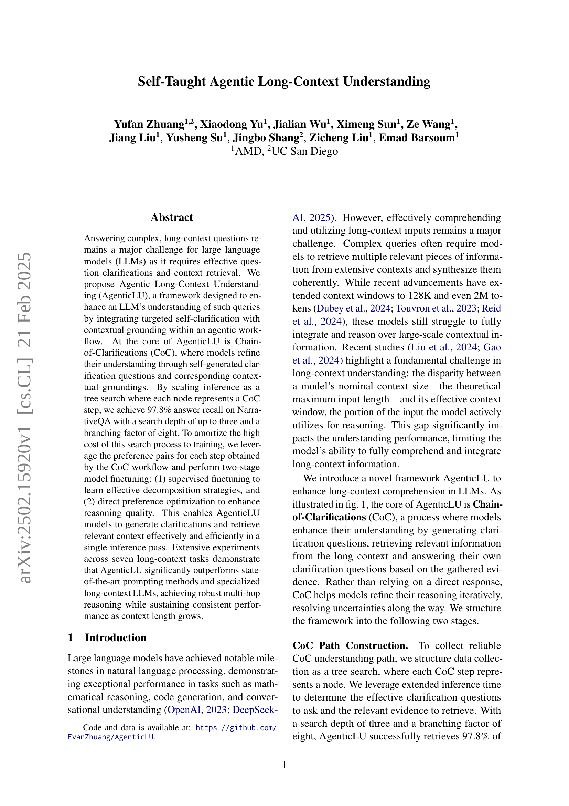
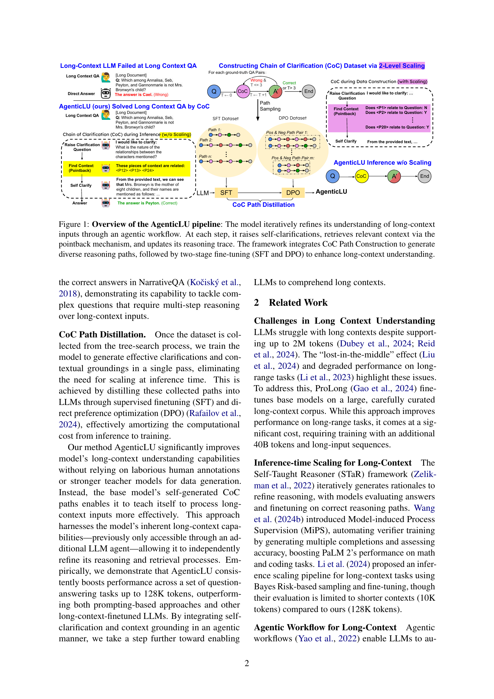
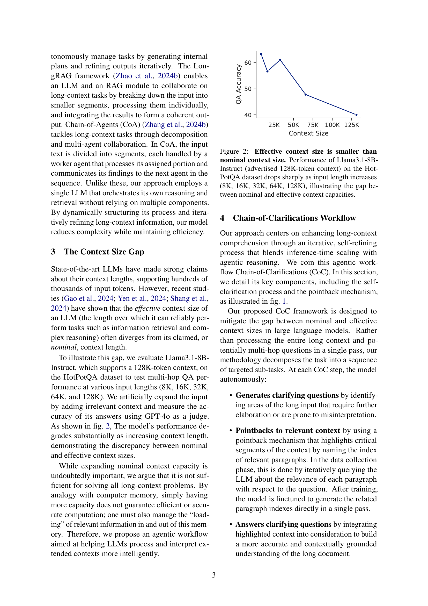
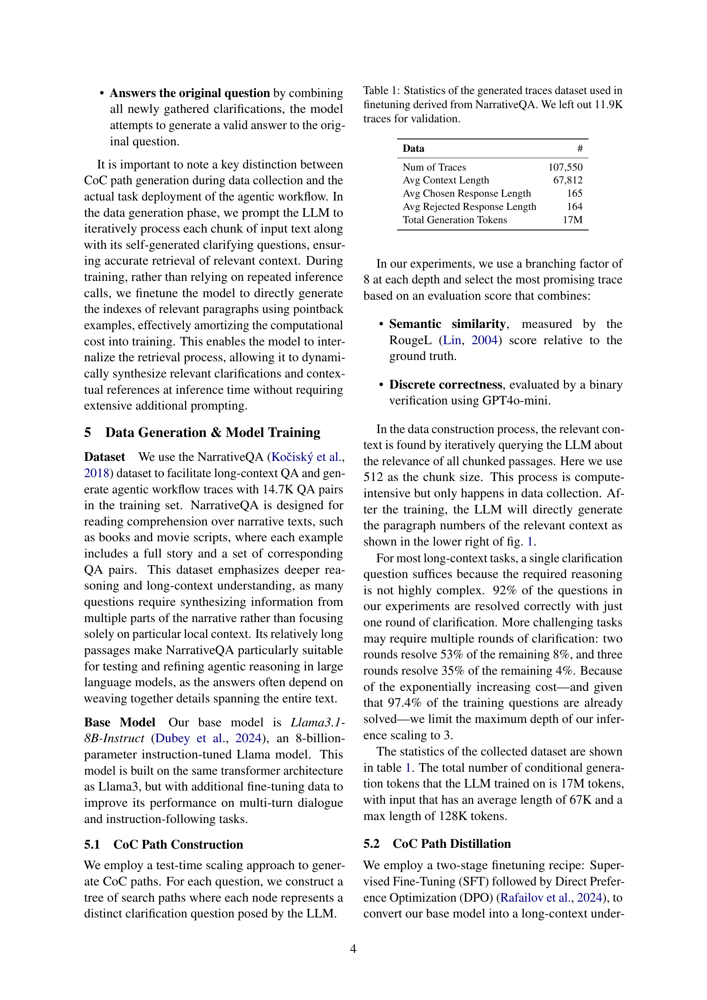
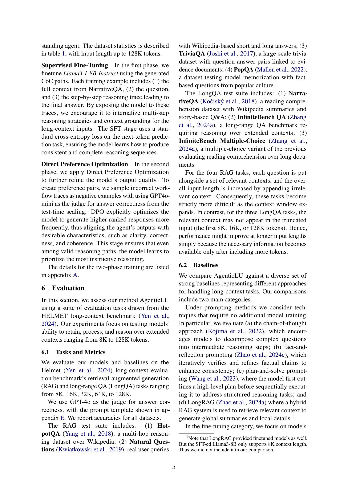
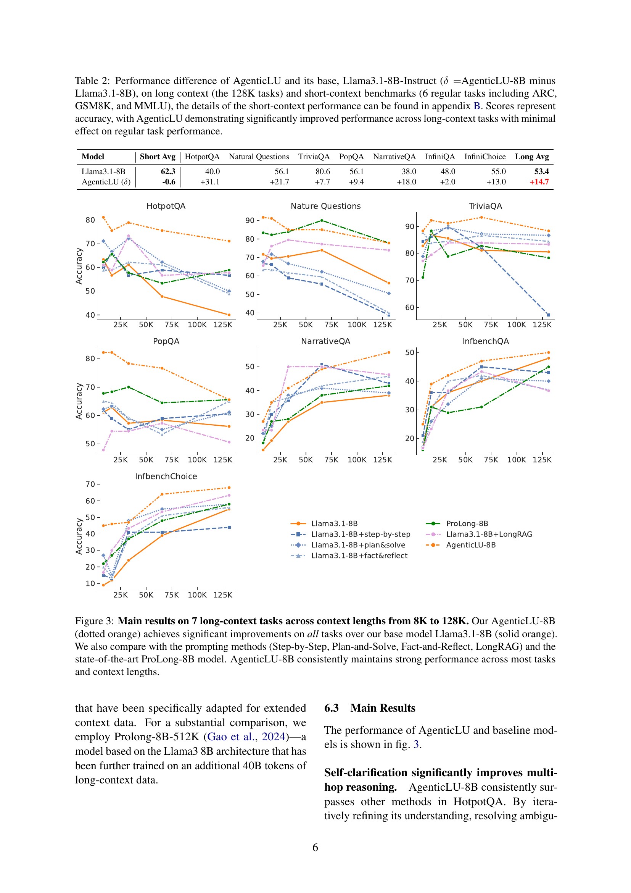
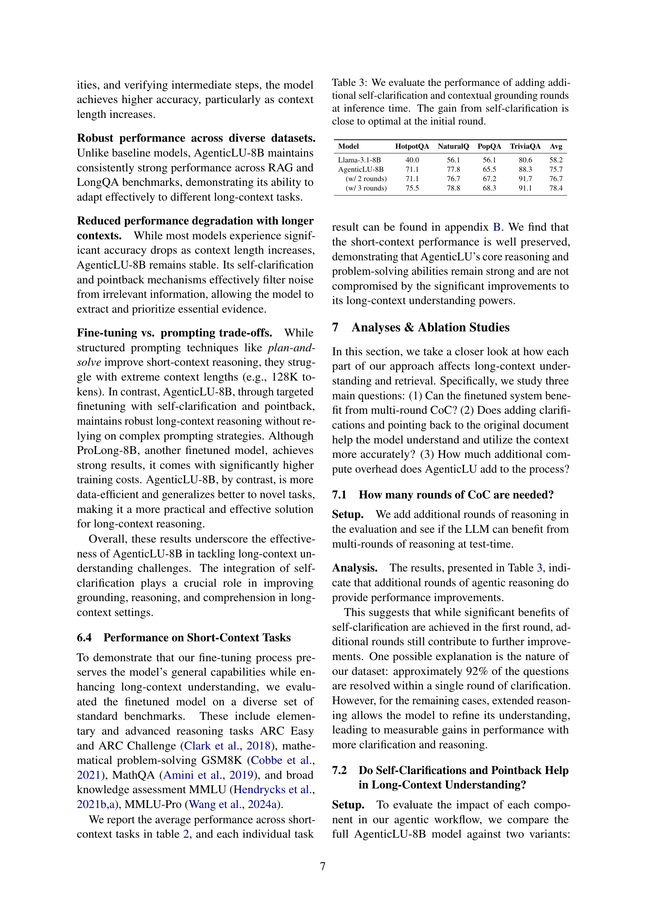
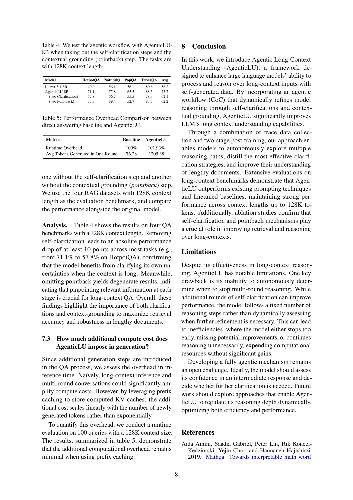
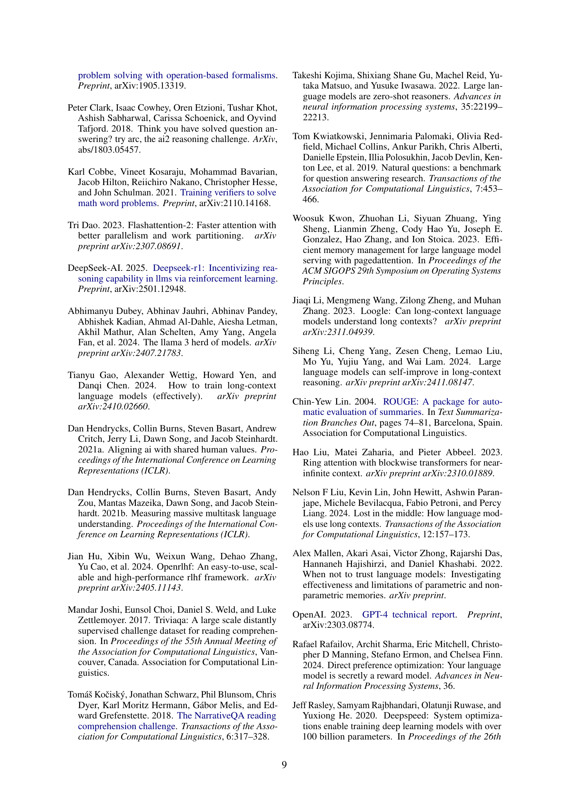
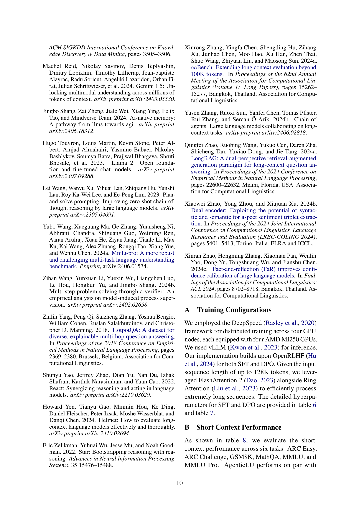
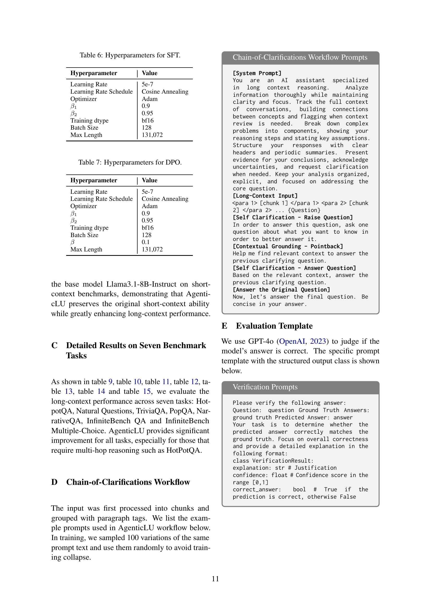
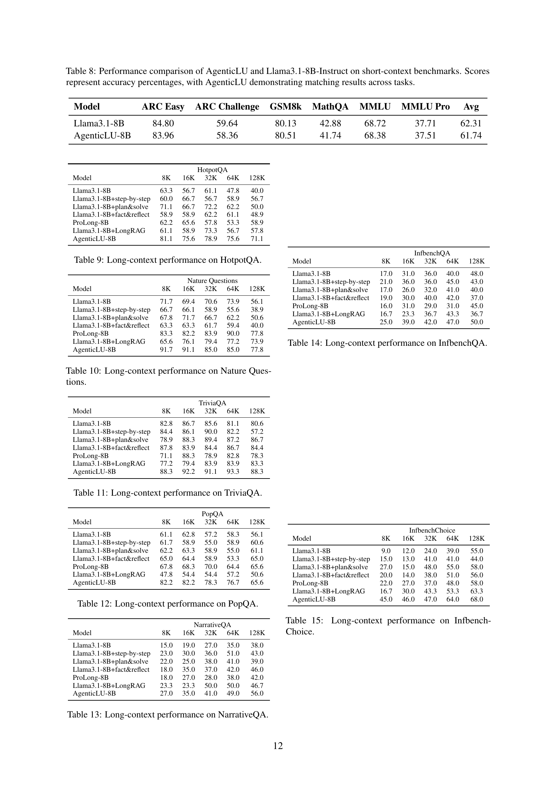
