 


 2502.15987 
 Kushal Raj Bhandari et el. 
 
 🤗 2025-02-25 
 



↗ arXiv


↗ Hugging Face


↗ Papers with Code


### TL;DR



급증하는 오픈 소스 AI 모델 생태계에서 어떤 모델이 혁신을 주도하고 AI 생태계를 형성할지 예측하는 것이 중요해지고 있습니다. 이 논문은 과학 논문 인용 동역학과 유사점을 바탕으로 오픈 소스 AI 모델의 영향력 변화를 정량화하는 프레임워크를 제안합니다.  특히, 세 가지 주요 변수 (즉각성, 지속성, 상대적 적합성)를 사용하여 모델의 영향력 변화를 추적합니다.

본 연구는 제안된 프레임워크를 사용하여 다양한 오픈 소스 AI 모델의 채택 경로를 효과적으로 포착하고, 대부분의 모델이 해당 프레임워크에 잘 맞는다는 것을 밝혔습니다.  또한, 일부 모델의 독특한 패턴이나 갑작스러운 사용량 증가를 분석하여,  모델 채택 전략 및 AI 거버넌스에 대한 시사점을 제공합니다. 특히, 조직별 모델 채택 패턴 분석을 통해 기업 전략 및 생태계 위치가 모델 성공에 미치는 영향을 분석하였습니다.



#### Key Takeaways


 과학적 인용 분석 기법을 활용한 오픈 소스 AI 모델 성장 예측 프레임워크 제시 



 모델의 장기적 영향력 예측 및 다양한 조직의 채택 패턴 분석 



 AI 거버넌스 및 비즈니스 전략 수립에 중요한 통찰력 제공 


#### Why does it matter?
본 논문은 **오픈 소스 AI 모델의 성장을 예측하는 새로운 프레임워크**를 제시하여, AI 거버넌스 및 비즈니스 전략 수립에 중요한 통찰력을 제공합니다. **과학적 인용 분석 기법을 차용**하여 모델 채택 동향을 효과적으로 파악하고, 모델의 장기적 영향력을 예측하는 데 기여합니다. 또한, **다양한 조직의 모델 채택 패턴**을 분석하여, 향후 연구 방향을 제시하고 있습니다. 따라서 AI 분야 연구자들에게 큰 영향을 미칠 것으로 예상됩니다.

------
#### Visual Insights

> 🔼 이 그림은 Hugging Face에서 기본 모델이 출시된 후 매월 생성된 미세 조정된 모델의 수를 보여줍니다. 색상은 각 모델이 만들어진 시기를 나타냅니다. 이는 시간 경과에 따른 오픈소스 모델의 채택 동향을 보여주는 시각적 표현입니다.  각 선은 특정 기본 모델에 대한 미세 조정 모델의 누적 수를 나타내며, 다양한 모델의 채택 패턴을 비교할 수 있게 해줍니다.  일부 모델은 빠르게 인기를 얻고, 또 다른 모델은 점진적으로 채택되는 것을 볼 수 있습니다. 이 그림은 오픈 소스 AI 생태계의 역동성을 이해하는 데 도움이 됩니다.
> 

> 
read the caption

> Figure 1: Monthly number of fine-tuned models after a base model’s release, with colors denoting the time when it was created.
> 


| Model Name | $
\lambda_{i}
$ | $
\mu_{i}
$ | $
\sigma_{i}
$ |
|---|---|---|---|
| Qwen/Qwen1.5-0.5B | 21.2340 | 1.18e-15 | 3.9044 |
| Qwen/Qwen1.5-1.8B | 21.1198 | 1.00e-15 | 3.8795 |
| google/gemma-2b | 20.7799 | 2.56e-14 | 4.8182 |
| google/gemma-7b | 18.9374 | 9.78e-15 | 4.5854 |
| Qwen/Qwen1.5-7B | 18.0948 | 1.41e-19 | 4.6136 |
| openai/whisper-small | 294604.7393 | 90.9031 | 22.4477 |
| meta-llama/Llama-2-7b | 17.2144 | 1.04e-17 | 8.8424 |
| stabilityai/stable-diffusion-xl-base-1.0 | 16.9046 | 5.80e-11 | 7.8304 |
| BAAI/EVA | 454253.6120 | 95.8721 | 23.0329 |
| mistralai/Mistral-7B-Instruct-v0.2 | 16.1882 | 7.18e-15 | 7.7386 |
| meta-llama/Llama-2-7b-hf | 15.3191 | 1.76e-14 | 4.9636 |
| mistralai/Mistral-7B-v0.1 | 15.9177 | 1.03e-15 | 8.2057 |
| meta-llama/Llama-2-7b-chat-hf | 15.2853 | 9.88e-12 | 5.5452 |
| meta-llama/Llama-3.1-8B-Instruct | 0.5* | 2.0* | 0.5* |
| meta-llama/Llama-3.1-8B | 0.5* | 2.0* | 0.5* |
| allenai/DREAM | 24.2332 | 4.9102 | 9.2243 |
| meta-llama/Meta-Llama-3-8B-Instruct | 15.9664 | 1.47e-10 | 10.6965 |
| openai/whisper-tiny | 13.4653 | 2.04e-15 | 4.1449 |
| microsoft/phi-2 | 15.2437 | 8.83e-18 | 9.5035 |
| openai/whisper-large-v3 | 528070.6635 | 66.4680 | 15.8209 |
| openai/whisper-medium | 460695.9213 | 88.9759 | 21.2067 |
| Qwen/Qwen2-1.5B | 16.0543 | 4.44e-12 | 6.1988 |
| meta-llama/Meta-Llama-3-8B | 15.2420 | 1.06e-10 | 11.5625 |
| meta-llama/Llama-3.2-3B-Instruct | 0.5* | 2.0* | 0.5* |
| meta-llama/Llama-3.2-1B-Instruct | 0.5* | 2.0* | 0.5* |
| microsoft/Phi-3-mini-4k-instruct | 114364.7070 | 142.1125 | 37.0978 |
| microsoft/speecht5_tts | 12.3327 | 6.40e-10 | 3.5563 |
| openai/whisper-large-v2 | 68.7205 | 13.4940 | 10.0765 |
| meta-llama/Llama-3.2-1B | 0.5* | 2.0* | 0.5* |
| Qwen/Qwen2-1.5B-Instruct | 15.1078 | 1.70e-17 | 4.9109 |
| apple/AIM | 120131.6996 | 66.9603 | 17.3784 |
| Qwen/Qwen2-0.5B | 32058.6364 | 76.6518 | 21.8903 |
| Qwen/Qwen2-7B-Instruct | 415361.3050 | 78.3713 | 18.9740 |
| openai/whisper-base | 11.2185 | 6.13e-20 | 2.7420 |
| google/gemma-2-2b | 0.5* | 2.0* | 0.5* |
| meta-llama/Llama-3.2-3B | 0.5* | 2.0* | 0.5* |
| mistralai/Mistral-7B-Instruct-v0.1 | 13.4460 | 7.33e-15 | 8.2182 |
| google/gemma-2-2b-it | 0.5* | 2.0* | 0.5* |
| facebook/opt-125m | 9.2155 | 1.68e-14 | 1.4702 |
| Salesforce/BLIP | 11.6421 | 0.2335 | 2.7321 |
| mistralai/Mistral-7B-Instruct-v0.3 | 14.0439 | 3.31e-09 | 7.2751 |
| microsoft/resnet-50 | 9.0884 | 4.48e-21 | 1.6266 |
| facebook/esm2_t12_35M_UR50D | 11.4140 | 6.74e-19 | 3.5063 |
| google/flan-t5-base | 10.3708 | 1.28e-19 | 1.9899 |
| google/flan-t5-large | 11.8440 | 8.27e-14 | 4.6042 |
| openai/whisper-large | 364711.2741 | 64.2591 | 15.3622 |
| microsoft/Phi-3.5-mini-instruct | 0.5* | 2.0* | 0.5* |
| microsoft/phi-1.5 | 12.9090 | 6.94e-10 | 9.6670 |
| google/gemma-2-9b-it | 280939.5667 | 102.4015 | 25.2924 |
| Qwen/Qwen2.5-7B-Instruct | 0.5* | 2.0* | 0.5* |

> 🔼 표 1은 미세 조정된 모델 수가 가장 많은 상위 50개 모델에 대한 모델 매개변수 (λi, μi, σi)를 요약한 것입니다. 여기서 '*'는 프레임워크 방정식 1이 경험적 데이터에 맞지 않음을 나타냅니다. 이 표는 각 모델의 적합도(λi), 채택 속도(μi), 영향 지속 시간(σi)을 보여주어 모델의 인기와 영향력을 이해하는 데 도움이 됩니다.  각 매개변수는 모델의 채택 곡선의 모양을 결정하며, *표시는 모델의 채택 패턴이 제안된 프레임워크로는 적절히 설명되지 않음을 의미합니다.
> 

> 
read the caption

> Table 1: Summary of model parameters (λisubscript𝜆𝑖\lambda_{i}italic_λ start_POSTSUBSCRIPT italic_i end_POSTSUBSCRIPT, μisubscript𝜇𝑖\mu_{i}italic_μ start_POSTSUBSCRIPT italic_i end_POSTSUBSCRIPT, σisubscript𝜎𝑖\sigma_{i}italic_σ start_POSTSUBSCRIPT italic_i end_POSTSUBSCRIPT) for different top 50 models with the largest number of fine-tuned models. Here, “*” indicates the framework equation 1 failed to fit the empirical data.
> 

### In-depth insights

#### AI Model Growth
본 논문은 Hugging Face 플랫폼에서 오픈-웨이트 AI 모델의 성장을 예측하는 프레임워크를 제시합니다. **핵심은 과학 논문 인용 패턴과 유사한 모델 채택 역학을 활용하는 것**입니다.  즉, 모델의 '즉시성', '수명', 그리고 '적합성'이라는 세 가지 주요 매개변수를 사용하여 시간 경과에 따른 미세 조정된 모델의 누적 수를 추적합니다.  이러한 접근 방식은 대부분의 모델에 효과적으로 적용되지만, 특이한 패턴이나 급격한 사용 증가를 보이는 모델에서는 예외가 발생할 수 있습니다.  **결과적으로, 이 프레임워크는 다양한 오픈-웨이트 모델의 채택 경로를 효과적으로 포착**하며, 조기 채택 동향을 분석하여 장기적인 영향을 예측할 수 있다는 점을 보여줍니다.  **기업 전략 및 AI 거버넌스에 대한 통찰력을 제공**하며,  미래 연구에서는 추가 데이터 통합을 통해 장기적인 예측 정확도를 높이고 모델 성공의 요인을 더욱 명확히 규명할 수 있을 것입니다.

#### Citation-Style Modeling
본 논문에서 제안하는 "인용 스타일 모델링"은 과학 문헌의 인용 동역학과 **오픈-웨이트 AI 모델의 채택 동역학 간의 유사성**에 기반합니다.  이는 **즉시성, 장수성, 상대적 적합성**이라는 세 가지 주요 매개변수를 사용하여 오픈-웨이트 모델의 영향력이 시간에 따라 어떻게 변화하는지 정량화하는 프레임워크를 제시합니다. 이러한 매개변수는 모델 채택의 다양한 경로를 효과적으로 포착하며, **대부분의 모델이 잘 맞지만 특이치는 독특한 패턴이나 급격한 사용 변화**를 나타냅니다.  이는 과학적 인용의 누적 패턴을 모방하여 단기적인 관심 급증과 장기적인 지속적인 참여를 반영합니다.  결론적으로, 이 모델은 오픈-소스 AI 생태계의 역동적인 모델 채택 양상을 이해하고 예측하는 강력한 도구로서, **전략적 의사결정과 거버넌스**에 중요한 시사점을 제공합니다.

#### Adoption Dynamics
본 논문에서 다루는 AI 모델 채택 역동성은 **시간에 따른 모델의 인기 변화**를 보여줍니다.  초기에는 급격한 성장을 보이다가 점차적으로 성장세가 둔화되는 경향을 보이는데, 이는 과학 논문 인용 패턴과 유사합니다.  이러한 양상은 **모델의 고유한 특성(즉각성, 지속성, 적합성)**과 **외부 요인(회사 전략, 생태계 위치)**의 복합적인 영향을 반영합니다. 특히, **초기 채택률**은 장기적인 영향력을 예측하는 중요한 지표이며, 특정 기업의 모델은 다른 기업의 모델과 다른 채택 패턴을 보입니다.  **일부 모델은 급격한 인기를 얻지만 단기간에 그 인기가 사그라들고, 다른 모델은 꾸준히 인기를 유지합니다.** 이는 모델의 특성과 외부 요인이 상호작용하는 복잡한 과정을 시사합니다.  따라서, **단순한 지수적 성장 모델로는 설명하기 어려운 다양한 채택 패턴**이 존재하며, 이러한 역동성을 이해하는 것이 AI 거버넌스와 전략적 의사결정에 중요한 의미를 지닌다고 주장합니다.

#### Org-Specific Analysis
본 논문의 "조직별 분석" 부분은 **특정 기업이 개발한 오픈-웨이트 AI 모델의 채택 양상이 기업별 전략이나 생태계 내 위치에 따라 상당히 다르다는 점을 보여줍니다.**  모델의 내재적 특성만으로 성공을 예측할 수 없으며, **기업의 전략적 결정과 시장 환경**이 큰 영향을 미친다는 것을 강조합니다.  **초기에는 기업별로 모델 채택 패턴에 차이가 크게 나타나지만 시간이 지남에 따라 그 차이가 줄어드는 현상**은 단기적 인기와 장기적 지속성 간의 상관관계를 시사합니다.  **성공적인 모델은 초기부터 높은 인지도와 지속적인 사용률을 확보하는 반면, 단기적으로 인기가 높았던 모델은 시간이 지나면서 영향력이 감소하는 경향**을 보입니다. 따라서 오픈-소스 AI 모델의 성공 여부를 예측하려면 모델 자체의 특성뿐만 아니라 **기업의 전략 및 시장 동향을 종합적으로 고려**해야 함을 시사합니다.

#### Future Directions
본 논문은 Hugging Face에서 오픈-웨이트 AI 모델의 성장을 예측하는 새로운 프레임워크를 제시합니다. **미래 방향**으로는, 첫째, **모델 채택의 다양성을 더욱 정교하게 포착**하기 위해 추가적인 변수를 모델에 통합하는 연구가 필요합니다. 회사 전략, 라이선스 정책, 모델의 특정 기능 등 다양한 요소들이 모델 채택에 영향을 미치므로, 이러한 요소들을 고려한 보다 포괄적인 모델 개발이 중요합니다. 둘째, **장기적인 모델 영향력 예측의 정확도를 높이기 위한 연구**가 필요합니다. 현재 모델은 단기적인 채택 추세를 잘 반영하지만, 장기적인 영향력 예측에는 한계가 있습니다. 따라서, 보다 정교한 데이터 분석 기법과 장기적인 데이터 축적을 통해 예측 정확도를 향상시켜야 합니다. 셋째, **다양한 오픈-소스 AI 생태계에 대한 연구**가 필요합니다. Hugging Face 외에도 다양한 오픈-소스 플랫폼이 존재하며, 각 플랫폼의 특징과 모델 채택 패턴을 비교 분석하는 연구는 모델 성장 예측의 일반화 가능성을 높이는 데 기여할 것입니다. 마지막으로, **AI 거버넌스 및 정책 수립**에 본 연구 결과를 활용하는 방안을 모색해야 합니다. 본 연구에서 제시된 모델은 오픈-웨이트 AI 모델의 성장을 예측하는 데 유용한 도구이며, 이를 통해 AI 생태계의 지속 가능한 발전을 위한 정책 및 전략 수립에 기여할 수 있을 것입니다.

### More visual insights

More on figures

> 🔼 그림 2는 개방형 가중치 AI 모델의 채택 역학을 이해하는 데 사용된 세 가지 주요 매개변수(즉각성(μi), 수명(σi), 상대적 적합도(λi))의 분포와 상관관계를 보여줍니다. (a)는 각 매개변수의 분포를 히스토그램으로 나타내며, 대부분의 모델이 특정 범위에 집중되어 있지만 일부는 극단적인 값을 가지는 이상치를 보임을 보여줍니다. (b)는 로그 스케일 축을 사용하여 즉각성, 수명, 상대적 적합도 간의 상관 관계를 산점도로 나타냅니다. 이는 모델의 채택 패턴의 다양성을 보여주는 것으로, 빠르게 성장하지만 단명하는 모델, 느리지만 지속적인 성장을 보이는 모델 등 다양한 양상을 시각적으로 보여줍니다.
> 

> 
read the caption

> Figure 2: (a) Distribution of values for λ𝜆\lambdaitalic_λ, μ𝜇\muitalic_μ, and σ𝜎\sigmaitalic_σ. (b) Pairwise relationships among immediacy (μisubscript𝜇𝑖\mu_{i}italic_μ start_POSTSUBSCRIPT italic_i end_POSTSUBSCRIPT), longevity (σisubscript𝜎𝑖\sigma_{i}italic_σ start_POSTSUBSCRIPT italic_i end_POSTSUBSCRIPT), and relative fitness (λisubscript𝜆𝑖\lambda_{i}italic_λ start_POSTSUBSCRIPT italic_i end_POSTSUBSCRIPT) on log-scale axes.
> 

> 🔼 그림 3은 시간 경과에 따른 개방형 가중치 AI 모델의 채택 동향을 보여줍니다. 특히 상대적 적합도(λi)가 1에서 10 사이인 모델들에 대해 2개월, 6개월, 12개월 시점에서 미세 조정된 모델의 누적 수를 회사별로 나누어 밀도 그래프로 표현했습니다. 이는 각 회사의 모델들이 얼마나 빠르게 그리고 얼마나 오랫동안 채택되는지를 보여주는 시각적 자료입니다.  각 회사의 모델들이 시간이 지남에 따라 어떻게 다른 방식으로 채택되는지를 비교하여 분석할 수 있습니다.
> 

> 
read the caption

> Figure 3: Density plots illustrating the cumulative number of fine-tuned models for relative fitness of (1≤λi≤101subscript𝜆𝑖101\leq\lambda_{i}\leq 101 ≤ italic_λ start_POSTSUBSCRIPT italic_i end_POSTSUBSCRIPT ≤ 10) at the 2-month, 6-month, and 12-month marks, segmented by companies.
> 

> 🔼 그림 4는 기본 모델이 공개된 이후 매월 누적된 미세 조정 모델의 수를 보여줍니다. 색상은 기본 모델의 생성 연도를 나타내며, 시간에 따른 미세 조정 패턴의 추세를 보여줍니다. 이 그래프는 시간이 지남에 따라 특정 기본 모델에 대한 미세 조정 모델의 수가 어떻게 변하는지 보여주어, 모델의 인기도와 영향력을 시각적으로 파악하는 데 도움이 됩니다. 각 선은 특정 기본 모델에 대한 미세 조정 모델의 누적 수를 나타내며, 색상은 모델이 처음 출시된 연도를 나타냅니다. 이를 통해 시간에 따른 모델의 인기 변화 추세와 미세 조정 패턴을 파악할 수 있습니다.
> 

> 
read the caption

> Figure 4: Monthly cumulative number of fine-tuned models following the release of the base model, with colors indicating the base models’ creation years, illustrating trends in fine-tuning patterns over time.
> 

> 🔼 그림 5는 각 하위 그림이 하나의 모델을 나타내는 것을 보여줍니다. x축은 모델 공개 후 시간(월)을, y축은 로그 스케일 상의 누적 수치(citsuberscriptsubscript𝑐𝑖𝑡c_{i}^{t})를 나타냅니다. 빨간색 점은 실제 데이터 지점을, 파란색 곡선은 추출된 매개변수 (λisubscript𝜆𝑖 λ_{i}, μisubscript𝜇𝑖 μ_{i}, σisubscript𝜎𝑖 σ_{i})를 사용한 적합 함수를 나타냅니다. 이 그림은 다양한 AI 모델의 누적 채택 경향을 시간에 따라 보여주며, 각 하위 그림은 특정 모델을 나타냅니다. x축은 시간을, y축은 로그 스케일의 누적 수치를 나타냅니다. 빨간색 점은 실제 데이터 지점이고, 파란색 곡선은 추출된 매개변수를 사용한 적합 함수입니다. 이 함수는 대부분의 모델에 대한 누적 성장 패턴을 효과적으로 포착합니다.
> 

> 
read the caption

> Figure 5: Each subplot represents models, where the x-axis denotes the time, t(month), after release, and the y-axis represents the cumulative count (citsuperscriptsubscript𝑐𝑖𝑡c_{i}^{t}italic_c start_POSTSUBSCRIPT italic_i end_POSTSUBSCRIPT start_POSTSUPERSCRIPT italic_t end_POSTSUPERSCRIPT) on a logarithmic scale. Red dots indicate empirical data points, while blue curves correspond to the fitted function using the extracted parameters (λisubscript𝜆𝑖\lambda_{i}italic_λ start_POSTSUBSCRIPT italic_i end_POSTSUBSCRIPT, μisubscript𝜇𝑖\mu_{i}italic_μ start_POSTSUBSCRIPT italic_i end_POSTSUBSCRIPT, σisubscript𝜎𝑖\sigma_{i}italic_σ start_POSTSUBSCRIPT italic_i end_POSTSUBSCRIPT).
> 

> 🔼 그림 6은 Allen AI, Amazon, Apple, 베이징 인공지능 아카데미(BAAI), CohereAI, DeepSeek 등 여러 기업의 모델에 대해 시간 경과에 따른 미세 조정된 모델의 누적 수를 보여줍니다.  각 기업의 여러 모델에 대한 미세 조정된 모델의 누적 수를 월별로 나타낸 그래프가 여러 개 표시되어 있습니다. 이 그래프를 통해 각 기업의 모델 채택 패턴과 시간에 따른 변화를 비교 분석할 수 있습니다.  특히, 각 모델의 초기 도입 속도와 장기적인 영향력을 파악하는 데 도움이 됩니다.
> 

> 
read the caption

> Figure 6: The cumulative number of fine-tuned models (ctsubscript𝑐𝑡c_{t}italic_c start_POSTSUBSCRIPT italic_t end_POSTSUBSCRIPT) over time (months) for Allen AI, Amazon, Apple, Beijing Academy of Artificial Intelligence(BAAI), CohereAI and DeepSeek.
> 

> 🔼 그림 7은 Meta, Google, Hugging Face, IBM, Microsoft 및 MistralAI의 시간 경과에 따른 미세 조정된 모델의 누적 수(ct)를 보여줍니다. 각 회사의 모델에 대한 미세 조정된 모델의 누적 수는 시간이 지남에 따라 달라지는데, 이는 각 회사의 전략, 모델의 인기, 그리고 AI 생태계의 전반적인 동향을 반영합니다. 이 그래프는 각 회사의 모델 채택 패턴과 성장 속도를 비교 분석하는 데 유용합니다. 특히, 초기에는 빠른 성장세를 보이다가 시간이 지날수록 성장 속도가 완만해지는 모습을 확인할 수 있습니다.
> 

> 
read the caption

> Figure 7: The cumulative number of fine-tuned models (ctsubscript𝑐𝑡c_{t}italic_c start_POSTSUBSCRIPT italic_t end_POSTSUBSCRIPT) over time (months) for Meta, Google, HuggingFace, IBM, Microsoft, and MistralAI.
> 

> 🔼 그림 8은 Nvidia, OpenAI, Qwen, Salesforce, StabilityAI 등 다섯 개 회사의 모델에 대해 시간 경과에 따른 미세 조정된 모델의 누적 수를 보여줍니다.  각 회사별로 여러 모델이 있을 수 있으며, 그래프는 각 모델의 미세 조정 횟수를 시간에 따라 누적하여 나타냅니다. 이를 통해 각 회사의 모델이 얼마나 널리 채택되고 활용되는지, 그리고 그 추세가 어떻게 변화하는지를 시각적으로 파악할 수 있습니다.  x축은 월 단위 시간, y축은 누적 미세 조정 모델 수를 나타냅니다. 각 선은 특정 회사의 모델들을 나타내며, 선의 기울기는 모델 채택의 속도를 반영합니다.  선이 가파를수록 모델이 빠르게 채택되었음을 의미합니다.
> 

> 
read the caption

> Figure 8: The cumulative number of fine-tuned models (ctsubscript𝑐𝑡c_{t}italic_c start_POSTSUBSCRIPT italic_t end_POSTSUBSCRIPT) over time (months) for Nvidia, OpenAI, Qwen, Salesforce, and StabilityAI.
> 

> 🔼 그림 9는 누적 다운로드 수가 가장 많은 모델 순으로 정렬된 개별 모델에 대한 시간(일) 경과에 따른 누적 다운로드 수의 선 그래프를 보여줍니다. 파란색 선은 인용 모델을 사용한 예측 경로입니다. 각 모델의 누적 다운로드 수는 출시 초기에는 급격히 증가하지만 시간이 지남에 따라 성장률이 감소하는 포화 패턴을 따릅니다. 이는 초기 사용자들이 모델을 신속하게 채택하지만, 경쟁력 있는 새로운 모델이 출시됨에 따라 기존 모델에 대한 관심이 줄어들기 때문입니다. 이 패턴은 다운로드 곡선에 대한 예측 경로와 잘 일치하여 모델의 성능을 보여줍니다. 
> 

> 
read the caption

> Figure 9: The line plot of the cumulative number of downloads over time (day) for individual models ordered based on the most cumulative downloads. The blue plot is the predictive trajectory using the citation model.
> 

> 🔼 그림 10은 최근 인기 있는 DeepSeek 모델에 대한 다운로드 수를 예측한 결과를 보여줍니다. 검은색 선은 출시 후 최대 75일까지 DeepSeek 모델의 누적 다운로드 수를 예측한 것입니다. 각 모델별 다운로드 수의 시간에 따른 변화를 보여주는 여러 개의 그래프가 포함되어 있습니다. 각 그래프는 실제 다운로드 수(색깔 있는 마커)와 예측된 누적 다운로드 수(검은색 선)를 모두 나타냅니다. 이 그림은 모델의 인기와 다운로드 수의 추세를 파악하는 데 도움을 줍니다.
> 

> 
read the caption

> Figure 10: Predicting number of downloads of recently popular DeepSeek models. The black line plot predicts the cumulative number of downloads of DeepSeek models up to 75 days after its release.
> 

### Full paper


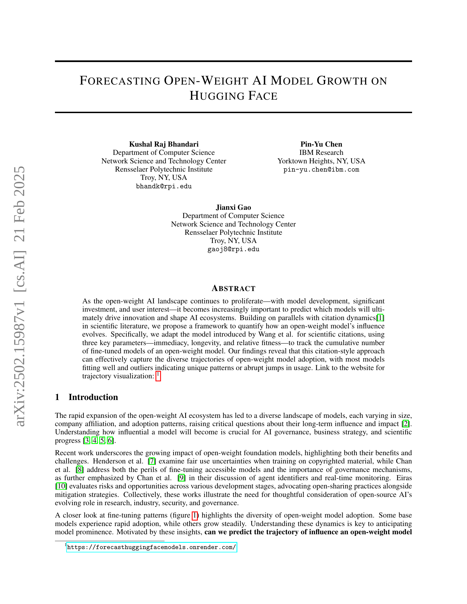
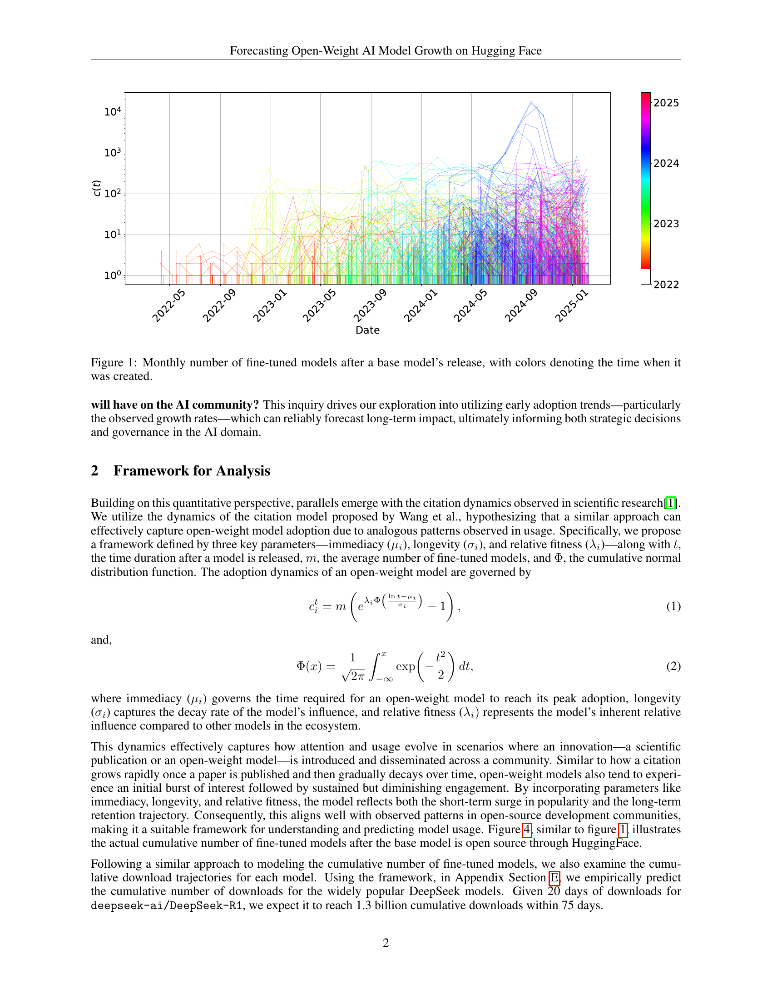
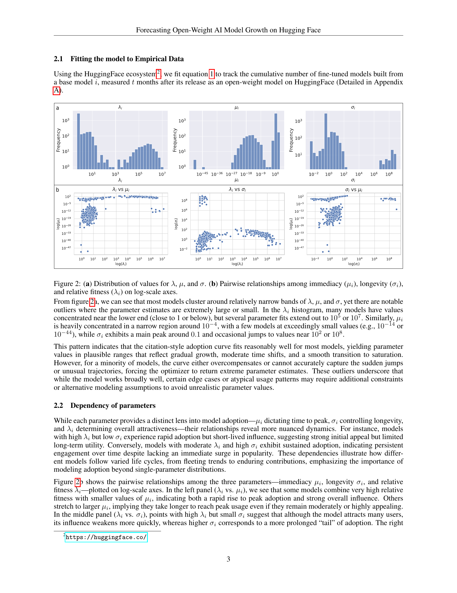
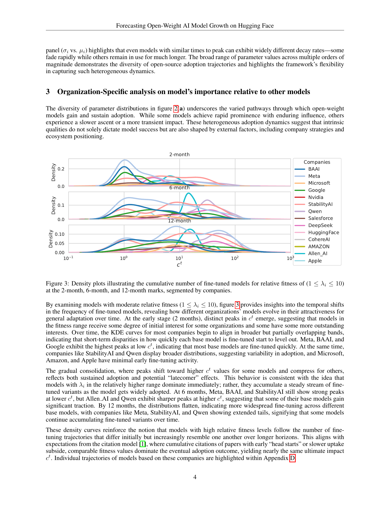
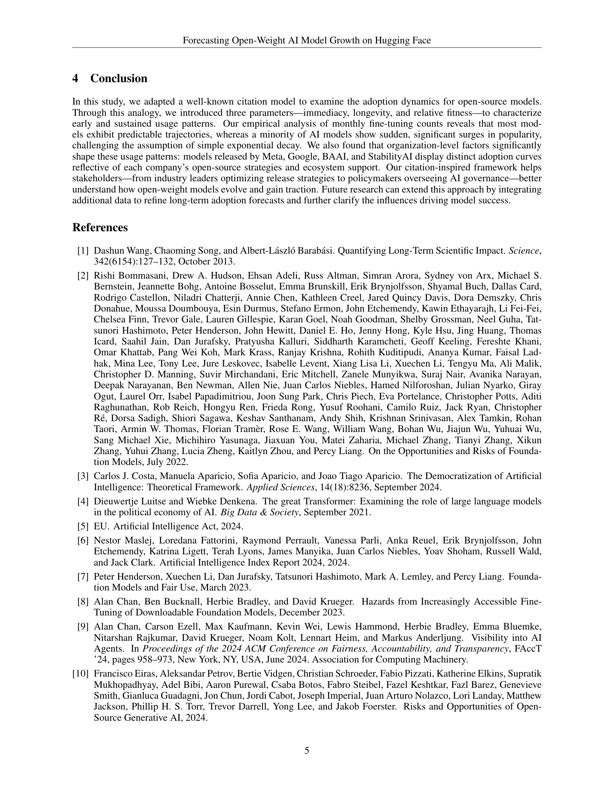
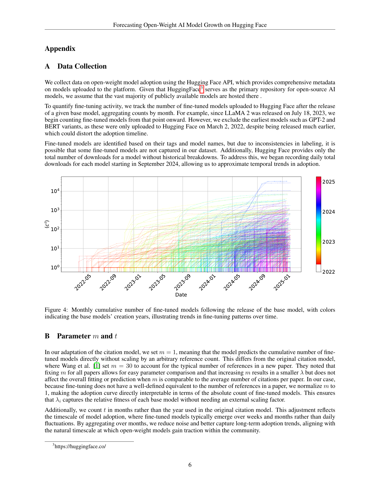
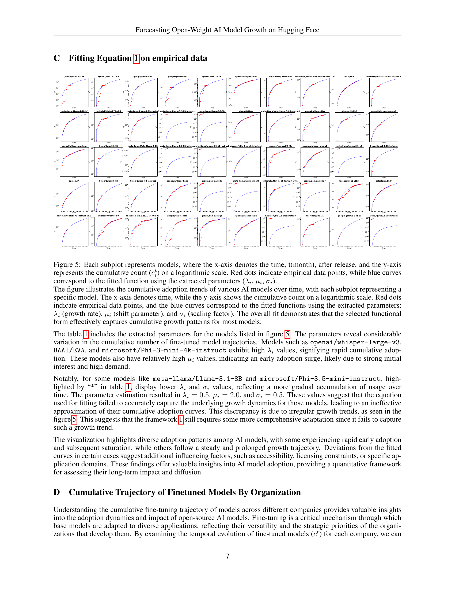
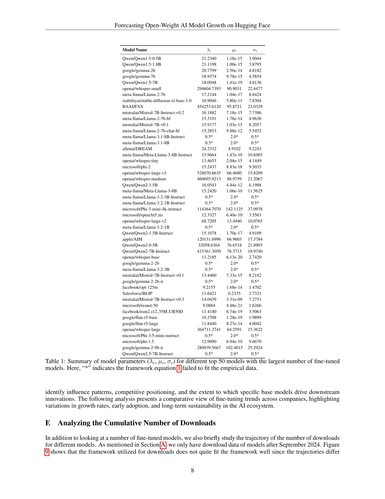
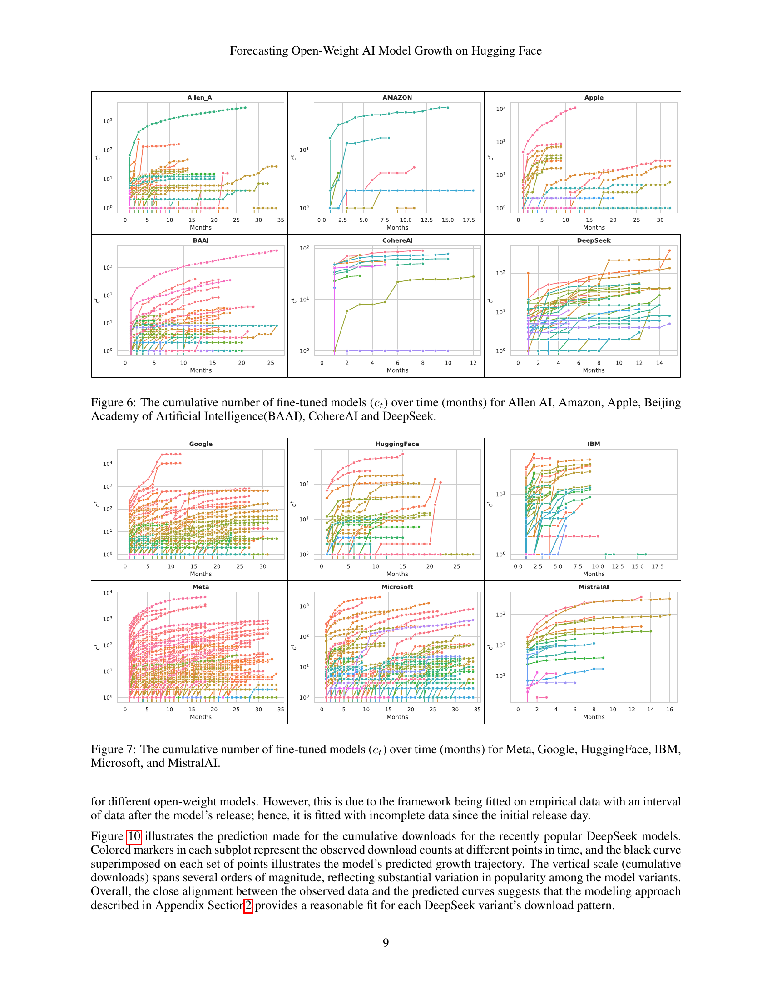
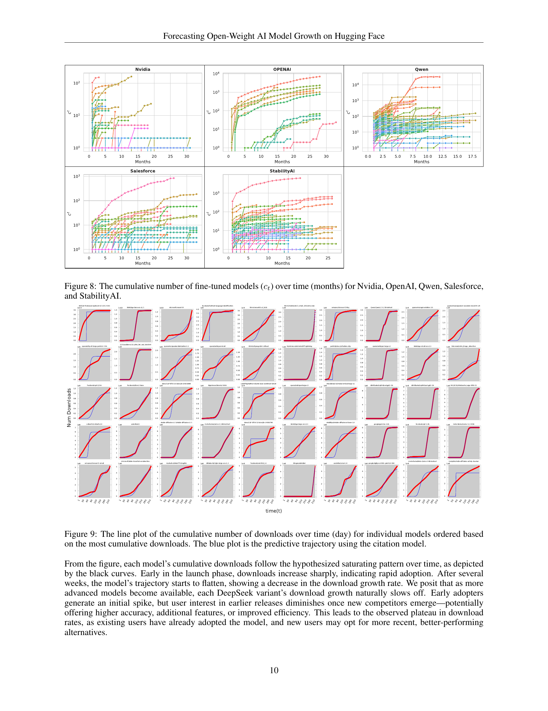
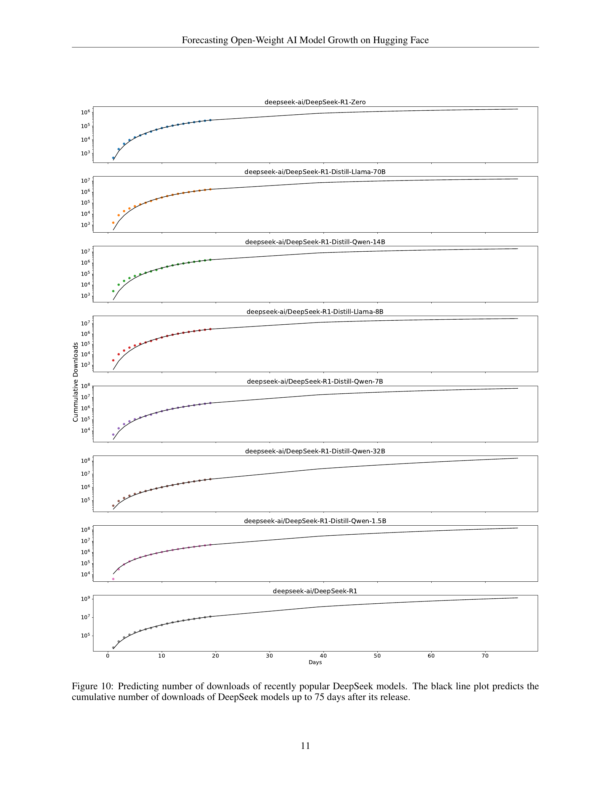
