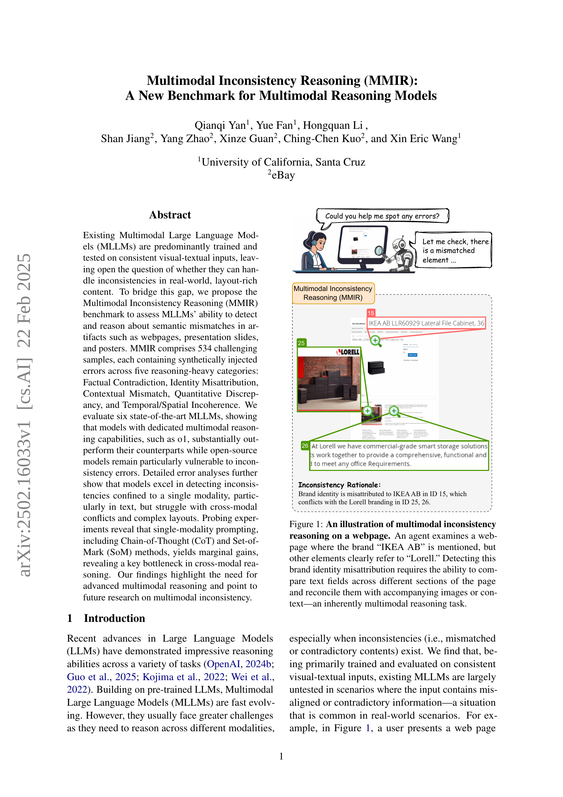
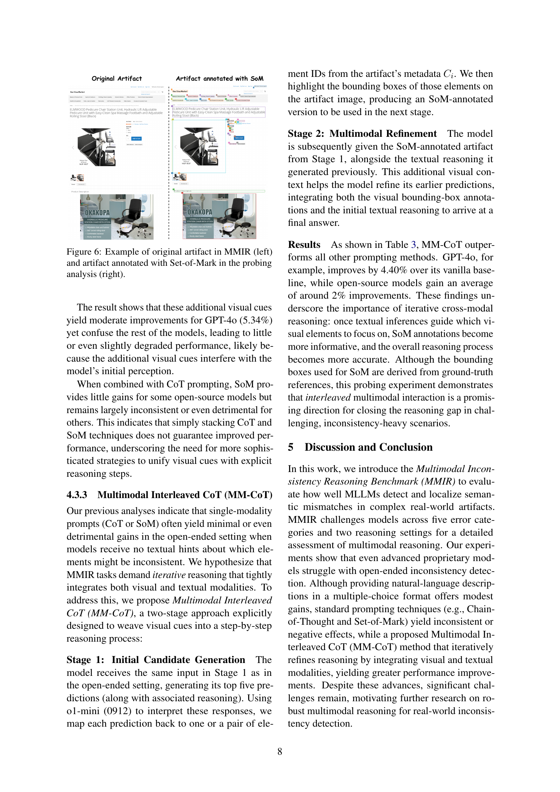

 


 2502.16033 
 Qianqi Yan et el. 
 
 🤗 2025-02-25 
 



↗ arXiv


↗ Hugging Face


↗ Papers with Code


### TL;DR



기존의 멀티모달 대규모 언어 모델(MLLM)들은 주로 일관된 시각-텍스트 데이터로 학습되어 실제 세계의 복잡하고 불일치하는 정보를 처리하는 데 어려움을 겪습니다. 이 논문에서는 **웹페이지, 프레젠테이션 슬라이드, 포스터 등 다양한 형태의 자료에 인위적으로 불일치를 추가하여 생성한 새로운 벤치마크인 MMIR**을 제시합니다. MMIR은 사실적 모순, 신원 오류, 맥락 불일치, 정량적 불일치, 시간/공간적 불일치 등 다섯 가지 유형의 불일치를 포함하며, 이를 통해 MLLM의 불일치 추론 능력을 종합적으로 평가합니다.

본 연구에서는 MMIR을 이용하여 여섯 가지 최첨단 MLLM을 평가하고, 오류 분석을 통해 모델의 강점과 약점을 분석합니다. 그 결과, **전용 멀티모달 추론 기능을 갖춘 모델이 상당히 우수한 성능을 보이는 반면, 오픈소스 모델은 불일치 오류에 특히 취약**하다는 것을 발견했습니다. 또한, 프롬프트 엔지니어링 기법을 통해 멀티모달 추론 능력을 향상시키는 방안을 모색했습니다. 본 연구는 **실제 세계의 불일치 문제 해결에 중요한 시사점**을 제공하며, 앞으로 더욱 **강력하고 견고한 멀티모달 추론 모델 개발**을 위한 중요한 단계가 될 것으로 기대됩니다.



#### Key Takeaways


 MMIR이라는 새로운 벤치마크를 통해 다양한 모드에서의 불일치를 추론하는 능력을 평가할 수 있음 



 기존의 MLLM들이 실제 데이터의 불일치에 취약하다는 것을 발견함 



 단일 모드의 프롬프트보다 다중 모드 프롬프트가 더 나은 성능을 보임 


#### Why does it matter?
본 논문은 **다양한 모드의 불일치를 다루는 능력**을 평가하기 위한 새로운 벤치마크를 제시함으로써, **실제 시나리오에서의 멀티모달 추론 모델의 한계를 밝히고 개선 방향을 제시**합니다. 기존의 일관된 데이터만으로 훈련된 모델과 달리, 실제 데이터의 불일치를 고려하여 모델의 성능을 평가함으로써, **실제 세계 문제 해결에 더욱 가까워질 수 있는 연구 방향을 제시**하는 데 중요한 의미를 지닙니다. 또한, 제시된 벤치마크는 향후 연구에서 **새로운 멀티모달 추론 모델의 개발 및 평가에 활용**될 수 있으며, **다양한 분야의 연구자들에게 유용한 자원**이 될 수 있습니다.

------
#### Visual Insights

> 🔼 그림 1은 웹 페이지에서의 다중 모드 불일치 추론을 보여줍니다. 사용자는 'IKEA AB'라는 브랜드가 언급된 웹 페이지를 검토하지만, 다른 요소들은 분명히 'Lorell'을 가리키고 있습니다. 이러한 브랜드 정체성 오류를 감지하려면 페이지의 여러 섹션에서 텍스트 필드를 비교하고 수반되는 이미지나 맥락과 조정하는 능력, 즉 본질적으로 다중 모드 추론 작업이 필요합니다.
> 

> 
read the caption

> Figure 1: An illustration of multimodal inconsistency reasoning on a webpage. An agent examines a webpage where the brand “IKEA AB” is mentioned, but other elements clearly refer to “Lorell.” Detecting this brand identity misattribution requires the ability to compare text fields across different sections of the page and reconcile them with accompanying images or context—an inherently multimodal reasoning task.
> 


| Category | #Questions | Ave. #Elements |
|---|---|---|
| **Artifact Categories** |  |  |
| Web | 240 | 38.8 |
| - Shopping | 108 | 46.1 |
| - Wiki | 28 | 44.9 |
| - Classifieds | 104 | 29.5 |
| Office | 223 | 9.1 |
| - Slides | 102 | 9.4 |
| - Tables/Charts | 61 | 4.1 |
| - Diagrams | 60 | 13.9 |
| Poster | 71 | 27.6 |
| **Total** | 543 | 24.9 |
| **Error Categories** |  |  |
| Factual Contradiction | 138 | – |
| Identity Misattribution | 84 | – |
| Contextual Mismatch | 141 | – |
| Quantitative Discrepancy | 76 | – |
| Temporal/Spatial Incoherence | 95 | – |
| **Total** | 543 | – |

> 🔼 표 1은 MMIR 데이터셋의 통계를 보여줍니다.  데이터셋은 웹페이지, 사무용 문서, 포스터 세 가지 유형의 자료로 구성되며, 각 유형별 질문 수와 평균 요소 수를 보여줍니다. 또한, 사실적 모순, 신원 오류 지정, 문맥 오류 일치, 정량적 불일치, 시간적/공간적 비일관성 등 다섯 가지 오류 유형에 따른 질문 수를 분류하여 보여줍니다. 이 표는 MMIR 데이터셋의 규모와 다양성, 그리고 오류 유형의 분포를 파악하는 데 유용한 정보를 제공합니다.
> 

> 
read the caption

> Table 1: MMIR Statistics. Breakdown of the dataset by artifact category and error type.
> 

### In-depth insights

#### MMIR Benchmark
MMIR 벤치마크는 **다양한 유형의 실제 시나리오에서 발생할 수 있는 모순되는 정보를 다루는 다중 모드 언어 모델(MLLM)의 능력을 평가하기 위해 고안된 새로운 벤치마크**입니다.  기존 벤치마크와 달리 일관된 시각적-텍스트 입력을 가정하지 않고, **의도적으로 주입된 오류를 포함하는 실제 자료(웹페이지, 프레젠테이션 슬라이드, 포스터 등)**를 사용합니다.  이는 모델이 **단순 패턴 인식을 넘어 심층적인 다중 모드 추론 능력을 필요로 하는 실제 세계의 복잡한 과제에 대한 대비를 평가**할 수 있도록 합니다. MMIR은 **사실적 모순, 신원 오류 지정, 문맥 오류, 정량적 불일치, 시간적/공간적 불일치 등 다섯 가지 주요 범주의 오류**를 포함하며, 각 범주는 다양한 유형의 실제 자료에서 발생하는 여러 가지 미묘한 차이점을 반영합니다. 이를 통해 **MLLM의 다중 모드 추론 능력을 포괄적으로 평가**할 수 있습니다.  **독점 모델과 오픈소스 모델 간의 성능 차이를 명확히 보여주는 실험 결과**는 다중 모드 추론 분야의 연구 방향을 제시합니다. 특히, **단일 모드 오류에 비해 다중 모드 오류나 복잡한 레이아웃에서의 오류 감지에 어려움을 겪는다는 점**은 앞으로의 연구에서 개선해야 할 중요한 과제임을 시사합니다.

#### Cross-Modal Conflicts
본 논문에서 다루는 ‘Cross-Modal Conflicts’는 **다양한 모달리티(예: 텍스트, 이미지, 오디오) 간의 정보 불일치**를 의미합니다.  **다른 모달리티에서 전달되는 정보가 상반되거나 일관성이 없을 때 발생**하는 이러한 충돌은 인공지능 모델, 특히 다중 모달리티 모델의 성능을 크게 저해하는 요인입니다. 예를 들어, 이미지가 고양이를 보여주는 반면 텍스트는 “강아지가 짖는다”라고 설명하는 경우가 이에 해당합니다. 이러한 불일치는 모델이 정보를 정확하게 통합하고 해석하는 데 어려움을 초래합니다.  **효과적인 다중 모달리티 모델은 이러한 Cross-Modal Conflicts를 감지하고 해결하는 능력**이 중요하며,  **단순히 각 모달리티의 정보를 개별적으로 처리하는 것 이상의 고차원적인 추론 능력**을 요구합니다.  따라서 **모델의 설계 및 학습 과정에서 다양한 유형의 모달리티 충돌에 대한 처리 능력을 강화**하는 방안에 대한 연구가 필요하며,  **새로운 벤치마크 데이터셋 구축 및 평가 기준 개발** 또한 중요한 과제로 떠오릅니다.  **특히, 복잡한 레이아웃을 가진 실제 환경 데이터를 활용한 연구**가 모델의 실용성 및 일반화 성능 향상에 기여할 것입니다.

#### Model Evaluation
본 논문에서는 다양한 모델 평가 방법론을 제시하고 있습니다. 특히 **정확도(Accuracy)** 측정을 통해 모델의 성능을 평가하고 있으며, **오픈 엔드 방식(Open-Ended Setting)** 과 **다중 선택 방식(Multiple-Choice Setting)** 의 두 가지 평가 설정을 활용하여 모델의 일반화 능력과 특정 질문 유형에 대한 적응력을 측정합니다. 또한, 다양한 오류 유형(Factual Contradiction, Identity Misattribution 등)과 모달리티(텍스트, 이미지), 레이아웃 복잡도에 따른 모델 성능을 분석하여, 모델의 강점과 약점을 심층적으로 파악합니다. **프롬프팅 전략(Prompting Strategy)** 의 영향을 분석하는 실험 결과는 모델 성능 향상에 대한 시사점을 제공하며, 특히 **다중 모달리티 상호작용(Multimodal Interaction)** 의 중요성을 강조합니다. 이러한 다각적인 평가 방법론을 통해, 본 논문은 멀티모달 모델의 성능을 보다 정확하고 포괄적으로 평가하고, 향후 연구 방향을 제시하고 있습니다. **오픈소스 모델과 독점 모델 간의 성능 차이 분석**은 특히 주목할 만한 부분입니다.

#### Prompting Strategies
본 논문은 다양한 프롬프팅 전략들을 제시하고 그 효과를 평가하는 데 초점을 맞추고 있습니다. **연구진은 Chain-of-Thought (CoT) 프롬프팅과 Set-of-Mark (SoM) 프롬프팅을 비롯한 여러 방법들을 실험**했으며, 그 결과 **단일 모달리티 프롬프팅만으로는 성능 향상에 제한적인 효과**를 보였다는 점을 강조합니다. 특히, **CoT 프롬프팅은 일부 경우 오히려 성능 저하를 야기**하기도 했습니다.  **흥미로운 점은 MM-CoT (Multimodal Interleaved CoT) 프롬프팅 전략**입니다.  **이 전략은 시각적 단서를 단계적인 추론 과정에 통합**하여, 모델이 시각 정보와 텍스트 정보를 효과적으로 결합하고 추론할 수 있도록 돕습니다. **MM-CoT는 다른 방법들에 비해 상당한 성능 향상**을 보여주었고, **다양한 모달리티를 결합한 프롬프팅 전략의 중요성**을 시사합니다. 이러한 결과는 **다중 모달리티 추론 모델의 한계와 개선 방향**을 제시하며, **미래 연구를 위한 중요한 시사점**을 제공합니다.

#### Future Directions
본 논문은 시각적 요소와 텍스트 간의 불일치를 다루는 다중 모드 모델의 능력을 평가하기 위한 새로운 벤치마크인 MMIR을 제시합니다.  **미래 연구 방향은 크게 세 가지로 나눌 수 있습니다.** 첫째, **현실 세계의 복잡한 레이아웃과 다양한 불일치 유형을 포괄하는 더욱 확장된 데이터셋을 구축**하는 것입니다.  현재 MMIR은 다양한 예시를 포함하지만, 실제 세상의 복잡성을 완벽하게 반영하지는 못합니다. 더욱 방대한 데이터와 다양한 유형의 불일치 사례를 추가함으로써 모델의 일반화 능력을 향상시키고, 보다 현실적인 상황에 대한 적응력을 강화할 수 있을 것입니다. 둘째, **단순한 패턴 인식을 넘어 심층적인 다중 모드 추론 능력을 갖춘 모델 개발**이 중요합니다.  MMIR 평가 결과, 기존 모델들은 단일 모드 내 불일치는 잘 감지하지만, 다중 모드 간의 복잡한 상호 작용을 요구하는 경우에는 어려움을 겪는 것으로 나타났습니다. 따라서 **시각 정보와 텍스트 정보 간의 상호 작용을 효과적으로 처리하는 새로운 아키텍처와 학습 전략**을 개발해야 합니다. 마지막으로, **프롬프트 엔지니어링 기법의 효율성을 높이는 연구**가 필요합니다.  본 논문에서 제시된 MM-CoT와 같은 프롬프트 기법은 어느 정도 성능 향상을 보였지만, 더욱 효과적이고 효율적인 프롬프트 전략을 개발하여 모델의 성능을 극대화하는 연구가 지속적으로 필요합니다.  이러한 세 가지 방향의 연구를 통해 다중 모드 모델의 불일치 추론 능력을 더욱 발전시킬 수 있을 것으로 기대됩니다.

### More visual insights

More on figures

> 🔼 그림 2는 MMIR 벤치마크에 포함된 다섯 가지의 불일치 범주를 보여줍니다. 각 범주는 웹페이지, 사무용 문서, 포스터 등 다양한 유형의 실제 자료에서 발생할 수 있는 다양한 유형의 불일치 상황을 예시로 보여줍니다. 구체적으로는, 사실적 모순, 신원 오류, 문맥상 불일치, 양적 불일치, 시간적/공간적 불일치 등의 다섯 가지 범주가 있으며, 각 범주는 이미지와 텍스트의 상호 작용을 통해 모델의 다양한 추론 능력을 평가하기 위한 다양한 시나리오를 제시합니다. 이 그림은 MMIR 벤치마크의 복잡성과 다양성을 잘 보여주는 시각적 자료입니다.
> 

> 
read the caption

> Figure 2: There are five inconsistency categories in the MMIR benchmark, posing diverse challenges.
> 

> 🔼 MMIR 데이터셋 필터링 과정을 보여주는 그림입니다.  데이터 수집 및 파싱 단계, 합성 불일치 생성 단계, 자동 검증 단계, 그리고 최종 인간 검증 단계를 거쳐 최종 MMIR 데이터셋이 생성되는 과정을 시각적으로 나타냅니다. 각 단계별 데이터 개수 변화를 통해 데이터 정제 과정의 효율성과 엄격함을 보여줍니다.
> 

> 
read the caption

> Figure 3: MMIR Data filtering process.
> 

> 🔼 그림 4는 모델 성능에 대한 세부 분석 결과를 보여줍니다. (a)는 오류 범주별 정확도를, (b)는 모달리티(텍스트 또는 이미지)별 정확도를 보여줍니다. 각 그래프는 다양한 모델(o1, GPT-40, Qwen2.5-VL, LLaVA-NeXT, InternVL2.5, Phi-3.5-Vision)의 성능을 비교하여, 모델이 어떤 유형의 불일치를 잘 감지하고 어떤 유형의 불일치를 잘 감지하지 못하는지 보여줍니다. 이를 통해 다양한 모델의 강점과 약점을 파악하고, 향후 연구 방향을 제시하는 데 도움이 됩니다.
> 

> 
read the caption

> Figure 4: Fine-grained analysis of model performance.
> 

> 🔼 그림 5는 모델의 레이아웃 복잡성에 따른 성능을 보여줍니다.  단순한 레이아웃을 가진 문서에서는 대부분의 모델이 높은 정확도를 보이지만, 레이아웃이 복잡해짐에 따라 모든 모델의 정확도가 감소하는 것을 알 수 있습니다. 특히, 복잡한 레이아웃에서는 오픈소스 모델의 성능 저하가 두드러집니다. 이는 시각적 요소와 텍스트 간의 관계를 이해하고 복잡한 레이아웃에서 정보를 효과적으로 처리하는 능력의 중요성을 강조합니다.
> 

> 
read the caption

> Figure 5: Model performance on layout complexity.
> 

> 🔼 그림 6은 논문에서 제시된 MMIR 벤치마크의 일부 웹페이지 예시를 보여줍니다. 왼쪽은 원본 웹페이지이며, 오른쪽은 추론 분석을 위해 Set-of-Mark(SoM) 주석이 추가된 같은 웹페이지입니다. SoM 주석은 웹페이지의 특정 요소들을 둘러싸는 경계 상자 형태로 표시되어 모델이 시각적 요소들을 더 잘 인식하고 분석하는 데 도움을 줍니다. 이는 멀티모달 모델의 성능을 평가하기 위한 실험 과정에서 사용된 방법이며, 특히 모델의 시각적 정보 처리 능력에 초점을 맞추고 있습니다.
> 

> 
read the caption

> Figure 6: Example of original artifact in MMIR (left) and artifact annotated with Set-of-Mark in the probing analysis (right).
> 

> 🔼 그림 7은 MMIR 벤치마크의 두 가지 평가 설정(개방형 및 선택형)에서 모델 응답과 함께 테스트 샘플을 보여줍니다.  이 그림은 웹페이지의 일부분을 보여주는 이미지와,  두 가지 설정에서 각 모델이 어떤 응답을 생성했는지 보여주는 표를 함께 제시합니다.  개방형 설정에서는 모델이 자유롭게 답변을 생성하지만, 선택형 설정에서는 미리 정의된 옵션 중에서 선택해야 합니다.  이를 통해 각 모델의 다양한 추론 능력을 비교 분석할 수 있습니다.  특히, 오류 유형(지리적 오류)과 모델의 응답을 비교하여 각 모델의 강점과 약점을 파악하는 데 도움이 됩니다.
> 

> 
read the caption

> Figure 7: A test sample with model responses under the two main settings in MMIR: open-ended and multiple-choice.
> 

More on tables


| Models | Open-ended |  |  |  | Multiple-choice |  |  |  |
|---|---|---|---|---|---|---|---|---|
|  | **Web** | **Office** | **Poster** | **Overall** | **Web** | **Office** | **Poster** | **Overall** |
| **Proprietary Models** |  |  |  |  |  |  |  |  |
| o1 (1217) | 47.91 | 59.19 | 38.73 | 51.40 | 47.91 | 58.52 | 46.47 | 52.15 |
| GPT-4o (1120) | 25.00 | 42.60 | 30.98 | 33.14 | 37.29 | 58.96 | 47.88 | 47.75 |
| **Open-sourced Models** |  |  |  |  |  |  |  |  |
| Qwen2.5-VL-7B | 8.54 | 29.14 | 11.97 | 17.60 | 14.37 | 33.18 | 16.90 | 22.56 |
| LLaVA-NeXT-7B | 10.20 | 21.97 | 7.04 | 14.70 | 11.45 | 25.33 | 5.63 | 16.47 |
| InternVL2.5-8B | 7.70 | 24.21 | 4.92 | 14.23 | 9.37 | 23.54 | 11.97 | 15.63 |
| Phi-3.5-Vision-4B | 6.87 | 24.43 | 7.04 | 14.23 | 1.66 | 8.52 | 0.00 | 4.30 |
> 🔼 표 2는 두 가지 평가 설정(개방형 및 MCQ)에서 6가지 다중 모드 대규모 언어 모델(MLLM)의 정확도를 보여줍니다. 독점 모델은 오픈 소스 모델보다 성능이 훨씬 뛰어나며, 특히 MCQ 설정에서 더 큰 성능 향상을 보여줍니다.
> 

> 
read the caption

> Table 2: The accuracy of six MLLMs under the two evaluation settings. Proprietary models demonstrate higher performance as well as larger performance gain in the MCQ setting.
> 


| Models | Vanilla | + CoT | + SoM | + Both | MM-CoT |
|---|---|---|---|---|---| 
| **Proprietary Models** |  |  |  |  |  |
| o1 (1217) | 51.40 | – | -0.66 | – | +0.09 |
| GPT-4o (1120) | 33.14 | – | +5.34 | – | +4.40 |
| **Open-sourced Models** |  |  |  |  |  |
| Qwen2.5-VL-7B | 17.60 | +0.28 | +0.09 | +0.28 | +4.59 |
| LLaVA-NeXT-7B | 14.70 | -1.78 | -2.53 | -0.47 | +3.65 |
| InternVL2.5-8B | 14.23 | +2.24 | -0.66 | -1.41 | -0.85 |
| Phi-3.5-Vision-4B | 14.23 | -0.38 | +0.47 | +0.84 | +0.65 |
> 🔼 표 3은 다양한 프롬프트 방법의 효과를 보여줍니다.  각 프롬프트 방법의 성능은 기본 설정과 직접 비교되며, 성능 향상은 파란색, 성능 저하는 빨간색으로 표시됩니다. 이 표는 다양한 프롬프팅 기법(Chain-of-Thought, Set-of-Mark, 그리고 두 기법을 결합한 방법)이 모델 성능에 미치는 영향을 정량적으로 보여주고, 단순히 프롬프트를 추가하는 것만으로는 다중 모드 추론 성능이 향상되지 않을 수 있음을 시사합니다. 특히, MM-CoT(Multimodal Interleaved CoT) 전략이 시사하는 바는, 시각적 단서를 단계적 추론 과정에 통합하는 것이 성능 향상에 중요함을 보여줍니다.
> 

> 
read the caption

> Table 3: Probing results of different prompting methods. Performance of each prompting method is directly compared with the vanilla setting. Gains are in blue and drops are in red.
> 

### Full paper



