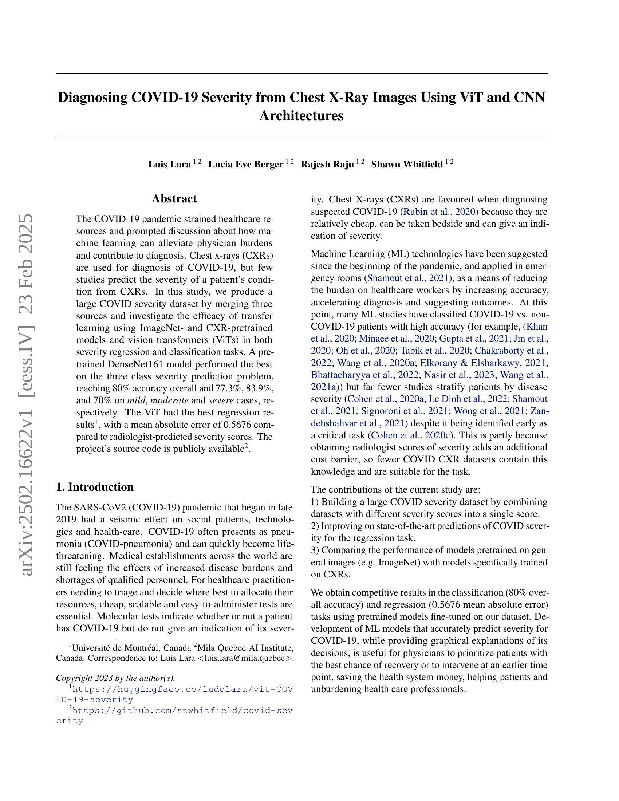
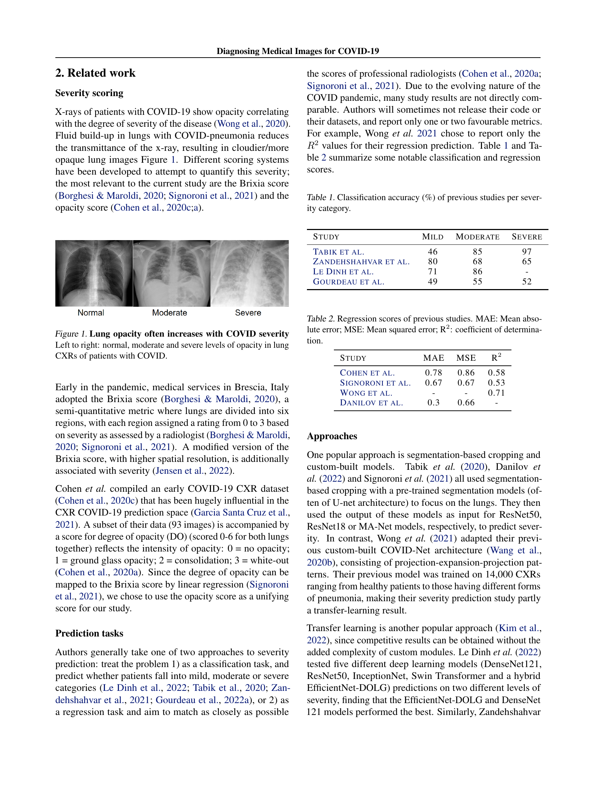
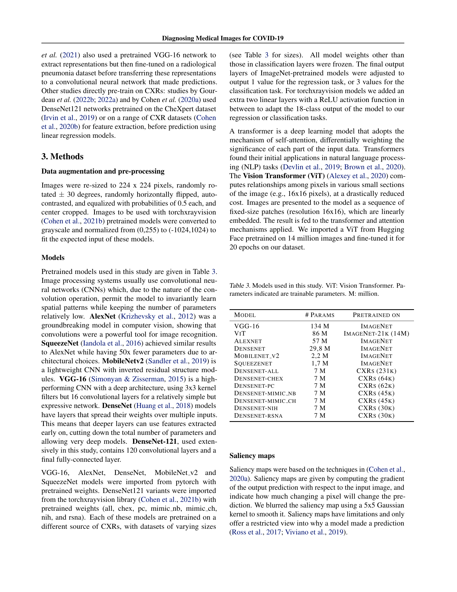
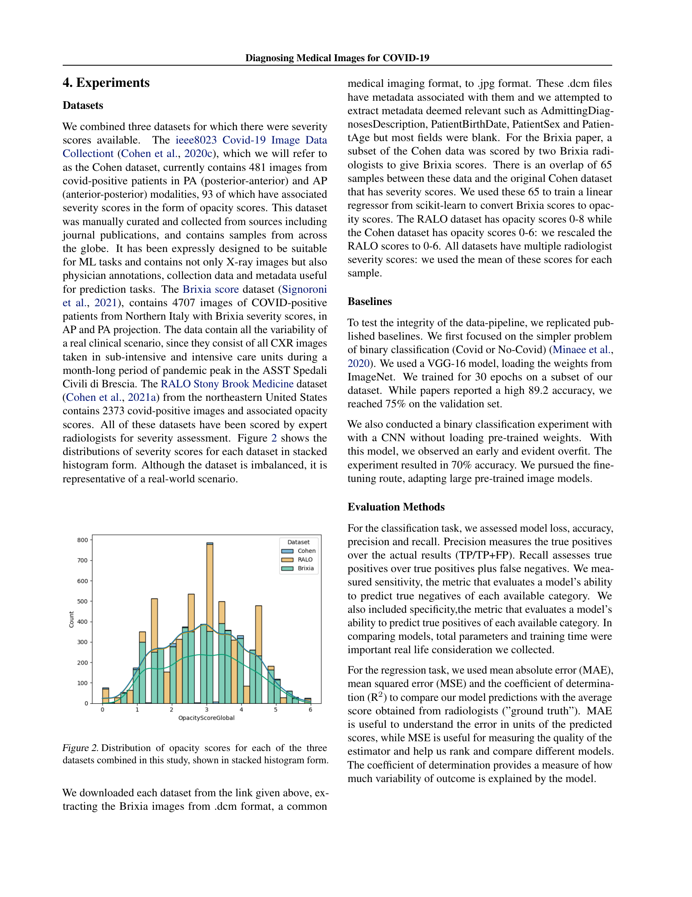
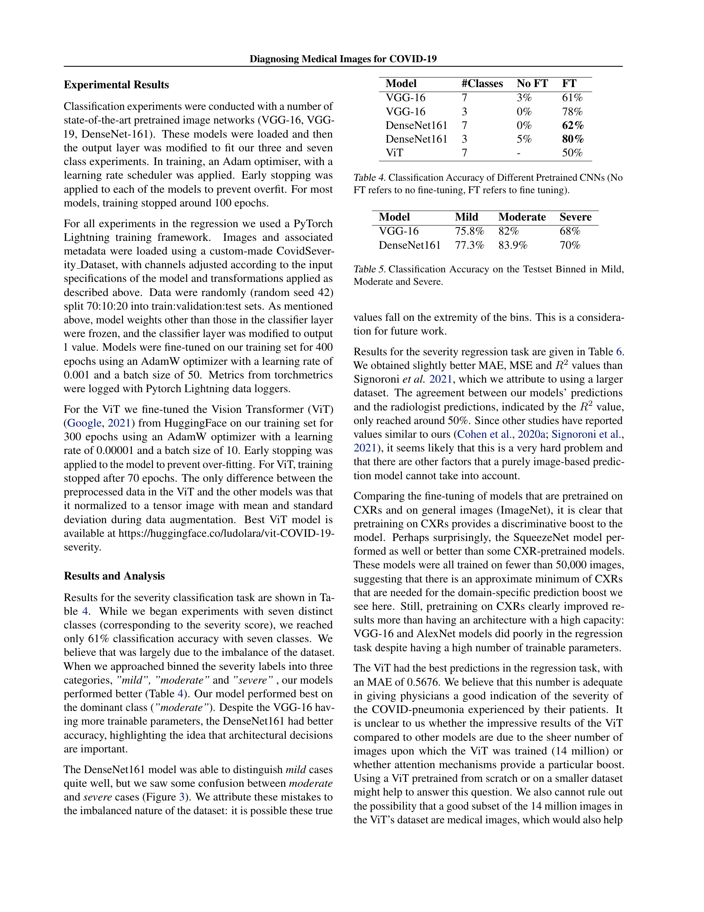
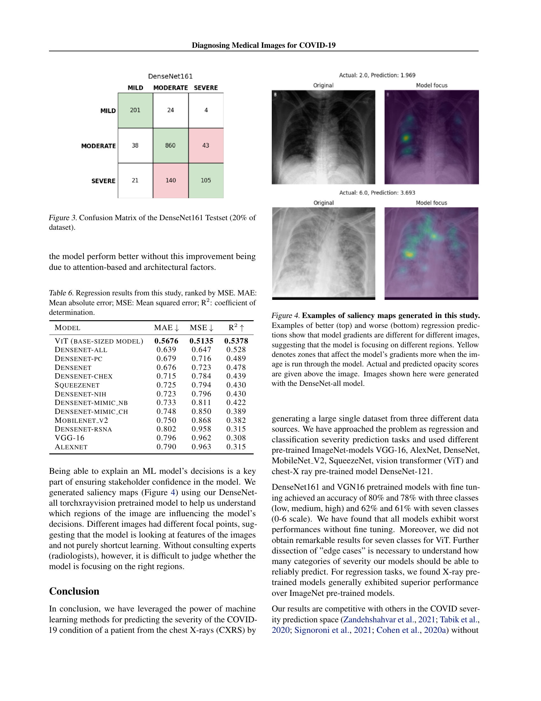
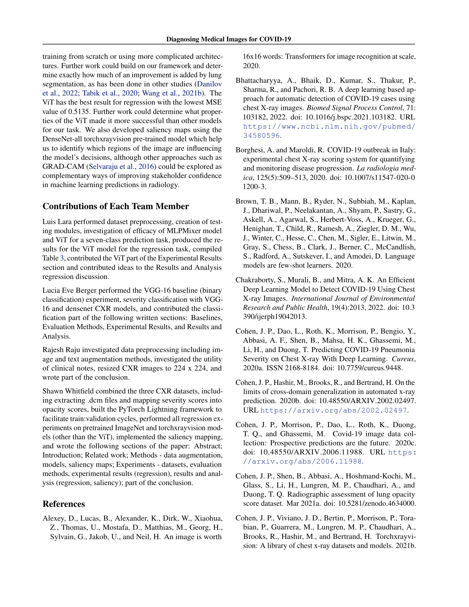
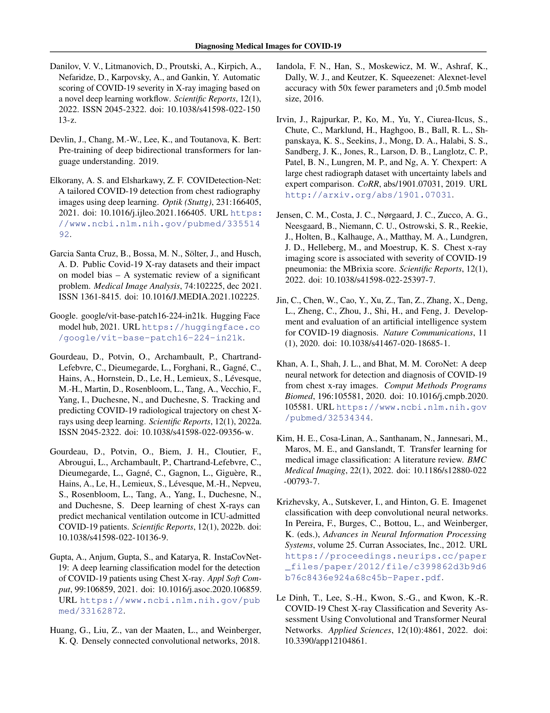
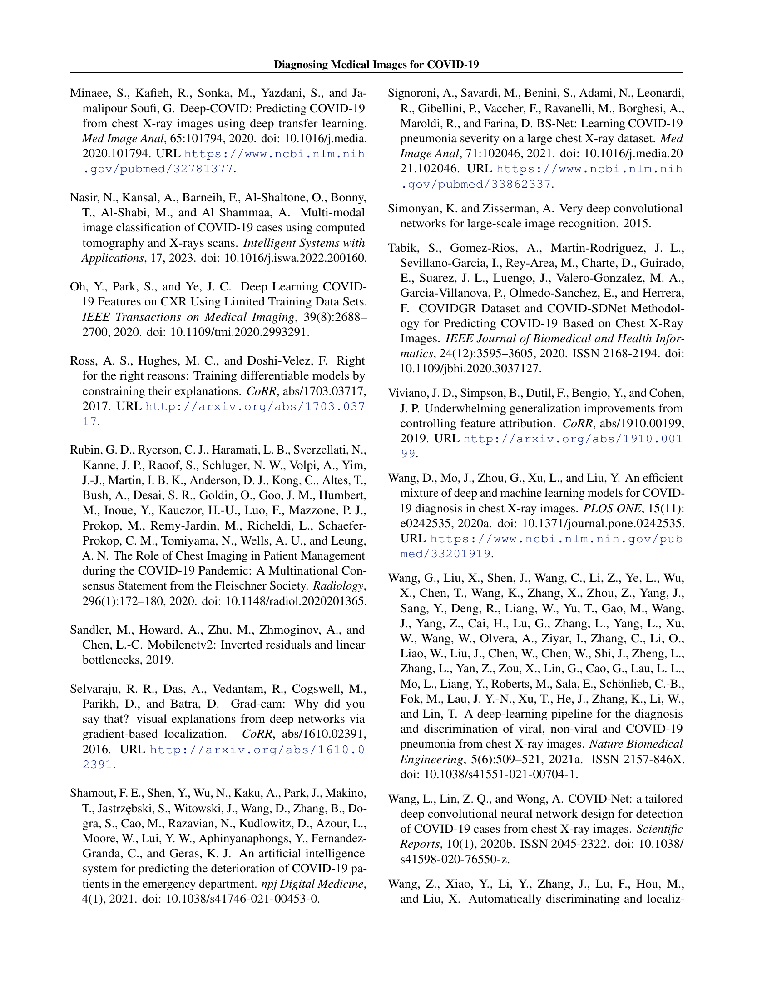
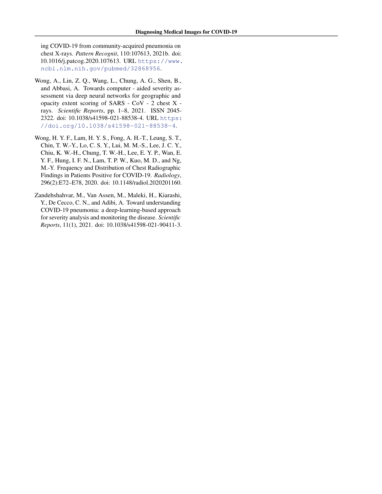

 


 2502.16622 
 Luis Lara et el. 
 
 🤗 2025-02-25 
 



↗ arXiv


↗ Hugging Face


↗ Papers with Code


### TL;DR



COVID-19 팬데믹으로 인해 의료 시스템이 과부하되고 의료진의 부담이 커지고 있습니다.  이 연구는 흉부 X선 영상을 이용하여 COVID-19 환자의 중증도를 정확하게 예측하는 것이 **의료 자원 효율적인 배분 및 환자 관리 전략** 수립에 중요한 역할을 할 수 있음을 보여주고 있습니다.  기존 연구에서는 COVID-19 감염 여부만을 판별하는 데 초점을 맞추었지만, **본 연구는 환자의 중증도를 예측하는 데 중점**을 두어 의료 시스템에 더 큰 도움을 제공하고자 합니다.  기존 연구들이 데이터셋 부족 및 모델 해석 어려움을 겪었던 반면, 본 연구는 이러한 어려움을 해결하기 위해 노력했습니다. 

본 연구는 기존의 세 가지 COVID-19 흉부 X선 영상 데이터셋을 통합하여 **대규모 데이터셋**을 구축했습니다.  그리고, **다양한 딥러닝 모델(CNN, ViT)**을 사용하여 중증도 예측 성능을 비교 분석했습니다.  **DenseNet161 모델**은 중증도 분류에서 높은 정확도를 보였고, **ViT 모델**은 중증도 회귀 분석에서 가장 낮은 오차율을 보였습니다.  또한, **Saliency map**을 통해 모델의 예측 결과를 시각적으로 설명하여 모델의 신뢰도를 높였습니다. 이러한 결과들은 의료 현장에서의 **신속하고 정확한 진단 및 치료**를 가능하게 해 의료진의 부담을 줄이는 데 기여할 것으로 기대됩니다.



#### Key Takeaways


 COVID-19 흉부 X선 영상 데이터셋을 통합하여 대규모 데이터셋을 구축했습니다. 



 다양한 딥러닝 모델(CNN, ViT)을 비교 분석하여 COVID-19 중증도 예측 성능을 향상시켰습니다. 



 설명 가능한 AI 기법을 활용하여 모델의 예측 결과에 대한 해석 가능성을 높였습니다. 


#### Why does it matter?
본 논문은 **의료 영상 분석 분야, 특히 COVID-19의 심각도 예측에 관심 있는 연구자들에게 중요한 의미**를 지닙니다.  **대규모 데이터셋 구축, 다양한 모델 비교, 그리고 해석 가능한 결과 제시**는 향후 연구의 기반이 될 수 있으며, **의료 현장에서의 실질적인 문제 해결**에 기여할 수 있는 가능성을 보여줍니다.  **심각도 예측 모델의 성능 향상**은 의료 자원 배분 및 환자 관리 전략에 중요한 영향을 미칠 수 있기에, 이 분야 연구의 발전에 크게 기여할 것으로 예상됩니다. 또한, **설명 가능한 AI(XAI)** 접근 방식을 통해 모델의 결정 과정에 대한 이해를 높임으로써, 의료 전문가들의 신뢰도를 높이는 데 기여할 수 있습니다.

------
#### Visual Insights


| Study | Mild | Moderate | Severe |
|---|---|---|---|
| Tabik et al. | 46 | 85 | 97 |
| Zandehshahvar et al. | 80 | 68 | 65 |
| Le Dinh et al. | 71 | 86 | - |
| Gourdeau et al. | 49 | 55 | 52 |

> 🔼 표 1은 이전 연구들의 중증도 범주별 분류 정확도(%)를 보여줍니다.  각 연구에서 경증, 중등증, 중증 환자를 얼마나 정확하게 분류했는지 보여주는 지표입니다.  이 표는 COVID-19의 중증도를 예측하는 다양한 머신러닝 모델의 성능을 비교하는 데 유용한 정보를 제공합니다.
> 

> 
read the caption

> Table 1: Classification accuracy (%) of previous studies per severity category.
> 

### In-depth insights

#### COVID-19 Severity
이 논문은 COVID-19의 중증도를 흉부 X선 이미지를 사용하여 예측하는 기계 학습 모델의 성능을 평가합니다. **다양한 데이터셋을 결합하여 대규모 COVID-19 중증도 데이터셋을 구축**하고, **이미지넷 및 CXR 사전 학습 모델과 Vision Transformer(ViT)를 사용하여 전이 학습**을 수행했습니다.  **DenseNet161 모델이 3가지 중증도 분류 작업에서 가장 좋은 성능**을 보였으며, ViT 모델은 중증도 회귀 작업에서 가장 낮은 평균 절대 오차를 기록했습니다.  **사전 학습된 모델의 효과**와 **다양한 모델 아키텍처의 비교**를 통해 COVID-19 중증도 예측 모델 개발에 대한 통찰력을 제공합니다.  **중증도 예측의 어려움**과 **의료 영상 분석의 복잡성**을 고려할 때, 이 연구는 **의료 현장에 기계 학습을 적용**하는 데 중요한 시사점을 제시합니다.

#### ViT and CNN Models
본 논문은 COVID-19의 중증도를 흉부 X선 이미지에서 예측하기 위해 **Vision Transformer (ViT)** 와 **Convolutional Neural Network (CNN)** 모델을 비교 분석합니다.  두 모델 모두 ImageNet이나 CXR 데이터셋으로 사전 훈련된 가중치를 사용하여 전이 학습을 진행했습니다. CNN 모델 중에서는 DenseNet161이 3-클래스 분류 작업에서 가장 높은 정확도를 달성했습니다. 반면, **ViT는 회귀 분석 작업에서 평균 절대 오차(MAE) 0.5676으로 CNN 모델보다 더 나은 성능을 보였습니다.** 이는 ViT가 이미지의 전반적인 패턴을 더 잘 포착하여 중증도를 더 정확하게 예측할 수 있음을 시사합니다.  **두 모델의 성능 비교를 통해,  과제의 특성에 따라 ViT와 CNN 중 어떤 모델이 더 적합한지 판단할 수 있는 중요한 근거를 제시하고 있습니다.**  **특히, ViT의 우수한 회귀 성능은 중증도를 연속적인 값으로 예측해야 하는 의료 현장에서 유용하게 활용될 수 있음을 강조합니다.**  하지만, 데이터 불균형 문제와 객관적인 중증도 평가의 어려움 등은 향후 연구에서 개선해야 할 부분입니다.

#### Dataset Creation
본 연구는 COVID-19의 중증도를 흉부 X선 이미지로 예측하는 모델을 개발하기 위해 **세 개의 데이터셋을 통합**하여 대규모 데이터셋을 구축했습니다.  각 데이터셋은 서로 다른 기관에서 수집되었고, **중증도 점수**는 전문 방사선과 의사에 의해 부여되었습니다. 데이터셋 통합 과정에서 중증도 점수의 일관성을 유지하기 위해 **점수 변환 및 스케일링** 과정을 거쳤습니다.  **데이터 증강 기법**을 적용하여 모델의 일반화 성능을 향상시켰고, 이미지 전처리 과정을 통해 모델 학습에 적합한 형태로 데이터를 변환했습니다.  이러한 **체계적인 데이터셋 구축** 과정을 통해, COVID-19 중증도 예측 모델의 성능 향상에 크게 기여할 수 있었습니다.  **데이터 균형 및 다양성** 확보에 대한 고려도 중요한 부분이었으며, 실제 임상 환경을 반영하는 데이터셋 구성을 위해 노력했습니다.

#### Saliency Map Analysis
본 논문에서 **Saliency Map Analysis**는 딥러닝 모델의 예측 결과에 대한 해석력을 높이는 중요한 부분입니다. **Saliency map**은 모델이 이미지의 어떤 부분에 주목하여 예측을 내리는지 시각적으로 보여주는 기술입니다.  **COVID-19 중증도 예측**이라는 과업에서, 모델이 폐의 특정 영역 (opacity, consolidation 등)을 얼마나 중요하게 고려하는지 파악하여 모델의 신뢰도를 높이고 의사의 진단 과정을 보조할 수 있습니다.  **Gradient-based localization**과 같은 기법을 통해 생성된 saliency map을 통해 모델의 판단 근거를 이해하고, 모델의 강점과 약점을 분석하여 향후 모델 개선에 활용할 수 있습니다.  **모델의 예측 정확도와 Saliency map의 해석력 사이의 상관관계**를 분석하면 모델의 신뢰성을 평가하는 데 도움이 됩니다.  **Saliency map을 통해 얻은 정보는 의학적 전문가의 판단을 대체하는 것이 아니라, 보조하는 역할**을 합니다. 따라서, 의료 현장에서의 실제 활용을 위해서는 **의료 전문가의 검토 및 피드백**을 거치는 것이 필수적입니다.

#### Future Research
미래 연구 방향은 **데이터 불균형 문제 해결**에 초점을 맞춰야 합니다. 본 연구에서 사용된 데이터셋은 특정 중증도 수준에 치우쳐져 있어, 모델의 일반화 성능을 저해할 수 있습니다. 따라서, **다양한 중증도의 환자 데이터를 추가로 확보**하고, **데이터 증강 기법**을 활용하여 균형 잡힌 데이터셋을 구축하는 것이 중요합니다.  또한, **다양한 CNN 및 ViT 아키텍처**를 비교 분석하여, COVID-19 중증도 예측에 가장 적합한 모델을 찾고, **설명 가능한 AI 기법**을 도입하여 모델의 예측 결과에 대한 신뢰도를 높이는 연구가 필요합니다.  **다중 모달리티 데이터 (CXR 영상, 임상 정보 등) 활용**을 통해 예측 정확도를 개선하고, **실제 임상 환경에서의 모델 성능 검증**을 위한 연구 또한 중요한 과제입니다. 마지막으로, **의료진과의 협력**을 통해 모델의 실용성을 높이고, 임상 의사결정에 효과적으로 활용될 수 있도록 지속적인 연구 개발이 필요합니다.

### More visual insights

More on tables


| Study | MAE | MSE | R2 |
|---|---|---|---| 
| Cohen et al. | 0.78 | 0.86 | 0.58 |
| Signoroni et al. | 0.67 | 0.67 | 0.53 |
| Wong et al. | - | - | 0.71 |
| Danilov et al. | 0.3 | 0.66 | - |
> 🔼 표 2는 이전 연구들의 회귀 분석 점수를 보여줍니다. MAE는 평균 절대 오차, MSE는 평균 제곱 오차, R²는 결정 계수를 나타냅니다. 이 표는 COVID-19의 심각도를 예측하는 다양한 머신러닝 모델의 성능을 비교하는 데 사용됩니다. 각 모델의 평균 절대 오차(MAE), 평균 제곱 오차(MSE), 그리고 결정 계수(R²) 값을 제시하여 모델의 정확도를 평가합니다. 더 낮은 MAE와 MSE 값은 더 높은 정확도를, 더 높은 R²값은 더 나은 설명력을 나타냅니다.
> 

> 
read the caption

> Table 2: Regression scores of previous studies. MAE: Mean absolute error; MSE: Mean squared error; R2: coefficient of determination.
> 


| Model | # Params | Pretrained on |
|---|---|---|
| VGG-16 | 134 M | ImageNet |
| ViT | 86 M | ImageNet-21k (14M) |
| Alexnet | 57 M | ImageNet |
| Densenet | 29,8 M | ImageNet |
| Mobilenet_v2 | 2,2 M | ImageNet |
| Squeezenet | 1,7 M | ImageNet |
| Densenet-all | 7 M | CXRs (231k) |
| Densenet-chex | 7 M | CXRs (64k) |
| Densenet-pc | 7 M | CXRs (62k) |
| Densenet-mimic_nb | 7 M | CXRs (45k) |
| Densenet-mimic_ch | 7 M | CXRs (45k) |
| Densenet-nih | 7 M | CXRs (30k) |
| Densenet-rsna | 7 M | CXRs (30k) |
> 🔼 표 3은 본 연구에서 사용된 다양한 모델들을 보여줍니다.  ViT(Vision Transformer)를 포함하여, AlexNet, DenseNet, MobileNetv2, SqueezeNet, 그리고 DenseNet의 여러 변형 모델들(각기 다른 크기의 CXR 데이터셋으로 사전 훈련됨)이 포함되어 있습니다. 각 모델의 학습 가능한 파라미터 수(백만 단위)와 사전 훈련에 사용된 데이터셋이 함께 제시됩니다.  이 표는 모델들의 구조와 사전 훈련 과정의 차이를 비교하여, 성능에 미치는 영향을 분석하는 데 유용한 정보를 제공합니다.
> 

> 
read the caption

> Table 3: Models used in this study. ViT: Vision Transformer. Parameters indicated are trainable parameters. M: million.
> 


| Model | #Classes | No FT | FT |
|---|---|---|---| 
| VGG-16 | 7 | 3% | 61% |
| VGG-16 | 3 | 0% | 78% |
| DenseNet161 | 7 | 0% | 62% |
| DenseNet161 | 3 | 5% | 80% |
| ViT | 7 | - | 50% |
> 🔼 표 4는 다양한 사전 훈련된 합성곱 신경망(CNN)의 분류 정확도를 보여줍니다.  'No FT'는 미세 조정 없이, 'FT'는 미세 조정 후의 결과를 나타냅니다.  다양한 CNN 모델(VGG-16, DenseNet161)을 사용하여 7개 클래스(중증도 점수 0-6)와 3개 클래스(경증, 중등증, 중증)로 분류하는 실험 결과를 비교 분석하여 각 모델의 성능을 평가합니다.  미세 조정 유무에 따른 정확도 변화를 살펴봄으로써, 미세 조정이 모델 성능 향상에 미치는 영향을 분석합니다.
> 

> 
read the caption

> Table 4: Classification Accuracy of Different Pretrained CNNs (No FT refers to no fine-tuning, FT refers to fine tuning).
> 


| Model | Mild | Moderate | Severe |
|---|---|---|---| 
| VGG-16 | 75.8% | 82% | 68% |
| DenseNet161 | 77.3% | 83.9% | 70% |
> 🔼 표 5는 테스트 세트의 3가지 중증도(경증, 중등증, 중증)로 분류하여 계산된 분류 정확도를 보여줍니다. 각 중증도별로 모델의 성능을 보다 자세히 분석할 수 있도록 합니다.
> 

> 
read the caption

> Table 5: Classification Accuracy on the Testset Binned in Mild, Moderate and Severe.
> 


| Model | MAE ↓ | MSE ↓ | R² ↑ |
|---|---|---|---| 
| ViT (base-sized model) | **0.5676** | **0.5135** | **0.5378** |
| Densenet-all | 0.639 | 0.647 | 0.528 |
| Densenet-pc | 0.679 | 0.716 | 0.489 |
| Densenet | 0.676 | 0.723 | 0.478 |
| Densenet-chex | 0.715 | 0.784 | 0.439 |
| Squeezenet | 0.725 | 0.794 | 0.430 |
| Densenet-nih | 0.723 | 0.796 | 0.430 |
| Densenet-mimic_nb | 0.733 | 0.811 | 0.422 |
| Densenet-mimic_ch | 0.748 | 0.850 | 0.389 |
| Mobilenet_v2 | 0.750 | 0.868 | 0.382 |
| Densenet-rsna | 0.802 | 0.958 | 0.315 |
| VGG-16 | 0.796 | 0.962 | 0.308 |
| Alexnet | 0.790 | 0.963 | 0.315 |
> 🔼 표 6은 본 연구의 회귀 분석 결과를 MSE(평균 제곱 오차)를 기준으로 순위를 매긴 표입니다.  MAE(평균 절대 오차), MSE, 그리고 결정 계수(R²)를 포함하여 다양한 지표를 사용하여 모델 성능을 평가합니다.  각 지표는 모델의 정확도와 예측 성능을 다각적으로 보여줍니다. MAE는 오차의 평균 크기를 나타내고, MSE는 오차의 제곱 평균을 나타내며, R²는 모델이 데이터의 분산을 얼마나 잘 설명하는지 나타냅니다.  이 표는 다양한 사전 훈련된 모델들의 회귀 성능을 비교 분석하여 최적 모델을 선택하는 데 유용한 정보를 제공합니다.
> 

> 
read the caption

> Table 6: Regression results from this study, ranked by MSE. MAE: Mean absolute error; MSE: Mean squared error; R2: coefficient of determination.
> 

### Full paper



