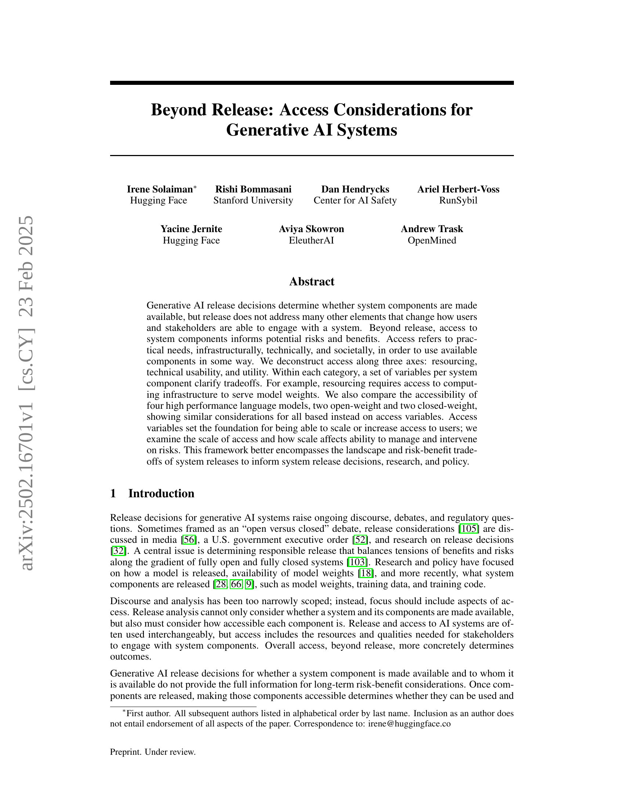

 


 2502.16701 
 Irene Solaiman et el. 
 
 🤗 2025-02-25 
 



↗ arXiv


↗ Hugging Face


↗ Papers with Code


### TL;DR



현재 생성형 AI 시스템의 배포 결정은 단순히 시스템 구성 요소의 이용 가능성에만 초점을 맞추고, 실제 사용자의 접근성 및 사용 편의성에 대한 고려는 부족하다는 문제가 제기되고 있습니다.  이는 시스템의 잠재적 위험 및 이점에 대한 불완전한 평가로 이어지고, 효과적인 위험 관리 및 정책 수립을 어렵게 만듭니다.  특히, **컴퓨팅 자원의 부족, 기술적 사용성의 제약, 시스템의 실질적 유용성 부족** 등은 접근성을 저해하는 주요 요인으로 지목됩니다.

본 논문에서는 이러한 문제를 해결하기 위해 **리소싱, 기술적 사용성, 유용성이라는 세 가지 축을 따라 접근성을 분석하는 새로운 프레임워크**를 제시합니다. 이 프레임워크는 각 구성 요소별 접근성 변수를 정의하고, 이를 통해 위험-이점 간의 상충 관계를 명확히 밝혀내어 **더욱 효과적이고 책임감 있는 시스템 배포 결정 및 정책 수립**을 지원하는 것을 목표로 합니다.  본 연구는 여러 고성능 언어 모델을 사례로 제시하여 프레임워크의 실제 적용 가능성을 보여주고 있으며, 접근성에 대한 포괄적인 분석을 통해 생성형 AI 시스템의 위험 관리 및 정책 결정에 대한 새로운 시각을 제공합니다.



#### Key Takeaways


 생성형 AI 시스템의 배포는 단순히 시스템 구성요소의 이용 가능성을 넘어, 실제 접근성을 고려해야 합니다. 



 리소싱, 사용성, 유용성이라는 세 가지 축을 따라 시스템 구성 요소에 대한 접근성을 분석하는 새로운 프레임워크가 제시되었습니다. 



 제시된 프레임워크는 생성형 AI 시스템의 위험과 이점을 더욱 포괄적으로 이해하고, 시스템 배포 결정, 연구 및 정책 수립에 정보를 제공합니다. 


#### Why does it matter?
본 논문은 **생성형 AI 시스템의 배포 결정을 넘어 접근성에 대한 고려 사항**을 제시하여, 시스템 구성 요소의 이용 가능성뿐만 아니라 실제 사용 가능성에 초점을 맞추고 있습니다.  이는 **AI 시스템의 위험과 이점을 더욱 포괄적으로 평가**하고, **연구 및 정책 결정에 정보를 제공**하는 데 중요한 의미를 가집니다.  특히 접근성이라는 측면에서 리소싱, 사용성, 유용성 세 가지 축을 따라 접근성을 분석하는 프레임워크를 제공하여 기존 연구의 한계를 뛰어넘고 있습니다. 이는 **향후 생성형 AI 시스템 개발 및 배포 전략 수립에 있어 중요한 지침**이 될 것입니다.

------
#### Visual Insights

> 🔼 그림 1은 시스템 구성 요소의 가용성과 접근성의 차이를 보여줍니다. 시스템이 출시되었다는 것은 해당 구성요소가 사용 가능하다는 것을 의미하지만, 모든 이해 관계자가 실제로 해당 구성 요소에 접근할 수 있는 것은 아닙니다. 이 그림은 자원, 기술적 사용 용이성, 유용성의 세 가지 축을 따라 접근성을 분해하여 시스템 구성 요소에 대한 접근 수준을 보여줍니다. 각 축에는 시스템 구성 요소에 대한 접근의 위험과 이점이 자세히 설명되어 있으며, 접근성이 증가함에 따라 위험과 이점이 어떻게 변하는지를 보여줍니다.
> 

> 
read the caption

> Figure 1: From Available to Accessible with High Level Tradeoffs
> 

### In-depth insights

#### Beyond AI Release
본 논문의 "Beyond AI Release" 부분은 단순히 AI 시스템의 배포 여부를 넘어 **사용자와 이해관계자의 참여 방식을 변화시키는 다양한 요소**를 다룹니다.  **접근성(Access)** 이라는 개념을 통해 시스템 구성요소에 대한 실질적인 접근 가능성, 기술적 사용 편의성, 그리고 사회적 유용성을 분석합니다.  이는 단순히 모델 가중치 공개 여부를 넘어 **컴퓨팅 자원 확보, 기술적 사용성, 실제 활용 가능성** 등 다각적인 측면을 고려해야 함을 시사합니다.  특히, 접근성 변수를 통해 **사용자 접근 규모의 확장 가능성과 위험 관리의 상관관계**를 분석하여 AI 시스템의 위험과 이점을 보다 포괄적으로 평가하고자 합니다.  이러한 접근 방식은 **AI 시스템 배포 결정, 연구, 정책 수립**에 중요한 시사점을 제공합니다.

#### Access Deconstructed
본 논문의 'Access Deconstructed' 부분은 접근성이라는 개념을 **자원, 기술적 사용성, 유용성**이라는 세 가지 축으로 분석하여 접근성의 다층적이고 복합적인 측면을 밝히는 데 초점을 맞추고 있습니다.  **단순히 시스템의 공개 여부를 넘어, 실제 사용자가 시스템에 접근하고 활용하는 데 필요한 요소들을 구체적으로 탐구**합니다.  이는 단순히 모델 가중치의 공개 여부만 고려하는 기존 논의를 넘어, 실질적인 접근의 어려움을 야기하는 여러 요인들을 고려해야 한다는 점을 시사합니다. 특히 **컴퓨팅 자원의 부족, 기술적인 전문성의 요구, 그리고 사용자에게 실질적인 도움이 되는 유용성** 등이 접근성에 영향을 미치는 주요 변수로 제시됩니다.  이러한 다각적인 분석을 통해, 연구자들은 단순히 시스템의 공개 여부가 아니라 **다양한 접근 변수들을 고려하여 위험과 이점을 평가**하고, **더욱 책임감 있는 AI 시스템의 출시 및 관리 방안**을 마련하는 데 도움을 받을 수 있습니다.

#### Model Access Tradeoffs
모델 접근의 상충 관계는 생성형 AI 시스템의 배포 및 활용과 관련된 중요한 고려 사항입니다. **개방형 접근**은 연구 및 혁신을 촉진하지만 악용 가능성을 높이고, **폐쇄형 접근**은 안전성을 강화하지만 접근성을 제한합니다. 이러한 상충 관계를 해결하기 위해서는 리소스 접근성, 기술적 사용성, 유용성과 같은 여러 요소를 고려해야 합니다.  예를 들어, 강력한 컴퓨팅 인프라가 필요한 대규모 모델은 리소스가 부족한 연구자에게는 접근이 어려울 수 있습니다. 또한, 사용자 인터페이스의 디자인은 기술에 익숙하지 않은 사용자에게는 접근성을 높일 수 있지만, 악의적인 행위자에게도 악용될 수 있습니다.  따라서, 모델 접근 전략은 특정 시스템의 위험과 이점을 신중하게 평가하고, 다양한 사용자 그룹의 필요와 우려 사항을 충족하는 방식으로 수립되어야 합니다. **모델 접근 정책**은 **안전성, 접근성, 유용성 사이의 균형**을 찾는 데 초점을 맞춰야 합니다.

#### Scaling Access & Risks
본 논문의 '확장 접근 및 위험' 부분은 생성 AI 시스템의 접근성 확대가 가져올 수 있는 이점과 위험을 심도 있게 다룹니다. **접근성 확대는 더 많은 사용자에게 이익을 가져다주지만, 동시에 악의적인 행위자의 접근도 용이하게 할 수 있다는 점**을 강조합니다.  특히, 시스템 구성 요소의 접근성을 자원, 사용 편의성, 유용성 세 가지 축으로 분석하여 각 범주 내에서의 위험과 이점의 상충 관계를 명확히 보여줍니다.  **자원 측면에서는 컴퓨팅 인프라 접근성의 중요성을 강조하며, 이는 모델 가중치를 서비스하는 데 필수적이지만, 비용과 접근성 문제를 야기할 수 있다는 점**을 지적합니다.  사용 편의성 측면에서는 사용자 인터페이스의 중요성을 보여주며, 사용자 인터페이스는 접근성을 높이지만 악의적인 사용자에게도 활용될 수 있습니다.  **유용성 측면에서는 다국어 지원 및 다양한 기능의 중요성과 이로 인한 위험 완화 효과의 다양성을 보여줍니다**.  결론적으로, **생성 AI 시스템의 확장 접근 전략은 이점과 위험을 신중하게 저울질해야 하며, 위험 관리와 개입 전략을 포괄적으로 고려해야 함**을 시사합니다.

#### Future Research Needs
본 논문은 생성형 AI 시스템에 대한 접근성을 넘어, **실제 사용자 접근성**에 대한 심층적인 분석을 제시합니다. 따라서 향후 연구는 **다양한 접근성 변수 간의 상호작용**을 면밀히 조사해야 합니다. 예를 들어, 계산 자원 접근성이 향상되면 기술적 사용성이 낮은 사용자에게도 시스템이 더욱 개방될 수 있지만, 이는 동시에 악의적 행위자의 접근성 또한 높일 수 있습니다.  따라서 **다양한 사용자 그룹에 대한 접근성 평가 방법론**과 **위험 완화 전략** 개발 연구가 필요합니다. 또한, **시간 경과에 따른 접근성 변화**에 대한 연구가 중요합니다.  **새로운 모델과 기술의 등장**, **사회적 인식 변화**, **규제 변화** 등이 접근성에 미치는 영향을 분석하고 이에 대한 전략을 수립하는 연구가 요구됩니다.  마지막으로 **접근성과 시스템의 유용성 및 안전성 간의 관계**를 규명하는 연구를 통해 더욱 책임감 있고 효과적인 생성형 AI 시스템 개발 및 배포 방향을 모색해야 합니다.

### More visual insights

More on figures

> 🔼 그림 2는 생성형 AI 시스템에 대한 접근성을 자원, 사용성, 유용성이라는 세 가지 축으로 분류하고 각 범주에 해당하는 변수들을 보여줍니다. 자원은 시스템 구성 요소를 호스팅하고 제공하는 데 필요한 인프라와 비용을 의미합니다. 사용성은 다양한 기술 수준의 사용자가 시스템 구성 요소를 사용할 수 있는 정도를 나타내며, 유용성은 시스템의 다국어 지원이나 다양한 모드 지원과 같이 사용자에게 제공되는 시스템의 유용성을 의미합니다. 그림에서는 각 구성 요소(문서, 라이선스, 데이터 세트, 코드, 모델 가중치)별로 관련 변수들을 제시하고 있습니다.
> 

> 
read the caption

> Figure 2: Categories of Access and Respective Variables
> 

> 🔼 그림 3은 시스템 구성 요소의 가용성(Available)에서 액세스 가능성(Accessible)으로, 그리고 궁극적으로는 확장된 액세스(Scaled Access)로 이어지는 과정을 보여줍니다. 각 단계마다 자원(Resourcing), 기술적 사용 용이성(Technical Usability), 유용성(Utility) 세 가지 측면의 고려 사항과 이점, 위험을 함께 제시합니다.  개별 사용자(Individualized Access)를 위한 맞춤형 접근 방식과 시스템 및 출력물의 도달 범위를 늘리는 배포(Distribution), 그리고 오용 및 위법 행위를 파악하고 완화하는 관리 가능성(Manageability)에 대한 고려사항도 포함되어 있습니다. 각 단계별로 상위 수준의 이점과 위험이 함께 제시되어 시스템 액세스의 전체적인 흐름과 중요 고려 사항을 효과적으로 설명합니다.
> 

> 
read the caption

> Figure 3: Flow of Access and Scale with High Level Tradeoffs
> 

> 🔼 이 그림은 시스템의 구성 요소가 이용 가능하게 되는 것(Available)과 실제로 접근 가능하게 되는 것(Accessible) 사이의 차이를 보여줍니다.  'Available'은 시스템 구성요소가 배포되었는지 여부를 나타내는 반면, 'Accessible'은 자원, 기술적 사용성, 유용성 세 가지 축을 따라 시스템 구성요소에 대한 접근성의 범위를 보여줍니다. 각 축에는 시스템 구성요소에 대한 접근성을 결정하는 변수들이 포함됩니다. 예를 들어, 자원(Resourcing)은 모델 가중치에 접근하기 위한 컴퓨팅 인프라에 대한 접근성을 의미하고, 기술적 사용성(Technical Usability)은 다양한 기술 수준의 사용자가 시스템을 사용할 수 있는 정도를 나타내며, 유용성(Utility)은 사용자에게 유용한 기능(예: 다국어 지원)의 가용성을 의미합니다. 그림은 각 축에서의 이점과 위험을 간략하게 보여줍니다.  즉, 접근성이 향상되면 더 넓은 사용자층에 도달할 수 있지만, 악의적인 행위자의 위험도 증가할 수 있습니다.  이 그림은 시스템 배포 결정, 연구 및 정책에 대한 정보를 제공하기 위해 시스템 릴리스의 위험과 이점 사이의 절충을 더 잘 포착합니다.
> 

> 
read the caption

> Figure 4: Shifting from Available to Accessible with High Level Tradeoffs
> 

### Full paper



