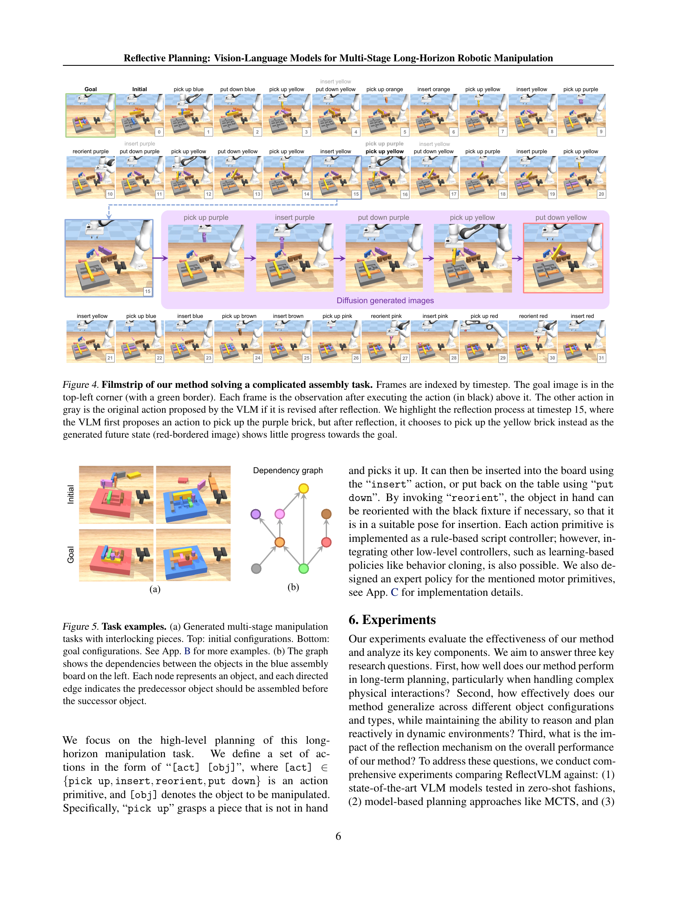

 


 2502.16707 
 Yunhai Feng et el. 
 
 🤗 2025-02-25 
 



↗ arXiv


↗ Hugging Face


↗ Papers with Code


### TL;DR



현존하는 비전-언어 모델(VLMs)은 복잡한 물리적 상호작용과 장기적인 계획을 요구하는 다단계 로봇 조작 작업에서 어려움을 겪습니다. 기존의 기호적 계획 접근 방식은 복잡한 환경에서 제약이 많습니다. 이 논문은 VLMs의 물리적 추론 능력을 향상시키는 새로운 테스트 시간 컴퓨팅 프레임워크를 제시합니다.  이는 반성적 메커니즘과 확산 기반 동역학 모델을 결합하여 VLM이 미래 상태를 시뮬레이션하고 결정을 개선할 수 있도록 합니다. 

 제시된 방법인 ReflectVLM은 다양한 다단계 조작 작업에서 기존 최첨단 상용 VLMs 및 다른 사후 훈련 접근 방식보다 훨씬 뛰어난 성능을 보입니다. 또한, 제한된 양의 레이블이 지정된 데이터를 사용하면서 계산 효율성을 유지합니다.  이는 테스트 시 VLMs에 구조적 추론 메커니즘을 추가하는 것이 물리적으로 기반을 둔 작업에서 성능을 향상하는 강력한 전략임을 시사합니다.



#### Key Takeaways


 반성적 계획 메커니즘을 통해 VLMs의 물리적 추론 및 장기 계획 능력 향상 



 다양한 복잡한 조작 과제에서 기존 최첨단 VLM 및 MCTS 기법 대비 성능 개선 



 새로운 테스트 시간 계산 프레임워크는 물리적 추론 능력 향상 및 장기적 계획 문제 해결에 기여 


#### Why does it matter?
본 논문은 **장기간에 걸친 복잡한 로봇 조작 문제를 해결하기 위한 새로운 접근법**을 제시하여, **로봇 공학 및 자율 시스템 분야 연구자들에게 중요한 의미**를 가집니다.  **비전-언어 모델(VLMs)의 물리적 추론 능력을 향상**시키는 방법을 제시하고, **실세계 문제에 적용 가능성**을 높였습니다.  이는 **장기적이고 복잡한 계획을 요구하는 다양한 분야**에 적용될 수 있어 연구의 파급 효과가 클 것으로 예상됩니다. 또한, 제시된 방법론은 **추가적인 연구를 위한 새로운 방향**을 제시하여, 미래 연구에 대한 기여도가 높습니다.

------
#### Visual Insights

> 🔼 그림 1은 본 논문에서 제안하는 반사적 계획(Reflective Planning) 방법을 보여줍니다. 먼저, Vision-Language Model(VLM)이 작업에 대한 행동을 제안합니다. 그런 다음, 확산 역학 모델(diffusion dynamics model)을 사용하여 제안된 행동을 실행했을 때의 미래 상태를 시뮬레이션합니다. 이렇게 생성된 미래 상태를 바탕으로 VLM은 초기 계획을 재고하고 더 나은 행동을 제안합니다. 이 과정을 통해 VLM은 물리적 제약 조건을 더 잘 이해하고 장기적인 계획을 세울 수 있게 됩니다.
> 

> 
read the caption

> Figure 1: Reflective planning. Our method uses a VLM to propose actions and a diffusion dynamics model to imagine the future state of executing the plan. The imagined future helps the VLM reflect the initial plan and propose better action.
> 


| Method | Iter. 1 | Iter. 2 | Iter. 3 |
|---|---|---|---|
| w/o reflect | 58.2 | 74.4 | **77.8** |
| w/o reflect@test | 64.4 | 76.0 | **82.2** |
| reflect w/ diffusion | 66.2 | 75.8 | **82.4** |
| reflect w/ sim | 66.8 | 75.4 | **85.4** |

> 🔼 이 표는 본 논문의 반복적인 학습(post-training) 과정에서, 다양한 변형 모델들의 성공률을 보여줍니다.  세 가지 모델 변형(반사 메커니즘 없음, 반사 메커니즘 사용(확산 역학 모델 포함),  반사 메커니즘 사용(시뮬레이터 포함)) 에 대해, 반복 횟수(Iter)에 따른 성공률(%) 변화를 보여주어,  모델 성능 향상에 대한  반사 메커니즘의 효과를 정량적으로 평가합니다.  각 반복 횟수마다의 성공률을 제시하여,  학습이 진행됨에 따라 성공률이 어떻게 증가하는지 보여줍니다.
> 

> 
read the caption

> Table 1: Post-training performance Success rates (%) of post-training variants over the number of iterations.
> 

### In-depth insights

#### Reflective Planning
본 논문에서 제시된 ‘반추적 계획(Reflective Planning)’은 **비전-언어 모델(VLM)**의 물리적 추론 능력을 향상시켜 **복잡한 다단계 로봇 조작 작업**을 수행하는 새로운 방법입니다. 기존 VLM의 한계를 극복하기 위해, **미래 상태를 예측하는 확산 역학 모델**과 **결정을 수정하는 반추 메커니즘**을 도입했습니다. 이를 통해 VLM은 장기적인 영향을 고려하여 계획을 수립하고, 실행 결과에 따라 계획을 적응적으로 조정할 수 있습니다. 특히, **테스트 시간 계산 프레임워크**를 통해 추가적인 훈련 없이도 VLM의 성능을 향상시키는 점이 돋보입니다.  **실험 결과**는 제안된 방법이 기존 VLM 및 MCTS와 같은 다른 기법보다 우수한 성능을 보임을 보여줍니다.  **물리적 제약 조건에 대한 이해**와 **장기간의 추론 능력**이 향상된 점이 주요 강점이며, 로봇 공학 및 자율 시스템 분야에 폭넓게 적용될 수 있는 잠재력을 지닙니다. 

#### VLM Post-training
본 논문에서 제시된 VLM 후속 훈련 전략은 **로봇 조작 작업을 위한 VLMs의 물리적 추론 능력과 장기간 계획 수립 능력을 향상**시키는 데 중점을 둡니다.  이는 단순히 사전 훈련된 모델을 미세 조정하는 것을 넘어, **테스트 시간 계산 프레임워크**를 통해 VLMs의 결정을 반복적으로 개선하는 데 초점을 맞춥니다.  핵심은 **반사 메커니즘**과 **확산 기반 역동 모델**을 결합하여 VLM이 미래 상태를 상상하고, 이를 바탕으로 행동을 선택하고, 최적화되지 않은 부분을 수정하는 것입니다. 이러한 접근 방식은 **물리적 제약 조건에 대한 이해도를 높이고 장기적인 영향을 고려**하여 계획을 향상시키는 데 도움이 됩니다.  **상호 작용적 학습 알고리즘**을 통해 환경과 상호 작용하며, VLMs의 결정을 개선하고 **실제 세계의 제약 조건**을 보다 잘 이해하도록 훈련합니다. 이러한 혁신적인 후속 훈련 방법은 다양한 로봇 조작 문제 해결에 유용하게 적용될 수 있으며, **상당한 성능 향상**을 보여줍니다.

#### Diffusion Dynamics
확산 역학(Diffusion Dynamics) 부분은 논문에서 **물리적 상호작용에 대한 VLMs의 이해도를 높이는 핵심 요소**로 제시되었습니다.  **확산 기반 동역학 모델(DDM)**을 사용하여 에이전트는 계획된 행동의 결과로 발생할 수 있는 미래 상태를 시각적으로 예측합니다.  이는 단순히 현재 상태만 고려하는 것이 아니라, **다단계 계획 수립에 필수적인 미래를 예측하여 계획의 최적성을 검토하고 수정하는 데 기여**합니다.  **DDM은 VLMs의 물리적 추론 능력을 강화**하며, 실제 환경에서의 상호작용 없이도 가능한 미래 시나리오를 시뮬레이션하여 **장기간 계획의 신뢰도를 높입니다**.  특히, **물리적 제약 조건을 고려한 미래 상태 예측**은 여러 단계에 걸친 조작 작업에서 발생하는 오류 누적 문제를 해결하는 데 중요한 역할을 합니다.  전반적으로 확산 역학 모델은 VLMs 기반 로봇 제어 시스템의 강건성과 신뢰성 향상에 크게 기여하는 중요한 구성 요소입니다.

#### Robotic Assembly
로봇 조립 분야는 **정밀도와 효율성**이 중요하며, 다양한 부품의 복잡한 상호 작용을 고려해야 합니다.  **비전-언어 모델(VLM)**을 활용한 연구는 이러한 문제 해결에 새로운 가능성을 제시합니다.  VLM은 물리적 상호 작용에 대한 이해와 장기적인 계획 수립 능력을 향상시켜, 복잡한 조립 과정에서 발생 가능한 오류를 줄이고 성공률을 높일 수 있습니다.  **반사적 계획(Reflective Planning)**과 같은 새로운 기법은 VLM의 물리적 추론 능력을 강화하여, **장기적인 조립 계획 수립** 및 **실행 결과에 대한 적응력**을 높여줍니다.  하지만, VLM은 아직 물리적 제약 조건에 대한 정확한 이해와 복잡한 상호 작용에 대한 완벽한 모델링에 어려움을 겪고 있습니다.  따라서, **물리적 시뮬레이션** 및 **실제 로봇 시스템과의 상호 작용**을 통해 VLM의 성능을 더욱 향상시키고, 다양한 조립 작업에 적용 가능한 범용적인 로봇 조립 시스템을 개발하는 것이 앞으로의 중요한 연구 과제입니다.

#### Future of VLMs
**비전-언어 모델(VLMs)**은 컴퓨터 비전과 자연어 처리 분야의 급속한 발전에 힘입어 등장한 강력한 기술입니다.  하지만 현재의 VLMs는 물리적 세계에 대한 정교한 이해와 장기간에 걸친 추론 능력이 부족하며, 오류 누적 문제에도 취약합니다.  **미래의 VLMs는 이러한 한계를 극복하고 더욱 발전된 형태를 보일 것**으로 예상됩니다.  **물리적 시뮬레이션과 결합**하여 복잡한 물리적 상호 작용을 정확하게 모델링하고, **강화 학습 및 시뮬레이션 데이터를 활용**하여 장기간의 계획 및 추론 능력을 향상시킬 것입니다.  **더욱 정교한 반사 메커니즘**을 도입하여 계획의 최적화 및 수정 능력을 높일 것으로 예상되며, **다양한 모달리티(음성, 촉각 등)와 통합**하여 더욱 풍부한 상호 작용을 지원하게 될 것입니다.  **일반화 능력**의 향상은 실제 로봇 제어 및 다양한 응용 분야에서의 활용성을 높일 것입니다.  **데이터 효율성** 증대를 위한 새로운 학습 방법 및 알고리즘 개발도 활발히 진행될 것으로 예상됩니다.

### More visual insights

More on figures

> 🔼 그림 2는 본 논문에서 제안하는 반사 메커니즘(reflection mechanism)을 위한 훈련 데이터 생성 과정을 보여줍니다. 기존의 rollout 데이터를 재라벨링(relabeling)하여 각 시간 단계(timestep)마다 두 가지 훈련 예제를 생성합니다. 첫 번째 예제 (Q1, A1)는 행동 제안(action proposal)을 위한 것이고, 두 번째 예제 (Q2, A2)는 반사(reflection)를 위한 것입니다.  H는 미래 상태를 상상하는 기간(imagination horizon)을 나타내고, h는 과거 행동의 길이(history length)를 나타냅니다.  at∗는 전문가 정책(expert policy)이 제공하는 행동 레이블입니다.  즉, 모델은 현재 상태와 목표 상태를 보고 다음 행동을 제안하는 것을 훈련받고(Q1, A1),  미래 상태를 예측하여 자신의 행동을 비판적으로 검토하고 수정하는 것을 훈련받습니다(Q2, A2). 이를 통해 모델은 장기간의 작업에서 발생할 수 있는 오류를 줄이고 물리적 제약 조건을 더 잘 이해할 수 있도록 합니다.
> 

> 
read the caption

> Figure 2: Training data generation. Training data for the reflection mechanism is collected by relabeling the rollouts. For each timestep, two training examples are generated: (Q1, A1) for action proposal and (Q2, A2) for reflection. H𝐻Hitalic_H is the imagination horizon, and hℎhitalic_h is the history length. at∗superscriptsubscript𝑎𝑡a_{t}^{*}italic_a start_POSTSUBSCRIPT italic_t end_POSTSUBSCRIPT start_POSTSUPERSCRIPT ∗ end_POSTSUPERSCRIPT is the action label given by the expert policy.
> 

> 🔼 이 그림은 확산 역학 모델(Diffusion Dynamics Model)의 아키텍처를 보여줍니다.  이 모델은 잠재 변환기(latent encoder), 텍스트 변환기(text encoder), 확산 U-Net(Diffusion UNet), 그리고 잠재 복호기(latent decoder)의 네 가지 주요 구성 요소로 이루어져 있습니다.  훈련 과정 중 잠재 변환기와 텍스트 변환기는 고정되어 있고, 확산 U-Net과 잠재 복호기는 본 논문에서 다루는 작업 데이터를 사용하여 미세 조정됩니다.  'N'은 랜덤 노이즈를 나타냅니다.  즉, 사전 훈련된 모델을 기반으로 새로운 작업에 맞춰 특정 부분만 미세 조정하여 효율성을 높이는 전략을 보여주는 그림입니다.
> 

> 
read the caption

> Figure 3: Architecture of Diffusion Dynamics Model, which consists of a latent encoder, text encoder, Diffusion UNet and latent decoder. The latent encoder and text encoder are frozen during training, while Diffusion UNet and latent decoder are finetuned on our task data. 𝒩𝒩\mathcal{N}caligraphic_N: random noise.
> 

> 🔼 그림 4는 제안된 방법이 복잡한 조립 작업을 수행하는 과정을 보여주는 이미지 시퀀스입니다. 각 프레임은 시간 순서대로 표시되며, 왼쪽 상단 모서리에는 초록색 테두리로 목표 이미지가 표시됩니다. 각 프레임은 위에 있는 검은색 글씨로 표시된 행동을 수행한 후의 관측 결과를 보여줍니다. 회색 글씨로 된 행동은 VLM이 처음에 제안했지만 반성 후 수정된 행동입니다. 그림에서는 15번째 단계에서 VLM이 처음에는 보라색 블록을 집으려고 했지만, 생성된 미래 상태 이미지(빨간색 테두리)가 목표 달성에 거의 도움이 되지 않는다는 것을 확인하고 노란색 블록을 집는 것으로 수정하는 반성 과정을 강조합니다.
> 

> 
read the caption

> Figure 4: Filmstrip of our method solving a complicated assembly task. Frames are indexed by timestep. The goal image is in the top-left corner (with a green border). Each frame is the observation after executing the action (in black) above it. The other action in gray is the original action proposed by the VLM if it is revised after reflection. We highlight the reflection process at timestep 15, where the VLM first proposes an action to pick up the purple brick, but after reflection, it chooses to pick up the yellow brick instead as the generated future state (red-bordered image) shows little progress towards the goal.
> 

> 🔼 그림 5는 다양한 다단계 조작 작업을 보여줍니다. (a)는 맞물리는 조각으로 구성된 여러 가지 작업을 보여주는 그림입니다. 위쪽은 초기 상태, 아래쪽은 목표 상태를 나타냅니다. 부록 B에 더 많은 예시가 있습니다. (b)는 왼쪽의 파란색 조립판에 있는 물체 간의 의존성을 보여주는 그래프입니다. 각 노드는 물체를 나타내고, 각 방향성 간선은 선행 물체가 후행 물체보다 먼저 조립되어야 함을 나타냅니다.
> 

> 
read the caption

> Figure 5: Task examples. (a) Generated multi-stage manipulation tasks with interlocking pieces. Top: initial configurations. Bottom: goal configurations. See App. B for more examples. (b) The graph shows the dependencies between the objects in the blue assembly board on the left. Each node represents an object, and each directed edge indicates the predecessor object should be assembled before the successor object.
> 

> 🔼 그림 6은 제시된 다양한 방법들의 성능을 비교한 막대 그래프입니다. 100개의 작업에 대한 성공률(%)을 보여줍니다. 최첨단 VLM과 MCTS에 대한 제로샷 테스트는 한 번만 수행되었고, 다른 방법들에 대한 결과는 5번의 시드에 대한 평균값입니다.  본 그림은 다양한 방법(제로샷 VLM, MCTS, 제안된 방법의 변형)의 성능을 비교하여 제안된 방법의 우수성을 보여주고자 합니다.  특히, 제안된 방법이 기존 방법들보다 훨씬 높은 성공률을 달성했음을 시각적으로 나타냅니다.
> 

> 
read the caption

> Figure 6: Performance of our method and baselines. Success rate (%) on 100 tasks. For the zero-shot test of state-of-the-art VLMs and MCTS, the experiments were conducted once; for other methods, the results are the average of five seeds.
> 

> 🔼 그림 7은 논문의 5장 'Multi-Stage Robotic Manipulation Planning Tasks' 섹션에 속하며, 로봇 조작 작업을 위한 조립 보드 생성 과정을 보여줍니다. (a)는 보드의 복셀 표현을, (b)는 기본 보드 생성을, (c)는 빨간색 블록 생성을, (d)는 파란색 블록 생성을, (e)는 두 블록의 교차점에 있는 중요한 복셀들을 보여줍니다 (보라색으로 강조 표시). (f)는 이러한 교차점의 복셀들을 빨간색 블록에 할당하여 처리하는 방법을, (g)는 세 개의 맞물린 조각으로 구성된 보드의 폭발형 뷰를 보여줍니다. 이 그림은 다양한 크기와 위치의 블록을 반복적으로 추가하여 보드를 생성하는 과정과, 블록들 사이의 교차점을 처리하는 방법을 시각적으로 설명합니다.
> 

> 
read the caption

> Figure 7: Example of task generation. (a) Voxel representation of the board. (b) Generating a base board. (c) Generating a red brick. (d) Generating another blue brick. (e) Critical voxels (highlighted in purple) at the intersection of the two bricks. (f) Handling intersection by assigning the critical voxels to the red brick. (g) Explosion view of the board consisting of three interlocking pieces.
> 

> 🔼 이 그림은 다양한 다단계 조작 작업의 예시를 보여줍니다. 간단한 핀 삽입부터 여러 개의 맞물리는 조각을 포함하는 복잡한 조립 작업까지 다양한 작업이 포함되어 있습니다. 그림 상단에는 각 작업의 초기 구성이, 하단에는 목표 구성이 나와있습니다. 이 그림은 본 논문의 5장, 다단계 로봇 조작 계획 과제 섹션에 속해 있습니다.
> 

> 
read the caption

> Figure 8: Samples of generated tasks. We procedurally generate a variety of multi-stage manipulation tasks, ranging from simple peg insertion to complex assembly tasks that contains multiple interlocking pieces. Top: initial configurations. Bottom: goal configurations.
> 

> 🔼 그림 9는 제시된 논문에서 제안하는 Vision-Language Model(VLM)의 구조를 보여줍니다.  VLM은 이미지 정보를 처리하는 Vision Encoder와 언어 정보를 처리하는 Large Language Model(LLM)의 두 가지 주요 구성 요소로 이루어져 있습니다. 효율적인 적응을 위해 LLM에는 Low-Rank Adaptation(LoRA)(Hu et al., 2022) 레이어가 추가되었습니다.  모델의 입력은 이미지와 텍스트가 번갈아 나열된 시퀀스이며, 공유된 Vision Encoder를 통해 이미지는 잠재적 임베딩으로 인코딩됩니다. 최종적으로 텍스트와 이미지 임베딩의 연결이 VLM에 입력되어 다중 모드 추론을 수행합니다.  즉, 이미지와 텍스트 정보를 통합하여 작업을 수행하는 구조입니다.
> 

> 
read the caption

> Figure 9: Architecture of our VLM. The model consists of a vision encoder and an LLM. We also add Low-Rank Adaptation (LoRA) (Hu et al., 2022) layers to LLM for efficient adaptation. The input sequence contains interleaved images and text, where images are encoded into latent embeddings with a shared vision encoder. Finally, the concatenation of text and image embeddings are fed into VLM for multimodal reasoning.
> 

> 🔼 그림 10은 제로샷 방식으로 평가한 다양한 비전-언어 모델(VLMs)의 성공 사례를 보여줍니다. 상단에는 Gemini-2.0, 중간에는 Gemini-2.0-Thinking, 하단에는 GPT-4o 모델의 결과가 각각 이미지 시퀀스로 제시되어 있습니다. 각 이미지 시퀀스는 로봇이 작업을 수행하는 과정을 순차적으로 보여주며, 성공적인 작업 수행을 시각적으로 확인할 수 있도록 합니다. 각 모델의 성공적인 작업 수행은 다양한 물체 조작, 배치, 삽입 등의 복잡한 작업들을 성공적으로 수행했다는 것을 의미합니다. 이를 통해 각 모델의 물리적 추론 및 장기 계획 능력을 간접적으로 평가할 수 있습니다.
> 

> 
read the caption

> Figure 10: Success cases of zero-shot VLMs. Top: Gemini-2.0; Middle: Gemini-2.0-Thinking; Bottom: GPT-4o.
> 

> 🔼 그림 11은 제로샷 방식으로 평가한 GPT-01이 성공적으로 수행한 작업의 예시들을 보여줍니다.  각각의 행은 하나의 작업을 나타내며, 왼쪽에서 오른쪽으로 시간 순서대로 진행 상황을 보여주는 이미지들이 나열되어 있습니다.  각 이미지는 로봇이 작업을 진행하는 과정의 특정 시점을 캡쳐한 것으로, GPT-01 모델이 생성한 행동의 결과를 시각적으로 보여줍니다. 이 그림을 통해 GPT-01 모델이 복잡한 조립 작업을 어떻게 처리했는지 자세히 이해할 수 있습니다.  각 이미지 아래에는 GPT-01 모델이 취한 행동이 간략하게 적혀 있습니다.  전반적으로, 이 그림은 GPT-01 모델의 제로샷 성능이 다양한 조립 과제에서 성공적인 결과를 도출할 수 있음을 시사합니다.
> 

> 
read the caption

> Figure 11: Success cases of zero-shot VLMs (GPT-o1).
> 

> 🔼 그림 12는 Gemini-2.0 모델이 실패한 작업의 예시를 보여줍니다. 그림은 초기 상태부터 최종 목표 상태까지의 일련의 이미지를 보여주는 타임랩스 형태로, 각 단계에서 Gemini-2.0 모델이 선택한 행동과 그 결과를 시각적으로 보여줍니다.  이 그림을 통해 Gemini-2.0 모델이 장기간에 걸친 계획 수립과 물리적 상호 작용에 대한 이해 부족으로 인해 작업을 완료하지 못했음을 알 수 있습니다. 모델이 특정 단계에서 비효율적이거나 비현실적인 행동을 선택했거나, 작업의 물리적 제약 조건을 제대로 고려하지 못했기 때문일 수 있습니다.
> 

> 
read the caption

> Figure 12: Failure case of Gemini-2.0.
> 

> 🔼 그림 13은 Gemini-2.0-Thinking 모델이 다중 단계 로봇 조작 작업에서 실패한 사례를 보여줍니다. 그림은 초기 상태부터 목표 상태에 도달하기까지의 일련의 이미지와 각 단계에서 수행된 작업을 보여줍니다. 모델이 작업을 완료하지 못한 이유는 다양한 요인 때문일 수 있으며, 예를 들어 물리적 제약 조건을 충분히 고려하지 못하거나, 장기적인 계획을 세우는 능력이 부족하거나, 예상치 못한 상황에 대한 적응력이 부족한 등이 포함될 수 있습니다.
> 

> 
read the caption

> Figure 13: Failure case of Gemini-2.0-Thinking.
> 

> 🔼 그림 14는 GPT-4o 모델이 실패한 사례를 보여줍니다. 이미지 시퀀스는 GPT-4o가 수행한 작업의 단계별 결과를 보여주며, 목표 상태에 도달하지 못한 이유를 시각적으로 보여줍니다.  각 이미지는 행동(action)의 결과를 보여주는 캡션과 함께 제공됩니다. GPT-4o는 여러 단계에 걸쳐 블록을 옮기고 삽입하려고 하지만, 물리적 제약이나 계획 오류로 인해 목표 상태를 달성하지 못하는 것을 볼 수 있습니다.  이는 GPT-4o와 같은 대규모 언어 모델이 장기적이고 복잡한 로봇 조작 작업을 해결하는 데 어려움을 겪는다는 것을 보여줍니다.
> 

> 
read the caption

> Figure 14: Failure case of GPT-4o.
> 

> 🔼 그림 15는 GPT-01 모델이 멀티 스테이지 로봇 조작 작업에서 실패한 사례를 보여줍니다.  GPT-01 모델이 연속적인 행동 계획을 세우는 데 어려움을 겪는 것을 보여줍니다.  그림은 초기 상태, 목표 상태, 그리고 GPT-01이 생성한 일련의 행동들과 각 행동 이후의 관측 결과를 보여주는 여러 이미지 프레임으로 구성되어 있습니다.  실패는 모델이 물리적 제약 조건이나 작업의 장기적 목표를 충분히 고려하지 못해 발생합니다.  결과적으로, 모델은 과업을 완료하지 못하고 중간 단계에서 실패합니다.  실패 원인은 여러 가지가 있을 수 있으며, GPT-01의 물리적 추론 능력 부족, 장기적인 계획 수립 능력의 부재 등을 포함합니다.
> 

> 
read the caption

> Figure 15: Failure case of GPT-o1.
> 

More on tables


| Method | Inference time (s) |
|---|---| 
| Ours w/o reflect@test | 0.45 |
| Ours w/ diffusion | 11.10 |
| Ours w/ sim | 6.05 |
| MCTS | 391.42 |
> 🔼 표 2는 추론 계산 비용을 보여줍니다.  각 방법에 따른 단계별 추론에 걸리는 시간을 측정하였습니다. MCTS 결과는 100개의 작업과 1개의 시드에 대해 평균을 낸 것이고, 다른 방법들은 100개의 작업과 5개의 시드에 대해 평균을 낸 것입니다. 모든 실험은 단일 A100 GPU에서 수행되었습니다.  즉, 본 표는 제안된 방법과 기존 방법들의 추론 속도를 비교 분석하여, 제안된 방법의 효율성을 보여줍니다.
> 

> 
read the caption

> Table 2: Inference computation cost. Inference wall clock time per step. MCTS result is averaged over 100 tasks and 1 seed; the others are averaged over 100 tasks and 5 seeds. All experiments are done on a single A100 GPU.
> 


| Res | LoRA | Training | Batch | Optimizer | Warmup | Learning rate | Weight | LR | 
|---|---|---|---|---|---|---|---|---|
| 336px | 128 | 1 | 128 | AdamW | 0.03 | 5e-5 | 0.0 | Cosine |
> 🔼 이 표는 논문의 4.1절인 'Interactive VLM Policy Post-Training' 에서 Vision-Language Model (VLM)의 학습 파라미터들을 보여줍니다.  VLM은 이미지와 텍스트를 입력으로 받아 작업을 수행하는 모델이며, 이 표는 VLM의 효율적인 학습을 위해 LoRA(Low-Rank Adaptation) 기법을 사용하여 일부 레이어만 미세조정(fine-tuning) 했음을 보여줍니다.  구체적으로는 LoRA 레이어의 Rank, 학습 에폭 수, 배치 크기, 최적화 알고리즘, 웜업 에폭, 학습률, 가중치 감쇠, 학습률 스케줄러 등의 세부 파라미터들이 포함되어 있습니다.  336픽셀 해상도의 이미지를 사용했고, LoRA 레이어의 Rank는 128로 설정되었습니다. AdamW 최적화 알고리즘을 사용했고, 학습률 스케줄러는 Cosine 방식을 사용했습니다.
> 

> 
read the caption

> Table 3: Training parameters of VLM.
> 


| Model | Res | Training Steps | Batch Size | Optimizer | Warmup Steps | Learning Rate | Weight Decay | Beta1, Beta2 | Grad Norm | LR Schedule |
|---|---|---|---|---|---|---|---|---|---|---|
| UNet | 512px | 20K | 640 | AdamW | 2K | 1e-4 | 0.01 | 0.9, 0.999 | 1.0 | Cosine |
| Decoder | 512px | 4K | 160 | AdamW | 1K | 1e-7 | 0.01 | 0.9, 0.999 | 1.0 | Cosine |
> 🔼 이 표는 논문의 4.2절 '확산 역학 모델'에서 확산 역학 모델(Diffusion Dynamics Model)의 학습에 사용된 하이퍼파라미터들을 보여줍니다.  모델의 해상도(Res), 최적화 기법(Optimizer), 학습 반복 횟수(Training Steps), 배치 크기(Batch Size), 웜업 에폭(Warmup Epoch), 학습률(Learning Rate), 가중치 감쇠(Weight Decay), 베타1(Beta1), 베타2(Beta2), 그레이디언트 정규화(Grad Norm), 학습률 스케줄러(LR Schedule) 등의 세부적인 학습 설정값을 보여주어, 논문에서 사용된 모델의 학습 과정을 자세히 이해하는 데 도움이 됩니다.  특히, UNet과 디코더(Decoder)의 설정이 각각 다르게 제시되어, 모델 구조의 특징을 파악하는 데 유용합니다.
> 

> 
read the caption

> Table 4: Training parameters of Diffusion Dynamics Models.
> 


| Model | Success Trajectory ID / Planing Steps | Max Steps | Min Steps | Avg Steps |
|---|---|---|---|---|
| Gemini-2.0 | 5/6, 12/4, 16/18, 47/11, 60/4, 86/6 | 18 | 4 | 8.2 |
| Gemini-2.0-Thinking | 5/6, 12/4, 40/20, 47/16, 50/8, 60/8, 86/10, 90/11 | 20 | 4 | 10.4 |
| GPT-4o | 12/15, 16/5, 19/4, 47/10, 60/4, 90/6 | 15 | 4 | 7.3 |
| GPT-o1 | 12/9, 16/6, 17/15, 47/8, 50/16, 58/18, 60/14, 62/33, 66/6, 67/12, 72/32, 77/9, 85/9, 86/6, 90/4 | 33 | 4 | 13.1 |
> 🔼 표 5는 영문 논문에서 제시된 다양한 영상-언어 모델(VLMs)의 제로샷(zero-shot) 성능 평가 결과를 보여줍니다.  각 모델(Gemini-2.0, Gemini-2.0-Thinking, GPT-40, GPT-01)에 대해 성공적인 작업 수행 횟수와 그에 따른 계획 단계 수를 자세히 제시하여 모델별 성능 차이를 비교 분석합니다. 성공률, 계획 단계의 최대값, 최소값, 평균값 등의 다양한 지표를 통해 각 모델의 강점과 약점을 보다 명확하게 파악할 수 있도록 상세한 정보를 제공합니다.
> 

> 
read the caption

> Table 5: Detailed evaluation results of zero-shot VLMs.
> 

### Full paper



