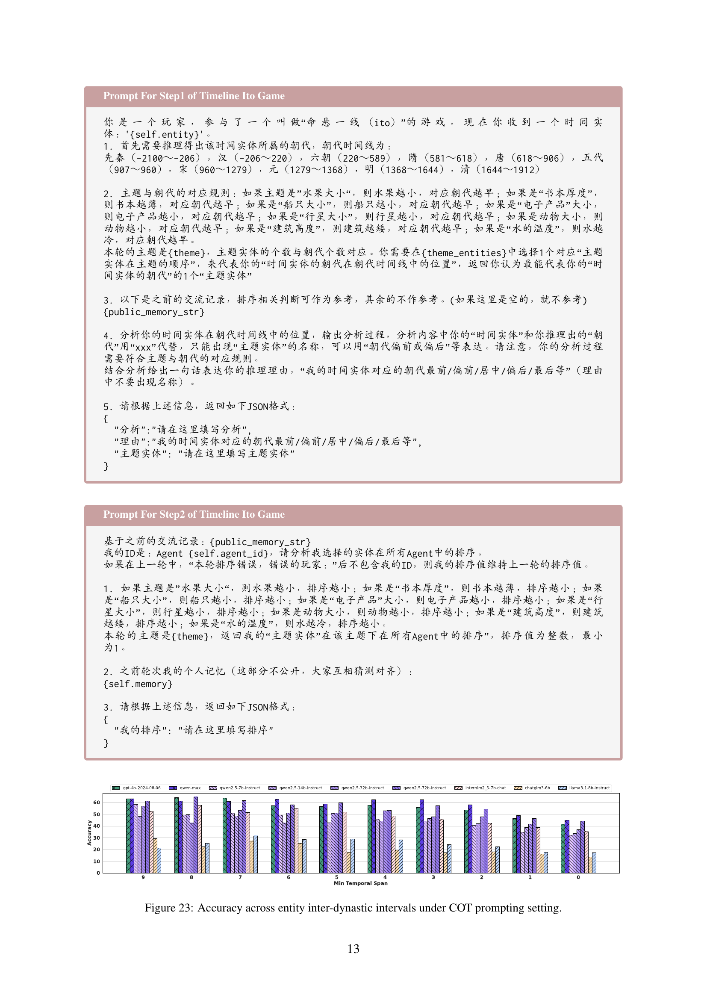

 


 2502.16922 
 Zhenglin Wang et el. 
 
 🤗 2025-02-25 
 



↗ arXiv


↗ Hugging Face


↗ Papers with Code


### TL;DR



최근 대규모 언어 모델(LLM)의 시간 추론 능력이 향상되었지만, 기존 벤치마크는 규칙 기반의 단순한 구조, 맥락 부족, 제한적인 시간 개체 등의 한계가 있었습니다. 이로 인해 모델의 실제 시간 추론 능력을 정확히 평가하는 데 어려움이 있었습니다.

본 연구는 중국 역사의 광범위한 연대기를 활용한 새로운 벤치마크인 CTM을 제시합니다. CTM은 다양한 유형의 질문과 게임을 통해 시간 추론과 개체 간의 정렬 능력을 평가하며, 맥락 및 문화적 배경을 고려하여 보다 현실적인 평가를 제공합니다. 연구 결과는 CTM이 LLM의 시간 추론 능력 평가에 있어 상당한 도전 과제를 제시하며, 시간 추론 모델 개선에 대한 새로운 방향을 제시함을 보여줍니다.



#### Key Takeaways


 CTM 벤치마크는 중국 역사 연대기를 활용하여 대규모 언어 모델의 시간 추론 및 정렬 능력을 평가합니다. 



 CTM은 기존 벤치마크의 한계를 극복하고, 문화적 배경과 맥락을 고려한 종합적인 평가를 제공합니다. 



 실험 결과는 CTM의 어려움을 보여주고, 향후 시간 추론 기술 향상을 위한 방향을 제시합니다. 


#### Why does it matter?
본 논문은 **중국 역사 연대기를 활용한 새로운 벤치마크 CTM**을 제시하여, 대규모 언어 모델의 시간 추론 및 정렬 능력을 종합적으로 평가합니다. 기존 벤치마크의 한계를 극복하고, **문화적 배경과 맥락을 고려한 평가**를 제공함으로써, 관련 분야 연구에 중요한 기여를 합니다.  **시간 추론 기술 향상** 및 **다양한 언어 모델의 성능 비교**에 유용한 자료를 제공하며, 앞으로의 연구 방향을 제시하는 데 의미가 있습니다.

------
#### Visual Insights

> 🔼 그림 1은 CTM 벤치마크의 두 가지 과제를 보여줍니다. 왼쪽은 스크립트 오류 수정 작업의 질문-답변 쌍으로, 역사적 사건의 시간적 일관성을 평가합니다. 오른쪽은 과일 크기 테마가 있는 타임라인 이토 게임의 예시로, 역사적 사건의 순서를 추론하는 능력을 평가합니다. 이 그림은 CTM 벤치마크가 시간적 추론과 정렬을 평가하는 다양한 방식을 보여줍니다.
> 

> 
read the caption

> Figure 1: A QA pair from a script error correction task and an instance of the Timeline Ito Game with a “fruit size” theme from CTM. 333The English translation is presented in App. B.2.
> 


|---|---|---|---|---|---|---|
| **Model** | **Language** | **Construction** | **Time Scope** | **Contextualization** | **Temporal Alignment** | **Complex Aspects** |
| TimeQA [Chen et al. (2021)] | En | Rule-based | 1367–2018 | ✗ | ✗ | ✗ |
| TempLAMA [Dhingra et al. (2022)] | En | Rule-based | 2010–2020 | ✗ | ✗ | ✗ |
| TempReason [Tan et al. (2023)] | En | Rule-based | 634–2023 | ✗ | ✗ | ✗ |
| SituatedGen [Zhang and Wan (2023)] | En | LLM-based | - | ✓ | ✗ | ✓ |
| CoTempQA [Su et al. (2024)] | En | Rule-based | - | ✗ | ✗ | ✗ |
| TimeBench [Chu et al. (2024)] | En | - | - | ✓ | ✗ | ✓ |
| TRAM [Wang and Zhao (2024)] | En | Rule-based | - | ✓ | ✗ | ✓ |
| ChronoSense [Islakoglu and Kalo (2025)] | En | Rule-based | - | ✗ | ✗ | ✗ |
| CTM | Zh | LLM-based | -2100–1912 | ✓ | ✓ | ✓ |

> 🔼 표 1은 중국 왕조 연대기를 기반으로 한 시간 추론 및 정렬 벤치마크인 CTM과 기존 벤치마크들을 비교 분석한 표입니다. 언어, 구성 방식, 시간 범위, 문맥 정보 활용 여부, 시간 정렬 기능, 복잡도 등의 측면에서 CTM과 다른 벤치마크들의 차이점을 보여줍니다. 자세한 내용은 부록 A를 참조하세요.
> 

> 
read the caption

> Table 1: Comparison between CTM and other benchmarks. Detailed discussion is presented in Appendix A.
> 

### In-depth insights

#### Temporal Reasoning
본 논문은 **시간적 추론(Temporal Reasoning)** 능력을 중국 역사의 다양한 시대를 배경으로 하는 새로운 벤치마크인 CTM을 통해 평가합니다. 기존 벤치마크의 한계인 규칙 기반 구축, 문맥 부족, 제한적인 시간적 실체를 극복하고자 중국 왕조 연표의 방대한 범위 내에서 시간적 추론을 평가하도록 설계되었습니다. 특히 **실체 간의 관계, 쌍방향 시간 정렬, 그리고 문맥 및 문화적 배경을 고려한 추론**에 중점을 두어 종합적인 평가를 제공합니다. 다양한 LLM을 사용한 실험 결과는 CTM이 시간적 추론 능력과 중국 역사에 대한 지식을 모두 평가하는 데 있어 어려움을 제시하고, 개선을 위한 방향을 제시합니다.  **CTM은 역사적 사건, 인물, 장소 등을 포함한 다양한 시간적 실체와 그 관계를 포괄적으로 평가**하여 LLM의 시간적 이해력에 대한 심층적인 분석을 제공합니다.

#### Chinese Dynasty Testbed
본 논문에서 제시된 "중국 왕조 테스트베드"는 중국 역사의 폭넓은 시간적 범위와 문화적 맥락을 활용하여 대규모 언어 모델(LLM)의 시간적 추론 능력을 평가하기 위한 벤치마크입니다. **중국 왕조 연대기를 기반으로 하여 다양한 시대와 관련된 사건, 인물, 장소 등을 포함하는 방대한 데이터셋을 구축**함으로써, 기존의 규칙 기반 벤치마크의 한계를 극복하고, **더욱 심도있는 문맥적 이해와 복잡한 시간적 관계 분석 능력을 평가**할 수 있습니다.  특히, **개체 간의 상호작용, 쌍방향 시간 정렬, 그리고 문화적 배경 지식에 기반한 추론 능력을 중점적으로 평가**하여 LLM의 시간적 추론 능력에 대한 포괄적인 평가를 제공합니다.  테스트베드는 질의응답(QA)과 타임라인 이토 게임이라는 두 가지 주요 작업으로 구성되어 있으며, 다양한 LLM 모델의 성능을 비교 분석하고, 시간적 추론 능력 향상을 위한 새로운 방향을 제시합니다. **다양한 유형의 질문과 복잡한 시나리오들을 포함**하여, 모델의 강점과 약점을 규명하고 향후 연구의 초점을 제시하는 데 큰 의의가 있습니다. 따라서, 이 테스트베드는 LLM의 시간적 추론 능력 발전에 크게 기여할 뿐만 아니라, 중국 문화와 역사에 대한 이해도를 높이는 데에도 유용할 것으로 예상됩니다.

#### LLM Temporal Ability
본 논문은 대규모 언어 모델(LLM)의 시간적 추론 능력을 심층적으로 평가합니다. **중국 왕조 연대기를 배경으로 한 새로운 벤치마크인 CTM**을 소개하여, 기존의 규칙 기반 벤치마크의 한계를 극복하고, **문맥적 깊이와 다양한 시간적 실체를 포함**하도록 설계되었습니다.  CTM은 **개체 간의 관계, 쌍방향 시간 정렬, 그리고 문맥적 및 문화적으로 기반한 추론**을 강조하여, LLM의 시간적 추론 능력에 대한 포괄적인 평가를 제공합니다. 실험 결과는 CTM이 LLM에게 상당한 어려움을 제시함을 보여주며, 특히 **복수 개체의 시간적 정렬**과 **긴 문맥 속에서의 추론**에서 어려움이 두드러짐을 확인했습니다.  이러한 결과는 LLM의 시간적 추론 능력 향상을 위한 **지속적인 연구 개발의 필요성**을 강조하며, **프롬프트 엔지니어링과 모델 아키텍처 개선** 등의 방향을 제시합니다.  **개방형 설정에서의 성능 개선 가능성**도 확인되어, 추가적인 정보 접근을 통한 성능 향상 연구의 필요성을 시사합니다.

#### Benchmarking CTM
본 논문은 중국 역사의 연대기를 활용한 새로운 중국어 시간 추론 벤치마크인 CTM(Chinese Time Reasoning)을 제시합니다. **기존 벤치마크의 한계점인 규칙 기반 구성, 문맥 부족, 제한적인 시간 관련 개체 등을 극복**하기 위해, 중국 왕조 연대기를 광범위하게 활용하여 시간 추론 능력을 평가합니다. **개체 간의 관계, 쌍방향 시간 정렬, 그리고 문화적 배경을 고려한 추론**을 강조하며, 포괄적인 평가를 제공합니다. 다양한 LLM(대규모 언어 모델)을 사용한 실험 결과는 CTM이 제시하는 시간 추론 과제의 어려움과 향후 개선 방향을 제시합니다. 특히 **문맥 이해와 다양한 시간 개체 간의 상호작용에 대한 능력**을 평가하는 데 초점을 맞추어, LLM의 시간 추론 능력을 종합적으로 평가하고 향상시키는 데 기여할 수 있는 벤치마크임을 보여줍니다. CTM은 **중국 문화적 배경과 역사적 지식**을 바탕으로 설계되어, 현실 세계의 응용 분야에 대한 시사점 또한 제공합니다.

#### Future Research
본 논문에서 제시된 CTM 벤치마크는 중국 역사의 방대한 시간적 범위와 문화적 배경을 활용하여, **대규모 언어 모델(LLM)의 시간적 추론 능력을 평가하는 데 있어 새로운 기준**을 제시합니다. 하지만, **현재 CTM은 아직 초기 단계**이며, 향후 연구를 통해 더욱 발전시킬 수 있는 부분이 많습니다.  먼저, **데이터셋의 규모와 다양성을 확장**하는 것이 중요합니다. 현재 8,750개의 질의응답 쌍과 60개의 타임라인 이토 게임 인스턴스로 구성되어 있지만, 더욱 다양한 유형의 질문과 복잡한 시간적 시나리오를 포함하여 모델의 일반화 능력을 향상시킬 수 있습니다.  둘째, **프롬프트 엔지니어링 기법의 개선**이 필요합니다. 본 논문에서는 직접 프롬프팅과 사고연쇄 프롬프팅을 사용했지만, 모델의 성능을 더욱 향상시키기 위해 **다양한 프롬프트 전략**을 탐색해야 합니다. 셋째, **다른 언어 모델과의 비교 연구**를 통해 CTM 벤치마크의 효과성을 더욱 검증할 필요가 있습니다. 현재 다양한 모델을 평가했지만, **더욱 광범위한 모델**을 대상으로 추가적인 실험을 수행해야 합니다.  마지막으로, **시간적 추론과 다른 인지 능력(예: 공간적 추론, 인과 추론)과의 상호작용**에 대한 연구가 필요합니다.  시간적 추론은 종종 다른 인지 능력과 밀접하게 연관되어 있으므로, 이러한 상호작용에 대한 이해를 높이는 것은 LLM의 전반적인 인지 능력 향상에 중요한 역할을 합니다.

### More visual insights

More on figures

> 🔼 그림 2는 CTM 데이터셋의 통계를 보여줍니다.  세 개의 원형 차트는 각각 질문-응답(QA) 작업, 타임라인 이토 게임, 그리고 QA 작업 내 질문 유형의 분포를 나타냅니다. 막대 그래프는 QA 작업의 난이도 분포를 보여줍니다. 이를 통해 CTM 데이터셋의 크기, 질문 유형 다양성, 그리고 난이도 분포를 한눈에 파악할 수 있습니다.
> 

> 
read the caption

> Figure 2: Statistic of CTM.
> 

> 🔼 이 그림은 논문의 실험 결과 중 'Ito’s Guessing Game'의 평균 성능을 보여줍니다. Ito’s Guessing Game은 역사적 사건이나 인물의 시간 순서를 추론하는 협업 추론 게임입니다.  그림은 다양한 크기의 언어 모델들이 게임에서 얼마나 정확하게 시간 순서를 맞추는지 보여주는 지표를 시각적으로 나타냅니다. 자세한 결과는 부록 I에 있습니다.
> 

> 
read the caption

> Figure 3: Average performance of Ito’s Guessing Game. Detailed results can be found in Appendix I.
> 

> 🔼 그림 4는 직접 프롬프트 설정 하에서 엔티티의 왕조 간 간격에 따른 정확도를 보여줍니다. 이 그래프는 서로 다른 시대에 걸쳐 존재하는 엔티티들 간의 시간적 관계를 추론하는 모델의 성능을 평가합니다.  엔티티 간의 시간적 간격이 좁을수록(즉, 같은 왕조 내에 있거나 인접한 왕조에 있을수록) 모델의 정확도가 높아지는 경향을 보여줍니다. 세부 결과는 그림 23, 그림 24, 그림 25에 나와 있습니다.
> 

> 
read the caption

> Figure 4: Accuracy across entity inter-dynastic intervals under direct prompting setting. The detailed results are shown in Figure 23, Figure 24 and Figure 25.
> 

> 🔼 그림 5는 폐쇄형 설정과 개방형 설정에서의 성능을 보여줍니다. 폐쇄형 설정은 모델이 추가적인 정보 없이 질문에 답하는 반면, 개방형 설정은 모델이 웹 검색을 통해 추가적인 정보를 얻을 수 있습니다. 이 그림은 개방형 설정에서 시간 추론 성능이 어떻게 향상되는지 보여주는 데 중점을 둡니다. 자세한 결과는 부록 J에 나와 있습니다.
> 

> 
read the caption

> Figure 5: Performance in the close-book and open-book settings. Detailed results can be found in App. J.
> 

> 🔼 그림 6은 역사적 인물 개체에 대한 JSON 형식의 사례를 보여줍니다.  JSON 객체는 'dynasty'(왕조), 'address'(주소), 'year_birth'(출생년도), 'year_death'(사망년도), 그리고 'book_and_sentences'(저서 및 구절)와 같은 다양한 속성을 포함하여 역사적 인물에 대한 포괄적인 정보를 제공합니다.  'book_and_sentences' 배열은 각 저서와 그에 포함된 유명한 구절 목록을 나타냅니다.  이 예시는 역사적 인물 데이터를 구조화하고 표현하는 방법을 보여주는 대표적인 사례입니다.
> 

> 
read the caption

> Figure 6: A JSON-format case for historical figure entity.
> 

> 🔼 이 그림은 논문의 2.2절 CTM 데이터셋 부분에 있는 그림 7입니다.  그림은 장소 엔티티에 대한 JSON 포맷의 예시를 보여줍니다.  JSON 포맷은 'dynasty'(왕조), 'id'(ID), 'begin'(시작 연도), 'end'(종료 연도), 'pre_address'(현재 주소), 그리고 'subordinate_units'(하위 행정 구역) 필드를 포함하여, 특정 장소에 대한 역사적 정보를 구조화된 방식으로 나타냅니다. 'subordinate_units' 필드는 배열 형태로, 해당 장소의 하위 행정 구역 정보를 포함하는 중첩된 JSON 객체들을 담고 있습니다. 각 하위 행정 구역은  'begin_year'(시작 연도), 'end_year'(종료 연도), 'child_id'(하위 ID), 'name'(이름), 그리고 'pre_address'(현재 주소) 필드를 갖습니다.  이러한 구조화된 형식은 논문에서 중국 역사의 시간적, 공간적 측면을 포괄적으로 분석하는 데 사용되는 CTM 벤치마크 데이터셋을 구성하는 데 중요한 역할을 합니다.
> 

> 
read the caption

> Figure 7: A JSON-format case for place entity.
> 

> 🔼 그림 8은 이벤트 엔티티에 대한 JSON 형식 사례를 보여줍니다.  JSON 형식은 이벤트의 ID, 왕조, 주요 인물 등 이벤트에 대한 다양한 속성들을 나타냅니다. 이는 논문의 데이터 수집 및 주석 처리 과정에서 사용된 데이터 형식의 예시입니다.  이러한 구조화된 데이터는 논문에서 제시된 시간 추론 작업의 평가에 사용됩니다.
> 

> 
read the caption

> Figure 8: A JSON-format case for event entity.
> 

More on tables


<table class="ltx_tabular ltx_align_middle" id="S2.T2.12.12">
<tr class="ltx_tr" id="S2.T2.12.12.13">
<td class="ltx_td ltx_align_center ltx_border_r ltx_border_tt" id="S2.T2.12.12.13.1" rowspan="2" style="padding-left:2.0pt;padding-right:2.0pt;">Method</td>
<td class="ltx_td ltx_align_center ltx_border_r ltx_border_tt" colspan="5" id="S2.T2.12.12.13.2" style="padding-left:2.0pt;padding-right:2.0pt;">Cross Temp Count</td>
<td class="ltx_td ltx_align_center ltx_border_r ltx_border_tt" colspan="7" id="S2.T2.12.12.13.3" style="padding-left:2.0pt;padding-right:2.0pt;">Question Type</td>
<td class="ltx_td ltx_align_center ltx_border_tt" id="S2.T2.12.12.13.4" rowspan="3" style="padding-left:2.0pt;padding-right:2.0pt;">Avg.</td>
</tr>
<tr class="ltx_tr" id="S2.T2.5.5.5">
<td class="ltx_td ltx_align_center ltx_border_t" id="S2.T2.1.1.1.1" style="padding-left:2.0pt;padding-right:2.0pt;">
<math alttext="=1" class="ltx_Math" display="inline" id="S2.T2.1.1.1.1.m1.1"><semantics id="S2.T2.1.1.1.1.m1.1a"><mrow id="S2.T2.1.1.1.1.m1.1.1" xref="S2.T2.1.1.1.1.m1.1.1.cmml"><mi id="S2.T2.1.1.1.1.m1.1.1.2" xref="S2.T2.1.1.1.1.m1.1.1.2.cmml"></mi><mo id="S2.T2.1.1.1.1.m1.1.1.1" xref="S2.T2.1.1.1.1.m1.1.1.1.cmml">=</mo><mn id="S2.T2.1.1.1.1.m1.1.1.3" xref="S2.T2.1.1.1.1.m1.1.1.3.cmml">1</mn></mrow><annotation-xml encoding="MathML-Content" id="S2.T2.1.1.1.1.m1.1b"><apply id="S2.T2.1.1.1.1.m1.1.1.cmml" xref="S2.T2.1.1.1.1.m1.1.1"><eq id="S2.T2.1.1.1.1.m1.1.1.1.cmml" xref="S2.T2.1.1.1.1.m1.1.1.1"></eq><csymbol cd="latexml" id="S2.T2.1.1.1.1.m1.1.1.2.cmml" xref="S2.T2.1.1.1.1.m1.1.1.2">absent</csymbol><cn id="S2.T2.1.1.1.1.m1.1.1.3.cmml" type="integer" xref="S2.T2.1.1.1.1.m1.1.1.3">1</cn></apply></annotation-xml><annotation encoding="application/x-tex" id="S2.T2.1.1.1.1.m1.1c">=1</annotation><annotation encoding="application/x-llamapun" id="S2.T2.1.1.1.1.m1.1d">= 1</annotation></semantics></math> (EDD)</td>
<td class="ltx_td ltx_align_center ltx_border_t" id="S2.T2.2.2.2.2" style="padding-left:2.0pt;padding-right:2.0pt;"><math alttext="=2" class="ltx_Math" display="inline" id="S2.T2.2.2.2.2.m1.1"><semantics id="S2.T2.2.2.2.2.m1.1a"><mrow id="S2.T2.2.2.2.2.m1.1.1" xref="S2.T2.2.2.2.2.m1.1.1.cmml"><mi id="S2.T2.2.2.2.2.m1.1.1.2" xref="S2.T2.2.2.2.2.m1.1.1.2.cmml"></mi><mo id="S2.T2.2.2.2.2.m1.1.1.1" xref="S2.T2.2.2.2.2.m1.1.1.1.cmml">=</mo><mn id="S2.T2.2.2.2.2.m1.1.1.3" xref="S2.T2.2.2.2.2.m1.1.1.3.cmml">2</mn></mrow><annotation-xml encoding="MathML-Content" id="S2.T2.2.2.2.2.m1.1b"><apply id="S2.T2.2.2.2.2.m1.1.1.cmml" xref="S2.T2.2.2.2.2.m1.1.1"><eq id="S2.T2.2.2.2.2.m1.1.1.1.cmml" xref="S2.T2.2.2.2.2.m1.1.1.1"></eq><csymbol cd="latexml" id="S2.T2.2.2.2.2.m1.1.1.2.cmml" xref="S2.T2.2.2.2.2.m1.1.1.2">absent</csymbol><cn id="S2.T2.2.2.2.2.m1.1.1.3.cmml" type="integer" xref="S2.T2.2.2.2.2.m1.1.1.3">2</cn></apply></annotation-xml><annotation encoding="application/x-tex" id="S2.T2.2.2.2.2.m1.1c">=2</annotation><annotation encoding="application/x-llamapun" id="S2.T2.2.2.2.2.m1.1d">= 2</annotation></semantics></math></td>
<td class="ltx_td ltx_align_center ltx_border_t" id="S2.T2.3.3.3.3" style="padding-left:2.0pt;padding-right:2.0pt;"><math alttext="=3" class="ltx_Math" display="inline" id="S2.T2.3.3.3.3.m1.1"><semantics id="S2.T2.3.3.3.3.m1.1a"><mrow id="S2.T2.3.3.3.3.m1.1.1" xref="S2.T2.3.3.3.3.m1.1.1.cmml"><mi id="S2.T2.3.3.3.3.m1.1.1.2" xref="S2.T2.3.3.3.3.m1.1.1.2.cmml"></mi><mo id="S2.T2.3.3.3.3.m1.1.1.1" xref="S2.T2.3.3.3.3.m1.1.1.1.cmml">=</mo><mn id="S2.T2.3.3.3.3.m1.1.1.3" xref="S2.T2.3.3.3.3.m1.1.1.3.cmml">3</mn></mrow><annotation-xml encoding="MathML-Content" id="S2.T2.3.3.3.3.m1.1b"><apply id="S2.T2.3.3.3.3.m1.1.1.cmml" xref="S2.T2.3.3.3.3.m1.1.1"><eq id="S2.T2.3.3.3.3.m1.1.1.1.cmml" xref="S2.T2.3.3.3.3.m1.1.1.1"></eq><csymbol cd="latexml" id="S2.T2.3.3.3.3.m1.1.1.2.cmml" xref="S2.T2.3.3.3.3.m1.1.1.2">absent</csymbol><cn id="S2.T2.3.3.3.3.m1.1.1.3.cmml" type="integer" xref="S2.T2.3.3.3.3.m1.1.1.3">3</cn></apply></annotation-xml><annotation encoding="application/x-tex" id="S2.T2.3.3.3.3.m1.1c">=3</annotation><annotation encoding="application/x-llamapun" id="S2.T2.3.3.3.3.m1.1d">= 3</annotation></semantics></math></td>
<td class="ltx_td ltx_align_center ltx_border_t" id="S2.T2.4.4.4.4" style="padding-left:2.0pt;padding-right:2.0pt;"><math alttext="\geq 4" class="ltx_Math" display="inline" id="S2.T2.4.4.4.4.m1.1"><semantics id="S2.T2.4.4.4.4.m1.1a"><mrow id="S2.T2.4.4.4.4.m1.1.1" xref="S2.T2.4.4.4.4.m1.1.1.cmml"><mi id="S2.T2.4.4.4.4.m1.1.1.2" xref="S2.T2.4.4.4.4.m1.1.1.2.cmml"></mi><mo id="S2.T2.4.4.4.4.m1.1.1.1" xref="S2.T2.4.4.4.4.m1.1.1.1.cmml">≥</mo><mn id="S2.T2.4.4.4.4.m1.1.1.3" xref="S2.T2.4.4.4.4.m1.1.1.3.cmml">4</mn></mrow><annotation-xml encoding="MathML-Content" id="S2.T2.4.4.4.4.m1.1b"><apply id="S2.T2.4.4.4.4.m1.1.1.cmml" xref="S2.T2.4.4.4.4.m1.1.1"><geq id="S2.T2.4.4.4.4.m1.1.1.1.cmml" xref="S2.T2.4.4.4.4.m1.1.1.1"></geq><csymbol cd="latexml" id="S2.T2.4.4.4.4.m1.1.1.2.cmml" xref="S2.T2.4.4.4.4.m1.1.1.2">absent</csymbol><cn id="S2.T2.4.4.4.4.m1.1.1.3.cmml" type="integer" xref="S2.T2.4.4.4.4.m1.1.1.3">4</cn></apply></annotation-xml><annotation encoding="application/x-tex" id="S2.T2.4.4.4.4.m1.1c">\geq 4</annotation><annotation encoding="application/x-llamapun" id="S2.T2.4.4.4.4.m1.1d">≥ 4</annotation></semantics></math></td>
<td class="ltx_td ltx_align_center ltx_border_r ltx_border_t" id="S2.T2.5.5.5.5" style="padding-left:2.0pt;padding-right:2.0pt;">
<math alttext="\geq 4_{L}" class="ltx_Math" display="inline" id="S2.T2.5.5.5.5.m1.1"><semantics id="S2.T2.5.5.5.5.m1.1a"><mrow id="S2.T2.5.5.5.5.m1.1.1" xref="S2.T2.5.5.5.5.m1.1.1.cmml"><mi id="S2.T2.5.5.5.5.m1.1.1.2" xref="S2.T2.5.5.5.5.m1.1.1.2.cmml"></mi><mo id="S2.T2.5.5.5.5.m1.1.1.1" xref="S2.T2.5.5.5.5.m1.1.1.1.cmml">≥</mo><msub id="S2.T2.5.5.5.5.m1.1.1.3" xref="S2.T2.5.5.5.5.m1.1.1.3.cmml"><mn id="S2.T2.5.5.5.5.m1.1.1.3.2" xref="S2.T2.5.5.5.5.m1.1.1.3.2.cmml">4</mn><mi id="S2.T2.5.5.5.5.m1.1.1.3.3" xref="S2.T2.5.5.5.5.m1.1.1.3.3.cmml">L</mi></msub></mrow><annotation-xml encoding="MathML-Content" id="S2.T2.5.5.5.5.m1.1b"><apply id="S2.T2.5.5.5.5.m1.1.1.cmml" xref="S2.T2.5.5.5.5.m1.1.1"><geq id="S2.T2.5.5.5.5.m1.1.1.1.cmml" xref="S2.T2.5.5.5.5.m1.1.1.1"></geq><csymbol cd="latexml" id="S2.T2.5.5.5.5.m1.1.1.2.cmml" xref="S2.T2.5.5.5.5.m1.1.1.2">absent</csymbol><apply id="S2.T2.5.5.5.5.m1.1.1.3.cmml" xref="S2.T2.5.5.5.5.m1.1.1.3"><csymbol cd="ambiguous" id="S2.T2.5.5.5.5.m1.1.1.3.1.cmml" xref="S2.T2.5.5.5.5.m1.1.1.3">subscript</csymbol><cn id="S2.T2.5.5.5.5.m1.1.1.3.2.cmml" type="integer" xref="S2.T2.5.5.5.5.m1.1.1.3.2">4</cn><ci id="S2.T2.5.5.5.5.m1.1.1.3.3.cmml" xref="S2.T2.5.5.5.5.m1.1.1.3.3">𝐿</ci></apply></apply></annotation-xml><annotation encoding="application/x-tex" id="S2.T2.5.5.5.5.m1.1c">\geq 4_{L}</annotation><annotation encoding="application/x-llamapun" id="S2.T2.5.5.5.5.m1.1d">≥ 4 start_POSTSUBSCRIPT italic_L end_POSTSUBSCRIPT</annotation></semantics></math> (LSEC)</td>
<td class="ltx_td ltx_align_center ltx_border_t" id="S2.T2.5.5.5.6" style="padding-left:2.0pt;padding-right:2.0pt;">PJ</td>
<td class="ltx_td ltx_align_center ltx_border_t" id="S2.T2.5.5.5.7" style="padding-left:2.0pt;padding-right:2.0pt;">TOU</td>
<td class="ltx_td ltx_align_center ltx_border_t" id="S2.T2.5.5.5.8" style="padding-left:2.0pt;padding-right:2.0pt;">RR</td>
<td class="ltx_td ltx_align_center ltx_border_t" id="S2.T2.5.5.5.9" style="padding-left:2.0pt;padding-right:2.0pt;">SEC</td>
<td class="ltx_td ltx_align_center ltx_border_t" id="S2.T2.5.5.5.10" style="padding-left:2.0pt;padding-right:2.0pt;">EEU</td>
<td class="ltx_td ltx_align_center ltx_border_t" id="S2.T2.5.5.5.11" style="padding-left:2.0pt;padding-right:2.0pt;">TIC</td>
<td class="ltx_td ltx_align_center ltx_border_r ltx_border_t" id="S2.T2.5.5.5.12" style="padding-left:2.0pt;padding-right:2.0pt;">TES</td>
</tr>
<tr class="ltx_tr" id="S2.T2.12.12.14">
<td class="ltx_td ltx_align_center ltx_border_t" colspan="14" id="S2.T2.12.12.14.1" style="background-color:#9FC3E0;padding-left:2.0pt;padding-right:2.0pt;">Closed-Sourced LLMs</td>
</tr>
<tr class="ltx_tr" id="S2.T2.12.12.15">
<td class="ltx_td ltx_align_left ltx_border_r ltx_border_t" id="S2.T2.12.12.15.1" style="padding-left:2.0pt;padding-right:2.0pt;">GPT-4o</td>
<td class="ltx_td ltx_align_center ltx_border_t" id="S2.T2.12.12.15.2" style="padding-left:2.0pt;padding-right:2.0pt;">56.52</td>
<td class="ltx_td ltx_align_center ltx_border_t" id="S2.T2.12.12.15.3" style="padding-left:2.0pt;padding-right:2.0pt;">51.12</td>
<td class="ltx_td ltx_align_center ltx_border_t" id="S2.T2.12.12.15.4" style="padding-left:2.0pt;padding-right:2.0pt;">44.76</td>
<td class="ltx_td ltx_align_center ltx_border_t" id="S2.T2.12.12.15.5" style="padding-left:2.0pt;padding-right:2.0pt;">26.10</td>
<td class="ltx_td ltx_align_center ltx_border_r ltx_border_t" id="S2.T2.12.12.15.6" style="padding-left:2.0pt;padding-right:2.0pt;">53.60</td>
<td class="ltx_td ltx_align_center ltx_border_t" id="S2.T2.12.12.15.7" style="padding-left:2.0pt;padding-right:2.0pt;">58.64</td>
<td class="ltx_td ltx_align_center ltx_border_t" id="S2.T2.12.12.15.8" style="padding-left:2.0pt;padding-right:2.0pt;">38.42</td>
<td class="ltx_td ltx_align_center ltx_border_t" id="S2.T2.12.12.15.9" style="padding-left:2.0pt;padding-right:2.0pt;">57.26</td>
<td class="ltx_td ltx_align_center ltx_border_t" id="S2.T2.12.12.15.10" style="padding-left:2.0pt;padding-right:2.0pt;">36.15</td>
<td class="ltx_td ltx_align_center ltx_border_t" id="S2.T2.12.12.15.11" style="padding-left:2.0pt;padding-right:2.0pt;">40.58</td>
<td class="ltx_td ltx_align_center ltx_border_t" id="S2.T2.12.12.15.12" style="padding-left:2.0pt;padding-right:2.0pt;">15.36</td>
<td class="ltx_td ltx_align_center ltx_border_r ltx_border_t" id="S2.T2.12.12.15.13" style="padding-left:2.0pt;padding-right:2.0pt;">59.31</td>
<td class="ltx_td ltx_align_center ltx_border_t" id="S2.T2.12.12.15.14" style="padding-left:2.0pt;padding-right:2.0pt;">48.08</td>
</tr>
<tr class="ltx_tr" id="S2.T2.12.12.16">
<td class="ltx_td ltx_align_left ltx_border_r" id="S2.T2.12.12.16.1" style="padding-left:2.0pt;padding-right:2.0pt;">+ CoT</td>
<td class="ltx_td ltx_align_center" id="S2.T2.12.12.16.2" style="padding-left:2.0pt;padding-right:2.0pt;">
67.40+10.88
</td>
<td class="ltx_td ltx_align_center" id="S2.T2.12.12.16.3" style="padding-left:2.0pt;padding-right:2.0pt;">
58.08+6.96
</td>
<td class="ltx_td ltx_align_center" id="S2.T2.12.12.16.4" style="padding-left:2.0pt;padding-right:2.0pt;">49.24+4.48
</td>
<td class="ltx_td ltx_align_center" id="S2.T2.12.12.16.5" style="padding-left:2.0pt;padding-right:2.0pt;">29.60+3.50
</td>
<td class="ltx_td ltx_align_center ltx_border_r" id="S2.T2.12.12.16.6" style="padding-left:2.0pt;padding-right:2.0pt;">31.60-22.0
</td>
<td class="ltx_td ltx_align_center" id="S2.T2.12.12.16.7" style="padding-left:2.0pt;padding-right:2.0pt;">
64.10+5.46
</td>
<td class="ltx_td ltx_align_center" id="S2.T2.12.12.16.8" style="padding-left:2.0pt;padding-right:2.0pt;">
44.71+6.29
</td>
<td class="ltx_td ltx_align_center" id="S2.T2.12.12.16.9" style="padding-left:2.0pt;padding-right:2.0pt;">
59.62+2.36
</td>
<td class="ltx_td ltx_align_center" id="S2.T2.12.12.16.10" style="padding-left:2.0pt;padding-right:2.0pt;">
47.09+10.94
</td>
<td class="ltx_td ltx_align_center" id="S2.T2.12.12.16.11" style="padding-left:2.0pt;padding-right:2.0pt;">44.06+3.48
</td>
<td class="ltx_td ltx_align_center" id="S2.T2.12.12.16.12" style="padding-left:2.0pt;padding-right:2.0pt;">
17.70+2.34
</td>
<td class="ltx_td ltx_align_center ltx_border_r" id="S2.T2.12.12.16.13" style="padding-left:2.0pt;padding-right:2.0pt;">
61.68+2.37
</td>
<td class="ltx_td ltx_align_center" id="S2.T2.12.12.16.14" style="padding-left:2.0pt;padding-right:2.0pt;">
54.21+6.13
</td>
</tr>
<tr class="ltx_tr" id="S2.T2.12.12.17">
<td class="ltx_td ltx_align_left ltx_border_r ltx_border_t" id="S2.T2.12.12.17.1" style="padding-left:2.0pt;padding-right:2.0pt;">Qwen-max</td>
<td class="ltx_td ltx_align_center ltx_border_t" id="S2.T2.12.12.17.2" style="padding-left:2.0pt;padding-right:2.0pt;">60.48</td>
<td class="ltx_td ltx_align_center ltx_border_t" id="S2.T2.12.12.17.3" style="padding-left:2.0pt;padding-right:2.0pt;">53.12</td>
<td class="ltx_td ltx_align_center ltx_border_t" id="S2.T2.12.12.17.4" style="padding-left:2.0pt;padding-right:2.0pt;">50.54</td>
<td class="ltx_td ltx_align_center ltx_border_t" id="S2.T2.12.12.17.5" style="padding-left:2.0pt;padding-right:2.0pt;">30.80</td>
<td class="ltx_td ltx_align_center ltx_border_r ltx_border_t" id="S2.T2.12.12.17.6" style="padding-left:2.0pt;padding-right:2.0pt;">62.00</td>
<td class="ltx_td ltx_align_center ltx_border_t" id="S2.T2.12.12.17.7" style="padding-left:2.0pt;padding-right:2.0pt;">64.39</td>
<td class="ltx_td ltx_align_center ltx_border_t" id="S2.T2.12.12.17.8" style="padding-left:2.0pt;padding-right:2.0pt;">42.55</td>
<td class="ltx_td ltx_align_center ltx_border_t" id="S2.T2.12.12.17.9" style="padding-left:2.0pt;padding-right:2.0pt;">59.10</td>
<td class="ltx_td ltx_align_center ltx_border_t" id="S2.T2.12.12.17.10" style="padding-left:2.0pt;padding-right:2.0pt;">40.71</td>
<td class="ltx_td ltx_align_center ltx_border_t" id="S2.T2.12.12.17.11" style="padding-left:2.0pt;padding-right:2.0pt;">46.38</td>
<td class="ltx_td ltx_align_center ltx_border_t" id="S2.T2.12.12.17.12" style="padding-left:2.0pt;padding-right:2.0pt;">20.87</td>
<td class="ltx_td ltx_align_center ltx_border_r ltx_border_t" id="S2.T2.12.12.17.13" style="padding-left:2.0pt;padding-right:2.0pt;">60.22</td>
<td class="ltx_td ltx_align_center ltx_border_t" id="S2.T2.12.12.17.14" style="padding-left:2.0pt;padding-right:2.0pt;">52.27</td>
</tr>
<tr class="ltx_tr" id="S2.T2.12.12.18">
<td class="ltx_td ltx_align_left ltx_border_r" id="S2.T2.12.12.18.1" style="padding-left:2.0pt;padding-right:2.0pt;">+ CoT</td>
<td class="ltx_td ltx_align_center" id="S2.T2.12.12.18.2" style="padding-left:2.0pt;padding-right:2.0pt;">
69.56+9.08
</td>
<td class="ltx_td ltx_align_center" id="S2.T2.12.12.18.3" style="padding-left:2.0pt;padding-right:2.0pt;">
59.32+6.20
</td>
<td class="ltx_td ltx_align_center" id="S2.T2.12.12.18.4" style="padding-left:2.0pt;padding-right:2.0pt;">
54.48+3.94
</td>
<td class="ltx_td ltx_align_center" id="S2.T2.12.12.18.5" style="padding-left:2.0pt;padding-right:2.0pt;">
31.90+1.10
</td>
<td class="ltx_td ltx_align_center ltx_border_r" id="S2.T2.12.12.18.6" style="padding-left:2.0pt;padding-right:2.0pt;">39.60-22.40
</td>
<td class="ltx_td ltx_align_center" id="S2.T2.12.12.18.7" style="padding-left:2.0pt;padding-right:2.0pt;">63.29-1.10
</td>
<td class="ltx_td ltx_align_center" id="S2.T2.12.12.18.8" style="padding-left:2.0pt;padding-right:2.0pt;">
48.58+6.03
</td>
<td class="ltx_td ltx_align_center" id="S2.T2.12.12.18.9" style="padding-left:2.0pt;padding-right:2.0pt;">
63.75+4.65
</td>
<td class="ltx_td ltx_align_center" id="S2.T2.12.12.18.10" style="padding-left:2.0pt;padding-right:2.0pt;">
55.77+15.06
</td>
<td class="ltx_td ltx_align_center" id="S2.T2.12.12.18.11" style="padding-left:2.0pt;padding-right:2.0pt;">
53.91+7.53
</td>
<td class="ltx_td ltx_align_center" id="S2.T2.12.12.18.12" style="padding-left:2.0pt;padding-right:2.0pt;">15.19-5.68
</td>
<td class="ltx_td ltx_align_center ltx_border_r" id="S2.T2.12.12.18.13" style="padding-left:2.0pt;padding-right:2.0pt;">
63.14+2.92
</td>
<td class="ltx_td ltx_align_center" id="S2.T2.12.12.18.14" style="padding-left:2.0pt;padding-right:2.0pt;">
57.24+4.97
</td>
</tr>
<tr class="ltx_tr" id="S2.T2.12.12.19" style="background-color:#F2F2F2;">
<td class="ltx_td ltx_align_left ltx_border_r ltx_border_t" id="S2.T2.12.12.19.1" style="padding-left:2.0pt;padding-right:2.0pt;">o1-preview</td>
<td class="ltx_td ltx_align_center ltx_border_t" id="S2.T2.12.12.19.2" style="padding-left:2.0pt;padding-right:2.0pt;">52.80</td>
<td class="ltx_td ltx_align_center ltx_border_t" id="S2.T2.12.12.19.3" style="padding-left:2.0pt;padding-right:2.0pt;">46.56</td>
<td class="ltx_td ltx_align_center ltx_border_t" id="S2.T2.12.12.19.4" style="padding-left:2.0pt;padding-right:2.0pt;">49.64</td>
<td class="ltx_td ltx_align_center ltx_border_t" id="S2.T2.12.12.19.5" style="padding-left:2.0pt;padding-right:2.0pt;">32.70</td>
<td class="ltx_td ltx_align_center ltx_border_r ltx_border_t" id="S2.T2.12.12.19.6" style="padding-left:2.0pt;padding-right:2.0pt;">67.20</td>
<td class="ltx_td ltx_align_center ltx_border_t" id="S2.T2.12.12.19.7" style="padding-left:2.0pt;padding-right:2.0pt;">58.28</td>
<td class="ltx_td ltx_align_center ltx_border_t" id="S2.T2.12.12.19.8" style="padding-left:2.0pt;padding-right:2.0pt;">44.28</td>
<td class="ltx_td ltx_align_center ltx_border_t" id="S2.T2.12.12.19.9" style="padding-left:2.0pt;padding-right:2.0pt;">53.01</td>
<td class="ltx_td ltx_align_center ltx_border_t" id="S2.T2.12.12.19.10" style="padding-left:2.0pt;padding-right:2.0pt;">43.16</td>
<td class="ltx_td ltx_align_center ltx_border_t" id="S2.T2.12.12.19.11" style="padding-left:2.0pt;padding-right:2.0pt;">40.87</td>
<td class="ltx_td ltx_align_center ltx_border_t" id="S2.T2.12.12.19.12" style="padding-left:2.0pt;padding-right:2.0pt;">11.02</td>
<td class="ltx_td ltx_align_center ltx_border_r ltx_border_t" id="S2.T2.12.12.19.13" style="padding-left:2.0pt;padding-right:2.0pt;">56.02</td>
<td class="ltx_td ltx_align_center ltx_border_t" id="S2.T2.12.12.19.14" style="padding-left:2.0pt;padding-right:2.0pt;">48.24</td>
</tr>
<tr class="ltx_tr" id="S2.T2.12.12.20">
<td class="ltx_td ltx_align_center ltx_border_t" colspan="14" id="S2.T2.12.12.20.1" style="background-color:#FFF0B4;padding-left:2.0pt;padding-right:2.0pt;">Open-Sourced LLMs</td>
</tr>
<tr class="ltx_tr" id="S2.T2.6.6.6">
<td class="ltx_td ltx_align_left ltx_border_r ltx_border_t" id="S2.T2.6.6.6.1" style="padding-left:2.0pt;padding-right:2.0pt;">LLaMA3.1<math alttext="{}_{\text{8b}}" class="ltx_Math" display="inline" id="S2.T2.6.6.6.1.m1.1"><semantics id="S2.T2.6.6.6.1.m1.1a"><msub id="S2.T2.6.6.6.1.m1.1.1" xref="S2.T2.6.6.6.1.m1.1.1.cmml"><mi id="S2.T2.6.6.6.1.m1.1.1a" xref="S2.T2.6.6.6.1.m1.1.1.cmml"></mi><mtext id="S2.T2.6.6.6.1.m1.1.1.1" xref="S2.T2.6.6.6.1.m1.1.1.1a.cmml">8b</mtext></msub><annotation-xml encoding="MathML-Content" id="S2.T2.6.6.6.1.m1.1b"><apply id="S2.T2.6.6.6.1.m1.1.1.cmml" xref="S2.T2.6.6.6.1.m1.1.1"><ci id="S2.T2.6.6.6.1.m1.1.1.1a.cmml" xref="S2.T2.6.6.6.1.m1.1.1.1"><mtext id="S2.T2.6.6.6.1.m1.1.1.1.cmml" mathsize="70%" xref="S2.T2.6.6.6.1.m1.1.1.1">8b</mtext></ci></apply></annotation-xml><annotation encoding="application/x-tex" id="S2.T2.6.6.6.1.m1.1c">{}_{\text{8b}}</annotation><annotation encoding="application/x-llamapun" id="S2.T2.6.6.6.1.m1.1d">start_FLOATSUBSCRIPT 8b end_FLOATSUBSCRIPT</annotation></semantics></math>
</td>
<td class="ltx_td ltx_align_center ltx_border_t" id="S2.T2.6.6.6.2" style="padding-left:2.0pt;padding-right:2.0pt;">33.04</td>
<td class="ltx_td ltx_align_center ltx_border_t" id="S2.T2.6.6.6.3" style="padding-left:2.0pt;padding-right:2.0pt;">16.86</td>
<td class="ltx_td ltx_align_center ltx_border_t" id="S2.T2.6.6.6.4" style="padding-left:2.0pt;padding-right:2.0pt;">15.60</td>
<td class="ltx_td ltx_align_center ltx_border_t" id="S2.T2.6.6.6.5" style="padding-left:2.0pt;padding-right:2.0pt;">9.10</td>
<td class="ltx_td ltx_align_center ltx_border_r ltx_border_t" id="S2.T2.6.6.6.6" style="padding-left:2.0pt;padding-right:2.0pt;">10.80</td>
<td class="ltx_td ltx_align_center ltx_border_t" id="S2.T2.6.6.6.7" style="padding-left:2.0pt;padding-right:2.0pt;">19.66</td>
<td class="ltx_td ltx_align_center ltx_border_t" id="S2.T2.6.6.6.8" style="padding-left:2.0pt;padding-right:2.0pt;">12.95</td>
<td class="ltx_td ltx_align_center ltx_border_t" id="S2.T2.6.6.6.9" style="padding-left:2.0pt;padding-right:2.0pt;">18.65</td>
<td class="ltx_td ltx_align_center ltx_border_t" id="S2.T2.6.6.6.10" style="padding-left:2.0pt;padding-right:2.0pt;">7.37</td>
<td class="ltx_td ltx_align_center ltx_border_t" id="S2.T2.6.6.6.11" style="padding-left:2.0pt;padding-right:2.0pt;">0.87</td>
<td class="ltx_td ltx_align_center ltx_border_t" id="S2.T2.6.6.6.12" style="padding-left:2.0pt;padding-right:2.0pt;">2.01</td>
<td class="ltx_td ltx_align_center ltx_border_r ltx_border_t" id="S2.T2.6.6.6.13" style="padding-left:2.0pt;padding-right:2.0pt;">37.04</td>
<td class="ltx_td ltx_align_center ltx_border_t" id="S2.T2.6.6.6.14" style="padding-left:2.0pt;padding-right:2.0pt;">20.14</td>
</tr>
<tr class="ltx_tr" id="S2.T2.12.12.21">
<td class="ltx_td ltx_align_left ltx_border_r" id="S2.T2.12.12.21.1" style="padding-left:2.0pt;padding-right:2.0pt;">+ CoT</td>
<td class="ltx_td ltx_align_center" id="S2.T2.12.12.21.2" style="padding-left:2.0pt;padding-right:2.0pt;">35.05+2.01
</td>
<td class="ltx_td ltx_align_center" id="S2.T2.12.12.21.3" style="padding-left:2.0pt;padding-right:2.0pt;">26.44+9.58
</td>
<td class="ltx_td ltx_align_center" id="S2.T2.12.12.21.4" style="padding-left:2.0pt;padding-right:2.0pt;">19.96+4.36
</td>
<td class="ltx_td ltx_align_center" id="S2.T2.12.12.21.5" style="padding-left:2.0pt;padding-right:2.0pt;">10.70+1.60
</td>
<td class="ltx_td ltx_align_center ltx_border_r" id="S2.T2.12.12.21.6" style="padding-left:2.0pt;padding-right:2.0pt;">12.40+1.60
</td>
<td class="ltx_td ltx_align_center" id="S2.T2.12.12.21.7" style="padding-left:2.0pt;padding-right:2.0pt;">26.48+6.82
</td>
<td class="ltx_td ltx_align_center" id="S2.T2.12.12.21.8" style="padding-left:2.0pt;padding-right:2.0pt;">19.55+6.60
</td>
<td class="ltx_td ltx_align_center" id="S2.T2.12.12.21.9" style="padding-left:2.0pt;padding-right:2.0pt;">23.20+4.55
</td>
<td class="ltx_td ltx_align_center" id="S2.T2.12.12.21.10" style="padding-left:2.0pt;padding-right:2.0pt;">20.02+12.65
</td>
<td class="ltx_td ltx_align_center" id="S2.T2.12.12.21.11" style="padding-left:2.0pt;padding-right:2.0pt;">15.70+14.83
</td>
<td class="ltx_td ltx_align_center" id="S2.T2.12.12.21.12" style="padding-left:2.0pt;padding-right:2.0pt;">5.51+3.50
</td>
<td class="ltx_td ltx_align_center ltx_border_r" id="S2.T2.12.12.21.13" style="padding-left:2.0pt;padding-right:2.0pt;">34.37-2.67
</td>
<td class="ltx_td ltx_align_center" id="S2.T2.12.12.21.14" style="padding-left:2.0pt;padding-right:2.0pt;">24.91+4.77
</td>
</tr>
<tr class="ltx_tr" id="S2.T2.7.7.7">
<td class="ltx_td ltx_align_left ltx_border_r ltx_border_t" id="S2.T2.7.7.7.1" style="padding-left:2.0pt;padding-right:2.0pt;">ChatGLM3<math alttext="{}_{\text{6b}}" class="ltx_Math" display="inline" id="S2.T2.7.7.7.1.m1.1"><semantics id="S2.T2.7.7.7.1.m1.1a"><msub id="S2.T2.7.7.7.1.m1.1.1" xref="S2.T2.7.7.7.1.m1.1.1.cmml"><mi id="S2.T2.7.7.7.1.m1.1.1a" xref="S2.T2.7.7.7.1.m1.1.1.cmml"></mi><mtext id="S2.T2.7.7.7.1.m1.1.1.1" xref="S2.T2.7.7.7.1.m1.1.1.1a.cmml">6b</mtext></msub><annotation-xml encoding="MathML-Content" id="S2.T2.7.7.7.1.m1.1b"><apply id="S2.T2.7.7.7.1.m1.1.1.cmml" xref="S2.T2.7.7.7.1.m1.1.1"><ci id="S2.T2.7.7.7.1.m1.1.1.1a.cmml" xref="S2.T2.7.7.7.1.m1.1.1.1"><mtext id="S2.T2.7.7.7.1.m1.1.1.1.cmml" mathsize="70%" xref="S2.T2.7.7.7.1.m1.1.1.1">6b</mtext></ci></apply></annotation-xml><annotation encoding="application/x-tex" id="S2.T2.7.7.7.1.m1.1c">{}_{\text{6b}}</annotation><annotation encoding="application/x-llamapun" id="S2.T2.7.7.7.1.m1.1d">start_FLOATSUBSCRIPT 6b end_FLOATSUBSCRIPT</annotation></semantics></math>
</td>
<td class="ltx_td ltx_align_center ltx_border_t" id="S2.T2.7.7.7.2" style="padding-left:2.0pt;padding-right:2.0pt;">38.40</td>
<td class="ltx_td ltx_align_center ltx_border_t" id="S2.T2.7.7.7.3" style="padding-left:2.0pt;padding-right:2.0pt;">21.60</td>
<td class="ltx_td ltx_align_center ltx_border_t" id="S2.T2.7.7.7.4" style="padding-left:2.0pt;padding-right:2.0pt;">16.04</td>
<td class="ltx_td ltx_align_center ltx_border_t" id="S2.T2.7.7.7.5" style="padding-left:2.0pt;padding-right:2.0pt;">5.80</td>
<td class="ltx_td ltx_align_center ltx_border_r ltx_border_t" id="S2.T2.7.7.7.6" style="padding-left:2.0pt;padding-right:2.0pt;">4.80</td>
<td class="ltx_td ltx_align_center ltx_border_t" id="S2.T2.7.7.7.7" style="padding-left:2.0pt;padding-right:2.0pt;">21.40</td>
<td class="ltx_td ltx_align_center ltx_border_t" id="S2.T2.7.7.7.8" style="padding-left:2.0pt;padding-right:2.0pt;">12.28</td>
<td class="ltx_td ltx_align_center ltx_border_t" id="S2.T2.7.7.7.9" style="padding-left:2.0pt;padding-right:2.0pt;">22.67</td>
<td class="ltx_td ltx_align_center ltx_border_t" id="S2.T2.7.7.7.10" style="padding-left:2.0pt;padding-right:2.0pt;">12.25</td>
<td class="ltx_td ltx_align_center ltx_border_t" id="S2.T2.7.7.7.11" style="padding-left:2.0pt;padding-right:2.0pt;">12.75</td>
<td class="ltx_td ltx_align_center ltx_border_t" id="S2.T2.7.7.7.12" style="padding-left:2.0pt;padding-right:2.0pt;">1.84</td>
<td class="ltx_td ltx_align_center ltx_border_r ltx_border_t" id="S2.T2.7.7.7.13" style="padding-left:2.0pt;padding-right:2.0pt;">35.58</td>
<td class="ltx_td ltx_align_center ltx_border_t" id="S2.T2.7.7.7.14" style="padding-left:2.0pt;padding-right:2.0pt;">22.52</td>
</tr>
<tr class="ltx_tr" id="S2.T2.12.12.22">
<td class="ltx_td ltx_align_left ltx_border_r" id="S2.T2.12.12.22.1" style="padding-left:2.0pt;padding-right:2.0pt;">+ CoT</td>
<td class="ltx_td ltx_align_center" id="S2.T2.12.12.22.2" style="padding-left:2.0pt;padding-right:2.0pt;">37.24-1.16
</td>
<td class="ltx_td ltx_align_center" id="S2.T2.12.12.22.3" style="padding-left:2.0pt;padding-right:2.0pt;">22.72+1.12
</td>
<td class="ltx_td ltx_align_center" id="S2.T2.12.12.22.4" style="padding-left:2.0pt;padding-right:2.0pt;">15.28-0.76
</td>
<td class="ltx_td ltx_align_center" id="S2.T2.12.12.22.5" style="padding-left:2.0pt;padding-right:2.0pt;">8.20+2.40
</td>
<td class="ltx_td ltx_align_center ltx_border_r" id="S2.T2.12.12.22.6" style="padding-left:2.0pt;padding-right:2.0pt;">4.00-0.80
</td>
<td class="ltx_td ltx_align_center" id="S2.T2.12.12.22.7" style="padding-left:2.0pt;padding-right:2.0pt;">20.32-1.08
</td>
<td class="ltx_td ltx_align_center" id="S2.T2.12.12.22.8" style="padding-left:2.0pt;padding-right:2.0pt;">15.92+3.64
</td>
<td class="ltx_td ltx_align_center" id="S2.T2.12.12.22.9" style="padding-left:2.0pt;padding-right:2.0pt;">20.12-2.55
</td>
<td class="ltx_td ltx_align_center" id="S2.T2.12.12.22.10" style="padding-left:2.0pt;padding-right:2.0pt;">14.98+2.73
</td>
<td class="ltx_td ltx_align_center" id="S2.T2.12.12.22.11" style="padding-left:2.0pt;padding-right:2.0pt;">16.52+3.77
</td>
<td class="ltx_td ltx_align_center" id="S2.T2.12.12.22.12" style="padding-left:2.0pt;padding-right:2.0pt;">3.01+1.17
</td>
<td class="ltx_td ltx_align_center ltx_border_r" id="S2.T2.12.12.22.13" style="padding-left:2.0pt;padding-right:2.0pt;">29.74-5.84
</td>
<td class="ltx_td ltx_align_center" id="S2.T2.12.12.22.14" style="padding-left:2.0pt;padding-right:2.0pt;">22.61+0.09
</td>
</tr>
<tr class="ltx_tr" id="S2.T2.8.8.8">
<td class="ltx_td ltx_align_left ltx_border_r ltx_border_t" id="S2.T2.8.8.8.1" style="padding-left:2.0pt;padding-right:2.0pt;">InternLM2.5<math alttext="{}_{\text{7b}}" class="ltx_Math" display="inline" id="S2.T2.8.8.8.1.m1.1"><semantics id="S2.T2.8.8.8.1.m1.1a"><msub id="S2.T2.8.8.8.1.m1.1.1" xref="S2.T2.8.8.8.1.m1.1.1.cmml"><mi id="S2.T2.8.8.8.1.m1.1.1a" xref="S2.T2.8.8.8.1.m1.1.1.cmml"></mi><mtext id="S2.T2.8.8.8.1.m1.1.1.1" xref="S2.T2.8.8.8.1.m1.1.1.1a.cmml">7b</mtext></msub><annotation-xml encoding="MathML-Content" id="S2.T2.8.8.8.1.m1.1b"><apply id="S2.T2.8.8.8.1.m1.1.1.cmml" xref="S2.T2.8.8.8.1.m1.1.1"><ci id="S2.T2.8.8.8.1.m1.1.1.1a.cmml" xref="S2.T2.8.8.8.1.m1.1.1.1"><mtext id="S2.T2.8.8.8.1.m1.1.1.1.cmml" mathsize="70%" xref="S2.T2.8.8.8.1.m1.1.1.1">7b</mtext></ci></apply></annotation-xml><annotation encoding="application/x-tex" id="S2.T2.8.8.8.1.m1.1c">{}_{\text{7b}}</annotation><annotation encoding="application/x-llamapun" id="S2.T2.8.8.8.1.m1.1d">start_FLOATSUBSCRIPT 7b end_FLOATSUBSCRIPT</annotation></semantics></math>
</td>
<td class="ltx_td ltx_align_center ltx_border_t" id="S2.T2.8.8.8.2" style="padding-left:2.0pt;padding-right:2.0pt;">60.64</td>
<td class="ltx_td ltx_align_center ltx_border_t" id="S2.T2.8.8.8.3" style="padding-left:2.0pt;padding-right:2.0pt;">47.32</td>
<td class="ltx_td ltx_align_center ltx_border_t" id="S2.T2.8.8.8.4" style="padding-left:2.0pt;padding-right:2.0pt;">39.36</td>
<td class="ltx_td ltx_align_center ltx_border_t" id="S2.T2.8.8.8.5" style="padding-left:2.0pt;padding-right:2.0pt;">21.60</td>
<td class="ltx_td ltx_align_center ltx_border_r ltx_border_t" id="S2.T2.8.8.8.6" style="padding-left:2.0pt;padding-right:2.0pt;">42.00</td>
<td class="ltx_td ltx_align_center ltx_border_t" id="S2.T2.8.8.8.7" style="padding-left:2.0pt;padding-right:2.0pt;">51.39</td>
<td class="ltx_td ltx_align_center ltx_border_t" id="S2.T2.8.8.8.8" style="padding-left:2.0pt;padding-right:2.0pt;">30.16</td>
<td class="ltx_td ltx_align_center ltx_border_t" id="S2.T2.8.8.8.9" style="padding-left:2.0pt;padding-right:2.0pt;">48.64</td>
<td class="ltx_td ltx_align_center ltx_border_t" id="S2.T2.8.8.8.10" style="padding-left:2.0pt;padding-right:2.0pt;">45.78</td>
<td class="ltx_td ltx_align_center ltx_border_t" id="S2.T2.8.8.8.11" style="padding-left:2.0pt;padding-right:2.0pt;">42.61</td>
<td class="ltx_td ltx_align_center ltx_border_t" id="S2.T2.8.8.8.12" style="padding-left:2.0pt;padding-right:2.0pt;">11.19</td>
<td class="ltx_td ltx_align_center ltx_border_r ltx_border_t" id="S2.T2.8.8.8.13" style="padding-left:2.0pt;padding-right:2.0pt;">50.18</td>
<td class="ltx_td ltx_align_center ltx_border_t" id="S2.T2.8.8.8.14" style="padding-left:2.0pt;padding-right:2.0pt;">45.75</td>
</tr>
<tr class="ltx_tr" id="S2.T2.12.12.23">
<td class="ltx_td ltx_align_left ltx_border_r" id="S2.T2.12.12.23.1" style="padding-left:2.0pt;padding-right:2.0pt;">+ CoT</td>
<td class="ltx_td ltx_align_center" id="S2.T2.12.12.23.2" style="padding-left:2.0pt;padding-right:2.0pt;">61.44+0.80
</td>
<td class="ltx_td ltx_align_center" id="S2.T2.12.12.23.3" style="padding-left:2.0pt;padding-right:2.0pt;">51.40+4.08
</td>
<td class="ltx_td ltx_align_center" id="S2.T2.12.12.23.4" style="padding-left:2.0pt;padding-right:2.0pt;">39.36+0.00
</td>
<td class="ltx_td ltx_align_center" id="S2.T2.12.12.23.5" style="padding-left:2.0pt;padding-right:2.0pt;">20.20-1.40
</td>
<td class="ltx_td ltx_align_center ltx_border_r" id="S2.T2.12.12.23.6" style="padding-left:2.0pt;padding-right:2.0pt;">38.00-4.00
</td>
<td class="ltx_td ltx_align_center" id="S2.T2.12.12.23.7" style="padding-left:2.0pt;padding-right:2.0pt;">51.70+0.31
</td>
<td class="ltx_td ltx_align_center" id="S2.T2.12.12.23.8" style="padding-left:2.0pt;padding-right:2.0pt;">31.45+1.29
</td>
<td class="ltx_td ltx_align_center" id="S2.T2.12.12.23.9" style="padding-left:2.0pt;padding-right:2.0pt;">49.47+0.83
</td>
<td class="ltx_td ltx_align_center" id="S2.T2.12.12.23.10" style="padding-left:2.0pt;padding-right:2.0pt;">
52.86+7.08
</td>
<td class="ltx_td ltx_align_center" id="S2.T2.12.12.23.11" style="padding-left:2.0pt;padding-right:2.0pt;">44.19+1.58
</td>
<td class="ltx_td ltx_align_center" id="S2.T2.12.12.23.12" style="padding-left:2.0pt;padding-right:2.0pt;">11.52+0.33
</td>
<td class="ltx_td ltx_align_center ltx_border_r" id="S2.T2.12.12.23.13" style="padding-left:2.0pt;padding-right:2.0pt;">48.54-1.64
</td>
<td class="ltx_td ltx_align_center" id="S2.T2.12.12.23.14" style="padding-left:2.0pt;padding-right:2.0pt;">46.90+1.15
</td>
</tr>
<tr class="ltx_tr" id="S2.T2.9.9.9">
<td class="ltx_td ltx_align_left ltx_border_r ltx_border_t" id="S2.T2.9.9.9.1" style="padding-left:2.0pt;padding-right:2.0pt;">Qwen2.5<math alttext="{}_{\text{7b}}" class="ltx_Math" display="inline" id="S2.T2.9.9.9.1.m1.1"><semantics id="S2.T2.9.9.9.1.m1.1a"><msub id="S2.T2.9.9.9.1.m1.1.1" xref="S2.T2.9.9.9.1.m1.1.1.cmml"><mi id="S2.T2.9.9.9.1.m1.1.1a" xref="S2.T2.9.9.9.1.m1.1.1.cmml"></mi><mtext id="S2.T2.9.9.9.1.m1.1.1.1" xref="S2.T2.9.9.9.1.m1.1.1.1a.cmml">7b</mtext></msub><annotation-xml encoding="MathML-Content" id="S2.T2.9.9.9.1.m1.1b"><apply id="S2.T2.9.9.9.1.m1.1.1.cmml" xref="S2.T2.9.9.9.1.m1.1.1"><ci id="S2.T2.9.9.9.1.m1.1.1.1a.cmml" xref="S2.T2.9.9.9.1.m1.1.1.1"><mtext id="S2.T2.9.9.9.1.m1.1.1.1.cmml" mathsize="70%" xref="S2.T2.9.9.9.1.m1.1.1.1">7b</mtext></ci></apply></annotation-xml><annotation encoding="application/x-tex" id="S2.T2.9.9.9.1.m1.1c">{}_{\text{7b}}</annotation><annotation encoding="application/x-llamapun" id="S2.T2.9.9.9.1.m1.1d">start_FLOATSUBSCRIPT 7b end_FLOATSUBSCRIPT</annotation></semantics></math>
</td>
<td class="ltx_td ltx_align_center ltx_border_t" id="S2.T2.9.9.9.2" style="padding-left:2.0pt;padding-right:2.0pt;">51.80</td>
<td class="ltx_td ltx_align_center ltx_border_t" id="S2.T2.9.9.9.3" style="padding-left:2.0pt;padding-right:2.0pt;">39.88</td>
<td class="ltx_td ltx_align_center ltx_border_t" id="S2.T2.9.9.9.4" style="padding-left:2.0pt;padding-right:2.0pt;">35.96</td>
<td class="ltx_td ltx_align_center ltx_border_t" id="S2.T2.9.9.9.5" style="padding-left:2.0pt;padding-right:2.0pt;">12.40</td>
<td class="ltx_td ltx_align_center ltx_border_r ltx_border_t" id="S2.T2.9.9.9.6" style="padding-left:2.0pt;padding-right:2.0pt;">30.00</td>
<td class="ltx_td ltx_align_center ltx_border_t" id="S2.T2.9.9.9.7" style="padding-left:2.0pt;padding-right:2.0pt;">46.28</td>
<td class="ltx_td ltx_align_center ltx_border_t" id="S2.T2.9.9.9.8" style="padding-left:2.0pt;padding-right:2.0pt;">26.38</td>
<td class="ltx_td ltx_align_center ltx_border_t" id="S2.T2.9.9.9.9" style="padding-left:2.0pt;padding-right:2.0pt;">46.28</td>
<td class="ltx_td ltx_align_center ltx_border_t" id="S2.T2.9.9.9.10" style="padding-left:2.0pt;padding-right:2.0pt;">24.14</td>
<td class="ltx_td ltx_align_center ltx_border_t" id="S2.T2.9.9.9.11" style="padding-left:2.0pt;padding-right:2.0pt;">36.23</td>
<td class="ltx_td ltx_align_center ltx_border_t" id="S2.T2.9.9.9.12" style="padding-left:2.0pt;padding-right:2.0pt;">7.35</td>
<td class="ltx_td ltx_align_center ltx_border_r ltx_border_t" id="S2.T2.9.9.9.13" style="padding-left:2.0pt;padding-right:2.0pt;">52.01</td>
<td class="ltx_td ltx_align_center ltx_border_t" id="S2.T2.9.9.9.14" style="padding-left:2.0pt;padding-right:2.0pt;">38.76</td>
</tr>
<tr class="ltx_tr" id="S2.T2.12.12.24">
<td class="ltx_td ltx_align_left ltx_border_r" id="S2.T2.12.12.24.1" style="padding-left:2.0pt;padding-right:2.0pt;">+ CoT</td>
<td class="ltx_td ltx_align_center" id="S2.T2.12.12.24.2" style="padding-left:2.0pt;padding-right:2.0pt;">59.96+8.16
</td>
<td class="ltx_td ltx_align_center" id="S2.T2.12.12.24.3" style="padding-left:2.0pt;padding-right:2.0pt;">47.60+7.72
</td>
<td class="ltx_td ltx_align_center" id="S2.T2.12.12.24.4" style="padding-left:2.0pt;padding-right:2.0pt;">36.64+0.68
</td>
<td class="ltx_td ltx_align_center" id="S2.T2.12.12.24.5" style="padding-left:2.0pt;padding-right:2.0pt;">18.30+5.90
</td>
<td class="ltx_td ltx_align_center ltx_border_r" id="S2.T2.12.12.24.6" style="padding-left:2.0pt;padding-right:2.0pt;">30.80+0.80
</td>
<td class="ltx_td ltx_align_center" id="S2.T2.12.12.24.7" style="padding-left:2.0pt;padding-right:2.0pt;">52.46+6.18
</td>
<td class="ltx_td ltx_align_center" id="S2.T2.12.12.24.8" style="padding-left:2.0pt;padding-right:2.0pt;">29.95+3.57
</td>
<td class="ltx_td ltx_align_center" id="S2.T2.12.12.24.9" style="padding-left:2.0pt;padding-right:2.0pt;">52.18+5.90
</td>
<td class="ltx_td ltx_align_center" id="S2.T2.12.12.24.10" style="padding-left:2.0pt;padding-right:2.0pt;">34.13+9.99
</td>
<td class="ltx_td ltx_align_center" id="S2.T2.12.12.24.11" style="padding-left:2.0pt;padding-right:2.0pt;">40.58+4.35
</td>
<td class="ltx_td ltx_align_center" id="S2.T2.12.12.24.12" style="padding-left:2.0pt;padding-right:2.0pt;">8.18+0.83
</td>
<td class="ltx_td ltx_align_center ltx_border_r" id="S2.T2.12.12.24.13" style="padding-left:2.0pt;padding-right:2.0pt;">49.64-2.37
</td>
<td class="ltx_td ltx_align_center" id="S2.T2.12.12.24.14" style="padding-left:2.0pt;padding-right:2.0pt;">44.22+5.46
</td>
</tr>
<tr class="ltx_tr" id="S2.T2.10.10.10">
<td class="ltx_td ltx_align_left ltx_border_r ltx_border_t" id="S2.T2.10.10.10.1" style="padding-left:2.0pt;padding-right:2.0pt;">Qwen2.5<math alttext="{}_{\text{14b}}" class="ltx_Math" display="inline" id="S2.T2.10.10.10.1.m1.1"><semantics id="S2.T2.10.10.10.1.m1.1a"><msub id="S2.T2.10.10.10.1.m1.1.1" xref="S2.T2.10.10.10.1.m1.1.1.cmml"><mi id="S2.T2.10.10.10.1.m1.1.1a" xref="S2.T2.10.10.10.1.m1.1.1.cmml"></mi><mtext id="S2.T2.10.10.10.1.m1.1.1.1" xref="S2.T2.10.10.10.1.m1.1.1.1a.cmml">14b</mtext></msub><annotation-xml encoding="MathML-Content" id="S2.T2.10.10.10.1.m1.1b"><apply id="S2.T2.10.10.10.1.m1.1.1.cmml" xref="S2.T2.10.10.10.1.m1.1.1"><ci id="S2.T2.10.10.10.1.m1.1.1.1a.cmml" xref="S2.T2.10.10.10.1.m1.1.1.1"><mtext id="S2.T2.10.10.10.1.m1.1.1.1.cmml" mathsize="70%" xref="S2.T2.10.10.10.1.m1.1.1.1">14b</mtext></ci></apply></annotation-xml><annotation encoding="application/x-tex" id="S2.T2.10.10.10.1.m1.1c">{}_{\text{14b}}</annotation><annotation encoding="application/x-llamapun" id="S2.T2.10.10.10.1.m1.1d">start_FLOATSUBSCRIPT 14b end_FLOATSUBSCRIPT</annotation></semantics></math>
</td>
<td class="ltx_td ltx_align_center ltx_border_t" id="S2.T2.10.10.10.2" style="padding-left:2.0pt;padding-right:2.0pt;">54.36</td>
<td class="ltx_td ltx_align_center ltx_border_t" id="S2.T2.10.10.10.3" style="padding-left:2.0pt;padding-right:2.0pt;">51.16</td>
<td class="ltx_td ltx_align_center ltx_border_t" id="S2.T2.10.10.10.4" style="padding-left:2.0pt;padding-right:2.0pt;">42.56</td>
<td class="ltx_td ltx_align_center ltx_border_t" id="S2.T2.10.10.10.5" style="padding-left:2.0pt;padding-right:2.0pt;">23.80</td>
<td class="ltx_td ltx_align_center ltx_border_r ltx_border_t" id="S2.T2.10.10.10.6" style="padding-left:2.0pt;padding-right:2.0pt;">42.00</td>
<td class="ltx_td ltx_align_center ltx_border_t" id="S2.T2.10.10.10.7" style="padding-left:2.0pt;padding-right:2.0pt;">57.44</td>
<td class="ltx_td ltx_align_center ltx_border_t" id="S2.T2.10.10.10.8" style="padding-left:2.0pt;padding-right:2.0pt;">36.86</td>
<td class="ltx_td ltx_align_center ltx_border_t" id="S2.T2.10.10.10.9" style="padding-left:2.0pt;padding-right:2.0pt;">51.83</td>
<td class="ltx_td ltx_align_center ltx_border_t" id="S2.T2.10.10.10.10" style="padding-left:2.0pt;padding-right:2.0pt;">36.90</td>
<td class="ltx_td ltx_align_center ltx_border_t" id="S2.T2.10.10.10.11" style="padding-left:2.0pt;padding-right:2.0pt;">39.07</td>
<td class="ltx_td ltx_align_center ltx_border_t" id="S2.T2.10.10.10.12" style="padding-left:2.0pt;padding-right:2.0pt;">18.26</td>
<td class="ltx_td ltx_align_center ltx_border_r ltx_border_t" id="S2.T2.10.10.10.13" style="padding-left:2.0pt;padding-right:2.0pt;">58.58</td>
<td class="ltx_td ltx_align_center ltx_border_t" id="S2.T2.10.10.10.14" style="padding-left:2.0pt;padding-right:2.0pt;">46.32</td>
</tr>
<tr class="ltx_tr" id="S2.T2.12.12.25">
<td class="ltx_td ltx_align_left ltx_border_r" id="S2.T2.12.12.25.1" style="padding-left:2.0pt;padding-right:2.0pt;">+ CoT</td>
<td class="ltx_td ltx_align_center" id="S2.T2.12.12.25.2" style="padding-left:2.0pt;padding-right:2.0pt;">57.92+3.56
</td>
<td class="ltx_td ltx_align_center" id="S2.T2.12.12.25.3" style="padding-left:2.0pt;padding-right:2.0pt;">45.44-5.72
</td>
<td class="ltx_td ltx_align_center" id="S2.T2.12.12.25.4" style="padding-left:2.0pt;padding-right:2.0pt;">41.24-1.32
</td>
<td class="ltx_td ltx_align_center" id="S2.T2.12.12.25.5" style="padding-left:2.0pt;padding-right:2.0pt;">22.50-1.30
</td>
<td class="ltx_td ltx_align_center ltx_border_r" id="S2.T2.12.12.25.6" style="padding-left:2.0pt;padding-right:2.0pt;">30.80-11.20
</td>
<td class="ltx_td ltx_align_center" id="S2.T2.12.12.25.7" style="padding-left:2.0pt;padding-right:2.0pt;">52.73-4.71
</td>
<td class="ltx_td ltx_align_center" id="S2.T2.12.12.25.8" style="padding-left:2.0pt;padding-right:2.0pt;">34.36-2.50
</td>
<td class="ltx_td ltx_align_center" id="S2.T2.12.12.25.9" style="padding-left:2.0pt;padding-right:2.0pt;">46.52-5.31
</td>
<td class="ltx_td ltx_align_center" id="S2.T2.12.12.25.10" style="padding-left:2.0pt;padding-right:2.0pt;">42.57+5.67
</td>
<td class="ltx_td ltx_align_center" id="S2.T2.12.12.25.11" style="padding-left:2.0pt;padding-right:2.0pt;">36.81-2.26
</td>
<td class="ltx_td ltx_align_center" id="S2.T2.12.12.25.12" style="padding-left:2.0pt;padding-right:2.0pt;">10.02-8.24
</td>
<td class="ltx_td ltx_align_center ltx_border_r" id="S2.T2.12.12.25.13" style="padding-left:2.0pt;padding-right:2.0pt;">51.82-6.76
</td>
<td class="ltx_td ltx_align_center" id="S2.T2.12.12.25.14" style="padding-left:2.0pt;padding-right:2.0pt;">44.89-1.43
</td>
</tr>
<tr class="ltx_tr" id="S2.T2.11.11.11">
<td class="ltx_td ltx_align_left ltx_border_r ltx_border_t" id="S2.T2.11.11.11.1" style="padding-left:2.0pt;padding-right:2.0pt;">Qwen2.5<math alttext="{}_{\text{32b}}" class="ltx_Math" display="inline" id="S2.T2.11.11.11.1.m1.1"><semantics id="S2.T2.11.11.11.1.m1.1a"><msub id="S2.T2.11.11.11.1.m1.1.1" xref="S2.T2.11.11.11.1.m1.1.1.cmml"><mi id="S2.T2.11.11.11.1.m1.1.1a" xref="S2.T2.11.11.11.1.m1.1.1.cmml"></mi><mtext id="S2.T2.11.11.11.1.m1.1.1.1" xref="S2.T2.11.11.11.1.m1.1.1.1a.cmml">32b</mtext></msub><annotation-xml encoding="MathML-Content" id="S2.T2.11.11.11.1.m1.1b"><apply id="S2.T2.11.11.11.1.m1.1.1.cmml" xref="S2.T2.11.11.11.1.m1.1.1"><ci id="S2.T2.11.11.11.1.m1.1.1.1a.cmml" xref="S2.T2.11.11.11.1.m1.1.1.1"><mtext id="S2.T2.11.11.11.1.m1.1.1.1.cmml" mathsize="70%" xref="S2.T2.11.11.11.1.m1.1.1.1">32b</mtext></ci></apply></annotation-xml><annotation encoding="application/x-tex" id="S2.T2.11.11.11.1.m1.1c">{}_{\text{32b}}</annotation><annotation encoding="application/x-llamapun" id="S2.T2.11.11.11.1.m1.1d">start_FLOATSUBSCRIPT 32b end_FLOATSUBSCRIPT</annotation></semantics></math>
</td>
<td class="ltx_td ltx_align_center ltx_border_t" id="S2.T2.11.11.11.2" style="padding-left:2.0pt;padding-right:2.0pt;">56.28</td>
<td class="ltx_td ltx_align_center ltx_border_t" id="S2.T2.11.11.11.3" style="padding-left:2.0pt;padding-right:2.0pt;">52.78</td>
<td class="ltx_td ltx_align_center ltx_border_t" id="S2.T2.11.11.11.4" style="padding-left:2.0pt;padding-right:2.0pt;">46.24</td>
<td class="ltx_td ltx_align_center ltx_border_t" id="S2.T2.11.11.11.5" style="padding-left:2.0pt;padding-right:2.0pt;">26.90</td>
<td class="ltx_td ltx_align_center ltx_border_r ltx_border_t" id="S2.T2.11.11.11.6" style="padding-left:2.0pt;padding-right:2.0pt;">46.40</td>
<td class="ltx_td ltx_align_center ltx_border_t" id="S2.T2.11.11.11.7" style="padding-left:2.0pt;padding-right:2.0pt;">60.66</td>
<td class="ltx_td ltx_align_center ltx_border_t" id="S2.T2.11.11.11.8" style="padding-left:2.0pt;padding-right:2.0pt;">38.54</td>
<td class="ltx_td ltx_align_center ltx_border_t" id="S2.T2.11.11.11.9" style="padding-left:2.0pt;padding-right:2.0pt;">56.79</td>
<td class="ltx_td ltx_align_center ltx_border_t" id="S2.T2.11.11.11.10" style="padding-left:2.0pt;padding-right:2.0pt;">39.12</td>
<td class="ltx_td ltx_align_center ltx_border_t" id="S2.T2.11.11.11.11" style="padding-left:2.0pt;padding-right:2.0pt;">43.77</td>
<td class="ltx_td ltx_align_center ltx_border_t" id="S2.T2.11.11.11.12" style="padding-left:2.0pt;padding-right:2.0pt;">20.10</td>
<td class="ltx_td ltx_align_center ltx_border_r ltx_border_t" id="S2.T2.11.11.11.13" style="padding-left:2.0pt;padding-right:2.0pt;">60.04</td>
<td class="ltx_td ltx_align_center ltx_border_t" id="S2.T2.11.11.11.14" style="padding-left:2.0pt;padding-right:2.0pt;">48.83</td>
</tr>
<tr class="ltx_tr" id="S2.T2.12.12.26">
<td class="ltx_td ltx_align_left ltx_border_r" id="S2.T2.12.12.26.1" style="padding-left:2.0pt;padding-right:2.0pt;">+ CoT</td>
<td class="ltx_td ltx_align_center" id="S2.T2.12.12.26.2" style="padding-left:2.0pt;padding-right:2.0pt;">60.80+4.52
</td>
<td class="ltx_td ltx_align_center" id="S2.T2.12.12.26.3" style="padding-left:2.0pt;padding-right:2.0pt;">49.32-3.46
</td>
<td class="ltx_td ltx_align_center" id="S2.T2.12.12.26.4" style="padding-left:2.0pt;padding-right:2.0pt;">45.32-0.92
</td>
<td class="ltx_td ltx_align_center" id="S2.T2.12.12.26.5" style="padding-left:2.0pt;padding-right:2.0pt;">24.80-2.10
</td>
<td class="ltx_td ltx_align_center ltx_border_r" id="S2.T2.12.12.26.6" style="padding-left:2.0pt;padding-right:2.0pt;">31.20-15.20
</td>
<td class="ltx_td ltx_align_center" id="S2.T2.12.12.26.7" style="padding-left:2.0pt;padding-right:2.0pt;">50.67-9.99
</td>
<td class="ltx_td ltx_align_center" id="S2.T2.12.12.26.8" style="padding-left:2.0pt;padding-right:2.0pt;">40.65+2.11
</td>
<td class="ltx_td ltx_align_center" id="S2.T2.12.12.26.9" style="padding-left:2.0pt;padding-right:2.0pt;">51.12-5.67
</td>
<td class="ltx_td ltx_align_center" id="S2.T2.12.12.26.10" style="padding-left:2.0pt;padding-right:2.0pt;">43.40+4.28
</td>
<td class="ltx_td ltx_align_center" id="S2.T2.12.12.26.11" style="padding-left:2.0pt;padding-right:2.0pt;">40.29-3.48
</td>
<td class="ltx_td ltx_align_center" id="S2.T2.12.12.26.12" style="padding-left:2.0pt;padding-right:2.0pt;">17.03-3.07
</td>
<td class="ltx_td ltx_align_center ltx_border_r" id="S2.T2.12.12.26.13" style="padding-left:2.0pt;padding-right:2.0pt;">57.12-2.92
</td>
<td class="ltx_td ltx_align_center" id="S2.T2.12.12.26.14" style="padding-left:2.0pt;padding-right:2.0pt;">48.14-0.69
</td>
</tr>
<tr class="ltx_tr" id="S2.T2.12.12.12">
<td class="ltx_td ltx_align_left ltx_border_r ltx_border_t" id="S2.T2.12.12.12.1" style="padding-left:2.0pt;padding-right:2.0pt;">Qwen2.5<math alttext="{}_{\text{72b}}" class="ltx_Math" display="inline" id="S2.T2.12.12.12.1.m1.1"><semantics id="S2.T2.12.12.12.1.m1.1a"><msub id="S2.T2.12.12.12.1.m1.1.1" xref="S2.T2.12.12.12.1.m1.1.1.cmml"><mi id="S2.T2.12.12.12.1.m1.1.1a" xref="S2.T2.12.12.12.1.m1.1.1.cmml"></mi><mtext id="S2.T2.12.12.12.1.m1.1.1.1" xref="S2.T2.12.12.12.1.m1.1.1.1a.cmml">72b</mtext></msub><annotation-xml encoding="MathML-Content" id="S2.T2.12.12.12.1.m1.1b"><apply id="S2.T2.12.12.12.1.m1.1.1.cmml" xref="S2.T2.12.12.12.1.m1.1.1"><ci id="S2.T2.12.12.12.1.m1.1.1.1a.cmml" xref="S2.T2.12.12.12.1.m1.1.1.1"><mtext id="S2.T2.12.12.12.1.m1.1.1.1.cmml" mathsize="70%" xref="S2.T2.12.12.12.1.m1.1.1.1">72b</mtext></ci></apply></annotation-xml><annotation encoding="application/x-tex" id="S2.T2.12.12.12.1.m1.1c">{}_{\text{72b}}</annotation><annotation encoding="application/x-llamapun" id="S2.T2.12.12.12.1.m1.1d">start_FLOATSUBSCRIPT 72b end_FLOATSUBSCRIPT</annotation></semantics></math>
</td>
<td class="ltx_td ltx_align_center ltx_border_t" id="S2.T2.12.12.12.2" style="padding-left:2.0pt;padding-right:2.0pt;">58.20</td>
<td class="ltx_td ltx_align_center ltx_border_t" id="S2.T2.12.12.12.3" style="padding-left:2.0pt;padding-right:2.0pt;">48.76</td>
<td class="ltx_td ltx_align_center ltx_border_t" id="S2.T2.12.12.12.4" style="padding-left:2.0pt;padding-right:2.0pt;">46.84</td>
<td class="ltx_td ltx_align_center ltx_border_t" id="S2.T2.12.12.12.5" style="padding-left:2.0pt;padding-right:2.0pt;">31.30</td>
<td class="ltx_td ltx_align_center ltx_border_r ltx_border_t" id="S2.T2.12.12.12.6" style="padding-left:2.0pt;padding-right:2.0pt;">60.80</td>
<td class="ltx_td ltx_align_center ltx_border_t" id="S2.T2.12.12.12.7" style="padding-left:2.0pt;padding-right:2.0pt;">61.38</td>
<td class="ltx_td ltx_align_center ltx_border_t" id="S2.T2.12.12.12.8" style="padding-left:2.0pt;padding-right:2.0pt;">40.77</td>
<td class="ltx_td ltx_align_center ltx_border_t" id="S2.T2.12.12.12.9" style="padding-left:2.0pt;padding-right:2.0pt;">54.31</td>
<td class="ltx_td ltx_align_center ltx_border_t" id="S2.T2.12.12.12.10" style="padding-left:2.0pt;padding-right:2.0pt;">36.62</td>
<td class="ltx_td ltx_align_center ltx_border_t" id="S2.T2.12.12.12.11" style="padding-left:2.0pt;padding-right:2.0pt;">42.03</td>
<td class="ltx_td ltx_align_center ltx_border_t" id="S2.T2.12.12.12.12" style="padding-left:2.0pt;padding-right:2.0pt;">11.52</td>
<td class="ltx_td ltx_align_center ltx_border_r ltx_border_t" id="S2.T2.12.12.12.13" style="padding-left:2.0pt;padding-right:2.0pt;">62.23</td>
<td class="ltx_td ltx_align_center ltx_border_t" id="S2.T2.12.12.12.14" style="padding-left:2.0pt;padding-right:2.0pt;">49.30</td>
</tr>
<tr class="ltx_tr" id="S2.T2.12.12.27">
<td class="ltx_td ltx_align_left ltx_border_r" id="S2.T2.12.12.27.1" style="padding-left:2.0pt;padding-right:2.0pt;">+ CoT</td>
<td class="ltx_td ltx_align_center" id="S2.T2.12.12.27.2" style="padding-left:2.0pt;padding-right:2.0pt;">
69.00+10.80
</td>
<td class="ltx_td ltx_align_center" id="S2.T2.12.12.27.3" style="padding-left:2.0pt;padding-right:2.0pt;">
57.24+8.48
</td>
<td class="ltx_td ltx_align_center" id="S2.T2.12.12.27.4" style="padding-left:2.0pt;padding-right:2.0pt;">
49.88+3.04
</td>
<td class="ltx_td ltx_align_center" id="S2.T2.12.12.27.5" style="padding-left:2.0pt;padding-right:2.0pt;">
32.50+1.20
</td>
<td class="ltx_td ltx_align_center ltx_border_r" id="S2.T2.12.12.27.6" style="padding-left:2.0pt;padding-right:2.0pt;">46.00-14.80
</td>
<td class="ltx_td ltx_align_center" id="S2.T2.12.12.27.7" style="padding-left:2.0pt;padding-right:2.0pt;">
61.50+0.12
</td>
<td class="ltx_td ltx_align_center" id="S2.T2.12.12.27.8" style="padding-left:2.0pt;padding-right:2.0pt;">
45.01+4.24
</td>
<td class="ltx_td ltx_align_center" id="S2.T2.12.12.27.9" style="padding-left:2.0pt;padding-right:2.0pt;">
61.51+7.20
</td>
<td class="ltx_td ltx_align_center" id="S2.T2.12.12.27.10" style="padding-left:2.0pt;padding-right:2.0pt;">50.18+13.56
</td>
<td class="ltx_td ltx_align_center" id="S2.T2.12.12.27.11" style="padding-left:2.0pt;padding-right:2.0pt;">
49.86+7.83
</td>
<td class="ltx_td ltx_align_center" id="S2.T2.12.12.27.12" style="padding-left:2.0pt;padding-right:2.0pt;">
17.53+6.01
</td>
<td class="ltx_td ltx_align_center ltx_border_r" id="S2.T2.12.12.27.13" style="padding-left:2.0pt;padding-right:2.0pt;">59.85-2.38
</td>
<td class="ltx_td ltx_align_center" id="S2.T2.12.12.27.14" style="padding-left:2.0pt;padding-right:2.0pt;">
55.39+6.09
</td>
</tr>
<tr class="ltx_tr" id="S2.T2.12.12.28" style="background-color:#F2F2F2;">
<td class="ltx_td ltx_align_left ltx_border_bb ltx_border_r ltx_border_t" id="S2.T2.12.12.28.1" style="padding-left:2.0pt;padding-right:2.0pt;">Deepseek-R1</td>
<td class="ltx_td ltx_align_center ltx_border_bb ltx_border_t" id="S2.T2.12.12.28.2" style="padding-left:2.0pt;padding-right:2.0pt;">70.84</td>
<td class="ltx_td ltx_align_center ltx_border_bb ltx_border_t" id="S2.T2.12.12.28.3" style="padding-left:2.0pt;padding-right:2.0pt;">67.12</td>
<td class="ltx_td ltx_align_center ltx_border_bb ltx_border_t" id="S2.T2.12.12.28.4" style="padding-left:2.0pt;padding-right:2.0pt;">60.64</td>
<td class="ltx_td ltx_align_center ltx_border_bb ltx_border_t" id="S2.T2.12.12.28.5" style="padding-left:2.0pt;padding-right:2.0pt;">45.50</td>
<td class="ltx_td ltx_align_center ltx_border_bb ltx_border_r ltx_border_t" id="S2.T2.12.12.28.6" style="padding-left:2.0pt;padding-right:2.0pt;">72.40</td>
<td class="ltx_td ltx_align_center ltx_border_bb ltx_border_t" id="S2.T2.12.12.28.7" style="padding-left:2.0pt;padding-right:2.0pt;">76.63</td>
<td class="ltx_td ltx_align_center ltx_border_bb ltx_border_t" id="S2.T2.12.12.28.8" style="padding-left:2.0pt;padding-right:2.0pt;">58.17</td>
<td class="ltx_td ltx_align_center ltx_border_bb ltx_border_t" id="S2.T2.12.12.28.9" style="padding-left:2.0pt;padding-right:2.0pt;">67.30</td>
<td class="ltx_td ltx_align_center ltx_border_bb ltx_border_t" id="S2.T2.12.12.28.10" style="padding-left:2.0pt;padding-right:2.0pt;">59.69</td>
<td class="ltx_td ltx_align_center ltx_border_bb ltx_border_t" id="S2.T2.12.12.28.11" style="padding-left:2.0pt;padding-right:2.0pt;">61.16</td>
<td class="ltx_td ltx_align_center ltx_border_bb ltx_border_t" id="S2.T2.12.12.28.12" style="padding-left:2.0pt;padding-right:2.0pt;">24.37</td>
<td class="ltx_td ltx_align_center ltx_border_bb ltx_border_r ltx_border_t" id="S2.T2.12.12.28.13" style="padding-left:2.0pt;padding-right:2.0pt;">67.70</td>
<td class="ltx_td ltx_align_center ltx_border_bb ltx_border_t" id="S2.T2.12.12.28.14" style="padding-left:2.0pt;padding-right:2.0pt;">64.02</td>
</tr>
</table>
> 🔼 표 2는 CTM 벤치마크 내 질문 답변(QA) 작업에 대한 주요 결과를 보여줍니다. 모든 백본 중 최고의 결과는 굵게 표시되고, 두 번째로 좋은 결과는 밑줄이 그어져 있습니다.  표는 다양한 언어 모델(LLM)의 성능을 비교 분석하여, 각 모델의 질문 유형별 정확도를 보여줍니다.  특히,  8가지 질문 유형(EDD, PJ, TOU, RR, SEC, EEU, TIC, TES, LSEC)과  질문당 포함된  엔티티 수에 따른 성능 변화를 확인할 수 있습니다. 이를 통해 각 LLM의 시간 추론 및 정렬 능력에 대한 심층적인 이해를 제공합니다.
> 

> 
read the caption

> Table 2:  Main results on QA tasks within CTM benchmark. The best results among all backbones are bolded, and the second-best results are underlined.
> 


| Statistic | Question-Answering |  |  |  |  |  |  |  |  | Timeline Ito Game |  |  |  |  |  |  |  |  |
|---|---|---|---|---|---|---|---|---|---|---|---|---|---|---|---|---|---|---|
| **Statistic** | **Question-Answering** |  |  |  |  |  |  |  |  | **Timeline Ito Game** |  |  |  |  |  |  |  |  |
| **EDD** | **PJ** | **TOU** | **RR** | **SEC** | **EEU** | **TIC** | **TES** | **LSEC** | # Sample | Easy | Medium | Hard | # Sample | Easy | Medium | Hard | Agent Num |
| # Sample | 2500 | 1117 | 1653 | 847 | 841 | 345 | 599 | 548 | 250 | 20 | 20 | 20 | 20 | 20 | 20 | 3 | 4 | 5 |
| Cross Temp Count | 1 | 2, 3, 4..10 |  |  |  |  |  |  | 4..15 | 3 | 4 | 5 | 3 | 4 | 5 |
> 🔼 표 3은 CTM 데이터셋의 통계를 보여줍니다. 질문응답(QA) 태스크와 타임라인 이토 게임(Timeline Ito Game)에 대한 데이터셋 크기, 질문 유형별 데이터 분포, 그리고 이토 게임의 난이도별 데이터 분포를 보여줍니다.  QA 태스크의 경우에는 각 질문 유형별 질문의 수와, 질문에 포함된 시간적 범위를 나타내는 시간적 개체 수를 나타냅니다.  이토 게임의 경우에는 난이도별 게임 수와 각 게임에서 사용되는 에이전트 수를 보여줍니다.  이 표는 CTM 데이터셋의 전반적인 구성과 특징을 이해하는 데 도움을 줍니다.
> 

> 
read the caption

> Table 3:  The statistics of CTM.
> 


| Models | Full Name | Open Source? | Model Size |
|---|---|---|---| 
| GPT-4o | gpt-4o-2024-08-06 | ✗ | - |
| Qwen-max | qwen-max | ✗ | - |
| o1-preview | o1-preview | ✗ | - |
| LLaMA3.18b | Meta-Llama-3.1-8B-Instruct | ✓ | 8B |
| ChatGLM36b | chatglm3-6b | ✓ | 6B |
| InternLM2.57b | internlm2_5-7b-chat | ✓ | 7B |
| Qwen2.57b | qwen2.5-7b-instruct | ✓ | 7B |
| Qwen2.514b | qwen2.5-14b-instruct | ✓ | 14B |
| Qwen2.532b | qwen2.5-32b-instruct | ✓ | 32B |
| Qwen2.572b | qwen2.5-14b-instruct | ✓ | 72B |
| DeepSeek-R1 | deepseek-r1 | ✓ | 671B |
> 🔼 표 4는 논문의 실험에서 평가한 대규모 언어 모델(LLM) 목록을 보여줍니다.  표에는 각 모델의 이름, 오픈소스 여부, 그리고 모델의 크기가 나열되어 있습니다. 이 표는 논문의 실험 부분에서 사용된 모델들의 개요를 제공하여 독자가 실험 결과를 이해하는 데 도움을 줍니다.
> 

> 
read the caption

> Table 4: LLMs evaluated in our experiments
> 


| Method | Easy Pass@3 | Easy Pass@8 | Medium Pass@3 | Medium Pass@8 | Hard Pass@3 | Hard Pass@8 | Overall Pass@3 | Overall Pass@8 |
|---|---|---|---|---|---|---|---|---|
| GPT-4o | 55.00 | 80.00 | 20.00 | 30.00 | 5.00 | 10.00 | 26.67 | 40.00 |
| Qwen-max | 25.00 | 35.00 | 10.00 | 10.00 | 10.00 | 15.00 | 15.00 | 20.00 |
| LLaMA3.18b | 0.00 | 0.00 | 0.00 | 0.00 | 0.00 | 0.00 | 0.00 | 0.00 |
| ChatGLM36b | 5.00 | 5.00 | 0.00 | 0.00 | 0.00 | 0.00 | 1.67 | 1.67 |
| InternLM2.57b | 5.00 | 15.00 | 0.00 | 0.00 | 0.00 | 0.00 | 1.67 | 5.00 |
| Qwen2.57b | 0.00 | 15.00 | 5.00 | 5.00 | 0.00 | 0.00 | 1.67 | 6.67 |
| Qwen2.514b | 15.00 | 20.00 | 0.00 | 0.00 | 0.00 | 0.00 | 5.00 | 6.67 |
| Qwen2.532b | 40.00 | 50.00 | 5.00 | 15.00 | 0.00 | 0.00 | 15.00 | 21.67 |
| Qwen2.572b | 40.00 | 55.00 | 10.00 | 10.00 | 0.00 | 5.00 | 16.67 | 23.33 |
> 🔼 표 5는 CTM 벤치마크 내에서 Timeline Ito 게임에 대한 주요 결과를 보여줍니다.  다양한 모델들에 대한 세 가지 난이도(쉬움, 중간, 어려움)에서 Pass@3 및 Pass@8 점수를 비교하여 모델의 시간적 추론 능력을 평가합니다.  난이도는 참여하는 엔티티의 수에 따라 결정됩니다. 쉬움은 3개의 엔티티, 중간은 4개, 어려움은 5개의 엔티티를 포함합니다.
> 

> 
read the caption

> Table 5:  Main results on Timeline Ito Game within CTM benchmark.
> 


| Method | =1 (EDD) | =2 | =3 | ≥4 | ≥4L (LSEC) | PJ | TOU | RR | SEC | EEU | TIC | TES | Avg. |
|---|---|---|---|---|---|---|---|---|---|---|---|---|---|---|
| GPT-4o | 56.52 | 51.12 | 44.76 | 26.10 | 53.60 | 58.64 | 38.42 | 57.26 | 36.15 | 40.58 | 15.36 | 59.31 | 46.20 |
| + Openbook | 57.76 +1.24 | 53.40 +2.28 | 45.52 +0.76 | 26.90 +0.80 | 56.80 +3.20 | 59.00 +0.36 | 38.72 +0.30 | 54.66 -2.60 | 45.30 +9.15 | 42.61 +2.03 | 17.20 +1.84 | 58.39 -0.92 | 49.41 +3.21 |
| Qwen2.5₇b | 51.80 | 39.88 | 35.96 | 12.40 | 30.00 | 46.28 | 26.38 | 46.28 | 24.14 | 36.23 | 7.35 | 52.01 | 38.76 |
| + Openbook | 48.64 -3.16 | 39.92 +0.04 | 31.88 -4.08 | 17.90 +5.50 | 31.60 +1.60 | 47.63 +1.35 | 27.89 +1.51 | 42.15 -4.13 | 26.04 +1.90 | 31.88 -4.35 | 5.84 -1.51 | 44.53 -7.48 | 37.39 -1.37 |
| Qwen2.5₁₄b | 54.36 | 51.16 | 42.56 | 23.80 | 42.00 | 57.44 | 36.86 | 51.83 | 36.90 | 39.07 | 18.26 | 58.58 | 46.32 |
| + Openbook | 54.32 -0.04 | 51.28 +0.12 | 41.76 -0.80 | 23.60 -0.20 | 44.40 +2.40 | 58.82 +1.38 | 36.48 -0.38 | 51.83 +0.00 | 39.95 +3.05 | 39.71 +0.64 | 13.86 -4.40 | 52.92 -5.66 | 46.14 -0.18 |
| Qwen2.5₃₂b | 56.28 | 52.78 | 46.24 | 26.90 | 46.40 | 60.66 | 38.54 | 56.79 | 39.12 | 43.77 | 20.10 | 60.04 | 48.83 |
| + Openbook | 57.92 +1.64 | 53.32 +0.54 | 46.16 -0.08 | 26.80 -0.10 | 50.80 +4.40 | 61.15 +0.49 | 39.93 +1.39 | 55.61 -1.18 | 40.67 +1.55 | 45.22 +1.45 | 16.86 -3.24 | 58.21 -1.83 | 49.51 +0.68 |
| Qwen2.5₇₂b | 58.20 | 48.76 | 46.84 | 31.30 | 60.80 | 61.38 | 40.77 | 54.31 | 36.62 | 42.03 | 11.52 | 62.23 | 49.30 |
| + Openbook | 57.96 -0.24 | 52.00 +3.24 | 48.04 +1.20 | 30.60 -0.70 | 63.60 +2.80 | 62.67 +1.29 | 42.86 +2.09 | 54.07 -0.24 | 41.26 +4.64 | 44.64 +2.61 | 18.03 +6.51 | 56.75 -5.48 | 50.51 +1.21 |
> 🔼 표 6은 오픈북 설정에서의 자세한 결과를 보여줍니다.  각 모델의 질문 유형별 정확도와 함께 다양한 시간 범위(Cross Temp Count)에 따른 성능을 보여주어, 오픈북 환경에서의 모델 성능을 종합적으로 평가하는 데 도움을 줍니다.  각 질문 유형별 정확도는 해당 모델이 각 유형의 질문에 얼마나 잘 대답하는지를 나타내며, 시간 범위는 질문에 포함된 시간 범위의 크기를 나타내어 시간적 추론 능력을 평가하는 데 활용됩니다.
> 

> 
read the caption

> Table 6:  Detailed results under the open-book setting.
> 

### Full paper



