 


 2502.17055 
 Tianjin Huang et el. 
 
 🤗 2025-02-25 
 



↗ arXiv


↗ Hugging Face


↗ Papers with Code


### TL;DR



대규모 언어 모델(LLM)을 학습하는 데 있어 **낮은 비트 정밀도(예: 4비트)**를 사용하면 메모리와 연산 비용을 절감할 수 있지만, **학습 불안정성** 문제가 발생합니다. 기존의 최적화 기법들은 이러한 문제를 효과적으로 해결하지 못하며, 학습률에 대한 민감도가 높고, 기울기의 급격한 변화로 인해 학습이 발산하는 경우가 빈번합니다. 

본 논문에서는 이러한 문제를 해결하기 위해 **Stable-SPAM**이라는 새로운 최적화 기법을 제안합니다. Stable-SPAM은 **기울기 정규화 및 클리핑 기법을 개선**하고 **스파이크 기울기(spiked gradients)를 완화**하는 기술을 통해 4비트 학습의 안정성을 크게 향상시킵니다. 실험 결과, Stable-SPAM을 사용한 4비트 LLaMA-1B 모델은 기존 Adam을 사용한 BF16 LLaMA-1B 모델보다 성능이 뛰어났으며, 4비트 환경에서 Adam과 동일한 손실을 달성하면서 학습 단계를 절반으로 줄였습니다.



#### Key Takeaways


 4비트 정밀도 학습에서 학습률에 대한 민감도 증가 및 불안정성 문제 제기 



 개선된 기울기 정규화 및 클리핑 기법을 통해 4비트 LLM 학습의 안정성을 크게 향상시킨 Stable-SPAM 제안 



 Stable-SPAM을 사용한 4비트 LLaMA-1B 모델은 Adam을 사용한 BF16 LLaMA-1B 모델보다 최대 2 perplexity 향상 


#### Why does it matter?
이 논문은 **낮은 비트 정밀도(4비트)에서의 대규모 언어 모델 학습 안정성** 문제를 해결하는 데 중요한 의미를 지닙니다.  **기존 최적화 기법의 한계를 극복**하고 **새로운 안정화 기법**을 제시하여 4비트 학습의 효율성과 성능을 동시에 개선했기 때문입니다. 이는 **메모리와 연산 비용 절감**이 중요한  대규모 모델 학습 분야에서 획기적인 발전으로 이어질 수 있으며, **향후 저비트 정밀도 학습 연구**에 중요한 기여를 할 것으로 예상됩니다.

------
#### Visual Insights

> 🔼 그림 1은 4비트 정밀도로 학습된 다양한 크기의 LLaMA 언어 모델(1억 3천만, 3억 5천만, 10억 파라미터)의 성능을 보여줍니다. C4 데이터셋을 사용하여 학습했으며, Adam-BF16은 Adam 옵티마이저를 사용하여 BF16(Brain Float 16) 정밀도로 학습한 모델을 나타냅니다. 검증 세트에서 측정한 perplexity(얼마나 예측이 어려운지를 나타내는 지표, 낮을수록 좋음)를 통해 모델 성능을 비교합니다.  4비트 모델의 성능을 다양한 옵티마이저(Adam, Stable-SPAM 등)와 BF16 모델과 비교하여, 낮은 비트 정밀도에서도 우수한 성능을 달성하기 위한 옵티마이저의 효과를 시각적으로 보여줍니다.
> 

> 
read the caption

> Figure 1: Performance of 4-bit LLM training. Experiments are conducted with LLaMA-130M/350M/1B models on C4 Dataset. Adam-BF16 denotes that the model is trained with BF16 by Adam. Perplexity on validation set is reported.
> 


|                     | INT4 Training         |             |             | FP4 Training         |             |             |
| :------------------ | :--------------------: | :----------: | :----------: | :--------------------: | :----------: | :----------: |
| **130M**           |             | **350M**     | **1B**       |             | **350M**     | **1B**       |
| Adam                | 26.4                  | 24.14        | 21.59        | 28.9                  | 24.59        | 22.01        |
| Adam+GradClip       | 26.30                 | 21.64        | 19.74        | 28.27                 | 20.84        | 20.25        |
| Adafactor           | 25.11                 | 20.45        | 20.65        | 26.89                 | 20.53        | 20.03        |
| SPAM                | 25.03                 | 20.19        | 19.98        | 26.78                 | 20.35        | 19.74        |
| Stable-SPAM         | **24.33**              | **17.76**     | **17.42**     | **26.31**              | **19.49**     | **18.48**     |
| Adam (BF16)        | 24.53                 | 21.38        | 19.73        | 24.53                 | 21.38        | 19.73        |
| Training Tokens     | 
2.2B                  |             |             |             |             |             |

> 🔼 표 1은 C4 데이터셋에서 LLaMA 모델을 INT4 및 FP4로 학습시킨 다양한 최적화 알고리즘의 성능을 비교한 표입니다.  각 최적화 알고리즘에 대해 LLaMA 모델의 크기별(130M, 350M, 1B 파라미터) 평가 손실(perplexity)을 보여줍니다. 이 표는 다양한 저비트 정밀도 학습 설정에서 Stable-SPAM의 성능을 평가하는 데 사용됩니다.  INT4와 FP4는 각각 4비트 정수 및 4비트 부동소수점을 나타내는 저정밀도 표현 방식입니다. perplexity는 모델이 생성한 텍스트의 예측 정확도를 나타내는 지표로, 값이 낮을수록 좋습니다.
> 

> 
read the caption

> Table 1: Comparison of various optimizers of INT4 and FP4 training of LLaMA models on C4444. Perplexity is reported.
> 

### In-depth insights

#### 4-bit Optimizers
본 논문에서 4-bit 최적화 기법은 **메모리와 연산 비용을 크게 줄이는 동시에, 학습 불안정성을 심화시키는 양면성**을 지닌다고 분석합니다.  낮은 비트 정밀도는 학습률에 대한 민감도를 높이고, 그래디언트의 급격한 변화(스파이크)를 야기하여 학습 발산을 초래할 수 있다는 점을 강조합니다.  이러한 문제를 해결하기 위해 제시된 다양한 4-bit 최적화 알고리즘들의 장단점을 비교 분석하고, **SPAM 알고리즘의 우수성과 한계점**을 명확히 짚어냅니다.  **Stable-SPAM은 기존 SPAM의 성능을 유지하면서, 향상된 그래디언트 정규화 및 클리핑 기법을 통해 안정성을 더욱 높인 알고리즘**으로 소개됩니다.  이는 **실험 결과를 통해 4-bit 환경에서 Adam 및 기존 SPAM보다 우수한 성능을 보이며, BF16 Adam과 비교해도 뛰어난 성능**을 보여줍니다.  결론적으로, 본 논문은 4-bit 최적화의 효율성과 불안정성 문제를 동시에 다루면서, Stable-SPAM과 같은 개선된 알고리즘이 저비트 정밀도 학습의 실용성을 높이는 데 기여할 수 있음을 시사합니다.

#### Stable-SPAM
Stable-SPAM은 기존 SPAM 최적화 알고리즘의 한계를 극복하여 **4비트 저정밀도 환경에서도 안정적인 LLM 학습을 가능하게 하는 개선된 알고리즘**입니다.  SPAM의 장점인 모멘텀 재설정 및 스파이크 인식 기울기 클리핑을 유지하면서, **적응형 기울기 정규화(AdaGN) 및 적응형 스파이크 인식 클리핑(AdaClip)**을 추가하여 불안정한 기울기 문제를 해결합니다. AdaGN은 기울기 행렬을 정규화하고, AdaClip은 스파이크 기울기의 클리핑 임계값을 역동적으로 조정하여 좀 더 안정적인 학습을 유도합니다.  실험 결과, Stable-SPAM은 4비트 환경에서 Adam 및 기존 SPAM보다 우수한 성능을 보이며, **BF16 Adam과 비교하여 최대 2배의 perplexity 향상**을 달성했습니다.  **학습 단계 수도 절반으로 줄이는 효율성**을 보여주어, 저정밀도 LLM 학습의 효율성과 안정성을 모두 개선하는 혁신적인 방법임을 확인했습니다.

#### LLM Training
본 논문은 대규모 언어 모델(LLM) 훈련의 안정성 문제를 심층적으로 다룹니다. 특히 **저비트 정밀도 훈련**에서 나타나는 불안정성에 초점을 맞추어, **학습률 민감도 증가**, **기울기 급증**, **손실 급증** 등의 문제점을 분석합니다. 이러한 문제점을 해결하기 위해, 기존의 최적화 알고리즘을 개선한 **Stable-SPAM**을 제안하며, 이는 **적응적 기울기 정규화 및 클리핑 기법**을 통해 기울기 급증을 효과적으로 완화합니다.  **모멘텀 재설정** 기법을 통해 기울기 누적 문제를 해결하고, 실험 결과를 통해 Stable-SPAM의 우수성을 검증합니다.  **4비트 훈련에서 16비트 Adam보다 성능이 우수**하며, **훈련 단계 수 감소** 효과도 보입니다.  결론적으로, Stable-SPAM은 LLM 훈련의 안정성을 향상시키고 효율성을 높이는 데 기여하는 중요한 알고리즘으로 평가할 수 있습니다.

#### Ablation Study
본 논문의 "Ablation Study" 부분은 **Stable-SPAM의 세 구성 요소인 MoRet, AdaGN, AdaClip의 효과를 개별적으로, 그리고 조합하여 평가**하는 실험 결과를 제시합니다.  각 요소를 순차적으로 추가하며 성능 변화를 측정하고, 기존의 SpikeClip과 GradClip과의 비교를 통해 **제안된 방법의 독창성과 우수성을 확인**합니다.  특히, **FP4 및 BF16 설정 모두에서 MoRet이 일관되게 성능 향상**을 가져오는 것을 보여주며, AdaGN과 AdaClip의 조합이 FP4 환경에서 특히 효과적임을 강조합니다.  이는 **극단적인 기울기 값의 빈도가 FP4에서 더 높기 때문**으로 해석됩니다.  **AdaClip을 SpikeClip으로, AdaGN을 GradClip으로 대체**하는 실험을 통해 제안된 방법의 독자적인 기여도를 명확히 제시하며, **Stable-SPAM의 전체적인 성능 향상에 세 요소가 모두 중요하게 기여**함을 보여줍니다.  결론적으로, 이 절은 Stable-SPAM의 설계 선택의 타당성과 효과를 꼼꼼하게 검증하는 역할을 합니다.

#### Low-Precision
본 논문에서 'Low-Precision'은 **낮은 비트 수를 사용한 계산**을 의미하며, 특히 **메모리와 연산 효율을 높이기 위한 핵심 전략**으로 제시됩니다.  **4-bit 양자화를 통해 모델 크기를 줄이고, 연산 속도를 높이는 것**이 주요 목표입니다.  하지만 저비트 정밀도는 학습 과정에서 **불안정성을 야기**하고, **학습률에 대한 민감도를 증폭**시키는 문제점을 지적합니다. 이러한 문제를 해결하기 위해 **새로운 최적화 기법**인 Stable-SPAM을 제안하고 있으며, **기울기 규범화 및 클리핑 기법 개선**을 통해 안정적인 저비트 학습을 가능하게 합니다. **실험 결과는 Stable-SPAM이 기존 방식보다 우수한 성능과 안정성을 보여주는 것을 입증**합니다.

### More visual insights

More on figures

> 🔼 그림 2는 학습률(LR)을 변화시키면서 LLaMA-130M 모델을 C4 데이터셋으로 학습시켰을 때의 최종 검증 손실을 보여줍니다. 수직 점선은 학습률 증가에 따라 학습 손실이 NaN이 되어 더 이상 학습을 진행할 수 없음을 나타냅니다. 빨간색 점선은 각 최적화 기법에서 달성한 최고 성능을 나타냅니다. 이 그림은 다양한 최적화 기법들의 학습률 안정성을 비교 분석하는 데 사용됩니다.
> 

> 
read the caption

> Figure 2: Final validation loss when training LLaMA-130M on C4, sweeping across learning rates (LR). The vertical dotted line indicates that the model cannot be trained further as increasing the learning rate, i.e. Training loss becomes NaN. Red dashed horizontal lines indicate the best performance achieved.
> 

> 🔼 그림 3은 2025년 Huang 등의 연구에서 제안된 SpikeClip 기법이 훈련 안정성에 미치는 영향을 보여줍니다. 그림의 왼쪽은 기울기 스파이크 클리핑을 수행하기 전과 후의 기울기 놈(norm)을 비교하고, 오른쪽은 기울기 스파이크 클리핑 적용 유무에 따른 훈련 손실을 비교합니다.  LLaMA-130M 모델과 C4 데이터셋을 사용하여 Adam 옵티마이저 기반으로 모델을 훈련시켰습니다. 4비트 훈련에서 발생하는 불안정한 기울기 문제를 해결하기 위한 SpikeClip의 효과를 시각적으로 보여주는 그림입니다. 기울기 놈의 변화와 훈련 손실의 변화를 통해 SpikeClip이 기울기 스파이크를 완화하고 훈련 안정성을 개선하는 효과를 명확하게 보여줍니다.
> 

> 
read the caption

> Figure 3: Effect of SpikeClip (Huang et al., 2025) on stabilizing training. Left: gradient norms before and after performing gradient spike clip. Right: training loss with and without gradient spike clip. Models are trained by Adam optimizer based on LLaMA-130M and C4.
> 

> 🔼 그림 4는 LLaMA-130M 및 350M 모델을 사용하여 BF16 및 FP4 정밀도로 다양한 학습률을 사용했을 때 Adam의 학습 손실과 그래디언트 규범을 보여줍니다.  실험은 동일한 학습 구성으로 수행되었습니다.  각 그래프는 학습 과정에서 손실과 그래디언트 규범의 변화를 시각적으로 나타내어, 학습률에 따른 모델의 안정성과 수렴 속도를 비교 분석하는 데 유용한 정보를 제공합니다. 특히, FP4 정밀도에서 학습률이 높아질수록 그래디언트 규범의 불안정성이 증가하는 것을 확인할 수 있습니다.
> 

> 
read the caption

> Figure 4: Training loss and gradient norm of Adam using various learning rates with BF16 and FP4 precision. Experiments are conducted under the same training configuration with LLaMA-130M/350M.
> 

> 🔼 그림 5는 매우 낮은 정밀도(extremely low-precision) 학습 환경에서 StableSPAM의 성능을 보여줍니다.  실험은 3억 5천만(350M) 파라미터를 가진 LLaMA 모델을 C4 데이터셋으로 학습시켜 진행되었습니다. BF16-Adam은 Adam 옵티마이저를 BF16(Brain Float 16) 정밀도로 학습시킨 결과를 나타냅니다.  그래프는 검증 세트(validation set)에서의 최종 손실(final loss)을 보여주며, StableSPAM이 다른 방법들에 비해 낮은 손실을 달성함을 시각적으로 보여줍니다.  즉, 낮은 비트 정밀도 환경에서도 StableSPAM이 효과적으로 모델을 학습시킬 수 있음을 보여주는 결과입니다.
> 

> 
read the caption

> Figure 5: StableSPAM under Extremely Low-Precision Training. Experiments are conducted with 350M models on C4 Dataset. BF16-Adam denotes that the model is trained with BF16 by Adam. The final loss on validation set is reported.
> 

> 🔼 그림 6은 다양한 크기의 LLaMA 모델을 C4 데이터셋으로 학습시킨 BF16(Brain Floating Point 16-bit) 학습의 성능을 보여줍니다.  각 그래프는 모델 크기별(LLaMA-130M, LLaMA-350M, LLaMA-1B) 검증 세트의 perplexity를 업데이트 단계에 따라 나타냅니다.  Stable-SPAM과 Adam 최적화 알고리즘을 비교하여, Stable-SPAM이 다양한 모델 크기에서 Adam보다 낮은 perplexity를 달성하고 더 빠르게 수렴함을 보여줍니다.  이것은 Stable-SPAM의 효율성과 안정성을 강조합니다.
> 

> 
read the caption

> Figure 6: Performance of BF16 training with various model sizes. Experiments are based on LLaMA models trained on C4 Dataset.
> 

> 🔼 그림 7은 제안된 AdaGN과 AdaClip 기법이 4비트 FP4 LLM 학습 안정화에 미치는 영향을 보여줍니다. 왼쪽 두 그래프는 LLaMA-130M 모델(학습률 3e-3)을, 오른쪽 두 그래프는 LLaMA-60M 모델을 사용한 실험 결과를 나타냅니다. AdaGN과 AdaClip을 추가함으로써, 학습 손실의 발산을 방지하고 기울기 규범의 급격한 변화를 완화하여 학습 과정의 안정성을 크게 향상시키는 것을 확인할 수 있습니다. 특히 AdaClip의 추가는 불안정성을 더욱 완화하여 학습률 변화에도 안정적인 성능을 유지하는 데 효과적임을 보여줍니다.
> 

> 
read the caption

> Figure 7: Effect of AdaGN and AdaClip on stabilizing FP4 LLM training. The left two figures use LLaMA-130M (LR = 3e-3), and the right two figures use LLaMA-60M.
> 

> 🔼 그림 8은 Stable-SPAM의 하이퍼파라미터 분석 결과를 보여줍니다.  LLaMA-60M 모델을 사용하여 C4 데이터셋의 11억 토큰으로 FP4(1-bit 지수, 2-bit 가수부) 정량화 인식 훈련을 진행했습니다.  γ₁, γ₂, γ₃, ΔT 네 가지 하이퍼파라미터의 변화에 따른 최종 perplexity 값을 보여주는 그래프로, 각 하이퍼파라미터의 적절한 값을 찾는 실험 결과입니다.  각 하이퍼파라미터의 값을 변화시켜가며 최적의 perplexity를 도출하기 위한 실험을 반복한 결과를 시각화하고 있습니다. 최적값을 찾는 과정과 각 값의 영향을 이해하는데 도움이 되는 그림입니다.
> 

> 
read the caption

> Figure 8:  Hyper-parameter Analysis. Experiments are conducted with FP4 training on LLaMA-60M and C4 with 1.1B tokens.
> 

> 🔼 그림 9는 기상 시간 시계열 데이터를 사용한 훈련 과정에서의 테스트 손실을 보여줍니다. 이상 데이터는 무작위로 선택된 입력값의 10%에 가우시안 노이즈를 추가하여 생성됩니다. 구체적으로, 이상 데이터는 X=X+Gaussin(0,Severity*Max(X)) 공식을 사용하여 생성됩니다. 여기서 X는 입력값이고, Severity는 이상값의 심각도를 나타내는 매개변수입니다. 이 그림은 다양한 이상값 심각도(A=0%, A=5%, A=10%)에서 Adam, SPAM, Stable-SPAM 세 가지 최적화 알고리즘의 성능을 비교하여 Stable-SPAM의 강건성을 보여줍니다.
> 

> 
read the caption

> Figure 9: Test Loss during Training Process on Weather Time-series Data. Anomalous data is generated by adding Gaussian noise to 10% of randomly selected input values. Specifically, the anomalies data are conducted with X=X+Gaussin⁢(0,Severity∗Max⁢(X))𝑋𝑋Gaussin0SeverityMax𝑋X=X+\texttt{Gaussin}(0,\texttt{Severity}*\texttt{Max}(X))italic_X = italic_X + Gaussin ( 0 , Severity ∗ Max ( italic_X ) ) where X𝑋Xitalic_X is the inputs.
> 

More on tables


| Optimizer | 60M | 130M | 350M | 1B |
|---|---|---|---|---|
| Adam-mini | 34.10 | 24.85 | 19.05 | 16.07 |
| Adam | 34.09 | 24.91 | 18.77 | 16.13 |
| Adam + GradClip | 33.33 | 24.88 | 18.51 | 15.22 |
| Adafactor | 32.57 | 23.98 | 17.74 | 15.19 |
| SPAM | 30.46 | 23.36 | 17.42 | 14.66 |
| Stable-SPAM | **28.84** | **22.21** | **16.85** | **13.90** |
| Training Tokens | 1.1B | 2.2B | 6.4B | 11.6B |
> 🔼 표 2는 다양한 최적화 알고리즘을 사용한 BF16(Brain Float16) 방식의 LLM(Large Language Model) 학습에 대한 비교 결과를 보여줍니다.  다양한 크기의 LLaMA 모델을 C4 데이터셋으로 학습시켰을 때, 각 최적화 알고리즘(Adam-mini, Adam, Adafactor, SPAM, Stable-SPAM)의 성능을 perplexity 값으로 비교 분석한 결과입니다. perplexity는 낮을수록 좋은 성능을 나타냅니다. 이 표는 Stable-SPAM이 BF16 학습에서도 다른 최적화 알고리즘보다 우수한 성능을 보여줌을 확인하기 위한 실험 결과를 제시합니다.
> 

> 
read the caption

> Table 2: Comparison among various optimizers on BF16 training. Perplexity is reported.
> 


| Optimizers | INT4 Training |  | FP4 Training |  |
|---|---|---|---|---| 
|  | 60M | 130M | 60M | 130M |
| Lion | 39.36 | 35.28 | 39.89 | 34.20 |
| Lion+AdaGN+AdaClip | **38.49** | **29.40** | **36.75** | **31.63** |
| Adam-mini | 34.84 | 29.79 | 36.37 | 32.95 |
| Adam-mini+AdaGN+AdaClip | **34.61** | **29.65** | **34.65** | **32.39** |
| Training Tokens | 1.1B |  |  |  |
> 🔼 표 3은 AdaGN과 AdaClip을 Lion 및 Adam-mini 최적화기에 적용한 결과를 보여줍니다.  실험은 4비트로 학습된 LLaMA-60M 및 LLaMA-130M 모델을 기반으로 진행되었습니다.  표에는 각 최적화기(Lion, Adam-mini)를 단독으로 사용했을 때와 AdaGN 및 AdaClip을 추가했을 때의 성능을 비교하여, AdaGN과 AdaClip이 다른 최적화기에 대한 성능 향상에 얼마나 효과적인지 보여줍니다.  INT4 및 FP4 양자화 방식 모두에 대한 결과를 포함합니다.
> 

> 
read the caption

> Table 3: Performence of AdaGN and AdaClip on Lion and Adam-mini optimizers. Experiments are based on LLaMA-60M/130M with 4-Bit training.
> 


| Optimizer | FP4 | BF16 |
|---|---|---|
| Adam | 35.47 | 34.09 |
| Adam + `MoRet` | 32.4 | 31.47 |
| Adam + `MoRet` + `AdaClip` | 31.97 | 30.29 |
| Adam + `MoRet` + `AdaGN` | 32.26 | 28.96 |
| Adam + `MoRet` + `AdaGN` + `AdaClip` (**Stable-SPAM**) | 31.40 | 28.84 |
| Adam + `MoRet` + `AdaGN` + SpikeClip (Huang et al., 2025) | 32.01 | 28.90 |
| Adam + `MoRet` + GradClip (Goodfellow, 2016) + `AdaClip` | 31.95 | 29.87 |
| Adam + `MoRet` + `AdaGN` + `AdaClip` (**Stable-SPAM**) | 31.40 | 28.84 |
| Training Tokens | 1.1B |  |
> 🔼 표 4는 Stable-SPAM의 성능에 대한 ablation study 결과를 보여줍니다.  LLaMA-60M 모델과 C4 데이터셋을 사용하여, Stable-SPAM을 구성하는 세 가지 주요 요소인 MoRet, AdaGN, AdaClip의 각각의 기여도와 조합 효과를 분석합니다.  각 요소를 순차적으로 추가하면서 성능 변화를 측정하고, AdaClip 대신 SpikeClip, AdaGN 대신 GradClip을 사용하는 경우와 비교하여 Stable-SPAM의 독창적인 부분의 효과를 평가합니다.  BF16과 FP4 두 가지 정밀도 설정에서 실험을 수행하여, 각 요소의 영향이 정밀도에 따라 어떻게 달라지는지도 확인합니다.
> 

> 
read the caption

> Table 4: Ablations on Stable-SPAM. Experiments are based on LLaMA-60M and C4.
> 


| Params | Hidden | Intermediate | Heads | Layers |
|---|---|---|---|---|
| 60M | 512 | 1376 | 8 | 8 |
| 130M | 768 | 2048 | 12 | 12 |
| 350M | 1024 | 2736 | 16 | 24 |
| 1B | 2048 | 5461 | 24 | 32 |
> 🔼 이 표는 논문에서 사용된 LLaMA 모델들의 설정을 보여줍니다.  모델 크기(파라미터 수),  히든 차원,  중간 차원,  헤드 수,  레이어 수 등의 정보를 담고 있습니다. 이 정보는 4비트 및 BF16 사전 훈련 실험 모두에 적용됩니다.  표를 통해 각 모델의 구조적 차이를 명확히 파악할 수 있습니다.
> 

> 
read the caption

> Table 5: Configurations of LLaMA models used in this paper.
> 


| Hyper-Parameters | LLaMA-130M | LLaMA-350M | LLaMA-1B |
|---|---|---|---|
| LR | 1e-3 | 4e-4 | 2e-4 |
| ΔT | 1000 | 1000 | 1000 |
| γ₁ | 0.7 | 0.7 | 0.7 |
| γ₂ | 0.9 | 0.9 | 0.9 |
| γ₃ | 0.999 | 0.999 | 0.999 |
> 🔼 이 표는 본 논문에서 수행된 4비트 사전 훈련 실험에 사용된 Stable-SPAM의 하이퍼파라미터들을 보여줍니다.  LLaMA-130M, LLaMA-350M, LLaMA-1B 세 가지 모델에 대한 학습률(LR), 모멘텀 재설정 간격(ΔT), 적응적 그래디언트 정규화 및 클리핑을 위한 세 가지 하이퍼파라미터(γ1, γ2, γ3) 값을 포함합니다. 이 값들은 모델 크기에 따라 약간씩 다르게 설정되었습니다. 이 표는 Stable-SPAM 최적화기의 설정을 이해하는 데 중요한 정보를 제공합니다.
> 

> 
read the caption

> Table 6: Hyperparameters of Stable-SPAM for 4-bit pre-training experiments in this paper.
> 


| Hyper-Parameters | LLaMA-60M | LLaMA-130M | LLaMA-350M | LLaMA-1B |
|---|---|---|---|---|
| LR | 1e-3 | 8e-4 | 4e-4 | 2e-4 |
| ΔT | 1000 | 1000 | 1000 | 1000 |
| γ₁ | 0.85 | 0.85 | 0.85 | 0.85 |
| γ₂ | 0.99999 | 0.99999 | 0.99999 | 0.99999 |
| γ₃ | 0.999 | 0.999 | 0.999 | 0.999 |
> 🔼 표 7은 본 논문에서 사용된 BF16 사전 훈련 실험을 위한 Stable-SPAM의 하이퍼파라미터들을 보여줍니다.  LLaMA-60M, LLaMA-130M, LLaMA-350M, LLaMA-1B 네 가지 모델 크기에 대해 학습률(LR), 모멘텀 재설정 간격(ΔT), AdaGN 및 AdaClip에 사용되는 감쇠율(γ1, γ2, γ3) 등의 하이퍼파라미터 값을 표로 정리하여 보여줍니다.  표를 통해 각 모델 크기에 따른 최적의 하이퍼파라미터 설정을 확인할 수 있습니다.
> 

> 
read the caption

> Table 7: Hyperparameters of Stable-SPAM for BF6 pre-training experiments in this paper.
> 

### Full paper


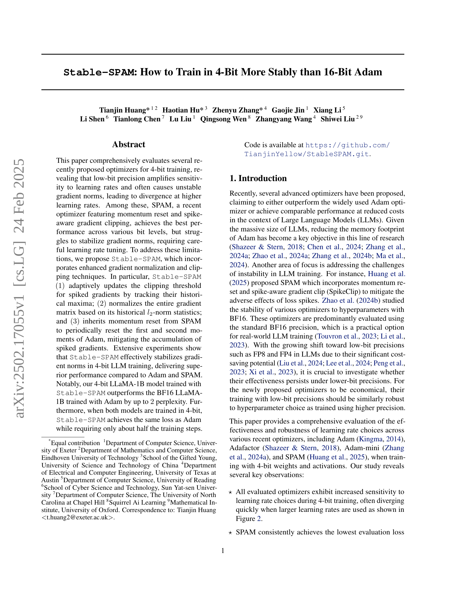
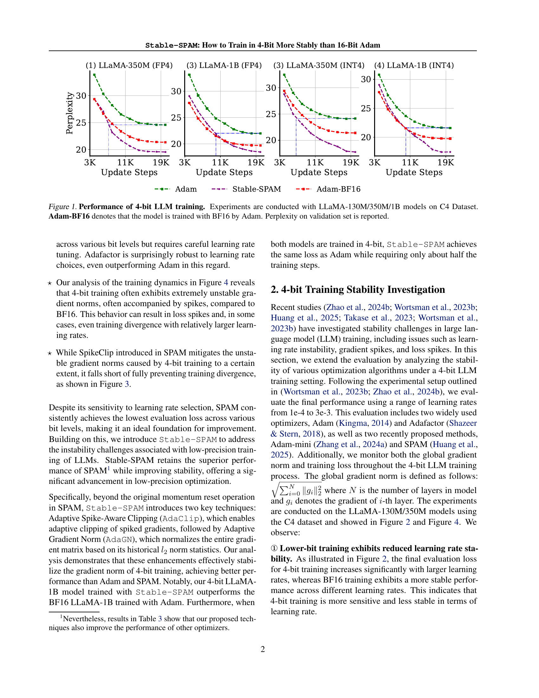
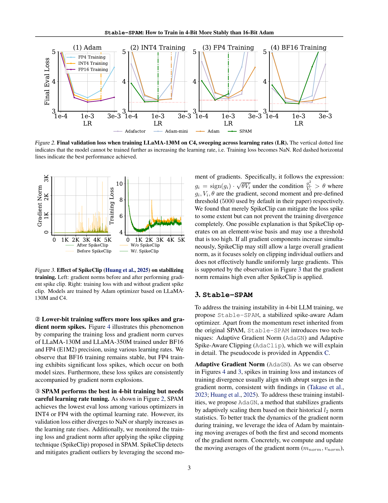
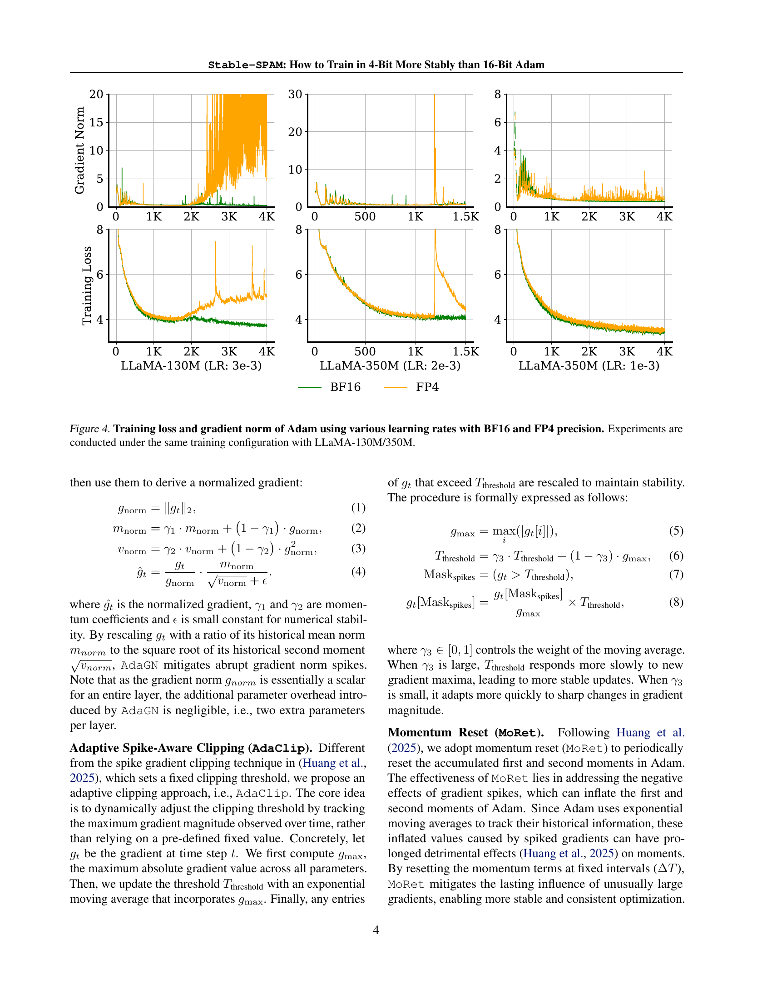
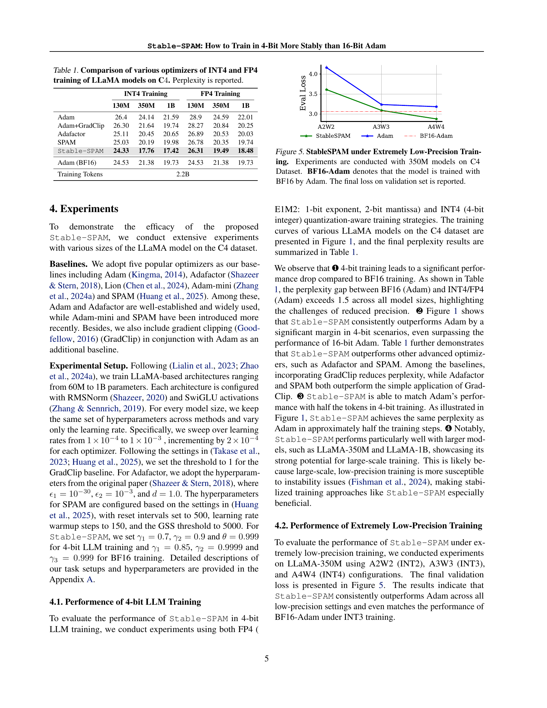
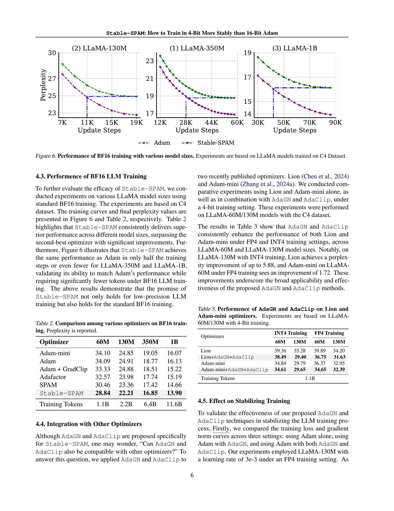
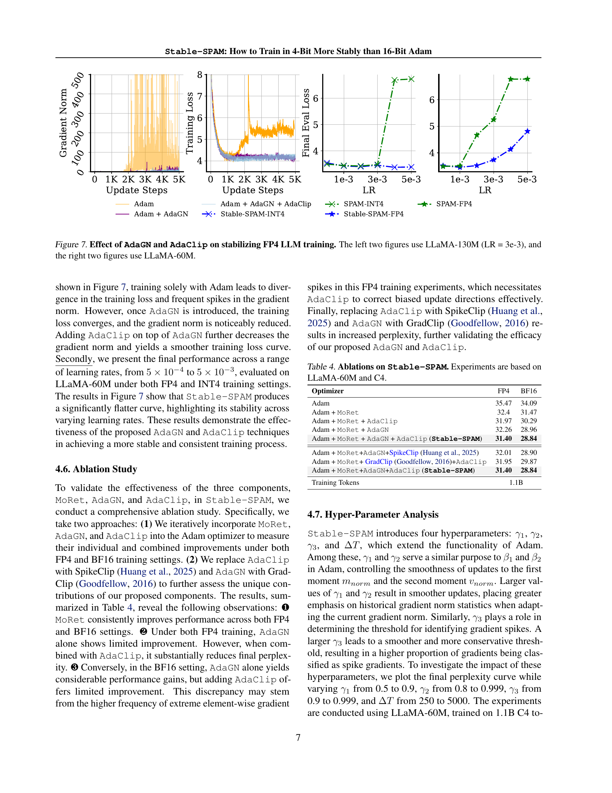
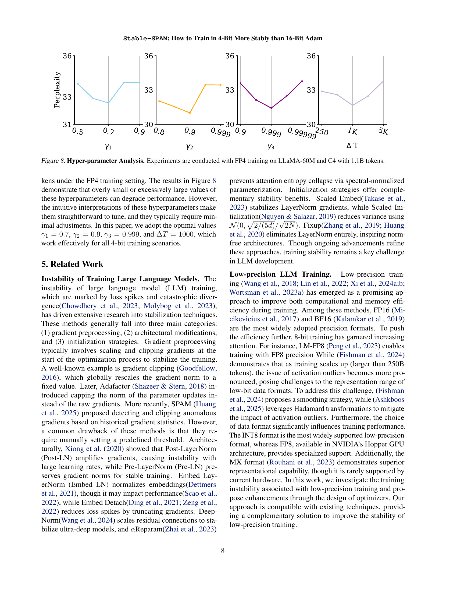
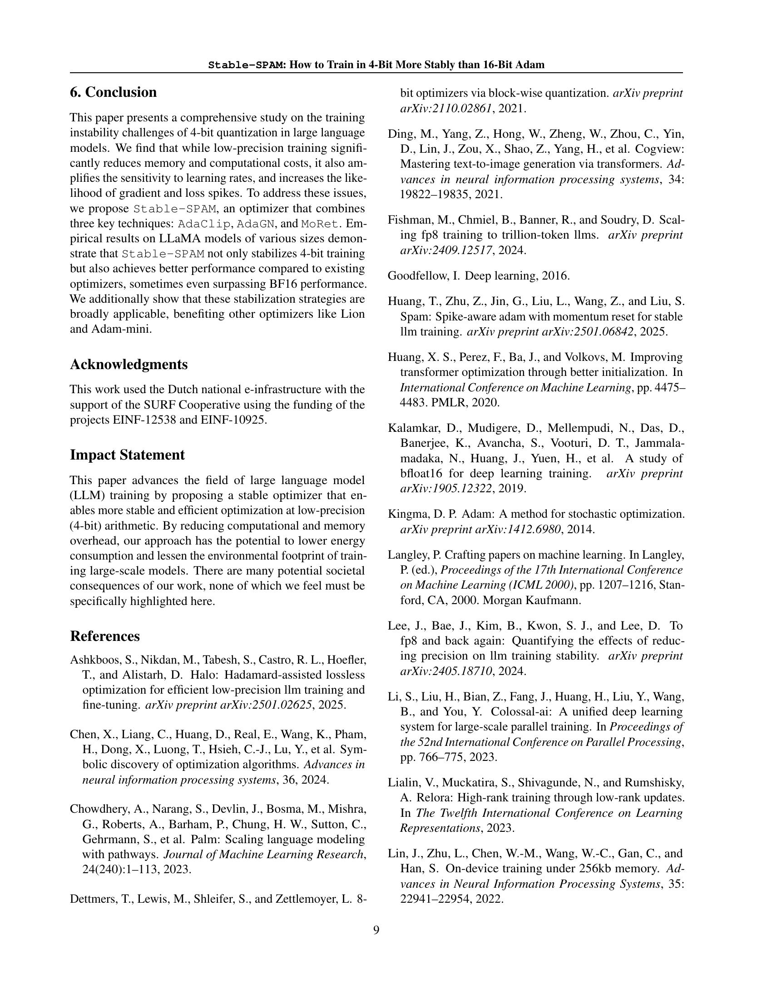
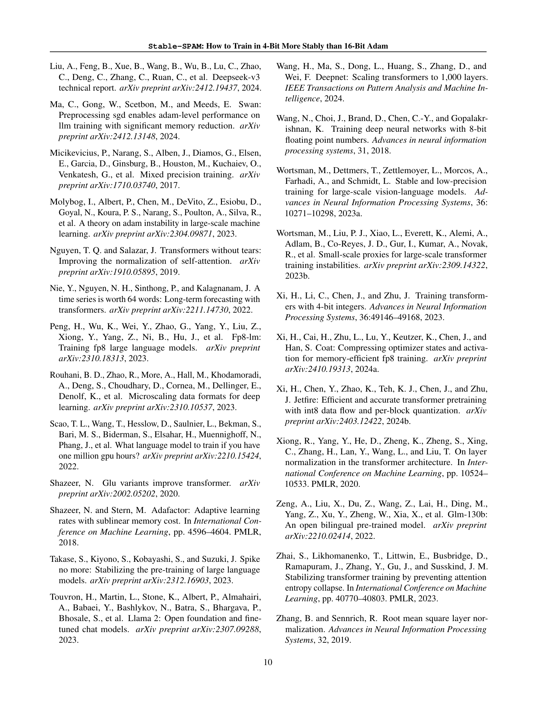
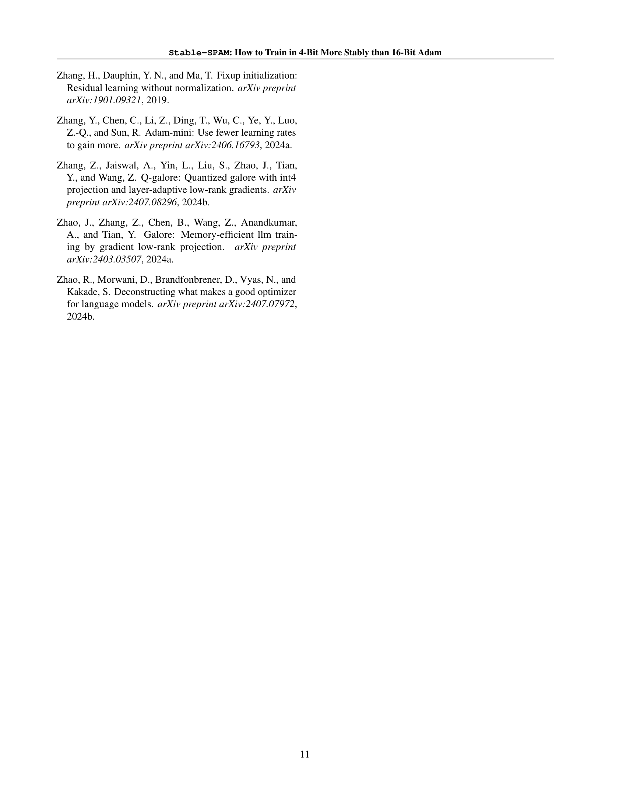
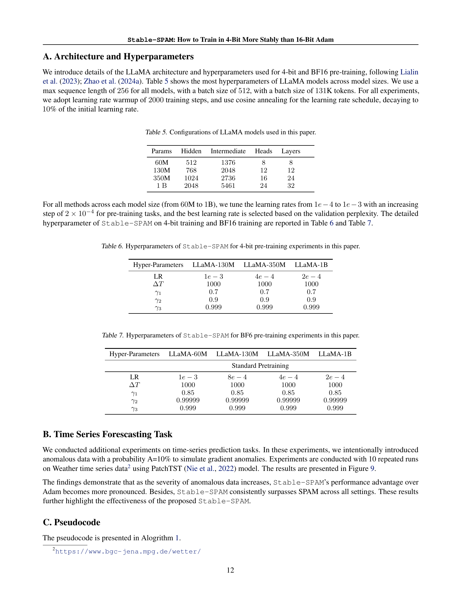
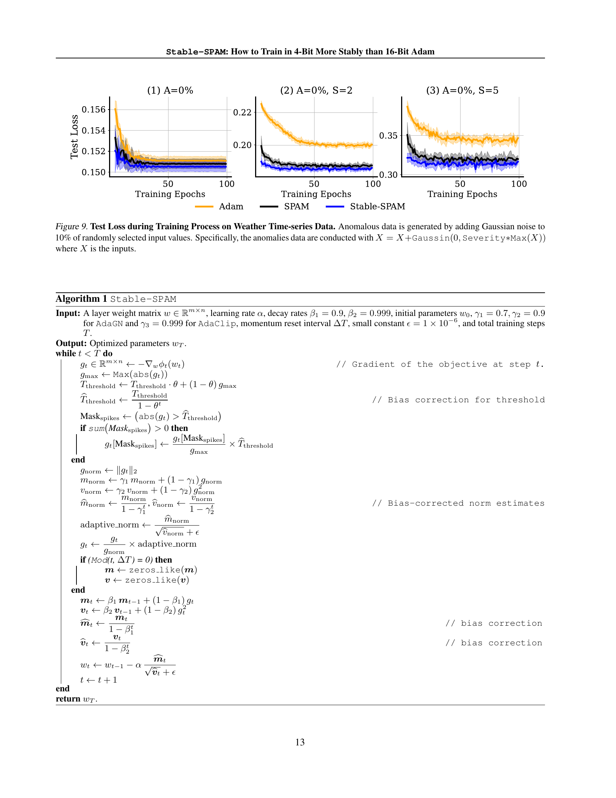
