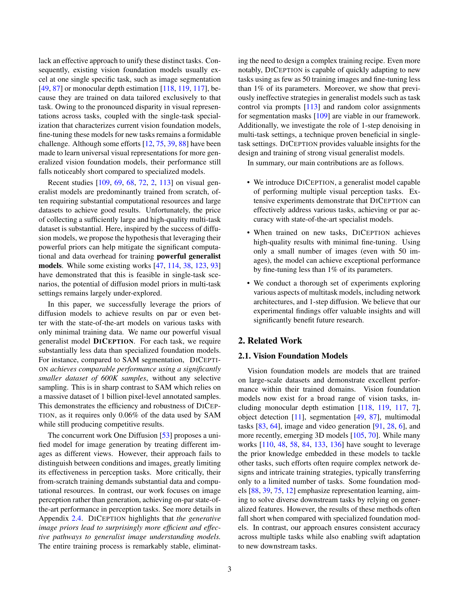

 


 2502.17157 
 Canyu Zhao et el. 
 
 🤗 2025-02-25 
 



↗ arXiv


↗ Hugging Face


↗ Papers with Code


### TL;DR



기존의 컴퓨터 비전 모델들은 특정 작업에만 특화되어 있어, **다양한 작업을 처리하는 데 어려움**을 겪고 있었습니다. 또한, 이러한 모델들을 새로운 작업에 적용하려면 많은 계산 자원과 데이터가 필요했습니다.  본 연구에서는 이러한 문제점을 해결하기 위해 **텍스트-이미지 확산 모델을 기반으로 한 DICEPTION이라는 일반화 모델**을 제시합니다.

DICEPTION은 **RGB 공간에 다양한 작업 표현을 통합**하고, **사전 훈련된 텍스트-이미지 모델의 사전 정보**를 활용하여 효율적으로 훈련될 수 있습니다. 실험 결과, DICEPTION은 다양한 작업에서 최첨단 모델과 비슷하거나 그 이상의 성능을 보였고, 소량의 데이터만으로도 새로운 작업에 빠르게 적응할 수 있음을 보여주었습니다. 이는 **계산 자원과 데이터 효율성을 높이는 획기적인 결과**입니다.



#### Key Takeaways


 DICEPTION은 제한된 계산 자원과 데이터로 여러 시각적 인식 작업을 효과적으로 처리합니다. 



 DICEPTION은 기존의 특정 작업 전문 모델과 비교하여 뛰어난 성능을 보이며, 소량의 데이터로도 새로운 작업에 빠르게 적응합니다. 



 본 연구는 확산 모델의 사전 정보를 활용하여 시각적 일반화 모델을 개발하는 새로운 접근 방식을 제시합니다. 


#### Why does it matter?
본 논문은 **다양한 시각적 인식 작업을 효율적으로 처리하는 일반적인 비전 모델을 개발**하는 데 중요합니다. 제한된 계산 자원과 훈련 데이터로 다중 작업을 처리하는 데 있어 기존의 특정 작업 전문 모델의 한계를 극복하는 접근 방식을 제시합니다. **확산 모델의 사전 정보를 활용**하여 이러한 어려움을 완화하는 방법을 보여줌으로써, 시각적 일반화 모델에 대한 새로운 가능성과 **향후 연구 방향**을 제시합니다.

------
#### Visual Insights

> 🔼 그림 1은 DiCeption 모델의 다양한 기능을 보여줍니다.  단일 모델로, 작업별 모듈 없이도 여러 시각적 인식 작업(행 1~3)을 수행합니다. 빨간 점은 점 기반 분할에 사용된 입력 점을 나타냅니다. DiCeption은 머리카락과 같은 세부적인 부분까지도 정확하게 분할하고(행 4), 자세 추정 및 의미 분할 작업(행 5, 6)도 지원합니다. 또한, 매개변수의 1% 미만만 미세 조정하여 50개의 이미지만으로도 새로운 작업에 빠르게 적응할 수 있습니다(행 7). 부록의 그림 S1~S14에 추가적인 시각자료가 있습니다.
> 

> 
read the caption

> Figure 1:  With one single model, DiCeption solves multiple tasks without relying on any task-specific modules (rows 1 to 3). The red dots in the figure indicate the input points used for point-prompted segmentation. DiCeption preserves fine details in segmentation, such as hair (row 4). DiCeption supports both human pose estimation and semantic segmentation (row 5, 6). DiCeption can quickly adapt to new tasks by fine-tuning less than 1% of its parameters on as few as 50 images (row 7). For additional visualizations, please refer to Figures S1, S2, S4, S6, S7, S8, S9, S10, S11, S12, S13, S14 in the Appendix.
> 


| Method | Training | KITTI [32] |  | NYUv2 [74] |  | ScanNet [23] |  | DIODE [102] |  | ETH3D [92] |  |
|---|---|---|---|---|---|---|---|---|---|---|---| 
| MiDaS [86] | 2M | 0.236 | 0.630 | 0.111 | 0.885 | 0.121 | 0.846 | 0.332 | 0.715 | 0.184 | 0.752 |
| Omnidata [27] | 12.2M | 0.149 | 0.835 | 0.074 | 0.945 | 0.075 | 0.936 | 0.339 | 0.742 | 0.166 | 0.778 |
| DPT-large [85] | 1.4M | 0.100 | 0.901 | 0.098 | 0.903 | 0.082 | 0.934 | 0.182 | 0.758 | 0.078 | 0.946 |
| DepthAnything† [118] | 63.5M | 0.080 | 0.946 | 0.043 | 0.980 | 0.043 | 0.981 | 0.261 | 0.759 | 0.058 | **0.984** |
| DepthAnything v2† [119] | 62.6M | 0.080 | 0.943 | 0.043 | 0.979 | 0.042 | 0.979 | 0.321 | 0.758 | 0.066 | 0.983 |
| Depth Pro† [7] | - | 0.055 | 0.974 | 0.042 | 0.977 | 0.041 | 0.978 | 0.217 | 0.764 | 0.043 | 0.974 |
| Metric3D v2† [43] | 16M | **0.052** | **0.979** | **0.039** | **0.979** | **0.023** | **0.989** | **0.147** | **0.892** | **0.040** | 0.983 |
| DiverseDepth [125] | 320K | 0.190 | 0.704 | 0.117 | 0.875 | 0.109 | 0.882 | 0.376 | 0.631 | 0.228 | 0.694 |
| LeReS [126] | 354K | 0.149 | 0.784 | 0.090 | 0.916 | 0.091 | 0.917 | 0.271 | 0.766 | 0.171 | 0.777 |
| HDN [128] | 300K | 0.115 | 0.867 | 0.069 | 0.948 | 0.080 | 0.939 | 0.246 | 0.780 | 0.121 | 0.833 |
| GeoWizard [31] | 280K | 0.097 | 0.921 | 0.052 | 0.966 | 0.061 | 0.953 | 0.297 | 0.792 | 0.064 | 0.961 |
| DepthFM [33] | 63K | 0.083 | 0.934 | 0.065 | 0.956 | - | - | 0.225 | 0.800 | - | - |
| Marigold† [47] | 74K | 0.099 | 0.916 | 0.055 | 0.964 | 0.064 | 0.951 | 0.308 | 0.773 | 0.065 | 0.960 |
| DMP Official† [54] | - | 0.240 | 0.622 | 0.109 | 0.891 | 0.146 | 0.814 | 0.361 | 0.706 | 0.128 | 0.857 |
| GeoWizard† [31] | 280K | 0.129 | 0.851 | 0.059 | 0.959 | 0.066 | 0.953 | 0.328 | 0.753 | 0.077 | 0.940 |
| DepthFM† [33] | 63K | 0.174 | 0.718 | 0.082 | 0.932 | 0.095 | 0.903 | 0.334 | 0.729 | 0.101 | 0.902 |
| Genpercept† [114] | 90K | 0.094 | 0.923 | 0.091 | 0.932 | 0.056 | 0.965 | 0.302 | 0.767 | 0.066 | 0.957 |
| Painter† [109] | 24K | 0.324 | 0.393 | **0.046** | **0.979** | 0.083 | 0.927 | 0.342 | 0.534 | 0.203 | 0.644 |
| Unified-IO† [69] | 48K | 0.188 | 0.699 | 0.059 | 0.970 | **0.063** | **0.965** | 0.369 | 0.906 | 0.103 | 0.906 |
| 4M-XL† [72] | 759M | 0.105 | 0.896 | 0.068 | 0.951 | 0.065 | 0.955 | 0.331 | 0.734 | 0.070 | 0.953 |
| OneDiffusion† [53] | 500K | 0.101 | 0.908 | 0.087 | 0.924 | 0.094 | 0.906 | 0.399 | 0.661 | 0.072 | 0.949 |
| Ours-single† | 500K | 0.081 | 0.942 | 0.068 | 0.949 | 0.078 | 0.945 | 0.267 | 0.709 | 0.059 | 0.969 |
| Ours† | 500K | 0.075 | 0.945 | 0.072 | 0.939 | 0.075 | 0.938 | 0.243 | 0.741 | 0.053 | **0.967** |

> 🔼 표 1은 제로샷 데이터셋에서 전문 모델과 다중 작업 모델 모두를 사용하여 깊이 추정을 정량적으로 비교한 것입니다.  본 논문에서 제안하는 DICEPTION 모델은 최첨단 모델들과 동등한 성능을 보여줍니다. Genpercept [114]와 동일한 평가 프로토콜(†)을 사용했습니다. 이 표는 다양한 모델들의 깊이 추정 정확도를 객관적인 지표(AbsRel, δ1, ...)로 비교하여 DICEPTION의 성능을 보여줍니다.  각 모델의 학습 데이터 크기와 성능 지표를 함께 제시하여 DICEPTION의 효율성과 경쟁력을 강조합니다.
> 

> 
read the caption

> Table 1: Quantitative comparison of depth estimation with both specialized models and multi-task models on zero-shot datasets. Our visual generalist model can perform on par with state-of-the-art models. We use the same evaluation protocal (††\dagger†) as Genpercept [114].
> 

### In-depth insights

#### Visual Generalist Models
시각적 일반화 모델은 다양한 시각적 인식 작업에 대해 우수한 성능을 달성하는 것을 목표로 합니다. 이는 **단일 모델** 내에서 여러 작업을 처리하여 효율성을 높이고 **전문화된 모델**의 필요성을 줄이는 데 도움이 됩니다.  **전이 학습**을 통해 사전 훈련된 모델의 지식을 활용하고 새로운 작업에 대한 미세 조정을 통해 적응력을 향상시키는 것이 중요합니다. 그러나 **데이터 불균형** 및 **작업 간 표현 차이**와 같은 과제는 여전히 해결해야 할 문제입니다.  **데이터 효율성**은 시각적 일반화 모델 개발의 핵심으로, 제한된 데이터로도 우수한 성능을 달성하는 방법에 대한 연구가 필요합니다.  또한 **모델의 일반화 능력**을 평가하기 위한 엄격한 평가 기준 개발도 중요합니다.  **다중 작업 학습** 전략의 효과적인 설계와 **모델 아키텍처**의 선택도 모델 성능에 큰 영향을 미칩니다.

#### Diffusion Model Priors
본 논문에서 다루는 "확산 모델 사전(Diffusion Model Priors)"은 **이미지 생성 과정에서 학습된 확산 모델의 내재적 지식**을 의미합니다.  **방대한 데이터셋을 통해 사전 훈련된 확산 모델은 이미지의 통계적 특징과 구조에 대한 풍부한 정보**를 가지고 있습니다.  이러한 사전 지식을 활용하면, 다양한 시각적 인식 작업을 수행하는 새로운 모델을 효율적으로 학습시킬 수 있습니다.  **기존의 방식처럼 처음부터 모델을 학습하는 대신, 이미 학습된 확산 모델의 사전 지식을 활용하여 제한된 계산 자원과 데이터로도 우수한 성능**을 달성할 수 있습니다.  이는 **데이터 효율성과 계산 효율성을 높이는 핵심 요소**가 됩니다.  **본 논문은 이러한 확산 모델 사전의 장점을 활용하여 다양한 시각적 인식 작업을 수행하는 일반적인 모델을 제시**함으로써, 컴퓨터 비전 분야의 발전에 크게 기여하고 있습니다.

#### RGB Task Unification
본 논문에서 제안하는 "RGB 작업 통합"은 다양한 컴퓨터 비전 작업들을 RGB 색 공간 내에서 통합적으로 표현하고 처리하는 방식입니다. 이는 **기존의 개별적인 작업별 모델 학습 대신, 하나의 모델로 여러 작업을 효율적으로 수행**할 수 있게 해주는 핵심 아이디어입니다. 이를 통해 **데이터 효율성을 높이고, 계산 비용을 절감하며, 모델의 일반화 성능을 향상**시키는 효과를 기대할 수 있습니다.  **RGB 색 공간을 활용**함으로써, 다양한 작업의 출력물(예: 깊이맵, 법선맵, 분할 마스크)을 일관된 형태로 표현하고, 기존의 사전 학습된 이미지 생성 모델의 지식을 활용하여 효과적인 작업 통합을 가능하게 합니다.  **단일 모델 내에서 여러 작업을 처리**함으로써, 모델의 복잡성을 줄이고, 새로운 작업에 대한 적응력을 높일 수 있습니다.  하지만, **RGB 통합 방식은 모든 컴퓨터 비전 작업에 적용 가능한 것은 아니며, 작업 간의 차이를 RGB로 효과적으로 표현하는 데 어려움**이 있을 수 있습니다.  따라서, **RGB 작업 통합의 성공 여부는 작업 특성과 RGB 표현의 적절성에 크게 좌우**됩니다.

#### Few-Shot Adaptation
본 논문에서 제시된 모델은 **소량의 데이터만으로도 새로운 작업에 빠르게 적응**할 수 있는 능력을 보여줍니다. 기존의 전문 모델들과 달리, **매우 적은 수의 이미지(50장 미만)와 전체 매개변수의 1% 미만만 미세 조정**하여 높은 성능을 달성합니다. 이는 **매개변수 효율성** 측면에서 혁신적인 결과이며, 다양한 시각적 인식 작업에 대한 **범용성**을 높입니다.  **기존의 방식처럼 복잡한 네트워크 구조나 훈련 과정 없이도 효과적으로 적응**하는 점은, 자원 제약이 있는 환경에서도 범용 시각 모델을 구축할 수 있는 가능성을 보여줍니다.  **전이 학습 능력의 우수성**이 강조되며, 이는 **새로운 작업에 대한 적응력**을 높이는 중요한 요소임을 시사합니다.

#### One-Step Inference
본 논문에서 "원스텝 추론(One-Step Inference)"은 확산 모델 기반의 시각적 다중 작업 모델에서 **단일 단계의 잡음 제거**를 통해 여러 작업을 수행하는 접근 방식을 의미합니다.  이 방법은 기존의 다중 단계 접근 방식보다 속도와 정확도 측면에서 이점을 제공할 것으로 기대되었으나, **다중 작업 환경에서는 오히려 실패율 증가**라는 예상치 못한 결과를 초래했습니다.  이는 각 작업에 대한 잡음 제거 경로가 서로 간섭하여 성능 저하를 야기하기 때문입니다.  **단일 작업에서는 효과적이지만 다중 작업에서는 비효율적**임을 보여주는 대조적인 결과는 다중 작업 모델 설계 시 고려해야 할 중요한 사항을 시사합니다.  따라서 다중 작업 모델의 효율적인 설계를 위해서는 **다중 단계 잡음 제거**를 고려해야 할 필요성을 제시하며, 이는 향후 연구를 위한 중요한 방향을 제시합니다.

### More visual insights

More on figures

> 🔼 그림 2는 DICEPTION 모델과 SAM-vit-h 모델의 mIoU(Mean Intersection over Union) 성능을 비교한 막대 그래프입니다. DICEPTION 모델은 SAM-vit-h 모델보다 훨씬 적은 데이터(60만개 대 10억개)를 사용했음에도 불구하고, SAM-vit-h 모델과 유사한 성능을 달성했습니다.  이를 통해 DICEPTION 모델의 데이터 효율성이 매우 높다는 것을 보여줍니다.  막대 그래프는 다양한 데이터셋에 대한 DICEPTION과 SAM-vit-h의 mIoU 값 차이를 시각적으로 보여줍니다.  일부 데이터셋에서는 DICEPTION이 SAM-vit-h보다 더 높은 mIoU 값을 보여주기도 합니다.
> 

> 
read the caption

> Figure 2:  Comparisons of mIoU with SAM-vit-h. We achieve results on par with SAM using only 0.06% of their data (600K vs.  1B).
> 

> 🔼 그림 3은 23개의 검증 데이터셋에서 1-point 및 5-point 분할 방법의 mIoU(Mean Intersection over Union)를 비교한 결과를 보여줍니다.  간단히 말해, 점을 이용한 이미지 분할에서 점의 개수가 많을수록(5-point) 정확도가 향상됨을 시각적으로 보여줍니다.  이 그림은 DICEPTION 모델의 성능을 평가하는 실험 결과 중 하나로, 특히 point-prompted segmentation(점 기반 분할) 작업의 정확도에 점의 개수가 미치는 영향을 분석한 것입니다.
> 

> 
read the caption

> Figure 3:  Comparisons between 1-point and 5-point segmentation of mIoU on all 23 validation datasets.
> 

> 🔼 그림 S1은 DICEPTION 모델의 다양한 시각적 인식 작업 처리 능력을 보여주는 추가 시각 자료입니다. 하나의 모델로 깊이 추정, 표면 법선 추정, 점 프롬프트 분할, 포즈 추정, 개체 분할 및 의미 분할 등 여러 작업을 수행할 수 있음을 보여줍니다. 각 작업에 대한 입력 이미지와 해당 모델의 출력 결과를 비교하여 모델의 성능을 시각적으로 확인할 수 있습니다. 이 그림은 DICEPTION 모델이 다양한 시각적 인식 작업에 대해 우수한 일반화 성능을 가지고 있음을 강조합니다.
> 

> 
read the caption

> Figure S1:  Additional visualizations. Our one single model tackles multiple perception tasks.
> 

> 🔼 그림 S2는 털이 많은 사물에 대한 DICEPTION 모델의 분할 결과를 보여줍니다.  다양한 종류의 털이 많은 동물들(고양이, 강아지, 라마 등)과 사람 머리카락의 이미지에 대해 DICEPTION 모델이 어떻게 분할 마스크를 생성하는지 보여주는 여러 개의 이미지가 포함되어 있습니다. 이 그림은 DICEPTION 모델의 분할 성능이 털이 많은 복잡한 질감을 가진 물체에도 효과적임을 시각적으로 보여주는 역할을 합니다. 특히, 털의 경계선을 명확하게 구분하는 능력을 확인할 수 있습니다.
> 

> 
read the caption

> Figure S2:  Segmentation results on furry objects.
> 

> 🔼 그림 S3은 RGB 마스크 후처리 과정에서 작은 영역과 과도한 개체 수가 성능 저하로 이어지는 현상을 보여줍니다.  작은 영역은 노이즈로 간주되어 제거될 수 있고, 개체 수가 많으면 유사한 색상의 개체들이 잘못 그룹핑될 수 있습니다. 이는 특히 사람이나 새와 같이 작은 개체들과 여러 개체가 밀집된 이미지에서 문제가 됩니다. 결과적으로 정확도가 떨어지는 것을 보여줍니다.  특히, semantic segmentation에서 '사람' 과 같은 카테고리에서 이런 문제가 두드러집니다.
> 

> 
read the caption

> Figure S3:  When post-processing RGB masks, small regions and excessive numbers of objects lead to significant metric degradation.
> 

> 🔼 그림 S4는 이미지 하이라이팅에 대한 추가적인 몇 샷 미세 조정 결과를 보여줍니다.  이 그림은 DICEPTION 모델이 적은 양의 데이터로 새로운 작업에 빠르게 적응할 수 있음을 보여주는 추가적인 증거를 제공합니다.  구체적으로, 이미지 하이라이팅 작업에 대한 몇 샷 미세 조정 결과를 시각적으로 보여주는 여러 이미지 예시가 포함되어 있습니다. 이를 통해 모델의 효율성과 새로운 작업에 대한 적응력을 더 잘 이해할 수 있습니다.
> 

> 
read the caption

> Figure S4:  Additional few-shot fine-tuning results on image highlighting.
> 

> 🔼 그림 S5는 DICEPTION과 One Diffusion 모델의 세그멘테이션 결과를 비교하여 보여줍니다. DICEPTION은 의미적으로 동일한 객체뿐 아니라 동일한 범주 내의 여러 개체를 구별하여 더 높은 세그멘테이션 품질을 달성합니다. 반면에 One Diffusion은 이미지 이해 작업을 수행할 때 입력 이미지와 유사한 이미지를 생성하는 경향이 있으며, 이는 그림에서 빨간색으로 강조 표시된 부분에서 확인할 수 있습니다.
> 

> 
read the caption

> Figure S5:  Our segmentation not only separates semantically identical objects but also distinguishes different instances of the same category, achieving higher segmentation quality. Moreover, One Diffusion tends to generate an image similar to the input when performing image understanding tasks, as red-highlighted in the figure.
> 

> 🔼 그림 S6은 DICEPTION 모델의 적응력을 보여주는 추가적인 몇몇 예시를 보여줍니다.  폐 분할과 종양 분할 작업에 대한 소량의 데이터(50개 이미지 미만)만으로도 DICEPTION 모델이 우수한 성능을 보임을 보여줍니다.  이 그림은 논문의 4장 실험 부분에서  새로운 작업에 대한 DICEPTION 모델의 빠른 적응 능력을 강조하기 위해 사용됩니다.  각 이미지는 입력 이미지와 모델의 예측 결과, 그리고 실제 정답 마스크를 보여줍니다.
> 

> 
read the caption

> Figure S6:  Additional few-shot fine-tuning results on lung segmentation and tumor segmentation.
> 

> 🔼 그림 S7은 DICEPTION 모델이 다양한 이미지에 대해 정확하게 깊이를 추정하는 것을 보여주는 추가적인 시각 자료입니다. 다양한 환경과 물체를 포함하는 여러 이미지에 대한 깊이 추정 결과가 열거되어 있으며, 각 이미지의 깊이 정보를 색상으로 표현하여 시각적으로 명확하게 보여줍니다. 이를 통해 DICEPTION 모델이 다양한 시각적 과제에 대해 얼마나 잘 일반화되는지 보여줍니다.
> 

> 
read the caption

> Figure S7:  Additional depth estimation visualizations.
> 

> 🔼 그림 S8은 추가적인 표면 법선 시각화 결과를 보여줍니다. 다양한 물체의 표면 법선을 시각화하여 DICEPTION 모델이 다양한 시각적 인식 작업에 대해 얼마나 정확하게 표면 법선을 예측하는지 보여줍니다. 각 이미지는 입력 이미지와 예측된 표면 법선을 함께 표시합니다.
> 

> 
read the caption

> Figure S8:  Additional normal visualizations.
> 

> 🔼 그림 S9는 추가적인 개체 분할 시각화 결과를 보여줍니다. 다양한 이미지에서 개체들을 다채로운 색상으로 구분하여 표시함으로써, DICEPTION 모델이 개체를 정확하게 식별하고 분할하는 능력을 시각적으로 보여줍니다. 각 이미지는 개체들의 경계가 명확하게 구분되어 있으며, 모델이 복잡한 배경에서도 개체들을 효과적으로 분할하는 것을 확인할 수 있습니다.
> 

> 
read the caption

> Figure S9:  Additional entity segmentation visualizations.
> 

> 🔼 그림 S10은 논문의 추가적인 점 기반 프롬프트 분할 시각화 결과를 보여줍니다.  점 기반 프롬프트 분할은 사용자가 이미지의 특정 지점을 지정하여 해당 지점을 중심으로 한 영역을 분할하는 기법입니다. 이 그림에서는 다양한 이미지에 대해 점 기반 프롬프트 분할을 적용한 결과를 보여주며, 모델이 입력된 점 정보를 바탕으로 정확하게 객체를 분할하는 능력을 시각적으로 확인할 수 있습니다. 다양한 종류의 이미지와 분할 결과를 통해 모델의 일반화 성능과 강건성을 평가하는 데 도움이 됩니다.
> 

> 
read the caption

> Figure S10:  Additional point-prompted segmentation visualizations.
> 

> 🔼 그림 S11은 DiCeption과 SAM-vit-h 모델이 1개의 점 입력을 사용하여 이미지 분할 작업을 수행한 결과를 비교한 것입니다.  DiCeption과 SAM-vit-h 모두 점 정보를 기반으로 객체를 정확하게 분할하는 능력을 보여주지만, 각 모델의 성능 차이와 강점/약점을 시각적으로 비교하여, 두 모델의 분할 결과의 유사점과 차이점을 보여줍니다. 특히, 어려운 경우(예: 작은 객체, 모호한 경계)에서 각 모델의 성능을 비교하여 분석합니다.
> 

> 
read the caption

> Figure S11:  Comparison of the segmentation results between DiCeption and SAM-vit-h with 1-point input.
> 

> 🔼 본 그림(Figure S12)은 DiCeption과 SAM-vit-h 모델의 5-point 입력에 대한 분할 결과를 비교한 것입니다. DiCeption과 SAM-vit-h 모두 5개의 점을 입력받아 이미지 내의 객체를 분할하는데, 두 모델의 성능 차이와 강점, 약점을 시각적으로 보여줍니다. 특히, 다양한 유형의 이미지와 복잡한 배경에서의 분할 결과를 비교함으로써 각 모델의 일반화 능력과 정확도를 평가할 수 있습니다. 그림을 통해 각 모델의 분할 경계선의 정확성, 세부 묘사 능력, 그리고 다양한 객체에 대한 적응력을 비교 분석할 수 있습니다.
> 

> 
read the caption

> Figure S12:  Comparison of the segmentation results between DiCeption and SAM-vit-h with 5-point input.
> 

> 🔼 그림 S13은 논문에서 제시된 DICEPTION 모델이 다양한 자세 추정 작업에 대해 생성한 결과를 보여줍니다. 여러가지 배경과 다양한 사람들의 자세(스키, 골프, 서핑 등)를 포함한 다양한 이미지에 대해 정확하게 사람의 관절 위치를 예측하는 것을 보여줍니다. 이는 DICEPTION 모델의 강건성과 다양한 시각적 과제에 대한 적응력을 보여주는 시각적 증거입니다.
> 

> 
read the caption

> Figure S13:  Additional pose estimation visualizations.
> 

> 🔼 그림 S14는 추가적인 의미론적 분할 시각화를 보여줍니다. 이 그림은 DICEPTION 모델이 다양한 이미지에서 다양한 의미론적 범주를 정확하게 분할할 수 있는 능력을 보여줍니다. 각 이미지는 입력 이미지와 해당 이미지에 대한 의미론적 분할 마스크를 보여줍니다. 이 그림은 DICEPTION 모델의 강력한 성능과 일반화 능력을 강조합니다.  다양한 물체(예: 와인잔, 오렌지, 바나나, 곰, 양, 피자, 의자, 사람, 브로콜리, 넥타이, 여행 가방)가 정확하게 구분되어 있습니다.
> 

> 
read the caption

> Figure S14:  Additional semantic segmentation visualizations.
> 

> 🔼 그림 S15는 1단계 추론을 사용했을 때 모델이 실패하는 경우가 더 많아지는 경향을 보여줍니다. 다중 작업 환경에서 여러 작업에 대한 잡음 제거 경로가 겹칠 가능성이 높아지면서 서로 간섭을 일으키고 실패를 유발할 수 있습니다. 반면에 다단계 잡음 제거는 이러한 상호 작용을 완화하는 데 도움이 되어 안정성과 효율성을 높입니다.
> 

> 
read the caption

> Figure S15:  The model tends to produce more failure cases in 1-step scenario.
> 

> 🔼 그림 S16은 UNet 기반 모델이 다중 작업을 수행하는 데 실패했음을 보여줍니다. 이는 UNet 아키텍처의 한계로 인해 발생합니다. UNet은 다운샘플링 과정에서 정보 손실이 발생하는 반면, 트랜스포머는 다중 작업 시나리오에서 더 나은 성능을 보여주는 포괄적인 표현을 유지합니다. 이 그림은 DICEPTION 모델이 트랜스포머 아키텍처를 사용하여 다중 작업에 효과적으로 대처할 수 있음을 강조하기 위해 제시되었습니다.
> 

> 
read the caption

> Figure S16:  A UNet-based model fails to perform multi-task.
> 

More on tables


Method | Training | NYUv2 [74] |  |  |  |  | ScanNet [23] |  |  |  |  | DIODE-indoor [102] |  |  |  |  |  
---|---|---|---|---|---|---|---|---|---|---|---|---|---|---|---|---
Samples | mean ↓ | med ↓ | 11.25° ↑ | 22.5° ↑ | 30° ↑ | mean ↓ | med ↓ | 11.25° ↑ | 22.5° ↑ | 30° ↑ | mean ↓ | med ↓ | 11.25° ↑ | 22.5° ↑ | 30° ↑
DINSE [3] | 160K | 18.572 | 10.845 | **54.732** | 74.146 | 80.256 | 18.610 | 9.885 | 56.132 | 76.944 | 82.606 | 18.453 | 13.871 | 36.274 | 77.527 | 86.976
Geowizard [31] | 280K | 20.363 | 11.898 | 46.954 | 73.787 | 80.804 | 19.748 | 9.702 | 58.427 | 77.616 | 81.575 | 19.371 | 15.408 | 30.551 | 75.426 | 86.357
GenPercept [114] | 90K | 20.896 | 11.516 | 50.712 | 73.037 | 79.216 | 18.600 | 8.293 | 64.697 | 79.329 | 82.978 | 18.348 | 13.367 | 39.178 | 79.819 | 88.551
Marigold [47] | 90K | 20.864 | 11.134 | 50.457 | 73.003 | 79.332 | 18.463 | 8.442 | 64.727 | 79.559 | 83.199 | 16.671 | 12.084 | 45.776 | 82.076 | 89.879
StableNormal [123] | 250K | 19.707 | **10.527** | 53.042 | **75.889** | **81.723** | **17.248** | **8.057** | **66.655** | **81.134** | **84.632** | **13.701** | **9.460** | **63.447** | **86.309** | **92.107**
Unified-IO [68] | 210K | 28.547 | 14.637 | 39.907 | 63.912 | 71.240 | 17.955 | 10.269 | 54.120 | 77.617 | 83.728 | 31.576 | 16.615 | 27.855 | 64.973 | 73.445
4M-XL [72] | 759M | 37.278 | 13.661 | 44.660 | 60.553 | 65.327 | 30.700 | 11.614 | 48.743 | 68.867 | 73.623 | 18.189 | 12.979 | 36.622 | 81.844 | 87.050
Ours-single | 500K | 18.267 | 10.238 | 52.393 | 76.802 | 83.113 | 19.892 | 12.424 | 45.930 | 74.341 | 81.965 | 17.611 | 8.912 | 62.030 | 80.827 | 86.474
Ours | 500K | **18.302** | 10.538 | 52.533 | 75.977 | 82.573 | 19.348 | 12.129 | 46.410 | 74.805 | 82.176 | 17.946 | 8.686 | 62.641 | 81.152 | 85.398
> 🔼 표 2는 다양한 단일 작업 모델과 다중 작업 모델을 사용한 표면 노멀 추정 결과에 대한 정량적 비교를 보여줍니다. 모든 방법은 StableNormal [123]과 동일한 평가 프로토콜을 사용하여 평가되었습니다.  표에는 다양한 방법들의 평균 및 중앙값 오차, 그리고 11.25°, 22.5°, 30° 각도의 정확도를 나타내는 지표들이 NYUv2 [74], ScanNet [23], DIODE-indoor [102] 데이터셋에 대해 제시되어 있습니다. 이를 통해 DICEPTION 모델의 성능을 다른 최첨단 모델들과 비교하여  다중 작업 성능을 정량적으로 평가할 수 있습니다.
> 

> 
read the caption

> Table 2:  Quantitative comparison of surface normal estimation with both specialized models and multi-task models. All methods are evaluated with the same evaluation protocol of StableNormal [123].
> 


| Method | AR-small↑ | AR-medium↑ | AR-large↑ |
|---|---|---|---|
| EntityV2 [81] | **0.313** | **0.551** | **0.683** |
| Ours-single | 0.123 | 0.424 | 0.648 |
| Ours | 0.121 | 0.439 | 0.637 |
> 🔼 표 3은 MS COCO 검증 세트에서 개체 분할의 평균 재현율(AR)을 보여줍니다.  이 표는 DICEPTION 모델의 성능을 평가하기 위해 사용된 주요 지표 중 하나입니다.  AR은 다양한 크기의 개체(작은, 중간, 큰)에 대한 모델의 성능을 보여주는 세 가지 지표로 나뉩니다. 이를 통해 모델이 다양한 크기의 개체를 얼마나 정확하게 분할하는지에 대한 통찰력을 제공합니다.  단순히 전체 정확도만을 제시하는 것이 아니라, 개체의 크기에 따른 성능 차이를 보여줌으로써 모델의 강점과 약점을 더욱 자세히 분석할 수 있도록 합니다.
> 

> 
read the caption

> Table 3: Average recall (AR) of entity segmentation on the MS COCO validation set.
> 


|               | HRNet[96] | HRFormer[129] | ViTPose[115] | Painter[109] | Ours |
| :------------ | :--------: | :----------: | :---------: | :----------: | :----: |
| AP |    76.3    |     77.2     |     78.3     |     72.5     |  57.8  |
> 🔼 표 4는 MS COCO 데이터셋에서의 사람 자세 추정 성능을 보여줍니다.  각 모델의 평균 정확도(AP) 점수를 보여주어, DICEPTION 모델을 포함한 다양한 모델들의 사람 자세 추정 성능을 비교 분석하는 데 사용되었습니다.  특히, DICEPTION 모델의 성능을 기존의 다른 모델들과 비교하여 DICEPTION의 성능을 평가하는 데 활용되었습니다.
> 

> 
read the caption

> Table 4: Evaluation of human keypoints estimation on MS COCO.
> 


| Method | SparK [98] | OneFormer [44] | Mask2Former [18] | Ours |
|---|---|---|---|---|
| AP↑ | 45.1 | 49.2 | **50.1** | 33.2 |
> 🔼 표 5는 MS COCO 데이터셋(범주 ID 포함)을 사용하여 수행된 의미론적 분할(semantic segmentation) 평가 결과를 보여줍니다.  다양한 방법들의 성능을 정량적으로 비교하여 DICEPTION 모델의 의미론적 분할 성능을 평가합니다.  구체적으로는, 각 방법에 대한 평균 정밀도(Average Precision, AP) 점수를 범주별로 제시하여 DICEPTION 모델의 강점과 약점을 분석합니다.
> 

> 
read the caption

> Table 5: Evaluation of semantic segmentation on the MS COCO (with category ID).
> 


| Training |  |  |
|---|---|---|
| Task | Data Samples | Dataset |
| Depth | 500K | OpenImages [51] + Depth Pro [7] |
| Normal | 500K | OpenImages [51] + StableNormal [123] |
| Point Segmentation | 400K | SA-1B [49] |
| Point Segmentation | 200K | P3M-10K [55], AIM500 [57] and AM2K [56] |
| Human Pose | 42K | MS COCO 2017 [62] |
| Semantic Segmentation | 120K | COCO-Rem [94] |
| Entity Segmentation | 32K | EntityV2 [81] |
| Validation |  |  |
| Task |  | Dataset |
| Depth |  | NYUv2 [74], KITTI [32], ScanNet [23], DIODE [102], ETH3D [92] |
| Normal |  | NYUv2 [74], ScanNet [23], DIODE [102] |
| Point Segmentation |  | PPDLS [71], DOORS [79], TimberSeg [30], NDD20 [101] |
|  |  | STREETS [95], iShape [120], ADE20K [134], OVIS [80] |
|  |  | Plittersdorf [37], EgoHOS [131], IBD [15], WoodScape [127] |
|  |  | TrashCan [41], GTEA [29, 60], NDISPark [20, 19], VISOR [24, 25] |
|  |  | LVIS [36], Hypersim [90], Cityscapes [22], DRAM [21] |
|  |  | BBBC038v1 [10], ZeroWaste [5], PIDRay [103] |
| Entity Segmentation |  | MS COCO 2017 [62] |
| Semantic Segmentation |  | MS COCO 2017 [62] |
| Human Keypoints |  | MS COCO 2017 [62] |
> 🔼 표 S1은 논문에서 사용된 데이터셋에 대한 자세한 정보를 담고 있습니다. 데이터셋의 종류, 해당 데이터셋이 사용된 작업(과제), 그리고 각 작업에 사용된 데이터 샘플의 개수를 보여줍니다.  예를 들어, 깊이(Depth)와 표면 법선(Normal) 추정 작업에는 OpenImages 데이터셋에서 무작위로 선택한 50만 개의 이미지가 사용되었고, 점 프롬프트 세분화(Point Segmentation) 작업에는 SA-1B 데이터셋에서 40만 개의 이미지와 합성 이미지 20만 개가 사용되었습니다. 나머지 작업들(자세 추정, 의미론적 세분화, 개체 세분화 등)에도 각각 COCO, COCO-Rem, EntityV2 등의 데이터셋과 그에 따른 샘플 개수가 명시되어 있습니다.  검증(Validation) 부분에서는 각 과제별 사용된 데이터셋과 검증에 사용된 데이터 수를 확인할 수 있습니다.
> 

> 
read the caption

> Table S1: Dataset detail.
> 


| Category | AP ↑ | 
|---|---| 
| Bear | 76.3 | 
| Dog | 68.9 | 
| Cat | 71.7 | 
| Person | 18.6 | 
| Bird | 10.4 | 
| Book | 10.8 | 
> 🔼 표 S2는 RGB 마스크 후처리 과정에서 작은 영역과 과도한 개체 수가 성능 저하로 이어지는 현상을 보여줍니다.  작은 영역은 노이즈로 간주되어 제거될 수 있으며, 개체 수가 과다하면 유사한 색상의 개체들이 잘못 그룹핑될 수 있습니다. 이는 특히 사람이나 새처럼 작고 여러 개가 있는 개체의 경우 정밀도(AP)에 큰 영향을 미칩니다. 표는 다양한 범주(곰, 개, 고양이, 사람, 새, 책)에 대한 평균 정밀도를 보여주어 이러한 후처리 과정의 영향을 정량적으로 보여줍니다.
> 

> 
read the caption

> Table S2: When post-processing RGB masks, small regions and excessive numbers of objects significantly lead to performance degradation.
> 

### Full paper



