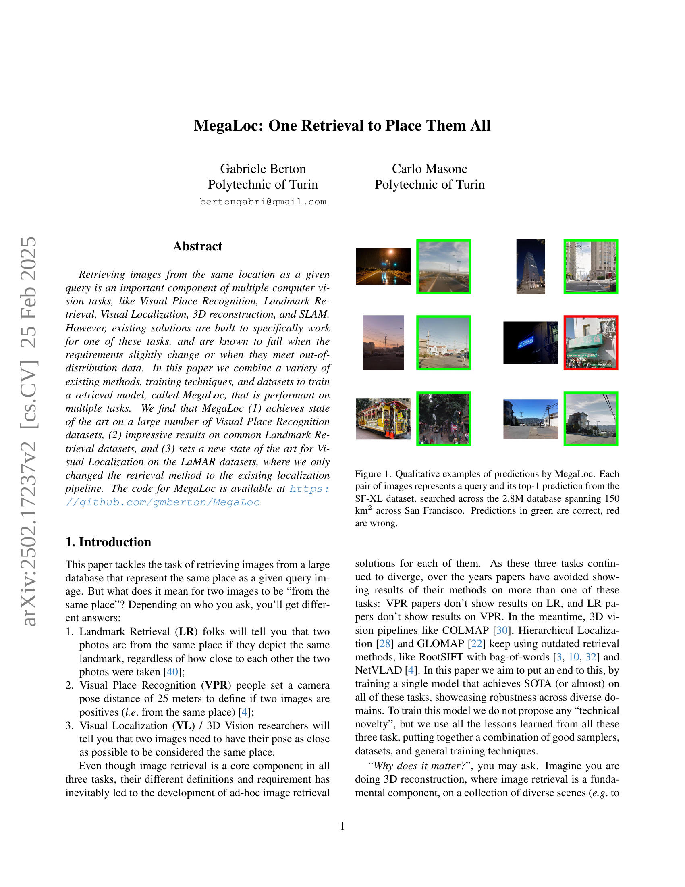
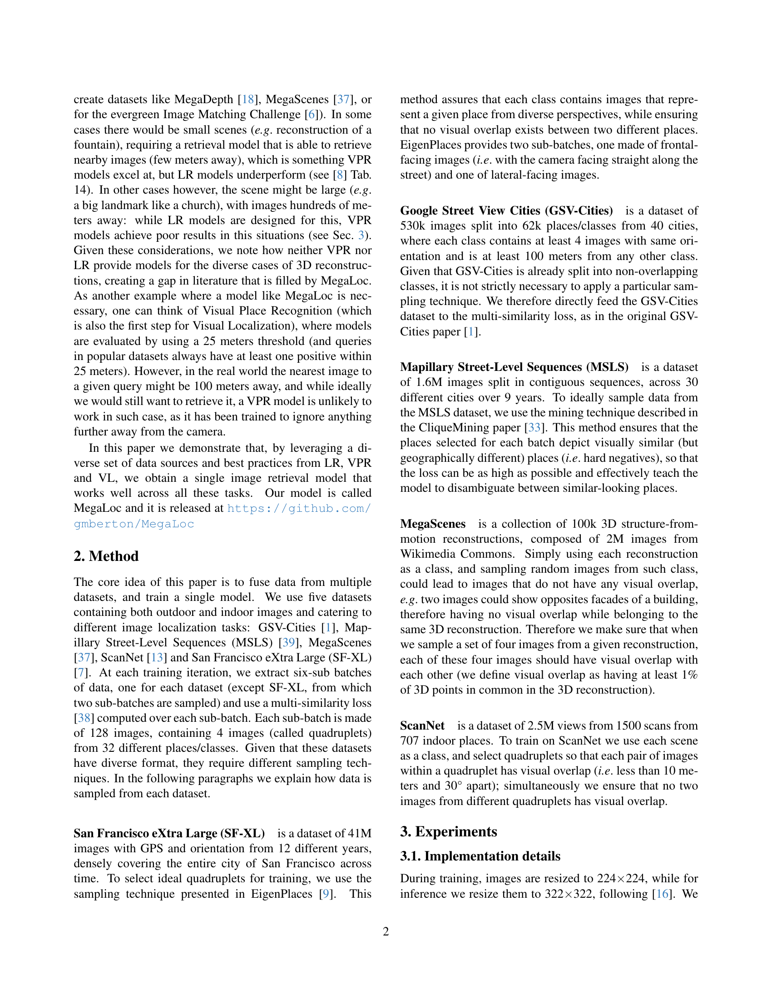
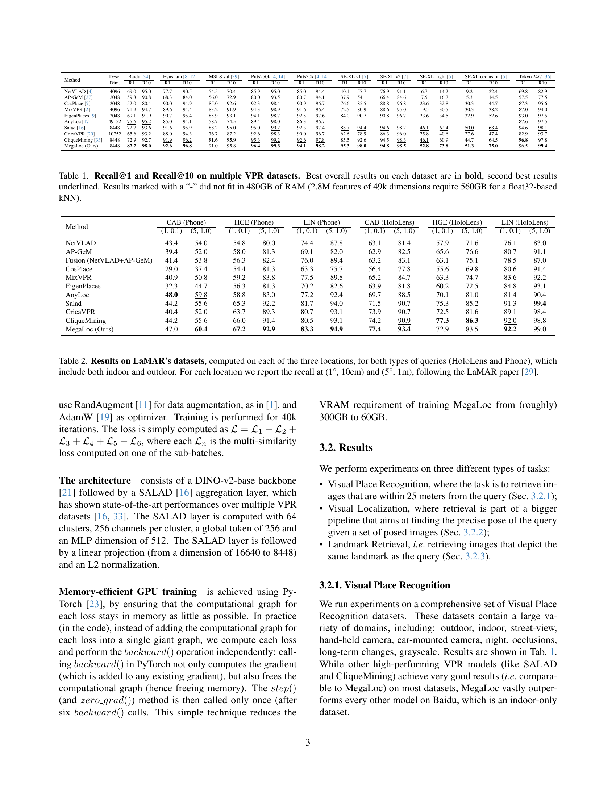
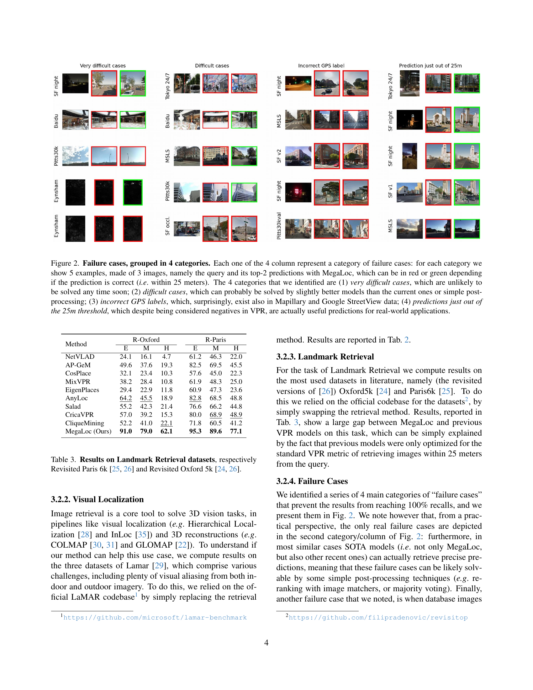
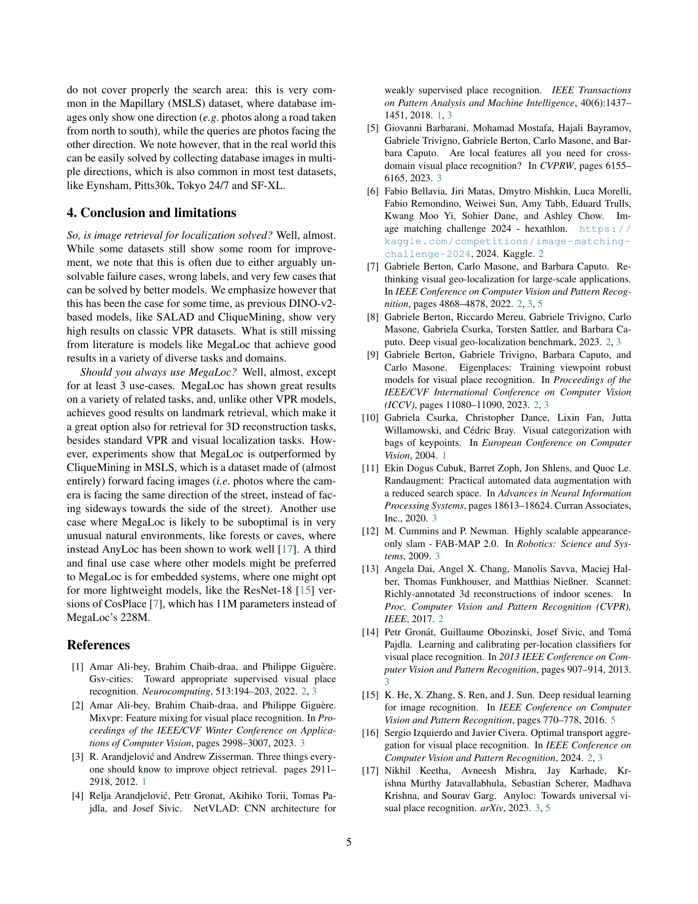
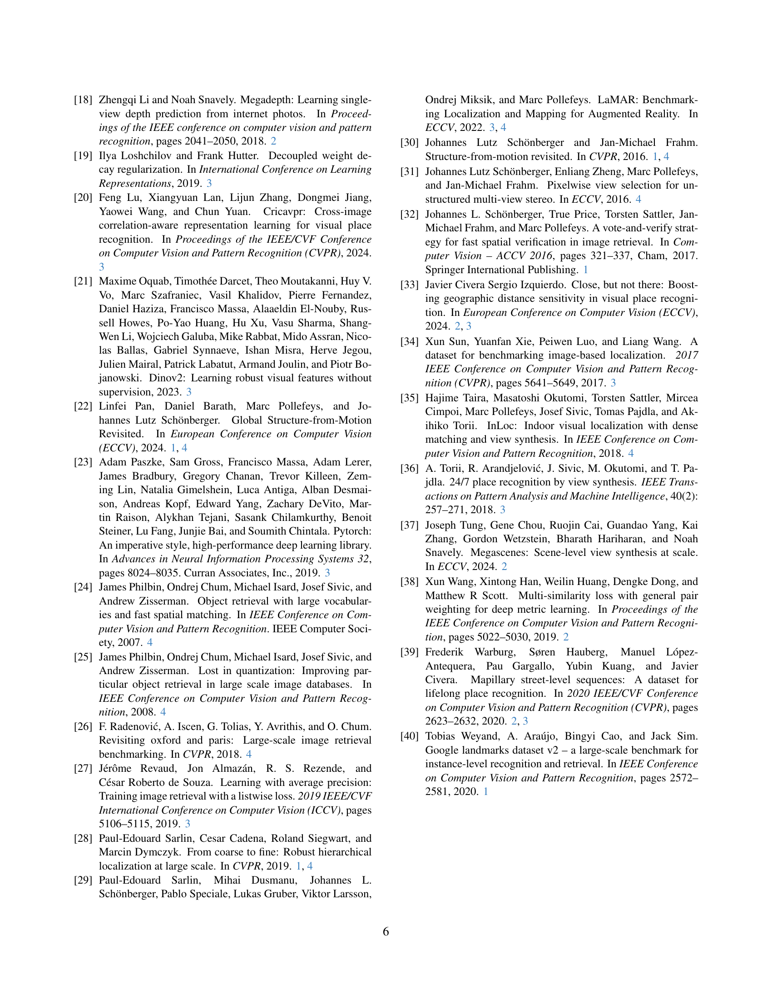

 


 2502.17237 
 Gabriele Berton et el. 
 
 🤗 2025-02-25 
 



↗ arXiv


↗ Hugging Face


↗ Papers with Code


### TL;DR



기존의 컴퓨터 비전 시스템은 시각적 위치 인식, 랜드마크 검색, 시각적 위치 확인 등의 작업을 각각 다른 모델로 수행해왔습니다. 이는 작업의 요구사항이 조금만 변하거나 분포 외 데이터를 만나면 성능이 저하되는 문제점을 가지고 있었습니다.  **본 논문에서는 이러한 문제점을 해결하기 위해 다양한 기존 방법, 학습 기법, 데이터셋을 결합하여 여러 작업에 모두 효과적인 단일 검색 모델 MegaLoc을 개발했습니다.**

**MegaLoc은 다양한 시각적 위치 인식 데이터셋에서 최첨단 성능을 달성했을 뿐만 아니라, 랜드마크 검색 및 시각적 위치 확인 작업에서도 우수한 결과를 보였습니다.**  이는 단일 모델로 여러 작업에 적용 가능한 MegaLoc의 범용성과 강건성을 보여주는 결과입니다. **본 연구는 다양한 컴퓨터 비전 작업에 적용 가능한 통합적인 이미지 검색 모델의 개발 가능성을 제시하고 있으며,  3D 재구축 및 시각적 위치 인식 등 여러 분야에 큰 영향을 미칠 것으로 예상됩니다.**



#### Key Takeaways


 MegaLoc은 다양한 시각적 위치 인식 데이터셋에서 최첨단 성능을 달성했습니다. 



 MegaLoc은 랜드마크 검색 및 시각적 위치 확인 작업에서도 우수한 결과를 보였습니다. 



 MegaLoc은 단일 모델로 다양한 작업에 적용 가능한 범용성을 가지고 있습니다. 


#### Why does it matter?
**본 논문은 다양한 컴퓨터 비전 작업에 걸쳐 우수한 성능을 보이는 단일 이미지 검색 모델 MegaLoc을 제시함으로써, 기존의 특정 작업에만 초점을 맞춘 방식의 한계를 극복합니다.**  이는 연구자들에게 다양한 작업에 적용 가능한 범용적인 이미지 검색 모델 개발의 가능성을 보여주는 중요한 발견이며, 향후 연구를 위한 새로운 방향을 제시합니다. **특히, 3D 재구축, 시각적 위치 인식, 랜드마크 검색 등 여러 분야의 연구에 직접적인 영향을 미칠 것으로 예상됩니다.**

------
#### Visual Insights

> 🔼 그림 1은 MegaLoc 모델의 예측 결과를 보여주는 정성적 예시입니다. 각 이미지 쌍은 샌프란시스코 150제곱킬로미터 지역에 걸쳐 있는 280만 개의 데이터베이스에서 검색된 SF-XL 데이터셋의 쿼리 이미지와 MegaLoc 모델이 예측한 상위 1개의 이미지를 나타냅니다. 녹색으로 표시된 예측은 정답이고, 빨간색으로 표시된 예측은 오답입니다. 이 그림은 MegaLoc 모델이 다양한 환경에서 쿼리 이미지와 가장 유사한 이미지를 정확하게 찾아내는 능력을 시각적으로 보여줍니다.
> 

> 
read the caption

> Figure 1: Qualitative examples of predictions by MegaLoc. Each pair of images represents a query and its top-1 prediction from the SF-XL dataset, searched across the 2.8M database spanning 150 km2 across San Francisco. Predictions in green are correct, red are wrong.
> 

### Full paper



