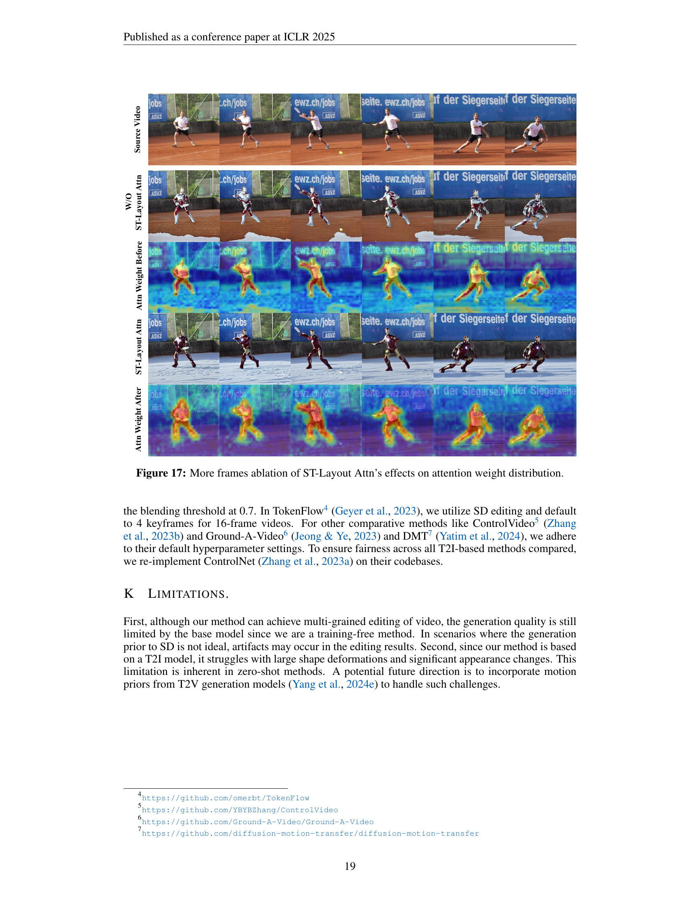

 


 2502.17258 
 Xiangpeng Yang et el. 
 
 🤗 2025-02-25 
 



↗ arXiv


↗ Hugging Face


↗ Papers with Code


### TL;DR



기존의 영상 편집 기술은 **다양한 수준의 편집(클래스, 인스턴스, 부분)**을 정확하게 수행하는 데 어려움을 겪었습니다. 특히, **의미적인 정렬 문제 및 특징 혼합**은 다중 입자 영상 편집의 주요 과제였습니다.  기존 기술은 인스턴스를 구별하지 못하고, 텍스트 기반 제어가 부정확하여,  자연스러운 편집 결과를 얻기 어려웠습니다.

본 논문에서는 이러한 문제를 해결하기 위해 VideoGrain이라는 새로운 방법론을 제시합니다. VideoGrain은 **공간-시간 어텐션 메커니즘**을 조절하여 텍스트-영역 간의 정렬을 개선하고, 특징 분리를 향상시켜 **다중 입자 영상 편집**의 성능을 크게 향상시켰습니다.  VideoGrain은 제로샷 학습 방식을 채택하여 추가적인 파라미터 튜닝 없이도 우수한 성능을 보였으며, 다양한 실험을 통해 그 효과를 검증했습니다.



#### Key Takeaways


 VideoGrain은 **클래스, 인스턴스, 부분 수준**의 다중 입자 영상 편집을 가능하게 하는 새로운 방법론을 제시합니다. 



 제로샷 학습을 통해 **추가적인 파라미터 튜닝 없이도** 우수한 성능을 달성합니다. 



 **공간-시간 어텐션 메커니즘**을 조절하여 정확한 텍스트-영역 제어 및 특징 분리를 개선합니다. 


#### Why does it matter?
이 논문은 **영상 편집 분야의 난제인 다중 입자 영상 편집 문제**를 해결하기 위한 새로운 방법론을 제시합니다. 제시된 방법론은 기존 방법의 한계를 극복하고 **다양한 수준의 영상 편집(클래스, 인스턴스, 부분)**을 자유롭게 수행할 수 있음을 보여줍니다. 이는 **영상 생성 및 편집 기술의 발전**에 크게 기여하고, 향후 연구 방향을 제시하는 데 중요한 의미를 가집니다.  또한, 제시된 방법론은 **제로샷 학습**을 통해 추가적인 파라미터 튜닝 없이도 높은 성능을 달성하여 실용성을 높였습니다.

------
#### Visual Insights

> 🔼 그림 1은 VideoGrain이 클래스, 인스턴스 및 파트 수준에서 비디오 편집을 수행할 수 있음을 보여줍니다. 왼쪽 열은 클래스 수준 편집을 보여줍니다. 같은 종류의 객체(예: 사람)가 다른 객체(예: 만화 캐릭터)로 변환됩니다. 가운데 열은 인스턴스 수준 편집을 보여줍니다. 각 객체 인스턴스가 개별적으로 편집됩니다(예: 한 사람은 만화 캐릭터로, 다른 사람은 동물로 변환됨). 오른쪽 열은 부분 수준 편집을 보여줍니다. 개체의 특정 부분(예: 의상)만 편집됩니다(예: 한 사람의 의상이 변경됨). 이 그림은 VideoGrain이 다양한 수준에서 비디오 객체를 정확하고 세밀하게 제어할 수 있음을 시각적으로 보여줍니다.
> 

> 
read the caption

> Figure 1: VideoGrain enables multi-grained video editing across class, instance, and part levels.
> 


| Method | CLIP-F ↑ | CLIP-T ↑ | Warp-Err ↓ | Q-edit ↑ | Edit-Acc ↑ | Temp-Con ↑ | Overall ↑ |
|---|---|---|---|---|---|---|---| 
| FateZero | 95.75 | 33.78 | 3.08 | 10.96 | 59.8 | 78.6 | 59.6 |
| ControlVideo | 97.71 | 34.41 | 4.73 | 7.27 | 53.2 | 50.0 | 43.6 |
| TokenFlow | 96.48 | 34.59 | 2.82 | 12.28 | 45.4 | 50.4 | 39.8 |
| Ground-A-Video | 95.17 | 35.09 | 4.43 | 7.92 | 69.0 | 72.0 | 63.2 |
| DMT | 96.34 | 34.09 | 2.05 | 16.63 | 58.7 | 79.4 | 64.5 |
| **VideoGrain(ours)** | **98.63** | **36.56** | **1.42** | **25.75** | **88.4** | **85.0** | **83.0** |

> 🔼 표 1은 자동 평가 지표와 사람의 평가를 사용한 정량적 비교 결과를 보여줍니다.  자동 평가 지표는 CLIP-F, CLIP-T, Warp-Err, Q-edit의 네 가지 지표로 구성되며, 각 지표는 비디오 편집의 다양한 측면(예: 유사도, 일관성, 왜곡)을 측정합니다. 사람의 평가는 Edit-Acc(편집 정확도), Temp-Con(시간적 일관성), Overall(전반적 편집 품질)의 세 가지 측면에서 이루어졌습니다. 각 지표의 최고 점수는 굵게 표시되어 있습니다. 이 표는 VideoGrain 모델의 성능을 다른 비디오 편집 모델들과 비교하여, VideoGrain이 다양한 평가 기준에서 우수한 성능을 보여줌을 보여주는 데 사용됩니다.
> 

> 
read the caption

> Table 1: Quantitative comparison of automatic metrics and human evaluation. The best results are bolded.
> 

### In-depth insights

#### Multi-grained Editing
논문에서 다루는 "다중 입도 편집(Multi-grained Editing)" 개념은 **영상 편집의 세 가지 수준, 즉 클래스(class), 인스턴스(instance), 파트(part) 레벨에서의 편집을 포괄적으로 다룹니다.**  클래스 레벨은 같은 종류의 객체들을 일괄적으로 수정하는 것이고, 인스턴스 레벨은 개별 객체들을 독립적으로 편집하는 것이며, 파트 레벨은 객체의 일부분이나 속성만을 변경하는 것을 의미합니다. 이러한 다중 입도 편집은 기존의 단순한 영상 편집 방식보다 훨씬 정교하고 복잡한 작업을 가능하게 하지만, **의미론적 정렬 문제(semantic misalignment)** 와 **특징 결합 문제(feature coupling)** 와 같은 어려움을 극복해야 합니다.  **VideoGrain 모델은 이러한 문제를 공간-시간적 어텐션 메커니즘(space-time attention mechanisms)을 조절하여 해결합니다.** 특히, 텍스트-영역 제어(text-to-region control)를 강화하고, 각 로컬 프롬프트가 해당 공간에 집중하도록 하면서, 관련 없는 영역과의 상호작용은 최소화합니다. 또한, 영역 내 인식(intra-region awareness)을 높이고 영역 간 간섭(inter-region interference)을 줄여 특징 분리를 개선합니다.  **이를 통해, 제로샷(zero-shot) 방식으로 다중 입도 영상 편집을 가능하게 하는 것이 VideoGrain의 핵심적인 특징입니다.**

#### Attention Modulation
본 논문에서 제시된 주요 개념인 어텐션 조절(Attention Modulation)은 **멀티 그레인 비디오 편집**을 위한 핵심 전략입니다.  이 기법은 공간-시간적 어텐션 메커니즘을 조절하여 비디오 콘텐츠에 대한 **세밀한 제어**를 가능하게 합니다.  **크로스 어텐션 조절**을 통해 각 로컬 프롬프트의 어텐션 가중치를 해당 공간 영역에 집중시켜 텍스트-영역 간의 정합성을 높이고, **셀프 어텐션 조절**을 통해 영역 내의 응집력을 강화하고 영역 간의 간섭을 줄여 특징 분리를 개선합니다.  즉, **텍스트 기반의 정확한 영역 제어**와 **특징 간의 효과적인 분리**를 동시에 달성하여 멀티 그레인 비디오 편집의 정확도와 질적 수준을 크게 향상시킵니다.  결과적으로, 클래스, 인스턴스, 부분 등 다양한 수준의 비디오 편집에서 우수한 성능을 보이며, 기존 방법들의 한계를 극복합니다.  **제로샷 학습**을 지원하여 추가적인 매개변수 조정 없이도 효과적인 편집이 가능하다는 점도 주목할 만합니다.

#### VideoGrain Framework
VideoGrain 프레임워크는 **멀티 그레인 비디오 편집**을 위한 효율적이고 강력한 솔루션을 제공합니다. 기존의 텍스트-투-이미지 및 텍스트-투-비디오 확산 모델의 한계를 극복하기 위해 **공간-시간 어텐션 메커니즘을 조절**하는 독창적인 방법을 제시합니다. 특히, **크로스-어텐션 모듈레이션**을 통해 텍스트 프롬프트와 공간적 영역 간의 정렬을 개선하고, **셀프-어텐션 모듈레이션**으로 영역 내 일관성을 높이며 영역 간 간섭을 줄여 더욱 정확하고 세밀한 편집을 가능하게 합니다. 이러한 접근 방식은 클래스, 인스턴스, 파트 레벨 등 다양한 수준의 비디오 편집을 지원하며, 제로샷 방식으로 작동하여 매개변수 조정 없이도 우수한 성능을 발휘한다는 점에서 큰 장점을 지닙니다. **다양한 실험 결과**를 통해 VideoGrain의 우수성이 입증되었으며, 향후 멀티모달 학습 및 비디오 편집 분야에 중요한 영향을 미칠 것으로 기대됩니다.

#### Ablation Studies
본 논문의 ablation study는 **ST-Layout Attention (ST-LA)**의 각 구성 요소의 효과를 면밀히 분석하여 모델 성능에 대한 기여도를 정량적으로 평가합니다.  **크로스 어텐션 모듈레이션**을 제거했을 때, 정확한 text-to-region 제어가 어려워짐을 보이며, **셀프 어텐션 모듈레이션** 제거 시에는 특징 분리의 부재로 인해 영상의 시간적 일관성이 저하되고 결과물의 품질이 떨어지는 것을 확인합니다.  두 모듈레이션을 모두 제거하면 성능 저하가 더욱 심화되어 모델의 핵심 구성 요소임을 강조합니다.  결과적으로, ST-LA의 **크로스 및 셀프 어텐션 모듈레이션** 모두가 다중 영역 비디오 편집에 필수적이며, 각 요소가 상호보완적으로 작용하여 최고 성능을 달성함을 입증합니다. 이를 통해 ST-LA의 설계가 합리적이고 효과적임을 뒷받침하는 강력한 증거를 제시합니다.  **정량적 지표**와 **정성적 평가** 모두를 통해 이러한 분석 결과를 뒷받침합니다.

#### Future Directions
미래 방향에 대한 심도있는 고찰은 **비디오 편집의 정확성과 효율성을 높이는 기술 개발**에 초점을 맞춰야 합니다.  **영상의 시공간적 특징을 더욱 효과적으로 활용**하는 새로운 아키텍처 연구와 **다양한 유형의 편집 작업(예: 모션, 텍스트, 객체 등)에 대한 일반화된 모델** 개발이 중요합니다.  **저해상도 영상이나 불완전한 데이터에 대한 강건성 확보**를 위한 연구도 필요하며, **윤리적 문제(가짜뉴스 생성 가능성 등)**에 대한 심각한 고려와 **안전장치 마련**도 필수적입니다.  나아가, **사용자 친화적인 인터페이스**를 통해 전문가뿐 아니라 일반 사용자도 쉽게 고품질 영상 편집을 할 수 있도록 하는 연구도 중요한 미래 과제입니다.  결론적으로,  미래 지향적인 연구는 기술적 개선뿐만 아니라 윤리적 책임과 사용자 경험 향상에도 집중해야 합니다.

### More visual insights

More on figures

> 🔼 그림 2는 다양한 영역(클래스, 인스턴스, 파트)을 자연어 프롬프트를 기반으로 수정하는 다중 입자 비디오 편집의 개념을 보여줍니다. 기존의 인스턴스 수준 편집 방법과 비교하여, 다중 입자 비디오 편집은 단일 객체 내부의 특징 변경(파트 수준)이나 동일 클래스 내 다른 객체 수정(클래스 수준)까지도 포함하는 더욱 세분화된 제어를 제공합니다. 그림에서는 다중 입자 비디오 편집과 인스턴스 수준 편집의 차이점을 직관적으로 보여주는 예시 이미지들을 함께 제시하고 있습니다.
> 

> 
read the caption

> Figure 2: Definition of multi-grained video editing and comparison on instance editing
> 

> 🔼 그림 3은 확산 모델이 인스턴스 수준의 비디오 편집에서 실패한 이유를 분석한 것입니다. 목표는 왼쪽 사람을 '아이언맨'으로, 오른쪽 사람을 '스파이더맨'으로, 나무를 '벚꽃'으로 편집하는 것입니다. (b)에서는 자기 주의 메커니즘에 K-평균을 적용하고, (d)에서는 32x32 크로스 어텐션 맵을 시각화합니다. 이 그림은 텍스트 기반 프롬프트가 비디오 프레임 내의 특정 영역에 정확히 적용되지 못하고, 확산 모델이 서로 다른 인스턴스의 특징을 혼합하는 문제를 보여줍니다.
> 

> 
read the caption

> Figure 3: Analysis of why the diffusion model failed in instance-level video editing. Our goal is to edit left man into “Iron Man,” right man into “Spiderman,” and trees into “cherry blossoms.” In (b), we apply K-Means on self-attention, and in (d), we visualize the 32x32 cross-attention map.
> 

> 🔼 그림 4는 VideoGrain이라는 새로운 비디오 편집 파이프라인을 보여줍니다. 이 파이프라인은 기존의 Stable Diffusion(SD) 모델에 ST-Layout Attn이라는 새로운 어텐션 메커니즘을 통합하여 다양한 수준의 비디오 편집을 가능하게 합니다. ST-Layout Attn은 크로스-어텐션과 셀프-어텐션을 통합적으로 조절하여 텍스트 기반의 정밀한 영역 제어 및 특징 분리를 가능하게 합니다. 크로스-어텐션에서는 각 로컬 프롬프트와 해당 위치를 양수 쌍으로, 프롬프트와 위치 외부 영역을 음수 쌍으로 간주하여 텍스트-영역 제어를 향상시킵니다. 셀프-어텐션에서는 프레임 간의 무관한 상호작용을 제한하고 각 쿼리가 타겟 영역에만 집중하도록 하여 특징 분리를 개선합니다.
> 

> 
read the caption

> Figure 4: VideoGrain pipeline. (1) we integrate ST-Layout Attn into the frozen SD for multi-grained editing, where we modulate self- and cross-attention in a unified manner. (2) In cross-attention, we view each local prompt and its location as positive pairs, while the prompt and outside-location areas are negative pairs, enabling text-to-region control. (3) In self-attention, we enhance positive awareness within intra-regions and restrict negative interactions between inter-regions across frames, making each query only attend to the target region and keep feature separation. In the bottom two figures, p𝑝pitalic_p denotes original attention score and w,i𝑤𝑖w,iitalic_w , italic_i denotes the word and frame index.
> 

> 🔼 그림 5는 VideoGrain 모델의 다양한 영상 편집 기능을 보여줍니다.  Class-level, instance-level, 그리고 part-level의 세 가지 레벨에서 영상 편집이 가능함을 보여주는 다양한 예시들이 제시되어 있습니다. Class-level은 같은 종류의 객체들을 일괄적으로 수정하는 것을, instance-level은 개별 객체들을 독립적으로 수정하는 것을, part-level은 객체의 일부분만 수정하는 것을 의미합니다.  예시로는 캐릭터의 교체, 배경 변경, 객체 추가 및 속성 변경 등이 포함됩니다. 자세한 영상 결과는 논문의 프로젝트 페이지에서 확인할 수 있습니다.
> 

> 
read the caption

> Figure 5: Qualitative results. VideoGrain achieves multi-grained video editing, including class-level, instance-level, and part-level. We refer the reader to our project page for full-video results.
> 

> 🔼 그림 6은 VideoGrain을 포함한 여러 비디오 편집 방법들의 정성적 비교 결과를 보여줍니다. 동물과 사람의 인스턴스 레벨, 그리고 파트 레벨 편집 결과를 보여주는 여러 예시가 포함되어 있습니다. 자세한 내용은 논문의 프로젝트 페이지를 참조하십시오.
> 

> 
read the caption

> Figure 6: Qualitative comparisons. We refer the reader to our project page for detailed assessment.
> 

> 🔼 그림 7은 VideoGrain의 핵심 구성 요소인 공간-시간 레이아웃 유도 어텐션(ST-Layout Attn)의 어텐션 가중치 분포를 보여줍니다.  특히, '눈 속 테니스장에서 테니스를 치는 남자'라는 프롬프트를 사용하여 크로스 어텐션 가중치 분포를 시각화합니다. ST-Layout Attn이 적용되지 않은 경우, '눈'의 가중치가 '남자' 영역으로 퍼져 나가는 현상(피처 믹싱)이 발생하지만, ST-Layout Attn이 적용된 경우에는 '남자' 영역에 가중치가 정확하게 집중되는 것을 확인할 수 있습니다.  이는 VideoGrain이 양성 쌍의 점수를 높이고 음성 쌍의 점수를 낮춤으로써 정확한 텍스트-영역 제어와 피처 분리를 달성했음을 보여줍니다.
> 

> 
read the caption

> Figure 7: Attention weight distribution.
> 

> 🔼 그림 8은 VideoGrain 모델의 핵심 구성 요소인 ST-Layout Attn에서 cross-attention과 self-attention의 modulation이 미치는 영향을 보여줍니다.  각각의 modulation을 제거했을 때(음영 처리된 부분)와 모두 활성화했을 때(마지막 열)의 결과를 비교하여,  두 modulation 모두 정확하고 일관된 multi-grained video editing에 필수적임을 시각적으로 보여줍니다. 특히, cross-attention modulation은 각 지역(region)에 대한 텍스트 정보의 집중도를 높여 정확한 편집을 가능하게 하고, self-attention modulation은 지역 간의 특징 혼합을 방지하여 각 개체(instance)의 고유한 특징을 보존하는 역할을 합니다.  그림은 왼쪽 사람을 Iron Man으로, 오른쪽 사람을 Spider-man으로, 배경을 눈 덮인 숲으로 변환하는 예시를 보여줍니다.
> 

> 
read the caption

> Figure 8: Ablation of cross- and self-modulation in ST-Layout Attn.
> 

> 🔼 그림 9는 SAM-Track 마스크를 사용하여 VideoP2P 모델로 영상 편집을 수행한 결과를 보여줍니다.  VideoP2P 모델은 SAM-Track으로부터 객체 분할 마스크를 입력받아 영상 편집을 진행합니다. 그림에서는 두 가지 편집 방식을 비교합니다. 첫 번째는 여러 영역을 동시에 편집하는 '공동 편집(Joint Edit)' 방식이고, 두 번째는 영역을 순차적으로 편집하는 '순차 편집(Sequential Edit)' 방식입니다.  각 방식에 따른 결과를 비교하여 SAM-Track 마스크를 사용한 VideoP2P 모델의 영상 편집 성능 및 한계점을 보여줍니다. 특히, 여러 영역을 동시에 편집하는 경우 정확도 저하 및 오류 누적 문제를 보여줍니다.
> 

> 
read the caption

> Figure 9: VideoP2P joint and sequential edit with SAM-Track masks
> 

> 🔼 그림 10은 Ground-A-Video 모델을 사용하여 인스턴스 정보를 활용하여 여러 영역을 동시에 편집한 결과를 보여줍니다.  Ground-A-Video는 개별 객체에 대한 정보(예: 경계 상자)를 사용하지만, 여러 객체의 특징이 혼합되어 정확한 편집이 어려움을 보여줍니다. 이는 Ground-A-Video가 인스턴스 수준의 편집에 어려움을 겪는다는 것을 시각적으로 보여주는 예시입니다.
> 

> 
read the caption

> Figure 10: Ground-A-Video joint edit with instance information
> 

> 🔼 이 그림은 논문의 3.1절(MOTIVATION)에서 제시된 SAM-Track 마스크 없이도 VideoGrain 방법이 고품질의 다중 영역 편집 결과를 얻을 수 있음을 보여줍니다. SAM-Track 마스크는 개별 인스턴스를 구분하는 데 사용되는데, 이 그림에서는 DDIM Inversion의 자기 주의 기능을 사용하여 클러스터링된 셀프 어텐션 특징을 통해 비슷한 레이아웃을 생성합니다. Ground-A-Video는 정확한 레이아웃을 제공하더라도 세 개의 영역을 모두 편집하지 못하는 반면, VideoGrain은 추가적인 SAM-Track 마스크 없이도 모든 세 개의 영역을 정확하게 편집합니다. 이는 VideoGrain이 정확한 레이아웃 안내에만 의존하지 않고, 확산 모델 내부의 자기 주의 기능을 효과적으로 활용하여 다중 영역 편집을 수행할 수 있음을 시사합니다.
> 

> 
read the caption

> Figure 11: Our method without additional SAM-Track masks
> 

> 🔼 그림 12는 배경을 변경하지 않고 특정 객체만 편집하는 VideoGrain의 능력을 보여줍니다. 왼쪽 이미지는 원본 영상이고, 가운데 이미지는 왼쪽 인물을 아이언맨으로, 오른쪽 이미지는 오른쪽 인물을 스파이더맨으로 각각 변경한 결과를 보여줍니다. 마지막 이미지는 왼쪽과 오른쪽 인물을 동시에 변경한 결과입니다. 세 이미지 모두 배경은 변하지 않았습니다. 이는 VideoGrain이 배경을 유지하면서 특정 객체만 선택적으로 편집할 수 있음을 의미합니다.
> 

> 
read the caption

> Figure 12: Soely edit on specific subjects, without background changed
> 

> 🔼 그림 13은 인간과 동물에 대한 부분적 수정 사례를 보여줍니다.  왼쪽에는 인간의 옷 색깔 변경(회색에서 파란색으로), 옷 스타일 변경(반팔에서 정장으로), 그리고 머리 색깔 변경(검정색에서 빨간색으로) 등 다양한 부분 수정이 적용된 결과가 나와있습니다. 오른쪽에는 동물의 부분적 수정으로, 고양이의 머리색깔과 몸 색깔 변경(검정색에서 주황색으로) 결과를 보여줍니다. 이 그림은 VideoGrain 모델이 단순히 객체 전체를 변경하는 것이 아니라, 객체의 특정 부분에 대한 세밀한 수정까지 가능함을 보여줍니다.
> 

> 
read the caption

> Figure 13: Part-level modifications on humans and animals
> 

> 🔼 그림 14는 VideoGrain 모델의 ST-Layout Attention(공간-시간 레이아웃 어텐션)의 시간적 초점을 보여줍니다.  (1) 입력 비디오 프레임, (2) 각 프레임에 대해 독립적으로 ST-Layout Attention을 적용한 결과, (3) 이전 프레임과 현재 프레임만을 사용하는 sparse-causal 방식의 결과, 그리고 (4) VideoGrain 모델의 ST-Layout Attention을 적용한 결과를 비교합니다.  sparse-causal 방식은 시간적 일관성이 부족하여 깜빡임 현상이 발생하고 세부적인 디테일이 누락되는 반면, VideoGrain의 ST-Layout Attention은 시간적 일관성을 유지하면서도 레이아웃 일관성을 유지하여 더욱 정확하고 자연스러운 다중 영역 비디오 편집 결과를 제공합니다.
> 

> 
read the caption

> Figure 14: Temporal Focus of ST-Layout Attn
> 

> 🔼 그림 15는 ControlNet의 효과를 보여주는 실험 결과입니다. ControlNet 없이도 VideoGrain은 다중 영역 편집을 수행할 수 있지만, 복잡한 움직임이 있는 경우 구조적 일관성이 부족할 수 있습니다. ControlNet은 이러한 구조적 일관성을 제공하여 보다 정확한 편집 결과를 얻을 수 있습니다.  ControlNet을 사용하지 않은 경우(왼쪽)와 ControlNet을 사용한 경우(오른쪽)의 비교 결과를 통해 ControlNet의 효과를 확인할 수 있습니다.
> 

> 
read the caption

> Figure 15: ControlNet ablation
> 

> 🔼 그림 16은 동물(애완견, 얼룩말 등)과 자동차(포르쉐)의 인스턴스 편집 결과를 보여줍니다. 배경은 변하지 않고 개체의 종류나 형태를 바꾸는 다양한 편집 결과가 제시됩니다.  각 예시는 특정한 텍스트 프롬프트를 사용하여 생성되었습니다.  배경을 유지하면서 전경의 개체만 수정하는 다양한 실험 결과를 통해 VideoGrain 모델의 강력한 편집 능력을 보여줍니다.
> 

> 
read the caption

> Figure 16: More general objects instance editing (animals) and shape editing (cars) results.
> 

> 🔼 그림 17은 ST-Layout Attn이 어텐션 가중치 분포에 미치는 영향에 대한 추가 프레임 분석 결과를 보여줍니다.  비교를 위해 기존의 희소 인과적 방법과 ST-Layout Attn을 사용한 결과를 보여줍니다.  ST-Layout Attn이 시간적 일관성을 유지하면서 레이아웃을 통합하는 다중 입도 비디오 편집을 달성하는 데 어떻게 효과적인지를 보여주는 추가적인 증거를 제공합니다.
> 

> 
read the caption

> Figure 17: More frames ablation of ST-Layout Attn’s effects on attention weight distribution.
> 

More on tables


| Time(min) ↓ | Memory (GB) ↓ | RAM (GB) ↓ |
|---|---|---|
| FateZero | 8.68 | 27.35 | 144.22 |
| ControlVideo | 4.41 | 16.15 | 7.03 |
| TokenFlow | 4.56 | 17.84 | 5.35 |
| Ground-A-Video | 5.81 | 17.31 | 9.96 |
| DMT | 5.79 | 27.88 | 8.12 |
| **VideoGrain** | **3.83** | **15.94** | **4.42** |
> 🔼 표 2는 제시된 여러 비디오 편집 방법들의 효율성을 비교 분석한 표입니다.  각 방법의 비디오 편집에 소요된 시간, GPU 메모리 사용량, RAM 사용량을 비교하여 효율성을 정량적으로 제시합니다. 이를 통해 각 방법의 계산 비용 및 자원 활용 측면에서의 차이를 명확히 보여줍니다.
> 

> 
read the caption

> Table 2:  Efficiency comparison.
> 


| Method | CLIP-F ↑ | CLIP-T ↑ | Warp-Err ↓ | Qedit ↑ |
|---|---|---|---|---|
| Baseline | 95.21 | 33.59 | 3.86 | 8.70 |
| Baseline + Cross Modulation | 96.28 | 36.09 | 2.53 | 14.26 |
| **Baseline + Cross Modulation + Self Modulation** | **98.63** | **36.56** | **1.42** | **25.75** |
> 🔼 표 3은 논문의 3.4절 'Spatial-Temporal Layout-Guided Attention' 에서 ST-Layout Attn의 성능에 대한 정량적 분석 결과를 보여줍니다.  ST-Layout Attn은 크로스 어텐션과 셀프 어텐션 메커니즘을 조절하여  정확한 영역 제어와 특징 분리를 달성하는 모델입니다. 이 표는 크로스 어텐션 조절만, 셀프 어텐션 조절만, 그리고 둘 다 조절했을 때의 성능을 비교하여 각 모듈의 효과를 보여줍니다.  CLIP-F, CLIP-T, Warp-Err, Q-edit 지표를 사용하여 정량적으로 평가하였습니다. CLIP-F와 CLIP-T는 각각 프롬프트와 비디오 프레임 간의 유사도를, Warp-Err은 왜곡 오류를, Q-edit은 CLIP-T와 Warp-Err의 비율을 나타냅니다.  결과적으로, 크로스 및 셀프 어텐션 조절을 모두 적용했을 때 가장 높은 성능을 달성함을 보여줍니다.
> 

> 
read the caption

> Table 3: Quantitative ablation of cross- and self-modulation in ST-Layout Attn.
> 

### Full paper



