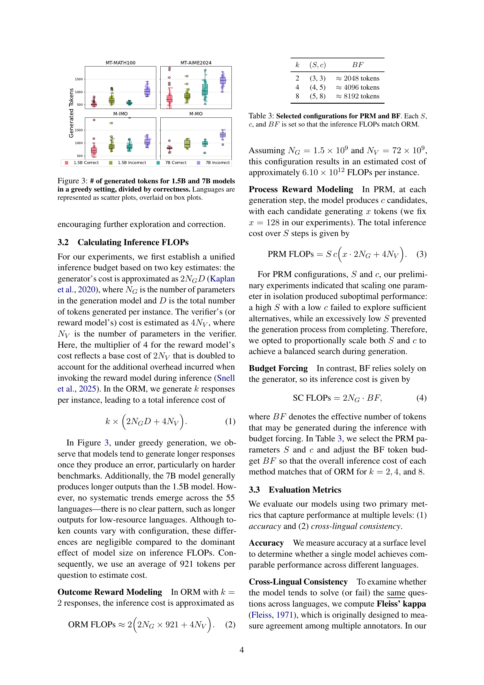
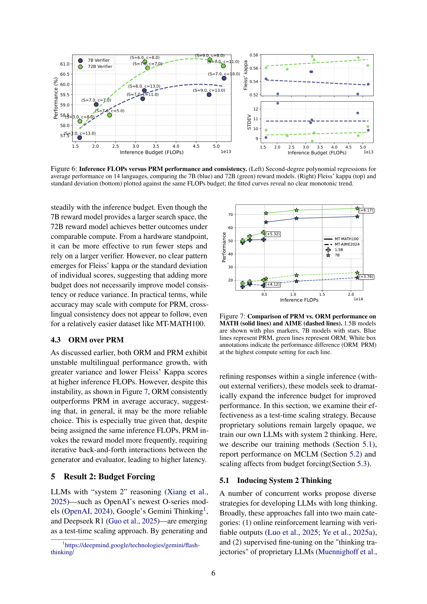
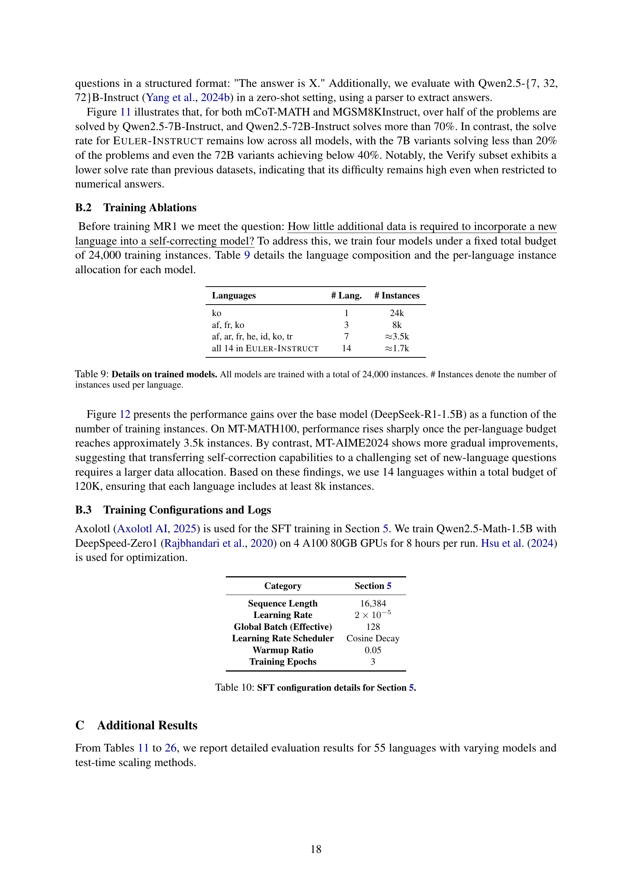

 


 2502.17407 
 Guijin Son et el. 
 
 🤗 2025-02-25 
 



↗ arXiv


↗ Hugging Face


↗ Papers with Code


### TL;DR



본 논문은 **대규모 언어 모델(LLM)의 사전 학습 컴퓨팅 규모 확장이 다국어 능력 향상에 효과적이지만, 테스트 타임 스케일링은 다국어 과제에 효과적으로 일반화되지 않는다는 점을 밝히고 있습니다.** 기존 연구들은 주로 영어에 집중하여 다국어 능력에 대한 제한적인 이해를 보였습니다.  특히, 테스트 타임 스케일링 기법들이 다국어 문제 해결에 일관된 성능 향상을 보이지 않는다는 점이 중요한 문제점으로 지적됩니다.

본 연구는 **55개 언어를 지원하는 다국어 수학 벤치마크 MCLM과 확장된 추론 능력을 갖춘 다국어 LLM인 MR1-1.5B를 개발하여 이러한 문제점을 해결하고자 합니다.**  세 가지 테스트 타임 스케일링 기법(ORM, PRM, BF)을 실험한 결과, 영어에서는 상당한 성능 향상을 보였으나 다른 언어에서는 미미한 향상만을 보였습니다.  이는 테스트 타임 스케일링이 다국어 문제에 효과적으로 적용되지 않음을 시사합니다.  본 연구는 다국어 능력 향상을 위한 새로운 연구 방향을 제시하고, 다국어 자연어 처리 분야에 중요한 기여를 할 것으로 기대됩니다.



#### Key Takeaways


 테스트 타임 스케일링은 영어에서는 효과적이지만, 다른 언어로는 일반화되지 않는다는 것을 발견했습니다. 



 새로운 다국어 수학 벤치마크 MCLM과 다국어 언어 모델 MR1-1.5B를 공개했습니다. 



 테스트 타임 스케일링 기법의 다국어 일반화 가능성에 대한 심층적인 분석을 제공합니다. 


#### Why does it matter?
본 논문은 **다국어 환경에서의 테스트 타임 스케일링의 일반화 가능성에 대한 중요한 통찰력**을 제공합니다. 다국어 언어 모델의 성능 향상을 위한 새로운 연구 방향을 제시하고, 다국어 자연어 처리 분야의 발전에 기여할 수 있습니다. 또한, **새로운 다국어 수학 벤치마크 MCLM과 다국어 언어 모델 MR1-1.5B를 공개**하여 후속 연구를 위한 기반을 마련했습니다.

------
#### Visual Insights

> 🔼 본 그림은 Qwen2.5-1.5B-Math 모델에 세 가지 테스트 시간 확장 방법(Outcome Reward Modeling, Process Reward Modeling, Budget Forcing)을 적용했을 때의 성능을 비교한 것입니다.  각 방법은 비슷한 수준의 추론 FLOPs(Floating Point Operations)를 사용하도록 설정되었으며, 결과적으로 세 가지 방법 모두 유사한 성능을 보이는 것을 보여줍니다.  이는 테스트 시간 확장 방법들이 모델의 성능 향상에 있어 유사한 효과를 가질 수 있음을 시사합니다.
> 

> 
read the caption

> Figure 1: Performance of Qwen2.5-1.5B-Math with different test-time scaling strategies.——Once configured to use comparable inference FLOPs, all three methods (Outcome Reward Modeling, Process Reward Modeling, and Budget Forcing) achieve similar performance.
> 


| Models | MGSM |
|---|---| 
| Gemma2-9B | 78.37 |
| Qwen2.5-14B-Instruct | 82.27 |
| Qwen2.5-72B-Instruct | 88.16 |
| Mistral-Large | 89.01 |
| GPT-4o-mini | 87.36 |
| o3-mini | **89.30** |

> 🔼 이 표는 다양한 언어 모델의 수학 추론 능력을 MGSM(Multilingual General Math Benchmark) 기준으로 평가한 결과를 보여줍니다.  2025년 1월 31일 버전의 o3-mini 모델을 제외하고, 나머지 모델들의 점수는 Yang et al.(2024b) 논문에서 가져왔습니다.  표는 각 모델의 MGSM 점수를 나타내어, 모델의 수학 문제 해결 능력을 비교 분석하는 데 사용됩니다.  점수가 높을수록 수학 추론 능력이 우수함을 의미합니다.
> 

> 
read the caption

> Table 1: MGSM performance of different models. The 2025-01-31 version is used for o3-mini, remaining scores were sourced from the Yang et al. (2024b).
> 

### In-depth insights

#### Multilingual Math
논문에서 다루는 다국어 수학 문제 해결의 핵심은 **LLM(대규모 언어 모델)의 다국어 능력과 추론 능력을 동시에 평가**하는 데 있습니다.  단순히 다양한 언어로 된 수학 문제를 풀 수 있는 능력 뿐 아니라, **문제 해결 과정의 추론 과정** 또한 중요하게 평가하고 있습니다.  기존의 단순한 수학 문제 풀이 데이터셋의 한계를 넘어, **실제 수학 경시대회 수준의 복잡하고 다양한 문제들을 다국어로 다루는 점**이 특징입니다.  이는 LLM의 진정한 언어 이해 및 추론 능력을 평가하는 데 더욱 효과적이며,  단순한 번역 능력을 넘어 **깊이 있는 의미 이해와 복잡한 추론 능력**을 요구하기 때문입니다.  따라서 이 연구는 **LLM의 다국어 수학 문제 해결 능력의 한계와 가능성**을 동시에 보여주는 중요한 시사점을 제공합니다.  **다국어 지원의 범위와 성능의 균형**을 이루는 것이 앞으로의 연구 과제가 될 것입니다.

#### Test-Time Scaling
본 논문에서 다룬 "Test-Time Scaling"은 **모델의 사전 학습 이후, 추론 단계에서 모델의 성능을 향상시키는 기법**을 의미합니다.  기존의 대규모 언어 모델(LLM) 학습은 막대한 컴퓨팅 자원을 필요로 하며, 다국어 지원의 어려움도 존재했습니다.  Test-Time Scaling은 이러한 한계를 극복하기 위해 **추론 시점에 추가적인 연산이나 전략을 사용하여 모델의 추론 능력을 향상**시키는 방법입니다.  논문에서는 Outcome Reward Modeling (ORM), Process Reward Modeling (PRM), Budget Forcing (BF) 등의 세 가지 Test-Time Scaling 기법을 다국어 수학 문제 풀이에 적용하여 평가했습니다.  흥미롭게도, **Test-Time Scaling은 영어와 같은 고자원 언어에는 효과적이지만, 저자원 언어에서는 일반화가 잘 되지 않는다는 점**을 발견했습니다. 이는 **사전 학습 단계의 대규모 다국어 학습이 모델의 다국어 능력에 중요한 영향**을 미친다는 것을 시사합니다. 따라서, 향후 연구는 **Test-Time Scaling의 다국어 일반화 문제를 해결**하고, 다양한 언어와 작업에 효과적으로 적용할 수 있는 새로운 방법론을 개발하는 데 초점을 맞춰야 할 것입니다.

#### Cross-Lingual Gains
본 논문에서 다루는 "Cross-Lingual Gains"는 다국어 모델의 성능 향상에 대한 내용으로 추측됩니다. 특히 **전이 학습(transfer learning)** 및 **다국어 사전 훈련(multilingual pre-training)**의 효과를 다국어 추론 과제에 적용했을 때의 성능 개선에 초점을 맞춘 것으로 보입니다. 이는 단일 언어 모델에 비해 다국어 모델이 여러 언어의 데이터를 학습하여 다양한 언어적 특징을 습득하고, **새로운 언어에 대한 적응력(adaptability)**이 향상될 수 있음을 시사합니다. 하지만, 단순히 다국어 데이터를 사용하는 것만으로는 충분하지 않고, **모델의 구조 및 학습 전략(model architecture and training strategies)**이 적절히 설계되어야 함을 강조하는 내용이 포함되어 있을 것으로 예상됩니다. 또한, **테스트 시간 확장(test-time scaling)** 기법을 통해 얻을 수 있는 이점과 한계에 대한 논의가 있을 것으로 보이며, 특정 언어에 대한 성능 개선이 다른 언어로 일반화되지 않는 현상(generalization)에 대한 분석이 주요 내용일 가능성이 높습니다. 따라서 다국어 모델의 성능 향상은 단순히 데이터의 양적 증가뿐 아니라, **모델의 설계 및 학습 방식의 개선(improvements in model design and learning methods)**에 대한 심도 있는 연구가 필요함을 강조하는 부분이 있을 것으로 예상됩니다.

#### Methodology
본 논문의 방법론은 **다국어 수학 추론 과제에 대한 세 가지 테스트 타임 스케일링 기법** (Outcome Reward Modeling, Process Reward Modeling, Budget Forcing)의 일반화 성능을 평가하는 데 초점을 맞춥니다.  각 기법은 **사전 훈련된 언어 모델**에 적용되어 성능을 평가하고, **다양한 언어 간의 성능 일관성**을 측정하기 위해 Fleiss' kappa를 사용합니다.  **다국어 경쟁 수준 수학 벤치마크(MCLM)**을 새롭게 제시하여 다양한 언어의 복잡한 추론 문제를 다룹니다.  이를 통해 단순한 문제 해결을 넘어 **모델의 진정한 다국어 추론 능력**을 평가하고, **테스트 타임 스케일링의 한계**를 밝히는 데 기여합니다.  **MR1-1.5B라는 다국어 LLM**을 훈련하여 성능 비교에 활용하고, **결과는 공개**하여 후속 연구를 촉진합니다.  **추론 연산량(FLOPs)**을 통제하여 기법 간 공정한 비교를 수행하는 점도 주목할 만합니다.  전반적으로, **실험 설계는 엄밀하고 체계적이며**, 다국어 언어 모델의 성능 평가와 테스트 타임 스케일링 기법의 일반화 문제에 대한 심층적인 이해를 제공합니다.

#### Future Research
본 논문은 **다국어 수학 추론에서의 테스트 타임 스케일링의 언어 일반화 가능성**에 대한 중요한 통찰력을 제공합니다. 다국어 벤치마크 MCLM을 사용한 실험 결과는 테스트 타임 스케일링이 영어와 같은 고자원 언어에서는 효과적이지만, 저자원 언어로 확장하는 데는 어려움이 있음을 보여줍니다. **미래 연구는 이러한 언어적 편향을 해결하기 위한 새로운 테스트 타임 스케일링 방법론 개발**에 초점을 맞춰야 합니다. 또한, **대규모 언어 모델(LLM)의 자체 수정 능력 향상**에 대한 연구도 중요합니다. **저자원 언어에 대한 데이터 부족 문제 해결을 위한 데이터 증강 기법** 개발도 중요한 연구 분야입니다.  나아가, **다양한 언어와 추론 유형을 포함하는 더욱 포괄적인 벤치마크** 개발을 통해 연구 결과의 일반화 가능성을 높일 필요가 있습니다.  **테스트 타임 스케일링의 효율성을 높이기 위한 계산 비용 최적화** 연구도 미래 연구 방향 중 하나입니다.  마지막으로, **다국어 수학 추론뿐 아니라 다른 다국어 과제에도 테스트 타임 스케일링 기법 적용**에 대한 연구가 필요합니다.

### More visual insights

More on figures

> 🔼 그림 2는 세 가지 서로 다른 테스트 시간 확장 전략(결과 보상 모델링, 프로세스 보상 모델링 및 예산 강제)을 비교한 것입니다. 각 전략은 모델이 생성한 여러 응답 후보 중에서 최종 출력으로 선택된 응답(파란색 상자)과 기각된 응답(빨간색 상자)을 보여줍니다. 이 그림을 통해 각 전략의 의사결정 과정과 그 차이점을 시각적으로 이해할 수 있습니다.
> 

> 
read the caption

> Figure 2: Comparison of different inference-time scaling strategies. Blue boxes represent selected outputs, while red boxes indicate rejected ones.
> 

> 🔼 이 그림은 탐욕적 설정에서 15억 및 70억 매개변수 모델에 대해 생성된 토큰의 수를 정확성으로 나눈 것을 보여줍니다. 각 언어는 상자 그림 위에 산점도로 표시됩니다. 상자 그림은 각 언어에 대한 생성된 토큰 수의 분포를 보여주고, 산점도는 각 언어에 대한 개별 데이터 포인트를 보여줍니다. 이를 통해 모델의 크기가 다양한 언어에 걸쳐 생성된 응답의 길이와 정확성에 미치는 영향을 시각적으로 파악할 수 있습니다.
> 

> 
read the caption

> Figure 3: # of generated tokens for 1.5B and 7B models in a greedy setting, divided by correctness. Languages are represented as scatter plots, overlaid on box plots.
> 

> 🔼 그림 4는 다양한 K 값(2, 4, 8)을 갖는 ORM(Outcome Reward Modeling) 설정에서 그리디 디코딩 기준선과 비교하여 성능 향상을 보여줍니다. 반투명한 ‘구름’은 KDE 밀도 플롯을 통해 2차원 데이터 분포를 나타내고, 겹쳐진 3차 다항식 회귀선은 각 ORM 설정이 기준선 점수에 따라 어떻게 변화하는지 보여줍니다. 즉, x축은 기준선 점수, y축은 ORM 설정에 따른 성능 향상(기준선 점수 대비 상대적 증가분)을 나타내며, 각 점은 특정 언어에 대한 결과를, 회귀선은 전반적인 경향을 보여줍니다.  이를 통해 MT-MATH100 데이터셋에서는 K 값이 증가함에 따라 성능이 일관되게 향상되는 반면, MT-AIME2024 데이터셋에서는 K 값의 변화에 따른 성능 향상이 미미하거나, 경우에 따라서는 성능이 저하되는 것을 확인할 수 있습니다. 이는 ORM이 어려운 문제에 대해서는 모든 언어에서 일관된 성능 향상을 가져오지 못함을 시사합니다.
> 

> 
read the caption

> Figure 4: Gains of ORM compared to a greedy-decoding baseline. The semi-transparent “cloud” indicates the 2D data distribution via a KDE density plot, and the overlaid lines are third-order polynomial regressions modeling how each ORM setting scales with the baseline score.
> 

> 🔼 그림 5는 Process Reward Modeling (PRM)의 추론 연산량(FLOPs)을 생성 단계 수(S)와 각 단계당 후보 수(c)의 함수로 나타낸 것입니다. 왼쪽 패널은 72B 크기의 검증기를 사용한 경우를, 오른쪽 패널은 7B 크기의 RM을 사용한 경우를 보여줍니다. 두 경우 모두 비슷한 비용을 얻도록 설정을 조정했습니다.  즉, 서로 다른 크기의 검증기를 사용하더라도 비슷한 계산 비용을 갖도록 PRM의 설정을 조정하여 비교 분석을 수행했다는 것을 보여줍니다.
> 

> 
read the caption

> Figure 5: PRM inference FLOPs as a function of generation steps S𝑆Sitalic_S and candidates per step c𝑐citalic_c. The left panel uses a verifier size of 72B, while the right panel uses a 7B RM, displaying adjusted configurations to yield similar costs.
> 

> 🔼 그림 6은 PRM(Process Reward Modeling)의 추론 연산량(FLOPs)과 성능 및 일관성 간의 관계를 보여줍니다. 왼쪽 그림은 14개 언어에 대한 평균 성능을 나타내는 2차 다항식 회귀선을 보여주며, 보상 모델의 크기(매개변수 수)에 따른 차이를 보여줍니다. 파란색은 7B 매개변수 모델, 녹색은 72B 매개변수 모델을 나타냅니다. 오른쪽 그림은 동일한 FLOPs 예산에 대한 Fleiss’ kappa(일관성 측정 지표)와 표준 편차를 나타냅니다. 이때, 명확한 단조 관계는 관찰되지 않습니다.
> 

> 
read the caption

> Figure 6: Inference FLOPs versus PRM performance and consistency. (Left) Second-degree polynomial regressions for average performance on 14 languages, comparing the 7B (blue) and 72B (green) reward models. (Right) Fleiss’ kappa (top) and standard deviation (bottom) plotted against the same FLOPs budget; the fitted curves reveal no clear monotonic trend.
> 

> 🔼 그림 7은 MATH 및 AIME 데이터셋에서 PRM과 ORM의 성능을 비교한 그래프입니다.  실선은 MATH 데이터셋, 점선은 AIME 데이터셋의 결과를 나타냅니다.  '+' 마커는 1.5B 모델, '*' 마커는 7B 모델의 결과를 나타냅니다. 파란색 선은 PRM, 녹색 선은 ORM을 나타냅니다.  각 선의 가장 높은 컴퓨팅 설정에서 ORM과 PRM의 성능 차이를 흰색 상자 주석으로 표시했습니다. 이는 각 모델의 크기와 사용된 계산 리소스에 따른 상대적 성능을 보여줍니다.
> 

> 
read the caption

> Figure 7: Comparison of PRM vs. ORM performance on MATH (solid lines) and AIME (dashed lines). 1.5B models are shown with plus markers, 7B models with stars. Blue lines represent PRM, green lines represent ORM. White box annotations indicate the performance difference (ORM − PRM) at the highest compute setting for each line.
> 

> 🔼 그림 8은 Qwen2.5-Math-1.5B 모델에 대해 SFT(Supervised Fine-Tuning)와 MT-SFT(다국어 SFT)를 적용했을 때, 각 학습 체크포인트별 성능을 보여줍니다.  y축은 평균 정확도를 나타내고, x축은 학습 진행 단계(checkpoint)를 나타냅니다.  에러 바는 각 체크포인트에서의 정확도 표준편차를 나타내며, MT-SFT의 평균 ± 표준편차 범위는 음영으로 표시되어 있습니다.  즉, 이 그래프는 두 가지 fine-tuning 방법의 성능 변화를 학습 과정에 따라 비교 분석하여 보여줍니다. MT-SFT는 다국어 데이터를 사용했으므로, 단일 언어 데이터만을 사용한 SFT보다 초기 성능은 다소 낮지만, 학습이 진행됨에 따라 더 나은 성능을 보이는 것을 확인할 수 있습니다.
> 

> 
read the caption

> Figure 8: Performance of Qwen2.5-Math-1.5B +SFT and + MT-SFT at each training checkpoint. Average score and error bars for each checkpoint are displayed. The shaded region is the mean ±plus-or-minus\pm± standard deviation for MT-SFT.
> 

> 🔼 그림 9는 다양한 언어에 대한 MT-AIME2024 데이터셋에서 세 가지 다른 버짓(2048, 4096, 8192 토큰)을 사용한 MR1 모델의 성능을 보여줍니다. 회색 점은 개별 언어를 나타내고, 실선은 평균 성능을, 점선은 특정 언어에 대한 기준 성능을 나타냅니다. 이 그림은 테스트 시간 확장 기법인 BF(Budget Forcing)이 언어 간에 얼마나 잘 일반화되는지 보여주는 시각적 자료입니다. 각 버짓에서 모델의 성능이 어떻게 변하는지, 그리고 특정 언어에서의 성능이 평균 성능과 어떻게 다른지를 보여줍니다.
> 

> 
read the caption

> Figure 9: Performance of MR1 on MT-AIME2024 at B⁢F={2048,4096,8192}𝐵𝐹204840968192BF=\{2048,4096,8192\}italic_B italic_F = { 2048 , 4096 , 8192 }. Grey dots represent individual languages. Solid lines indicate average performance, while dashed lines highlight reference performances for selected languages.
> 

> 🔼 그림 10은 2006년부터 2024년까지의 IMO(International Mathematical Olympiad) 문제들의 히트맵을 보여줍니다. 각 행은 대회 연도에 해당하며, 각 열은 문제(Q1~Q6)를 나타냅니다. 초록색 셀은 M-IMO 하위 데이터셋에 포함된 문제를, 회색 셀은 선택되지 않은 문제를 나타냅니다. 이 그림은 M-IMO 데이터셋이 어떤 기준으로 IMO 문제들을 선택했는지 시각적으로 보여줍니다.
> 

> 
read the caption

> Figure 10: Heatmap representation of IMO problems from 2006 to 2024. Each row corresponds to a competition year, and each column represents a problem (Q1–Q6). Green cells indicate questions that have been included in the M-IMO subset, while gray cells represent problems that were not selected.
> 

> 🔼 그림 11은 다양한 다국어 수학 데이터셋에 대해 평가된 풀이 성공률(%)을 보여줍니다. OLMo2 계열의 경우 기본 모델을 사용했고, Qwen2.5 계열의 경우 instruction-tuning된 변형 모델을 사용했습니다. Euler-Instruct 데이터셋은 상당히 낮은 풀이 성공률을 보여주어, 해당 데이터셋의 난이도가 높다는 것을 시사합니다.  이 그림은 다양한 크기와 종류의 언어 모델이 다국어 수학 문제 풀이에 대해 어떤 성능을 보이는지 비교 분석하는 데 유용합니다.
> 

> 
read the caption

> Figure 11: Solve rates (%) of different multilingual math datasets evaluated. For the OLMo2 series, we use the base models, while for the Qwen2.5 series, the instruct-tuned variants are used. Euler-Instruct presents a significantly lower solve rate, indicating its greater difficulty.
> 

> 🔼 그림 12는 표 9의 결과를 보여줍니다. 왼쪽 그래프는 55개 언어 중 14개 언어(언어 그룹 B)로 번역된 MT-MATH500 데이터셋에 대한 정확도를 보여주고, 오른쪽 그래프는 MT-AIME2024 데이터셋에 대한 평균 성능을 보여줍니다.  각 그래프는 훈련 데이터의 양에 따른 모델 성능 변화를 보여주는 여러 개의 데이터 포인트를 포함하고 있습니다.  이를 통해 다양한 규모의 훈련 데이터가 모델의 성능에 미치는 영향과 다국어 모델 학습 시 데이터셋 크기의 중요성을 시각적으로 확인할 수 있습니다.
> 

> 
read the caption

> Figure 12: Model Results from Table 9. Left shows accuracy on MT-MATH500 (entire translated subset for language group (B)), and right shows average performance of MT-AIME2024.
> 

More on tables


| Subset | Source Benchmark | Languages | Sample Size per Language | Evaluation Method |
|---|---|---|---|---|
| MT-MATH100 | Math-500 | 55 | 100 | Rule-based verifier |
| MT-AIME2024 | AIME 2024 | 55 | 30 | Rule-based verifier |
| M-IMO | IMO (2006, 2024) | 38 | 22–27 | LLM-as-a-Judge |
| M-MO | Domestic/Regional Olympiads | 11 | 28–31 | LLM-as-a-Judge |
> 🔼 이 표는 논문의 MCLM 벤치마크에 대한 개요를 보여줍니다.  각 하위 데이터셋(MT-MATH100, MT-AIME2024, M-IMO, M-MO)의 소스 벤치마크, 언어 범위(전체 목록은 부록 참조), 샘플 크기 및 평가 방법을 보여줍니다.  각 하위 데이터셋은 서로 다른 유형의 수학 문제와 다양한 언어를 포함하며, 이는 다국어 수학 추론 모델의 성능을 평가하는 데 사용됩니다.  언어의 전체 목록은 부록 A.1을 참조하십시오.
> 

> 
read the caption

> Table 2: Overview of benchmark subsets: source benchmarks, language coverage (full lists in the appendix), sample sizes, and evaluation methods. Please see Appendix A.1 for the full list of languages.
> 


| k | (S,c) | BF |
|---|---|---|
| 2 | (3, 3) | ≈ 2048 tokens |
| 4 | (4, 5) | ≈ 4096 tokens |
| 8 | (5, 8) | ≈ 8192 tokens |
> 🔼 표 3은 PRM(Process Reward Modeling)과 BF(Budget Forcing)에 대한 설정값을 보여줍니다.  각 설정값(S, c, BF)은 ORM(Outcome Reward Modeling)과 동일한 추론 FLOPs(Floating Point Operations)를 갖도록 조정되었습니다.  즉, 세 가지 방법 모두 비슷한 계산 비용을 사용하여 성능을 비교할 수 있도록 설정이 구성된 것입니다.  S는 생성 단계 수, c는 각 단계에서 생성되는 후보 답변의 개수, BF는 허용되는 토큰 수를 나타냅니다.  이 표는 테스트 시간 확장 방법들의 계산 비용을 동일하게 유지하면서 비교하기 위한 실험 설정을 설명합니다.
> 

> 
read the caption

> Table 3: Selected configurations for PRM and BF. Each S𝑆Sitalic_S, c𝑐citalic_c, and B⁢F𝐵𝐹BFitalic_B italic_F is set so that the inference FLOPs match ORM.
> 


| Models | MT-MATH100 | MT-AIME2024 | M-IMO | M-MO | Average |
|---|---|---|---|---|---| 
| Qwen2.5-Math-1.5B-Instruct | 42.32 ± 8.61 | 16.36 ± 6.89 | 12.23 ± 6.02 | 25.00 ± 19.10 | 23.98 |
| Deepseek-R1-1.5B | 49.40 ± 8.84 | 17.21 ± 6.69 | 21.94 ± 6.75 | 26.77 ± 19.83 | 28.83 |
| GPT-4o-Mini | 70.30 ± 3.68 | 20.18 ± 6.83 | 13.33 ± 5.36 | 30.81 ± 15.80 | 33.66 |
| o3-Mini | **84.89** ± 2.80 | **45.33** ± 5.35 | **29.75** ± 6.86 | **51.42** ± 16.94 | **52.85** |
| Qwen2.5-Math-1.5B + SFT | 37.47 ± 7.56 | 14.85 ± 6.69 | 10.50 ± 5.16 | 18.40 ± 14.92 | 20.30 |
| Qwen2.5-Math-1.5B + MT-SFT | 42.02 ± 7.46 | 16.67 ± 7.31 | 10.52 ± 4.63 | 19.92 ± 12.68 | 22.28 |
| Deepseek-R1-1.5B + MT-SFT | **55.61** ± 10.93 | **19.94** ± 8.10 | **19.20** ± 6.24 | **28.97** ± 16.64 | **30.93** |
> 🔼 표 4는 다국어 수학 추론 벤치마크인 MCLM에서 다양한 언어 모델의 성능을 보여줍니다. 각 패널에서 가장 좋은 성능을 보이는 모델은 굵게 표시되어 있습니다. 언어별 세부 결과는 부록 C를 참조하십시오. 이 표는 다양한 모델의 다국어 수학 추론 능력을 비교하여 각 모델의 강점과 약점을 파악하는 데 도움이 됩니다.
> 

> 
read the caption

> Table 4: Model performance across MCLM. Best model highlighted in bold for each panel. For results per language see Appendix C.
> 


| Lang. Group | Languages (ISO Codes, Sorted Alphabetically) | # Lang. |
|---|---|---|
| (A) | af, ar, bg, bn, ca, cs, cy, da, de, el, en, es, et, fa, fi, fr, gu, he, hi, hr, hu, id, it, ja, kn, ko, lt, lv, mk, ml, mr, ne, nl, no, pa, pl, pt, ro, ru, sk, sl, so, sq, sv, sw, ta, te, th, tl, tr, uk, ur, vi, zh-cn, zh-tw | 55 |
| (B) | af, ar, de, en, es, fr, he, id, it, ja, ko, tr, vi, zh-cn | 14 |
| (C) | af, ar, bg, cs, da, de, el, en, et, es, fi, fr, he, hr, hu, id, it, ja, ko, lt, lv, mk, nl, no, pl, pt, ro, ru, sk, sl, sq, sv, th, tr, uk, vi, zh-cn, zh-tw  | 38 |
| (D) | cs, de, en, fr, ja, ko, nl, pl, ru, sk, zh-cn | 11 |
> 🔼 표 5는 논문에서 사용된 네 가지 수학 문제 벤치마크 데이터셋(MT-MATH100, MT-AIME2024, M-IMO, M-MO)에 포함된 언어 목록을 보여줍니다. 각 데이터셋은 서로 다른 수의 언어를 포함하며, MT-MATH100은 55개, MT-AIME2024는 55개, M-IMO는 38개, M-MO는 11개의 언어 코드(ISO 코드)를 포함합니다.  이 표는 각 데이터셋에 사용된 언어의 종류와 개수를 명확히 보여줌으로써, 논문에서 다루는 다국어적 측면을 이해하는 데 도움을 줍니다.
> 

> 
read the caption

> Table 5: Full language lists for each dataset subset. MT-MATH100, MT-AIME2024, M-IMO, and M-MO cover 55, 38, and 11 ISO codes respectively.
> 


| Rank | Model | MATH-500 | MATH-100 | Score Diff. | Rank Diff. |
|---|---|---|---|---|---| 
| 1 | o3-mini | 85.00 | 85.93 | 0.93 | - |
| 2 | Eurus-2-7B-PRIME | 73.76 | 76.63 | 2.86 | - |
| 3 | Qwen2.5-Math-7B-Instruct | 73.70 | 75.98 | 2.27 | - |
| 4 | DeepSeek-R1-Distill-Qwen-32B | 72.73 | 75.98 | 3.24 | - |
| 5 | DeepSeek-R1-Distill-Qwen-7B | 67.25 | 68.69 | 1.44 | 1 ▲ |
| 6 | AceMath-7B-Instruct | 65.90 | 70.06 | 4.16 | 1 ▼ |
| 7 | AceMath-1.5B-Instruct | 65.60 | 68.19 | 2.58 | - |
| 8 | DeepSeek-R1-Distill-Qwen-1.5B | 53.74 | 56.78 | 3.05 | - |
| 9 | Qwen2.5-Math-1.5B-Instruct | 51.80 | 51.30 | 0.51 | - |
| 10 | Qwen2.5-Math-1.5B-OREO | 39.92 | 38.45 | 1.47 | - |
> 🔼 이 표는 MATH-500 데이터셋과 MATH-100 데이터셋에서 다양한 모델들의 성능을 비교 분석한 결과를 보여줍니다.  MATH-500 점수와 MATH-100 점수의 절대값 차이를 계산하여 점수 차이를 나타내고, MATH-100 데이터셋에서의 순위 변화를 MATH-500 데이터셋에서의 순위와 비교하여 순위 차이를 보여줍니다. 이를 통해 각 모델의 상대적 성능 변화를 파악할 수 있습니다.
> 

> 
read the caption

> Table 6: Model rankings and score comparison between MATH-500 and MATH-100. The score difference was computed as the absolute difference between the MATH-500 and MATH-100 scores. The rank difference indicates the change in ranking on MATH-100 relative to the performance on MATH-500.
> 


| Language | Competition Links |
|---|---| 
| French | https://euler.ac-versailles.fr/spip.php?rubrique207 |
| German | DeMO |
| Japanese | https://www.imojp.org/domestic/jmo_overview.html#Problems |
| Dutch | https://prime.ugent.be/activiteiten/puma/ https://wiskundeolympiade.nl/wedstrijdarchief/1e-ronde |
| Czech | https://www.matematickaolympiada.cz/mo-pro-ss/rocnik https://iksko.org/problems.php |
| Polish | https://om.sem.edu.pl/problems/ |
| Slovakian | https://skmo.sk/dokumenty.php?rocnik=74 https://riesky.sk/archiv/ |
| Russian | https://mmo.mccme.ru// |
> 🔼 표 7은 논문의 M-MO 부분집합에 포함된 수학 경시대회 링크를 보여줍니다.  각 언어(프랑스어, 독일어, 일본어, 네덜란드어, 체코어, 폴란드어, 슬로바키아어, 러시아어)에 대한 경시대회 문제 링크를 제공하여, 해당 데이터셋에 사용된 다양한 출처를 보여줍니다.
> 

> 
read the caption

> Table 7: Link to mathematical competition links that has been included in M-MO subset.
> 


| Dataset | # Lang. | # Inst. | Diff. |
|---|---|---|---|
| MGSM8KInstruct | 10 | 73.6k | G.S |
| mCoT-MATH | 10 | 6.3M | G.S |
| Euler-Instruct (Ours) | 55 | 250K | C.L |
> 🔼 이 표는 세 가지 다국어 수학 추론 데이터셋(MGSM8KInstruct, mCoT-MATH, Euler-Instruct)을 비교 분석한 것입니다. 각 데이터셋의 언어 수, 문제 수, 난이도 수준(G.S: 초등학생 수준, C.L: 대회 수준)을 보여줍니다. Euler-Instruct 데이터셋은 기존 데이터셋보다 더 많은 언어와 경쟁 수준의 문제를 포함하여 다국어 수학 추론 연구에 유용한 자료임을 시사합니다.
> 

> 
read the caption

> Table 8: Comparison of Multilingual Mathematical Reasoning Datasets. The Diff. column indicates difficulty level, where G.S represents grade school level and C.L represents competition level.
> 


| Languages | # Lang. | # Instances |
|---|---|---|
| ko | 1 | 24k |
| af, fr, ko | 3 | 8k |
| af, ar, fr, he, id, ko, tr | 7 | ≈3.5k |
| all 14 in Euler-Instruct | 14 | ≈1.7k |
> 🔼 표 9는 본 논문에서 언급된 세 가지 언어 모델 학습에 대한 상세 정보를 제공합니다.  모든 모델은 총 24,000개의 인스턴스를 사용하여 학습되었으며,  '# Instances' 열은 각 언어에 사용된 인스턴스 수를 나타냅니다.  표에는 학습에 사용된 언어의 수와 각 언어별 인스턴스 수가 포함되어 있어,  다양한 언어 모델 학습 설정을 비교 분석하는 데 유용한 정보를 제공합니다.  특히,  제한된 데이터셋으로 다양한 언어를 처리하는 모델 학습 전략을 이해하는 데 도움을 줍니다.
> 

> 
read the caption

> Table 9: Details on trained models. All models are trained with a total of 24,000 instances. # Instances denote the number of instances used per language.
> 


| Category | Section 5 | 
|---|---| 
| **Sequence Length** | 16,384 | 
| **Learning Rate** | 2 × 10−5 | 
| **Global Batch (Effective)** | 128 | 
| **Learning Rate Scheduler** | Cosine Decay | 
| **Warmup Ratio** | 0.05 | 
| **Training Epochs** | 3 | 
> 🔼 표 10은 논문 5장에서 사용된 SFT(Supervised Fine-Tuning)의 설정 세부 정보를 보여줍니다.  SFT는 대규모 언어 모델(LLM)을 미세 조정하는 기법으로, 특정 작업에 대한 성능을 향상시키기 위해 사용됩니다.  표에는 시퀀스 길이, 학습률, 배치 크기, 학습률 스케줄러, 웜업 비율, 학습 에폭 등의 하이퍼파라미터 값이 포함되어 있습니다. 이러한 설정 값들은 모델의 학습 과정과 최종 성능에 영향을 미칩니다.
> 

> 
read the caption

> Table 10: SFT configuration details for Section 5.
> 


| Language | MT-MATH100 | MT-AIME2024 | M-IMO | M-MO |
|---|---|---|---|---|
| Afrikaans | 47.47 | 20.00 | 11.11 |  |
| Albanian | 45.45 | 10.00 | 4.00 |  |
| Arabic | 38.38 | 30.00 | 11.11 |  |
| Bengali | 37.37 | 3.33 |  |  |
| Bulgarian | 39.39 | 13.33 | 7.41 |  |
| Catalan | 50.51 | 23.33 |  |  |
| Chinese (Simplified) | 63.64 | 26.67 | 18.52 | 40.00 |
| Chinese (Traditional) | 61.62 | 20.00 | 18.52 |  |
| Croatian | 49.49 | 20.00 | 7.41 |  |
| Czech | 44.44 | 13.33 | 14.81 | 6.67 |
| Danish | 53.54 | 16.67 | 22.22 |  |
| Dutch | 50.51 | 36.67 | 11.11 | 20.00 |
| Estonian | 39.39 | 10.00 | 4.00 |  |
| Finnish | 41.41 | 16.67 | 8.00 |  |
| French | 62.63 | 30.00 | 18.52 | 51.61 |
| German | 47.47 | 26.67 | 11.11 | 10.00 |
| Greek | 33.33 | 13.33 | 5.26 |  |
| Gujarati | 39.39 | 10.00 |  |  |
| Hebrew | 38.38 | 13.33 | 3.70 |  |
| Hindi | 35.35 | 6.67 |  |  |
| Hungarian | 51.52 | 10.00 | 8.00 |  |
| Indonesian | 56.57 | 16.67 | 14.29 |  |
| Italian | 51.52 | 20.00 | 20.00 |  |
| Japanese | 56.57 | 16.67 | 8.00 | 0.00 |
| Kannada | 37.37 | 10.00 |  |  |
| Korean | 44.44 | 13.33 | 3.70 | 36.67 |
| Latvian | 40.40 | 10.00 | 12.00 |  |
| Lithuanian | 45.45 | 6.67 | 18.52 |  |
| Macedonian | 43.43 | 10.00 | 11.11 |  |
| Malayalam | 43.43 | 23.33 |  |  |
| Marathi | 34.34 | 13.33 |  |  |
| Nepali | 36.36 | 6.67 |  |  |
| Norwegian | 53.54 | 23.33 | 11.11 |  |
| Persian | 38.38 | 10.00 |  |  |
| Polish | 54.55 | 26.67 | 14.81 | 26.67 |
| Portuguese | 55.56 | 10.00 | 24.00 |  |
| Punjabi | 37.37 | 16.67 |  |  |
| Romanian | 49.49 | 13.33 | 25.93 |  |
| Russian | 59.60 | 20.00 | 16.00 | 20.00 |
| Slovak | 48.48 | 20.00 | 11.11 | 6.67 |
| Slovenian | 49.49 | 10.00 | 14.81 |  |
| Somali | 42.42 | 23.33 |  |  |
| Spanish | 55.56 | 20.00 | 18.52 |  |
| Swahili | 34.34 | 16.67 |  |  |
| Swedish | 58.59 | 20.00 | 8.00 |  |
| Tagalog | 46.46 | 16.67 |  |  |
| Tamil | 38.38 | 10.00 |  |  |
| Telugu | 39.39 | 6.67 |  |  |
| Thai | 39.39 | 23.33 | 3.70 |  |
| Turkish | 43.43 | 13.33 | 7.41 |  |
| Ukrainian | 38.38 | 13.33 | 11.11 |  |
| Urdu | 35.35 | 20.00 |  |  |
| Vietnamese | 44.44 | 13.33 | 7.41 |  |
| Welsh | 39.39 | 16.67 |  |  |
| English | 67.68 | 20.00 | 18.52 | 56.67 |
| Average | 46.01 | 16.36 | 12.23 | 25.00 |
| Standard Deviation | 8.61 | 6.89 | 6.02 | 19.10 |
| Fleiss’ Kappa | 0.56 | 0.68 | 0.24 |  |
> 🔼 본 표는 Qwen2.5-Math-1.5B-Instruct 모델을 사용하여 MCLM 벤치마크에서 각 언어별로 얻은 평가 결과를 보여줍니다.  Greedy decoding 방식을 사용했으며, MT-MATH100, MT-AIME2024, M-IMO, M-MO 네 가지 하위 데이터셋에 대한 정확도(%), 평균, 표준 편차, Fleiss' Kappa 값이 포함되어 있습니다. 이를 통해 모델의 다국어 추론 성능과 일관성을 평가할 수 있습니다.
> 

> 
read the caption

> Table 11: Evaluation results of Qwen2.5-Math-1.5B-Instruct with greedy decoding on MCLM.
> 


| Language | ORM (K=2) MT-MATH100 | ORM (K=2) MT-AIME2024 | ORM (K=4) MT-MATH100 | ORM (K=4) MT-AIME2024 | ORM (K=8) MT-MATH100 | ORM (K=8) MT-AIME2024 |
|---|---|---|---|---|---|---|
|Afrikaans|53.54|23.33|56.57|16.67|60.61|23.33|
|Albanian|52.53|10.00|50.51|10.00|47.47|13.33|
|Arabic|43.43|20.00|46.46|13.33|51.52|16.67|
|Bengali|41.41|10.00|40.40|10.00|41.41|13.33|
|Bulgarian|45.45|26.67|46.46|20.00|51.52|16.67|
|Catalan|59.60|33.33|63.64|33.33|61.62|26.67|
|Chinese (Simplified)|69.70|36.67|76.77|30.00|78.79|26.67|
|Chinese (Traditional)|68.69|13.33|70.71|20.00|74.75|26.67|
|Croatian|51.52|16.67|59.60|23.33|58.59|30.00|
|Czech|49.49|13.33|56.57|10.00|59.60|16.67|
|Danish|53.54|23.33|56.57|20.00|59.60|26.67|
|Dutch|51.52|30.00|57.58|26.67|63.64|23.33|
|Estonian|46.46|13.33|48.48|13.33|50.51|13.33|
|Finnish|41.41|13.33|48.48|20.00|53.54|20.00|
|French|64.65|40.00|68.69|33.33|73.74|30.00|
|German|54.55|23.33|63.64|23.33|64.65|30.00|
|Greek|39.39|13.33|44.44|10.00|47.47|10.00|
|Gujarati|44.44|10.00|43.43|16.67|47.47|13.33|
|Hebrew|44.44|16.67|46.46|13.33|49.49|10.00|
|Hindi|40.40|10.00|45.45|13.33|47.47|16.67|
|Hungarian|53.54|10.00|57.58|10.00|63.64|16.67|
|Indonesian|58.59|20.00|56.57|20.00|59.60|16.67|
|Italian|57.58|26.67|60.61|26.67|69.70|16.67|
|Japanese|59.60|16.67|66.67|23.33|70.71|26.67|
|Kannada|45.45|10.00|47.47|16.67|52.53|13.33|
|Korean|53.54|16.67|56.57|23.33|57.58|13.33|
|Latvian|45.45|10.00|51.52|20.00|54.55|16.67|
|Lithuanian|48.48|10.00|52.53|10.00|57.58|13.33|
|Macedonian|50.51|13.33|51.52|13.33|50.51|10.00|
|Malayalam|47.47|20.00|52.53|20.00|56.57|23.33|
|Marathi|39.39|13.33|43.43|23.33|43.43|20.00|
|Nepali|38.38|6.67|46.46|3.33|46.46|6.67|
|Norwegian|59.60|26.67|61.62|16.67|65.66|23.33|
|Persian|40.40|13.33|41.41|13.33|39.39|16.67|
|Polish|54.55|16.67|57.58|16.67|64.65|16.67|
|Portuguese|58.59|13.33|60.61|13.33|62.63|26.67|
|Punjabi|41.41|16.67|43.43|20.00|42.42|16.67|
|Romanian|51.52|23.33|54.55|23.33|56.57|20.00|
|Russian|60.61|20.00|65.66|23.33|68.69|23.33|
|Slovak|52.53|10.00|54.55|20.00|55.56|33.33|
|Slovenian|47.47|16.67|51.52|20.00|54.55|30.00|
|Somali|44.44|16.67|46.46|16.67|46.46|10.00|
|Spanish|58.59|23.33|65.66|26.67|68.69|30.00|
|Swahili|37.37|13.33|41.41|20.00|45.45|13.33|
|Swedish|57.58|20.00|59.60|23.33|60.61|20.00|
|Tagalog|50.51|16.67|55.56|20.00|57.58|23.33|
|Tamil|41.41|16.67|44.44|16.67|47.47|16.67|
|Telugu|42.42|13.33|46.46|20.00|48.48|20.00|
|Thai|44.44|10.00|49.49|20.00|57.58|13.33|
|Turkish|50.51|16.67|46.46|13.33|54.55|20.00|
|Ukrainian|44.44|23.33|51.52|16.67|52.53|26.67|
|Urdu|38.38|16.67|41.41|16.67|44.44|20.00|
|Vietnamese|49.49|23.33|50.51|30.00|52.53|33.33|
|Welsh|38.38|16.67|44.44|16.67|44.44|20.00|
|English|71.72|16.67|73.74|26.67|76.77|36.67|
|Average|50.01|17.64|53.50|18.85|56.25|20.12|
|Standard Deviation|8.47|7.05|8.83|6.23|9.50|6.97|
|Fleiss’ Kappa|0.57|0.66|0.60|0.64|0.61|0.63|
> 🔼 본 표는 Qwen2.5-Math-1.5B-Instruct 모델에 대해 Best-of-N (K=2, 4, 8) 기법을 적용하여 MT-MATH100 및 MT-AIME2024 데이터셋에서 평가한 결과를 보여줍니다.  Qwen2.5-Math-RM-72B 모델이 ORM(Outcome Reward Modeling)으로 사용되었습니다.  표에는 각 설정(K 값)에 따른 MT-MATH100 및 MT-AIME2024 데이터셋의 정확도, 표준편차, Fleiss' kappa 값이 제시되어 있습니다.  Best-of-N 기법은 여러 개의 모델 응답을 생성하고 그 중 가장 좋은 응답을 선택하는 방식이며,  ORM은 모델의 응답에 대한 보상을 모델링하여 성능을 향상시키는 기법입니다.  이 표는 test-time scaling 기법의 성능을 다양한 K 값과 두 가지 데이터셋에서 비교 분석하는 데 사용됩니다.
> 

> 
read the caption

> Table 12: Evaluation results of Qwen2.5-Math-1.5B-Instruct with Best-of-N (K=2,4,8)𝐾248(K=2,4,8)( italic_K = 2 , 4 , 8 ) using Qwen2.5-Math-RM-72B as ORM on MT-MATH100 and MT-AIME2024.
> 


| Language | PRM (S=3, c=3) MT-MATH100 | PRM (S=3, c=3) MT-AIME2024 | PRM (S=4, c=5) MT-MATH100 | PRM (S=4, c=5) MT-AIME2024 | PRM (S=5, c=8) MT-MATH100 | PRM (S=5, c=8) MT-AIME2024 | PRM (S=5, c=8) M-IMO | PRM (S=5, c=8) M-MO |
|---|---|---|---|---|---|---|---|---|
| Afrikaans | 52.53 | 6.67 | 57.58 | 20.00 | 64.65 | 10.00 | 22.73 |  |
| Albanian | 44.44 | 13.33 | 52.53 | 10.00 | 45.45 | 16.67 | 11.54 |  |
| Arabic | 41.41 | 13.33 | 52.53 | 13.33 | 45.45 | 10.00 | 7.41 |  |
| Bengali | 40.40 | 13.33 | 44.44 | 13.33 | 41.41 | 16.67 |  |  |
| Bulgarian | 42.42 | 20.00 | 42.42 | 10.00 | 55.56 | 10.00 | 11.11 |  |
| Catalan | 55.56 | 10.00 | 66.67 | 26.67 | 61.62 | 26.67 |  |  |
| Chinese (Simplified) | 64.65 | 13.33 | 75.76 | 16.67 | 71.72 | 33.33 | 25.93 |  |
| Chinese (Traditional) | 63.64 | 26.67 | 73.74 | 16.67 | 72.73 | 26.67 | 29.63 | 53.33 |
| Croatian | 50.51 | 13.33 | 51.52 | 20.00 | 54.55 | 23.33 | 14.81 |  |
| Czech | 50.51 | 10.00 | 52.53 | 16.67 | 58.59 | 20.00 | 14.81 | 10.00 |
| Danish | 57.58 | 10.00 | 60.61 | 30.00 | 60.61 | 20.00 | 22.22 |  |
| Dutch | 56.57 | 20.00 | 56.57 | 26.67 | 59.60 | 20.00 | 7.41 | 20.00 |
| Estonian | 47.47 | 13.33 | 51.52 | 3.33 | 49.49 | 10.00 | 11.54 |  |
| Finnish | 41.41 | 10.00 | 43.43 | 6.67 | 49.49 | 10.00 | 15.38 |  |
| French | 62.63 | 13.33 | 65.66 | 30.00 | 70.71 | 20.00 | 18.52 | 51.61 |
| German | 54.55 | 40.00 | 62.63 | 30.00 | 58.59 | 23.33 | 22.22 | 16.67 |
| Greek | 42.42 | 13.33 | 39.39 | 6.67 | 44.44 | 20.00 | 4.35 |  |
| Gujarati | 42.42 | 6.67 | 39.39 | 13.33 | 41.41 | 13.33 |  |  |
| Hebrew | 46.46 | 6.67 | 42.42 | 23.33 | 47.47 | 6.67 | 7.41 |  |
| Hindi | 39.39 | 10.00 | 46.46 | 20.00 | 47.47 | 10.00 |  |  |
| Hungarian | 57.58 | 26.67 | 61.62 | 10.00 | 57.58 | 3.33 | 19.23 |  |
| Indonesian | 56.57 | 16.67 | 57.58 | 13.33 | 64.65 | 13.33 | 20.83 |  |
| Italian | 61.62 | 13.33 | 61.62 | 20.00 | 67.68 | 23.33 | 23.08 |  |
| Japanese | 64.65 | 20.00 | 66.67 | 26.67 | 66.67 | 16.67 | 15.38 | 7.14 |
| Kannada | 44.44 | 23.33 | 42.42 | 13.33 | 47.47 | 13.33 |  |  |
| Korean | 46.46 | 10.00 | 45.45 | 13.33 | 50.51 | 13.33 | 14.81 | 26.67 |
| Latvian | 47.47 | 6.67 | 50.51 | 16.67 | 51.52 | 10.00 | 15.38 |  |
| Lithuanian | 42.42 | 10.00 | 49.49 | 6.67 | 45.45 | 16.67 | 14.81 |  |
| Macedonian | 41.41 | 13.33 | 47.47 | 16.67 | 48.48 | 23.33 | 11.11 |  |
| Malayalam | 38.38 | 16.67 | 42.42 | 16.67 | 43.43 | 13.33 |  |  |
| Marathi | 39.39 | 10.00 | 43.43 | 10.00 | 36.36 | 13.33 |  |  |
| Nepali | 41.41 | 16.67 | 41.41 | 26.67 | 42.42 | 10.00 |  |  |
| Norwegian | 59.60 | 23.33 | 65.66 | 30.00 | 59.60 | 26.67 | 18.52 |  |
| Persian | 37.37 | 20.00 | 43.43 | 13.33 | 39.39 | 13.33 |  |  |
| Polish | 49.49 | 23.33 | 58.59 | 23.33 | 62.63 | 20.00 | 25.93 | 36.67 |
| Portuguese | 58.59 | 20.00 | 57.58 | 16.67 | 61.62 | 30.00 | 19.23 |  |
| Punjabi | 39.39 | 20.00 | 40.40 | 13.33 | 49.49 | 6.67 |  |  |
| Romanian | 57.58 | 16.67 | 55.56 | 13.33 | 57.58 | 10.00 | 22.22 |  |
| Russian | 53.54 | 23.33 | 65.66 | 23.33 | 64.65 | 20.00 | 15.38 | 23.33 |
| Slovak | 51.52 | 10.00 | 52.53 | 13.33 | 53.54 | 20.00 | 14.81 |  |
| Slovenian | 44.44 | 23.33 | 47.47 | 16.67 | 45.45 | 26.67 | 11.11 |  |
| Somali | 43.43 | 6.67 | 42.42 | 23.33 | 40.40 | 3.33 |  |  |
| Spanish | 60.61 | 16.67 | 65.66 | 26.67 | 72.73 | 30.00 | 29.63 |  |
| Swahili | 38.38 | 13.33 | 41.41 | 13.33 | 41.41 | 10.00 |  |  |
| Swedish | 55.56 | 13.33 | 57.58 | 13.33 | 57.58 | 20.00 | 15.38 |  |
| Tagalog | 47.47 | 20.00 | 51.52 | 10.00 | 55.56 | 10.00 |  |  |
| Tamil | 41.41 | 10.00 | 45.45 | 16.67 | 45.45 | 16.67 |  |  |
| Telugu | 42.42 | 6.67 | 45.45 | 13.33 | 48.48 | 16.67 |  |  |
| Thai | 39.39 | 6.67 | 47.47 | 6.67 | 50.51 | 10.00 | 14.81 |  |
| Turkish | 45.45 | 13.33 | 50.51 | 23.33 | 45.45 | 10.00 | 11.11 |  |
| Ukrainian | 39.39 | 6.67 | 45.45 | 23.33 | 51.52 | 6.67 | 18.52 |  |
| Urdu | 39.39 | 20.00 | 40.40 | 16.67 | 42.42 | 13.33 |  |  |
| Vietnamese | 47.47 | 26.67 | 53.54 | 20.00 | 51.52 | 13.33 | 29.63 |  |
| Welsh | 43.43 | 10.00 | 48.48 | 6.67 | 51.52 | 6.67 |  |  |
| English | 73.74 | 26.67 | 79.80 | 23.33 | 72.73 | 23.33 | 29.63 | 60.00 |
| Average | 48.87 | 15.33 | 52.54 | 17.15 | 53.54 | 16.00 | 17.31 | 30.54 |
| Standard Deviation | 8.76 | 6.93 | 9.98 | 6.95 | 9.71 | 7.15 | 6.44 | 18.88 |
| Fleiss’ Kappa | 0.57 | 0.78 | 0.58 | 0.61 | 0.60 | 0.62 | 0.43 |  |
> 🔼 본 표는 MCLM 벤치마크에서 Qwen2.5-Math-PRM-72B를 PRM(Process Reward Modeling)으로 사용하여 Qwen2.5-Math-1.5B-Instruct 모델의 성능을 평가한 결과를 보여줍니다.  각 언어별로 MT-MATH100, MT-AIME2024, M-IMO, M-MO 네 가지 하위 데이터셋에 대한 정확도와, 세 가지 다른 PRM 설정(S=3, c=3), (S=4, c=5), (S=5, c=8)에 따른 성능 변화를 보여줍니다.  또한, 각 설정에 대한 전체 평균 정확도, 표준 편차, 그리고 Fleiss' Kappa 값을 통해 모델의 일관성을 평가한 결과도 포함되어 있습니다.
> 

> 
read the caption

> Table 13: Evaluation results of Qwen2.5-Math-1.5B-Instruct using Qwen2.5-Math-PRM-72B as PRM on MCLM.
> 


|                    | MT-MATH100                                      |                       |                       |                       |
|--------------------|------------------------------------------------------|-----------------------|-----------------------|-----------------------|
| **Language**       | **PRM (S=7, c=5)** | **PRM (S=7, c=7)** | **PRM (S=7, c=11)** |                       |
| Afrikaans          | 55.56                                                | 51.52                   | 58.59                   |                       |
| Arabic             | 44.44                                                | 42.42                   | 44.44                   |                       |
| Chinese (Simplified) | 71.72                                                | 74.75                   | 76.77                   |                       |
| French              | 64.65                                                | 72.73                   | 69.70                   |                       |
| German              | 57.58                                                | 58.59                   | 58.59                   |                       |
| Hebrew              | 46.46                                                | 39.39                   | 44.44                   |                       |
| Indonesian          | 59.60                                                | 62.63                   | 61.62                   |                       |
| Italian             | 60.61                                                | 60.61                   | 58.59                   |                       |
| Japanese            | 67.68                                                | 67.68                   | 63.64                   |                       |
| Korean              | 48.48                                                | 45.45                   | 50.51                   |                       |
| Spanish             | 64.65                                                | 67.68                   | 68.69                   |                       |
| Turkish             | 50.51                                                | 53.54                   | 48.48                   |                       |
| Vietnamese          | 51.52                                                | 49.49                   | 51.52                   |                       |
| English             | 75.76                                                | 79.80                   | 74.75                   |                       |
| Average             | 58.51                                                | 59.02                   | 59.31                   |                       |
| Standard Deviation | 9.62                                                 | 12.57                   | 10.60                   |                       |
| Fleiss’ Kappa      | 0.56                                                 | 0.57                   | 0.56                   |                       |
> 🔼 본 표는 Qwen2.5-Math-1.5B-Instruct 모델을 사용하고, Qwen2.5-Math-PRM-72B 모델을 Process Reward Modeling (PRM) 방법의 평가자로 사용하여 MT-MATH100 데이터셋에 대해 평가한 결과를 보여줍니다.  단, PRM의 생성 단계 수(S)를 7로 고정하고, 생성 후보 수(c)를 다르게 하여 실험하였습니다.  표에는 각 언어별 MT-MATH100 정확도, 표준 편차, Fleiss' Kappa 값이 제시되어 있습니다.  다양한 후보 수(c)에 따른 성능 변화를 분석하는 데 유용합니다.
> 

> 
read the caption

> Table 14: Evaluation results of Qwen2.5-Math-1.5B-Instruct using Qwen2.5-Math-PRM-72B as PRM with steps fixed at (S=7)𝑆7(S=7)( italic_S = 7 ) on MT-MATH100.
> 


| Language | PRM (S=3, c=8) | PRM (S=6, c=8) | PRM (S=9, c=8) |
|---|---|---|---| 
| **MT-MATH100** |  |  |  |
| **Language** | **PRM (S=3, c=8)** | **PRM (S=6, c=8)** | **PRM (S=9, c=8)** |
|Afrikaans | 54.55 | 55.56 | 60.61 |
|Arabic | 41.41 | 44.44 | 52.53 |
|Chinese (Simplified) | 71.72 | 71.72 | 70.71 |
|French | 67.68 | 64.65 | 67.68 |
|German | 56.57 | 57.58 | 66.67 |
|Hebrew | 42.42 | 46.46 | 45.45 |
|Indonesian | 60.61 | 59.60 | 62.63 |
|Italian | 56.57 | 60.61 | 61.62 |
|Japanese | 63.64 | 67.68 | 62.63 |
|Korean | 47.47 | 48.48 | 48.48 |
|Spanish | 65.66 | 64.65 | 72.73 |
|Turkish | 53.54 | 50.51 | 49.49 |
|Vietnamese | 57.58 | 51.52 | 57.58 |
|English | 75.76 | 75.76 | 77.78 |
|Average | 58.23 | 58.51 | 61.18 |
|Standard Deviation | 10.22 | 9.62 | 9.65 |
|Fleiss’ Kappa | 0.56 | 0.58 | 0.58 |
> 🔼 본 표는 Qwen2.5-Math-1.5B-Instruct 모델을 사용하고, Qwen2.5-Math-PRM-72B 모델을 PRM(Process Reward Modeling)으로 사용하여 MT-MATH100 데이터셋에서 평가한 결과를 보여줍니다.  단일 질의에 대해 생성되는 후보 답변의 수(candidates)를 8개로 고정하고, 생성 단계(generation steps)를 변화시켜가며 정확도와 일관성을 측정하였습니다. 각 언어에 대한 평가 결과와 전체 평균 성능, 표준 편차, Fleiss' kappa 값 등이 제시되어 있습니다.  MT-MATH100은 55개 언어로 구성된 수학 추론 벤치마크의 하위 데이터셋입니다.
> 

> 
read the caption

> Table 15: Evaluation results of Qwen2.5-Math-1.5B-Instruct using Qwen2.5-Math-PRM-72B as PRM with the number of candidates fixed at 8, on MT-MATH100.
> 


|                       | **MT-MATH100**                                                                   |                       |                       |
|-----------------------|------------------------------------------------------------------------------------|-----------------------|-----------------------|
| **Language**          | **PRM (S=7, c=7)** | **PRM (S=7, c=11)** | **PRM (S=7, c=18)** |
| Afrikaans             | 51.52                | 58.59                | 58.59                |
| Arabic                | 42.42                | 44.44                | 52.53                |
| Chinese (Simplified)  | 74.75                | 76.77                | 76.77                |
| French                | 72.73                | 69.70                | 71.72                |
| German                | 58.59                | 58.59                | 60.61                |
| Hebrew                | 39.39                | 44.44                | 41.41                |
| Indonesian            | 62.63                | 61.62                | 62.63                |
| Italian               | 60.61                | 58.59                | 64.65                |
| Japanese              | 67.68                | 63.64                | 61.62                |
| Korean                | 45.45                | 50.51                | 50.51                |
| Spanish               | 67.68                | 68.69                | 68.69                |
| Turkish               | 53.54                | 48.48                | 52.53                |
| Vietnamese            | 49.49                | 51.52                | 51.52                |
| English               | 79.80                | 74.75                | 70.71                |
| Average               | 59.02                | 59.31                | 60.32                |
| Standard Deviation    | 12.57                | 10.60                | 9.84                 |
| Fleiss’ Kappa        | 0.52                 | 0.55                 | 0.54                 |
> 🔼 본 표는 Qwen2.5-Math-PRM-7B 모델을 사용하여 후보 생성 횟수를 7회로 고정한 상태에서 Qwen2.5-Math-1.5B-Instruct 모델의 MT-MATH100 데이터셋 평가 결과를 보여줍니다. 각 언어별 MT-MATH100 정확도를 보여주는 상세 결과표이며, 평균 정확도, 표준편차, Fleiss’ kappa 값도 함께 제시하여 모델 성능과 언어 간 일관성을 종합적으로 평가합니다.
> 

> 
read the caption

> Table 16: Evaluation results of Qwen2.5-Math-1.5B-Instruct using Qwen2.5-Math-PRM-7B as PRM with the number of candidates fixed at 7, on MT-MATH100.
> 


<table class="ltx_tabular ltx_centering ltx_align_middle" id="A3.T17.1">
<tr class="ltx_tr" id="A3.T17.1.1">
<td class="ltx_td ltx_border_r ltx_border_tt" id="A3.T17.1.1.1"></td>
<td class="ltx_td ltx_align_center ltx_border_tt" colspan="3" id="A3.T17.1.1.2">MT-MATH100</td>
</tr>
<tr class="ltx_tr" id="A3.T17.1.2">
<td class="ltx_td ltx_align_center ltx_border_r" id="A3.T17.1.2.1">Language</td>
<td class="ltx_td ltx_align_center ltx_border_r ltx_border_t" id="A3.T17.1.2.2">PRM (S=3, c=13)</td>
<td class="ltx_td ltx_align_center ltx_border_r ltx_border_t" id="A3.T17.1.2.3">PRM (S=6, c=13)</td>
<td class="ltx_td ltx_align_center ltx_border_t" id="A3.T17.1.2.4">PRM (S=9, c=13)</td>
</tr>
<tr class="ltx_tr" id="A3.T17.1.3">
<td class="ltx_td ltx_align_center ltx_border_r ltx_border_t" id="A3.T17.1.3.1">Afrikaans</td>
<td class="ltx_td ltx_align_center ltx_border_r ltx_border_t" id="A3.T17.1.3.2">55.56</td>
<td class="ltx_td ltx_align_center ltx_border_r ltx_border_t" id="A3.T17.1.3.3">59.60</td>
<td class="ltx_td ltx_align_center ltx_border_t" id="A3.T17.1.3.4">54.55</td>
</tr>
<tr class="ltx_tr" id="A3.T17.1.4">
<td class="ltx_td ltx_align_center ltx_border_r" id="A3.T17.1.4.1">Arabic</td>
<td class="ltx_td ltx_align_center ltx_border_r" id="A3.T17.1.4.2">44.44</td>
<td class="ltx_td ltx_align_center ltx_border_r" id="A3.T17.1.4.3">45.45</td>
<td class="ltx_td ltx_align_center" id="A3.T17.1.4.4">44.44</td>
</tr>
<tr class="ltx_tr" id="A3.T17.1.5">
<td class="ltx_td ltx_align_center ltx_border_r" id="A3.T17.1.5.1">Chinese (Simplified)</td>
<td class="ltx_td ltx_align_center ltx_border_r" id="A3.T17.1.5.2">75.76</td>
<td class="ltx_td ltx_align_center ltx_border_r" id="A3.T17.1.5.3">70.71</td>
<td class="ltx_td ltx_align_center" id="A3.T17.1.5.4">79.80</td>
</tr>
<tr class="ltx_tr" id="A3.T17.1.6">
<td class="ltx_td ltx_align_center ltx_border_r" id="A3.T17.1.6.1">French</td>
<td class="ltx_td ltx_align_center ltx_border_r" id="A3.T17.1.6.2">64.65</td>
<td class="ltx_td ltx_align_center ltx_border_r" id="A3.T17.1.6.3">71.72</td>
<td class="ltx_td ltx_align_center" id="A3.T17.1.6.4">73.74</td>
</tr>
<tr class="ltx_tr" id="A3.T17.1.7">
<td class="ltx_td ltx_align_center ltx_border_r" id="A3.T17.1.7.1">German</td>
<td class="ltx_td ltx_align_center ltx_border_r" id="A3.T17.1.7.2">55.56</td>
<td class="ltx_td ltx_align_center ltx_border_r" id="A3.T17.1.7.3">63.64</td>
<td class="ltx_td ltx_align_center" id="A3.T17.1.7.4">61.62</td>
</tr>
<tr class="ltx_tr" id="A3.T17.1.8">
<td class="ltx_td ltx_align_center ltx_border_r" id="A3.T17.1.8.1">Hebrew</td>
<td class="ltx_td ltx_align_center ltx_border_r" id="A3.T17.1.8.2">46.46</td>
<td class="ltx_td ltx_align_center ltx_border_r" id="A3.T17.1.8.3">43.43</td>
<td class="ltx_td ltx_align_center" id="A3.T17.1.8.4">47.47</td>
</tr>
<tr class="ltx_tr" id="A3.T17.1.9">
<td class="ltx_td ltx_align_center ltx_border_r" id="A3.T17.1.9.1">Indonesian</td>
<td class="ltx_td ltx_align_center ltx_border_r" id="A3.T17.1.9.2">56.57</td>
<td class="ltx_td ltx_align_center ltx_border_r" id="A3.T17.1.9.3">58.59</td>
<td class="ltx_td ltx_align_center" id="A3.T17.1.9.4">61.62</td>
</tr>
<tr class="ltx_tr" id="A3.T17.1.10">
<td class="ltx_td ltx_align_center ltx_border_r" id="A3.T17.1.10.1">Italian</td>
<td class="ltx_td ltx_align_center ltx_border_r" id="A3.T17.1.10.2">62.63</td>
<td class="ltx_td ltx_align_center ltx_border_r" id="A3.T17.1.10.3">60.61</td>
<td class="ltx_td ltx_align_center" id="A3.T17.1.10.4">61.62</td>
</tr>
<tr class="ltx_tr" id="A3.T17.1.11">
<td class="ltx_td ltx_align_center ltx_border_r" id="A3.T17.1.11.1">Japanese</td>
<td class="ltx_td ltx_align_center ltx_border_r" id="A3.T17.1.11.2">58.59</td>
<td class="ltx_td ltx_align_center ltx_border_r" id="A3.T17.1.11.3">67.68</td>
<td class="ltx_td ltx_align_center" id="A3.T17.1.11.4">59.60</td>
</tr>
<tr class="ltx_tr" id="A3.T17.1.12">
<td class="ltx_td ltx_align_center ltx_border_r" id="A3.T17.1.12.1">Korean</td>
<td class="ltx_td ltx_align_center ltx_border_r" id="A3.T17.1.12.2">49.49</td>
<td class="ltx_td ltx_align_center ltx_border_r" id="A3.T17.1.12.3">48.48</td>
<td class="ltx_td ltx_align_center" id="A3.T17.1.12.4">51.52</td>
</tr>
<tr class="ltx_tr" id="A3.T17.1.13">
<td class="ltx_td ltx_align_center ltx_border_r" id="A3.T17.1.13.1">Spanish</td>
<td class="ltx_td ltx_align_center ltx_border_r" id="A3.T17.1.13.2">60.61</td>
<td class="ltx_td ltx_align_center ltx_border_r" id="A3.T17.1.13.3">73.74</td>
<td class="ltx_td ltx_align_center" id="A3.T17.1.13.4">64.65</td>
</tr>
<tr class="ltx_tr" id="A3.T17.1.14">
<td class="ltx_td ltx_align_center ltx_border_r" id="A3.T17.1.14.1">Turkish</td>
<td class="ltx_td ltx_align_center ltx_border_r" id="A3.T17.1.14.2">49.49</td>
<td class="ltx_td ltx_align_center ltx_border_r" id="A3.T17.1.14.3">50.51</td>
<td class="ltx_td ltx_align_center" id="A3.T17.1.14.4">49.49</td>
</tr>
<tr class="ltx_tr" id="A3.T17.1.15">
<td class="ltx_td ltx_align_center ltx_border_r" id="A3.T17.1.15.1">Vietnamese</td>
<td class="ltx_td ltx_align_center ltx_border_r" id="A3.T17.1.15.2">52.53</td>
<td class="ltx_td ltx_align_center ltx_border_r" id="A3.T17.1.15.3">48.48</td>
<td class="ltx_td ltx_align_center" id="A3.T17.1.15.4">45.45</td>
</tr>
<tr class="ltx_tr" id="A3.T17.1.16" style="background-color:#FCE5CD;">
<td class="ltx_td ltx_align_center ltx_border_r" id="A3.T17.1.16.1">English</td>
<td class="ltx_td ltx_align_center ltx_border_r" id="A3.T17.1.16.2">71.72</td>
<td class="ltx_td ltx_align_center ltx_border_r" id="A3.T17.1.16.3">73.74</td>
<td class="ltx_td ltx_align_center" id="A3.T17.1.16.4">77.78</td>
</tr>
<tr class="ltx_tr" id="A3.T17.1.17">
<td class="ltx_td ltx_align_center ltx_border_r ltx_border_t" id="A3.T17.1.17.1">Average</td>
<td class="ltx_td ltx_align_center ltx_border_r ltx_border_t" id="A3.T17.1.17.2">57.43</td>
<td class="ltx_td ltx_align_center ltx_border_r ltx_border_t" id="A3.T17.1.17.3">59.74</td>
<td class="ltx_td ltx_align_center ltx_border_t" id="A3.T17.1.17.4">59.52</td>
</tr>
<tr class="ltx_tr" id="A3.T17.1.18">
<td class="ltx_td ltx_align_center ltx_border_r" id="A3.T17.1.18.1">Standard Deviation</td>
<td class="ltx_td ltx_align_center ltx_border_r" id="A3.T17.1.18.2">9.10</td>
<td class="ltx_td ltx_align_center ltx_border_r" id="A3.T17.1.18.3">10.90</td>
<td class="ltx_td ltx_align_center" id="A3.T17.1.18.4">11.59</td>
</tr>
<tr class="ltx_tr" id="A3.T17.1.19">
<td class="ltx_td ltx_align_center ltx_border_bb ltx_border_r" id="A3.T17.1.19.1">Fleiss’ Kappa</td>
<td class="ltx_td ltx_align_center ltx_border_bb ltx_border_r" id="A3.T17.1.19.2">0.54</td>
<td class="ltx_td ltx_align_center ltx_border_bb ltx_border_r" id="A3.T17.1.19.3">0.55</td>
<td class="ltx_td ltx_align_center ltx_border_bb" id="A3.T17.1.19.4">0.52</td>
</tr>
</table>
> 🔼 본 표는 논문의 4.2절 '프로세스 보상 모델링'에서 Qwen2.5-Math-1.5B-Instruct 모델에 Qwen2.5-Math-PRM-7B를 PRM(Process Reward Modeling)으로 사용하여 MT-MATH100 데이터셋에 대해 평가한 결과를 보여줍니다.  후보 생성 단계(generation steps, S)를 3, 6, 9로, 각 단계에서 생성하는 후보 개수(candidates per step, c)를 13개로 고정하고, 다양한 언어에 대한 정확도 및 일관성을 측정했습니다.  각 언어별 정확도와 전체적인 일관성 지표(Fleiss' kappa)가 제시되어 있습니다.
> 

> 
read the caption

> Table 17: Evaluation results of Qwen2.5-Math-1.5B-Instruct using Qwen2.5-Math-PRM-7B as PRM with the number of candidates fixed at 13, on MT-MATH100.
> 


| Language | MT-MATH100 | MT-AIME2024 | M-IMO | M-MO |
|---|---|---|---|---|
| Afrikaans | 47.47 | 36.67 | 5.56 |  |
| Albanian | 31.31 | 13.33 | 8.00 |  |
| Arabic | 36.36 | 23.33 | 7.41 |  |
| Bengali | 33.33 | 10.00 |  |  |
| Bulgarian | 41.41 | 10.00 | 11.11 |  |
| Catalan | 47.47 | 16.67 |  |  |
| Chinese (Simplified) | 57.58 | 23.33 | 18.52 |  |
| Chinese (Traditional) | 43.43 | 16.67 | 22.22 | 23.33 |
| Croatian | 38.38 | 16.67 | 7.41 |  |
| Czech | 33.33 | 30.00 | 3.70 | 3.33 |
| Danish | 41.41 | 23.33 | 7.41 |  |
| Dutch | 45.45 | 16.67 | 7.41 | 16.67 |
| Estonian | 38.38 | 10.00 | 12.00 |  |
| Finnish | 30.30 | 23.33 | 12.00 |  |
| French | 39.39 | 6.67 | 7.41 | 35.48 |
| German | 45.45 | 23.33 | 18.52 | 6.67 |
| Greek | 30.30 | 16.67 | 0.00 |  |
| Gujarati | 27.27 | 6.67 |  |  |
| Hebrew | 36.36 | 16.67 | 7.41 |  |
| Hindi | 36.36 | 10.00 |  |  |
| Hungarian | 39.39 | 16.67 | 8.00 |  |
| Indonesian | 37.37 | 13.33 | 4.76 |  |
| Italian | 41.41 | 13.33 | 12.00 |  |
| Japanese | 45.45 | 20.00 | 12.00 | 3.57 |
| Kannada | 32.32 | 10.00 |  |  |
| Korean | 39.39 | 16.67 | 14.81 | 16.67 |
| Latvian | 30.30 | 6.67 | 4.00 |  |
| Lithuanian | 31.31 | 6.67 | 14.81 |  |
| Macedonian | 31.31 | 0.00 | 7.41 |  |
| Malayalam | 27.27 | 13.33 |  |  |
| Marathi | 33.33 | 13.33 |  |  |
| Nepali | 35.35 | 13.33 |  |  |
| Norwegian | 37.37 | 16.67 | 11.11 |  |
| Persian | 29.29 | 20.00 |  |  |
| Polish | 38.38 | 6.67 | 11.11 | 13.33 |
| Portuguese | 47.47 | 20.00 | 8.00 |  |
| Punjabi | 29.29 | 16.67 |  |  |
| Romanian | 41.41 | 10.00 | 18.52 |  |
| Russian | 46.46 | 16.67 | 12.00 | 20.00 |
| Slovak | 35.35 | 16.67 | 11.11 | 10.00 |
| Slovenian | 35.35 | 23.33 | 11.11 |  |
| Somali | 26.26 | 16.67 |  |  |
| Spanish | 46.46 | 16.67 | 11.11 |  |
| Swahili | 36.36 | 6.67 |  |  |
| Swedish | 39.39 | 13.33 | 8.00 |  |
| Tagalog | 35.35 | 13.33 |  |  |
| Tamil | 33.33 | 10.00 |  |  |
| Telugu | 34.34 | 13.33 |  |  |
| Thai | 30.30 | 10.00 | 7.41 |  |
| Turkish | 42.42 | 6.67 | 11.11 |  |
| Ukrainian | 35.35 | 3.33 | 11.11 |  |
| Urdu | 28.28 | 13.33 |  |  |
| Vietnamese | 31.31 | 10.00 | 7.41 |  |
| Welsh | 30.30 | 23.33 |  |  |
| English | 65.66 | 20.00 | 25.93 | 53.33 |
| Average | 37.47 | 14.85 | 10.50 | 18.40 |
| Standard Deviation | 7.56 | 6.69 | 5.16 | 14.92 |
| Fleiss’ Kappa | 0.41 | 0.13 | 0.19 |  |
> 🔼 본 표는 Qwen2.5-Math-1.5B-Instruct 모델에 추가적인 초거대 언어 모델 사고력(System 2 Thinking) 학습을 적용한 후 MCLM 벤치마크에서의 평가 결과를 보여줍니다.  각 언어별 MT-MATH100, MT-AIME2024, M-IMO, M-MO 하위 데이터셋에 대한 정확도 점수와 표준편차, 그리고 전체적인 일관성(Fleiss' Kappa)을 제시합니다.  단순 정확도 뿐 아니라, 다양한 언어에 걸쳐 모델의 성능 일관성을 평가하여, 테스트 시간 스케일링의 언어 일반화 가능성을 분석하는 데 중요한 정보를 제공합니다.
> 

> 
read the caption

> Table 18: Evaluation results of Qwen2.5-Math-1.5B-Instruct + SFT on MCLM.
> 


| Language | MT-MATH100 | MT-AIME2024 | M-IMO | M-MO |
|---|---|---|---|---|
| Afrikaans | 39.39 | 10.00 | 13.64 |  |
| Albanian | 39.39 | 16.67 | 7.69 |  |
| Arabic | 41.41 | 16.67 | 14.81 |  |
| Bengali | 39.39 | 30.00 |  |  |
| Bulgarian | 42.42 | 10.00 | 11.11 |  |
| Catalan | 51.52 | 26.67 |  |  |
| Chinese (Simplified) | 50.51 | 23.33 | 7.41 |  |
| Chinese (Traditional) | 52.53 | 20.00 | 11.11 | 13.33 |
| Croatian | 38.38 | 13.33 | 11.11 |  |
| Czech | 51.52 | 23.33 | 11.11 | 10.00 |
| Danish | 40.40 | 6.67 | 3.70 |  |
| Dutch | 48.48 | 20.00 | 11.11 | 20.00 |
| Estonian | 37.37 | 23.33 | 15.38 |  |
| Finnish | 40.40 | 20.00 | 7.69 |  |
| French | 46.46 | 10.00 | 7.41 | 32.26 |
| German | 49.49 | 10.00 | 7.41 | 3.33 |
| Greek | 28.28 | 20.00 | 17.39 |  |
| Gujarati | 42.42 | 13.33 |  |  |
| Hebrew | 39.39 | 13.33 | 3.70 |  |
| Hindi | 45.45 | 13.33 |  |  |
| Hungarian | 43.43 | 40.00 | 11.54 |  |
| Indonesian | 51.52 | 16.67 | 16.67 |  |
| Italian | 48.48 | 13.33 | 11.54 |  |
| Japanese | 50.51 | 6.67 | 11.54 | 3.57 |
| Kannada | 32.32 | 10.00 |  |  |
| Korean | 55.56 | 10.00 | 11.11 | 26.67 |
| Latvian | 42.42 | 10.00 | 15.38 |  |
| Lithuanian | 36.36 | 13.33 | 7.41 |  |
| Macedonian | 39.39 | 13.33 | 18.52 |  |
| Malayalam | 34.34 | 26.67 |  |  |
| Marathi | 37.37 | 23.33 |  |  |
| Nepali | 42.42 | 16.67 |  |  |
| Norwegian | 42.42 | 10.00 | 3.70 |  |
| Persian | 47.47 | 10.00 |  |  |
| Polish | 38.38 | 10.00 | 14.81 | 20.00 |
| Portuguese | 50.51 | 26.67 | 11.54 |  |
| Punjabi | 29.29 | 16.67 |  |  |
| Romanian | 45.45 | 6.67 | 11.11 |  |
| Russian | 57.58 | 13.33 | 7.69 | 36.67 |
| Slovak | 47.47 | 20.00 | 7.41 |  |
| Slovenian | 39.39 | 23.33 | 18.52 |  |
| Somali | 22.22 | 26.67 |  |  |
| Spanish | 44.44 | 16.67 | 0.00 |  |
| Swahili | 34.34 | 6.67 |  |  |
| Swedish | 42.42 | 10.00 | 3.85 |  |
| Tagalog | 35.35 | 6.67 |  |  |
| Tamil | 36.36 | 23.33 |  |  |
| Telugu | 36.36 | 13.33 |  |  |
| Thai | 34.34 | 26.67 | 14.81 |  |
| Turkish | 39.39 | 23.33 | 7.41 |  |
| Ukrainian | 49.49 | 10.00 | 7.41 |  |
| Urdu | 32.32 | 20.00 |  |  |
| Vietnamese | 47.47 | 10.00 | 18.52 |  |
| Welsh | 28.28 | 20.00 |  |  |
| English | 51.52 | 26.67 | 7.41 | 40.00 |
| Average | 42.02 | 16.67 | 10.52 | 20.58 |
| Standard Deviation | 7.46 | 7.31 | 4.63 | 13.17 |
| Fleiss’ Kappa | 0.40 | 0.13 | 0.25 |  |
> 🔼 본 표는 논문의 5장 'Result 2: Budget Forcing' 에서 다국어 경쟁 수준 수학 벤치마크(MCLM)에 대한 Qwen2.5-Math-1.5B-Instruct + MT-SFT 모델의 평가 결과를 보여줍니다.  MT-MATH100, MT-AIME2024, M-IMO, M-MO 네 가지 하위 데이터셋에 대한 정확도, 표준편차, 그리고 Fleiss' kappa 값을 각 언어별로 제시하여 다국어 성능의 일관성을 분석합니다. 각 언어의 점수는 해당 모델이 MCLM의 각 하위 데이터셋에서 얼마나 정확하게 문제를 풀었는지를 나타냅니다.  표준편차는 모델의 성능 변동성을, Fleiss' kappa 값은 다국어 간 일관성을 보여줍니다.
> 

> 
read the caption

> Table 19: Evaluation results of Qwen2.5-Math-1.5B-Instruct + MT-SFT on MCLM.
> 


| Language | MT-MATH100 | MT-AIME2024 | M-IMO | M-MO |
|---|---|---|---|---|
| Afrikaans | 58.59 | 20.00 | 11.11 |  |
| Albanian | 46.46 | 30.00 | 16.00 |  |
| Arabic | 51.52 | 20.00 | 18.52 |  |
| Bengali | 56.57 | 10.00 |  |  |
| Bulgarian | 57.58 | 16.67 | 11.11 |  |
| Catalan | 64.65 | 30.00 |  |  |
| Chinese (Simplified) | 69.70 | 16.67 | 25.93 |  |
| Chinese (Traditional) | 67.68 | 20.00 | 18.52 | 33.33 |
| Croatian | 59.60 | 36.67 | 18.52 |  |
| Czech | 57.58 | 33.33 | 18.52 | 16.67 |
| Danish | 56.57 | 16.67 | 14.81 |  |
| Dutch | 64.65 | 30.00 | 22.22 | 23.33 |
| Estonian | 39.39 | 6.67 | 12.00 |  |
| Finnish | 52.53 | 16.67 | 20.00 |  |
| French | 63.64 | 26.67 | 29.63 | 48.39 |
| German | 63.64 | 16.67 | 25.93 | 26.67 |
| Greek | 38.38 | 13.33 | 10.53 |  |
| Gujarati | 47.47 | 3.33 |  |  |
| Hebrew | 61.62 | 23.33 | 7.41 |  |
| Hindi | 61.62 | 23.33 |  |  |
| Hungarian | 55.56 | 26.67 | 24.00 |  |
| Indonesian | 69.70 | 13.33 | 23.81 |  |
| Italian | 69.70 | 36.67 | 28.00 |  |
| Japanese | 62.63 | 16.67 | 12.00 | 3.57 |
| Kannada | 42.42 | 16.67 |  |  |
| Korean | 61.62 | 20.00 | 11.11 | 30.00 |
| Latvian | 49.49 | 6.67 | 20.00 |  |
| Lithuanian | 40.40 | 23.33 | 14.81 |  |
| Macedonian | 59.60 | 23.33 | 25.93 |  |
| Malayalam | 41.41 | 3.33 |  |  |
| Marathi | 39.39 | 23.33 |  |  |
| Nepali | 50.51 | 10.00 |  |  |
| Norwegian | 67.68 | 13.33 | 18.52 |  |
| Persian | 61.62 | 13.33 |  |  |
| Polish | 62.63 | 16.67 | 22.22 | 23.33 |
| Portuguese | 75.76 | 23.33 | 16.00 |  |
| Punjabi | 42.42 | 13.33 |  |  |
| Romanian | 58.59 | 26.67 | 22.22 |  |
| Russian | 68.69 | 33.33 | 20.00 | 26.67 |
| Slovak | 58.59 | 13.33 | 11.11 | 20.00 |
| Slovenian | 56.57 | 30.00 | 14.81 |  |
| Somali | 30.30 | 20.00 |  |  |
| Spanish | 69.70 | 30.00 | 25.93 |  |
| Swahili | 42.42 | 20.00 |  |  |
| Swedish | 54.55 | 13.33 | 20.00 |  |
| Tagalog | 47.47 | 23.33 |  |  |
| Tamil | 40.40 | 16.67 |  |  |
| Telugu | 36.36 | 23.33 |  |  |
| Thai | 59.60 | 13.33 | 29.63 |  |
| Turkish | 61.62 | 36.67 | 22.22 |  |
| Ukrainian | 67.68 | 16.67 | 18.52 |  |
| Urdu | 50.51 | 20.00 |  |  |
| Vietnamese | 61.62 | 13.33 | 33.33 |  |
| Welsh | 34.34 | 16.67 |  |  |
| English | 67.68 | 20.00 | 14.81 | 66.67 |
| Average | 55.61 | 19.94 | 19.20 | 28.97 |
| Standard Deviation | 10.93 | 8.10 | 6.24 | 16.64 |
| Fleiss’ Kappa | 0.47 | 0.30 | 0.19 |  |
> 🔼 표 20는 다국어 경쟁 수준 수학 벤치마크(MCLM)에서 DeepSeek-R1-1.5B 모델에 다국어 미세 조정(MT-SFT)을 적용한 결과를 보여줍니다.  다양한 언어의 수학 문제에 대한 모델의 정확도, 표준 편차, 그리고 언어 간 일관성(Fleiss' Kappa)을 보여줍니다.  MT-MATH100, MT-AIME2024, M-IMO, M-MO 네 가지 하위 데이터셋에 대한 결과를 각각 제시합니다. 이를 통해 MT-SFT를 적용한 모델의 다국어 추론 능력을 종합적으로 평가할 수 있습니다.
> 

> 
read the caption

> Table 20: Evaluation results of DeepSeek-R1-1.5B + MT-SFT on MCLM.
> 


| Language | BF (N=2048) | BF (N=4096) | BF (N=8192) |  |  |  |
|---|---|---|---|---|---|---|
| **Language** | **MT-AIME2024** | **MT-AIME2024** | **MT-MATH100** | **MT-AIME2024** | **M-IMO** | **M-MO** |
|Afrikaans|23.33|23.33|59.60|30.00|9.09| |
|Albanian|23.33|26.67|48.48|26.67|7.69| |
|Arabic|16.67|23.33|60.61|26.67|14.81| |
|Bengali|33.33|30.00|54.55|23.33| | |
|Bulgarian|33.33|33.33|61.62|26.67|22.22| |
|Catalan|20.00|43.33|64.65|43.33| | |
|Chinese (Simplified)|20.00|16.67|69.70|16.67|22.22| |
|Chinese (Traditional)|26.67|26.67|70.71|36.67|18.52|40.00|
|Croatian|30.00|30.00|60.61|30.00|37.04| |
|Czech|40.00|20.00|62.63|20.00|29.63|33.33|
|Danish|30.00|33.33|61.62|30.00|22.22| |
|Dutch|10.00|23.33|70.71|36.67|25.93|20.00|
|Estonian|23.33|16.67|40.40|20.00|15.38| |
|Finnish|20.00|33.33|51.52|20.00|30.77| |
|French|16.67|23.33|72.73|16.67|25.93|51.61|
|German|26.67|20.00|75.76|26.67|25.93|30.00|
|Greek|6.67|13.33|42.42|16.67|21.74| |
|Gujarati|16.67|16.67|51.52|16.67| | |
|Hebrew|33.33|23.33|60.61|16.67|14.81| |
|Hindi|26.67|10.00|61.62|20.00| | |
|Hungarian|30.00|26.67|58.59|23.33|26.92| |
|Indonesian|10.00|30.00|73.74|30.00|25| |
|Italian|20.00|26.67|74.75|36.67|23.08| |
|Japanese|20.00|16.67|63.64|36.67|23.08|7.14|
|Kannada|10.00|13.33|49.49|10.00| | |
|Korean|16.67|23.33|64.65|20.00|11.11|40.00|
|Latvian|30.00|20.00|52.53|10.00|23.08| |
|Lithuanian|10.00|6.67|46.46|26.67|18.52| |
|Macedonian|20.00|20.00|63.64|23.33|25.93| |
|Malayalam|10.00|13.33|51.52|13.33| | |
|Marathi|20.00|26.67|51.52|23.33| | |
|Nepali|30.00|13.33|54.55|20.00| | |
|Norwegian|26.67|26.67|65.66|20.00|18.52| |
|Persian|26.67|23.33|62.63|36.67| | |
|Polish|23.33|20.00|66.67|16.67|14.81|23.33|
|Portuguese|20.00|26.67|79.80|20.00|15.38| |
|Punjabi|23.33|26.67|51.52|20.00| | |
|Romanian|30.00|23.33|60.61|10.00|22.22| |
|Russian|36.67|30.00|72.73|30.00|23.08|30.00|
|Slovak|40.00|23.33|66.67|30.00|25.93| |
|Slovenian|20.00|20.00|60.61|33.33|25.93| |
|Somali|20.00|16.67|35.35|16.67| | |
|Spanish|30.00|30.00|71.72|40.00|18.52| |
|Swahili|13.33|13.33|41.41|30.00| | |
|Swedish|13.33|16.67|62.63|23.33|19.23| |
|Tagalog|10.00|20.00|52.53|23.33| | |
|Tamil|26.67|20.00|44.44|23.33| | |
|Telugu|13.33|16.67|44.44|20.00| | |
|Thai|26.67|13.33|64.65|23.33|11.11| |
|Turkish|20.00|16.67|61.62|16.67|33.33| |
|Ukrainian|30.00|26.67|73.74|23.33|22.22| |
|Urdu|23.33|20.00|46.46|20.00| | |
|Vietnamese|20.00|26.67|62.63|40.00|25.93| |
|Welsh|20.00|16.67|42.42|13.33| | |
|English|20.00|26.67|71.72|40.00|22.22|76.67|
|Average|22.48|22.24|59.45|24.42|21.55|35.21|
|Standard Deviation|7.94|6.85|10.52|8.32|6.44|19.01|
|Fleiss’ Kappa|0.33|0.37|0.44|0.32|0.19| |
> 🔼 표 21은 Qwen2.5-Math-1.5B-Instruct 모델에 대해 예산 제약(Budget Forcing) 기법을 적용했을 때의 평가 결과를 보여줍니다.  예산 제약은 모델이 생성할 수 있는 토큰의 수를 제한하는 기법으로, 여기서는 2048, 4096, 8192 토큰의 세 가지 다른 예산을 사용하여 실험했습니다.  표에는 각 언어별로 세 가지 다른 예산 설정에서 MT-MATH100, MT-AIME2024, M-IMO, M-MO 데이터셋에 대한 정확도, 표준 편차, 그리고 Fleiss' Kappa 값이 제시되어 있습니다.  이는 모델의 성능과 언어 간 일관성을 다양한 예산 수준에서 평가한 결과를 보여줍니다.
> 

> 
read the caption

> Table 21: Evaluation results of Qwen2.5-Math-1.5B-Instruct with Budget Forcing (B⁢F=2048,4096,8192𝐵𝐹204840968192BF=2048,4096,8192italic_B italic_F = 2048 , 4096 , 8192).
> 


| Language | MT-MATH100 | MT-AIME2024 | M-IMO | M-MO |
|---|---|---|---|---|
| Afrikaans | 72.73 | 13.33 | 27.78 |  |
| Albanian | 60.61 | 16.67 | 20 |  |
| Arabic | 76.77 | 13.33 | 14.81 |  |
| Bengali | 72.73 | 16.67 |  |  |
| Bulgarian | 72.73 | 16.67 |  |  |
| Catalan | 73.74 | 20.00 |  |  |
| Chinese (Simplified) | 77.78 | 20.00 | 7.41 |  |
| Chinese (Traditional) | 73.74 | 23.33 | 11.11 | 56.67 |
| Croatian | 73.74 | 30.00 | 22.22 |  |
| Czech | 75.76 | 20.00 | 11.11 | 16.67 |
| Danish | 72.73 | 23.33 | 18.52 |  |
| Dutch | 77.78 | 16.67 | 18.52 | 23.33 |
| Estonian | 57.58 | 13.33 | 20 |  |
| Finnish | 70.71 | 20.00 | 16 |  |
| French | 77.78 | 20.00 | 25.93 | 48.39 |
| German | 76.77 | 23.33 | 25.93 | 26.67 |
| Greek | 64.65 | 13.33 | 10.53 |  |
| Gujarati | 55.56 | 16.67 |  |  |
| Hebrew | 71.72 | 20.00 | 7.41 |  |
| Hindi | 70.71 | 30.00 |  |  |
| Hungarian | 71.72 | 26.67 | 20 |  |
| Indonesian | 69.70 | 20.00 | 19.05 |  |
| Italian | 78.79 | 23.33 | 12 |  |
| Japanese | 76.77 | 23.33 | 16 | 3.57 |
| Kannada | 57.58 | 20.00 |  | 40 |
| Korean | 77.78 | 20.00 | 14.81 |  |
| Latvian | 59.60 | 13.33 | 20 |  |
| Lithuanian | 61.62 | 16.67 | 25.93 |  |
| Macedonian | 77.78 | 16.67 | 22.22 |  |
| Malayalam | 56.57 | 10.00 |  |  |
| Marathi | 63.64 | 16.67 |  |  |
| Nepali | 67.68 | 20.00 |  |  |
| Norwegian | 73.74 | 23.33 | 22.22 |  |
| Persian | 74.75 | 30.00 |  |  |
| Polish | 71.72 | 16.67 | 22.22 | 26.67 |
| Portuguese | 78.79 | 26.67 | 20 |  |
| Punjabi | 58.59 | 16.67 |  |  |
| Romanian | 76.77 | 23.33 | 14.81 |  |
| Russian | 77.78 | 20.00 | 20 | 43.33 |
| Slovak | 74.75 | 23.33 | 18.52 | 23.33 |
| Slovenian | 71.72 | 23.33 | 14.81 |  |
| Somali | 38.38 | 6.67 |  |  |
| Spanish | 75.76 | 30.00 | 14.81 |  |
| Swahili | 46.46 | 13.33 |  |  |
| Swedish | 76.77 | 16.67 | 24 |  |
| Tagalog | 60.61 | 16.67 |  |  |
| Tamil | 54.55 | 10.00 |  |  |
| Telugu | 60.61 | 16.67 |  |  |
| Thai | 73.74 | 20.00 | 14.81 |  |
| Turkish | 70.71 | 20.00 | 7.41 |  |
| Ukrainian | 76.77 | 23.33 | 14.81 |  |
| Urdu | 63.64 | 50.00 |  |  |
| Vietnamese | 76.77 | 26.67 | 14.81 |  |
| Welsh | 50.51 | 20.00 |  |  |
| English | 83.84 | 20.00 | 22.22 | 46.67 |
| Average | 69.33 | 20.12 | 17.64 | 32.30 |
| Standard Deviation | 9.42 | 6.57 | 5.38 | 15.92 |
| Fleiss Kappa | 0.61 | 0.51 | 0.38 | 15.81 |
> 🔼 본 표는 Qwen2.5-Math-7B-Instruct 모델을 사용하여 MCLM(Multilingual Competition Level Math) 벤치마크에서 각 언어별로 수행한 평가 결과를 보여줍니다.  greedy decoding 방식을 사용했으며, MT-MATH100, MT-AIME2024, M-IMO, M-MO 네 가지 하위 데이터셋에 대한 정확도를 언어별로 제시합니다. 평균 정확도와 표준 편차, Fleiss' Kappa 값을 통해 전반적인 성능과 언어 간 일관성을 파악할 수 있습니다.
> 

> 
read the caption

> Table 22: Evaluation results of Qwen2.5-Math-7B-Instruct with greedy decoding on MCLM.
> 


| Language | ORM (K=2) MT-MATH100 | ORM (K=2) MT-AIME2024 | ORM (K=4) MT-MATH100 | ORM (K=4) MT-AIME2024 | ORM (K=8) MT-MATH100 | ORM (K=8) MT-AIME2024 |
|---|---|---|---|---|---|---|
| Afrikaans | 74.75 | 16.67 | 73.74 | 26.67 | 76.77 | 33.33 |
| Albanian | 68.69 | 20.00 | 65.66 | 26.67 | 68.69 | 26.67 |
| Arabic | 76.77 | 13.33 | 82.83 | 23.33 | 83.84 | 20.00 |
| Bengali | 69.70 | 16.67 | 75.76 | 16.67 | 74.75 | 16.67 |
| Bulgarian | 73.74 | 16.67 | 77.78 | 20.00 | 79.80 | 16.67 |
| Catalan | 75.76 | 26.67 | 77.78 | 20.00 | 76.77 | 30.00 |
| Chinese (Simplified) | 77.78 | 20.00 | 81.82 | 26.67 | 82.83 | 26.67 |
| Chinese (Traditional) | 77.78 | 23.33 | 81.82 | 23.33 | 81.82 | 23.33 |
| Croatian | 75.76 | 30.00 | 78.79 | 33.33 | 78.79 | 33.33 |
| Czech | 75.76 | 20.00 | 81.82 | 23.33 | 81.82 | 23.33 |
| Danish | 73.74 | 26.67 | 72.73 | 43.33 | 74.75 | 43.33 |
| Dutch | 76.77 | 20.00 | 78.79 | 26.67 | 81.82 | 40.00 |
| Estonian | 62.63 | 16.67 | 64.65 | 23.33 | 65.66 | 30.00 |
| Finnish | 73.74 | 23.33 | 77.78 | 33.33 | 75.76 | 33.33 |
| French | 81.82 | 23.33 | 81.82 | 20.00 | 81.82 | 26.67 |
| German | 78.79 | 33.33 | 81.82 | 40.00 | 83.84 | 40.00 |
| Greek | 65.66 | 20.00 | 67.68 | 23.33 | 70.71 | 16.67 |
| Gujarati | 58.59 | 13.33 | 59.60 | 20.00 | 64.65 | 16.67 |
| Hebrew | 73.74 | 13.33 | 75.76 | 20.00 | 76.77 | 30.00 |
| Hindi | 70.71 | 26.67 | 75.76 | 26.67 | 75.76 | 36.67 |
| Hungarian | 73.74 | 26.67 | 76.77 | 20.00 | 76.77 | 23.33 |
| Indonesian | 75.76 | 30.00 | 76.77 | 33.33 | 77.78 | 43.33 |
| Italian | 79.80 | 26.67 | 79.80 | 26.67 | 82.83 | 33.33 |
| Japanese | 78.79 | 23.33 | 79.80 | 30.00 | 80.81 | 23.33 |
| Kannada | 55.56 | 13.33 | 57.58 | 13.33 | 59.60 | 20.00 |
| Korean | 79.80 | 16.67 | 76.77 | 23.33 | 77.78 | 26.67 |
| Latvian | 61.62 | 16.67 | 65.66 | 10.00 | 66.67 | 10.00 |
| Lithuanian | 63.64 | 20.00 | 68.69 | 30.00 | 69.70 | 20.00 |
| Macedonian | 76.77 | 16.67 | 80.81 | 20.00 | 79.80 | 23.33 |
| Malayalam | 59.60 | 10.00 | 62.63 | 16.67 | 68.69 | 23.33 |
| Marathi | 65.66 | 26.67 | 68.69 | 20.00 | 69.70 | 16.67 |
| Nepali | 64.65 | 13.33 | 69.70 | 16.67 | 68.69 | 16.67 |
| Norwegian | 72.73 | 26.67 | 74.75 | 30.00 | 76.77 | 33.33 |
| Persian | 76.77 | 23.33 | 75.76 | 23.33 | 76.77 | 16.67 |
| Polish | 77.78 | 10.00 | 78.79 | 10.00 | 78.79 | 16.67 |
| Portuguese | 81.82 | 26.67 | 80.81 | 36.67 | 83.84 | 40.00 |
| Punjabi | 58.59 | 20.00 | 59.60 | 16.67 | 62.63 | 26.67 |
| Romanian | 79.80 | 23.33 | 81.82 | 26.67 | 79.80 | 30.00 |
| Russian | 78.79 | 26.67 | 82.83 | 20.00 | 86.87 | 26.67 |
| Slovak | 77.78 | 30.00 | 79.80 | 33.33 | 81.82 | 30.00 |
| Slovenian | 73.74 | 13.33 | 78.79 | 20.00 | 78.79 | 23.33 |
| Somali | 38.38 | 6.67 | 42.42 | 13.33 | 44.44 | 20.00 |
| Spanish | 75.76 | 26.67 | 78.79 | 26.67 | 81.82 | 30.00 |
| Swahili | 48.48 | 13.33 | 49.49 | 20.00 | 51.52 | 23.33 |
| Swedish | 77.78 | 30.00 | 76.77 | 30.00 | 77.78 | 30.00 |
| Tagalog | 58.59 | 13.33 | 65.66 | 10.00 | 66.67 | 16.67 |
| Tamil | 59.60 | 16.67 | 65.66 | 10.00 | 62.63 | 10.00 |
| Telugu | 61.62 | 20.00 | 63.64 | 23.33 | 62.63 | 16.67 |
| Thai | 76.77 | 16.67 | 79.80 | 23.33 | 77.78 | 30.00 |
| Turkish | 76.77 | 26.67 | 79.80 | 26.67 | 79.80 | 26.67 |
| Ukrainian | 77.78 | 23.33 | 78.79 | 23.33 | 79.80 | 26.67 |
| Urdu | 66.67 | 33.33 | 67.68 | 30.00 | 72.73 | 30.00 |
| Vietnamese | 73.74 | 33.33 | 76.77 | 33.33 | 80.81 | 36.67 |
| Welsh | 51.52 | 20.00 | 53.54 | 16.67 | 56.57 | 6.67 |
| English | 84.85 | 26.67 | 84.85 | 30.00 | 86.87 | 26.67 |
| Average | 70.98 | 21.21 | 73.35 | 23.82 | 74.62 | 25.76 |
| Standard Deviation | 9.46 | 6.52 | 9.20 | 7.41 | 8.86 | 8.37 |
| Fleiss’ Kappa | 0.62 | 0.55 | 0.65 | 0.57 | 0.67 | 0.57 |
> 🔼 본 표는 Qwen2.5-Math-7B-Instruct 모델에 대해, 세 가지 다른 Best-of-N (K=2, 4, 8) 전략을 사용하여 MT-MATH100 및 MT-AIME2024 데이터셋에서 평가한 결과를 보여줍니다. Qwen2.5-Math-RM-72B가 ORM(Outcome Reward Modeling)으로 사용되었습니다.  각 전략에 대한 평균 정확도, 표준 편차, 그리고 Fleiss' kappa 값이 제시되어 다국어 성능의 안정성을 평가합니다.
> 

> 
read the caption

> Table 23: Evaluation results of Qwen2.5-Math-7B-Instruct with Best-of-N (K=2,4,8)𝐾248(K=2,4,8)( italic_K = 2 , 4 , 8 ) using Qwen2.5-Math-RM-72B as ORM on MT-MATH100 and MT-AIME2024.
> 


| Language | PRM (S=3, c=3)  |  | PRM (S=4, c=5) |  | PRM (S=5, c=8) |  |
|---|---|---|---|---|---|---|
| **Language** | **MT-MATH100** | **MT-AIME2024** | **MT-MATH100** | **MT-AIME2024** | **MT-MATH100** | **MT-AIME2024** |
|Afrikaans|70.71|20.00|70.71|16.67|70.71|20.00|
|Albanian|60.61|16.67|62.63|33.33|61.62|26.67|
|Arabic|65.66|26.67|78.79|26.67|82.83|30.00|
|Bengali|67.68|16.67|70.71|10.00|68.69|23.33|
|Bulgarian|69.70|20.00|74.75|10.00|75.76|30.00|
|Catalan|72.73|16.67|70.71|20.00|71.72|16.67|
|Chinese (Simplified)|72.73|16.67|73.74|33.33|78.79|30.00|
|Chinese (Traditional)|71.72|16.67|76.77|20.00|77.78|23.33|
|Croatian|69.70|20.00|72.73|16.67|70.71|33.33|
|Czech|69.70|16.67|77.78|10.00|73.74|30.00|
|Danish|63.64|23.33|69.70|33.33|66.67|30.00|
|Dutch|71.72|6.67|72.73|26.67|75.76|26.67|
|Estonian|46.46|20.00|51.52|13.33|59.60|20.00|
|Finnish|64.65|16.67|66.67|13.33|72.73|33.33|
|French|73.74|20.00|72.73|16.67|76.77|26.67|
|German|73.74|10.00|68.69|10.00|76.77|26.67|
|Greek|63.64|16.67|64.65|13.33|67.68|13.33|
|Gujarati|56.57|13.33|56.57|26.67|55.56|13.33|
|Hebrew|66.67|10.00|68.69|20.00|75.76|26.67|
|Hindi|58.59|16.67|63.64|20.00|72.73|13.33|
|Hungarian|68.69|16.67|69.70|30.00|72.73|20.00|
|Indonesian|69.70|26.67|68.69|20.00|72.73|10.00|
|Italian|71.72|16.67|77.78|30.00|73.74|23.33|
|Japanese|71.72|23.33|75.76|16.67|76.77|13.33|
|Kannada|46.46|16.67|53.54|10.00|54.55|16.67|
|Korean|69.70|16.67|72.73|13.33|74.75|16.67|
|Latvian|59.60|10.00|63.64|13.33|63.64|16.67|
|Lithuanian|55.56|20.00|62.63|13.33|65.66|16.67|
|Macedonian|69.70|16.67|75.76|16.67|75.76|23.33|
|Malayalam|49.49|20.00|57.58|23.33|52.53|20.00|
|Marathi|56.57|20.00|55.56|23.33|57.58|23.33|
|Nepali|51.52|16.67|61.62|20.00|52.53|23.33|
|Norwegian|69.70|20.00|67.68|20.00|69.70|26.67|
|Persian|71.72|26.67|71.72|16.67|72.73|23.33|
|Polish|61.62|13.33|67.68|13.33|76.77|10.00|
|Portuguese|72.73|10.00|71.72|26.67|79.80|26.67|
|Punjabi|46.46|13.33|45.45|10.00|52.53|20.00|
|Romanian|66.67|13.33|70.71|33.33|77.78|30.00|
|Russian|75.76|16.67|76.77|16.67|76.77|33.33|
|Slovak|70.71|23.33|75.76|26.67|70.71|13.33|
|Slovenian|70.71|23.33|72.73|30.00|74.75|20.00|
|Somali|40.40|3.33|42.42|10.00|42.42|6.67|
|Spanish|71.72|13.33|77.78|20.00|80.81|23.33|
|Swahili|48.48|6.67|42.42|10.00|44.44|16.67|
|Swedish|70.71|16.67|76.77|36.67|71.72|26.67|
|Tagalog|55.56|23.33|59.60|16.67|58.59|13.33|
|Tamil|50.51|10.00|55.56|3.33|57.58|20.00|
|Telugu|53.54|13.33|58.59|20.00|54.55|20.00|
|Thai|67.68|10.00|71.72|16.67|71.72|26.67|
|Turkish|63.64|20.00|71.72|20.00|64.65|16.67|
|Ukrainian|75.76|20.00|77.78|26.67|79.80|20.00|
|Urdu|57.58|26.67|62.63|20.00|66.67|23.33|
|Vietnamese|72.73|23.33|73.74|13.33|73.74|33.33|
|Welsh|50.51|20.00|43.43|13.33|45.45|20.00|
|English|73.74|23.33|75.76|20.00|75.76|23.33|
|Average|64.17|17.27|67.09|19.27|68.45|22.00|
|Standard Deviation|9.25|5.33|9.65|7.61|10.02|6.56|
|Fleiss’ Kappa|0.56|0.56|0.54|0.57|0.56|0.59|
> 🔼 본 표는 Qwen2.5-Math-7B-Instruct 모델에 대해, Qwen2.5-Math-PRM-72B 모델을 Process Reward Modeling (PRM) 방법으로 사용하여 MT-MATH100 및 MT-AIME2024 데이터셋에서 평가한 결과를 보여줍니다. 각 언어에 대한 MT-MATH100 및 MT-AIME2024의 정확도, 표준 편차, Fleiss’ kappa 값을 보여줍니다.  이를 통해 PRM 기법을 사용했을 때의 모델 성능과 언어 간 일관성을 다양한 언어에서 비교 분석할 수 있습니다.
> 

> 
read the caption

> Table 24: Evaluation results of Qwen2.5-Math-7B-Instruct using Qwen2.5-Math-PRM-72B as PRM on MT-MATH100 and MT-AIME2024.
> 


| Language | MT-MATH100 | MT-AIME2024 | M-IMO | M-MO |
|---|---|---|---|---|
| Afrikaans | 73.74 | 23.33 | 9.09 |  |
| Albanian | 66.67 | 20.00 | 15.38 |  |
| Arabic | 71.72 | 16.67 | 3.70 |  |
| Bengali | 64.65 | 3.33 |  |  |
| Bulgarian | 72.73 | 20.00 | 18.52 |  |
| Catalan | 70.71 | 26.67 |  |  |
| Chinese (Simplified) | 70.71 | 23.33 | 14.81 |  |
| Chinese (Traditional) | 69.70 | 23.33 | 11.11 | 26.67 |
| Croatian | 72.73 | 16.67 | 18.52 |  |
| Czech | 71.72 | 33.33 | 11.11 | 36.67 |
| Danish | 71.72 | 23.33 | 22.22 |  |
| Dutch | 69.70 | 20.00 | 3.70 | 3.33 |
| Estonian | 76.77 | 16.67 | 15.38 |  |
| Finnish | 72.73 | 6.67 | 15.38 |  |
| French | 70.71 | 23.33 | 14.81 | 48.39 |
| German | 73.74 | 20.00 | 18.52 | 26.67 |
| Greek | 71.72 | 10.00 | 13.04 |  |
| Gujarati | 67.68 | 13.33 |  |  |
| Hebrew | 71.72 | 10.00 | 7.41 |  |
| Hindi | 70.71 | 6.67 |  |  |
| Hungarian | 73.74 | 26.67 | 11.54 |  |
| Indonesian | 68.69 | 13.33 | 16.67 |  |
| Italian | 72.73 | 23.33 | 11.54 |  |
| Japanese | 70.71 | 30.00 | 7.69 | 7.14 |
| Kannada | 61.62 | 23.33 |  |  |
| Korean | 72.73 | 26.67 | 22.22 | 36.67 |
| Latvian | 69.70 | 20.00 | 7.69 |  |
| Lithuanian | 68.69 | 16.67 | 7.41 |  |
| Macedonian | 71.72 | 20.00 | 22.22 |  |
| Malayalam | 62.63 | 23.33 |  |  |
| Marathi | 63.64 | 20.00 |  |  |
| Nepali | 67.68 | 10.00 |  |  |
| Norwegian | 75.76 | 30.00 | 11.11 |  |
| Persian | 66.67 | 26.67 |  |  |
| Polish | 72.73 | 13.33 | 22.22 | 26.67 |
| Portuguese | 70.71 | 26.67 | 7.69 |  |
| Punjabi | 69.70 | 16.67 |  |  |
| Romanian | 73.74 | 26.67 | 11.11 |  |
| Russian | 73.74 | 23.33 | 15.38 | 50.00 |
| Slovak | 72.73 | 20.00 | 18.52 |  |
| Slovenian | 72.73 | 16.67 | 7.41 |  |
| Somali | 57.58 | 20.00 |  |  |
| Spanish | 71.72 | 26.67 | 14.81 |  |
| Swahili | 65.66 | 23.33 |  |  |
| Swedish | 72.73 | 23.33 | 23.08 |  |
| Tagalog | 71.72 | 20.00 |  |  |
| Tamil | 67.68 | 20.00 |  |  |
| Telugu | 66.67 | 16.67 |  |  |
| Thai | 70.71 | 26.67 | 7.41 |  |
| Turkish | 71.72 | 10.00 | 11.11 |  |
| Ukrainian | 73.74 | 23.33 | 14.81 |  |
| Urdu | 68.69 | 23.33 |  |  |
| Vietnamese | 71.72 | 6.67 | 14.81 |  |
| Welsh | 65.66 | 26.67 |  |  |
| English | 75.76 | 33.33 | 7.41 | 50.00 |
| Average | 70.30 | 20.18 | 13.33 | 30.81 |
| Standard Deviation | 3.68 | 6.83 | 5.36 | 15.80 |
| Fleiss’ Kappa | 0.71 | 0.33 | 0.25 |  |
> 🔼 표 25는 GPT-4-mini 모델을 사용하여 MCLM 벤치마크에서 그리디 디코딩 방식으로 평가한 결과를 보여줍니다.  각 언어별로 MT-MATH100, MT-AIME2024, M-IMO, M-MO 데이터셋에 대한 정확도 점수와 표준 편차, 그리고 플레이스 카파 값을 제시하여 모델의 성능과 일관성을 다각적으로 분석합니다.
> 

> 
read the caption

> Table 25: Evaluation results of gpt-4o-mini with greedy decoding on MCLM.
> 


| Language | MT-MATH100 | MT-AIME2024 | M-IMO | M-MO |
|---|---|---|---|---|
| Afrikaans | 85.86 | 46.67 | 33.33 |  |
| Albanian | 86.87 | 53.33 | 28.00 |  |
| Arabic | 86.87 | 43.33 | 22.22 |  |
| Bengali | 86.87 | 43.33 |  |  |
| Bulgarian | 87.88 | 46.67 | 40.74 |  |
| Catalan | 87.88 | 53.33 |  |  |
| Chinese (Simplified) | 85.86 | 50 | 25.93 |  |
| Chinese (Traditional) | 84.85 | 40 | 29.63 | 66.67 |
| Croatian | 84.85 | 46.67 | 33.33 |  |
| Czech | 84.85 | 36.67 | 29.63 | 53.33 |
| Danish | 85.86 | 40 | 40.74 |  |
| Dutch | 86.87 | 50 | 33.33 | 40.00 |
| Estonian | 83.84 | 50 | 28.00 |  |
| Finnish | 84.85 | 40 | 28.00 |  |
| French | 86.87 | 43.33 | 29.63 | 67.74 |
| German | 86.87 | 43.33 | 33.33 | 43.33 |
| Greek | 87.88 | 56.67 | 21.05 |  |
| Gujarati | 83.84 | 46.67 |  |  |
| Hebrew | 81.82 | 40 | 7.41 |  |
| Hindi | 83.84 | 43.33 |  |  |
| Hungarian | 86.87 | 53.33 | 28.00 |  |
| Indonesian | 84.85 | 43.33 | 33.33 |  |
| Italian | 82.83 | 50 | 36.00 |  |
| Japanese | 86.87 | 50 | 16.00 | 17.86 |
| Kannada | 86.87 | 43.33 |  |  |
| Korean | 77.78 | 46.67 | 25.93 | 60.00 |
| Latvian | 87.88 | 46.67 | 32.00 |  |
| Lithuanian | 85.86 | 46.67 | 33.33 |  |
| Macedonian | 83.84 | 43.33 | 33.33 |  |
| Malayalam | 85.86 | 46.67 |  |  |
| Marathi | 83.84 | 36.67 |  |  |
| Nepali | 79.8 | 46.67 |  |  |
| Norwegian | 82.83 | 53.33 | 22.22 |  |
| Persian | 87.88 | 53.33 |  |  |
| Polish | 81.82 | 43.33 | 37.04 | 40.00 |
| Portuguese | 82.83 | 36.67 | 36.00 |  |
| Punjabi | 87.88 | 43.33 |  |  |
| Romanian | 81.82 | 40 | 40.74 |  |
| Russian | 85.86 | 56.67 | 20.00 | 50.00 |
| Slovak | 87.88 | 46.67 | 33.33 | 46.67 |
| Slovenian | 85.86 | 46.67 | 29.63 |  |
| Somali | 87.88 | 50 |  |  |
| Spanish | 72.73 | 50 | 29.63 |  |
| Swahili | 86.87 | 43.33 |  |  |
| Swedish | 79.8 | 43.33 | 28.00 |  |
| Tagalog | 85.86 | 46.67 |  |  |
| Tamil | 84.85 | 43.33 |  |  |
| Telugu | 82.83 | 33.33 |  |  |
| Thai | 84.85 | 40 | 22.22 |  |
| Turkish | 84.85 | 40 | 33.33 |  |
| Ukrainian | 84.85 | 50 | 29.63 |  |
| Urdu | 84.85 | 36.67 |  |  |
| Vietnamese | 85.86 | 46.67 | 37.04 |  |
| Welsh | 85.86 | 46.67 |  |  |
| English | 83.84 | 36.67 | 29.63 | 80.00 |
| Average | 84.89 | 45.33 | 29.75 | 51.42 |
| Standard Deviation | 2.80 | 5.35 | 6.86 | 16.94 |
| Fleiss’ Kappa | 0.88 | 0.73 | 0.44 |  |
> 🔼 표 26은 다국어 수학 추론 벤치마크인 MCLM에서 03-mini 모델의 성능을 보여줍니다.  greedy decoding 방식을 사용했으며, 다양한 언어(55개 언어)에서의 MT-MATH100, MT-AIME2024, M-IMO, M-MO 데이터셋에 대한 정확도, 표준편차, Fleiss’ kappa 값을 제시하여 모델의 성능과 일관성을 평가합니다.  각 언어별 결과는 부록 C에 자세히 나와있습니다.
> 

> 
read the caption

> Table 26: Evaluation results of o3-mini with greedy decoding on MCLM.
> 

### Full paper



