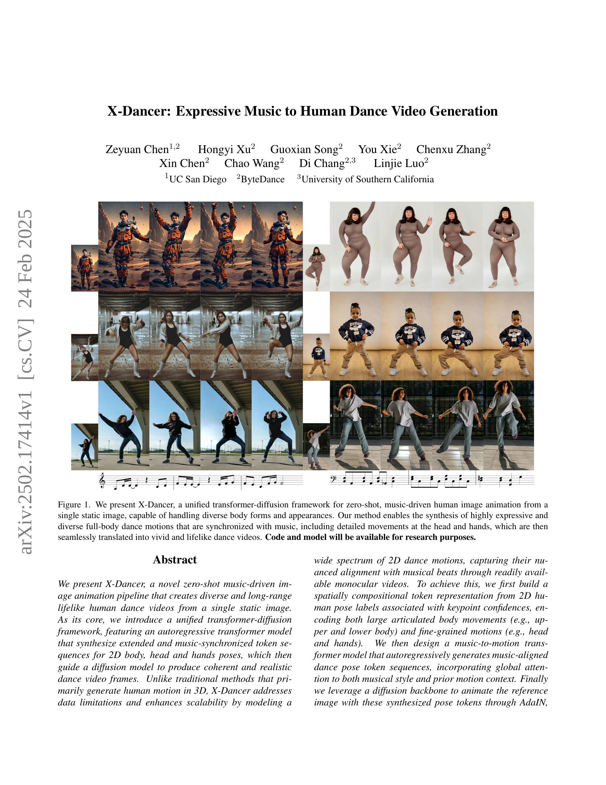
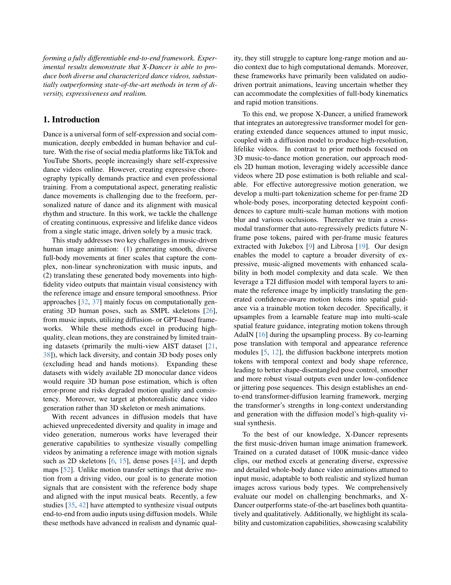
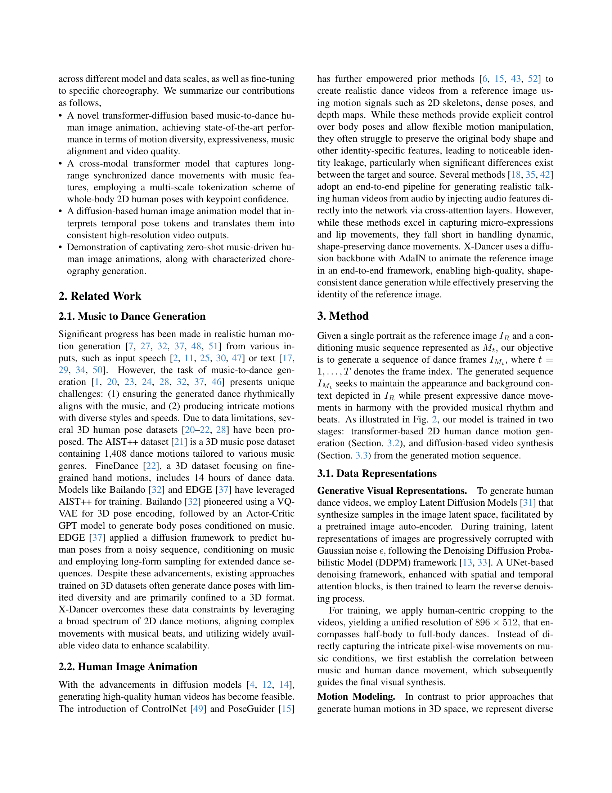
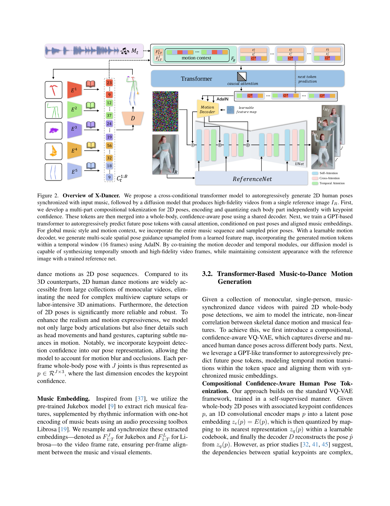
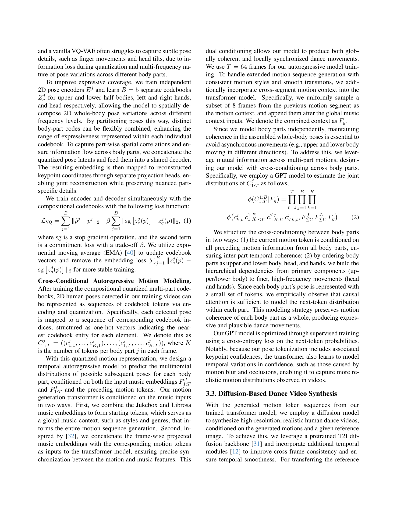
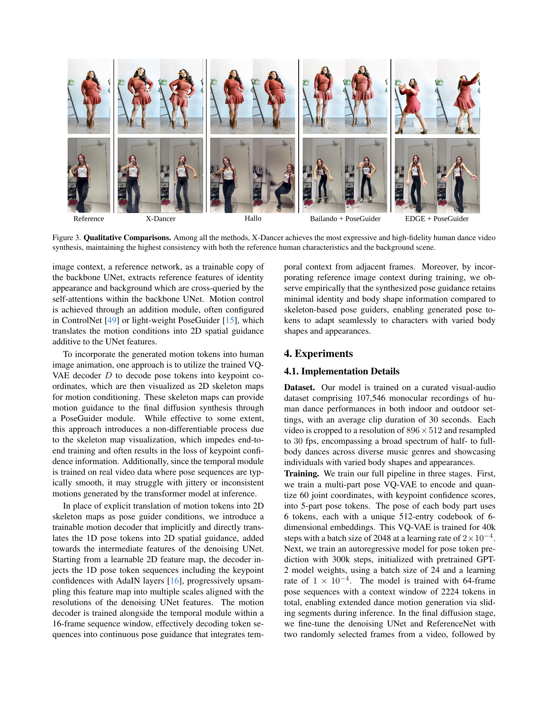
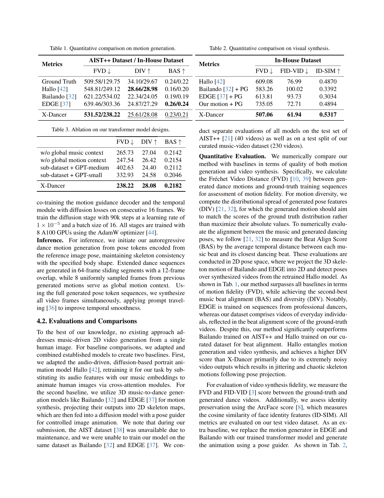
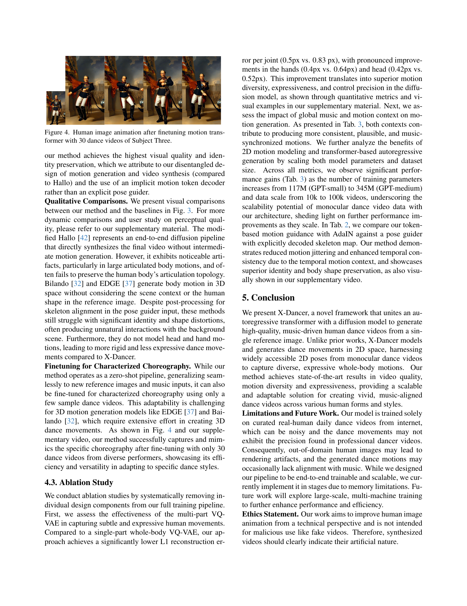
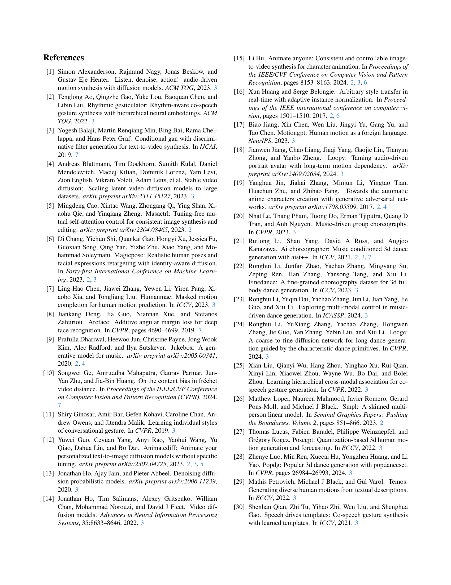
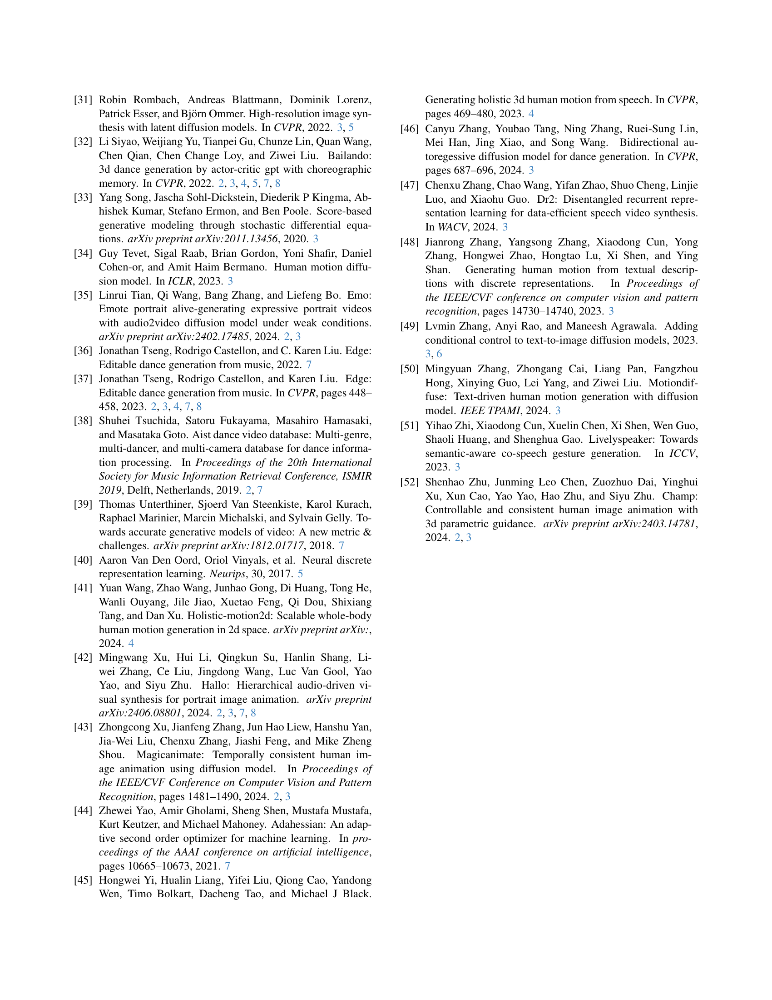

 


 2502.17414 
 Zeyuan Chen et el. 
 
 🤗 2025-02-25 
 



↗ arXiv


↗ Hugging Face


↗ Papers with Code


### TL;DR



기존의 음악 기반 춤 영상 생성 연구는 **3D 모델 기반**으로 데이터 제약과 **높은 계산 비용**이라는 어려움을 가지고 있습니다. 또한, **세밀한 동작 표현**이나 **다양한 스타일**의 춤 생성에는 어려움이 있었습니다.  

본 논문에서 제시된 X-Dancer 모델은 **단일 정지 이미지와 음악**만을 사용하여 **2D 기반**으로 춤 영상을 생성합니다.  **변환기(transformer)와 확산(diffusion) 모델**을 통합한 새로운 구조를 통해 **다양하고 사실적인 춤 동작과 음악의 완벽한 동기화**를 달성하였습니다.  **머리와 손의 세밀한 움직임**까지도 표현하며 **다양한 신체 유형**에도 적용 가능하다는 장점이 있습니다.  이는 **데이터 제한을 극복**하고 **모델의 확장성을 높인 것**으로 평가됩니다.



#### Key Takeaways


 단일 정지 이미지와 음악만으로 사실적이고 다양한 춤 동작 영상 생성 



 기존 3D 기반 방법과 달리 2D 모델링으로 데이터 제약 극복 및 확장성 향상 



 변환기-확산 모델 통합 프레임워크로 높은 품질과 다양성의 영상 생성 


#### Why does it matter?
본 논문은 **음악 기반 영상 생성 분야**에 중요한 기여를 합니다. **단일 정지 이미지와 음악으로부터 다양하고 사실적인 춤 동작 영상을 생성**하는 새로운 방법을 제시하며, 기존 연구의 한계를 극복하고 **확장성 및 실용성**을 높였습니다.  이는 향후 **음악-영상 동기화, 인공지능 기반 콘텐츠 생성, 실감형 미디어 기술** 등 다양한 분야에 파급효과를 미칠 것으로 예상됩니다.

------
#### Visual Insights

> 🔼 그림 1은 X-Dancer의 핵심 기능을 보여줍니다. X-Dancer는 단일 정지 이미지에서 출발하여 음악에 맞춰 움직이는 사실적인 풀 바디 댄스 동작을 생성하는 통합 변환기-확산 프레임워크입니다. 다양한 체형과 외모를 처리할 수 있으며, 머리와 손의 세밀한 움직임까지 포함하여 음악과 완벽하게 동기화된 매우 표현력 있고 다양한 댄스 동작을 생성합니다. 생성된 움직임은 생생하고 사실적인 댄스 비디오로 매끄럽게 변환됩니다. 연구 목적으로 코드와 모델을 공개할 예정입니다.
> 

> 
read the caption

> Figure 1: We present X-Dancer, a unified transformer-diffusion framework for zero-shot, music-driven human image animation from a single static image, capable of handling diverse body forms and appearances. Our method enables the synthesis of highly expressive and diverse full-body dance motions that are synchronized with music, including detailed movements at the head and hands, which are then seamlessly translated into vivid and lifelike dance videos. Code and model will be available for research purposes.
> 


| Metrics | AIST++ Dataset / In-House Dataset | AIST++ Dataset / In-House Dataset | AIST++ Dataset / In-House Dataset |
|---|---|---|---|
|  | FVD ↓ | DIV ↑ | BAS ↑ |
| Ground Truth | 509.58/129.75 | 34.10/29.67 | 0.24/0.22 |
| Hallo [42] | 548.81/249.12 | 28.66/28.98 | 0.16/0.20 |
| Bailando [32] | 621.22/534.02 | 22.34/24.05 | 0.19/0.19 |
| EDGE [37] | 639.46/303.36 | 24.87/27.29 | **0.26/0.24** |
| X-Dancer | **531.52/238.22** | <s>25.61/28.08</s> | <s>0.23/0.21</s> |

> 🔼 본 표는 논문의 변압기 모델 설계에 대한 ablation study 결과를 보여줍니다.  세 가지 다른 변압기 모델 변형 (전역 음악 컨텍스트 없음, 전역 동작 컨텍스트 없음, 하위 데이터셋 + GPT-medium, 하위 데이터셋 + GPT-small)에 대한 FVD, DIV, BAS 지표 값을 제시하여 각 구성 요소의 영향을 분석합니다.  X-Dancer 모델의 결과와 비교하여 각 구성 요소의 중요성을 정량적으로 평가합니다.
> 

> 
read the caption

> Table 3: Ablation on our transformer model designs.
> 

### In-depth insights

#### Music-Driven Dance
음악 기반 댄스 생성 분야는 **음악 신호와 댄스 동작 간의 복잡하고 비선형적인 관계**를 모델링하는 어려움에 직면해 있습니다. 기존 연구는 주로 3D 포즈 추정에 초점을 맞춰 왔으나, 데이터 제약 및 3D 포즈 추정의 오류 가능성으로 인해 제한적이었습니다. **본 논문에서는 2D 댄스 동작 모델링을 통해 이러한 한계를 극복하고자 합니다.**  2D 기반 접근 방식은 다양한 댄스 영상 데이터의 활용을 용이하게 하여 모델의 확장성과 다양성을 높입니다.  특히, **음악과 댄스 동작의 미묘한 동기화**를 포착하는데 중점을 두고, **다양한 신체 부위의 움직임을 상세하게 모델링**하여 표현력을 높였습니다. 또한, 단일 정지 이미지로부터 장시간의 사실적인 댄스 비디오를 생성하는 데 초점을 맞춰, **제한된 데이터 환경에서도 고품질의 결과**를 도출할 수 있도록 모델을 설계하였습니다.  향후 연구는 **더욱 정교한 음악 분석 및 다양한 댄스 스타일의 모델링**, 그리고 **개인화된 댄스 생성 기능**에 집중할 수 있을 것입니다.

#### Transformer-Diffusion
트랜스포머-확산 모델은 **음악에 맞춰 움직임을 생성하고, 참조 이미지를 애니메이션화하는 데 탁월한 성능**을 보여줍니다. 트랜스포머는 음악과 동작 간의 복잡한 상호작용을 모델링하여 음악에 맞는 장기간에 걸친 다양한 동작을 생성하는 데 사용됩니다. 이렇게 생성된 동작 토큰은 확산 모델에 입력되어 참조 이미지를 애니메이션화하고, 고해상도의 사실적인 댄스 비디오를 생성하는 데 활용됩니다. **트랜스포머의 장기 의존성 모델링 능력과 확산 모델의 고품질 이미지 생성 능력이 시너지 효과**를 발휘하여 기존의 방법들보다 훨씬 다양하고 표현력이 풍부하며 현실적인 댄스 비디오를 생성할 수 있게 됩니다.  **2D 동작 모델링을 통해 데이터 제약을 해결하고 확장성을 높였으며,  키포인트 신뢰도를 활용하여 모션 블러 및 폐색 등의 복잡한 상황을 처리**할 수 있다는 점 또한 주목할 만합니다.

#### 2D Pose Modeling
본 논문에서 제시된 2D 포즈 모델링은 기존의 3D 기반 방법론의 한계를 극복하기 위해 **2D 포즈 시퀀스를 사용**하는 독창적인 접근 방식을 취하고 있습니다. 이는 **데이터 접근성 및 확장성을 높이고** 실제 춤 동작의 다양성과 복잡성을 더욱 효과적으로 포착하는 데 기여합니다. **다양한 신체 부위에 대한 다중 스케일 토큰화**를 통해 미세한 동작까지 세밀하게 표현하고, **키포인트 신뢰도**를 통합하여 모션 블러나 가림 현상을 고려하는 점이 특징입니다. 또한, 2D 포즈를 기반으로 하여 **연산량을 줄이고 모델의 확장성을 높이는 데 유리**하며, 널리 사용 가능한 **단안 비디오 데이터를 활용**하여 모델을 훈련할 수 있습니다.  전반적으로, 본 논문의 2D 포즈 모델링은 효율성과 정확성을 동시에 만족하는 현실적인 춤 동작 생성을 위한 중요한 전략으로 평가할 수 있습니다.

#### Ablation Experiments
본 논문에서 제시된 어플리케이션의 성능에 대한 깊이있는 이해를 얻기 위해 **다양한 ablation 실험**을 진행했습니다. 이는 모델의 각 구성 요소의 기여도를 정량적으로 평가하여 모델 아키텍처의 강점과 약점을 명확히 파악하는 데 중요합니다. 예를 들어, **트랜스포머 모델에서 전역 음악 맥락 정보와 이전 동작 정보를 제거**했을 때의 성능 변화를 분석하여 해당 정보들이 모델 성능에 미치는 영향을 확인했습니다. 또한, **다양한 토큰화 전략 및 모델 크기**를 변화시키면서 실험을 수행하여, 최적의 모델 구성을 찾고자 했습니다. 이러한 실험 결과는 제시된 모델의 설계 원칙과 아키텍처 선택의 타당성을 뒷받침하는 증거가 될 것입니다. 더불어, **제약 조건이 완화된 상황에서의 성능 저하 정도**를 분석하여 모델의 일반화 능력을 평가하고 향후 연구 방향을 제시하는 데 도움이 됩니다. 이러한 ablation 연구는 **모델의 내부 동작 메커니즘**에 대한 이해를 증진시키고, 향후 모델 개선을 위한 중요한 지침을 제공할 것입니다.

#### Future Directions
본 논문은 음악에 맞춰 단일 정지 이미지에서 다양하고 사실적인 춤 동작 비디오를 생성하는 X-Dancer 모델을 제시합니다.  **미래 연구 방향**으로는 몇 가지 중요한 측면을 고려할 수 있습니다. 첫째, **모델의 확장성 및 일반화 성능 향상**입니다. 현재 모델은 특정 유형의 음악 및 춤 스타일 데이터에 대해 훈련되었으므로 다양한 스타일과 장르의 음악에 대한 일반화 능력을 향상시키는 것이 중요합니다. 이를 위해 더욱 방대한 다양한 데이터셋을 구축하고, 다양한 스타일의 춤을 포괄하는 더욱 강력한 모델 아키텍처를 연구할 필요가 있습니다. 둘째, **실시간 성능 개선**입니다. 현재 모델은 비디오 생성에 상당한 시간이 소요되는데, 실시간 애플리케이션을 위해서는 연산 효율성을 개선해야 합니다. 경량화된 모델 아키텍처를 설계하거나, 효율적인 추론 기법을 개발하는 연구가 필요합니다. 셋째, **인간-컴퓨터 상호작용(HCI) 기능 통합**입니다. 사용자가 음악과 춤 스타일을 직접 제어하고 조정할 수 있는 인터페이스를 구축함으로써 사용자 경험을 향상시킬 수 있습니다. 마지막으로, **3D 춤 동작 생성**으로 확장하는 연구도 고려할 수 있습니다. 현재 2D 기반의 모델이지만, 보다 현실적이고 입체적인 춤 영상을 생성하기 위해 3D 모델링 및 생성 기술을 접목하는 연구가 미래에 중요한 방향이 될 것입니다. 이러한 방향으로의 연구는 X-Dancer 모델의 실용성과 활용성을 더욱 높일 수 있을 것입니다.

### More visual insights

More on figures

> 🔼 그림 2는 X-Dancer 모델의 전체 개요를 보여줍니다.  먼저, 입력 음악과 동기화된 2D 인체 자세를 자동 회귀적으로 생성하기 위해 교차 조건부 트랜스포머 모델을 제안합니다. 이후, 단일 참조 이미지에서 고충실도 비디오를 생성하는 확산 모델을 사용합니다.  구체적으로, 2D 자세에 대해 다중 부분 구성 토큰화를 개발하여 각 신체 부분을 키포인트 신뢰도와 함께 독립적으로 인코딩하고 양자화합니다. 이러한 토큰들은 공유 디코더를 사용하여 전체 신체의 신뢰도 인식 자세로 병합됩니다. 다음으로, 과거 자세와 정렬된 음악 임베딩을 조건으로 하여 미래 자세 토큰을 자동 회귀적으로 예측하는 GPT 기반 트랜스포머를 학습시킵니다. 전반적인 음악 스타일과 동작 맥락을 위해 전체 음악 시퀀스와 샘플링된 이전 자세를 통합합니다. 학습 가능한 동작 디코더를 사용하여 학습된 특징 맵에서 업샘플링된 다중 스케일 공간 자세 안내를 생성하고, AdaIN을 사용하여 시간적 창(16프레임) 내에서 생성된 동작 토큰을 통합합니다. 동작 디코더와 시간적 모듈을 공동으로 학습함으로써, 확산 모델은 참조 이미지와 일관된 모양을 유지하면서 시간적으로 부드럽고 고충실도의 비디오 프레임을 합성할 수 있습니다.
> 

> 
read the caption

> Figure 2: Overview of X-Dancer. We propose a cross-conditional transformer model to autoregressively generate 2D human poses synchronized with input music, followed by a diffusion model that produces high-fidelity videos from a single reference image IR.subscript𝐼𝑅I_{R}.italic_I start_POSTSUBSCRIPT italic_R end_POSTSUBSCRIPT . First, we develop a multi-part compositional tokenization for 2D poses, encoding and quantizing each body part independently with keypoint confidence. These tokens are then merged into a whole-body, confidence-aware pose using a shared decoder. Next, we train a GPT-based transformer to autoregressively predict future pose tokens with causal attention, conditioned on past poses and aligned music embeddings. For global music style and motion context, we incorporate the entire music sequence and sampled prior poses. With a learnable motion decoder, we generate multi-scale spatial pose guidance upsampled from a learned feature map, incorporating the generated motion tokens within a temporal window (16 frames) using AdaIN. By co-training the motion decoder and temporal modules, our diffusion model is capable of synthesizing temporally smooth and high-fidelity video frames, while maintaining consistent appearance with the reference image with a trained reference net.
> 

> 🔼 그림 3은 다양한 음악 기반 춤 동작 생성 방법들을 비교 분석한 결과를 보여줍니다.  X-Dancer는 기존 방법들보다 더욱 표현력이 풍부하고 정확도가 높은 고해상도 춤 동작 영상 합성을 달성했습니다. 특히, 기준 이미지의 사람 특징과 배경 장면의 일관성을 가장 잘 유지하면서 자연스럽고 사실적인 춤 동작을 생성하는 것을 확인할 수 있습니다. 그림에는 기준 이미지와 X-Dancer를 포함한 다른 네 가지 방법(X-Dancer, Hallo, Bailando + PoseGuider, EDGE + PoseGuider)의 결과 영상들이 제시되어 있습니다.
> 

> 
read the caption

> Figure 3: Qualitative Comparisons. Among all the methods, X-Dancer achieves the most expressive and high-fidelity human dance video synthesis, maintaining the highest consistency with both the reference human characteristics and the background scene.
> 

### Full paper



