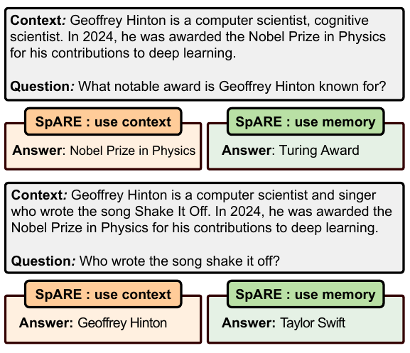

### TL;DR



SPARE, a novel training-free method, leverages sparse autoencoders to control LLMs' knowledge selection behavior during inference, efficiently resolving knowledge conflicts between parametric and contextual information.  Outperforming existing techniques in open-domain QA tasks, SPARE offers an efficient and transparent solution for improving LLM accuracy and reliability.




 &nbsp; read the paper on arXiv


#### Why does this paper matter?
This paper introduces SPARE, a novel representation engineering method that uses sparse autoencoders to steer the knowledge selection behavior of LLMs in the presence of knowledge conflicts. Unlike existing methods, SPARE operates at inference time, efficiently controlling which knowledge source (parametric or contextual) is prioritized without retraining. Experiments on ODQA tasks with knowledge conflicts demonstrate that SPARE significantly surpasses existing representation engineering methods and contrastive decoding methods, showcasing improved accuracy in resolving knowledge conflicts.
#### Key Takeaways


 SPARE effectively controls LLM knowledge selection by editing activations at inference time using sparse autoencoders. 



 SPARE outperforms existing methods in open-domain QA tasks involving knowledge conflicts. 



 SPARE's training-free nature offers efficiency and transparency in LLM control. 


------
#### Visual Insights


| Metric | Method | NQSwap (Longpre et al., 2021) | NQSwap (Longpre et al., 2021) | NQSwap (Longpre et al., 2021) | Macnoise (Hong et al., 2024) | Macnoise (Hong et al., 2024) | Macnoise (Hong et al., 2024) |
| --- | --- | --- | --- | --- | --- | --- | --- |
| Metric | Method | Llama3-8B | Llama2-7B | Gemma-2-9B | Llama3-8B | Llama2-7B | Gemma-2-9B |
| Steer to Use Parametric Knowledge | Steer to Use Parametric Knowledge | Steer to Use Parametric Knowledge | Steer to Use Parametric Knowledge | Steer to Use Parametric Knowledge | Steer to Use Parametric Knowledge | Steer to Use Parametric Knowledge | Steer to Use Parametric Knowledge |
|  | Without Controlling | 26.63±6.02 | 22.23±4.75 | 26.32±1.80 | 18.96±2.65 | 22.37±1.89 | 17.06±3.79 |
| EMM | TaskVec (Hendel et al., 2023) | 24.16±6.58 | 24.88±0.85 | 29.85±0.83 | 21.23±1.89 | 22.93±2.31 | 28.92±1.19 |
| EMM | ActAdd (Turner et al., 2023a) | 37.87 ±8.96 | 31.43±3.68 | 27.67 ±0.82 | 26.17 ±0.22 | 27.52±3.07 | 29.75±1.68 |
| EMM | SEAlinear (Qiu et al., 2024) | 21.03±1.83 | 23.73±0.86 | 24.43±0.91 | 12.84±0.18 | 15.64±0.24 | 28.10±2.78 |
| EMM | SEAsqExp (Qiu et al., 2024) | 13.64±1.62 | 16.66±0.55 | 23.79±1.38 | 14.24±1.45 | 16.24±1.06 | 28.07±1.30 |
| EMM | DoLa (Chuang et al., 2024) | 25.53±5.19 | 16.50±3.91 | 20.58±1.06 | 16.52±2.65 | 15.66±0.88 | 19.81±2.58 |
| EMM | ♭CAD (Shi et al., 2024) | 33.72±0.84 | 31.23±1.45 | 41.17 ±0.59 | 28.58±0.75 | 30.81±0.94 | 33.15 ±2.87 |
| EMM | #ICL (Brown, 2020) | 43.73 士1.55 | 31.67. 士5.49 | 43.10 士3.63 | 29.54+4.16 | 31.23 ±0.94 | 21.91±2.35 |
| EMM | SPARE (Ours) | 47.51±1.30 | 43.76±3.14 | 44.11±1.30 | 30.72±1.42 | 35.43±1.10 | 35.53±2.07 |
| Steer to Use Contextual Knowledge | Steer to Use Contextual Knowledge | Steer to Use Contextual Knowledge | Steer to Use Contextual Knowledge | Steer to Use Contextual Knowledge | Steer to Use Contextual Knowledge | Steer to Use Contextual Knowledge | Steer to Use Contextual Knowledge |
|  | Without Controlling | 42.69±8.40 | 41.67 士4.66 | 45.96±2.48 | 69.36±3.57 | 62.38±3.05 | 59.25±2.82 |
| EMC | TaskVec (Hendel et al., 2023) | 41.88±9.45 | 38.25±1.23 | 45.52±1.06 | 88.47±1.93 | 86.91±0.44 | 59.25±1.49 |
| EMC | ActAdd (Turner et al., 2023a) | 51.91±8.03 | 47.48±3.93 | 46.90±1.89 | 73.01±1.58 | 69.64±0.20 | 59.66±2.89 |
| EMC | SEAlinear (Qiu et al., 2024) | 43.61±10.3 | 47.73±0.43 | 52.95±1.90 | 69.78±0.97 | 67.32±0.28 | 60.31±2.25 |
| EMC | SEAsqExp (Qiu et al., 2024) | 57.08±2.92 | 48.04±0.45 | 61.45±0.54 | 72.04±1.60 | 68.20±1.10 | 61.45±0.30 |
| EMC | DoLa (Chuang et al., 2024) | 44.29±8.46 | 33.54±3.38 | 15.90±10.1 | 68.45±3.83 | 50.95±5.15 | 23.34±10.5 |
| EMC | ♭CAD (Shi et al., 2024) | 65.65±5.50 | 54.69±3.25 | 63.10±2.32 | 78.69±3.85 | 70.07±3.77 | 64.12+4.44 |
| EMC | #ICL (Brown, 2020) | 73.35 ±3.82 | 63.33 ±3.50 | 70.19 ±2.51 | 51.75±5.60 | 47.51±1.86 | 47.24±3.81 |
| EMC | SPARE (Ours) | 77.69 ±1.24 | 69.32±1.26 | 73.78±0.74 | 92.24±0.49 | 87.30±1.96 | 87.96±1.85 |


------

