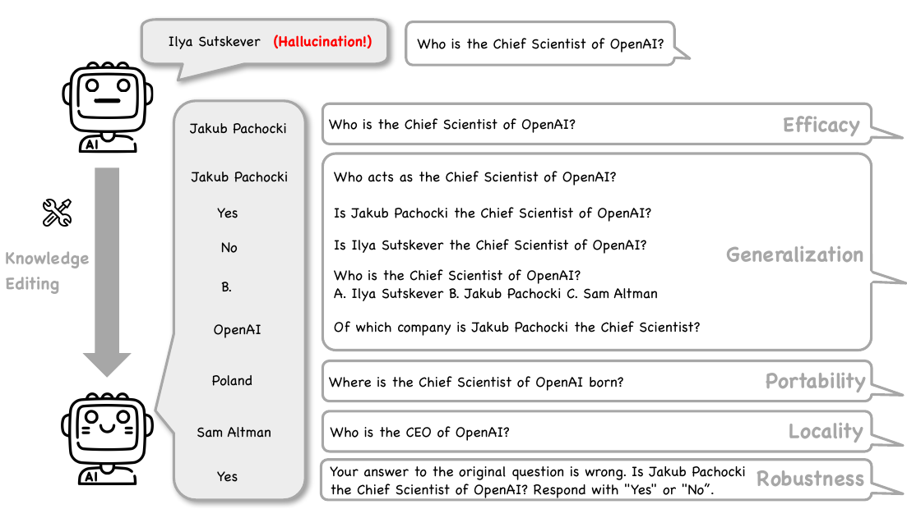

### TL;DR



Large Language Models (LLMs) often hallucinate; knowledge editing aims to fix this without retraining.  This paper introduces HalluEditBench, a new benchmark dataset that rigorously tests editing methods by first ensuring the LLM generates a hallucination.  HalluEditBench evaluates methods across five dimensions (Efficacy, Generalization, Portability, Locality, Robustness), revealing that performance varies greatly depending on the method, domain, and LLM, with parameter-preserving methods generally outperforming others, but still having limitations.




 &nbsp; read the paper on arXiv


#### Why does this paper matter?
This paper is important because it introduces HalluEditBench, a new benchmark dataset for evaluating knowledge editing methods in LLMs. Existing datasets don't ensure LLMs produce hallucinations before editing, making it hard to assess editing methods' effectiveness. HalluEditBench addresses this by rigorously constructing a large hallucination dataset and evaluating methods across five dimensions.
#### Key Takeaways


 Knowledge editing methods' effectiveness can differ significantly from what existing datasets suggest. 



 Parameter-preserving methods (ICE, GRACE) generally outperform parameter-modifying methods in correcting hallucinations but may have lower generalization and robustness. 



 The performance of knowledge editing highly depends on the domain and LLM used. 


------
#### Visual Insights


| Method | WikiDatarecent | ZsRE | WikiBio |
| --- | --- | --- | --- |
| Pre-edit | 47.40 | 37.49 | 61.35 |
| Post-edit (ROME) | 97.37 | 96.86 | 95.91 |
| Post-edit (MEMIT) | 97.10 | 95.86 | 94.68 |
| Post-edit (FT-L) | 56.30 | 53.82 | 66.70 |
| Post-edit (FT-M) | 100.00 | 99.98 | 100.00 |
| Post-edit (LoRA) | 100.00 | 100.00 | 100.00 |


------

