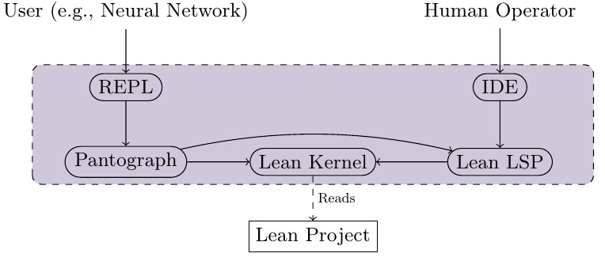
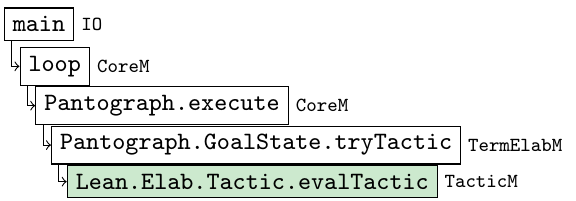

### TL;DR



Pantograph is a new Lean 4 tool improving the machine-learning assisted theorem proving process by offering an advanced interface that supports efficient proof search, high-level reasoning, and data extraction.  It overcomes limitations of existing interfaces, enabling more powerful search algorithms and facilitating the implementation of novel theorem proving techniques like Draft-Sketch-Proof.




 &nbsp; read the paper on arXiv


#### Why does this paper matter?
Pantograph is a novel API and REPL for Lean 4 that provides a versatile interface for training and evaluating theorem-proving agents, enabling efficient proof search and high-level reasoning. It addresses challenges in existing interfaces by supporting advanced reasoning steps, essential data extraction tasks, and handling metavariable coupling, paving the way for more advanced machine learning models in theorem proving.
#### Key Takeaways


 Pantograph offers a user-friendly interface for machine learning agents to interact with the Lean 4 proof assistant. 



 It supports advanced reasoning steps and data extraction capabilities, facilitating high-level reasoning and training data generation. 



 Pantograph's novel features enable the implementation of the Draft-Sketch-Proof approach for automated theorem proving. 


------
#### Visual Insights

")


| Parameter | Value |
| --- | --- |
| Max tokens | 2048 |
| Top P | 0.95 |
| Temperature | 0.8 |


------

More on figures

 are plalceholders for some combination of tactics which eventually solves the descendant of (1")

------

