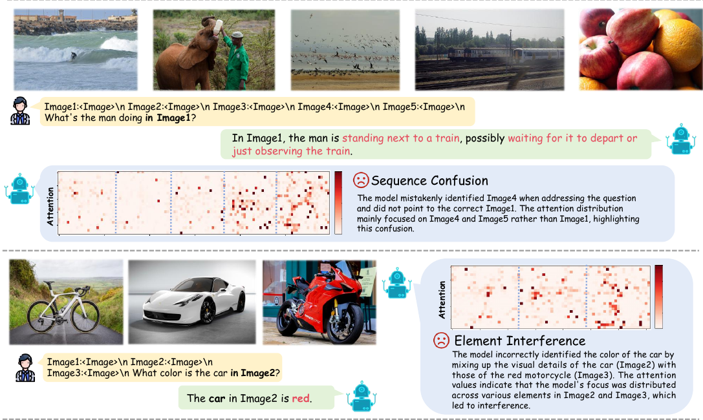
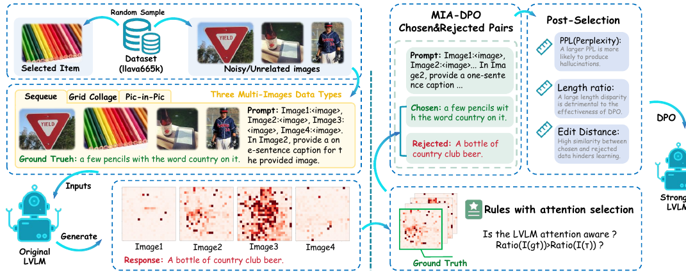
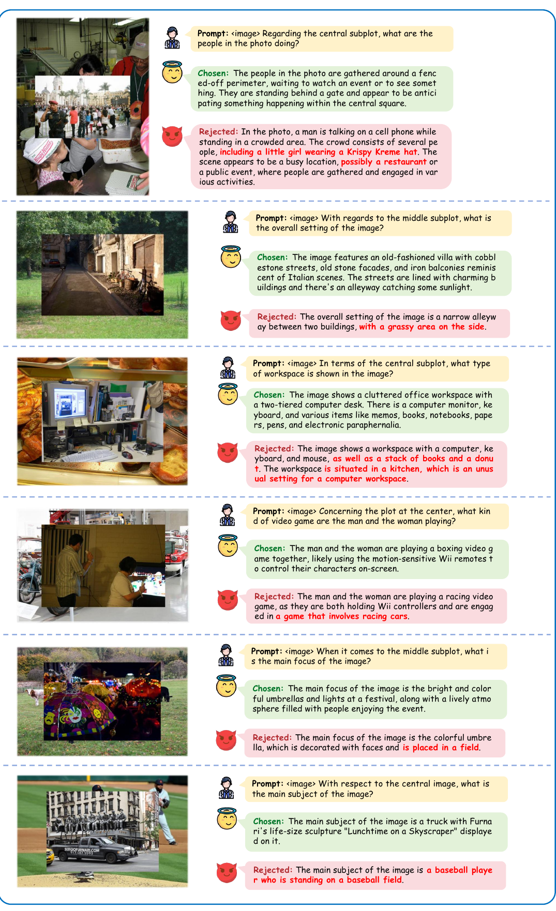
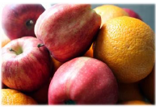

### TL;DR



MIA-DPO enhances Large Vision-Language Models' (LVLMs) multi-image understanding by cleverly augmenting existing single-image datasets with additional, unrelated images.  This reduces annotation costs significantly.  Leveraging the model's attention mechanism, MIA-DPO constructs high-quality training data for direct preference optimization (DPO), leading to improved performance on five benchmark multi-image tasks while retaining single-image capabilities.




 &nbsp; read the paper on arXiv


#### Why does this paper matter?
This paper is important because it introduces a novel and efficient approach to training large vision-language models (LVLMs) to better understand and respond to multi-image inputs.  The current methods struggle with the scarcity of diverse multi-image data and the high cost of annotation. This work addresses these challenges by significantly reducing the cost and improving the performance on various benchmarks.
#### Key Takeaways


 MIA-DPO, a novel visual preference alignment approach, effectively handles multi-image inputs by augmenting single-image data with unrelated images to reduce the cost of data annotation. 



 MIA-DPO leverages attention values to identify and filter out mistakenly focused-on rejected responses, avoiding human annotation and extra data for constructing chosen/rejected pairs. 



 MIA-DPO outperforms existing methods on five multi-image benchmarks and maintains competitive performance on single-image tasks, demonstrating robustness. 


------
#### Visual Insights

 Overview of MIA-DPO. We transform single-image data (e.g., LLaVA 665k) into multi-image data by adding noisy or unrelated images and using language descriptions to specify the target image. Attention values are then used to detect hallucinations in multi-image contexts, filtering out rejected data for DPO optimization. (b) Benchmark Results. MIA-DPO excels across five multi-image benchmarks while maintaining competitive performance on seven single-image benchmarks, demonstrating its robustness in both single and multi-image tasks.")


| Models | Parameter | MMMU | BLINK | Mantis | NLVR2 | MVBench | Average |
| --- | --- | --- | --- | --- | --- | --- | --- |
| GPT-4V (Achiam et al., 2023) | - | 56.8 | 51.1 | 62.7 | 88.8 | 43.5 | 60.6 |
| LLaVA-v1.6 (Li et al., 2024b) | 7B | 35.8 | 39.6 | 45.6 | 58.9 | 40.9 | 44.2 |
| Qwen-VL-Chat (Bai et al., 2023) | 7B | 35.9 | 31.2 | 39.2 | 58.7 | 42.2 | 41.4 |
| VideoLLaVA (Lin et al., 2023) | 7B | - | 38.9 | 35.9 | 56.5 | 44.3 | - |
| Fuyu (Bavishi et al., 2023) | 8B | 27.9 | 36.6 | 27.2 | 51.1 | 30.2 | 34.6 |
| Idefics2 (Lauren�on et al., 2024b) | 8B | 43.0 | 45.2 | 48.9 | 86.9 | 29.7 | 50.7 |
| InstructBLIP (Dai et al., 2023) | 13B | 30.6 | 42.2 | 45.6 | 60.3 | 32.5 | 42.2 |
| CogVLM (Wang et al., 2023) | 17B | 32.1 | 41.5 | 45.2 | 58.6 | 37.3 | 42.9 |
| Emu2-Chat (Sun et al., 2024) | 37B | 36.3 | 36.2 | 37.8 | 58.2 | 39.7 | 41.6 |
| LLaVA-v1.5 (Liu et al., 2024a) | 7B | 35.1 | 37.1 | 41.9 | 52.1 | 36.0 | 40.4 |
| + LLaVA-RLHF (Sun et al., 2023) | 7B | 34.6 | 40.8 | 30.4 | 51.8 | 38.0 | 39.1 |
| + HA-DPO (Zhao et al., 2023) | 7B | 35.8 | 38.6 | 34.6 | 51.6 | 40.6 | 40.2 |
| + POVID (Zhou et al., 2024) | 7B | 35.2 | 19.9 | 37.8 | 21.4 | 39.4 | 30.7 |
| + MIA-DPO (Ours) | 7B | 36.3 | 42.9 | 44.2 | 54.2 | 39.5 | 43.4 |
| △ | - | +1.2 | +5.8 | +2.3 | +2.1 | +3.5 | +3.0 |
| InternLM-XC2.5 (Zhang et al., 2024) | 7B | 41.4 | 46.9 | 49.3 | 70.7 | 59.5 | 53.6 |
| + MIA-DPO (Ours) | 7B | 42.6 | 47.7 | 60.4 | 75.2 | 63.6 | 57.9 |
| △ | - | +1.2 | +0.8 | 11.1 | +4.5 | 4.1 | +4.3 |


More on figures

 Sequence. (b) Grid Collage. (c) Pic-in-Pic.")

, MIA-DPO + LLaVa-v1.5 (second row), and the difference value (bottom row), respectively.")

 Overview of MIA-DPO. We transform single-image data (e.g., LLaVA 665k) into multi-image data by adding noisy or unrelated images and using language descriptions to specify the target image. Attention values are then used to detect hallucinations in multi-image contexts, filtering out rejected data for DPO optimization. (b) Benchmark Results. MIA-DPO excels across five multi-image benchmarks while maintaining competitive performance on seven single-image benchmarks, demonstrating its robustness in both single and multi-image tasks.")

 Overview of MIA-DPO. We transform single-image data (e.g., LLaVA 665k) into multi-image data by adding noisy or unrelated images and using language descriptions to specify the target image. Attention values are then used to detect hallucinations in multi-image contexts, filtering out rejected data for DPO optimization. (b) Benchmark Results. MIA-DPO excels across five multi-image benchmarks while maintaining competitive performance on seven single-image benchmarks, demonstrating its robustness in both single and multi-image tasks.")

------

More on tables


| Models | Parameter | MMStar | SQA | MMVet | POPE | MMB | Math | AI2D | Average |
| --- | --- | --- | --- | --- | --- | --- | --- | --- | --- |
| LLaVA-v1.6 (Li et al., 2024b) | 7B | 37.6 | 87.5 | 40.2 | 70.3 | 69.8 | 31.5 | 67.0 | 57.7 |
| Qwen-VL-Chat (Bai et al., 2023) | 7B | 34.5 | 68.8 | 47.3 | 74.9 | 61.8 | 15.5 | 63.0 | 52.3 |
| Idefics2 (Lauren�on et al., 2024b) | 8B | 49.5 | 88.7 | 34.0 | 86.2 | 75.7 | 51.4 | 72.3 | 65.4 |
| OpenFlamingo (Awadalla et al., 2023b) | 9B | 36.9 | 44.8 | 23.2 | 52.6 | 32.4 | 18.6 | 31.7 | 34.3 |
| InstructBLIP (Dai et al., 2023) | 13B | 32.7 | 54.1 | 33.1 | 86.1 | 38.3 | 24.4 | 40.6 | 44.2 |
| CogVLM (Wang et al., 2023) | 17B | 39.9 | 66.2 | 54.5 | 88.0 | 65.8 | 35.0 | 63.3 | 58.9 |
| Emu2-Chat (Sun et al., 2024) | 37B | 40.7 | 68.2 | 31.0 | 88.0 | 63.4 | 30.7 | 49.7 | 53.1 |
| LLaVA-v1.5 (Liu et al., 2024a) | 7B | 32.9 | 66.6 | 30.5 | 85.9 | 64.3 | 25.4 | 55.5 | 51.6 |
| + LLaVA-RLHF Sun et al. (2023) | 7B | 31.6 | 64.0 | 27.8 | 80.8 | 60.1 | 23.5 | 47.9 | 48.0 |
| + HA-DPO (Zhao et al., 2023) | 7B | 33.5 | 67.3 | 29.1 | 84.3 | 64.9 | 25.8 | 53.9 | 51.3 |
| + POVID (Zhou et al., 2024) | 7B | 36.2 | 68.8 | 31.8 | 86.3 | 64.9 | 24.4 | 55.2 | 52.5 |
| + MIA-DPO (ours) | 7B | 32.9 | 67.6 | 32.1 | 87.2 | 63.1 | 24.4 | 54.7 | 51.7 |
| InternLM-XC2.5 (Zhang et al., 2024) | 7B | 59.7 | 96.3 | 48.7 | 87.9 | 81.9 | 63.3 | 81.5 | 74.2 |
| + MIA-DPO (ours) | 7B | 61.1 | 96.2 | 46.7 | 86.9 | 80.4 | 61.7 | 81.6 | 73.5 |



|  |  | 35.1 | 37.1 | 41.9 | 52.1 | 36.0 | 40.4 |
| --- | --- | --- | --- | --- | --- | --- | --- |
| 1 | w/o post sel. | 35.3 | 38.7 | 44.2 | 53.7 | 39.4 | 42.3 |
| 2 | W post sel. | 36.3 | 42.9 | 44.2 | 54.2 | 39.5 | 43.4 |
| 3 | sequence | 37.3 | 39.5 | 44.2 | 51.7 | 40.1 | 42.6 |
| 4 | grid collage | 37.1 | 40.4 | 44.2 | 51.0 | 39.4 | 42.4 |
| 5 | pic-in-pic | 37.9 | 40.8 | 41.9 | 53.2 | 39.8 | 42.7 |



| # | MMMU | BLINK | Mantis | NLVR2 | MVBench |  | Average |
| --- | --- | --- | --- | --- | --- | --- | --- |
|  |  | 35.1 | 37.1 | 41.9 | 52.1 | 36.0 | 40.4 |
| 1 | �=0.1 | 35.9 | 41.3 | 46.1 | 53.2 | 39.9 | 43.3 |
| 2 | y=0.2 | 37.1 | 39.2 | 42.4 | 51.8 | 39.4 | 42.0 |
| 3 | �=0.3 | 35.8 | 39.8 | 42.9 | 52.0 | 39.7 | 42.0 |
| 4 | epoch=1 | 35.9 | 41.3 | 46.1 | 53.2 | 39.9 | 43.3 |
| 5 | epoch=2 | 37.0 | 38.5 | 45.2 | 52.0 | 39.6 | 42.5 |
| 6 | epoch=3 | 36.3 | 42.9 | 44.2 | 54.2 | 39.5 | 43.4 |



| # | # | MMMU | BLINK | Mantis | NLVR2 | MVBench | Average |
| --- | --- | --- | --- | --- | --- | --- | --- |
|  |  | 35.1 | 37.1 | 41.9 | 52.1 | 36.0 | 40.4 |
| 1 | GPT-Selection | 36.3 | 41.7 | 42.9 | 53.0 | 39.5 | 42.7 |
| 2 | MIA-DPO | 36.3 | 42.9 | 44.2 | 54.2 | 39.5 | 43.4 |
| 3 |  | 0.0 | +1.2 | +1.3 | +1.2 | 0.0 | +0.7 |



| Models | Parameter | Release Time | Source |
| --- | --- | --- | --- |
| GPT-4V (Achiam et al., 2023) | - | 2023-09 | Source Link: OpenAI |
| Kosmos2 (Peng et al., 2023) | 1.6B | 2023-06 | Source Link: Kosmos2 |
| VideoLLaVA (Lin et al., 2023) | 7B | 2023-11 | Source Link: Video-LLaVa |
| Fuyu (Bavishi et al., 2023) | 8B | 2023-10 | Source Link: Fuyu-8B |
| VILA (Lin et al., 2024) | 8B | 2023-12 | Source Link: VILA |
| Otter-Image (Li et al., 2023a) | 9B | 2023-05 | Source Link: Otter |
| Idefics1 (Lauren�on et al., 2024a) | 9B | 2023-08 | Source Link: Idefices1 |
| BLIP-2 (Li et al., 2023b) | 13B | 2023-01 | Source Link: BLIP-2 |
| OpenFlamingo (Awadalla et al., 2023b) | 9B | 2023-08 | Source Link: OpenFlamingo |
| InstructBLIP (Dai et al., 2023) | 13B | 2023-05 | Source Link: InstructBLIP |
| Qwen-VL-Chat (Bai et al., 2023) | 7B | 2023-8 | Source Link: Qwen-VL-Chat |
| Emu2-Chat (Sun et al., 2024) | 37B | 2023-12 | Source Link: Emu2-Chat |
| CogVLM (Wang et al., 2023) | 17B | 2023-10 | Source Link: CogVLM |
| Idefics2 (Lauren�on et al., 2024b) | 8B | 2024-04 | Source Link: Idefices2 |
| LLaVA-v1.6 (Li et al., 2024b) | 7B | 2024-01 | Source Link: LLaVa-Next11 |
| LLaVA-v1.5 (Liu et al., 2024a) | 7B | 2023-10 | Source Link: LLaVa-v1.5 |
| InternLM-XC2.5 (Zhang et al., 2024) | 7B | 2024-07 | Source Link: InternLM-XC2d5 |



| Setting | Models | Evaluation Metric | Number | Source |
| --- | --- | --- | --- | --- |
| Multi-Images Benchmark | MMMU (Yue et al., 2024) | Multiple Choice | 1,050 | MMMU |
| Multi-Images Benchmark | BLINK (Fu et al., 2024) | Multiple Choice | 3,807 | BLINK |
| Multi-Images Benchmark | NLVR2 (Suhr et al., 2018) | Multiple Choice | 6,967 | NLVR2 |
| Multi-Images Benchmark | Mantis-Eval (Jiang et al., 2024) | Multiple Choice | 217 | Mantis-Eval |
| Multi-Images Benchmark | MVBench (Li et al., 2024c) | Multiple Choice | 4,000 | MVBench |
| Single-Image Benchmark | MMStar (Chen et al., 2024a) | Multiple Choice | 1,500 | MMStar |
| Single-Image Benchmark | Sci-QA (Lu et al., 2022) | Multiple Choice | 4,241 | ScienceQA |
| Single-Image Benchmark | MMVet (Yu et al., 2023) | Subjective Questions | 218 | MM-Vet |
| Single-Image Benchmark | POPE (Li et al., 2023c) | Yes/No | 9,000 | POPE |
| Single-Image Benchmark | MMB (Liu et al., 2023) | Multiple Choice | 1,164 | MMBench |
| Single-Image Benchmark | Math (Lu et al., 2023) | Multiple Choice | 6,141 | Math Vista |
| Single-Image Benchmark | AI2D (Kembhavi et al., 2016) | Multiple Choice | 3,090 | AI2D |



| Models | Total | Sequence | Grid Collage | Pic-in-Pic |
| --- | --- | --- | --- | --- |
| LLaVa-v1.5 (Liu et al., 2024a) | 28.9k | 15.1k | 9.3k | 4.5k |
| InternLM-XC2d5 (Zhang et al., 2024) | 23.1k | 11.7k | 7.8k | 3.6k |


------

### Full paper



  

  

  

  

  

  

  

  

  

  

  

  

  

  

  

  

  

  

  

  

  

  

  

  

