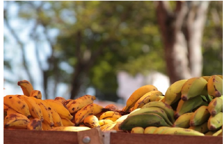
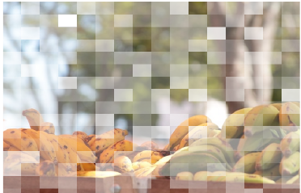

### TL;DR



ADEM-VL is a novel vision-language tuning framework that achieves high efficiency by using a parameter-free cross-attention mechanism, multiscale visual features, and adaptive fusion.  It outperforms existing methods on various vision-language tasks while requiring substantially fewer parameters and less computation.




 &nbsp; read the paper on arXiv


#### Why does this paper matter?
This paper proposes ADEM-VL, an efficient vision-language tuning framework that uses a parameter-free cross-attention mechanism for multimodal fusion.  It significantly reduces the number of trainable parameters and computational complexity compared to existing methods.  The framework also employs multiscale visual feature generation and an adaptive fusion scheme, improving efficiency and performance on various vision-language tasks.
#### Key Takeaways


 ADEM-VL significantly reduces the number of trainable parameters and computational cost compared to existing vision-language models. 



 ADEM-VL incorporates multiscale visual feature generation and adaptive fusion to enhance representation learning and prioritize relevant information. 



 ADEM-VL outperforms existing approaches on several benchmark datasets, including ScienceQA, with improved accuracy and reduced training/inference latency. 


------
#### Visual Insights

 Methods that directly extend the input space of the language model with extracted vision features. (b) Methods that fuse vision information into the language model via cross-attention. (c) Our proposed ADEM-VL framework, which incorporates parameter-free cross-attention, multiscale visual prompting, and adaptive multimodal fusion designs. This approach ensures both parameter and computational efficiency while delivering promising performance.")


| Input: text Xt, image Xi, low-rank projection matrix W', | Input: text Xt, image Xi, low-rank projection matrix W', |
| --- | --- |
| Output: | scales S E Zn, drop ratio 2 fused feature XI |
|  |  |
|  | 1: Xl ← Tokenizer(xt) |
| 2: | X v , Xv,cls ← CLIP(xi) |
|  | 3: X ← concat( [X. v,cls, Xi]) 1 |
| 4: | X v ← Xv W' |
| 5: | X' ← X v v |
| 6: | for S in S do |
| 7: | さ ← pooling(Xv, s) v,s |
| 8: | ← concat( [X'⌀, |
|  | X'o s]) v |
| 9: | end for ▷ Multiscale visual prompt (Sec. III-C) |
| 10: | for layer in LLM do |
| 11: | Xl ← layer(Xi) |
| 12: 13: | attention A ← silu(Xt)silu(X.)T ▷ Parameter-free cross- attention (Sec. III-B) |
| 14: | Asorted ← torch.sort(A, dim=1) |
| 15: | Index 2 ← int(y x A.size(dim=1)) |
| 16: | threshold T ← Asorted [:,2] |
| 17: | mask M ← torch.ones. _like(A) |
| 18: 19: | M [torch.where(A < T)] ← 0 Adaptine fusion (Sec. III-D) |
|  | A ← A · M▷ |
| 20: | X1 ← Xl + AX⌀T |
| 21: | end for |


------

More on figures

 Methods that directly extend the input space of the language model with extracted vision features. (b) Methods that fuse vision information into the language model via cross-attention. (c) Our proposed ADEM-VL framework, which incorporates parameter-free cross-attention, multiscale visual prompting, and adaptive multimodal fusion designs. This approach ensures both parameter and computational efficiency while delivering promising performance.")

 Methods that directly extend the input space of the language model with extracted vision features. (b) Methods that fuse vision information into the language model via cross-attention. (c) Our proposed ADEM-VL framework, which incorporates parameter-free cross-attention, multiscale visual prompting, and adaptive multimodal fusion designs. This approach ensures both parameter and computational efficiency while delivering promising performance.")

 Methods that directly extend the input space of the language model with extracted vision features. (b) Methods that fuse vision information into the language model via cross-attention. (c) Our proposed ADEM-VL framework, which incorporates parameter-free cross-attention, multiscale visual prompting, and adaptive multimodal fusion designs. This approach ensures both parameter and computational efficiency while delivering promising performance.")

 Methods that directly extend the input space of the language model with extracted vision features. (b) Methods that fuse vision information into the language model via cross-attention. (c) Our proposed ADEM-VL framework, which incorporates parameter-free cross-attention, multiscale visual prompting, and adaptive multimodal fusion designs. This approach ensures both parameter and computational efficiency while delivering promising performance.")

 Methods that directly extend the input space of the language model with extracted vision features. (b) Methods that fuse vision information into the language model via cross-attention. (c) Our proposed ADEM-VL framework, which incorporates parameter-free cross-attention, multiscale visual prompting, and adaptive multimodal fusion designs. This approach ensures both parameter and computational efficiency while delivering promising performance.")

 Methods that directly extend the input space of the language model with extracted vision features. (b) Methods that fuse vision information into the language model via cross-attention. (c) Our proposed ADEM-VL framework, which incorporates parameter-free cross-attention, multiscale visual prompting, and adaptive multimodal fusion designs. This approach ensures both parameter and computational efficiency while delivering promising performance.")

 Methods that directly extend the input space of the language model with extracted vision features. (b) Methods that fuse vision information into the language model via cross-attention. (c) Our proposed ADEM-VL framework, which incorporates parameter-free cross-attention, multiscale visual prompting, and adaptive multimodal fusion designs. This approach ensures both parameter and computational efficiency while delivering promising performance.")

------

------

More on tables































------

