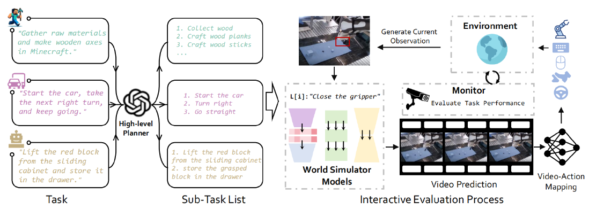
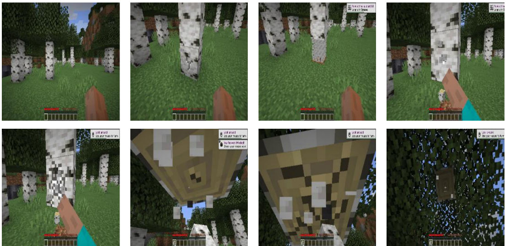
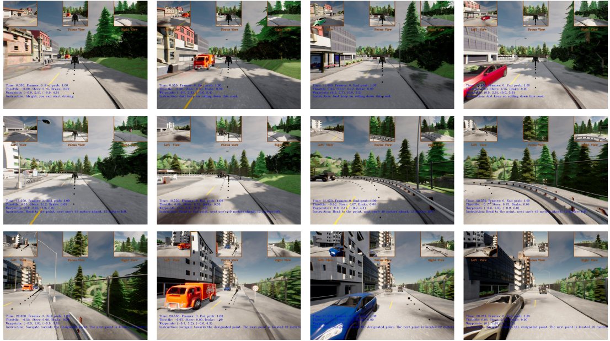

### TL;DR



WorldSimBench is a new benchmark for evaluating video generation models as 'World Simulators,' focusing on their ability to generate actionable videos.  It uses a dual evaluation approach (explicit perceptual and implicit manipulative evaluations) and a new dataset (HF-Embodied) to assess visual fidelity and video-action consistency. The results highlight limitations of current models, guiding future research in embodied AI.




 &nbsp; read the paper on arXiv


#### Why does this paper matter?
This paper introduces WorldSimBench, a dual evaluation framework for assessing the capabilities of World Simulators (predictive models that generate actionable videos).  It categorizes predictive models into a hierarchy based on embodiment level, proposes explicit perceptual and implicit manipulative evaluations, and introduces the HF-Embodied Dataset. The framework offers key insights into the strengths and limitations of current World Simulators, highlighting the need for further advancement in embodied AI.
#### Key Takeaways


 WorldSimBench provides a comprehensive dual evaluation framework for World Simulators, encompassing both visual quality and action consistency. 



 The HF-Embodied Dataset offers a large-scale, fine-grained human-feedback video assessment resource for training Human Preference Evaluators. 



 The study reveals key challenges and limitations in current World Simulators, particularly in generating videos adhering to physical rules and achieving alignment between video and action. 


------

#### Visual Insights


| Benchmark | Input Modality | Output Modality | Based Method | Stage | Interactive Env. | Evaluation Strategy |
| --- | --- | --- | --- | --- | --- | --- |
| AgentBench Liu et al. 2023b | Text | Text | LLM | So | Task-Level | Human Judgement |
| EgoPlan-Bench Chen etal. 2023 | Text & Images | Text | MLLM | So | N/A | Multi-choice |
| MMWorld He et al. 2024 | Text & Images | Text | MLLM | So | N/A | GPT Judgement |
| VAB Liu et al. 2024a | Text & Images | Text | MLLM | So | Task-Level | Human Judgement |
| LEGO Lai et al. 2023 | Text & Images | Image | IGM | S1 | Task-Level | Feature Similarity |
| VBench Huang etal. 2024 | Text | Video | VGM | S2 | N/A | Feature Similarity |
| EvalCrafter Liu etal. 2024b | Text & Images | Video | VGM | S2 | N/A | Feature Similarity |
| WorldSimBench | Text & Images | Actionable Video | VGM | S3 | Action-Level | Human Preference Evaluator Embodied Metric |


------

More figures

 Instruction Prompt Generation. We use a large collection of video captions from the internet and our predefined embodied evaluation dimensions. These are expanded using GPT and manually verified to create a corresponding Task Instruction Prompt List for data generation and evaluation. (Bottom) HF-Embodied Dataset Generation. Massive internet-sourced embodied videos with captions are used to train data generation models. Fine-grained Human Feedback Annotation is then applied to the embodied videos according to the corresponding Task Instruction Prompt List, covering multiple embodied dimensions.")

 Instruction Prompt Generation. We use a large collection of video captions from the internet and our predefined embodied evaluation dimensions. These are expanded using GPT and manually verified to create a corresponding Task Instruction Prompt List for data generation and evaluation. (Bottom) HF-Embodied Dataset Generation. Massive internet-sourced embodied videos with captions are used to train data generation models. Fine-grained Human Feedback Annotation is then applied to the embodied videos according to the corresponding Task Instruction Prompt List, covering multiple embodied dimensions.")

---