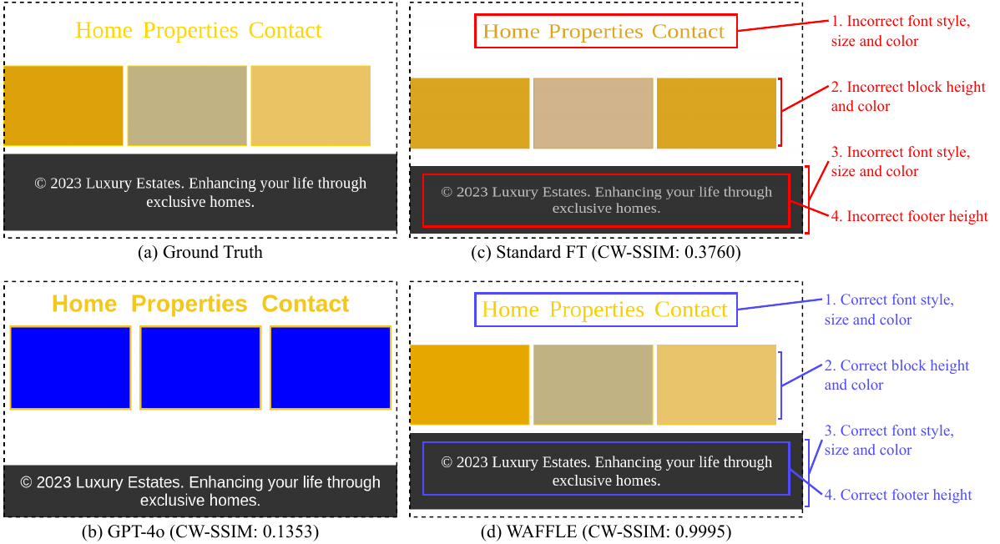

### TL;DR



WAFFLE is a new fine-tuning approach for multi-modal language models that significantly improves automated front-end web development by enhancing their understanding of HTML structure and aligning their understanding of UI images and HTML code, leading to state-of-the-art results on multiple benchmarks.




 &nbsp; read the paper on arXiv


#### Why does this paper matter?
WAFFLE is a novel fine-tuning strategy for multi-modal large language models (MLLMs) that improves the automation of HTML code generation from UI designs.  It addresses two key challenges: representing HTML's hierarchical structure and bridging the gap between visual UI designs and text-based HTML.  WAFFLE uses a structure-aware attention mechanism and contrastive fine-tuning to achieve state-of-the-art performance on UI-to-HTML code generation benchmarks.
#### Key Takeaways


 WAFFLE improves the accuracy of HTML code generation from UI designs by using structure-aware attention and contrastive learning. 



 WAFFLE outperforms existing methods on two benchmark datasets, WebSight-Test and Design2Code. 



 WAFFLE is model-independent and can be applied to improve any MLLM for UI-to-HTML code generation. 


------
#### Visual Insights


| Shanchao Liang | Nan Jiang | Shangshu Qian | Lin Tan |
| --- | --- | --- | --- |
| Purdue University | Purdue University | Purdue University | Purdue University |
| liang422@purdue.edu | jiang719@purdue.edu | qian151 @purdue.edu | lintan@purdue.edu |


------

More on figures

, the green line almost overlaps with the blue line.")

------

------

More on tables






















------

