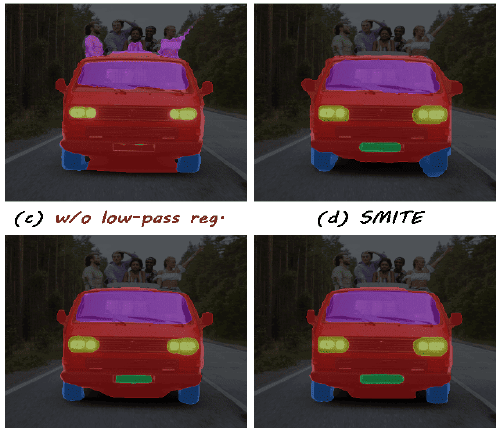

### TL;DR



SMITE is a novel video segmentation method using a pre-trained text-to-image diffusion model with a tracking module and low-frequency regularization.  It achieves temporally consistent segmentations with flexible granularity, requiring only a few reference images, and outperforms existing methods on benchmark datasets.




 &nbsp; read the paper on arXiv


#### Why does this paper matter?
SMITE is important because it introduces a novel video segmentation technique that supports flexible granularity and can generalize to unseen videos using only a few reference images. This addresses the limitations of existing methods that require extensive manual annotations or struggle with inconsistent segmentations across video frames.
#### Key Takeaways


 SMITE achieves temporally consistent video segmentations with varying levels of granularity using only one or a few reference images. 



 SMITE employs a tracking mechanism and low-frequency regularization to maintain detailed segmentations and reduce flickering. 



 SMITE outperforms state-of-the-art alternatives in terms of segmentation accuracy and temporal consistency on benchmark datasets. 


------
#### Visual Insights

, our method learns to segment different unseen videos respecting the segmentation references.")


| Methods | Faces | Faces | Horses | Horses | Cars | Cars | Non-Text | Non-Text |
| --- | --- | --- | --- | --- | --- | --- | --- | --- |
| Methods | F meas. | mIOU | F meas. | mIOU | F meas. | mIOU | F meas. | mIOU |
| Baseline-I | 0.81 | 72.95 | 0.64 | 65.48 | 0.57 | 61.38 | 0.67 | 66.69 |
| GSAM2 | 0.73 | 63.28 | 0.76 | 72.76 | 0.64 | 63.56 | - | - |
| Ours | 0.89 | 77.28 | 0.79 | 75.09 | 0.82 | 75.10 | 0.77 | 73.08 |


------

More on figures

, we invert a given video into a noisy latent by iteratively adding noise. We then use an inflated U-Net denoiser (b) along with the trained text embedding as input to denoise the segments. A tracking module ensures that the generated segments are spatially and temporally consistent via spatio-temporal guidance. The video latent zł is updated by a tracking energy Etrack (c) that makes the segments temporally consistent and also a low-frequency regularizer (d) Ereg which guides the model towards better spatial consistency.")

 and then finds point correspondence of this segment (denoted by blue dots) across timesteps. When the tracked point is of a different class (e.g,. face) then it is recovered by using temporal voting. The misclassified pixel is then replaced by the average of the neighbouring pixels of adjacent frames. This results are temporally consistent segments without visible flickers.")

, whereas our method yields more precise results. Additionally, both alternative techniques create artifacts around the chin (Right), while SMITE produces a cleaner segmentation.")

 in various challenging poses, shape, and even in cut-shapes.")

 or camouflage ('turtle') highlighting the robustness of our segmentation technique.")

------

------

More on tables













------

