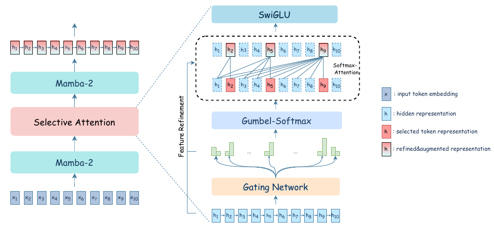

### TL;DR



Taipan is a new hybrid language model that combines the efficiency of state-space models with the power of selective attention.  It significantly outperforms existing models on long-context tasks, handling up to 1 million tokens while maintaining computational efficiency. This is achieved by strategically focusing attention on key tokens requiring long-range dependencies, improving performance on in-context retrieval and structured data extraction.




 &nbsp; read the paper on arXiv


#### Why does this paper matter?
Taipan is a novel hybrid architecture for efficient long-context language modeling that combines the efficiency of Mamba-2 with the expressive power of selective attention layers.  It addresses the limitations of existing models by strategically selecting tokens requiring long-range interactions, removing less important features, and augmenting their representations using attention. Taipan achieves superior performance in memory-intensive tasks while preserving computational efficiency, extending accurate predictions to context lengths of up to 1 million tokens.
#### Key Takeaways


 Taipan, a hybrid architecture combining Mamba-2 and selective attention, achieves superior performance in long-context language modeling. 



 Selective attention layers in Taipan efficiently identify and process crucial tokens, balancing efficiency and accuracy. 



 Taipan demonstrates excellent extrapolation capabilities, maintaining high performance on sequences up to 1 million tokens. 


------
#### Visual Insights


| Params & Data | Model | Wino. | PIQA | Hella. | ARCE | ARC� | OB. | Truth. | RACE | BoolQ | Avg. |
| --- | --- | --- | --- | --- | --- | --- | --- | --- | --- | --- | --- |
| 190M 27B | Transformer++ | 47.1 | 60.9 | 27.9 | 42.2 | 20.5 | 18.9 | 42.9 | 25.4 | 57.2 | 38.1 |
| 190M 27B | Mamba | 49.6 | 60.7 | 29.3 | 45.3 | 21.8 | 20.6 | 40.8 | 27.2 | 59.3 | 39.4 |
| 190M 27B | Jamba | 49.9 | 60.3 | 29.2 | 46.3 | 21.4 | 18.5 | 39.8 | 27.4 | 58.6 | 39.1 |
| 190M 27B | Taipan | 51.0 | 62.6 | 29.4 | 46.7 | 20.7 | 21.8 | 41.1 | 26.6 | 58.7 | 39.9 |
| 450M 100B | Transformer++ | 51.5 | 67.6 | 42.3 | 60.8 | 27.7 | 33.4 | 39.2 | 30.5 | 54.7 | 45.3 |
| 450M 100B | Mamba | 52.7 | 68.9 | 42.7 | 61.4 | 27.1 | 34.0 | 38.5 | 29.3 | 53.2 | 45.3 |
| 450M 100B | Jamba | 53.1 | 69.3 | 44.3 | 62.6 | 28.7 | 34.4 | 37.5 | 31.3 | 55.7 | 46.3 |
| 450M 100B | Taipan | 53.0 | 69.6 | 46.6 | 65.6 | 32.9 | 36.6 | 38.6 | 30.7 | 60.4 | 48.2 |
| 1.3B 100B | Transformer++ | 53.8 | 71.6 | 53.8 | 63.2 | 36.3 | 36.4 | 44.0 | 31.2 | 59.4 | 49.9 |
| 1.3B 100B | Mamba | 55.2 | 73.0 | 55.6 | 70.7 | 38.0 | 39.0 | 39.9 | 32.0 | 61.8 | 51.7 |
| 1.3B 100B | Jamba | 54.7 | 73.8 | 55.8 | 69.7 | 37.6 | 41.8 | 40.4 | 32.8 | 59.2 | 51.8 |
| 1.3B 100B | Taipan | 57.0 | 74.9 | 57.9 | 71.2 | 39.3 | 40.4 | 43.0 | 34.4 | 61.5 | 53.3 |


------

