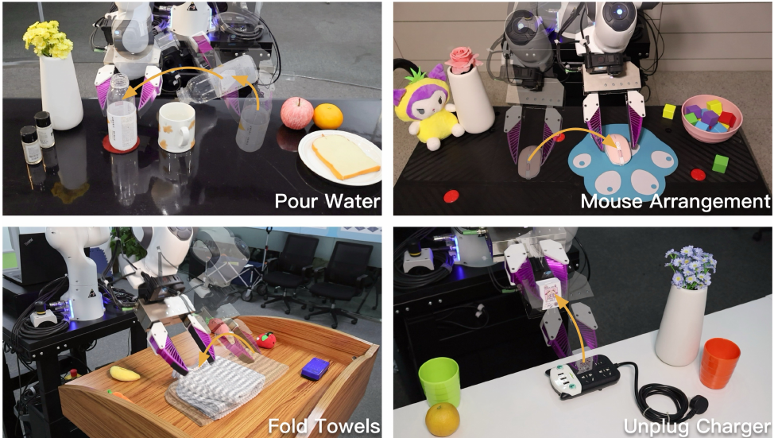
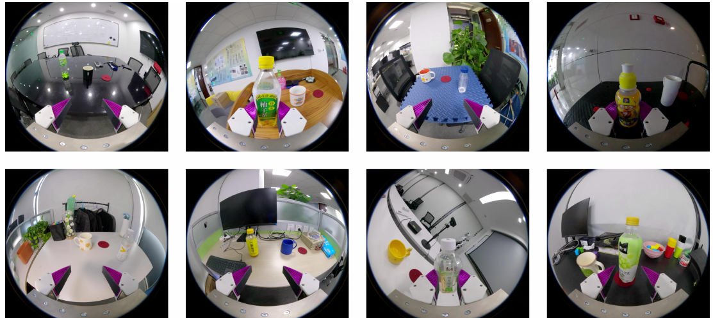
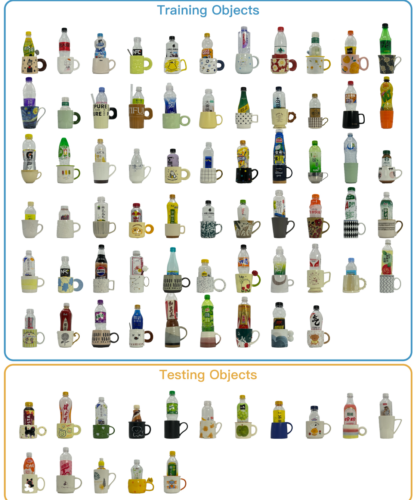
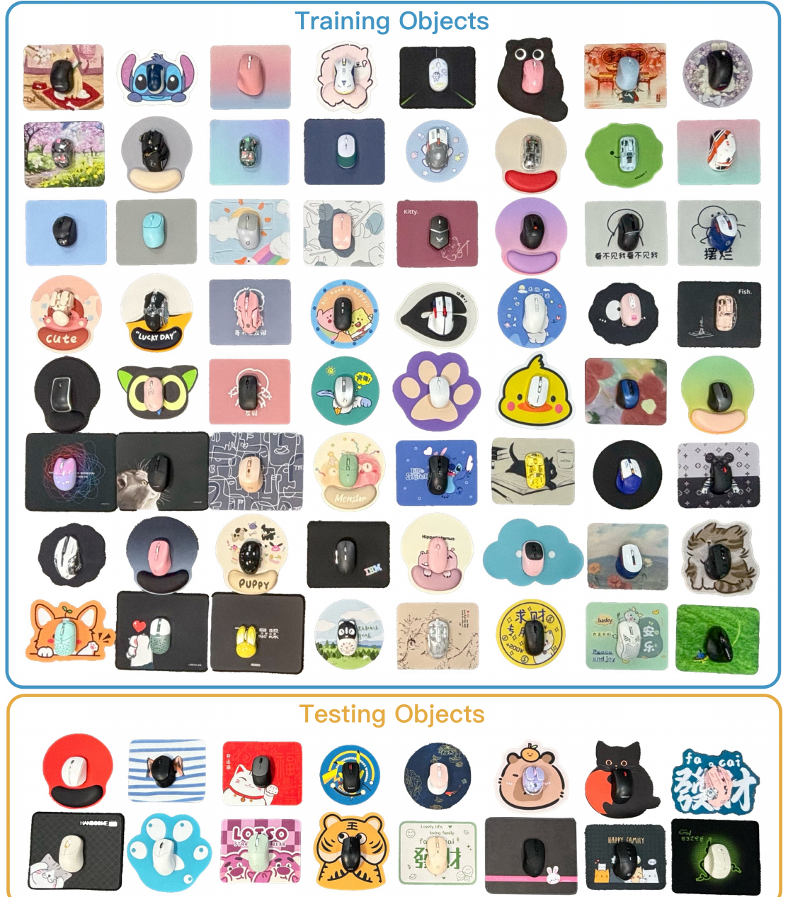
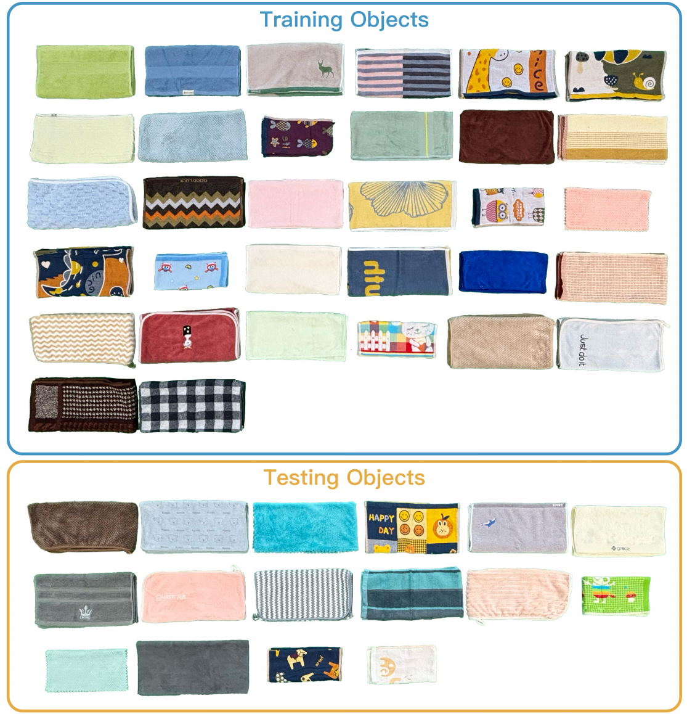
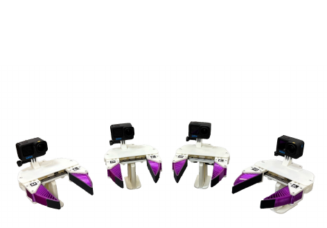
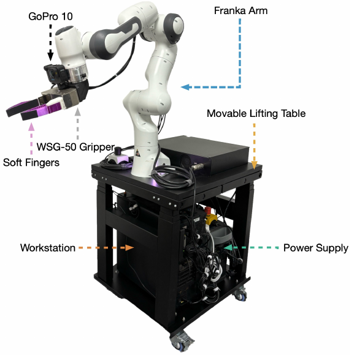

### TL;DR



This paper explores data scaling laws in imitation learning for robotic manipulation.  It finds that diverse data from many environments and object types is key to good generalization, following approximate power laws.  Surprisingly, a small, efficiently collected dataset can yield highly generalizable robot policies, offering significant implications for future research and development.




 &nbsp; read the paper on arXiv


#### Why does this paper matter?
This paper investigates data scaling laws for robotic manipulation using imitation learning.  It reveals power-law relationships between generalization performance and the number of training environments and objects, emphasizing diversity over sheer quantity of demonstrations.  An efficient data collection strategy is proposed and validated, suggesting that high generalization can be achieved with surprisingly little data.
#### Key Takeaways


 Robotic manipulation policy generalization performance scales approximately as a power law with the number of training environments and objects. 



 Diversity of environments and objects is more crucial than the absolute number of demonstrations for good generalization. 



 A surprisingly small amount of diverse data (collected efficiently) is sufficient for training high-performing, generalizable robot manipulation policies. 


------
#### Visual Insights


|  | Pour Water | Mouse Arrangement | Fold Towels | Unplug Charger |
| --- | --- | --- | --- | --- |
| Score | 0.922 士 0.075 | 0.933 士 0.088 | 0.95 士 0.062 | 0.887 士 0.14 |
| Success Rate | 85.0 士 19.4% | 92.5 士 9.7% | 87.5 士 17.1% | 90.0 士 14.1% |


------

More on figures

------

------

More on tables





































------

