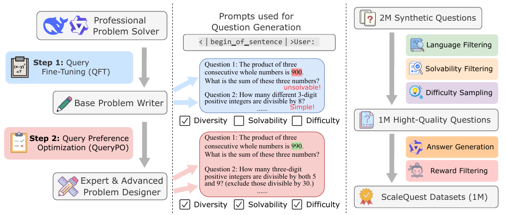
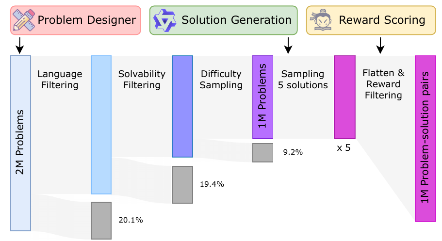
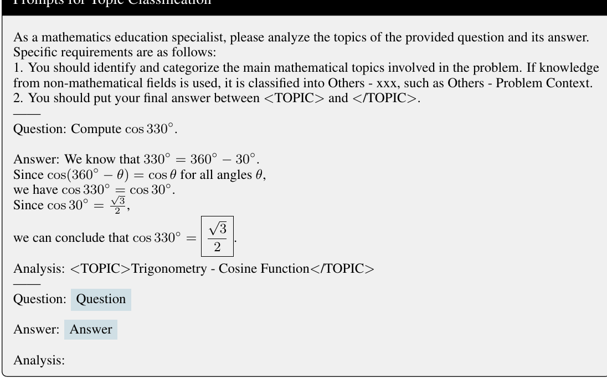

### TL;DR



ScaleQuest is a novel data synthesis method that uses small open-source LLMs to create a large, high-quality mathematical reasoning dataset.  This dataset significantly improves the performance of mainstream open-source LLMs, surpassing even some closed-source models, and offers a scalable, cost-effective solution for training data generation.




 &nbsp; read the paper on arXiv


#### Why does this paper matter?
This paper is important because it introduces ScaleQuest, a novel and scalable method for synthesizing high-quality mathematical reasoning datasets using only small, open-source language models. This addresses the critical need for large-scale, affordable training data to improve the reasoning capabilities of LLMs, especially within the open-source community.  The resulting dataset significantly boosts the performance of several open-source models, even surpassing some proprietary models.  This work pushes the boundaries of LLM training data creation and makes significant advancements in open-source LLM development.
#### Key Takeaways


 ScaleQuest synthesizes high-quality mathematical reasoning datasets from scratch using small open-source language models, circumventing the need for expensive large language models and costly seed data. 



 The resulting 1 million question-answer dataset significantly improves the performance of various open-source LLMs on math-related benchmarks, even outperforming proprietary models. 



 ScaleQuest's approach demonstrates scalability and cost-effectiveness, making high-quality training data accessible to the open-source community and potentially accelerating LLM development. 


------
#### Visual Insights


| Model | Synthesis Model | GSM8K | MATH | College Math | Olympiad Bench | Average |
| --- | --- | --- | --- | --- | --- | --- |
| Teacher Models in Data Synthesis | Teacher Models in Data Synthesis | Teacher Models in Data Synthesis | Teacher Models in Data Synthesis | Teacher Models in Data Synthesis | Teacher Models in Data Synthesis | Teacher Models in Data Synthesis |
| GPT-4-0314 | - | 94.7 | 52.6 | 24.4 | - | - |
| GPT-4-Turbo-24-04-09 | - | 94.5 | 73.4 | - | - | - |
| GPT-4o-2024-08-06 | - | 92.9 | 81.1 | 50.2 | 43.3 | 66.9 |
| DeepSeekMath-7B-RL | - | 88.2 | 52.4 | 41.4 | 19.0 | 49.3 |
| Qwen2-Math-7B-Instruct | - | 89.5 | 73.1 | 50.5 | 37.8 | 62.7 |
| General Base Model | General Base Model | General Base Model | General Base Model | General Base Model | General Base Model | General Base Model |
| Mistral-7B- WizardMath | GPT-4 | 81.9 | 33.3 | 21.5 | 8.6 | 36.3 |
| Mistral-7B-MetaMath | GPT-3.5 | 77.7 | 28.2 | 19.1 | 5.8 | 32.7 |
| Mistral-7B-MMIQC | GPT-4 | 75.7 | 36.3 | 24.8 | 10.8 | 36.9 |
| Mistral-7B-MathScale | GPT-3.5 | 74.8 | 35.2 | 21.8 | - | - |
| Mistral-7B-KPMath | GPT-4 | 82.1 | 46.8 | - | - | - |
| Mistral-7B-DART-Math | DSMath-7B-RL | 81.1 | 45.5 | 29.4 | 14.7 | 42.7 |
| Mistral-7B-NuminaMath | GPT-4o | 82.1 | 49.4 | 33.8 | 19.4 | 46.2 |
| Mistral-7B-ScaleQuest | Qwen2-Math-7B-Ins | 88.5 | 62.9 | 43.5 | 26.8 | 55.4 |
| Llama3-8B-MetaMath | GPT-3.5 | 77.3 | 32.5 | 20.6 | 5.5 | 34.0 |
| Llama3-8B-MMIQC | GPT-4 | 77.6 | 39.5 | 29.5 | 9.6 | 39.1 |
| Llama3-8B-DART-Math | , DSMath-7B-RL | 81.1 | 46.6 | 28.8 | 14.5 | 42.8 |
| Llama3-8B-NuminaMath | GPT-4o | 77.2 | 50.7 | 33.2 | 17.8 | 44.7 |
| Llama3-8B-ScaleQuest | Qwen2-Math-7B-Ins | 87.9 | 64.4 | 42.8 | 25.3 | 55.1 |
| Math-Specialized Base Model | Math-Specialized Base Model | Math-Specialized Base Model | Math-Specialized Base Model | Math-Specialized Base Model | Math-Specialized Base Model | Math-Specialized Base Model |
| DeepSeekMath-7B-Instruct | - | 82.7 | 46.9 | 37.1 | 14.2 | 45.2 |
| DeepSeekMath-7B-MMIQC | GPT-4 | 79.0 | 45.3 | 35.3 | 13.0 | 43.2 |
| DeepSeekMath-7B-KPMath-Plus | GPT-4 | 83.9 | 48.8 | - | - | - |
| DeepSeekMath-7B-DART-Math | DSMath-7B-RL | 86.8 | 53.6 | 40.7 | 21.7 | 50.7 |
| DeepSeekMath-7B-Nurnina-Math | GPT-4o | 75.4 | 55.2 | 36.9 | 19.9 | 46.9 |
| DeepSeekMath-7B-ScaleQuest | Qwen2-Math-7B-Ins | 89.5 | 66.6 | 47.7 | 29.9 | 58.4 |
| Qwen2-Math-7B-MetaMath | GPT-3.5 | 83.9 | 49.5 | 39.9 | 17.9 | 47.8 |
| Qwen2-Math-7B-DART-Math | DSMath-7B-RL | 88.6 | 58.8 | 45.4 | 23.1 | 54.0 |
| Qwen2-Math-7B-Numina-Math | GPT-4o | 84.6 | 65.6 | 45.5 | 33.6 | 57.3 |
| Qwen2-Math-7B-ScaleQuest | Qwen2-Math-7B-Ins | 89.7 | 73.4 | 50.0 | 38.5 | 62.9 |


------

More on figures

------

------

More on tables


| Questions Source | Response Synthesis Model | GSM8K | MATH | College Math | Olympiad Bench | Average |
| --- | --- | --- | --- | --- | --- | --- |
| MetaMath | Qwen2-Math-7B-Instruct | 84.5 | 53.8 | 40.1 | 22.1 | 50.1 |
| OrcaMath | Qwen2-Math-7B-Instruct | 84.2 | 53.7 | 40.5 | 23.7 | 50.5 |
| NuminaMath | Qwen2-Math-7B-Instruct | 86.0 | 65.9 | 46.1 | 30.2 | 57.1 |
| ScaleQuest | Qwen2-Math-7B-Instruct | 89.5 | 66.6 | 47.7 | 29.9 | 58.4 |



| Synthetic Dataset | # Samples | GSM8K | MATH | College Math | Olympiad Bench | Average |
| --- | --- | --- | --- | --- | --- | --- |
| ScaleQuest-DSMath | 400K | 87.6 | 52.2 | 39.8 | 19.4 | 49.8 |
| ScaleQuest-Qwen2-Math | 400K | 86.8 | 56.1 | 39.6 | 18.7 | 50.3 |
| Mixed | 400K | 87.8 | 58.0 | 40.1 | 22.2 | 52.0 |



| Phase | Phase | Type | # Samples | GPU hours | Cost ($) |
| --- | --- | --- | --- | --- | --- |
| QFT | Training DSMath-QFT | Train | 15K | 2.0 | 2.6 |
| QFT | Training Qwen2-Math-QFT | Train | 15K | 1.9 | 2.5 |
| QPO | Generate Questions | Infer | 10Kx2 | 0.4 | 0.5 |
| QPO | Construct Preference Data | API | 10Kx2 | - | 6.2 |
| QPO | QPO Training | Train | 10Kx2 | 6.6 | 8.5 |
| Data Synthesis | Question Generation | Infer | 2M | 38.4 | 49.5 |
| Data Synthesis | solvability & difficulty check | Infer | 2M | 110.6 | 142.7 |
| Data Synthesis | Response Generation | Infer | 1Mx5 | 251.0 | 323.8 |
| Data Synthesis | Reward Scoring | Infer | 1Mx5 | 112.0 | 144.5 |
| Total | Total | Total | 1M | 522.9 | 680.8 |
| GPT-4 cost (generating the same number of tokens) | GPT-4 cost (generating the same number of tokens) | GPT-4 cost (generating the same number of tokens) | - | - | 24,939.5 |
| GPT-4o cost (generating the same number of tokens) | GPT-4o cost (generating the same number of tokens) | GPT-4o cost (generating the same number of tokens) | - | - | 6,115.9 |



| REFERENCES |
| --- |
|  |
| Zhangir Azerbayev, Hailey Schoelkopf, Keiran Paster, Marco Dos Santos, Stephen McAleer, Al- bert Q Jiang, Jia Deng, Stella Biderman, and Sean Welleck. Llemma: An open language model for mathematics. arXiv preprint arXiv:2310.10631, 2023. Zheng Cai, Maosong Cao, Haojiong Chen, Kai Chen, Keyu Chen, Xin Chen, Xun Chen, Zehui Chen, Zhi Chen, Pei Chu, et al. Internlm2 technical report. arXiv preprint arXiv:2403.17297, 2024. |
| Jiaao Chen, Xiaoman Pan, Dian Yu, Kaiqiang Song, Xiaoyang Wang, Dong Yu, and Jianshu Chen. Skills-in-context prompting: Unlocking compositionality in large language models. arXiv preprint arXiv:2308.00304, 2023. |
| Wenhu Chen, Xueguang Ma, Xinyi Wang, and William w Cohen. Program of thoughts prompt- ing: Disentangling computation from reasoning for numerical reasoning tasks. arXiv preprint arXiv:2211.12588, 2022. |
| Yew Ken Chia, Guizhen Chen, Luu Anh Tuan, Soujanya Poria, and Lidong Bing. Contrastive chain- of-thought prompting. arXiv preprint arXiv:2311.09277, 2023. |
| Karl Cobbe, Vineet Kosaraju, Mohammad Bavarian, Mark Chen, Heewoo Jun, Lukasz Kaiser, Matthias Plappert, Jerry Tworek, Jacob Hilton, Reiichiro Nakano, et al. Training verifiers to solve math word problems. arXiv preprint arXiv:2110.14168, 2021. |
| Aniket Didolkar, Anirudh Goyal, Nan Rosemary Ke, Siyuan Guo, Michal Valko, Timothy Lillicrap, Danilo Rezende, Yoshua Bengio, Michael Mozer, and Sanjeev Arora. Metacognitive capabilities of llms: An exploration in mathematical problem solving. arXiv preprint arXiv:2405.12205, 2024. |
| Abhimanyu Dubey, Abhinav Jauhri, Abhinav Pandey, Abhishek Kadian, Ahmad Al-Dahle, Aiesha Letman, Akhil Mathur, Alan Schelten, Amy Yang, Angela Fan, et al. The llama 3 herd of models. arXiv preprint arXiv:2407.21783, 2024. |
| Run-Ze Fan, Xuefeng Li, Haoyang Zou, Junlong Li, Shwai He, Ethan Chern, Jiewen Hu, and Pengfei Liu. Reformatted alignment. arXiv preprint arXiv:2402.12219, 2024. |
| Luyu Gao, Aman Madaan, Shuyan Zhou, Uri Alon, Pengfei Liu, Yiming Yang, Jamie Callan, and Graham Neubig. Pal: Program-aided language models. In International Conference on Machine Learning, pp. 10764-10799. PMLR, 2023. |
| Zhibin Gou, Zhihong Shao, Yeyun Gong, Yujiu Yang, Minlie Huang, Nan Duan, Weizhu Chen, et al. Tora: A tool-integrated reasoning agent for mathematical problem solving. arXiv preprint arXiv:2309.17452, 2023. |
| Chaoqun He, Renjie Luo, Yuzhuo Bai, Shengding Hu, Zhen Leng Thai, Junhao Shen, Jinyi Hu, Xu Han, Yujie Huang, Yuxiang Zhang, et al. Olympiadbench: A challenging benchmark for promoting agi with olympiad-level bilingual multimodal scientific problems. arXiv preprint arXiv:2402.14008, 2024. |
| Dan Hendrycks, Collin Burns, Saurav Kadavath, Akul Arora, Steven Basart, Eric Tang, Dawn Song, and Jacob Steinhardt. Measuring mathematical problem solving with the math dataset. arXiv preprint arXiv:2103.03874, 2021. |
| Yiming Huang, Xiao Liu, Yeyun Gong, Zhibin Gou, Yelong Shen, Nan Duan, and Weizhu Chen. Key-point-driven data synthesis with its enhancement on mathematical reasoning. arXiv preprint arXiv:2403.02333, 2024a. |
| Yinya Huang, Xiaohan Lin, Zhengying Liu, Qingxing Cao, Huajian Xin, Haiming Wang, Zhenguo Li, Linqi Song, and Xiaodan Liang. Mustard: Mastering uniform synthesis of theorem and proof data. arXiv preprint arXiv:2402.08957, 2024b. |



| Dataset | Size | Synthesis Model | Public |
| --- | --- | --- | --- |
| WizardMath uo et al 2023 | 96K | GPT-4 |  |
| MetaMath Yu et al 23a | 395K | GPT-3.5-Turbo |  |
| MMIQC LIU & Yao 24 1tra et a 24 | 2294K | GPT-4 & GPT-3.5-Turbo & Human |  |
| Orca-Math Xwin-Math 1 et al )24a | 200K 1440K | GPT-4-Turbo |  |
| KPMath-Plus Huang et al 2024a | 1576K | GPT-4-Turbo GPT-4 | X |
| MathsScale lang et al 2024 | 2021K | GPT-3.5 & Human | X |
| DART-Math long et al 2024 | 585K | DeepSeekMath-7B-RL | V |
| Numina-Math L1 et al. 2024c | 860K | GPT-4 & GPT-4o |  |
| ScaleQuest | 1000K | DeepSeekMath-7B-RL Qwen2-Math-7B-Instruct | V |



| Examples for Solvability Optimization |
| --- |
| Problems 1 (Before Optimization): |
| There are 10 survivors in an emergency room. Each survivor is either a child, a woman, or a man. If there are 4 men and 3 times as many women as men, how many children are there? |
| Problems 1 (After Optimization): |
| There are 10 survivors in an emergency room. Each survivor is either a child, a woman, or a man. If there are 4 men and an equal number of women as men, how many children are there? |
| Problems 2 (Before Optimization): |
| How many sides does a polygon have if it is a regular polygon? |
| Problems 2 (After Optimization): |
| How many sides does a regular polygon have if each interior angle is 120 degrees? |
| Problems 3 (Before Optimization): |
| Find the sum of the first three terms of this series. |
| Problems 3 (After Optimization): |
| Calculate the sum of the first three terms of the arithmetic series where the first term is 5 and the common difference is 3. |



| Problems 1 (Before Optimization): |
| --- |
| How many 4-digit positive integers are there? |
| Problems 1 (After Optimization): |
| How many 4-digit positive integers can be formed using non-repeating digits where the sum of these digits must be even, and the integers fall within the range of 1000 to 9999? |
| Problems 2 (Before Optimization): |
| The average of 15 numbers is 32. An additional number is then added to the list, and the new average of the 16 numbers is 34. What number was added to the list? |
| Problems 2 (After Optimization): The average of 15 positive integers is 32, but one integer fluctuates to 30 before adding a new number. After adding this new number, the average of the 16 integers becomes 34. Calculate the added number and find the standard deviation of all 16 integers, considering their ascending order. |
| Problems 3 (Before Optimization): |
|  |
| A fair coin is tossed 50 times, what is the probability of getting heads at least 25 times? Problems 3 (After Optimization): |
| A fair coin is tossed 50 times; what is the probability of obtaining heads at least 25 times, and can you also calculate the expected number, variance, and standard deviation of heads while determining the likelihood that the total number of heads exceeds 30? |


------

