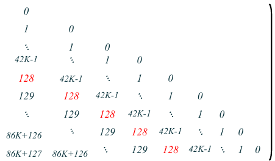
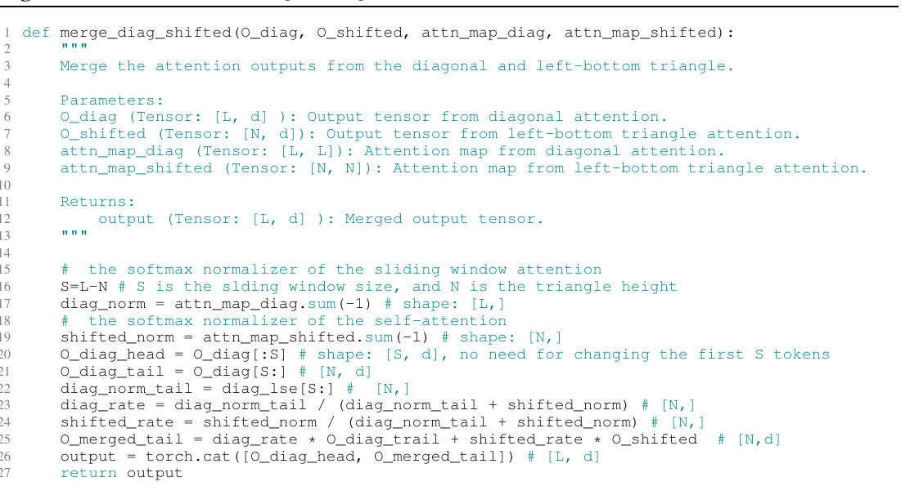

### TL;DR



Large language models (LLMs) don't use their full context window due to a skewed distribution of positional information during training.  The authors introduce STRING, a training-free method that shifts position embeddings to improve performance on long context tasks.  STRING dramatically improves performance on open-source LLMs, even outperforming some commercial models.




 &nbsp; read the paper on arXiv


#### Why does this paper matter?
This paper investigates why the effective context length of large language models (LLMs) falls short of their claimed context window size. The authors attribute this limitation to a left-skewed frequency distribution of relative positions in the LLM's pre-training data.  They propose STRING, a training-free method that shifts well-trained positions to enhance performance and demonstrate significant improvements in multiple LLMs on long-context benchmarks.  The findings highlight a critical limitation in current LLM designs and provide a potential solution.
#### Key Takeaways


 The effective context length of LLMs is often significantly less than their training length due to a left-skewed frequency distribution of relative positional indices. 



 STRING, a training-free method, shifts well-trained position embeddings to enhance performance within existing training lengths, improving long context capabilities without additional training. 



 The proposed STRING method achieves state-of-the-art results on popular long-context benchmarks for open-source LLMs, surpassing even some commercial models in performance. 


------
#### Visual Insights


| Model | Ltrain | ReRoPE | NTK | RoPE(origin) | Self-Extend | YaRN | DCA | STRING |
| --- | --- | --- | --- | --- | --- | --- | --- | --- |
| TinyLlama-1.3B (ours) | 2k | 62.8 | 62.0 | 56.6 | 60.2 | 68.6 | 74.4 | 84.6 |
| TinyLlama-1.1B-3T | 2k | 77.2 | 79.8 | 69.8 | 83.2 | 88.0 | 80.2 | 97.2 |
| Llama-2-7B | 4k | 98.6 | 98.6 | 98.0 | 95.4 | 98.0 | 91.6 | 100.0 |
| Llama-3-8B | 8k | 99.6 | 100.0 | 99.8 | 99.8 | 100.0 | 99.9 | 99.6 |
| LWM-7B-base | 32k | 25.2 | 19.4 | 31.8 | 29.0 | 22.2 | 28.8 | 50.4 |
| Mistral-7B-base | 32k | 54.5 | 42.2 | 52.8 | 54.2 | 48.2 | 64.2 | 73.0 |
| Llama-3.1-8B | 128k | 53.6 | 71.2 | 66.0 | 65.8 | 68.8 | 72.8 | 95.2 |
| Average | - | 67.3 | 67.6 | 67.8 | 69.6 | 70.5 | 73.1 | 85.7 |


------

More on figures

------

------

More on tables



















------

