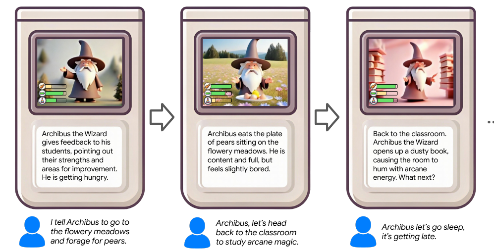
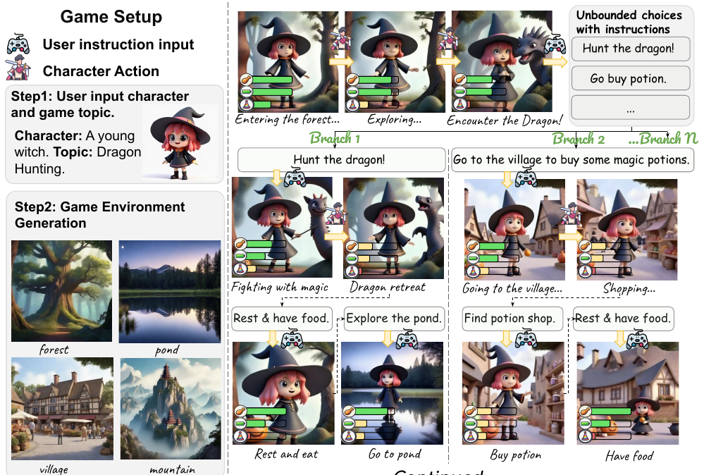
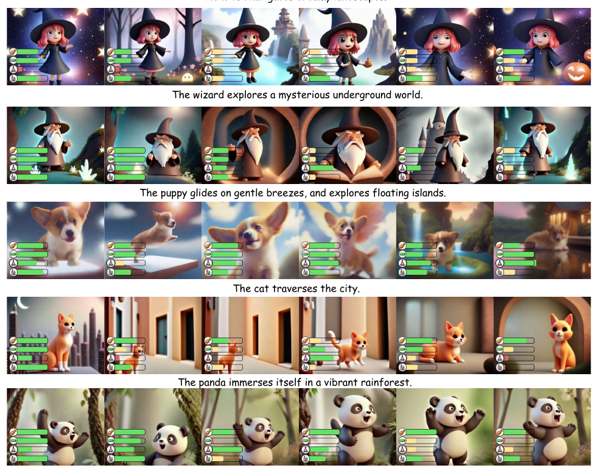

### TL;DR



UNBOUNDED is a novel generative infinite game using AI to simulate character life in real-time. It overcomes limitations of traditional games by employing a specialized LLM for dynamic game mechanics and a new dynamic regional IP-Adapter for consistent visual generation of characters and environments.  The system is evaluated through qualitative and quantitative analysis, demonstrating significant improvements over previous approaches. 




 &nbsp; read the paper on arXiv


#### Why does this paper matter?
This paper introduces UNBOUNDED, a generative infinite game using LLMs and diffusion models for real-time character life simulation.  It addresses challenges in generating consistent characters and environments across multiple scenes by introducing a novel dynamic regional IP-Adapter with block drop.  The authors also present a distilled LLM game engine for interactive gameplay, achieving interactive speeds by leveraging collaborative strong LLMs and distillation techniques.  The work pushes boundaries in generative game design and provides new technical innovations.
#### Key Takeaways


 UNBOUNDED, a generative infinite game that transcends traditional video game limitations using AI. 



 A novel dynamic regional IP-Adapter with block drop, ensuring consistent character and environment generation. 



 A distilled LLM game engine enabling real-time interactive gameplay with open-ended mechanics. 


------
#### Visual Insights


| Methods | Environment Consistency | Environment Consistency | Environment Consistency | Character Consistency | Character Consistency | Character Consistency | Semantic Alignment |
| --- | --- | --- | --- | --- | --- | --- | --- |
| Methods | CLIP-IE ↑ | DINOE ↑ | DreamSimE ↓ | CLIP-IC ↑ | DINOC ↑ | DreamSim� ↓ | CLIP-T↑ |
| IP-Adapter Ye et al.. 2023 | 0.470 | 0.381 | 0.595 | 0.366 | 0.139 | 0.832 | 0.168 |
| IP-Adapter-Instruct Kowles et al. 2024 | 0.334 | 0.151 | 0.832 | 0.246 | 0.124 | 0.872 | 0.098 |
| StoryDiffusion Zhou etal., 2024b | 0.528 | 0.257 | 0.733 | 0.629 | 0.464 | 0.545 | 0.242 |
| Ours | 0.563 | 0.322 | 0.675 | 0.676 | 0.470 | 0.488 | 0.242 |


------

More on figures

 Our overall image generation method. We achieve real-time image generation with LCM LORA, maintain character consistency with DreamBooth LoRAs, and introduce a regional IP-Adapter (shown in (c)) for improved environment and character consistency. (b) Our proposed dynamic mask generation separating the environment and character conditioning, preventing interference between the two.")

 We begin by collecting diverse topic and character data, filtered using ROUGE-L for diversity. (b) The World LLM and User LLM interact to generate user-simulation data through multi-round exchanges.")

------

------

More on tables










------

