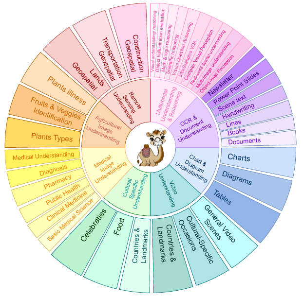
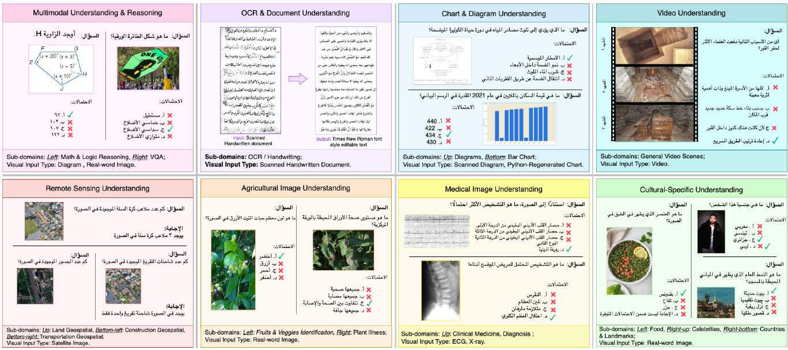
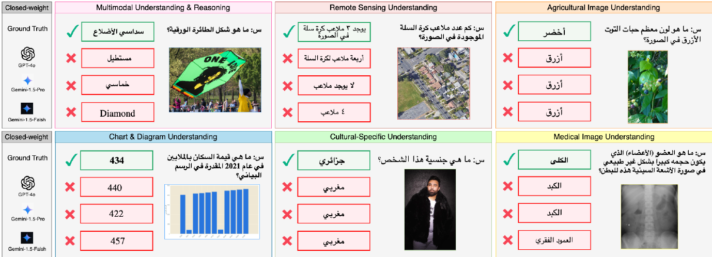

### TL;DR



CAMEL-Bench is a new open-source benchmark for evaluating large multimodal models in Arabic.  It addresses the lack of Arabic-centric LMM benchmarks by offering a diverse set of tasks across eight domains and 38 sub-domains, with over 29,000 high-quality questions.  Evaluation results highlight the need for substantial improvement in Arabic LMMs, especially among open-source models.




 &nbsp; read the paper on arXiv


#### Why does this paper matter?
CAMEL-Bench is a new, comprehensive benchmark for evaluating large multimodal models (LMMs) in Arabic.  Existing benchmarks are predominantly English-centric, limiting their applicability to other languages. CAMEL-Bench addresses this gap by providing a diverse set of tasks across eight domains and 38 sub-domains, with over 29,000 questions carefully curated by native Arabic speakers.  The benchmark's open-source nature facilitates further research and development in Arabic LMMs.
#### Key Takeaways


 CAMEL-Bench is the first comprehensive Arabic LMM benchmark, addressing the lack of Arabic-centric evaluation in the field. 



 The benchmark includes diverse tasks across eight domains and 38 sub-domains, offering a thorough evaluation of LMM capabilities. 



 CAMEL-Bench's open-source nature and detailed evaluation facilitate further research and development of Arabic LMMs. 


------
#### Visual Insights


| Domain/Characteristics | Exams-V* | CVQA* | Henna | KHATT | CAMEL-Bench (ours) |
| --- | --- | --- | --- | --- | --- |
| Multimodal Und. & Reasoning | V | X |  | X |  |
| OCR & Docs Und. | X | X | X | V |  |
| Charts & Diagrams Und. | V | X | X | X |  |
| Video Und. | X | X | X | X |  |
| Medical Image Und. | X | X | X | X |  |
| Agricultural Image Und. | X | X | X | X |  |
| Remote-Sensing Und. | X | X | X | X |  |
| Cultural-Specific Und. | X |  | V | X |  |
| Open Source Question Numbers | 823 | V 200 | X 1.1K | V 5K | 29K |


More on figures

, a 20% random sample undergoes manual verification; if errors are below 40%, the data passes; otherwise, the entire sub-category is reviewed. For Translated Arabic (bottom row), We employ Qwen7B model [8] to assess semantic similarity between the original and translated question-answer pairs on fuzzy-basis evaluation. Pairs passing the evaluation proceed, while those that fail undergo manual review. Based on this, data may require Manual Handling for manual re-translation, Refine & Verify for refinement through the model, or Non-Translated Review where the data is re-sent for translation due to the absence of an Arabic version.")

------

More on tables

{{< table-caption caption="🔽 Table 2. Different data sources used for 38 sub-domains corresponding to eight domains, with around 29k questions in total. The different data sources include: MME [15], MMBench [30], MMT-Bench-MI [56], SEED [23], MMMU [58], MMMU-Pro [60], CountBench [39], POPE [26], MathVista [33], Exams-V (Arabic portion) [13], ScienceQA-IMG [32], GQA [20], VizWiz [10], VQAv2 [17], BLINK [16], MuirBench [50], COCO [27], Imagenet [14], Mocheg [55], Snli-Ve [54], Pinterest [42], RealWorldQA [53], PATS-01 [3], KHATT [34], PATD [40], Historical Arabic Handwritten Text Recognition Dataset [37], ISI-PPT-Dataset [52], EvArEST [18], MTVQA [49], ChartQA [35], IconQA [31], BEC-Arabic [47], Claude-3.5 [5], arab-celeb-dataset [36], arabic-food-101 [6], Countries and landmarks [41, 51, 57], Pexel [41], AgroGPT [7], GeoChat [22]. These data sources are carefully translated and verified to ensure quality and relevance." >}}
| Domains | Sub-Domains | Source | Number of Questions |
| --- | --- | --- | --- |
| Multimodal Understanding and Reasoning | Visual Understanding/ Reasoning | MME, MMBench, MMT-Bench-MI, SEED, MMMU | 3,971 |
| Multimodal Understanding and Reasoning | Object Hallucination Evaluation | CountBench, MMT-Bench-MI, POPE | 997 |
| Multimodal Understanding and Reasoning | Math and Logic Reasoning | MathVista | 531 |
| Multimodal Understanding and Reasoning | Scientific Reasoning | ScienceQA-IMG, Exams-V | 1,624 |
| Multimodal Understanding and Reasoning | Visual Question Answering | GQA, VizWiz, VQAv2 | 3,840 |
| Multimodal Understanding and Reasoning | InforGrahpics VQA | AI-Generated (GPT-4o), Pinterest | 120 |
| Multimodal Understanding and Reasoning | Complex Visual Perception | BLINK | 1,422 |
| Multimodal Understanding and Reasoning | Real-world Spatial Understanding | RealWorldQA | 624 |
| Multimodal Understanding and Reasoning | Multi-image Understanding | MMT-Bench-MI, MuirBench | 1,062 |
| Multimodal Understanding and Reasoning | Object-level Perception | COCO, ImageNet, Mocheg, Snli-Ve | 60 |
| OCR and Document Understanding | Scanned Documents (OCR) | ArabicDatasetOCR | 480 |
| OCR and Document Understanding | Scanned Documents (VQA) | MTVQA | 703 |
| OCR and Document Understanding | Scene Text (OCR) | EvArEST | 1,217 |
| OCR and Document Understanding | Books (OCR) | Historical Arabic Handwritten Text Recognition Dataset | 40 |
| OCR and Document Understanding | PowerPoint Slides (OCR) | ISI-PPT-Dataset | 2,354 |
| OCR and Document Understanding | PowerPoint Slides (VQA) | ISI-PPT-Dataset | 711 |
| OCR and Document Understanding | Handwriting (OCR) | KHATT Line | 1,400 |
| OCR and Document Understanding | Newsletters (OCR) | PATD | 506 |
| OCR and Document Understanding | Lines (OCR) | PATS-01 | 520 |
| Chart and Diagram Understanding | Charts | ChartQA | 745 |
| Chart and Diagram Understanding | Diagrams Understanding | MMMU (diagrams), ICON-QA, AI-Generated, Pinterest, BCE-Arabic | 1,994 |
| Chart and Diagram Understanding | Tables | BCE-Arabic, Excel | 81 |
| Video Understanding | Countries/ Landmarks | Pexel | 87 |
| Video Understanding | Cultural-Specific Occasions | Pexel | 24 |
| Video Understanding | General Video Scenes | Video-MME | 654 |
| Cultural Specific Understanding | Celebrities | arab-celeb-dataset | 444 |
| Cultural Specific Understanding | Food | arabic-food-101, Pexel | 347 |
| Cultural Specific Understanding | Countries/ Landmarks | Pexel | 494 |
| Medical Imaging Understanding | Basic Medical Science | MMMU, MMMU Pro | 89 |
| Medical Imaging Understanding | Clinical Medicine | MMMU, MMMU Pro | 83 |
| Medical Imaging Understanding | Public Health | MMMU, MMMU Pro | 87 |
| Medical Imaging Understanding | Pharmacy | MMMU, MMMU Pro | 82 |
| Medical Imaging Understanding | Diagnosis | MMMU, MMMU Pro | 87 |
| Medical Imaging Understanding | MMT-MI-Bench | 78 |  |
| Medical Imaging Understanding | Medical Understanding | 769 |  |
| Agricultural Image Understanding | Agriculture Image Understanding Remote Sensing Understanding | AgroGPT GeoChat | 709 |
| Remote Sensing Understanding Total | Remote Sensing Understanding Total | Remote Sensing Understanding Total | 29,036 |


{{< table-caption caption="🔽 Table 3. Performance comparison of different closed-and open-source LMMs on CAMEL-Bench. We present per-domain results of seven LMMs: GPT-40 [38], GPT-40-mini [38], Gemini-1.5-Pro [2], Gemini-1.5-Flash [2], Pangea-7B [59], Qwen2-VL [9], InternVL2-8B [11], and LLaVaNeXt-7B [29]. GPT-40 excels in most domains, while GPT-40-mini offers an impressive balance of performance and model size. All models struggle with remote sensing, medical imaging, OCR & document understanding, and general multimodal understanding and reasoning domains. Open-source models like InternVL2-8B and LLaVaNeXt-7B show a decline in performance across domains, with their best results in video understanding." >}}
| Method | MM Understanding & Reasoning | OCR & Document Understanding | Charts & Diagram Understanding | Video Understanding | Cultural Specific Understanding | Medical Imaging | Agro Specific | Remote Sensing Understanding |
| --- | --- | --- | --- | --- | --- | --- | --- | --- |
| GPT-4o | 57.90 | 59.11 | 73.57 | 74.27 | 80.86 | 49.90 | 80.75 | 22.85 |
| GPT-4o-mini | 48.82 | 42.89 | 64.98 | 68.11 | 65.92 | 47.37 | 79.58 | 16.93 |
| Gemini-1.5-Pro | 46.67 | 36.59 | 47.06 | 42.94 | 56.24 | 33.77 | 72.12 | 17.07 |
| Gemini-1.5-Flash | 45.58 | 33.59 | 48.25 | 53.31 | 46.54 | 42.86 | 76.06 | 14.95 |
| Pangea-7B | 40.09 | 26.47 | 38.87 | 49.01 | 20.34 | 31.99 | 74.51 | 6.67 |
| Qwen2-VL-2B | 40.59 | 25.68 | 27.83 | 38.90 | 34.27 | 29.12 | 52.02 | 12.56 |
| Intern VL2-8B | 30.41 | 15.91 | 30.27 | 51.42 | 20.88 | 29.48 | 44.47 | 5.36 |
| LLaVa-NeXt-7B | 26.33 | 19.12 | 27.56 | 44.90 | 28.30 | 22.54 | 42.00 | 8.33 |


------

### Full paper



  

  

  

  

  

  

  

  

  

  

